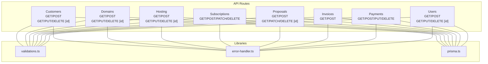
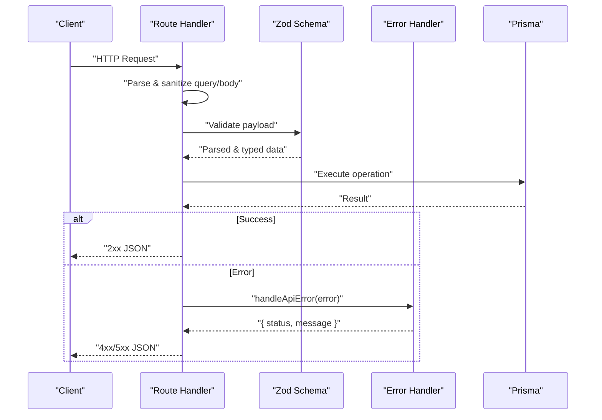
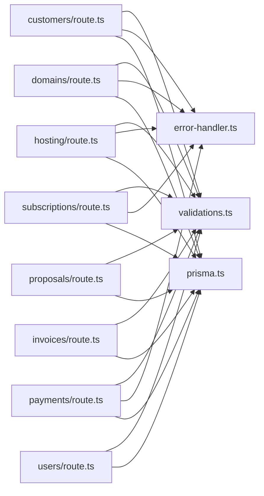

# API Reference

<cite>
**Referenced Files in This Document**
- [src/app/api/customers/route.ts](file://src/app/api/customers/route.ts)
- [src/app/api/customers/[id]/route.ts](file://src/app/api/customers/[id]/route.ts)
- [src/app/api/domains/route.ts](file://src/app/api/domains/route.ts)
- [src/app/api/domains/[id]/route.ts](file://src/app/api/domains/[id]/route.ts)
- [src/app/api/hosting/route.ts](file://src/app/api/hosting/route.ts)
- [src/app/api/hosting/[id]/route.ts](file://src/app/api/hosting/[id]/route.ts)
- [src/app/api/subscriptions/route.ts](file://src/app/api/subscriptions/route.ts)
- [src/app/api/proposals/route.ts](file://src/app/api/proposals/route.ts)
- [src/app/api/proposals/[id]/route.ts](file://src/app/api/proposals/[id]/route.ts)
- [src/app/api/invoices/route.ts](file://src/app/api/invoices/route.ts)
- [src/app/api/payments/route.ts](file://src/app/api/payments/route.ts)
- [src/app/api/users/route.ts](file://src/app/api/users/route.ts)
- [src/app/api/users/[id]/route.ts](file://src/app/api/users/[id]/route.ts)
- [src/lib/validations.ts](file://src/lib/validations.ts)
- [src/lib/error-handler.ts](file://src/lib/error-handler.ts)
- [src/lib/prisma.ts](file://src/lib/prisma.ts)
- [src/middleware.ts](file://src/middleware.ts)
- [README.md](file://README.md)
</cite>

## Table of Contents
1. [Introduction](#introduction)
2. [Project Structure](#project-structure)
3. [Core Components](#core-components)
4. [Architecture Overview](#architecture-overview)
5. [Detailed Component Analysis](#detailed-component-analysis)
6. [Dependency Analysis](#dependency-analysis)
7. [Performance Considerations](#performance-considerations)
8. [Troubleshooting Guide](#troubleshooting-guide)
9. [Conclusion](#conclusion)
10. [Appendices](#appendices)

## Introduction
This document describes the REST API for Customer WebMahsul. It covers all public API routes grouped by functional areas: customers, domains, hosting, subscriptions, proposals, invoices, payments, and users. For each endpoint, you will find HTTP methods, URL patterns, request/response schemas, authentication requirements, error handling, parameter validation rules, response codes, pagination/filtering/search capabilities, and example requests/responses. Security considerations, rate limiting, API versioning, and client integration guidelines are also included.

## Project Structure
The API is implemented as Next.js App Router API routes under src/app/api/. Each functional area has a dedicated route file (and often a nested [id] route for single-resource operations). Validation and error handling are centralized in shared libraries.

**Diagram sources**
- [src/app/api/customers/route.ts](file://src/app/api/customers/route.ts)
- [src/app/api/domains/route.ts](file://src/app/api/domains/route.ts)
- [src/app/api/hosting/route.ts](file://src/app/api/hosting/route.ts)
- [src/app/api/subscriptions/route.ts](file://src/app/api/subscriptions/route.ts)
- [src/app/api/proposals/route.ts](file://src/app/api/proposals/route.ts)
- [src/app/api/invoices/route.ts](file://src/app/api/invoices/route.ts)
- [src/app/api/payments/route.ts](file://src/app/api/payments/route.ts)
- [src/app/api/users/route.ts](file://src/app/api/users/route.ts)
- [src/lib/validations.ts](file://src/lib/validations.ts)
- [src/lib/error-handler.ts](file://src/lib/error-handler.ts)
- [src/lib/prisma.ts](file://src/lib/prisma.ts)

**Section sources**
- [src/app/api/customers/route.ts](file://src/app/api/customers/route.ts)
- [src/app/api/domains/route.ts](file://src/app/api/domains/route.ts)
- [src/app/api/hosting/route.ts](file://src/app/api/hosting/route.ts)
- [src/app/api/subscriptions/route.ts](file://src/app/api/subscriptions/route.ts)
- [src/app/api/proposals/route.ts](file://src/app/api/proposals/route.ts)
- [src/app/api/invoices/route.ts](file://src/app/api/invoices/route.ts)
- [src/app/api/payments/route.ts](file://src/app/api/payments/route.ts)
- [src/app/api/users/route.ts](file://src/app/api/users/route.ts)
- [src/lib/validations.ts](file://src/lib/validations.ts)
- [src/lib/error-handler.ts](file://src/lib/error-handler.ts)
- [src/lib/prisma.ts](file://src/lib/prisma.ts)

## Core Components
- Authentication: Not enforced at the API layer in the examined routes. Some routes rely on session-based auth via NextAuth elsewhere in the app (see middleware).
- Error handling: Centralized error handler returns structured JSON with status codes.
- Validation: Zod schemas drive request validation and parsing.
- Pagination: Implemented via page and limit query parameters with max limit enforcement.
- Filtering/Search: Implemented via query parameters (e.g., search, customerId, status, type).
- Rate limiting: Not implemented in the examined routes.

**Section sources**
- [src/lib/error-handler.ts](file://src/lib/error-handler.ts)
- [src/lib/validations.ts](file://src/lib/validations.ts)
- [src/middleware.ts](file://src/middleware.ts)

## Architecture Overview
The API follows a layered pattern:
- Route handlers parse queries, sanitize inputs, validate with Zod, and call Prisma.
- Errors are normalized via a shared error handler.
- Responses include pagination metadata where applicable.

**Diagram sources**
- [src/app/api/customers/route.ts](file://src/app/api/customers/route.ts)
- [src/app/api/invoices/route.ts](file://src/app/api/invoices/route.ts)
- [src/lib/validations.ts](file://src/lib/validations.ts)
- [src/lib/error-handler.ts](file://src/lib/error-handler.ts)
- [src/lib/prisma.ts](file://src/lib/prisma.ts)

## Detailed Component Analysis

### Customers
- Base collection: GET /api/customers, POST /api/customers
- Single resource: GET /api/customers/[id], PUT /api/customers/[id], DELETE /api/customers/[id]

Capabilities
- Pagination: page, limit (max 100)
- Search: search (full name, city, district)
- Filter: city, club
- Response includes counts and pagination metadata

Request/Response
- POST body validated against customer creation schema; returns 201 on success
- PUT body validated against customer update schema; partial updates supported
- DELETE returns deletion summary including note count

Error handling
- Standardized error responses with appropriate HTTP status codes

Example requests
- GET /api/customers?page=1&limit=10&search=john&city=istanbul
- POST /api/customers (payload validated by customerCreateSchema)
- PUT /api/customers/{id} (partial fields)
- DELETE /api/customers/{id}

Response codes
- 200 OK, 201 Created, 400 Bad Request, 404 Not Found, 500 Internal Server Error

**Section sources**
- [src/app/api/customers/route.ts](file://src/app/api/customers/route.ts)
- [src/app/api/customers/[id]/route.ts](file://src/app/api/customers/[id]/route.ts)
- [src/lib/validations.ts](file://src/lib/validations.ts)
- [src/lib/error-handler.ts](file://src/lib/error-handler.ts)

### Domains
- Base collection: GET /api/domains, POST /api/domains
- Single resource: GET /api/domains/[id], PUT /api/domains/[id], DELETE /api/domains/[id]

Capabilities
- Pagination: page, limit (max 100)
- Search: search (domain name)
- Filter: customerId
- Response includes pagination metadata

Request/Response
- POST body validated against domain creation schema; returns 201 on success
- PUT supports partial updates; dates are normalized server-side

Error handling
- Standardized error responses with appropriate HTTP status codes

Example requests
- GET /api/domains?page=1&limit=10&search=example.com&customerId={id}
- POST /api/domains (payload validated by domainCreateSchema)
- PUT /api/domains/{id} (partial fields)
- DELETE /api/domains/{id}

Response codes
- 200 OK, 201 Created, 400 Bad Request, 404 Not Found, 500 Internal Server Error

**Section sources**
- [src/app/api/domains/route.ts](file://src/app/api/domains/route.ts)
- [src/app/api/domains/[id]/route.ts](file://src/app/api/domains/[id]/route.ts)
- [src/lib/validations.ts](file://src/lib/validations.ts)
- [src/lib/error-handler.ts](file://src/lib/error-handler.ts)

### Hosting
- Base collection: GET /api/hosting, POST /api/hosting
- Single resource: GET /api/hosting/[id], PUT /api/hosting/[id], DELETE /api/hosting/[id]

Capabilities
- Pagination: page, limit (max 100)
- Search: search (hosting name)
- Filter: customerId
- Response includes pagination metadata

Request/Response
- POST body validated against hosting creation schema; returns 201 on success
- PUT supports partial updates; end date normalized server-side

Error handling
- Standardized error responses with appropriate HTTP status codes

Example requests
- GET /api/hosting?page=1&limit=10&search=shared&customerId={id}
- POST /api/hosting (payload validated by hostingCreateSchema)
- PUT /api/hosting/{id} (partial fields)
- DELETE /api/hosting/{id}

Response codes
- 200 OK, 201 Created, 400 Bad Request, 404 Not Found, 500 Internal Server Error

**Section sources**
- [src/app/api/hosting/route.ts](file://src/app/api/hosting/route.ts)
- [src/app/api/hosting/[id]/route.ts](file://src/app/api/hosting/[id]/route.ts)
- [src/lib/validations.ts](file://src/lib/validations.ts)
- [src/lib/error-handler.ts](file://src/lib/error-handler.ts)

### Subscriptions
- Base collection: GET /api/subscriptions, POST /api/subscriptions, PATCH /api/subscriptions, DELETE /api/subscriptions?id={id}

Capabilities
- Pagination: page, limit (max 100)
- Search: search (name)
- Filter: customerId
- Response includes pagination metadata and customer name for listing

Request/Response
- POST body validated against subscription creation schema; name auto-generated if missing; returns 201 on success
- PATCH body validated against subscription update schema; supports partial updates
- DELETE accepts id via query or body; returns deleted record

Error handling
- Standardized error responses with appropriate HTTP status codes

Example requests
- GET /api/subscriptions?page=1&limit=10&search=software&customerId={id}
- POST /api/subscriptions (payload validated by subscriptionCreateSchema)
- PATCH /api/subscriptions (payload validated by subscriptionUpdateSchema)
- DELETE /api/subscriptions?id={id}

Response codes
- 200 OK, 201 Created, 400 Bad Request, 404 Not Found, 500 Internal Server Error

**Section sources**
- [src/app/api/subscriptions/route.ts](file://src/app/api/subscriptions/route.ts)
- [src/lib/validations.ts](file://src/lib/validations.ts)
- [src/lib/error-handler.ts](file://src/lib/error-handler.ts)

### Proposals
- Base collection: GET /api/proposals, POST /api/proposals
- Single resource: GET /api/proposals/[id], PATCH /api/proposals/[id], DELETE /api/proposals/[id]

Capabilities
- Pagination: page, limit
- Filters: status, type, customerId
- Search: search (title, description)
- Response includes customer and items with product details

Request/Response
- POST body validated against proposal creation schema; generates proposal number (T-YYYY-NNNNNN); returns 201 on success
- PATCH supports selective field updates; dates normalized server-side
- DELETE removes the proposal

Error handling
- Standardized error responses with appropriate HTTP status codes

Example requests
- GET /api/proposals?page=1&limit=10&status=DRAFT&type=SUBSCRIPTION&customerId={id}&search=software
- POST /api/proposals (payload validated by proposalCreateSchema)
- PATCH /api/proposals/{id} (selective fields)
- DELETE /api/proposals/{id}

Response codes
- 200 OK, 201 Created, 400 Bad Request, 404 Not Found, 500 Internal Server Error

**Section sources**
- [src/app/api/proposals/route.ts](file://src/app/api/proposals/route.ts)
- [src/app/api/proposals/[id]/route.ts](file://src/app/api/proposals/[id]/route.ts)
- [src/lib/validations.ts](file://src/lib/validations.ts)

### Invoices
- Base collection: GET /api/invoices, POST /api/invoices

Capabilities
- Filters: customerId, status, search (number, customer full name)
- Response includes customer, proposal, and counts

Request/Response
- POST body validated against invoice schema; generates invoice number (F-YYYY-NNNNNN); computes subtotal, tax, total; returns 201 on success
- GET returns list with optional filters

Error handling
- Standardized error responses with appropriate HTTP status codes

Example requests
- GET /api/invoices?customerId={id}&status=DRAFT&search=F-2024
- POST /api/invoices (payload validated by invoiceSchema)

Response codes
- 200 OK, 201 Created, 400 Bad Request, 500 Internal Server Error

**Section sources**
- [src/app/api/invoices/route.ts](file://src/app/api/invoices/route.ts)
- [src/lib/validations.ts](file://src/lib/validations.ts)

### Payments
- Base collection: GET /api/payments, POST /api/payments, PUT /api/payments, DELETE /api/payments?id={id}

Capabilities
- Pagination: page, limit (max 100)
- Filters: customerId, subscriptionId, status, currency, dueDateFrom, dueDateTo
- Response includes pagination metadata

Request/Response
- POST body validated against payment creation schema; normalizes dates and status; returns 201 on success
- PUT supports partial updates; accepts id via query or body
- DELETE accepts id via query or body; returns success message

Error handling
- Standardized error responses with appropriate HTTP status codes

Example requests
- GET /api/payments?page=1&limit=10&customerId={id}&subscriptionId={id}&status=PENDING&currency=TRY&dueDateFrom=2025-01-01&dueDateTo=2025-12-31
- POST /api/payments (payload validated by paymentCreateSchema)
- PUT /api/payments?id={id} (partial fields)
- DELETE /api/payments?id={id}

Response codes
- 200 OK, 201 Created, 400 Bad Request, 404 Not Found, 500 Internal Server Error

**Section sources**
- [src/app/api/payments/route.ts](file://src/app/api/payments/route.ts)
- [src/lib/validations.ts](file://src/lib/validations.ts)
- [src/lib/error-handler.ts](file://src/lib/error-handler.ts)

### Users
- Base collection: GET /api/users, POST /api/users
- Single resource: GET /api/users/[id], PUT /api/users/[id], DELETE /api/users/[id]

Capabilities
- Response ordered by creation date desc
- POST enforces unique username and hashes passwords

Request/Response
- POST body validated against user creation schema; returns 201 on success
- PUT supports selective updates; validates uniqueness of username across records

Error handling
- Standardized error responses with appropriate HTTP status codes

Example requests
- GET /api/users
- POST /api/users (payload validated by userCreateSchema)
- PUT /api/users/{id} (partial fields)
- DELETE /api/users/{id}

Response codes
- 200 OK, 201 Created, 400 Bad Request, 404 Not Found, 409 Conflict, 500 Internal Server Error

**Section sources**
- [src/app/api/users/route.ts](file://src/app/api/users/route.ts)
- [src/app/api/users/[id]/route.ts](file://src/app/api/users/[id]/route.ts)
- [src/lib/validations.ts](file://src/lib/validations.ts)

## Dependency Analysis
- Route handlers depend on:
  - Zod schemas for validation
  - Shared error handler for consistent responses
  - Prisma client for database operations

**Diagram sources**
- [src/app/api/customers/route.ts](file://src/app/api/customers/route.ts)
- [src/app/api/domains/route.ts](file://src/app/api/domains/route.ts)
- [src/app/api/hosting/route.ts](file://src/app/api/hosting/route.ts)
- [src/app/api/subscriptions/route.ts](file://src/app/api/subscriptions/route.ts)
- [src/app/api/proposals/route.ts](file://src/app/api/proposals/route.ts)
- [src/app/api/invoices/route.ts](file://src/app/api/invoices/route.ts)
- [src/app/api/payments/route.ts](file://src/app/api/payments/route.ts)
- [src/app/api/users/route.ts](file://src/app/api/users/route.ts)
- [src/lib/validations.ts](file://src/lib/validations.ts)
- [src/lib/error-handler.ts](file://src/lib/error-handler.ts)
- [src/lib/prisma.ts](file://src/lib/prisma.ts)

**Section sources**
- [src/app/api/customers/route.ts](file://src/app/api/customers/route.ts)
- [src/app/api/domains/route.ts](file://src/app/api/domains/route.ts)
- [src/app/api/hosting/route.ts](file://src/app/api/hosting/route.ts)
- [src/app/api/subscriptions/route.ts](file://src/app/api/subscriptions/route.ts)
- [src/app/api/proposals/route.ts](file://src/app/api/proposals/route.ts)
- [src/app/api/invoices/route.ts](file://src/app/api/invoices/route.ts)
- [src/app/api/payments/route.ts](file://src/app/api/payments/route.ts)
- [src/app/api/users/route.ts](file://src/app/api/users/route.ts)
- [src/lib/validations.ts](file://src/lib/validations.ts)
- [src/lib/error-handler.ts](file://src/lib/error-handler.ts)
- [src/lib/prisma.ts](file://src/lib/prisma.ts)

## Performance Considerations
- Pagination: Enforced with page and limit; max limit applied to prevent oversized responses.
- Parallel queries: Many endpoints use Promise.all for count and list retrieval.
- Indexes: Ensure database indexes exist for filtered/sorted fields (customerId, status, type, createdAt).
- Payload size: Keep request bodies minimal; avoid unnecessary fields.

[No sources needed since this section provides general guidance]

## Troubleshooting Guide
Common issues and resolutions
- Validation errors: Expect 400 with details when request fails schema validation.
- Not found: 404 responses when resources do not exist.
- Server errors: 500 responses with generic messages; check server logs.
- Rate limiting: Not implemented; consider adding quotas or middleware if needed.

**Section sources**
- [src/lib/error-handler.ts](file://src/lib/error-handler.ts)
- [src/app/api/customers/route.ts](file://src/app/api/customers/route.ts)
- [src/app/api/invoices/route.ts](file://src/app/api/invoices/route.ts)

## Conclusion
The Customer WebMahsul API provides comprehensive CRUD and query capabilities across customers, domains, hosting, subscriptions, proposals, invoices, payments, and users. It emphasizes consistent validation, pagination, filtering, and standardized error handling. For production use, consider implementing authentication, rate limiting, and input sanitization at the gateway or middleware level.

[No sources needed since this section summarizes without analyzing specific files]

## Appendices

### Authentication and Authorization
- Session-based authentication via NextAuth is used in the application; API routes do not enforce auth directly in the examined files.
- Recommended: Add middleware to require authentication and role checks for protected endpoints.

**Section sources**
- [src/middleware.ts](file://src/middleware.ts)

### API Versioning
- No explicit versioning scheme is present in the examined routes.
- Recommendation: Use URL versioning (e.g., /api/v1/) or Accept headers for future-proofing.

**Section sources**
- [README.md](file://README.md)

### Rate Limiting
- Not implemented in the examined routes.
- Recommendation: Integrate a rate-limiting middleware or service to protect endpoints.

**Section sources**
- [src/middleware.ts](file://src/middleware.ts)

### Pagination, Filtering, and Search
- Pagination: page, limit (max 100)
- Filtering: Depends on resource (e.g., customerId, status, type, currency)
- Search: Insensitive substring match on relevant fields (e.g., name, title, description, number, fullName)

**Section sources**
- [src/app/api/customers/route.ts](file://src/app/api/customers/route.ts)
- [src/app/api/domains/route.ts](file://src/app/api/domains/route.ts)
- [src/app/api/hosting/route.ts](file://src/app/api/hosting/route.ts)
- [src/app/api/subscriptions/route.ts](file://src/app/api/subscriptions/route.ts)
- [src/app/api/proposals/route.ts](file://src/app/api/proposals/route.ts)
- [src/app/api/invoices/route.ts](file://src/app/api/invoices/route.ts)
- [src/app/api/payments/route.ts](file://src/app/api/payments/route.ts)

### Example Requests and Responses
- GET /api/customers?page=1&limit=10&search=john&city=istanbul
- POST /api/customers {"fullName":"John Doe","city":"Istanbul","district":"Kadıköy"}
- PUT /api/customers/{id} {"city":"Ankara"}
- DELETE /api/customers/{id}
- GET /api/domains?page=1&limit=10&search=example.com&customerId={id}
- POST /api/domains {"name":"example.com","customerId":"...","registerDate":"2025-01-01","renewDate":"2026-01-01"}
- PUT /api/domains/{id} {"notes":"Updated"}
- DELETE /api/domains/{id}
- GET /api/hosting?page=1&limit=10&search=shared&customerId={id}
- POST /api/hosting {"name":"Shared Plan","customerId":"...","endDate":"2026-01-01"}
- PUT /api/hosting/{id} {"notes":"Updated"}
- DELETE /api/hosting/{id}
- GET /api/subscriptions?page=1&limit=10&search=software&customerId={id}
- POST /api/subscriptions {"name":"Software","price":100,"startDate":"2025-01-01","endDate":"2026-01-01","types":["SOFTWARE_RENTAL"],"period":"MONTHLY","status":"ACTIVE"}
- PATCH /api/subscriptions {"id":"...","price":120}
- DELETE /api/subscriptions?id={id}
- GET /api/proposals?page=1&limit=10&status=DRAFT&type=SUBSCRIPTION&customerId={id}&search=software
- POST /api/proposals {"customerId":"...","title":"Software Quote","type":"SUBSCRIPTION","amount":1000,"currency":"TRY","validUntil":"2025-12-31","items":[{"productId":"...","description":"Service","quantity":1,"unitPrice":1000,"totalPrice":1000}]}
- PATCH /api/proposals/{id} {"status":"APPROVED"}
- DELETE /api/proposals/{id}
- GET /api/invoices?customerId={id}&status=DRAFT&search=F-2024
- POST /api/invoices {"customerId":"...","type":"SALE","issueDate":"2025-01-01T00:00:00Z","dueDate":"2025-01-31T00:00:00Z","taxRate":20,"items":[{"description":"Product","quantity":1,"unitPrice":1000,"totalPrice":1000}]}
- GET /api/payments?page=1&limit=10&customerId={id}&subscriptionId={id}&status=PENDING&currency=TRY&dueDateFrom=2025-01-01&dueDateTo=2025-12-31
- POST /api/payments {"customerId":"...","subscriptionId":"...","amount":"1000","currency":"TRY","dueDate":"2025-01-31","status":"PENDING"}
- PUT /api/payments?id={id} {"paidDate":"2025-01-15","status":"PAID"}
- DELETE /api/payments?id={id}
- GET /api/users
- POST /api/users {"username":"john","password":"SecurePass!123","fullName":"John Doe","email":"john@example.com","isActive":true}
- PUT /api/users/{id} {"email":"john.doe@example.com","isActive":false}
- DELETE /api/users/{id}

[No sources needed since this section lists examples without quoting code]