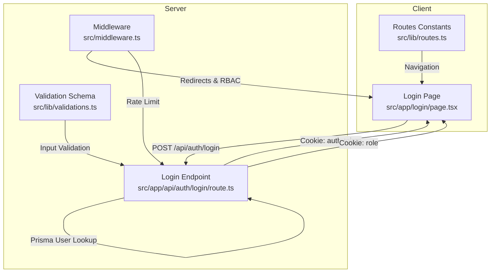
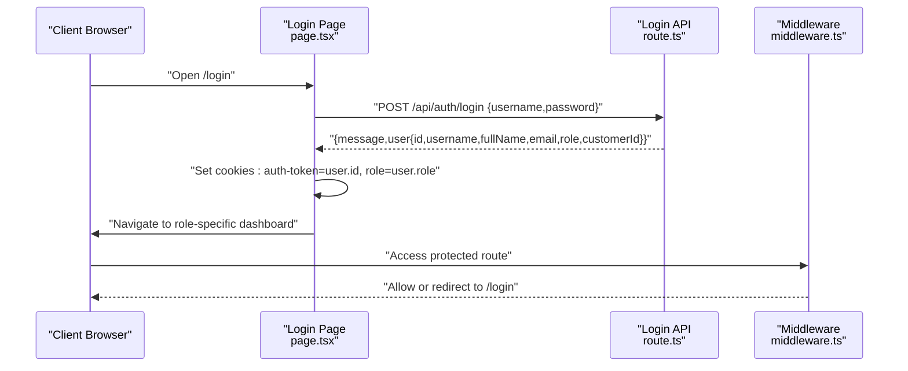
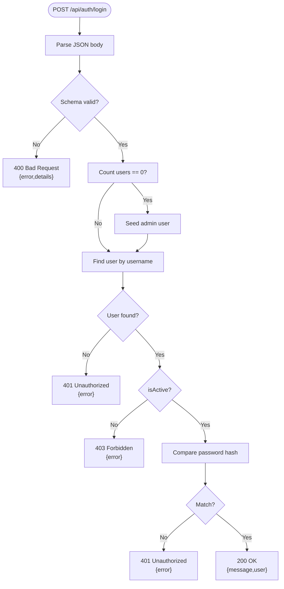
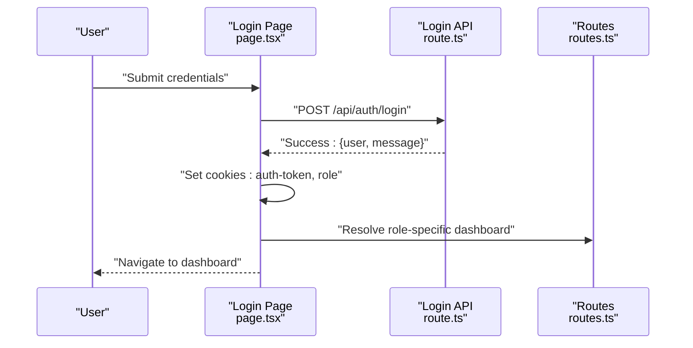
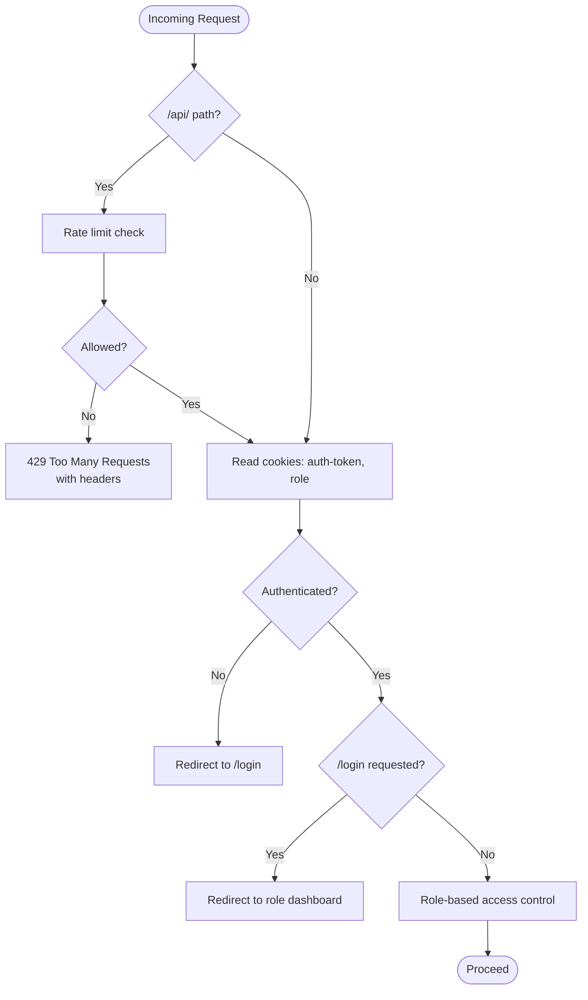
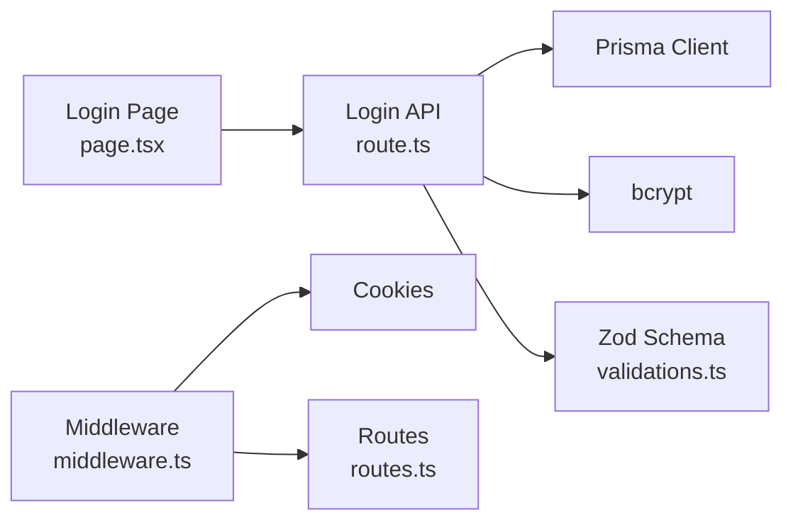

# Authentication API

<cite>
**Referenced Files in This Document**
- [route.ts](file://src/app/api/auth/login/route.ts)
- [page.tsx](file://src/app/login/page.tsx)
- [middleware.ts](file://src/middleware.ts)
- [routes.ts](file://src/lib/routes.ts)
- [validations.ts](file://src/lib/validations.ts)
- [auth.ts](file://src/lib/auth.ts)
</cite>

## Table of Contents
1. [Introduction](#introduction)
2. [Project Structure](#project-structure)
3. [Core Components](#core-components)
4. [Architecture Overview](#architecture-overview)
5. [Detailed Component Analysis](#detailed-component-analysis)
6. [Dependency Analysis](#dependency-analysis)
7. [Performance Considerations](#performance-considerations)
8. [Troubleshooting Guide](#troubleshooting-guide)
9. [Conclusion](#conclusion)
10. [Appendices](#appendices)

## Introduction
This document provides API documentation for the authentication endpoints in the application. It covers:
- Credential-based login endpoint for user authentication
- Session management via cookies
- Role-based routing and middleware protection
- Request/response schemas and error handling
- Security considerations and client-side implementation guidance

It also clarifies the current state of NextAuth.js integration: while NextAuth.js is present in the project dependencies, the implementation uses a custom credential-based login endpoint and cookie-based session storage. No NextAuth.js endpoints are exposed under the Next.js App Router API in the analyzed code.

## Project Structure
The authentication system comprises:
- A credential-based login API endpoint under the App Router
- A client-side login page that calls the login endpoint
- Middleware enforcing authentication and role-based access control
- Shared route constants used by the client after successful login
- Validation schemas for request payloads
- A small admin authentication utility module (client-side session helpers)

**Diagram sources**
- [route.ts:1-86](file://src/app/api/auth/login/route.ts#L1-L86)
- [page.tsx:1-144](file://src/app/login/page.tsx#L1-L144)
- [middleware.ts:1-101](file://src/middleware.ts#L1-L101)
- [routes.ts:1-43](file://src/lib/routes.ts#L1-L43)
- [validations.ts:87-90](file://src/lib/validations.ts#L87-L90)

**Section sources**
- [route.ts:1-86](file://src/app/api/auth/login/route.ts#L1-L86)
- [page.tsx:1-144](file://src/app/login/page.tsx#L1-L144)
- [middleware.ts:1-101](file://src/middleware.ts#L1-L101)
- [routes.ts:1-43](file://src/lib/routes.ts#L1-L43)
- [validations.ts:87-90](file://src/lib/validations.ts#L87-L90)

## Core Components
- Login API endpoint
  - Method: POST
  - Path: /api/auth/login
  - Purpose: Authenticate users with username/password and return user metadata
  - Cookies set: auth-token (user id), role
- Client login page
  - Submits credentials to the login endpoint
  - On success, sets cookies and navigates to role-specific dashboards
- Middleware
  - Enforces authentication for protected routes
  - Implements rate limiting for API endpoints
  - Redirects unauthenticated users to /login
  - Applies role-based access control (admin vs portal)
- Route constants
  - Provides role-aware navigation targets after login

**Section sources**
- [route.ts:7-86](file://src/app/api/auth/login/route.ts#L7-L86)
- [page.tsx:21-62](file://src/app/login/page.tsx#L21-L62)
- [middleware.ts:31-80](file://src/middleware.ts#L31-L80)
- [routes.ts:1-43](file://src/lib/routes.ts#L1-L43)

## Architecture Overview
The authentication flow combines a custom login endpoint with cookie-based sessions and middleware-driven protection.

**Diagram sources**
- [page.tsx:33-62](file://src/app/login/page.tsx#L33-L62)
- [route.ts:7-86](file://src/app/api/auth/login/route.ts#L7-L86)
- [middleware.ts:31-80](file://src/middleware.ts#L31-L80)

## Detailed Component Analysis

### Login Endpoint: POST /api/auth/login
- Purpose: Authenticate a user with username and password
- Request body schema (validated):
  - username: string (required)
  - password: string (required)
- Response payload on success:
  - message: string
  - user: object containing id, username, fullName, email, isActive, role, customerId
- Response payload on failure:
  - error: string describing the issue
- Status codes:
  - 200 OK on successful authentication
  - 400 Bad Request for invalid input schema
  - 401 Unauthorized for invalid credentials
  - 403 Forbidden for inactive accounts
  - 500 Internal Server Error for unexpected errors
- Behavior:
  - Validates input against the login schema
  - Seeds an admin user if none exists
  - Looks up user by username
  - Checks account activity
  - Compares password hash
  - Returns user data without sensitive fields

**Diagram sources**
- [route.ts:7-86](file://src/app/api/auth/login/route.ts#L7-L86)
- [validations.ts:87-90](file://src/lib/validations.ts#L87-L90)

**Section sources**
- [route.ts:7-86](file://src/app/api/auth/login/route.ts#L7-L86)
- [validations.ts:87-90](file://src/lib/validations.ts#L87-L90)

### Client-Side Login Workflow
- The login page collects username and password
- On submit, it calls the login endpoint
- On success:
  - Sets auth-token and role cookies
  - Navigates to role-specific dashboard using route constants
- On failure:
  - Displays error message returned by the endpoint

**Diagram sources**
- [page.tsx:21-62](file://src/app/login/page.tsx#L21-L62)
- [route.ts:75-78](file://src/app/api/auth/login/route.ts#L75-L78)
- [routes.ts:4-29](file://src/lib/routes.ts#L4-L29)

**Section sources**
- [page.tsx:21-62](file://src/app/login/page.tsx#L21-L62)
- [routes.ts:1-43](file://src/lib/routes.ts#L1-L43)

### Middleware and Session Management
- Authentication detection:
  - Reads auth-token and role cookies
  - Treats presence of both as authenticated
- Redirects:
  - Unauthenticated users accessing non-API pages are redirected to /login
  - Authenticated users trying to reach /login are redirected to their role dashboard
- Role-based access control:
  - /admin routes require ADMIN or SUPPORT roles
  - /portal routes require CUSTOMER role
- Rate limiting:
  - API endpoints are rate-limited (window-based)
  - Returns X-RateLimit-* headers and Retry-After on 429

**Diagram sources**
- [middleware.ts:31-80](file://src/middleware.ts#L31-L80)

**Section sources**
- [middleware.ts:31-94](file://src/middleware.ts#L31-L94)

### NextAuth.js Integration Notes
- The project depends on NextAuth.js, but no NextAuth.js endpoints are exposed under the App Router in the analyzed code.
- The current implementation uses a custom login endpoint and cookie-based sessions.
- If integrating NextAuth.js endpoints, they would typically be placed under src/app/api/auth/[...nextauth]/route.ts and configured via environment variables (NEXTAUTH_SECRET, NEXTAUTH_URL).

[No sources needed since this section clarifies absence of NextAuth.js endpoints in the analyzed code]

## Dependency Analysis
- The login endpoint depends on:
  - Prisma for user lookup
  - bcrypt for password comparison
  - Zod schema for input validation
- The client login page depends on:
  - The login endpoint
  - Route constants for navigation
- Middleware depends on:
  - Cookie parsing for auth-token and role
  - Rate-limiting logic
  - Role-based redirection rules

**Diagram sources**
- [page.tsx:33-62](file://src/app/login/page.tsx#L33-L62)
- [route.ts:1-5](file://src/app/api/auth/login/route.ts#L1-L5)
- [validations.ts:87-90](file://src/lib/validations.ts#L87-L90)
- [middleware.ts:31-37](file://src/middleware.ts#L31-L37)

**Section sources**
- [page.tsx:33-62](file://src/app/login/page.tsx#L33-L62)
- [route.ts:1-5](file://src/app/api/auth/login/route.ts#L1-L5)
- [validations.ts:87-90](file://src/lib/validations.ts#L87-L90)
- [middleware.ts:31-37](file://src/middleware.ts#L31-L37)

## Performance Considerations
- Rate limiting:
  - API endpoints are rate-limited to 100 requests per minute per IP
  - Clients should handle 429 responses gracefully and back off
- Password hashing:
  - bcrypt is used for secure password verification
- Database queries:
  - Single user lookup by username; consider indexing username for scalability
- Cookie size:
  - Cookies carry minimal data (user id and role); keep payloads small

[No sources needed since this section provides general guidance]

## Troubleshooting Guide
Common error responses and causes:
- 400 Bad Request
  - Cause: Invalid input schema (missing or malformed fields)
  - Action: Validate username and password fields on the client
- 401 Unauthorized
  - Cause: Nonexistent user or incorrect password
  - Action: Prompt user to re-enter credentials
- 403 Forbidden
  - Cause: Account is inactive
  - Action: Contact administrator to activate the account
- 500 Internal Server Error
  - Cause: Unexpected server error during login
  - Action: Check server logs and retry

Session and navigation issues:
- Not redirected after login
  - Verify cookies auth-token and role are set
  - Confirm middleware reads cookies correctly
- Incorrect role dashboard
  - Ensure role cookie equals ADMIN/SUPPORT/CUSTOMER
- Access denied to protected routes
  - Ensure authentication cookies are present and valid

**Section sources**
- [route.ts:12-18](file://src/app/api/auth/login/route.ts#L12-L18)
- [route.ts:39-44](file://src/app/api/auth/login/route.ts#L39-L44)
- [route.ts:46-52](file://src/app/api/auth/login/route.ts#L46-L52)
- [route.ts:79-85](file://src/app/api/auth/login/route.ts#L79-L85)
- [middleware.ts:31-80](file://src/middleware.ts#L31-L80)

## Conclusion
The application implements a straightforward, cookie-based authentication system:
- A single credential-based login endpoint validates input, authenticates users, and returns role-aware user data
- Middleware enforces authentication and role-based access control
- The client sets cookies and navigates to appropriate dashboards upon success
- NextAuth.js is present as a dependency but not integrated under the App Router in the analyzed code

This design is simple and effective for the current scope. For enhanced security and scalability, consider migrating to NextAuth.js endpoints, implementing token refresh, and adding account lockout policies.

[No sources needed since this section summarizes without analyzing specific files]

## Appendices

### API Reference: Login Endpoint
- Method: POST
- URL: /api/auth/login
- Content-Type: application/json
- Request body:
  - username: string (required)
  - password: string (required)
- Success response (200):
  - message: string
  - user: { id, username, fullName, email, isActive, role, customerId }
- Error responses:
  - 400 Bad Request: { error, details }
  - 401 Unauthorized: { error }
  - 403 Forbidden: { error }
  - 500 Internal Server Error: { error }

**Section sources**
- [route.ts:7-86](file://src/app/api/auth/login/route.ts#L7-L86)
- [validations.ts:87-90](file://src/lib/validations.ts#L87-L90)

### Client Implementation Examples
- Example fetch call to login:
  - Method: POST
  - Headers: Content-Type: application/json
  - Body: { username, password }
  - On success: set cookies auth-token and role, navigate to role-specific dashboard
- Example cookie handling:
  - Set auth-token=user.id and role=user.role with max-age suitable for session length
- Example navigation:
  - ADMIN/SUPPORT → /admin/dashboard
  - CUSTOMER → /portal/dashboard

**Section sources**
- [page.tsx:33-62](file://src/app/login/page.tsx#L33-L62)
- [routes.ts:4-29](file://src/lib/routes.ts#L4-L29)

### Security Considerations
- Transport security:
  - Use HTTPS in production to protect cookies and tokens
- Cookie attributes:
  - Consider SameSite, Secure, and HttpOnly flags for cookies
- Rate limiting:
  - Middleware applies per-IP rate limits for API endpoints
- Input validation:
  - Zod schema ensures minimal and valid payloads
- Password storage:
  - bcrypt is used for secure verification

**Section sources**
- [middleware.ts:40-54](file://src/middleware.ts#L40-L54)
- [route.ts:54-62](file://src/app/api/auth/login/route.ts#L54-L62)
- [validations.ts:87-90](file://src/lib/validations.ts#L87-L90)

### Admin Panel Utilities (Client-Side)
- Utility functions for admin panel session:
  - validateAdminCredentials
  - setAdminSession
  - clearAdminSession
  - isAdminAuthenticated
- Note: These are separate from the main login endpoint and cookie-based session

**Section sources**
- [auth.ts:1-35](file://src/lib/auth.ts#L1-L35)