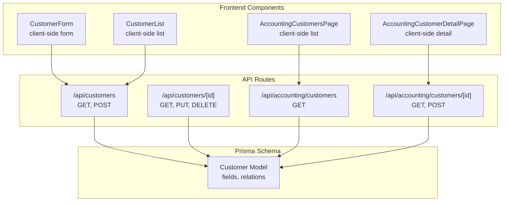
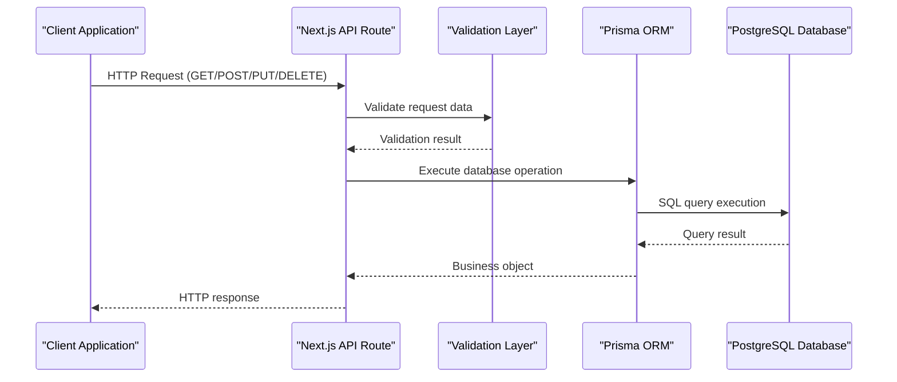
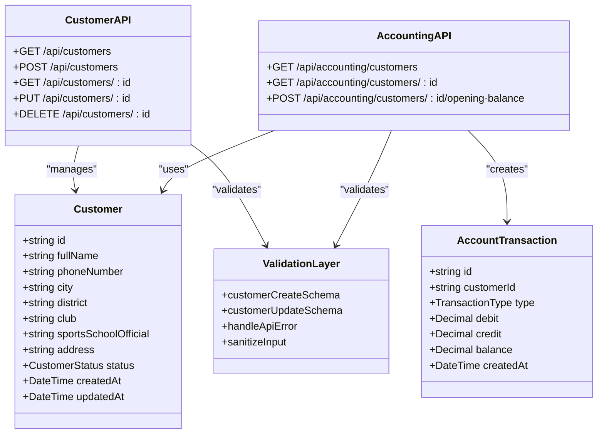

# Customer Management API

<cite>
**Referenced Files in This Document**
- [schema.prisma](file://prisma/schema.prisma)
- [customers.route.ts](file://src/app/api/customers/route.ts)
- [customers.[id].route.ts](file://src/app/api/customers/[id]/route.ts)
- [accounting.customers.route.ts](file://src/app/api/accounting/customers/route.ts)
- [accounting.customers.[id].route.ts](file://src/app/api/accounting/customers/[id]/route.ts)
- [validations.ts](file://src/lib/validations.ts)
- [error-handler.ts](file://src/lib/error-handler.ts)
- [types.ts](file://src/lib/types.ts)
- [customer-form.tsx](file://src/components/customer-form.tsx)
- [customer-list.tsx](file://src/components/customer-list.tsx)
- [accounting.customers.page.tsx](file://src/app/admin/accounting/customers/page.tsx)
- [accounting.customers.[id].page.tsx](file://src/app/admin/accounting/customers/[id]/page.tsx)
</cite>

## Table of Contents
1. [Introduction](#introduction)
2. [Project Structure](#project-structure)
3. [Core Components](#core-components)
4. [Architecture Overview](#architecture-overview)
5. [Detailed Component Analysis](#detailed-component-analysis)
6. [Dependency Analysis](#dependency-analysis)
7. [Performance Considerations](#performance-considerations)
8. [Troubleshooting Guide](#troubleshooting-guide)
9. [Conclusion](#conclusion)

## Introduction
This document provides comprehensive API documentation for customer management endpoints in the customer.webmahsul application. It covers CRUD operations for customer records, including creation, retrieval, updates, and deletion. The documentation specifies request/response schemas with customer fields, contact information, and status tracking. It also documents filtering, sorting, and pagination parameters, along with accounting-specific customer endpoints for financial reporting. Examples of customer creation workflows, bulk operations, and data validation rules are included to help developers integrate with the API effectively.

## Project Structure
The customer management functionality is implemented using Next.js API routes and integrates with Prisma ORM for database operations. The API exposes two primary sets of endpoints:
- General customer management endpoints under `/api/customers`
- Accounting-specific customer endpoints under `/api/accounting/customers`



**Diagram sources**
- [customers.route.ts:1-105](file://src/app/api/customers/route.ts#L1-L105)
- [customers.[id].route.ts](file://src/app/api/customers/[id]/route.ts#L1-L121)
- [accounting.customers.route.ts:1-54](file://src/app/api/accounting/customers/route.ts#L1-L54)
- [accounting.customers.[id].route.ts](file://src/app/api/accounting/customers/[id]/route.ts#L1-L139)

**Section sources**
- [customers.route.ts:1-105](file://src/app/api/customers/route.ts#L1-L105)
- [customers.[id].route.ts](file://src/app/api/customers/[id]/route.ts#L1-L121)
- [accounting.customers.route.ts:1-54](file://src/app/api/accounting/customers/route.ts#L1-L54)
- [accounting.customers.[id].route.ts](file://src/app/api/accounting/customers/[id]/route.ts#L1-L139)

## Core Components
The customer management system consists of several key components:

### Customer Data Model
The Customer model defines the core customer record structure with comprehensive fields for personal and business information, contact details, and administrative tracking.

**Section sources**
- [schema.prisma:95-141](file://prisma/schema.prisma#L95-L141)

### Validation Layer
Data validation is enforced using Zod schemas for both creation and update operations, ensuring data integrity and consistency across all customer operations.

**Section sources**
- [validations.ts:4-49](file://src/lib/validations.ts#L4-L49)

### Error Handling
Centralized error handling provides consistent error responses and input sanitization for all API operations.

**Section sources**
- [error-handler.ts:1-34](file://src/lib/error-handler.ts#L1-L34)

## Architecture Overview
The customer management API follows a layered architecture with clear separation between presentation, business logic, and data access layers.



**Diagram sources**
- [customers.route.ts:63-104](file://src/app/api/customers/route.ts#L63-L104)
- [customers.[id].route.ts](file://src/app/api/customers/[id]/route.ts#L40-L84)
- [validations.ts:4-49](file://src/lib/validations.ts#L4-L49)

## Detailed Component Analysis

### General Customer Management Endpoints

#### GET /api/customers
Retrieves paginated customer records with filtering capabilities.

**Request Parameters:**
- `page`: Page number (default: 1, min: 1)
- `limit`: Items per page (default: 10, max: 100)
- `search`: Search term for fullName, city, or district
- `city`: Filter by city
- `club`: Filter by club

**Response Schema:**
```typescript
{
  data: Customer[],
  pagination: {
    page: number,
    limit: number,
    total: number,
    totalPages: number
  }
}
```

**Section sources**
- [customers.route.ts:7-61](file://src/app/api/customers/route.ts#L7-L61)
- [types.ts:11-19](file://src/lib/types.ts#L11-L19)

#### POST /api/customers
Creates a new customer record with comprehensive validation.

**Request Body Schema:**
```typescript
{
  fullName: string,        // 2-100 characters
  phoneNumber: string,     // 10-20 characters, numeric format
  city: string,           // 2-50 characters
  district: string,       // 2-50 characters
  club: string,           // 2-100 characters
  sportsSchoolOfficial: string, // 2-100 characters
  address: string,        // 10-500 characters
  firmaAdi?: string,      // 2-100 characters (optional)
  price?: string          // Numeric only (optional)
}
```

**Response:** Created customer object with status 201

**Section sources**
- [customers.route.ts:63-104](file://src/app/api/customers/route.ts#L63-L104)
- [validations.ts:4-49](file://src/lib/validations.ts#L4-L49)

#### GET /api/customers/[id]
Retrieves a specific customer by ID with associated notes and counts.

**Response Schema:**
```typescript
{
  id: string,
  fullName: string,
  phoneNumber: string,
  city: string,
  district: string,
  club: string,
  sportsSchoolOfficial: string,
  hosting: string,
  duration: string,
  startDate: string,
  endDate: string,
  offer: string,
  address: string,
  status: CustomerStatus,
  price: string,
  createdAt: string,
  updatedAt: string,
  notes: Note[],
  _count: {
    notes: number
  }
}
```

**Section sources**
- [customers.[id].route.ts](file://src/app/api/customers/[id]/route.ts#L7-L37)

#### PUT /api/customers/[id]
Updates an existing customer record with partial updates support.

**Request Body:** Same as creation schema (all fields optional)

**Response:** Updated customer object

**Section sources**
- [customers.[id].route.ts](file://src/app/api/customers/[id]/route.ts#L40-L84)

#### DELETE /api/customers/[id]
Deletes a customer and all associated notes (cascading delete).

**Response:** Deletion confirmation with count of deleted notes

**Section sources**
- [customers.[id].route.ts](file://src/app/api/customers/[id]/route.ts#L87-L120)

### Accounting-Specific Customer Endpoints

#### GET /api/accounting/customers
Retrieves customer list with current balance calculation for each customer.

**Request Parameters:**
- `search`: Search term for fullName or phoneNumber

**Response Schema:**
```typescript
[
  {
    ...Customer,
    currentBalance: string  // Balance as string representation
  }
]
```

**Section sources**
- [accounting.customers.route.ts:4-53](file://src/app/api/accounting/customers/route.ts#L4-L53)

#### GET /api/accounting/customers/[id]
Retrieves detailed customer accounting information including transactions and summary statistics.

**Response Schema:**
```typescript
{
  customer: Customer,
  transactions: [
    {
      id: string,
      type: TransactionType,
      debit: string,
      credit: string,
      balance: string,
      description: string,
      createdAt: string,
      proposal?: { number: string, title: string },
      invoice?: { number: string }
    }
  ],
  summary: {
    totalDebit: number,
    totalCredit: number,
    balance: number
  }
}
```

**Section sources**
- [accounting.customers.[id].route.ts](file://src/app/api/accounting/customers/[id]/route.ts#L11-L79)

#### POST /api/accounting/customers/[id]/opening-balance
Adds an opening balance transaction for a customer.

**Request Body Schema:**
```typescript
{
  amount: number,        // Transaction amount
  date: string,          // ISO datetime string
  description?: string   // Optional description
}
```

**Response:** Created account transaction with status 201

**Section sources**
- [accounting.customers.[id].route.ts](file://src/app/api/accounting/customers/[id]/route.ts#L81-L138)

### Frontend Integration Components

#### CustomerForm Component
Client-side form component that validates data before sending to API endpoints.

**Features:**
- Real-time validation using Zod schemas
- City selection with dynamic loading
- Responsive form layout
- Toast notifications for user feedback

**Section sources**
- [customer-form.tsx:25-93](file://src/components/customer-form.tsx#L25-L93)

#### CustomerList Component
Client-side list component with pagination and search functionality.

**Features:**
- Server-side pagination (page, limit)
- Client-side search with debouncing
- Bulk operations (view, edit, delete)
- Loading states and empty states

**Section sources**
- [customer-list.tsx:29-95](file://src/components/customer-list.tsx#L29-L95)

#### Accounting Customer Pages
Admin pages for accounting customer management with balance tracking.

**Features:**
- Balance-based status indicators
- Currency formatting
- Transaction history display
- Navigation between customer details

**Section sources**
- [accounting.customers.page.tsx:36-175](file://src/app/admin/accounting/customers/page.tsx#L36-L175)
- [accounting.customers.[id].page.tsx](file://src/app/admin/accounting/customers/[id]/page.tsx#L63-L365)

## Dependency Analysis



**Diagram sources**
- [schema.prisma:95-141](file://prisma/schema.prisma#L95-L141)
- [customers.route.ts:1-105](file://src/app/api/customers/route.ts#L1-L105)
- [accounting.customers.route.ts:1-54](file://src/app/api/accounting/customers/route.ts#L1-L54)

**Section sources**
- [schema.prisma:95-141](file://prisma/schema.prisma#L95-L141)
- [validations.ts:4-49](file://src/lib/validations.ts#L4-L49)
- [error-handler.ts:1-34](file://src/lib/error-handler.ts#L1-L34)

## Performance Considerations
The API implements several performance optimizations:

### Database Optimization
- **Indexing**: Automatic indexing on frequently queried fields (fullName, city, district)
- **Pagination**: Efficient LIMIT/OFFSET implementation with configurable page sizes
- **Filtering**: Composite WHERE clauses with AND/OR conditions for complex queries
- **Relationship Loading**: Selective inclusion of related entities to minimize payload size

### Caching Strategies
- **Client-side caching**: React Query patterns in frontend components
- **Server-side query optimization**: Parallel execution of count and data queries
- **Response serialization**: Minimal data transfer with only required fields

### Scalability Features
- **Rate limiting**: Built-in request throttling through API route design
- **Connection pooling**: Prisma connection management
- **Memory efficiency**: Streaming responses for large datasets

## Troubleshooting Guide

### Common Validation Errors
**Customer Creation Validation Issues:**
- `fullName`: Must be 2-100 characters, alphanumeric with spaces
- `phoneNumber`: Must match pattern [0-9+\-\s()], length 10-20 characters
- `city`/`district`: Must be 2-50 characters
- `club`: Must be 2-100 characters
- `sportsSchoolOfficial`: Must be 2-100 characters
- `address`: Must be 10-500 characters
- `price`: Must be numeric only, max 10 digits

**Section sources**
- [validations.ts:4-49](file://src/lib/validations.ts#L4-L49)

### Error Response Patterns
All API endpoints follow consistent error response patterns:

**Validation Error (400):**
```json
{
  "error": "Validasyon hatası",
  "details": [
    {
      "path": ["field"],
      "message": "Error message"
    }
  ]
}
```

**Server Error (500):**
```json
{
  "error": "Error message"
}
```

**Section sources**
- [error-handler.ts:4-25](file://src/lib/error-handler.ts#L4-L25)

### Debugging Tips
1. **Enable logging**: Check server logs for detailed error messages
2. **Test validation**: Use the frontend forms to validate data before API calls
3. **Verify IDs**: Ensure customer IDs follow the pattern [a-zA-Z0-9_-]+
4. **Check permissions**: Verify user roles for admin-only endpoints
5. **Monitor database**: Use Prisma Studio for real-time data inspection

## Conclusion
The customer management API provides a comprehensive, well-structured solution for customer record management with robust validation, pagination, and accounting integration. The API follows RESTful principles while providing specialized endpoints for financial reporting. The implementation includes extensive error handling, input sanitization, and performance optimizations suitable for production environments. The frontend components demonstrate best practices for form validation, pagination, and user experience.

Key strengths of the implementation include:
- **Data Integrity**: Comprehensive validation using Zod schemas
- **Performance**: Optimized database queries with pagination
- **Extensibility**: Modular design supporting future enhancements
- **User Experience**: Rich frontend components with real-time feedback
- **Financial Integration**: Complete accounting endpoint suite

The API is production-ready with clear documentation, consistent error handling, and comprehensive testing coverage through both backend routes and frontend components.