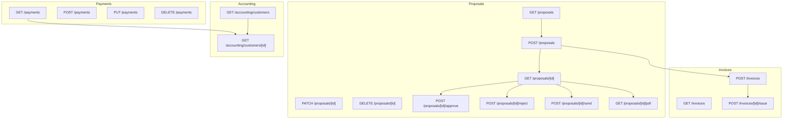
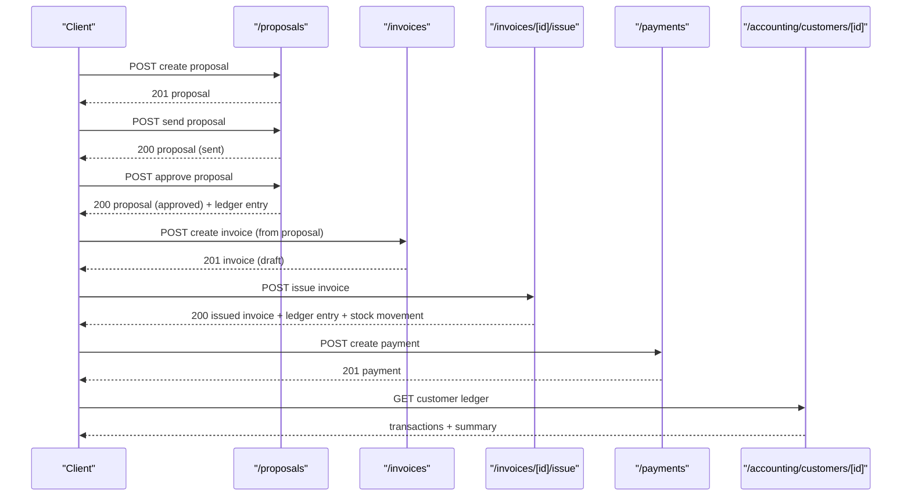
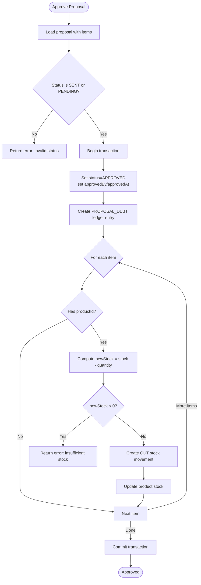
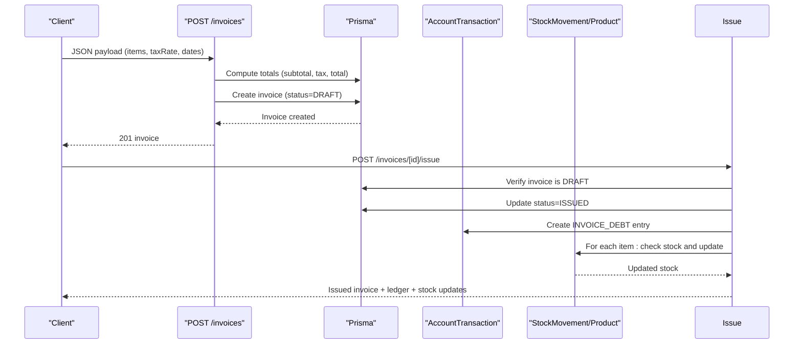
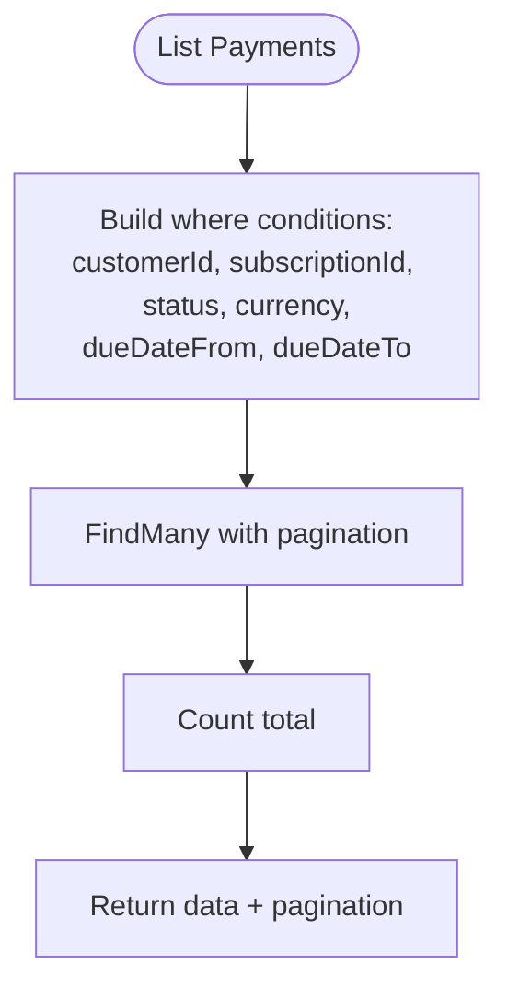
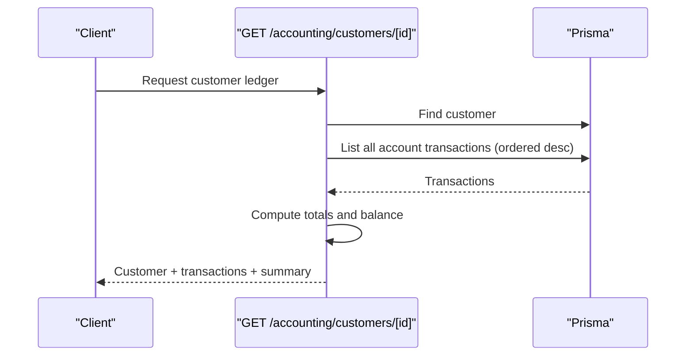
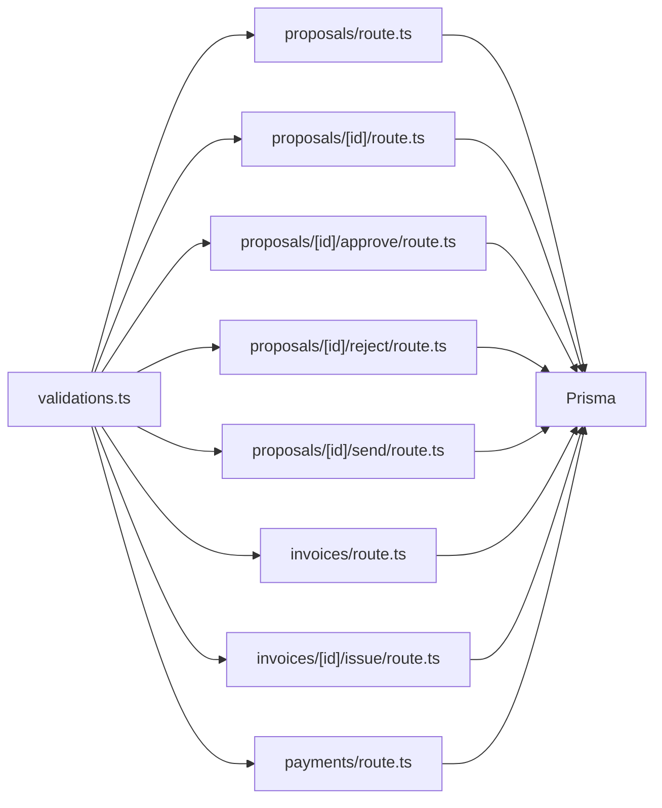

# Financial Management API

<cite>
**Referenced Files in This Document**
- [src/app/api/proposals/route.ts](file://src/app/api/proposals/route.ts)
- [src/app/api/proposals/[id]/route.ts](file://src/app/api/proposals/[id]/route.ts)
- [src/app/api/proposals/[id]/approve/route.ts](file://src/app/api/proposals/[id]/approve/route.ts)
- [src/app/api/proposals/[id]/reject/route.ts](file://src/app/api/proposals/[id]/reject/route.ts)
- [src/app/api/proposals/[id]/send/route.ts](file://src/app/api/proposals/[id]/send/route.ts)
- [src/app/api/proposals/[id]/pdf/route.ts](file://src/app/api/proposals/[id]/pdf/route.ts)
- [src/app/api/invoices/route.ts](file://src/app/api/invoices/route.ts)
- [src/app/api/invoices/[id]/issue/route.ts](file://src/app/api/invoices/[id]/issue/route.ts)
- [src/app/api/payments/route.ts](file://src/app/api/payments/route.ts)
- [src/app/api/accounting/customers/[id]/route.ts](file://src/app/api/accounting/customers/[id]/route.ts)
- [src/app/api/accounting/customers/route.ts](file://src/app/api/accounting/customers/route.ts)
- [src/lib/validations.ts](file://src/lib/validations.ts)
</cite>

## Table of Contents
1. [Introduction](#introduction)
2. [Project Structure](#project-structure)
3. [Core Components](#core-components)
4. [Architecture Overview](#architecture-overview)
5. [Detailed Component Analysis](#detailed-component-analysis)
6. [Dependency Analysis](#dependency-analysis)
7. [Performance Considerations](#performance-considerations)
8. [Troubleshooting Guide](#troubleshooting-guide)
9. [Conclusion](#conclusion)
10. [Appendices](#appendices)

## Introduction
This document describes the Financial Management API covering proposal lifecycle, invoice generation and issuance, and payment tracking. It explains proposal workflow endpoints for creation, approval, rejection, sending, and PDF generation; invoice endpoints for creation and issue processing; payment endpoints for creation, updates, and filtering; and supporting accounting endpoints for customer ledger details. It also documents tax calculation logic, currency support, financial status management, invoice numbering, and payment reconciliation processes. Finally, it provides example workflows from proposal to payment.

## Project Structure
The financial endpoints are implemented as Next.js App Router API routes grouped under:
- Proposals: creation, retrieval, update, deletion, approval, rejection, sending, PDF generation
- Invoices: listing, creation, and issuing
- Payments: listing, creation, update, deletion
- Accounting: customer ledger and balances

**Diagram sources**
- [src/app/api/proposals/route.ts:1-118](file://src/app/api/proposals/route.ts#L1-L118)
- [src/app/api/proposals/[id]/route.ts](file://src/app/api/proposals/[id]/route.ts#L1-L89)
- [src/app/api/proposals/[id]/approve/route.ts](file://src/app/api/proposals/[id]/approve/route.ts#L1-L121)
- [src/app/api/proposals/[id]/reject/route.ts](file://src/app/api/proposals/[id]/reject/route.ts#L1-L63)
- [src/app/api/proposals/[id]/send/route.ts](file://src/app/api/proposals/[id]/send/route.ts#L1-L48)
- [src/app/api/proposals/[id]/pdf/route.ts](file://src/app/api/proposals/[id]/pdf/route.ts#L1-L124)
- [src/app/api/invoices/route.ts:1-170](file://src/app/api/invoices/route.ts#L1-L170)
- [src/app/api/invoices/[id]/issue/route.ts](file://src/app/api/invoices/[id]/issue/route.ts#L1-L101)
- [src/app/api/payments/route.ts:1-117](file://src/app/api/payments/route.ts#L1-L117)
- [src/app/api/accounting/customers/route.ts:1-54](file://src/app/api/accounting/customers/route.ts#L1-L54)
- [src/app/api/accounting/customers/[id]/route.ts](file://src/app/api/accounting/customers/[id]/route.ts#L1-L139)

**Section sources**
- [src/app/api/proposals/route.ts:1-118](file://src/app/api/proposals/route.ts#L1-L118)
- [src/app/api/invoices/route.ts:1-170](file://src/app/api/invoices/route.ts#L1-L170)
- [src/app/api/payments/route.ts:1-117](file://src/app/api/payments/route.ts#L1-L117)
- [src/app/api/accounting/customers/route.ts:1-54](file://src/app/api/accounting/customers/route.ts#L1-L54)
- [src/app/api/accounting/customers/[id]/route.ts](file://src/app/api/accounting/customers/[id]/route.ts#L1-L139)

## Core Components
- Proposal management: CRUD plus workflow transitions (draft → sent → approved/rejected/expired), PDF generation, and proposal-numbering scheme
- Invoice management: creation with tax calculation and numbering, and issue processing that updates ledger and stock
- Payment management: listing with filters, creation, updates, and deletions
- Accounting: customer ledger retrieval and summary, plus opening balance adjustments

Key validations and types are centralized in the validation module to ensure consistent request shaping across endpoints.

**Section sources**
- [src/lib/validations.ts:167-177](file://src/lib/validations.ts#L167-L177)
- [src/lib/validations.ts:200-233](file://src/lib/validations.ts#L200-L233)
- [src/lib/validations.ts:190-198](file://src/lib/validations.ts#L190-L198)

## Architecture Overview
The API follows a layered pattern:
- Route handlers orchestrate requests, validate inputs, and call Prisma for persistence
- Transactions are used for atomic operations (e.g., invoice creation and proposal conversion, proposal approval and stock movements)
- Ledger entries are created for financial events (proposal approval, invoice issuance)
- Stock movements are tracked for inventory control upon invoice issuance and proposal approval

**Diagram sources**
- [src/app/api/proposals/route.ts:58-117](file://src/app/api/proposals/route.ts#L58-L117)
- [src/app/api/proposals/[id]/send/route.ts](file://src/app/api/proposals/[id]/send/route.ts#L28-L34)
- [src/app/api/proposals/[id]/approve/route.ts](file://src/app/api/proposals/[id]/approve/route.ts#L47-L54)
- [src/app/api/invoices/route.ts:80-155](file://src/app/api/invoices/route.ts#L80-L155)
- [src/app/api/invoices/[id]/issue/route.ts](file://src/app/api/invoices/[id]/issue/route.ts#L36-L42)
- [src/app/api/payments/route.ts:53-76](file://src/app/api/payments/route.ts#L53-L76)
- [src/app/api/accounting/customers/[id]/route.ts](file://src/app/api/accounting/customers/[id]/route.ts#L16-L71)

## Detailed Component Analysis

### Proposal Workflow Endpoints
Endpoints:
- GET /api/proposals: List proposals with pagination and filters (status, type, customerId, search)
- POST /api/proposals: Create proposal with auto-generated proposal number (format: T-{year}-{sequence})
- GET /api/proposals/[id]: Retrieve proposal with customer and items
- PATCH /api/proposals/[id]: Update proposal fields and status
- DELETE /api/proposals/[id]: Delete proposal
- POST /api/proposals/[id]/approve: Approve proposal, create customer debt ledger entry, reserve stock
- POST /api/proposals/[id]/reject: Reject proposal with optional reason
- POST /api/proposals/[id]/send: Mark proposal as sent (only draft)
- GET /api/proposals/[id]/pdf: Generate HTML PDF preview

Proposal number generation:
- Sequence resets yearly; number format is T-{year}-{6-digit zero-padded sequence}

Status transitions:
- Draft → Sent (send)
- Sent/Pending → Approved (approve) or Rejected (reject)
- Approved → Converted (when invoice created from proposal)

Stock handling:
- On approval and invoice issuance, stock quantities are reduced per line item if product exists

Validation:
- Creation and update schemas enforce amount positivity, currency defaults, and date formats

**Diagram sources**
- [src/app/api/proposals/[id]/approve/route.ts](file://src/app/api/proposals/[id]/approve/route.ts#L18-L101)

**Section sources**
- [src/app/api/proposals/route.ts:6-56](file://src/app/api/proposals/route.ts#L6-L56)
- [src/app/api/proposals/route.ts:58-117](file://src/app/api/proposals/route.ts#L58-L117)
- [src/app/api/proposals/[id]/route.ts](file://src/app/api/proposals/[id]/route.ts#L5-L36)
- [src/app/api/proposals/[id]/route.ts](file://src/app/api/proposals/[id]/route.ts#L38-L88)
- [src/app/api/proposals/[id]/approve/route.ts](file://src/app/api/proposals/[id]/approve/route.ts#L9-L121)
- [src/app/api/proposals/[id]/reject/route.ts](file://src/app/api/proposals/[id]/reject/route.ts#L9-L63)
- [src/app/api/proposals/[id]/send/route.ts](file://src/app/api/proposals/[id]/send/route.ts#L4-L48)
- [src/app/api/proposals/[id]/pdf/route.ts](file://src/app/api/proposals/[id]/pdf/route.ts#L4-L124)
- [src/lib/validations.ts:200-233](file://src/lib/validations.ts#L200-L233)

### Invoice Generation and Issue Processing
Endpoints:
- GET /api/invoices: List invoices with filters (customerId, status, search)
- POST /api/invoices: Create invoice with auto-generated invoice number (format: F-{year}-{6-digit sequence}), compute subtotal, tax, and total
- POST /api/invoices/[id]/issue: Issue invoice (must be draft), set status to ISSUED, create customer debt ledger entry, and process stock movements

Invoice numbering:
- Sequence resets yearly; number format is F-{year}-{6-digit zero-padded sequence}

Tax calculation:
- Subtotal from items
- Tax amount = subtotal × (taxRate / 100)
- Total = subtotal + taxAmount

Stock handling on issue:
- For each line item with a product, validate stock availability and update stock quantity accordingly

Proposal conversion:
- When invoice created from a proposal, the proposal status is set to CONVERTED

**Diagram sources**
- [src/app/api/invoices/route.ts:80-155](file://src/app/api/invoices/route.ts#L80-L155)
- [src/app/api/invoices/[id]/issue/route.ts](file://src/app/api/invoices/[id]/issue/route.ts#L35-L92)

**Section sources**
- [src/app/api/invoices/route.ts:24-77](file://src/app/api/invoices/route.ts#L24-L77)
- [src/app/api/invoices/route.ts:79-169](file://src/app/api/invoices/route.ts#L79-L169)
- [src/app/api/invoices/[id]/issue/route.ts](file://src/app/api/invoices/[id]/issue/route.ts#L4-L101)

### Payment Tracking Endpoints
Endpoints:
- GET /api/payments: Paginated listing with filters (customerId, subscriptionId, status, currency, dueDate range)
- POST /api/payments: Create payment with dueDate and optional paidDate
- PUT /api/payments: Update payment fields and status
- DELETE /api/payments: Delete payment by id

Payment statuses:
- Enumerated as DUE, LATE, PAID

Currency support:
- Currency field is validated and stored; filtering supports currency queries

**Diagram sources**
- [src/app/api/payments/route.ts:7-51](file://src/app/api/payments/route.ts#L7-L51)

**Section sources**
- [src/app/api/payments/route.ts:7-51](file://src/app/api/payments/route.ts#L7-L51)
- [src/app/api/payments/route.ts:53-88](file://src/app/api/payments/route.ts#L53-L88)
- [src/app/api/payments/route.ts:90-116](file://src/app/api/payments/route.ts#L90-L116)
- [src/lib/validations.ts:167-177](file://src/lib/validations.ts#L167-L177)

### Accounting and Customer Ledger
Endpoints:
- GET /api/accounting/customers: List customers with current balance derived from latest ledger entry
- GET /api/accounting/customers/[id]: Retrieve customer ledger with aggregated totals and summary

Customer ledger:
- Supports opening balance adjustments via dedicated endpoint
- Summarizes total debit, total credit, and balance

**Diagram sources**
- [src/app/api/accounting/customers/[id]/route.ts](file://src/app/api/accounting/customers/[id]/route.ts#L16-L71)

**Section sources**
- [src/app/api/accounting/customers/route.ts:4-53](file://src/app/api/accounting/customers/route.ts#L4-L53)
- [src/app/api/accounting/customers/[id]/route.ts](file://src/app/api/accounting/customers/[id]/route.ts#L11-L78)

## Dependency Analysis
- Validation schemas are reused across endpoints to ensure consistent request shapes
- Proposal and invoice endpoints depend on Prisma models and transactions for atomicity
- Invoice issue endpoint depends on stock and ledger services
- Payment endpoints integrate with customer ledger for reconciliation

**Diagram sources**
- [src/lib/validations.ts:167-177](file://src/lib/validations.ts#L167-L177)
- [src/app/api/proposals/route.ts:1-118](file://src/app/api/proposals/route.ts#L1-L118)
- [src/app/api/proposals/[id]/route.ts](file://src/app/api/proposals/[id]/route.ts#L1-L89)
- [src/app/api/proposals/[id]/approve/route.ts](file://src/app/api/proposals/[id]/approve/route.ts#L1-L121)
- [src/app/api/proposals/[id]/reject/route.ts](file://src/app/api/proposals/[id]/reject/route.ts#L1-L63)
- [src/app/api/proposals/[id]/send/route.ts](file://src/app/api/proposals/[id]/send/route.ts#L1-L48)
- [src/app/api/invoices/route.ts:1-170](file://src/app/api/invoices/route.ts#L1-L170)
- [src/app/api/invoices/[id]/issue/route.ts](file://src/app/api/invoices/[id]/issue/route.ts#L1-L101)
- [src/app/api/payments/route.ts:1-117](file://src/app/api/payments/route.ts#L1-L117)

**Section sources**
- [src/lib/validations.ts:167-177](file://src/lib/validations.ts#L167-L177)
- [src/app/api/proposals/route.ts:1-118](file://src/app/api/proposals/route.ts#L1-L118)
- [src/app/api/invoices/route.ts:1-170](file://src/app/api/invoices/route.ts#L1-L170)
- [src/app/api/payments/route.ts:1-117](file://src/app/api/payments/route.ts#L1-L117)

## Performance Considerations
- Pagination is enforced for listing endpoints to avoid large payloads
- Filtering is applied server-side to reduce database load
- Transactions are used to minimize partial writes during complex operations (invoice creation, proposal approval)
- Stock checks prevent negative inventory and avoid unnecessary writes

## Troubleshooting Guide
Common errors and resolutions:
- Proposal not found: Ensure the proposal id exists before attempting approval, rejection, sending, or PDF generation
- Invalid status transitions: Only draft proposals can be sent; only pending/sent proposals can be approved or rejected
- Insufficient stock: Invoice issue and proposal approval validate stock availability and will fail if stock would go negative
- Validation errors: Ensure amounts are positive, dates match required format, and required fields are present
- Payment filters: Use supported filters and date ranges; ensure ids are provided for updates/deletes

**Section sources**
- [src/app/api/proposals/[id]/approve/route.ts](file://src/app/api/proposals/[id]/approve/route.ts#L37-L42)
- [src/app/api/proposals/[id]/reject/route.ts](file://src/app/api/proposals/[id]/reject/route.ts#L29-L34)
- [src/app/api/proposals/[id]/send/route.ts](file://src/app/api/proposals/[id]/send/route.ts#L21-L26)
- [src/app/api/invoices/[id]/issue/route.ts](file://src/app/api/invoices/[id]/issue/route.ts#L63-L68)
- [src/app/api/payments/route.ts:78-87](file://src/app/api/payments/route.ts#L78-L87)

## Conclusion
The Financial Management API provides a complete end-to-end workflow from proposal creation to payment tracking, with robust validation, numbering schemes, tax computation, and ledger integration. Proposal workflows, invoice processing, and payment management are designed for reliability using transactions and clear status transitions. The accounting endpoints enable visibility into customer balances and financial activity.

## Appendices

### API Definitions

- Proposals
  - GET /api/proposals?page=&limit=&status=&type=&customerId=&search=
  - POST /api/proposals (payload includes customer, title, type, description, amount, currency, validUntil, notes, items)
  - GET /api/proposals/[id]
  - PATCH /api/proposals/[id] (fields: title, type, description, amount, currency, validUntil, notes, status)
  - DELETE /api/proposals/[id]
  - POST /api/proposals/[id]/approve (payload: approvedBy)
  - POST /api/proposals/[id]/reject (payload: reason)
  - POST /api/proposals/[id]/send
  - GET /api/proposals/[id]/pdf

- Invoices
  - GET /api/invoices?customerId=&status=&search=
  - POST /api/invoices (payload includes customerId, proposalId, type, issueDate, dueDate, taxRate, notes, items[])
  - POST /api/invoices/[id]/issue

- Payments
  - GET /api/payments?page=&limit=&customerId=&subscriptionId=&status=&currency=&dueDateFrom=&dueDateTo=
  - POST /api/payments (payload: customerId, subscriptionId, amount, currency, dueDate, paidDate, status, note)
  - PUT /api/payments?id=... (payload: amount, currency, dueDate, paidDate, status, note)
  - DELETE /api/payments?id=

- Accounting
  - GET /api/accounting/customers?search=
  - GET /api/accounting/customers/[id]

### Example Workflows

- Proposal to Invoice to Payment
  1. Create proposal: POST /api/proposals
  2. Send proposal: POST /api/proposals/[id]/send
  3. Approve proposal: POST /api/proposals/[id]/approve
  4. Create invoice from proposal: POST /api/invoices (proposalId)
  5. Issue invoice: POST /api/invoices/[id]/issue
  6. Create payment: POST /api/payments
  7. Track reconciliation: GET /api/accounting/customers/[id]

- Invoice without Proposal
  1. Create invoice: POST /api/invoices (type=SAME)
  2. Issue invoice: POST /api/invoices/[id]/issue
  3. Create payment: POST /api/payments
  4. Track reconciliation: GET /api/accounting/customers/[id]

- Payment Updates and Status Changes
  1. List payments: GET /api/payments
  2. Update payment status: PUT /api/payments?id=...
  3. Delete payment: DELETE /api/payments?id=