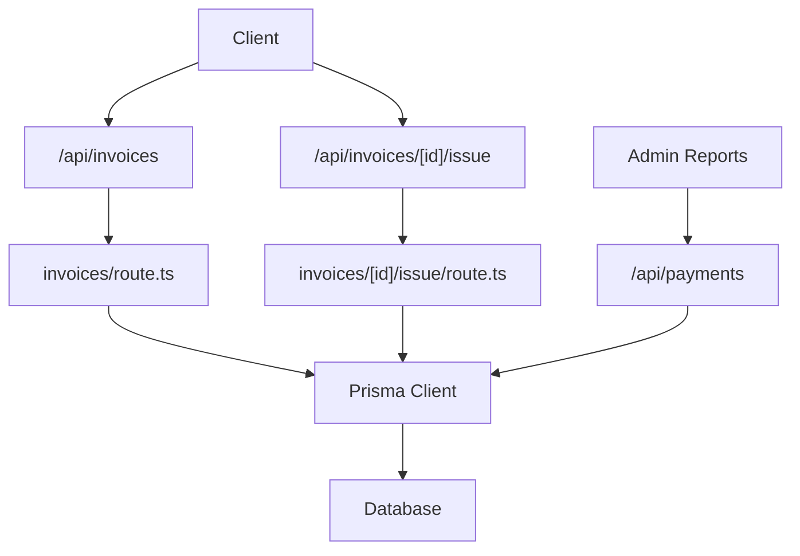
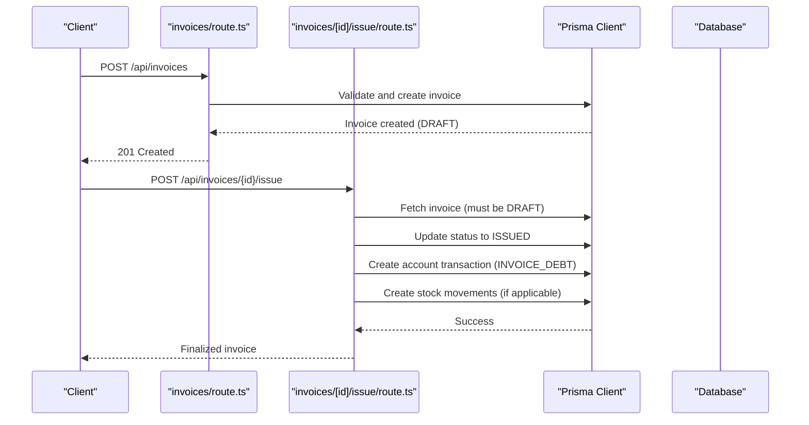
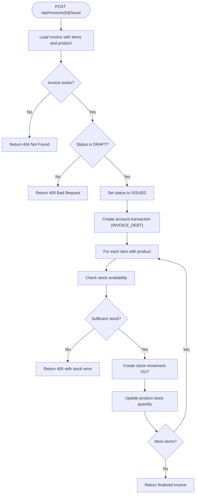
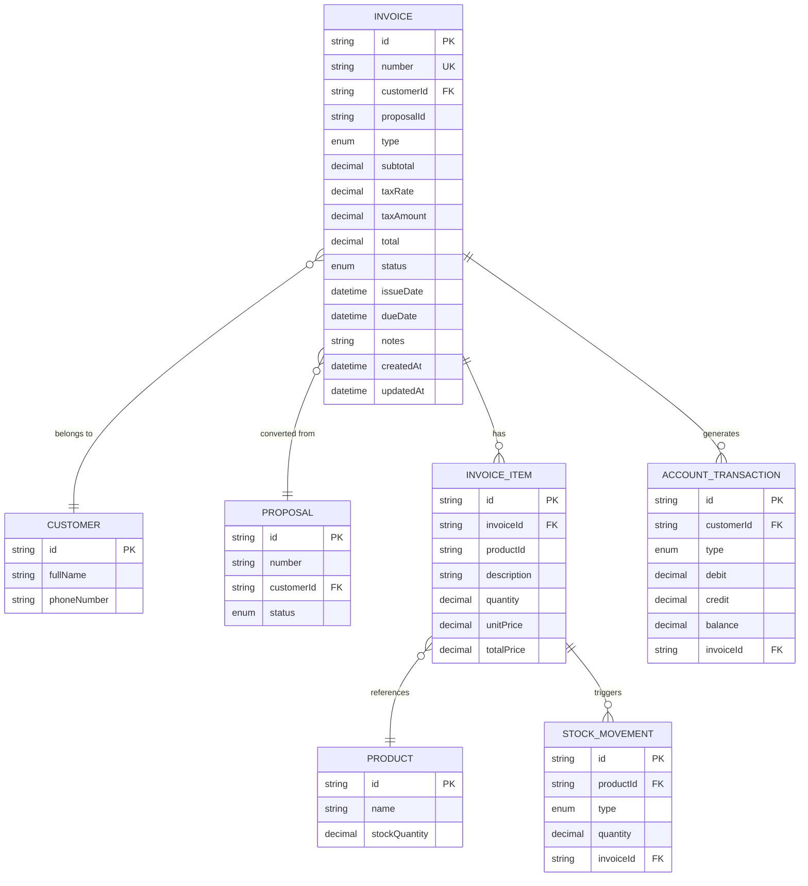

# Invoice Management API

<cite>
**Referenced Files in This Document**
- [route.ts](file://src/app/api/invoices/route.ts)
- [route.ts](file://src/app/api/invoices/[id]/issue/route.ts)
- [schema.prisma](file://prisma/schema.prisma)
- [migration.sql](file://prisma/migrations/20260215091826_init/migration.sql)
- [route.ts](file://src/app/api/proposals/[id]/route.ts)
- [route.ts](file://src/app/api/proposals/route.ts)
- [page.tsx](file://src/app/admin/reports/page.tsx)
- [route.ts](file://src/app/api/payments/route.ts)
</cite>

## Table of Contents
1. [Introduction](#introduction)
2. [Project Structure](#project-structure)
3. [Core Components](#core-components)
4. [Architecture Overview](#architecture-overview)
5. [Detailed Component Analysis](#detailed-component-analysis)
6. [Dependency Analysis](#dependency-analysis)
7. [Performance Considerations](#performance-considerations)
8. [Troubleshooting Guide](#troubleshooting-guide)
9. [Conclusion](#conclusion)

## Introduction
This document provides comprehensive API documentation for invoice management endpoints. It covers listing invoices with filtering and pagination, creating invoices from proposals or via direct creation, individual invoice operations, and the invoice finalization endpoint that generates invoice numbers and updates financial records. It also documents invoice status management, tax calculations, payment terms, and financial reporting integration.

## Project Structure
The invoice management API is implemented using Next.js App Router under `/src/app/api/invoices`. Supporting components include proposal-to-invoice conversion, financial reporting, and payment tracking.

**Diagram sources**
- [route.ts:1-170](file://src/app/api/invoices/route.ts#L1-L170)
- [route.ts:1-101](file://src/app/api/invoices/[id]/issue/route.ts#L1-L101)
- [route.ts:1-117](file://src/app/api/payments/route.ts#L1-L117)

**Section sources**
- [route.ts:1-170](file://src/app/api/invoices/route.ts#L1-L170)
- [route.ts:1-101](file://src/app/api/invoices/[id]/issue/route.ts#L1-L101)
- [route.ts:1-117](file://src/app/api/payments/route.ts#L1-L117)

## Core Components
- Invoice listing and creation endpoints
- Invoice issue endpoint for finalization
- Proposal-to-invoice conversion
- Financial reporting integration

Key capabilities:
- Filtering invoices by customer ID, status, and search term
- Automatic invoice numbering generation
- Tax calculation and totals computation
- Stock movement and account transaction updates upon invoice issuance
- Proposal conversion to invoices with status updates

**Section sources**
- [route.ts:24-77](file://src/app/api/invoices/route.ts#L24-L77)
- [route.ts:79-169](file://src/app/api/invoices/route.ts#L79-L169)
- [route.ts:4-101](file://src/app/api/invoices/[id]/issue/route.ts#L4-L101)

## Architecture Overview
The invoice module integrates with Prisma for database operations and interacts with related models for customers, proposals, products, stock movements, and account transactions. The issue endpoint performs atomic operations to finalize invoices and update financial records.

**Diagram sources**
- [route.ts:79-169](file://src/app/api/invoices/route.ts#L79-L169)
- [route.ts:4-101](file://src/app/api/invoices/[id]/issue/route.ts#L4-L101)

## Detailed Component Analysis

### GET /api/invoices
Purpose: List invoices with optional filtering and inclusion of related data.

Query parameters:
- `customerId`: Filter by customer ID
- `status`: Filter by invoice status
- `search`: Search by invoice number or customer full name (case-insensitive)

Response includes:
- Invoice records with customer, proposal, and counts for items and payments

Behavior:
- Applies filters dynamically based on provided parameters
- Orders results by creation date descending
- Includes customer contact info, proposal number, and counts

**Section sources**
- [route.ts:24-77](file://src/app/api/invoices/route.ts#L24-L77)

### POST /api/invoices
Purpose: Create a new invoice either from a proposal or directly.

Request body validation:
- `customerId`: Required
- `proposalId`: Optional (when converting from proposal)
- `type`: Enum "SALE" or "RETURN"
- `issueDate`: ISO datetime
- `dueDate`: ISO datetime
- `taxRate`: Number with default 20
- `notes`: Optional
- `items`: Array of invoice items with:
  - `productId`: Optional
  - `description`: Required
  - `quantity`: Positive number
  - `unitPrice`: Positive number
  - `totalPrice`: Positive number

Invoice number generation:
- Format: "F-{year}-{sequence}" with zero-padded 6-digit sequence
- Sequence derived from the highest existing number for the current year

Financial calculations:
- Subtotal: Sum of item totals
- Tax amount: Subtotal × (taxRate / 100)
- Total: Subtotal + tax amount

Transaction behavior:
- Creates invoice with status "DRAFT"
- Creates invoice items
- If proposalId is provided, updates proposal status to "CONVERTED"

Response:
- 201 Created with the created invoice
- Validation errors return 400 with details
- Other errors return 500

**Section sources**
- [route.ts:79-169](file://src/app/api/invoices/route.ts#L79-L169)

### GET /api/invoices/[id]
Note: The repository does not include a dedicated GET by ID endpoint for invoices. The typical pattern would be to use the list endpoint with filters or implement a separate route. If you require this endpoint, consider adding a new route similar to the pattern shown in other resources.

**Section sources**
- [route.ts:24-77](file://src/app/api/invoices/route.ts#L24-L77)

### PUT /api/invoices/[id]
Note: The repository does not include a dedicated PUT by ID endpoint for invoices. The typical pattern would be to use the list endpoint with filters or implement a separate route similar to the pattern shown in other resources.

**Section sources**
- [route.ts:24-77](file://src/app/api/invoices/route.ts#L24-L77)

### DELETE /api/invoices/[id]
Note: The repository does not include a dedicated DELETE by ID endpoint for invoices. The typical pattern would be to use the list endpoint with filters or implement a separate route similar to the pattern shown in other resources.

**Section sources**
- [route.ts:24-77](file://src/app/api/invoices/route.ts#L24-L77)

### POST /api/invoices/[id]/issue
Purpose: Finalize a draft invoice, generate invoice number updates, and integrate with financial systems.

Preconditions:
- Invoice must exist
- Invoice status must be "DRAFT"

Operations performed atomically:
- Update invoice status to "ISSUED"
- Create an account transaction of type "INVOICE_DEBT" for the customer
- For each item with a product:
  - Verify sufficient stock
  - Create a stock movement record (OUT type)
  - Update product stock quantity

Response:
- Success: Returns finalized invoice and confirmation message
- Errors: 404 if invoice not found, 400 for invalid status or insufficient stock, 500 for internal errors

**Diagram sources**
- [route.ts:4-101](file://src/app/api/invoices/[id]/issue/route.ts#L4-L101)

**Section sources**
- [route.ts:4-101](file://src/app/api/invoices/[id]/issue/route.ts#L4-L101)

### Proposal-to-Invoice Conversion
When creating an invoice with a `proposalId`, the system automatically converts the proposal to an invoice and updates the proposal status to "CONVERTED". This enables seamless workflow from proposal approval to invoicing.

**Section sources**
- [route.ts:144-150](file://src/app/api/invoices/route.ts#L144-L150)
- [route.ts:38-74](file://src/app/api/proposals/[id]/route.ts#L38-L74)

## Dependency Analysis
Invoice data model and relationships:

**Diagram sources**
- [schema.prisma:648-710](file://prisma/schema.prisma#L648-L710)
- [migration.sql:354-385](file://prisma/migrations/20260215091826_init/migration.sql#L354-L385)

Additional integrations:
- Financial reporting aggregates payment statuses and currencies
- Payment API supports filtering and pagination for overdue and due payments

**Section sources**
- [page.tsx:1-200](file://src/app/admin/reports/page.tsx#L1-L200)
- [route.ts:7-51](file://src/app/api/payments/route.ts#L7-L51)

## Performance Considerations
- Use appropriate filters (customerId, status, search) to reduce result sets for invoice listing
- Pagination parameters (page, limit) help manage large datasets
- Batch operations: The issue endpoint performs multiple writes; ensure database transaction support and index coverage for foreign keys
- Indexes on frequently queried fields (number, customerId, status) improve query performance

## Troubleshooting Guide
Common issues and resolutions:
- Validation errors on invoice creation: Review request payload against schema requirements; check item quantities, prices, and dates
- Invoice not found during issue: Confirm invoice ID exists and belongs to the requesting user
- Non-draft status during issue: Only invoices with status "DRAFT" can be issued
- Insufficient stock during issue: Adjust item quantities or restock products before issuing
- Internal server errors: Check server logs for Prisma errors and database connectivity

**Section sources**
- [route.ts:156-168](file://src/app/api/invoices/route.ts#L156-L168)
- [route.ts:21-33](file://src/app/api/invoices/[id]/issue/route.ts#L21-L33)
- [route.ts:63-68](file://src/app/api/invoices/[id]/issue/route.ts#L63-L68)

## Conclusion
The invoice management API provides robust functionality for listing, creating, and finalizing invoices with integrated financial updates. It supports proposal-to-invoice conversion, automatic numbering, tax calculations, and stock/ledger updates upon issuance. The design leverages Prisma for data integrity and follows REST conventions for endpoint naming and response codes.