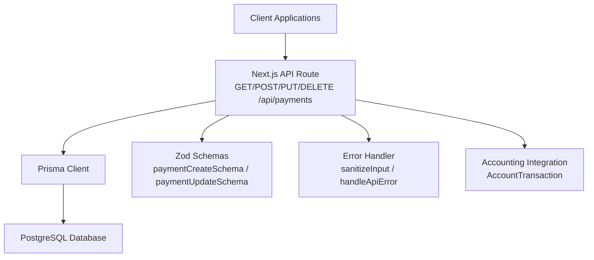
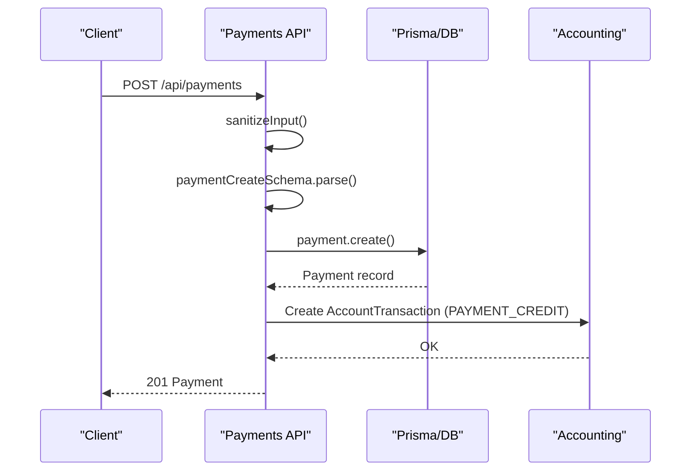
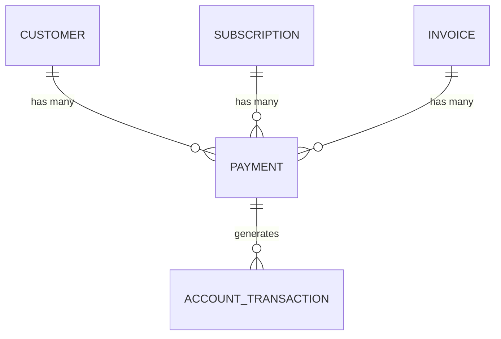
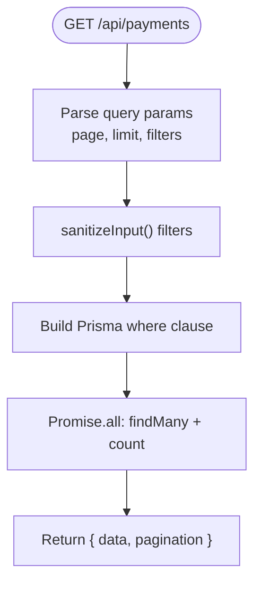
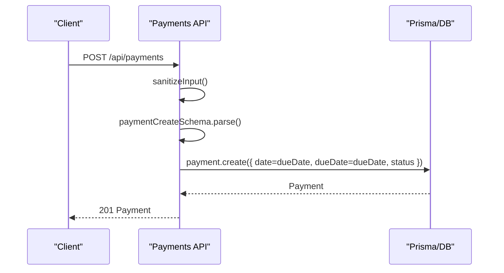
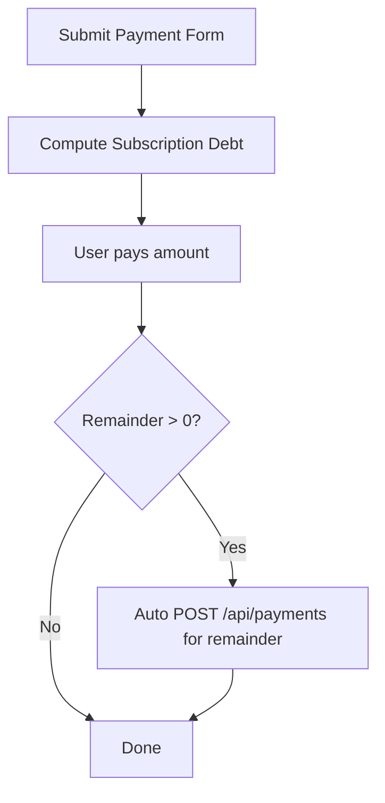
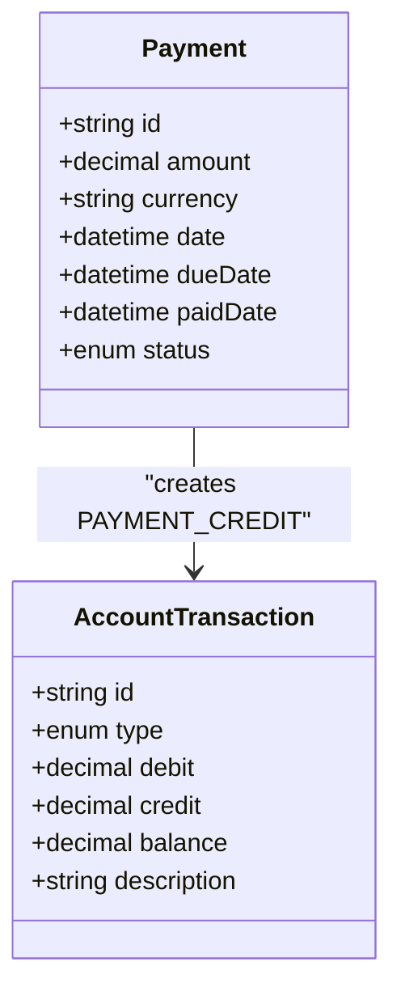
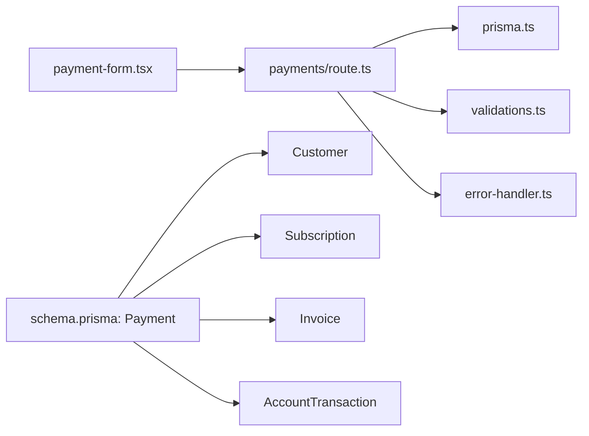

# Payment Processing API

<cite>
**Referenced Files in This Document**
- [route.ts](file://src/app/api/payments/route.ts)
- [schema.prisma](file://prisma/schema.prisma)
- [validations.ts](file://src/lib/validations.ts)
- [prisma.ts](file://src/lib/prisma.ts)
- [error-handler.ts](file://src/lib/error-handler.ts)
- [payment-form.tsx](file://src/components/payment-form.tsx)
- [dashboard/page.tsx](file://src/app/admin/dashboard/page.tsx)
- [reports/page.tsx](file://src/app/admin/reports/page.tsx)
- [transactions/page.tsx](file://src/app/admin/accounting/customers/[id]/transactions/page.tsx)
- [route.ts](file://src/app/api/invoices/route.ts)
</cite>

## Table of Contents
1. [Introduction](#introduction)
2. [Project Structure](#project-structure)
3. [Core Components](#core-components)
4. [Architecture Overview](#architecture-overview)
5. [Detailed Component Analysis](#detailed-component-analysis)
6. [Dependency Analysis](#dependency-analysis)
7. [Performance Considerations](#performance-considerations)
8. [Troubleshooting Guide](#troubleshooting-guide)
9. [Conclusion](#conclusion)
10. [Appendices](#appendices)

## Introduction
This document provides comprehensive API documentation for payment processing endpoints. It covers listing payments with filters, creating new payments, updating and deleting individual payments, payment method handling, currency support, status tracking, reconciliation with accounting systems, and practical workflows for cash flow management.

## Project Structure
The payment module is implemented as a Next.js App Router API route with database integration via Prisma. Validation is handled by Zod schemas, and the API integrates with the accounting subsystem for transaction reconciliation.

**Diagram sources**
- [route.ts:1-116](file://src/app/api/payments/route.ts#L1-L116)
- [prisma.ts:1-9](file://src/lib/prisma.ts#L1-L9)
- [schema.prisma:305-343](file://prisma/schema.prisma#L305-L343)
- [validations.ts:167-177](file://src/lib/validations.ts#L167-L177)
- [error-handler.ts:1-34](file://src/lib/error-handler.ts#L1-L34)

**Section sources**
- [route.ts:1-116](file://src/app/api/payments/route.ts#L1-L116)
- [schema.prisma:305-343](file://prisma/schema.prisma#L305-L343)

## Core Components
- Payment API route: Implements GET (list with filters), POST (create), PUT (update), and DELETE (remove) operations.
- Prisma model: Defines Payment entity, relations to Customer, Subscription, Invoice, and AccountTransaction.
- Validation schemas: Enforce input constraints for creation and updates.
- Error handling: Centralized sanitization and error responses.
- Frontend integration: Payment form computes subscription debt and creates follow-up payments automatically.

**Section sources**
- [route.ts:7-116](file://src/app/api/payments/route.ts#L7-L116)
- [schema.prisma:293-343](file://prisma/schema.prisma#L293-L343)
- [validations.ts:167-177](file://src/lib/validations.ts#L167-L177)
- [error-handler.ts:27-34](file://src/lib/error-handler.ts#L27-L34)
- [payment-form.tsx:87-152](file://src/components/payment-form.tsx#L87-L152)

## Architecture Overview
The payment API interacts with the database through Prisma, validates requests with Zod, and integrates with the accounting system by creating account transactions. The frontend form supports subscription-based payments and automatic remainder handling.

**Diagram sources**
- [route.ts:53-76](file://src/app/api/payments/route.ts#L53-L76)
- [schema.prisma:509-539](file://prisma/schema.prisma#L509-L539)
- [validations.ts:167-177](file://src/lib/validations.ts#L167-L177)

## Detailed Component Analysis

### Payment Entity and Relations
The Payment model supports:
- Customer linkage
- Optional Subscription and Invoice linkage
- Payment type enumeration (cash, transfer, credit card)
- Amount and currency fields
- Status tracking (DUE, LATE, PAID)
- Date fields for creation, due, and paid dates
- Accounting integration via AccountTransaction

**Diagram sources**
- [schema.prisma:95-123](file://prisma/schema.prisma#L95-L123)
- [schema.prisma:206-225](file://prisma/schema.prisma#L206-L225)
- [schema.prisma:305-343](file://prisma/schema.prisma#L305-L343)
- [schema.prisma:509-539](file://prisma/schema.prisma#L509-L539)

**Section sources**
- [schema.prisma:293-343](file://prisma/schema.prisma#L293-L343)

### API Endpoints

#### GET /api/payments
- Purpose: List payments with pagination and filters.
- Query parameters:
  - page: integer, default 1
  - limit: integer, min 1, max 100
  - customerId: string filter
  - subscriptionId: string filter
  - status: enum filter (DUE, LATE, PAID)
  - currency: string filter
  - dueDateFrom: date filter
  - dueDateTo: date filter
- Response:
  - data: array of Payment objects
  - pagination: page, limit, total, totalPages

**Diagram sources**
- [route.ts:7-51](file://src/app/api/payments/route.ts#L7-L51)

**Section sources**
- [route.ts:7-51](file://src/app/api/payments/route.ts#L7-L51)

#### POST /api/payments
- Purpose: Create a new payment.
- Request body fields:
  - customerId: required
  - subscriptionId: optional
  - amount: required (digits)
  - currency: required (max 10 chars), defaults to "TRY"
  - dueDate: required date (YYYY-MM-DD)
  - paidDate: optional date
  - status: enum (DUE, LATE, PAID), defaults to DUE
  - note: optional
- Behavior:
  - Validates and sanitizes input
  - Sets date equal to dueDate
  - Creates payment record
  - Returns 201 with created payment

**Diagram sources**
- [route.ts:53-76](file://src/app/api/payments/route.ts#L53-L76)
- [validations.ts:167-177](file://src/lib/validations.ts#L167-L177)

**Section sources**
- [route.ts:53-76](file://src/app/api/payments/route.ts#L53-L76)
- [validations.ts:167-177](file://src/lib/validations.ts#L167-L177)

#### PUT /api/payments?id=[id]
- Purpose: Update an existing payment.
- Query parameter:
  - id: required
- Request body fields:
  - Same as create, all optional
- Behavior:
  - Validates and sanitizes input
  - Updates specified fields (dates and status cast to enum)
  - Returns updated payment

**Section sources**
- [route.ts:90-116](file://src/app/api/payments/route.ts#L90-L116)
- [validations.ts:176-177](file://src/lib/validations.ts#L176-L177)

#### DELETE /api/payments?id=[id]
- Purpose: Delete a payment.
- Query parameter:
  - id: required
- Behavior:
  - Requires id present
  - Deletes payment record
  - Returns { ok: true }

**Section sources**
- [route.ts:78-88](file://src/app/api/payments/route.ts#L78-L88)

### Payment Method Handling
- Payment type is represented by an enum with values: Cash, Transfer, Credit Card.
- The API accepts and stores this field; display/UI components can map these values to localized labels.

**Section sources**
- [schema.prisma:299-303](file://prisma/schema.prisma#L299-L303)

### Currency Support and Exchange Rates
- Payments store amount as decimal and currency as string.
- The system supports multiple currencies; currency filtering is available in GET /api/payments.
- No explicit exchange rate management is implemented in the payment API; currency conversion would require external integration.

**Section sources**
- [schema.prisma:320-322](file://prisma/schema.prisma#L320-L322)
- [route.ts:14-15](file://src/app/api/payments/route.ts#L14-L15)

### Status Tracking and Workflows
- Status values: DUE, LATE, PAID.
- Dashboard and reports show counts and totals by status and currency.
- Frontend form computes subscription debt and can auto-create a remainder payment after successful submission.

**Diagram sources**
- [payment-form.tsx:87-152](file://src/components/payment-form.tsx#L87-L152)

**Section sources**
- [dashboard/page.tsx:144-165](file://src/app/admin/dashboard/page.tsx#L144-L165)
- [reports/page.tsx:340-372](file://src/app/admin/reports/page.tsx#L340-L372)
- [payment-form.tsx:87-152](file://src/components/payment-form.tsx#L87-L152)

### Reconciliation with Accounting Systems
- Payments integrate with the accounting subsystem via AccountTransaction entries.
- Transaction types include PAYMENT_CREDIT for payments.
- Customer transactions page displays debits/credits and balances.

**Diagram sources**
- [schema.prisma:305-343](file://prisma/schema.prisma#L305-L343)
- [schema.prisma:509-539](file://prisma/schema.prisma#L509-L539)

**Section sources**
- [schema.prisma:509-539](file://prisma/schema.prisma#L509-L539)
- [transactions/page.tsx:171-207](file://src/app/admin/accounting/customers/[id]/transactions/page.tsx#L171-L207)

### Refund Procedures
- The Payment model does not define a dedicated refund field or status.
- Refunds can be modeled by creating negative amounts or using separate refund records; this requires extending the schema and API accordingly.

[No sources needed since this section provides general guidance]

### Integration with Invoices
- Payments can be linked to invoices; invoice endpoint demonstrates related financial workflows.
- Payment-to-invoice linkage enables reconciliation and reporting.

**Section sources**
- [schema.prisma:310-315](file://prisma/schema.prisma#L310-L315)
- [route.ts:24-77](file://src/app/api/invoices/route.ts#L24-L77)

## Dependency Analysis
- API route depends on Prisma client, Zod validation schemas, and error handler.
- Payment model depends on Customer, Subscription, Invoice, and AccountTransaction.
- Frontend form depends on API endpoints for customer/subscriptions and payment creation.

**Diagram sources**
- [route.ts:1-5](file://src/app/api/payments/route.ts#L1-L5)
- [prisma.ts:1-9](file://src/lib/prisma.ts#L1-L9)
- [validations.ts:1-243](file://src/lib/validations.ts#L1-L243)
- [error-handler.ts:1-34](file://src/lib/error-handler.ts#L1-L34)
- [schema.prisma:305-343](file://prisma/schema.prisma#L305-L343)

**Section sources**
- [route.ts:1-5](file://src/app/api/payments/route.ts#L1-L5)
- [schema.prisma:305-343](file://prisma/schema.prisma#L305-L343)

## Performance Considerations
- Pagination: GET /api/payments supports page and limit with a maximum limit of 100 to prevent heavy queries.
- Filtering: WHERE conditions are built dynamically; ensure appropriate indexing on frequently filtered columns (customerId, subscriptionId, status, currency, dueDate).
- Parallel queries: Count and list are fetched concurrently to reduce latency.

**Section sources**
- [route.ts:10-11](file://src/app/api/payments/route.ts#L10-L11)
- [route.ts:32-42](file://src/app/api/payments/route.ts#L32-L42)

## Troubleshooting Guide
- Validation errors: Zod validation failures return structured error details with status 400.
- Sanitization: Input is trimmed and HTML characters removed to mitigate injection risks.
- Generic errors: Unhandled exceptions return status 500 with error message.

**Section sources**
- [error-handler.ts:4-25](file://src/lib/error-handler.ts#L4-L25)
- [route.ts:48-50](file://src/app/api/payments/route.ts#L48-L50)
- [route.ts:74-75](file://src/app/api/payments/route.ts#L74-L75)
- [route.ts:114-115](file://src/app/api/payments/route.ts#L114-L115)

## Conclusion
The payment processing API provides robust endpoints for listing, creating, updating, and deleting payments with strong validation and integration into the accounting system. Currency support and status tracking enable comprehensive cash flow management, while the frontend form simplifies subscription-based payment workflows and remainder handling.

## Appendices

### API Definitions

- GET /api/payments
  - Query parameters: page, limit, customerId, subscriptionId, status, currency, dueDateFrom, dueDateTo
  - Response: { data: Payment[], pagination: { page, limit, total, totalPages } }

- POST /api/payments
  - Body: PaymentCreate fields
  - Response: 201 Payment

- PUT /api/payments?id=[id]
  - Query: id (required)
  - Body: PaymentUpdate fields
  - Response: Payment

- DELETE /api/payments?id=[id]
  - Query: id (required)
  - Response: { ok: true }

**Section sources**
- [route.ts:7-116](file://src/app/api/payments/route.ts#L7-L116)
- [validations.ts:167-177](file://src/lib/validations.ts#L167-L177)