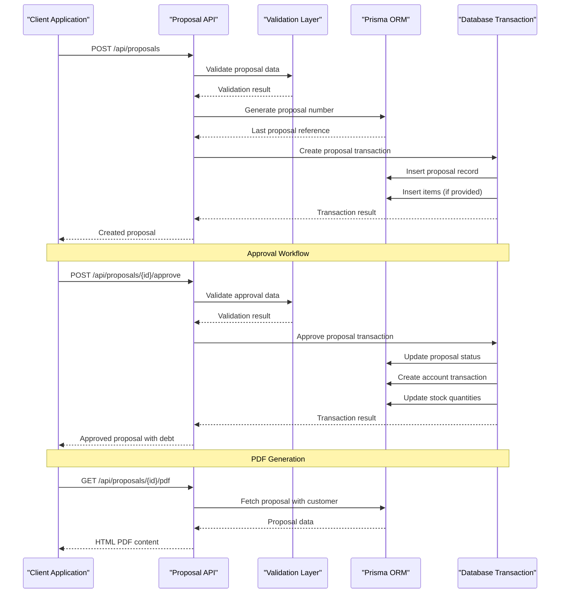
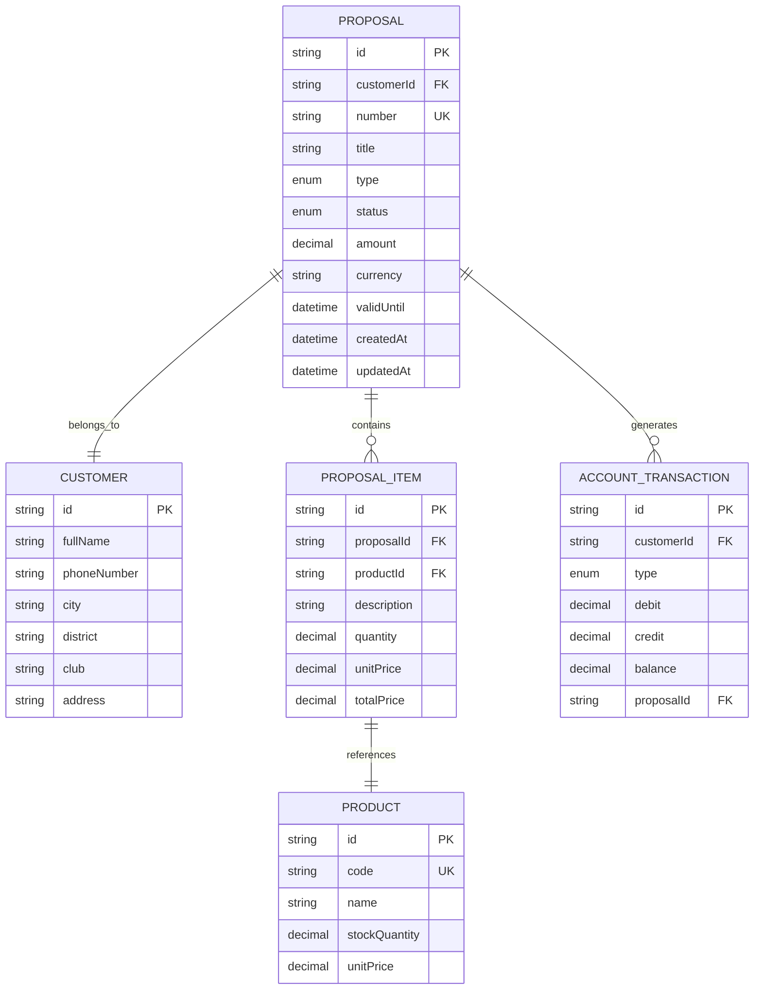
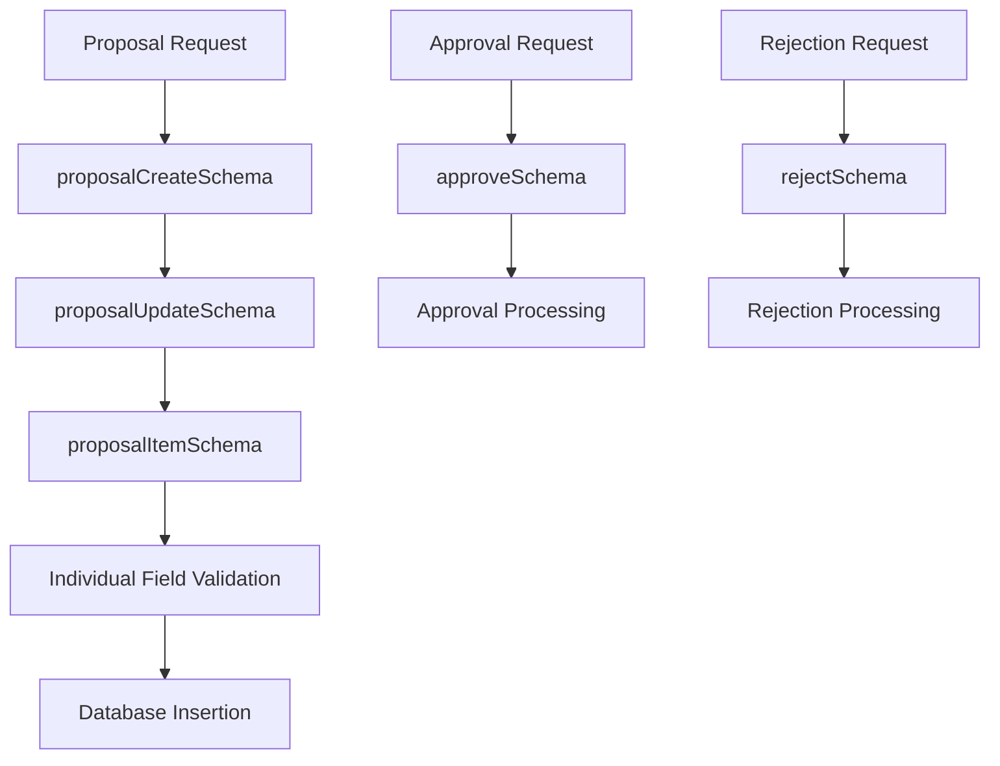

# Proposal Workflow API

<cite>
**Referenced Files in This Document**
- [route.ts](file://src/app/api/proposals/route.ts)
- [route.ts](file://src/app/api/proposals/[id]/route.ts)
- [route.ts](file://src/app/api/proposals/[id]/approve/route.ts)
- [route.ts](file://src/app/api/proposals/[id]/reject/route.ts)
- [route.ts](file://src/app/api/proposals/[id]/send/route.ts)
- [route.ts](file://src/app/api/proposals/[id]/pdf/route.ts)
- [validations.ts](file://src/lib/validations.ts)
- [schema.prisma](file://prisma/schema.prisma)
- [proposal-form.tsx](file://src/components/proposal-form.tsx)
- [proposal-edit-form.tsx](file://src/components/proposal-edit-form.tsx)
- [proposal-detail.tsx](file://src/components/proposal-detail.tsx)
- [proposal-list.tsx](file://src/components/proposal-list.tsx)
- [seed-proposal-types.mjs](file://scripts/seed-proposal-types.mjs)
</cite>

## Table of Contents
1. [Introduction](#introduction)
2. [Project Structure](#project-structure)
3. [Core Components](#core-components)
4. [Architecture Overview](#architecture-overview)
5. [Detailed Component Analysis](#detailed-component-analysis)
6. [Dependency Analysis](#dependency-analysis)
7. [Performance Considerations](#performance-considerations)
8. [Troubleshooting Guide](#troubleshooting-guide)
9. [Conclusion](#conclusion)

## Introduction
This document provides comprehensive API documentation for the proposal workflow system. It covers all proposal endpoints including listing, creating, updating, deleting, workflow actions (approve, reject, send), and PDF generation. The documentation explains proposal status transitions, approval workflows, data validation, and provides practical examples of complete proposal lifecycles from creation to finalization.

## Project Structure
The proposal workflow API is implemented using Next.js App Router with TypeScript and Prisma ORM. The API follows REST conventions with dedicated route handlers for each endpoint.

```mermaid
graph TB
subgraph "API Routes"
A[src/app/api/proposals/route.ts]
B[src/app/api/proposals/[id]/route.ts]
C[src/app/api/proposals/[id]/approve/route.ts]
D[src/app/api/proposals/[id]/reject/route.ts]
E[src/app/api/proposals/[id]/send/route.ts]
F[src/app/api/proposals/[id]/pdf/route.ts]
end
subgraph "Validation"
G[src/lib/validations.ts]
end
subgraph "Database Schema"
H[prisma/schema.prisma]
end
subgraph "UI Components"
I[src/components/proposal-form.tsx]
J[src/components/proposal-edit-form.tsx]
K[src/components/proposal-detail.tsx]
L[src/components/proposal-list.tsx]
end
A --> G
B --> G
C --> G
D --> G
E --> G
F --> G
A --> H
B --> H
C --> H
D --> H
E --> H
F --> H
I --> A
J --> B
K --> B
L --> A
```

**Diagram sources**
- [route.ts:1-118](file://src/app/api/proposals/route.ts#L1-L118)
- [route.ts:1-89](file://src/app/api/proposals/[id]/route.ts#L1-L89)
- [route.ts:1-121](file://src/app/api/proposals/[id]/approve/route.ts#L1-L121)
- [route.ts:1-63](file://src/app/api/proposals/[id]/reject/route.ts#L1-L63)
- [route.ts:1-48](file://src/app/api/proposals/[id]/send/route.ts#L1-L48)
- [route.ts:1-124](file://src/app/api/proposals/[id]/pdf/route.ts#L1-L124)
- [validations.ts:1-243](file://src/lib/validations.ts#L1-L243)
- [schema.prisma:435-456](file://prisma/schema.prisma#L435-L456)

**Section sources**
- [route.ts:1-118](file://src/app/api/proposals/route.ts#L1-L118)
- [route.ts:1-89](file://src/app/api/proposals/[id]/route.ts#L1-L89)

## Core Components
The proposal workflow system consists of six primary API endpoints that manage the complete lifecycle of proposals:

### Proposal Types and Statuses
The system defines comprehensive proposal types and statuses for robust workflow management:

**Proposal Types:**
- SUBSCRIPTION: Software subscription services
- PROJECT: Custom development projects
- MAINTENANCE: Maintenance agreements
- RENEWAL: Service renewal contracts
- NETWORK: Network infrastructure
- HARDWARE: Hardware solutions
- SOFTWARE: Software licensing
- SERVICE: Professional services
- CONSULTING: Advisory services
- OTHER: Miscellaneous services

**Proposal Statuses:**
- DRAFT: Initial draft state
- SENT: Proposal has been sent
- PENDING: Awaiting review
- APPROVED: Approved by authority
- REJECTED: Rejected with reason
- EXPIRED: Expiration date reached
- CONVERTED: Converted to invoice

**Section sources**
- [schema.prisma:445-456](file://prisma/schema.prisma#L445-L456)
- [schema.prisma:435-443](file://prisma/schema.prisma#L435-L443)

## Architecture Overview
The proposal workflow follows a transactional architecture with strict validation and status-controlled operations.



**Diagram sources**
- [route.ts:58-117](file://src/app/api/proposals/route.ts#L58-L117)
- [route.ts:9-120](file://src/app/api/proposals/[id]/approve/route.ts#L9-L120)
- [route.ts:4-123](file://src/app/api/proposals/[id]/pdf/route.ts#L4-L123)

## Detailed Component Analysis

### GET /api/proposals - List Proposals
Retrieves paginated proposals with comprehensive filtering capabilities.

**Query Parameters:**
- `page`: Page number (default: 1)
- `limit`: Items per page (default: 10, max: 100)
- `status`: Filter by proposal status
- `type`: Filter by proposal type
- `customerId`: Filter by customer ID
- `search`: Search term (case-insensitive in title and description)

**Response Format:**
```json
{
  "data": [
    {
      "id": "string",
      "number": "string",
      "title": "string",
      "type": "string",
      "status": "string",
      "amount": "number",
      "currency": "string",
      "validUntil": "date",
      "customer": {
        "id": "string",
        "fullName": "string",
        "club": "string"
      }
    }
  ],
  "pagination": {
    "page": "number",
    "limit": "number",
    "total": "number",
    "totalPages": "number"
  }
}
```

**Section sources**
- [route.ts:6-56](file://src/app/api/proposals/route.ts#L6-L56)

### POST /api/proposals - Create Proposal
Creates a new proposal with automatic numbering and comprehensive validation.

**Request Body:**
```json
{
  "customerId": "string",
  "title": "string (2-200 chars)",
  "type": "string",
  "description": "string (optional)",
  "amount": "string (positive number)",
  "currency": "string (default: TRY)",
  "validUntil": "YYYY-MM-DD",
  "notes": "string (optional)",
  "items": [
    {
      "productId": "string",
      "description": "string",
      "quantity": "string (number)",
      "unitPrice": "string (number)",
      "totalPrice": "string (number)"
    }
  ]
}
```

**Response:** Created proposal with auto-generated number and associated items.

**Automatic Numbering Logic:**
- Format: `T-{year}-{6-digit-sequence}`
- Example: `T-2024-000001`
- Sequence resets yearly based on existing proposals

**Section sources**
- [route.ts:58-117](file://src/app/api/proposals/route.ts#L58-L117)
- [validations.ts:200-233](file://src/lib/validations.ts#L200-L233)

### Individual Proposal Endpoints

#### GET /api/proposals/[id]
Retrieves a specific proposal with customer and item details.

**Response Includes:**
- Complete proposal data
- Customer information (full name, phone, address)
- Item details with product references
- Creation timestamps

**Section sources**
- [route.ts:5-36](file://src/app/api/proposals/[id]/route.ts#L5-L36)

#### PUT /api/proposals/[id] - Update Proposal
Updates proposal metadata and status.

**Supported Updates:**
- Title, type, description
- Amount, currency, validUntil
- Notes, status (DRAFT, PENDING, APPROVED, REJECTED, EXPIRED)

**Section sources**
- [route.ts:38-74](file://src/app/api/proposals/[id]/route.ts#L38-L74)
- [validations.ts:222-233](file://src/lib/validations.ts#L222-L233)

#### DELETE /api/proposals/[id]
Deletes a proposal permanently.

**Restrictions:**
- Cannot delete proposals in SENT or APPROVED status
- Requires proper authorization

**Section sources**
- [route.ts:76-89](file://src/app/api/proposals/[id]/route.ts#L76-L89)

### Workflow Action Endpoints

#### POST /api/proposals/[id]/approve
Approves a proposal and creates corresponding accounting entries.

**Request Body:**
```json
{
  "approvedBy": "string (required)"
}
```

**Approval Workflow:**
1. Validates proposal exists and is in PENDING or SENT status
2. Starts database transaction
3. Updates proposal status to APPROVED
4. Creates account transaction (PROPOSAL_DEBT)
5. Processes stock movements (if items exist)
6. Updates product quantities

**Stock Management:**
- Validates sufficient stock availability
- Creates stock movement records
- Updates product inventory
- Prevents negative stock levels

**Section sources**
- [route.ts:9-120](file://src/app/api/proposals/[id]/approve/route.ts#L9-L120)

#### POST /api/proposals/[id]/reject
Rejects a proposal with optional reason.

**Request Body:**
```json
{
  "reason": "string (optional)"
}
```

**Workflow:**
- Validates proposal exists and is in PENDING or SENT status
- Updates status to REJECTED
- Stores rejection reason
- Creates audit trail

**Section sources**
- [route.ts:9-62](file://src/app/api/proposals/[id]/reject/route.ts#L9-L62)

#### POST /api/proposals/[id]/send
Sends a proposal to customer.

**Workflow:**
- Validates proposal exists and is in DRAFT status
- Updates status to SENT
- Records send timestamp
- Prepares proposal for approval workflow

**Section sources**
- [route.ts:4-47](file://src/app/api/proposals/[id]/send/route.ts#L4-L47)

### PDF Generation Endpoint

#### GET /api/proposals/[id]/pdf
Generates HTML PDF representation of a proposal.

**Features:**
- Comprehensive customer information display
- Proposal details with type and status translations
- Amount formatting in Turkish locale
- Responsive HTML template with CSS styling
- Automatic filename generation

**Template Elements:**
- Company branding and title
- Customer contact information
- Proposal type and validity period
- Status badges with color coding
- Amount display with currency formatting
- Notes section (if provided)
- Footer with creation date and proposal ID

**Section sources**
- [route.ts:4-123](file://src/app/api/proposals/[id]/pdf/route.ts#L4-L123)

## Dependency Analysis

### Data Model Dependencies
The proposal system integrates with multiple database models:



**Diagram sources**
- [schema.prisma:458-503](file://prisma/schema.prisma#L458-L503)
- [schema.prisma:565-599](file://prisma/schema.prisma#L565-L599)
- [schema.prisma:510-539](file://prisma/schema.prisma#L510-L539)

### Validation Dependencies
The API relies on Zod schemas for comprehensive input validation:



**Diagram sources**
- [validations.ts:190-233](file://src/lib/validations.ts#L190-L233)

**Section sources**
- [validations.ts:1-243](file://src/lib/validations.ts#L1-L243)

## Performance Considerations
The proposal API implements several performance optimizations:

### Database Optimization
- **Pagination**: Built-in pagination prevents large result sets
- **Indexing**: Unique constraints on proposal numbers and customer relations
- **Selective Loading**: Includes only required fields in list queries
- **Batch Operations**: Uses Promise.all for concurrent queries

### Validation Performance
- **Early Validation**: Zod schemas validate input before database operations
- **Minimal Database Calls**: Validation occurs before expensive database queries
- **Type Safety**: Compile-time validation reduces runtime errors

### Caching Opportunities
- **Proposal Types**: Static configuration loaded once
- **Customer Lookup**: Frontend caching of customer lists
- **Product Catalog**: Static product information caching

## Troubleshooting Guide

### Common Error Scenarios

**Validation Errors (400):**
- Invalid proposal data format
- Missing required fields
- Amount validation failures
- Date format issues

**Business Logic Errors (400):**
- Attempting to approve non-PENDING proposals
- Insufficient stock quantities during approval
- Invalid status transitions
- Non-existent proposal IDs

**System Errors (500):**
- Database connection failures
- Transaction rollbacks
- Internal server exceptions

### Debugging Strategies
1. **Check Request Format**: Verify JSON structure matches validation schemas
2. **Validate Dependencies**: Ensure customer and product references exist
3. **Review Status Transitions**: Confirm allowed status changes
4. **Monitor Transactions**: Check for failed database operations

**Section sources**
- [route.ts:110-116](file://src/app/api/proposals/route.ts#L110-L116)
- [route.ts:107-119](file://src/app/api/proposals/[id]/approve/route.ts#L107-L119)

## Conclusion
The proposal workflow API provides a comprehensive solution for managing commercial proposals with robust validation, transactional operations, and complete lifecycle support. The system ensures data integrity through strict validation, maintains audit trails through status tracking, and provides flexible reporting capabilities through PDF generation. The modular design allows for easy extension and customization while maintaining strong type safety and performance characteristics.

Key strengths include:
- **Complete Lifecycle Management**: From creation to finalization
- **Robust Validation**: Comprehensive input validation with clear error messages
- **Transactional Integrity**: Atomic operations for approvals and stock management
- **Flexible Reporting**: HTML PDF generation with customizable templates
- **Extensible Design**: Support for various proposal types and workflows

The API serves as a foundation for modern business proposal management, supporting both simple and complex commercial workflows with enterprise-grade reliability and scalability.