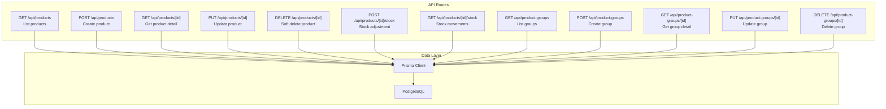
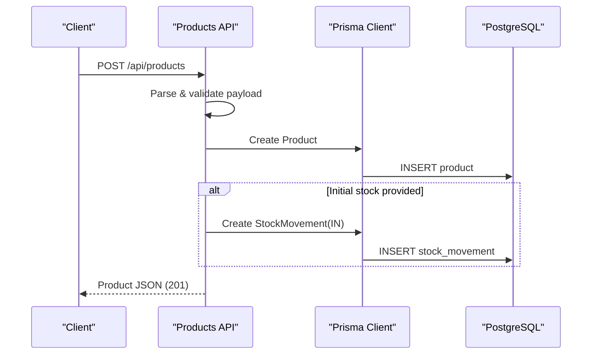
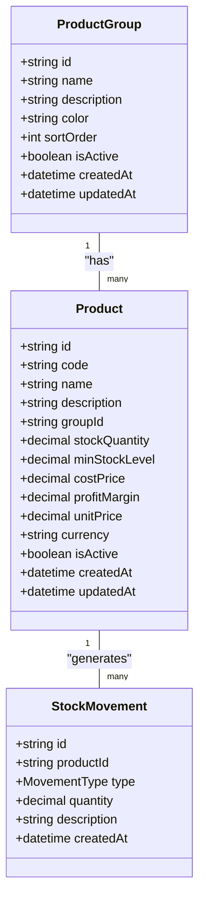
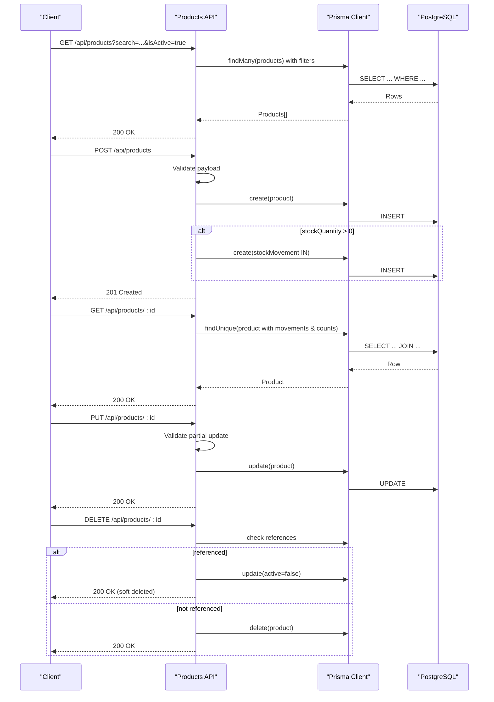
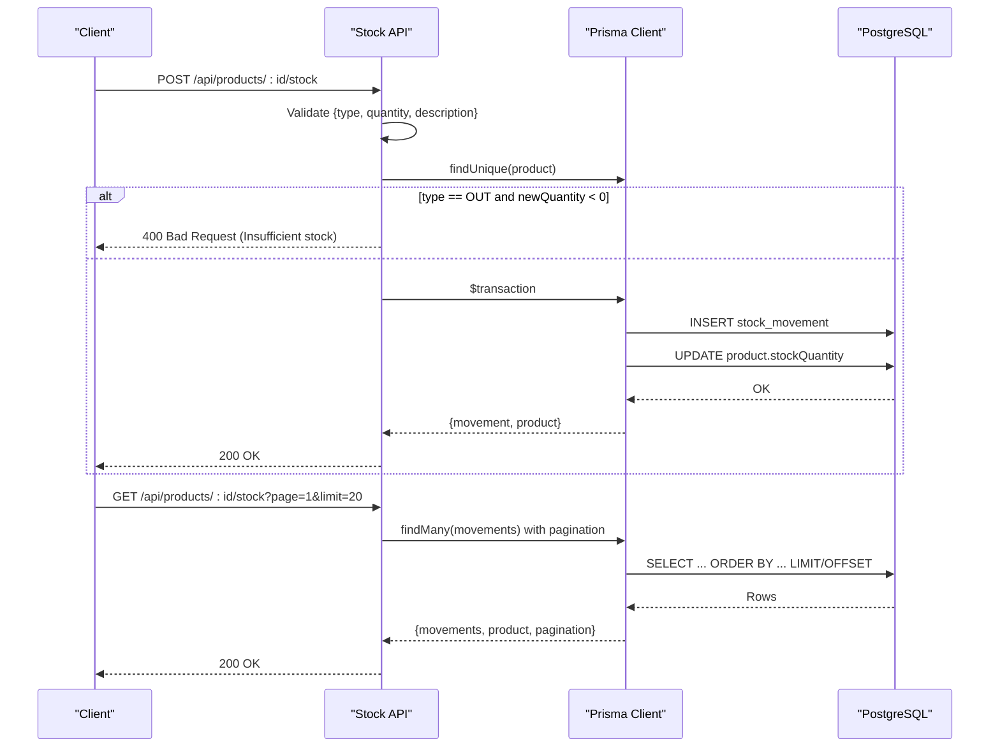
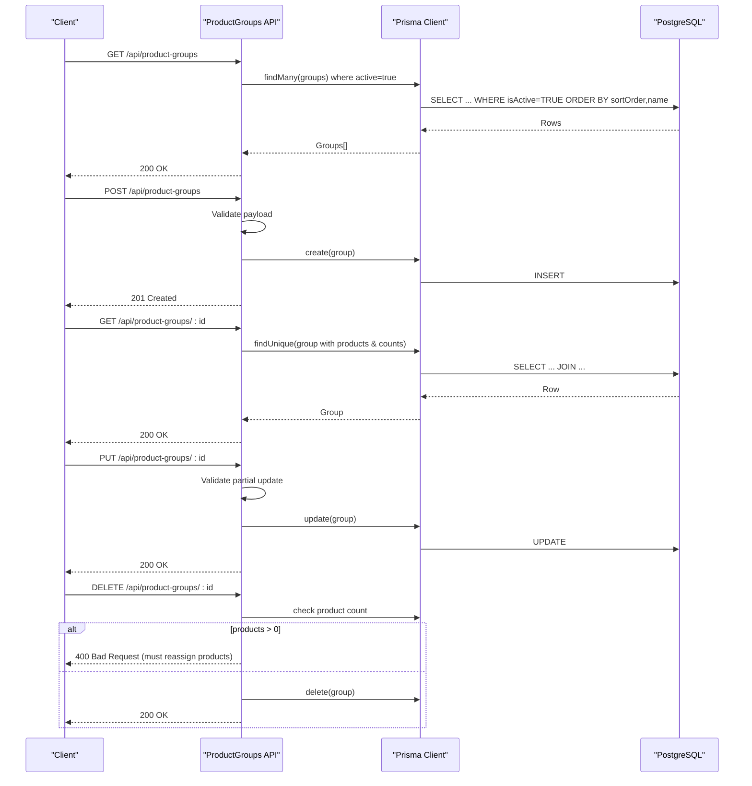
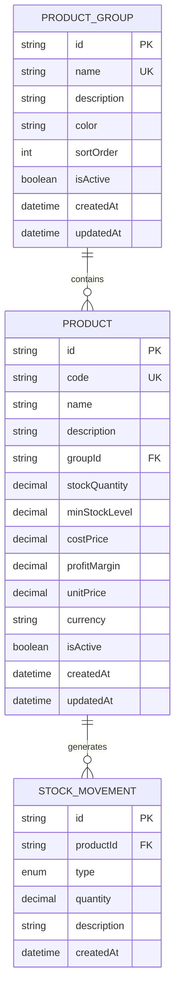
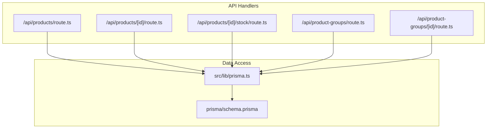

# Product & Inventory API

<cite>
**Referenced Files in This Document**
- [schema.prisma](file://prisma/schema.prisma)
- [prisma.ts](file://src/lib/prisma.ts)
- [products.route.ts](file://src/app/api/products/route.ts)
- [product.[id].route.ts](file://src/app/api/products/[id]/route.ts)
- [product.[id].stock.route.ts](file://src/app/api/products/[id]/stock/route.ts)
- [product-groups.route.ts](file://src/app/api/product-groups/route.ts)
- [product-groups.[id].route.ts](file://src/app/api/product-groups/[id]/route.ts)
- [products.page.tsx](file://src/app/admin/products/page.tsx)
- [products.add.page.tsx](file://src/app/admin/products/add/page.tsx)
- [products.groups.page.tsx](file://src/app/admin/products/groups/page.tsx)
- [products.[id].stock.page.tsx](file://src/app/admin/products/[id]/stock/page.tsx)
</cite>

## Table of Contents
1. [Introduction](#introduction)
2. [Project Structure](#project-structure)
3. [Core Components](#core-components)
4. [Architecture Overview](#architecture-overview)
5. [Detailed Component Analysis](#detailed-component-analysis)
6. [Dependency Analysis](#dependency-analysis)
7. [Performance Considerations](#performance-considerations)
8. [Troubleshooting Guide](#troubleshooting-guide)
9. [Conclusion](#conclusion)
10. [Appendices](#appendices)

## Introduction
This document describes the Product and Inventory Management API, covering product CRUD operations, stock tracking, and product group management. It specifies product fields, pricing information, inventory levels, categorization via groups, and stock adjustment endpoints for incoming/outgoing inventory. It also documents product group organization and hierarchical categorization, and provides examples of product catalog management and inventory reconciliation workflows.

## Project Structure
The API is implemented as Next.js App Router API routes under src/app/api, backed by Prisma ORM and PostgreSQL. The data model defines Product, ProductGroup, and StockMovement entities with relationships and enums for movement types and statuses.

**Diagram sources**
- [products.route.ts:18-54](file://src/app/api/products/route.ts#L18-L54)
- [product.[id].route.ts](file://src/app/api/products/[id]/route.ts#L14-L91)
- [product.[id].stock.route.ts](file://src/app/api/products/[id]/stock/route.ts#L12-L86)
- [product-groups.route.ts:12-35](file://src/app/api/product-groups/route.ts#L12-L35)
- [product-groups.[id].route.ts](file://src/app/api/product-groups/[id]/route.ts#L13-L78)
- [prisma.ts:1-9](file://src/lib/prisma.ts#L1-L9)

**Section sources**
- [products.route.ts:1-105](file://src/app/api/products/route.ts#L1-L105)
- [product.[id].route.ts](file://src/app/api/products/[id]/route.ts#L1-L149)
- [product.[id].stock.route.ts](file://src/app/api/products/[id]/stock/route.ts#L1-L160)
- [product-groups.route.ts:1-62](file://src/app/api/product-groups/route.ts#L1-L62)
- [product-groups.[id].route.ts](file://src/app/api/product-groups/[id]/route.ts#L1-L126)
- [prisma.ts:1-9](file://src/lib/prisma.ts#L1-L9)

## Core Components
- Product entity with unique code, name, description, group relation, stock quantities, pricing fields, and activity flag.
- ProductGroup entity with name, description, color, sort order, and active flag.
- StockMovement entity representing IN, OUT, and ADJUSTMENT entries linked to products and optionally to proposals/invoices.

Key data model definitions:
- Product: code, name, description, groupId → ProductGroup, stockQuantity, minStockLevel, costPrice, profitMargin, unitPrice, currency, isActive, timestamps.
- ProductGroup: name, description, color, sortOrder, isActive, products relation.
- StockMovement: productId → Product, type (IN/OUT/ADJUSTMENT), quantity, optional proposal/invoice relations, description, timestamps.

**Section sources**
- [schema.prisma:549-599](file://prisma/schema.prisma#L549-L599)
- [schema.prisma:601-626](file://prisma/schema.prisma#L601-L626)

## Architecture Overview
The API follows a layered architecture:
- Presentation: Next.js App Router API handlers.
- Business logic: Request parsing, validation with Zod, business rules (e.g., soft delete, stock checks).
- Persistence: Prisma ORM queries against PostgreSQL.

**Diagram sources**
- [products.route.ts:56-104](file://src/app/api/products/route.ts#L56-L104)
- [schema.prisma:564-599](file://prisma/schema.prisma#L564-L599)

## Detailed Component Analysis

### Product Catalog API
Endpoints:
- GET /api/products
  - Query parameters: search (text), isActive (boolean).
  - Returns paginated product list with group inclusion.
- POST /api/products
  - Creates a new product with validation and uniqueness check on code.
  - On positive initial stock, creates an IN stock movement labeled "Opening stock".
- GET /api/products/[id]
  - Returns product with recent movements and counts of related proposal/invoice items.
- PUT /api/products/[id]
  - Updates product fields (name, description, minStockLevel, unitPrice, currency, isActive).
- DELETE /api/products/[id]
  - Soft deletes by deactivating if product is referenced by proposals/invoices; otherwise hard deletes.

Validation and constraints:
- Creation requires non-empty code and name; unitPrice must be positive; defaults currency to TRY; stock/minStock default to 0.
- Update allows partial field updates with optional validation.

Stock adjustment workflow:
- POST /api/products/[id]/stock
  - Validates type (IN/OUT/ADJUSTMENT) and quantity.
  - Prevents negative stock on OUT.
  - Executes transaction to create movement and update product stock atomically.

Stock history retrieval:
- GET /api/products/[id]/stock
  - Paginates stock movements with related proposal/invoice references.

**Section sources**
- [products.route.ts:18-104](file://src/app/api/products/route.ts#L18-L104)
- [product.[id].route.ts](file://src/app/api/products/[id]/route.ts#L14-L148)
- [product.[id].stock.route.ts](file://src/app/api/products/[id]/stock/route.ts#L12-L159)

### Product Group Management API
Endpoints:
- GET /api/product-groups
  - Returns active groups ordered by sortOrder and name, with product counts.
- POST /api/product-groups
  - Creates a new group with validation (name required, default color, default sort order).
- GET /api/product-groups/[id]
  - Returns group with active products and product count.
- PUT /api/product-groups/[id]
  - Updates group fields (name, description, color, sortOrder, isActive).
- DELETE /api/product-groups/[id]
  - Prevents deletion if group still contains products.

Group organization:
- Groups support color coding and sort order for UI organization.
- Products can be grouped or ungrouped; ungrouped products have groupId null.

**Section sources**
- [product-groups.route.ts:12-61](file://src/app/api/product-groups/route.ts#L12-L61)
- [product-groups.[id].route.ts](file://src/app/api/product-groups/[id]/route.ts#L13-L125)

### Frontend Integration Notes
- Product list page fetches /api/products with optional search and displays stock status badges.
- Product creation page posts to /api/products and calculates unitPrice from costPrice and profitMargin.
- Product stock page posts to /api/products/[id]/stock and lists movements with proposal/invoice references.
- Product groups page fetches /api/product-groups and supports CRUD operations.

**Section sources**
- [products.page.tsx:70-96](file://src/app/admin/products/page.tsx#L70-L96)
- [products.add.page.tsx:74-105](file://src/app/admin/products/add/page.tsx#L74-L105)
- [products.[id].stock.page.tsx](file://src/app/admin/products/[id]/stock/page.tsx#L87-L132)
- [products.groups.page.tsx:91-145](file://src/app/admin/products/groups/page.tsx#L91-L145)

## Architecture Overview

**Diagram sources**
- [schema.prisma:549-599](file://prisma/schema.prisma#L549-L599)
- [schema.prisma:601-626](file://prisma/schema.prisma#L601-L626)

## Detailed Component Analysis

### Product CRUD Endpoints

**Diagram sources**
- [products.route.ts:18-104](file://src/app/api/products/route.ts#L18-L104)
- [product.[id].route.ts](file://src/app/api/products/[id]/route.ts#L14-L148)

**Section sources**
- [products.route.ts:18-104](file://src/app/api/products/route.ts#L18-L104)
- [product.[id].route.ts](file://src/app/api/products/[id]/route.ts#L14-L148)

### Stock Adjustment Workflow

**Diagram sources**
- [product.[id].stock.route.ts](file://src/app/api/products/[id]/stock/route.ts#L12-L159)

**Section sources**
- [product.[id].stock.route.ts](file://src/app/api/products/[id]/stock/route.ts#L12-L159)

### Product Group Management

**Diagram sources**
- [product-groups.route.ts:12-61](file://src/app/api/product-groups/route.ts#L12-L61)
- [product-groups.[id].route.ts](file://src/app/api/product-groups/[id]/route.ts#L13-L125)

**Section sources**
- [product-groups.route.ts:12-61](file://src/app/api/product-groups/route.ts#L12-L61)
- [product-groups.[id].route.ts](file://src/app/api/product-groups/[id]/route.ts#L13-L125)

### Data Model and Relationships

**Diagram sources**
- [schema.prisma:549-599](file://prisma/schema.prisma#L549-L599)
- [schema.prisma:601-626](file://prisma/schema.prisma#L601-L626)

**Section sources**
- [schema.prisma:549-599](file://prisma/schema.prisma#L549-L599)
- [schema.prisma:601-626](file://prisma/schema.prisma#L601-L626)

## Dependency Analysis

**Diagram sources**
- [products.route.ts:1-105](file://src/app/api/products/route.ts#L1-L105)
- [product.[id].route.ts](file://src/app/api/products/[id]/route.ts#L1-L149)
- [product.[id].stock.route.ts](file://src/app/api/products/[id]/stock/route.ts#L1-L160)
- [product-groups.route.ts:1-62](file://src/app/api/product-groups/route.ts#L1-L62)
- [product-groups.[id].route.ts](file://src/app/api/product-groups/[id]/route.ts#L1-L126)
- [prisma.ts:1-9](file://src/lib/prisma.ts#L1-L9)
- [schema.prisma:1-756](file://prisma/schema.prisma#L1-L756)

**Section sources**
- [prisma.ts:1-9](file://src/lib/prisma.ts#L1-L9)
- [schema.prisma:1-756](file://prisma/schema.prisma#L1-L756)

## Performance Considerations
- Pagination: Stock movements endpoint supports page and limit parameters to avoid large payloads.
- Filtering: Product listing supports text search and active status filtering to reduce result sets.
- Indexes: Unique constraints on product.code and productGroup.name are defined in the schema to optimize lookups.
- Transactions: Stock adjustments use Prisma transactions to maintain atomicity and consistency.
- Decimal precision: Monetary and quantity fields use decimal types to prevent floating-point errors.

## Troubleshooting Guide
Common issues and resolutions:
- Validation errors on product creation/update:
  - Ensure required fields are present and numeric fields are positive where applicable.
  - Check for unique product code violations.
- Insufficient stock on OUT:
  - Verify current stockQuantity and minStockLevel before attempting OUT adjustments.
- Soft delete behavior:
  - If a product is referenced by proposals or invoices, it is deactivated instead of deleted.
- Group deletion blocked:
  - Reassign products to another group or delete products before removing the group.

**Section sources**
- [products.route.ts:56-104](file://src/app/api/products/route.ts#L56-L104)
- [product.[id].route.ts](file://src/app/api/products/[id]/route.ts#L94-L148)
- [product.[id].stock.route.ts](file://src/app/api/products/[id]/stock/route.ts#L12-L86)
- [product-groups.[id].route.ts](file://src/app/api/product-groups/[id]/route.ts#L81-L125)

## Conclusion
The Product and Inventory Management API provides a robust foundation for managing products, groups, and stock movements. It enforces data integrity through validation and unique constraints, ensures consistency with transactions, and offers flexible querying and pagination. The schema supports future enhancements such as hierarchical categorization and extended reporting.

## Appendices

### API Reference: Product Catalog
- GET /api/products
  - Query: search (string), isActive (boolean)
  - Response: Array of products with group included
- POST /api/products
  - Body: code*, name*, description?, groupId?, stockQuantity?, minStockLevel?, costPrice?, profitMargin?, unitPrice* (>0), currency? ("TRY")
  - Response: Product (201)
- GET /api/products/[id]
  - Response: Product with recent movements and counts
- PUT /api/products/[id]
  - Body: Partial fields (name?, description?, minStockLevel?, unitPrice? (>0), currency?, isActive?)
  - Response: Product (200)
- DELETE /api/products/[id]
  - Response: Message (soft delete) or success (200)

**Section sources**
- [products.route.ts:18-104](file://src/app/api/products/route.ts#L18-L104)
- [product.[id].route.ts](file://src/app/api/products/[id]/route.ts#L14-L148)

### API Reference: Stock Management
- POST /api/products/[id]/stock
  - Body: type ("IN"|"OUT"|"ADJUSTMENT"), quantity (number), description?
  - Response: { movement, product } (200); 400 on insufficient stock
- GET /api/products/[id]/stock
  - Query: page (number), limit (number)
  - Response: { movements[], product, pagination }

**Section sources**
- [product.[id].stock.route.ts](file://src/app/api/products/[id]/stock/route.ts#L12-L159)

### API Reference: Product Groups
- GET /api/product-groups
  - Response: Array of active groups with product counts and ordering
- POST /api/product-groups
  - Body: name*, description?, color? ("#3b82f6" default), sortOrder? (0 default)
  - Response: Group (201)
- GET /api/product-groups/[id]
  - Response: Group with active products and count
- PUT /api/product-groups/[id]
  - Body: Partial fields (name?, description?, color?, sortOrder?, isActive?)
  - Response: Group (200)
- DELETE /api/product-groups/[id]
  - Response: Message (200); 400 if products exist

**Section sources**
- [product-groups.route.ts:12-61](file://src/app/api/product-groups/route.ts#L12-L61)
- [product-groups.[id].route.ts](file://src/app/api/product-groups/[id]/route.ts#L13-L125)

### Product Fields and Pricing Information
- Product fields:
  - code (unique), name, description, groupId → ProductGroup, stockQuantity, minStockLevel, costPrice, profitMargin, unitPrice, currency, isActive, timestamps.
- Pricing:
  - unitPrice is required during creation; costPrice and profitMargin can be used to calculate suggested unitPrice.
  - Currency defaults to TRY.

**Section sources**
- [schema.prisma:564-599](file://prisma/schema.prisma#L564-L599)
- [products.add.page.tsx:43-56](file://src/app/admin/products/add/page.tsx#L43-L56)

### Inventory Levels and Categorization
- Inventory levels:
  - stockQuantity and minStockLevel track current and threshold stock.
  - Stock status badges indicate out-of-stock, critical, or in-stock.
- Categorization:
  - Products belong to ProductGroup via groupId; ungrouped products have groupId null.
  - Groups support color and sort order for UI organization.

**Section sources**
- [schema.prisma:564-599](file://prisma/schema.prisma#L564-L599)
- [products.page.tsx:122-132](file://src/app/admin/products/page.tsx#L122-L132)
- [products.groups.page.tsx:28-40](file://src/app/admin/products/groups/page.tsx#L28-L40)

### Examples

#### Example: Product Catalog Management
- Create a new product with initial stock:
  - POST /api/products with code, name, unitPrice, stockQuantity > 0.
  - Expect a 201 response and an associated IN stock movement.
- Update product pricing:
  - PUT /api/products/:id with unitPrice and currency.
- Deactivate a product used in proposals/invoices:
  - DELETE /api/products/:id returns a message indicating soft deletion.

**Section sources**
- [products.route.ts:56-104](file://src/app/api/products/route.ts#L56-L104)
- [product.[id].route.ts](file://src/app/api/products/[id]/route.ts#L94-L148)

#### Example: Inventory Reconciliation Workflow
- Adjust stock:
  - POST /api/products/:id/stock with type "ADJUSTMENT" and desired quantity to reconcile discrepancies.
- Review movements:
  - GET /api/products/:id/stock with pagination to audit recent changes.
- Prevent overspending:
  - OUT adjustments automatically prevent negative stock.

**Section sources**
- [product.[id].stock.route.ts](file://src/app/api/products/[id]/stock/route.ts#L12-L86)
- [product.[id].stock.route.ts](file://src/app/api/products/[id]/stock/route.ts#L88-L159)