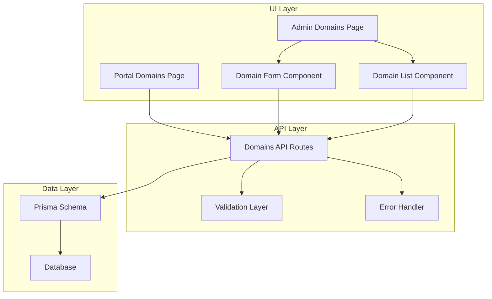
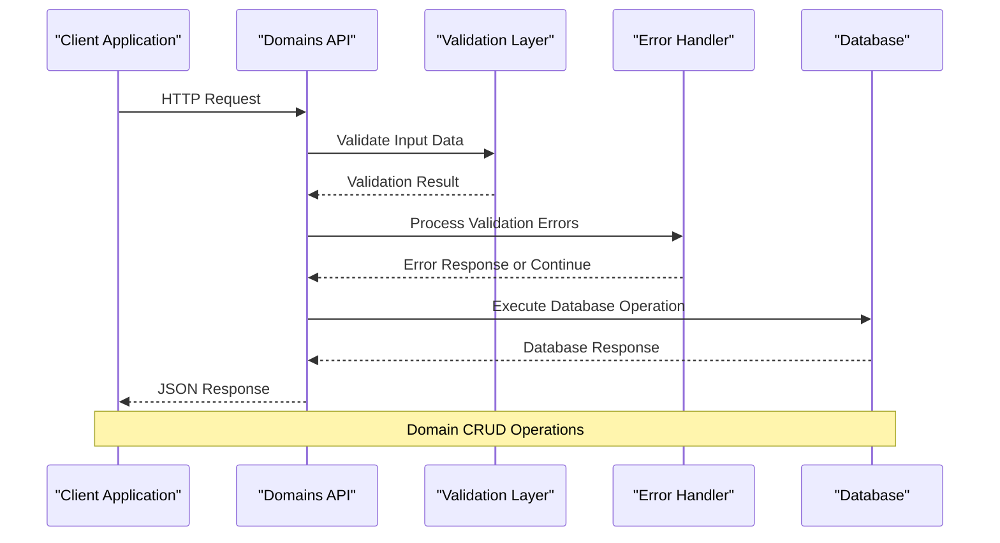
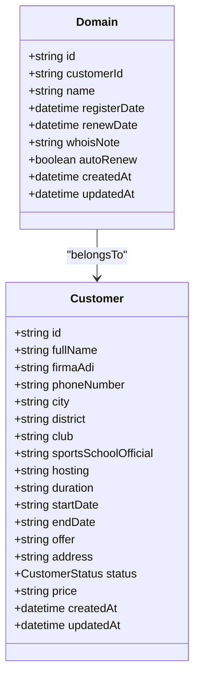
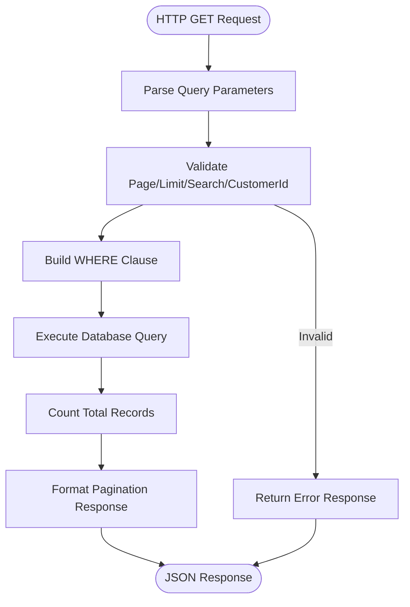
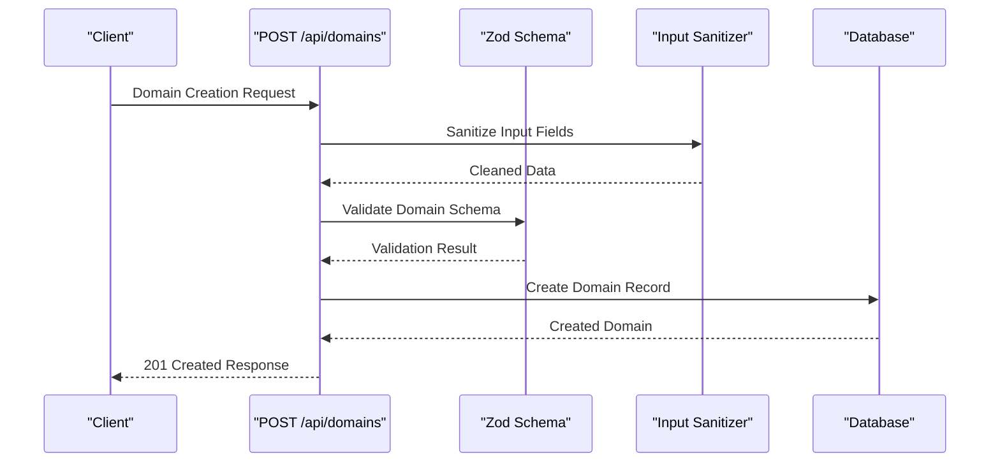
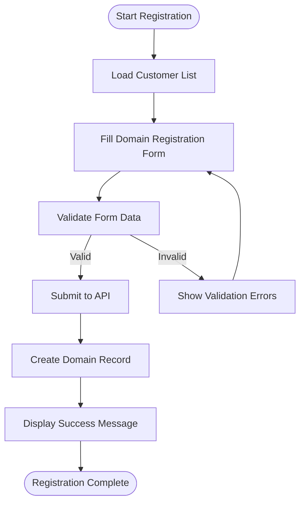
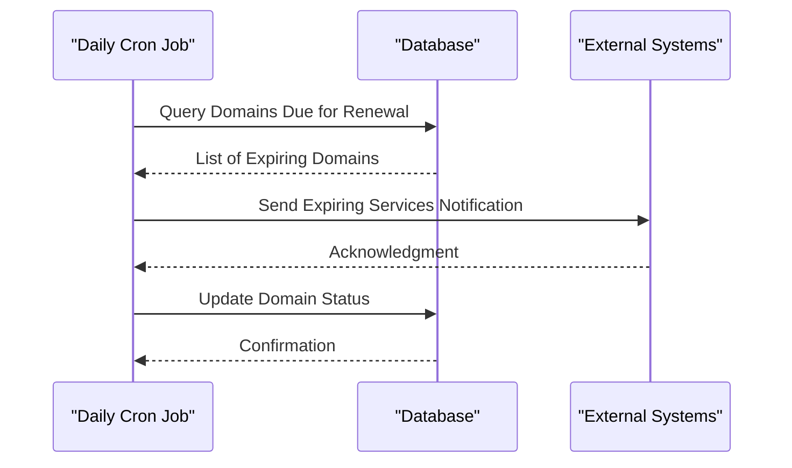
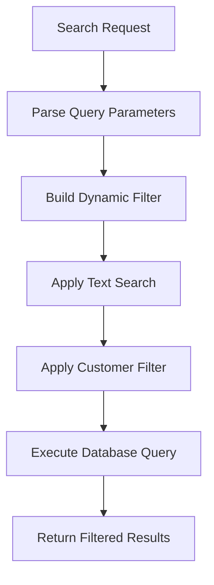
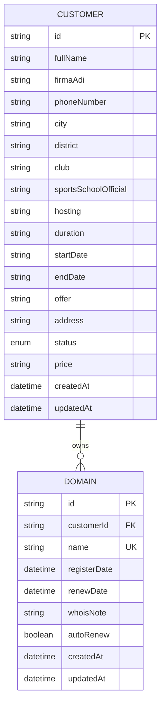

# Domain Management API

<cite>
**Referenced Files in This Document**
- [route.ts](file://src/app/api/domains/route.ts)
- [route.ts](file://src/app/api/domains/[id]/route.ts)
- [schema.prisma](file://prisma/schema.prisma)
- [validations.ts](file://src/lib/validations.ts)
- [error-handler.ts](file://src/lib/error-handler.ts)
- [domain-form.tsx](file://src/components/domain-form.tsx)
- [domain-list.tsx](file://src/components/domain-list.tsx)
- [page.tsx](file://src/app/admin/domains/page.tsx)
- [page.tsx](file://src/app/admin/domains/add/page.tsx)
- [page.tsx](file://src/app/portal/domains/page.tsx)
- [route.ts](file://src/app/api/cron/daily/route.ts)
</cite>

## Table of Contents
1. [Introduction](#introduction)
2. [Project Structure](#project-structure)
3. [Core Components](#core-components)
4. [Architecture Overview](#architecture-overview)
5. [Detailed Component Analysis](#detailed-component-analysis)
6. [API Reference](#api-reference)
7. [Domain Enrollment Workflows](#domain-enrollment-workflows)
8. [Renewal Processing](#renewal-processing)
9. [Search and Filtering](#search-and-filtering)
10. [Data Model](#data-model)
11. [Performance Considerations](#performance-considerations)
12. [Troubleshooting Guide](#troubleshooting-guide)
13. [Conclusion](#conclusion)

## Introduction

The Domain Management API provides comprehensive CRUD operations for managing domain registrations within the customer management system. This API enables organizations to track domain registrations, manage renewal dates, configure auto-renewal settings, and maintain WHOIS information for their customers.

The system supports both administrative and customer-facing domain management through a unified API that handles domain lifecycle management from initial registration through renewal and expiration.

## Project Structure

The domain management functionality is organized across several key areas:



**Diagram sources**
- [route.ts:1-65](file://src/app/api/domains/route.ts#L1-L65)
- [schema.prisma:228-242](file://prisma/schema.prisma#L228-L242)
- [domain-form.tsx:1-173](file://src/components/domain-form.tsx#L1-L173)

**Section sources**
- [route.ts:1-65](file://src/app/api/domains/route.ts#L1-L65)
- [schema.prisma:228-242](file://prisma/schema.prisma#L228-L242)

## Core Components

The domain management system consists of several interconnected components:

### API Endpoints
- **GET /api/domains** - Retrieve paginated domain listings with search and filtering
- **POST /api/domains** - Create new domain registrations
- **GET /api/domains/[id]** - Retrieve individual domain details
- **PUT /api/domains/[id]** - Update existing domain information
- **DELETE /api/domains/[id]** - Remove domain records

### Data Validation
The system implements comprehensive validation using Zod schemas to ensure data integrity and prevent malicious input.

### Frontend Integration
Multiple frontend components integrate with the API to provide both administrative and customer-facing domain management interfaces.

**Section sources**
- [route.ts:6-42](file://src/app/api/domains/route.ts#L6-L42)
- [route.ts:6-22](file://src/app/api/domains/[id]/route.ts#L6-L22)
- [validations.ts:140-148](file://src/lib/validations.ts#L140-L148)

## Architecture Overview

The domain management architecture follows a layered approach with clear separation of concerns:



**Diagram sources**
- [route.ts:44-64](file://src/app/api/domains/route.ts#L44-L64)
- [error-handler.ts:4-25](file://src/lib/error-handler.ts#L4-L25)

## Detailed Component Analysis

### Domain Data Model

The domain entity is designed with comprehensive fields to support complete domain lifecycle management:



**Diagram sources**
- [schema.prisma:228-242](file://prisma/schema.prisma#L228-L242)
- [schema.prisma:95-134](file://prisma/schema.prisma#L95-L134)

### API Endpoint Implementation

Each endpoint follows consistent patterns for error handling, validation, and response formatting:

#### GET /api/domains
Supports pagination, search, and filtering capabilities:



**Diagram sources**
- [route.ts:6-42](file://src/app/api/domains/route.ts#L6-L42)

#### POST /api/domains
Handles domain creation with comprehensive validation:



**Diagram sources**
- [route.ts:44-64](file://src/app/api/domains/route.ts#L44-L64)
- [validations.ts:140-148](file://src/lib/validations.ts#L140-L148)

**Section sources**
- [route.ts:1-65](file://src/app/api/domains/route.ts#L1-L65)
- [route.ts:1-66](file://src/app/api/domains/[id]/route.ts#L1-L66)

## API Reference

### Base URL
`/api/domains`

### Authentication
All endpoints require authentication through the NextAuth system configured in the application.

### Common Response Formats

#### Success Responses
- **200 OK**: Standard success for GET, PUT, DELETE operations
- **201 Created**: Successful domain creation
- **204 No Content**: Successful deletion

#### Error Responses
- **400 Bad Request**: Validation errors or malformed requests
- **404 Not Found**: Domain not found
- **500 Internal Server Error**: Server-side errors

### Endpoints

#### GET /api/domains
**Description**: Retrieve paginated domain listings with optional search and filtering

**Query Parameters**:
- `page` (integer, optional): Page number (default: 1)
- `limit` (integer, optional): Items per page (max: 100, default: 10)
- `search` (string, optional): Search term for domain names
- `customerId` (string, optional): Filter by customer ID

**Response**:
```json
{
  "data": [
    {
      "id": "string",
      "customerId": "string",
      "name": "string",
      "registerDate": "datetime",
      "renewDate": "datetime",
      "whoisNote": "string",
      "autoRenew": boolean,
      "createdAt": "datetime",
      "updatedAt": "datetime"
    }
  ],
  "pagination": {
    "page": integer,
    "limit": integer,
    "total": integer,
    "totalPages": integer
  }
}
```

#### POST /api/domains
**Description**: Create a new domain registration

**Request Body**:
```json
{
  "customerId": "string",
  "name": "string",
  "registerDate": "YYYY-MM-DD",
  "renewDate": "YYYY-MM-DD",
  "whoisNote": "string",
  "autoRenew": boolean
}
```

**Response**: Created domain object with 201 status

#### GET /api/domains/[id]
**Description**: Retrieve a specific domain by ID

**Response**: Domain object if found, 404 if not found

#### PUT /api/domains/[id]
**Description**: Update an existing domain

**Request Body**: Partial domain object (only provided fields are updated)

**Response**: Updated domain object

#### DELETE /api/domains/[id]
**Description**: Delete a domain record

**Response**: Success message with 200 status

**Section sources**
- [route.ts:6-42](file://src/app/api/domains/route.ts#L6-L42)
- [route.ts:6-66](file://src/app/api/domains/[id]/route.ts#L6-L66)

## Domain Enrollment Workflows

### New Domain Registration Process

The domain enrollment workflow follows a structured process for capturing domain information:



**Diagram sources**
- [domain-form.tsx:39-72](file://src/components/domain-form.tsx#L39-L72)
- [domain-form.tsx:52-72](file://src/components/domain-form.tsx#L52-L72)

### Frontend Integration

The system provides two primary interfaces for domain management:

#### Administrative Interface
- **Admin Domains Page**: Full domain management interface with advanced filtering
- **Domain Form Component**: Comprehensive form for creating/editing domains
- **Domain List Component**: Paginated table view with search capabilities

#### Customer Portal Interface
- **Portal Domains Page**: Customer-specific domain listing filtered by customer ID
- **Auto-populated Filters**: Automatically filters domains by logged-in customer

**Section sources**
- [page.tsx:1-32](file://src/app/admin/domains/page.tsx#L1-L32)
- [page.tsx:1-15](file://src/app/admin/domains/add/page.tsx#L1-L15)
- [page.tsx:23-47](file://src/app/portal/domains/page.tsx#L23-L47)

## Renewal Processing

### Daily Cron Job Integration

The system includes automated renewal processing through a daily cron job that monitors upcoming renewals:



**Diagram sources**
- [route.ts:32-37](file://src/app/api/cron/daily/route.ts#L32-L37)
- [route.ts:101-109](file://src/app/api/cron/daily/route.ts#L101-L109)

### Auto-Renewal Configuration

Domains support automatic renewal configuration through the `autoRenew` field, enabling:

- Automated renewal processing
- Reduced manual intervention
- Improved customer service continuity

**Section sources**
- [route.ts:1-135](file://src/app/api/cron/daily/route.ts#L1-L135)

## Search and Filtering

### Advanced Search Capabilities

The domain search system provides flexible filtering options:

#### Available Filters
- **Text Search**: Case-insensitive domain name matching
- **Customer Filtering**: Restrict results to specific customer domains
- **Pagination**: Configurable page sizes up to 100 items
- **Sorting**: Results sorted by creation date (newest first)

#### Search Implementation



**Diagram sources**
- [route.ts:8-21](file://src/app/api/domains/route.ts#L8-L21)

**Section sources**
- [route.ts:8-21](file://src/app/api/domains/route.ts#L8-L21)

## Data Model

### Domain Entity Schema

The domain model includes comprehensive fields for complete domain lifecycle management:

| Field | Type | Description | Constraints |
|-------|------|-------------|-------------|
| `id` | String | Unique identifier | Primary Key |
| `customerId` | String | Associated customer ID | Foreign Key |
| `name` | String | Domain name | Unique, 3-253 characters |
| `registerDate` | DateTime | Registration date | Required |
| `renewDate` | DateTime | Next renewal date | Required |
| `whoisNote` | String | WHOIS-related notes | Optional, max 1000 chars |
| `autoRenew` | Boolean | Auto-renewal status | Default: false |
| `createdAt` | DateTime | Creation timestamp | Automatic |
| `updatedAt` | DateTime | Last update timestamp | Automatic |

### Relationship Model



**Diagram sources**
- [schema.prisma:95-134](file://prisma/schema.prisma#L95-L134)
- [schema.prisma:228-242](file://prisma/schema.prisma#L228-L242)

**Section sources**
- [schema.prisma:228-242](file://prisma/schema.prisma#L228-L242)

## Performance Considerations

### Database Optimization

The API implements several performance optimizations:

- **Indexing**: Unique index on domain names for fast lookups
- **Pagination**: Built-in pagination prevents large result sets
- **Selective Queries**: Only requested fields are returned
- **Connection Pooling**: Efficient database connection management

### Caching Strategies

- **Client-side Caching**: Frontend components cache customer lists
- **Database Query Optimization**: Efficient WHERE clause construction
- **Limit Parameter**: Prevents excessive data transfer

### Scalability Features

- **Pagination Limits**: Maximum 100 items per page
- **Search Indexing**: Optimized LIKE queries with case-insensitive matching
- **Async Operations**: Non-blocking database operations

## Troubleshooting Guide

### Common Issues and Solutions

#### Validation Errors
**Problem**: Domain creation fails with validation errors
**Solution**: Ensure all required fields are provided and formatted correctly:
- Domain name: 3-253 characters
- Dates: YYYY-MM-DD format
- Customer ID: Valid existing customer identifier

#### Duplicate Domain Names
**Problem**: Error when creating domain with existing name
**Solution**: Domain names must be unique across the system

#### Authentication Issues
**Problem**: API returns unauthorized responses
**Solution**: Ensure proper NextAuth authentication is established

#### Database Connection Problems
**Problem**: Server errors when accessing domain data
**Solution**: Verify database connectivity and Prisma configuration

### Error Response Format

All API errors follow a consistent format:
```json
{
  "error": "Error message describing the problem",
  "details": [
    {
      "field": "field_name",
      "message": "Specific validation error message"
    }
  ]
}
```

**Section sources**
- [error-handler.ts:4-25](file://src/lib/error-handler.ts#L4-L25)

## Conclusion

The Domain Management API provides a comprehensive solution for domain registration tracking with robust CRUD operations, advanced search capabilities, and automated renewal processing. The system's layered architecture ensures maintainability, while the validation and error handling mechanisms guarantee data integrity and reliable operation.

Key strengths of the implementation include:
- Complete domain lifecycle management
- Flexible search and filtering options
- Automated renewal processing
- Customer portal integration
- Comprehensive validation and error handling
- Performance-optimized database queries

The API serves both administrative and customer-facing use cases while maintaining security and data consistency through proper authentication, validation, and authorization mechanisms.