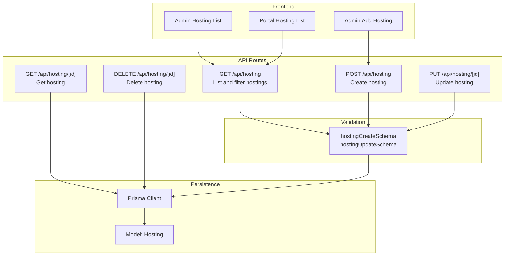
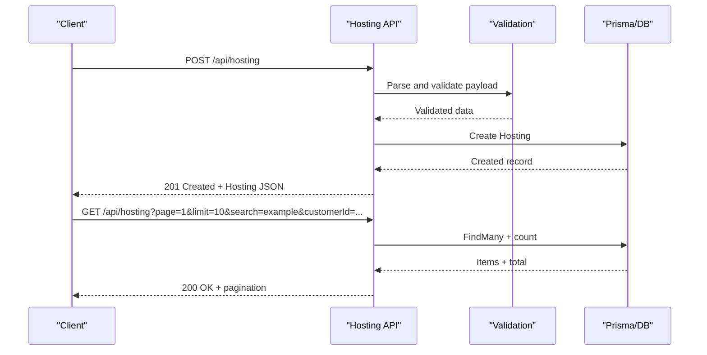
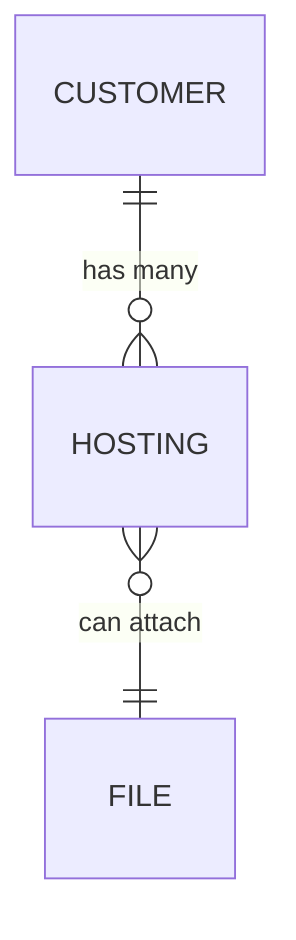
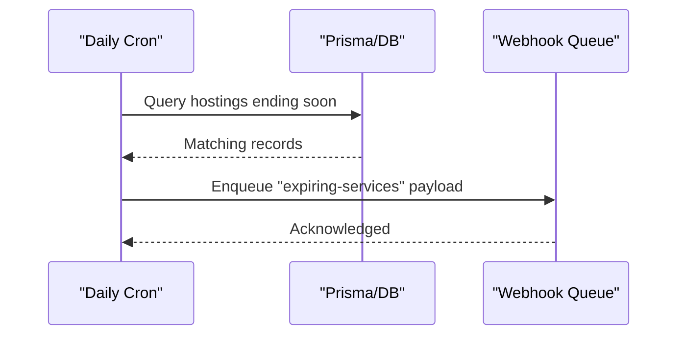
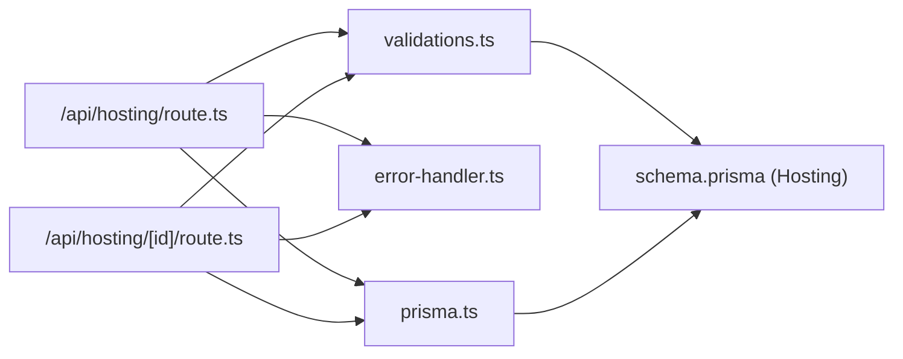

# Hosting Management API

<cite>
**Referenced Files in This Document**
- [route.ts](file://src/app/api/hosting/route.ts)
- [route.ts](file://src/app/api/hosting/[id]/route.ts)
- [schema.prisma](file://prisma/schema.prisma)
- [validations.ts](file://src/lib/validations.ts)
- [error-handler.ts](file://src/lib/error-handler.ts)
- [prisma.ts](file://src/lib/prisma.ts)
- [hosting-form.tsx](file://src/components/hosting-form.tsx)
- [hosting-list.tsx](file://src/components/hosting-list.tsx)
- [route.ts](file://src/app/api/cron/daily/route.ts)
- [page.tsx](file://src/app/admin/hosting/page.tsx)
- [page.tsx](file://src/app/admin/hosting/add/page.tsx)
- [page.tsx](file://src/app/portal/hosting/page.tsx)
</cite>

## Table of Contents
1. [Introduction](#introduction)
2. [Project Structure](#project-structure)
3. [Core Components](#core-components)
4. [Architecture Overview](#architecture-overview)
5. [Detailed Component Analysis](#detailed-component-analysis)
6. [Dependency Analysis](#dependency-analysis)
7. [Performance Considerations](#performance-considerations)
8. [Troubleshooting Guide](#troubleshooting-guide)
9. [Conclusion](#conclusion)
10. [Appendices](#appendices)

## Introduction
This document describes the Hosting Management API, which provides CRUD operations for managing hosting services associated with customers. It covers endpoint definitions, request/response formats, validation rules, pagination, filtering, and operational workflows such as enrollment and renewal alerts. It also clarifies the distinction between the hosting and hostings endpoints and their intended use cases.

## Project Structure
The hosting feature spans API routes, Prisma schema/model, validation schemas, and frontend components for admin and portal views.

**Diagram sources**
- [route.ts:6-42](file://src/app/api/hosting/route.ts#L6-L42)
- [route.ts:6-64](file://src/app/api/hosting/[id]/route.ts#L6-L64)
- [validations.ts:150-156](file://src/lib/validations.ts#L150-L156)
- [schema.prisma:244-256](file://prisma/schema.prisma#L244-L256)
- [hosting-form.tsx:50-70](file://src/components/hosting-form.tsx#L50-L70)
- [hosting-list.tsx:32-47](file://src/components/hosting-list.tsx#L32-L47)
- [page.tsx:33-46](file://src/app/portal/hosting/page.tsx#L33-L46)

**Section sources**
- [route.ts:1-64](file://src/app/api/hosting/route.ts#L1-L64)
- [route.ts:1-65](file://src/app/api/hosting/[id]/route.ts#L1-L65)
- [schema.prisma:244-256](file://prisma/schema.prisma#L244-L256)
- [validations.ts:150-156](file://src/lib/validations.ts#L150-L156)
- [hosting-form.tsx:1-157](file://src/components/hosting-form.tsx#L1-L157)
- [hosting-list.tsx:1-254](file://src/components/hosting-list.tsx#L1-L254)
- [page.tsx:1-32](file://src/app/admin/hosting/page.tsx#L1-L32)
- [page.tsx:1-15](file://src/app/admin/hosting/add/page.tsx#L1-L15)
- [page.tsx:1-97](file://src/app/portal/hosting/page.tsx#L1-L97)

## Core Components
- API endpoints for hosting management:
  - List and filter hostings with pagination and optional search and customer filters.
  - Create a new hosting with validation.
  - Retrieve, update, and delete a specific hosting by ID.
- Validation:
  - Strict schema for create/update operations ensuring required fields and formats.
- Persistence:
  - Prisma model Hosting with relations to Customer and optional files.
- Frontend:
  - Admin list and add pages.
  - Portal page for customer-viewable hosting records filtered by customer ID.

**Section sources**
- [route.ts:6-42](file://src/app/api/hosting/route.ts#L6-L42)
- [route.ts:6-64](file://src/app/api/hosting/[id]/route.ts#L6-L64)
- [validations.ts:150-156](file://src/lib/validations.ts#L150-L156)
- [schema.prisma:244-256](file://prisma/schema.prisma#L244-L256)
- [hosting-form.tsx:23-70](file://src/components/hosting-form.tsx#L23-L70)
- [hosting-list.tsx:18-94](file://src/components/hosting-list.tsx#L18-L94)
- [page.tsx:23-47](file://src/app/portal/hosting/page.tsx#L23-L47)

## Architecture Overview
The API follows a layered architecture:
- Route handlers orchestrate requests, apply sanitization/validation, and delegate to Prisma.
- Validation schemas enforce data integrity.
- Prisma handles persistence and relationships.
- Frontend components consume the API for admin and portal experiences.

**Diagram sources**
- [route.ts:44-63](file://src/app/api/hosting/route.ts#L44-L63)
- [route.ts:6-42](file://src/app/api/hosting/route.ts#L6-L42)
- [validations.ts:150-156](file://src/lib/validations.ts#L150-L156)
- [prisma.ts:1-9](file://src/lib/prisma.ts#L1-L9)

## Detailed Component Analysis

### API Endpoints

#### GET /api/hosting
- Purpose: List hostings with pagination, optional search term, and customer filter.
- Query parameters:
  - page: integer, default 1
  - limit: integer, min 1, max 100
  - search: string, case-insensitive substring match on name
  - customerId: string, filter by customer ID
- Response:
  - data: array of hosting items
  - pagination: page, limit, total, totalPages
- Notes:
  - Uses sanitized inputs and builds a dynamic where clause.
  - Returns 200 OK on success; otherwise returns standardized error.

**Section sources**
- [route.ts:6-42](file://src/app/api/hosting/route.ts#L6-L42)

#### POST /api/hosting
- Purpose: Create a new hosting.
- Request body:
  - customerId: string, required
  - name: string, required, max length 200
  - endDate: string, required, format YYYY-MM-DD
  - notes: string, optional, max length 1000
- Response:
  - 201 Created with the created hosting object.
  - endDate is normalized to a Date before persisting.
- Validation:
  - Enforces schema rules and sanitizes inputs.

**Section sources**
- [route.ts:44-63](file://src/app/api/hosting/route.ts#L44-L63)
- [validations.ts:150-156](file://src/lib/validations.ts#L150-L156)
- [error-handler.ts:27-29](file://src/lib/error-handler.ts#L27-L29)

#### GET /api/hosting/[id]
- Purpose: Retrieve a single hosting by ID.
- Path parameter:
  - id: string, validated via helper
- Response:
  - 200 OK with hosting object if found.
  - 404 Not Found if not found.

**Section sources**
- [route.ts:6-22](file://src/app/api/hosting/[id]/route.ts#L6-L22)
- [error-handler.ts:31-33](file://src/lib/error-handler.ts#L31-L33)

#### PUT /api/hosting/[id]
- Purpose: Update an existing hosting.
- Path parameter:
  - id: string, validated via helper
- Request body:
  - Optional fields: customerId, name, endDate, notes
  - endDate is normalized to a Date if provided.
- Response:
  - 200 OK with updated hosting object.
- Validation:
  - Partial schema allows selective updates.

**Section sources**
- [route.ts:24-49](file://src/app/api/hosting/[id]/route.ts#L24-L49)
- [validations.ts](file://src/lib/validations.ts#L156)

#### DELETE /api/hosting/[id]
- Purpose: Delete a hosting by ID.
- Path parameter:
  - id: string, validated via helper
- Response:
  - 200 OK with success message.

**Section sources**
- [route.ts:51-64](file://src/app/api/hosting/[id]/route.ts#L51-L64)
- [error-handler.ts:31-33](file://src/lib/error-handler.ts#L31-L33)

### Data Model and Fields

#### Hosting Model
- Fields:
  - id: string, primary key
  - customerId: string, foreign key to Customer
  - name: string
  - endDate: datetime
  - notes: string (optional)
  - createdAt: datetime
  - updatedAt: datetime
  - files: optional relation to File
- Relations:
  - Belongs to Customer via customerId
  - Optional files relation

**Diagram sources**
- [schema.prisma:95-123](file://prisma/schema.prisma#L95-L123)
- [schema.prisma:244-256](file://prisma/schema.prisma#L244-L256)
- [schema.prisma:388-407](file://prisma/schema.prisma#L388-L407)

**Section sources**
- [schema.prisma:244-256](file://prisma/schema.prisma#L244-L256)

### Validation Schema

#### hostingCreateSchema
- Required fields: customerId, name, endDate
- Constraints:
  - name: min length 1, max length 200
  - endDate: string format YYYY-MM-DD
  - notes: optional, max length 1000
- hostingUpdateSchema is partial, enabling field-level updates.

**Section sources**
- [validations.ts:150-156](file://src/lib/validations.ts#L150-L156)

### Frontend Integration

#### Admin Hosting Pages
- Admin Hosting List:
  - Fetches paginated hosting list from GET /api/hosting.
  - Supports search and navigation across pages.
- Admin Add Hosting:
  - Submits new hosting via POST /api/hosting.

**Section sources**
- [hosting-list.tsx:32-47](file://src/components/hosting-list.tsx#L32-L47)
- [hosting-form.tsx:50-70](file://src/components/hosting-form.tsx#L50-L70)
- [page.tsx:10-31](file://src/app/admin/hosting/page.tsx#L10-L31)
- [page.tsx:6-14](file://src/app/admin/hosting/add/page.tsx#L6-L14)

#### Portal Hosting Page
- Lists customer’s hosting records filtered by customerId query parameter.
- Displays name and endDate.

**Section sources**
- [page.tsx:23-47](file://src/app/portal/hosting/page.tsx#L23-L47)

### Distinction Between hosting and hostings Endpoints
- hosting endpoint:
  - Used for listing and creating hostings (plural forms like GET /api/hosting, POST /api/hosting).
- hostings endpoint:
  - No dedicated API exists for hostings; pluralization is not a separate endpoint.
- Use cases:
  - Use GET /api/hosting to list and filter hostings.
  - Use POST /api/hosting to enroll a new hosting.
  - Use GET /api/hosting/[id], PUT /api/hosting/[id], DELETE /api/hosting/[id] for per-hosting operations.

**Section sources**
- [route.ts:6-42](file://src/app/api/hosting/route.ts#L6-L42)
- [route.ts:6-64](file://src/app/api/hosting/[id]/route.ts#L6-L64)

### Renewal Alerts and Status Management
- Daily Cron:
  - Scans for hostings whose endDate falls within the upcoming 7 days and emits webhook events for expiring services.
- Portal and Admin:
  - Admin list and portal list surfaces current hosting records; renewal alerts are triggered by the daily job and can be consumed via webhooks.

**Diagram sources**
- [route.ts:32-37](file://src/app/api/cron/daily/route.ts#L32-L37)
- [route.ts:101-128](file://src/app/api/cron/daily/route.ts#L101-L128)

**Section sources**
- [route.ts:7-135](file://src/app/api/cron/daily/route.ts#L7-L135)

## Dependency Analysis

**Diagram sources**
- [route.ts:1-6](file://src/app/api/hosting/route.ts#L1-L6)
- [route.ts:1-4](file://src/app/api/hosting/[id]/route.ts#L1-L4)
- [validations.ts:1-3](file://src/lib/validations.ts#L1-L3)
- [error-handler.ts:1-4](file://src/lib/error-handler.ts#L1-L4)
- [prisma.ts:1-9](file://src/lib/prisma.ts#L1-L9)
- [schema.prisma:244-256](file://prisma/schema.prisma#L244-L256)

**Section sources**
- [route.ts:1-6](file://src/app/api/hosting/route.ts#L1-L6)
- [route.ts:1-4](file://src/app/api/hosting/[id]/route.ts#L1-L4)
- [validations.ts:1-3](file://src/lib/validations.ts#L1-L3)
- [error-handler.ts:1-4](file://src/lib/error-handler.ts#L1-L4)
- [prisma.ts:1-9](file://src/lib/prisma.ts#L1-L9)
- [schema.prisma:244-256](file://prisma/schema.prisma#L244-L256)

## Performance Considerations
- Pagination:
  - Limit maximum page size to prevent heavy queries; enforced at the route level.
- Filtering:
  - Dynamic where clause construction avoids unnecessary conditions.
- Batch operations:
  - Daily cron uses batch updates for status changes to minimize round trips.
- Validation:
  - Early validation reduces database write failures and improves throughput.

[No sources needed since this section provides general guidance]

## Troubleshooting Guide
- Validation errors:
  - Occur when required fields are missing or formats are invalid; response includes validation issues.
- Sanitization:
  - Inputs are trimmed and HTML-like characters removed to mitigate injection risks.
- ID validation:
  - Utility ensures safe ID format before database operations.
- Error responses:
  - Standardized JSON error payloads with appropriate HTTP status codes.

**Section sources**
- [error-handler.ts:4-25](file://src/lib/error-handler.ts#L4-L25)
- [error-handler.ts:27-33](file://src/lib/error-handler.ts#L27-L33)
- [route.ts:39-41](file://src/app/api/hosting/route.ts#L39-L41)
- [route.ts:19-21](file://src/app/api/hosting/[id]/route.ts#L19-L21)

## Conclusion
The Hosting Management API offers robust CRUD capabilities for hosting services with strict validation, pagination, and customer-scoped filtering. Renewal alerts are supported via a daily cron job that emits webhook events for expiring services. The frontend integrates seamlessly with these endpoints for admin and portal use cases.

[No sources needed since this section summarizes without analyzing specific files]

## Appendices

### Endpoint Reference

- GET /api/hosting
  - Query params: page, limit, search, customerId
  - Response: { data: Hosting[], pagination: { page, limit, total, totalPages } }

- POST /api/hosting
  - Body: { customerId, name, endDate, notes? }
  - Response: 201 Created + Hosting

- GET /api/hosting/[id]
  - Response: 200 OK + Hosting or 404 Not Found

- PUT /api/hosting/[id]
  - Body: { customerId?, name?, endDate?, notes? }
  - Response: 200 OK + Hosting

- DELETE /api/hosting/[id]
  - Response: 200 OK + { message }

**Section sources**
- [route.ts:6-63](file://src/app/api/hosting/route.ts#L6-L63)
- [route.ts:6-64](file://src/app/api/hosting/[id]/route.ts#L6-L64)

### Hosting Enrollment Workflow Example
- Steps:
  - Admin navigates to Add Hosting page.
  - Submits form with customerId, name, endDate, notes.
  - Backend validates and persists the record.
  - Admin list refreshes to show the new hosting.

**Section sources**
- [hosting-form.tsx:50-70](file://src/components/hosting-form.tsx#L50-L70)
- [page.tsx:6-14](file://src/app/admin/hosting/add/page.tsx#L6-L14)
- [hosting-list.tsx:32-47](file://src/components/hosting-list.tsx#L32-L47)

### Renewal Processing Example
- Steps:
  - Daily cron scans hostings nearing end date.
  - Emits webhook events for expiring services.
  - Consumers process renewal reminders.

**Section sources**
- [route.ts:32-37](file://src/app/api/cron/daily/route.ts#L32-L37)
- [route.ts:101-128](file://src/app/api/cron/daily/route.ts#L101-L128)