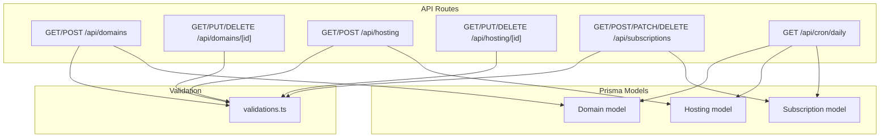
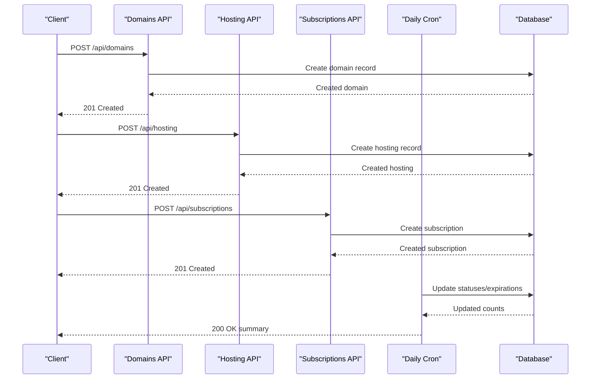
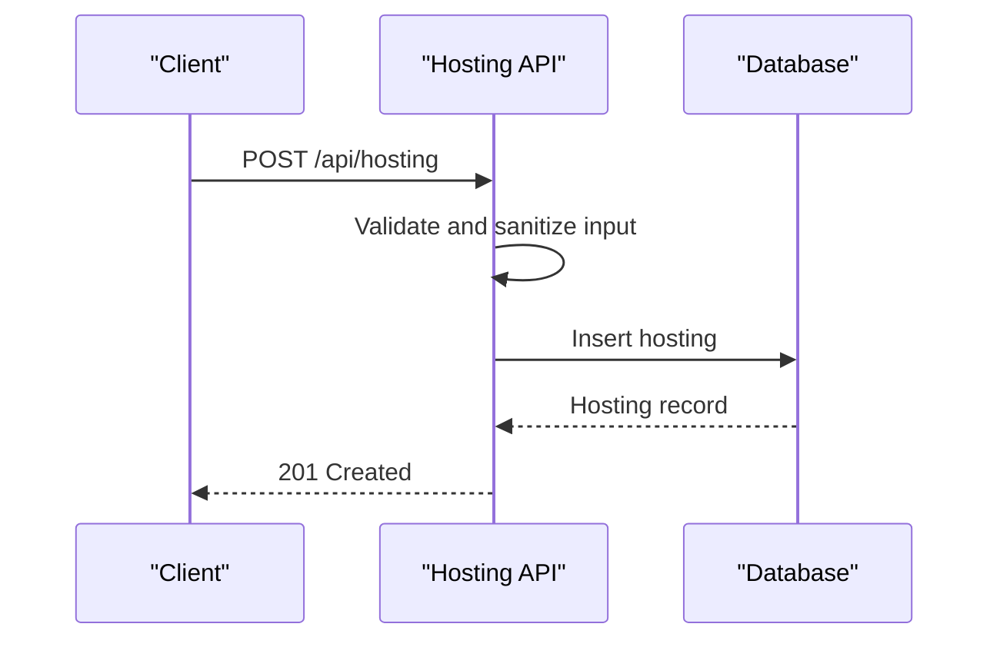
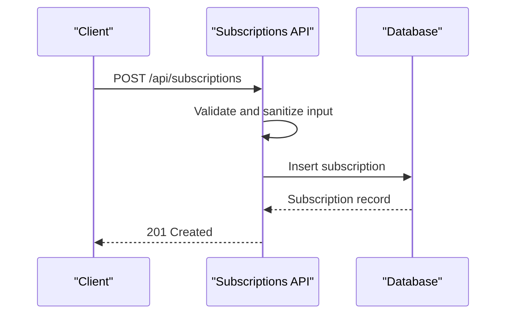
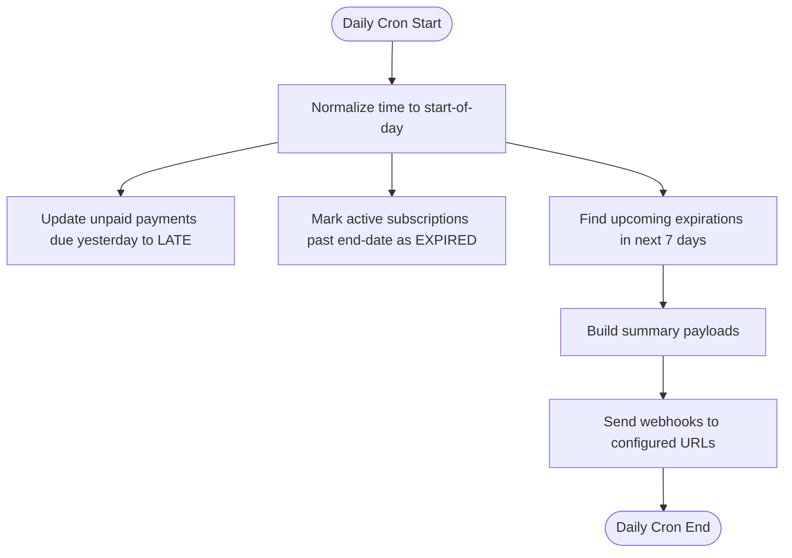
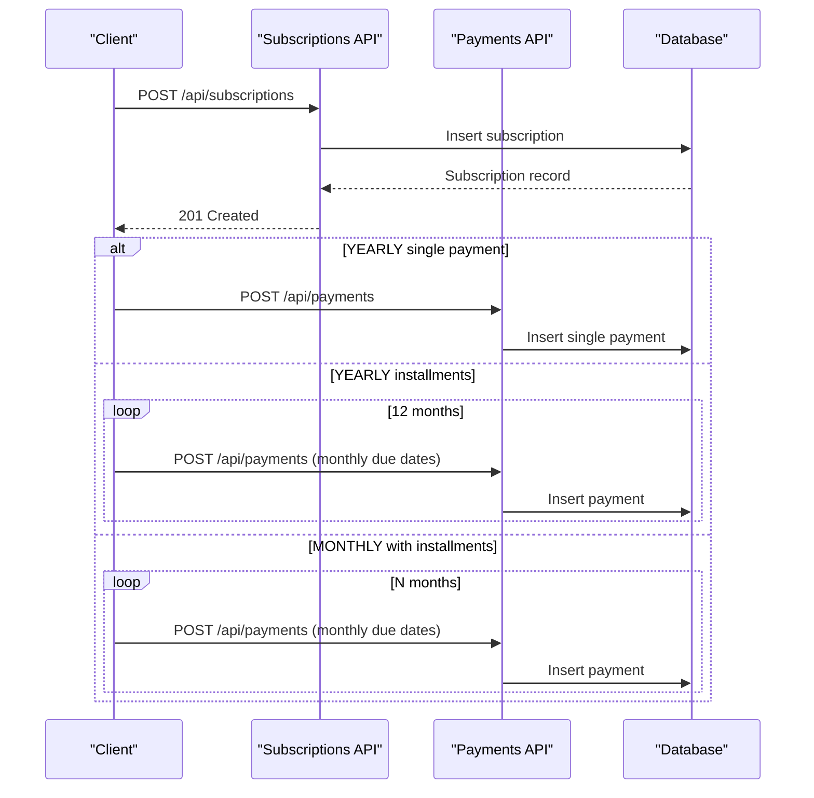
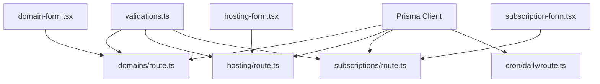
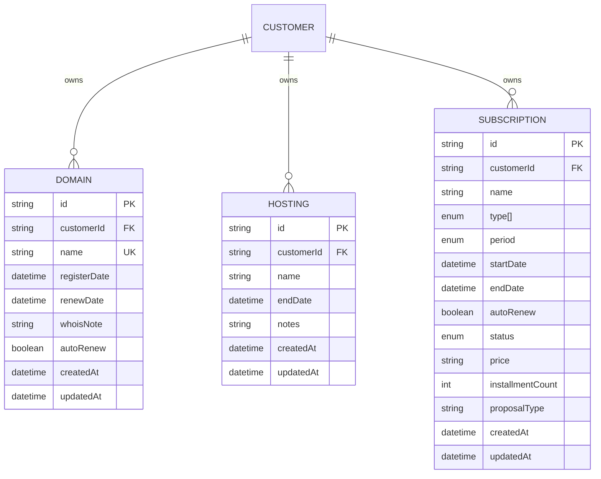

# Service Management API

<cite>
**Referenced Files in This Document**
- [schema.prisma](file://prisma/schema.prisma)
- [validations.ts](file://src/lib/validations.ts)
- [error-handler.ts](file://src/lib/error-handler.ts)
- [domains/route.ts](file://src/app/api/domains/route.ts)
- [domains/[id]/route.ts](file://src/app/api/domains/[id]/route.ts)
- [hosting/route.ts](file://src/app/api/hosting/route.ts)
- [hosting/[id]/route.ts](file://src/app/api/hosting/[id]/route.ts)
- [subscriptions/route.ts](file://src/app/api/subscriptions/route.ts)
- [cron/daily/route.ts](file://src/app/api/cron/daily/route.ts)
- [domain-form.tsx](file://src/components/domain-form.tsx)
- [hosting-form.tsx](file://src/components/hosting-form.tsx)
- [subscription-form.tsx](file://src/components/subscription-form.tsx)
</cite>

## Table of Contents
1. [Introduction](#introduction)
2. [Project Structure](#project-structure)
3. [Core Components](#core-components)
4. [Architecture Overview](#architecture-overview)
5. [Detailed Component Analysis](#detailed-component-analysis)
6. [Dependency Analysis](#dependency-analysis)
7. [Performance Considerations](#performance-considerations)
8. [Troubleshooting Guide](#troubleshooting-guide)
9. [Conclusion](#conclusion)
10. [Appendices](#appendices)

## Introduction
This document provides comprehensive API documentation for service management endpoints covering domains, hosting, and subscriptions. It describes CRUD operations, registration tracking, renewal management, status updates, service-specific fields, auto-renewal configuration, and technical specifications. It also covers WHOIS management for domains, hosting end-date tracking, subscription billing periods, and practical examples of service enrollment and renewal processing workflows.

## Project Structure
The service management API is implemented as Next.js App Router API routes under `/src/app/api/`. Each service type (domains, hosting, subscriptions) has dedicated routes for listing, creating, retrieving, updating, and deleting records. Validation schemas define request/response shapes, while Prisma models define database structures. A daily cron endpoint automates renewal and expiration processing and emits webhooks for upstream integrations.

**Diagram sources**
- [domains/route.ts:6-64](file://src/app/api/domains/route.ts#L6-L64)
- [domains/[id]/route.ts](file://src/app/api/domains/[id]/route.ts#L7-L65)
- [hosting/route.ts:6-63](file://src/app/api/hosting/route.ts#L6-L63)
- [hosting/[id]/route.ts](file://src/app/api/hosting/[id]/route.ts#L7-L64)
- [subscriptions/route.ts:7-133](file://src/app/api/subscriptions/route.ts#L7-L133)
- [cron/daily/route.ts:7-134](file://src/app/api/cron/daily/route.ts#L7-L134)
- [validations.ts:140-156](file://src/lib/validations.ts#L140-L156)
- [schema.prisma:228-256](file://prisma/schema.prisma#L228-L256)

**Section sources**
- [domains/route.ts:1-65](file://src/app/api/domains/route.ts#L1-L65)
- [hosting/route.ts:1-64](file://src/app/api/hosting/route.ts#L1-L64)
- [subscriptions/route.ts:1-134](file://src/app/api/subscriptions/route.ts#L1-L134)
- [cron/daily/route.ts:1-135](file://src/app/api/cron/daily/route.ts#L1-L135)
- [validations.ts:140-156](file://src/lib/validations.ts#L140-L156)
- [schema.prisma:228-256](file://prisma/schema.prisma#L228-L256)

## Core Components
- Domain service: Manages domain registrations, renewal dates, optional WHOIS notes, and auto-renewal flags.
- Hosting service: Tracks hosting packages with end dates and optional notes.
- Subscription service: Manages billing cycles, auto-renewal, statuses, and links to proposal types and payments.
- Daily cron job: Updates statuses, identifies upcoming expirations, and publishes webhook events.

**Section sources**
- [schema.prisma:228-256](file://prisma/schema.prisma#L228-L256)
- [validations.ts:140-156](file://src/lib/validations.ts#L140-L156)
- [cron/daily/route.ts:7-134](file://src/app/api/cron/daily/route.ts#L7-L134)

## Architecture Overview
The API follows a layered architecture:
- HTTP handlers in Next.js routes
- Validation via Zod schemas
- Database operations via Prisma ORM
- Background automation via a daily cron endpoint
- Optional webhook delivery for external systems

**Diagram sources**
- [domains/route.ts:44-64](file://src/app/api/domains/route.ts#L44-L64)
- [hosting/route.ts:44-63](file://src/app/api/hosting/route.ts#L44-L63)
- [subscriptions/route.ts:46-84](file://src/app/api/subscriptions/route.ts#L46-L84)
- [cron/daily/route.ts:7-134](file://src/app/api/cron/daily/route.ts#L7-L134)

## Detailed Component Analysis

### Domain Management API
Endpoints:
- GET /api/domains: List domains with pagination and filters (search, customerId).
- POST /api/domains: Create a domain with registration and renewal dates, optional WHOIS note, and auto-renew flag.
- GET /api/domains/[id]: Retrieve a domain by ID.
- PUT /api/domains/[id]: Update domain fields (partial update supported).
- DELETE /api/domains/[id]: Delete a domain.

Fields:
- customerId: string (required)
- name: string (required, unique)
- registerDate: string (YYYY-MM-DD)
- renewDate: string (YYYY-MM-DD)
- whoisNote: string (optional)
- autoRenew: boolean (default false)

WHOIS management:
- whoisNote supports optional administrative notes associated with the domain.

Auto-renewal:
- autoRenew flag indicates whether the domain is configured for automatic renewal.

Technical specifications:
- Validation enforced via domainCreateSchema and domainUpdateSchema.
- Sanitization applied to input fields.
- Pagination supported with page and limit query parameters.

Example request (create):
- Method: POST
- Path: /api/domains
- Body: { customerId, name, registerDate, renewDate, whoisNote?, autoRenew? }

Example response (success):
- Status: 201
- Body: Domain record including autoRenew and dates

**Diagram sources**
- [domains/route.ts:44-64](file://src/app/api/domains/route.ts#L44-L64)
- [validations.ts:140-147](file://src/lib/validations.ts#L140-L147)

**Section sources**
- [domains/route.ts:6-64](file://src/app/api/domains/route.ts#L6-L64)
- [domains/[id]/route.ts](file://src/app/api/domains/[id]/route.ts#L7-L65)
- [validations.ts:140-147](file://src/lib/validations.ts#L140-L147)
- [schema.prisma:228-239](file://prisma/schema.prisma#L228-L239)

### Hosting Management API
Endpoints:
- GET /api/hosting: List hosting packages with pagination and filters (search, customerId).
- POST /api/hosting: Create a hosting package with end date and optional notes.
- GET /api/hosting/[id]: Retrieve a hosting package by ID.
- PUT /api/hosting/[id]: Update hosting fields (partial update supported).
- DELETE /api/hosting/[id]: Delete a hosting package.

Fields:
- customerId: string (required)
- name: string (required)
- endDate: string (YYYY-MM-DD)
- notes: string (optional)

End-date tracking:
- endDate marks the contract/package expiration.

Notes:
- notes provide optional administrative remarks.

Technical specifications:
- Validation enforced via hostingCreateSchema and hostingUpdateSchema.
- Sanitization applied to input fields.
- Pagination supported with page and limit query parameters.

Example request (create):
- Method: POST
- Path: /api/hosting
- Body: { customerId, name, endDate, notes? }

Example response (success):
- Status: 201
- Body: Hosting record including endDate

**Diagram sources**
- [hosting/route.ts:44-63](file://src/app/api/hosting/route.ts#L44-L63)
- [validations.ts:150-155](file://src/lib/validations.ts#L150-L155)

**Section sources**
- [hosting/route.ts:6-63](file://src/app/api/hosting/route.ts#L6-L63)
- [hosting/[id]/route.ts](file://src/app/api/hosting/[id]/route.ts#L7-L64)
- [validations.ts:150-155](file://src/lib/validations.ts#L150-L155)
- [schema.prisma:244-253](file://prisma/schema.prisma#L244-L253)

### Subscription Management API
Endpoints:
- GET /api/subscriptions: List subscriptions with pagination and filters (search, customerId).
- POST /api/subscriptions: Create a subscription with billing period, dates, auto-renewal, status, pricing, and optional proposal type linkage.
- PATCH /api/subscriptions: Update a subscription (partial updates supported).
- DELETE /api/subscriptions: Delete a subscription.

Fields:
- customerId: string (required)
- name: string (optional; auto-generated if omitted)
- types: array of strings (required; maps to SubscriptionType enum)
- period: enum MONTHLY or YEARLY (default MONTHLY)
- startDate: string (YYYY-MM-DD)
- endDate: string (YYYY-MM-DD)
- autoRenew: boolean (default false)
- status: enum ACTIVE, EXPIRED, CANCELED (default ACTIVE)
- price: string (positive integer)
- installmentCount: number (optional)
- proposalType: string (optional; must not be empty if provided)

Billing periods:
- MONTHLY: monthly billing cycle
- YEARLY: yearly billing cycle with optional single or installments

Auto-renewal:
- autoRenew flag controls automatic renewal behavior.

Proposal type linkage:
- proposalType connects subscriptions to proposal types for reporting and analytics.

Technical specifications:
- Validation enforced via subscriptionCreateSchema and subscriptionUpdateSchema.
- Name generation logic maps first type to a readable label if name is not provided.
- Sanitization applied to input fields.
- Pagination supported with page and limit query parameters.

Example request (create):
- Method: POST
- Path: /api/subscriptions
- Body: { customerId, types[], period, startDate, endDate, autoRenew?, status?, price, proposalType? }

Example response (success):
- Status: 201
- Body: Subscription record including period, dates, autoRenew, status, price, and optional proposalType

**Diagram sources**
- [subscriptions/route.ts:46-84](file://src/app/api/subscriptions/route.ts#L46-L84)
- [validations.ts:101-138](file://src/lib/validations.ts#L101-L138)

**Section sources**
- [subscriptions/route.ts:7-133](file://src/app/api/subscriptions/route.ts#L7-L133)
- [validations.ts:101-138](file://src/lib/validations.ts#L101-L138)
- [schema.prisma:206-226](file://prisma/schema.prisma#L206-L226)

### Renewal and Expiration Processing
Daily cron endpoint:
- Updates overdue payments to LATE status.
- Marks active subscriptions whose end date has passed as EXPIRED.
- Identifies upcoming expirations within seven days (payments, domains, subscriptions, hosting).
- Publishes webhook summaries for:
  - daily-summary: counts of updated records and upcoming expirations
  - due-payments: list of payments due soon
  - expiring-services: list of services expiring soon (domains, subscriptions, hosting)

**Diagram sources**
- [cron/daily/route.ts:7-134](file://src/app/api/cron/daily/route.ts#L7-L134)

**Section sources**
- [cron/daily/route.ts:7-134](file://src/app/api/cron/daily/route.ts#L7-L134)

### Frontend Integration Examples
- Domain enrollment workflow:
  - Client collects customer, domain name, registration date, renewal date, optional WHOIS note, and auto-renew preference.
  - Client posts to /api/domains.
  - On success, client displays confirmation and optionally navigates to domain list.

- Hosting enrollment workflow:
  - Client selects customer, enters domain name and end date, adds optional notes.
  - Client posts to /api/hosting.
  - On success, client displays confirmation and navigates to hosting list.

- Subscription enrollment workflow:
  - Client selects customer, chooses type (from proposal types), billing period (MONTHLY or YEARLY), dates, price, and optional proposal type.
  - For YEARLY plans, client can choose single payment or 12 installments.
  - Client posts to /api/subscriptions.
  - On success, client optionally creates linked payments (single or installments) and updates proposal type.

**Diagram sources**
- [subscription-form.tsx:104-213](file://src/components/subscription-form.tsx#L104-L213)
- [subscriptions/route.ts:46-84](file://src/app/api/subscriptions/route.ts#L46-L84)

**Section sources**
- [domain-form.tsx:52-72](file://src/components/domain-form.tsx#L52-L72)
- [hosting-form.tsx:50-70](file://src/components/hosting-form.tsx#L50-L70)
- [subscription-form.tsx:104-213](file://src/components/subscription-form.tsx#L104-L213)

## Dependency Analysis
- API routes depend on validation schemas for request parsing and sanitization.
- API routes depend on Prisma client for database operations.
- Daily cron depends on Prisma models and webhook configuration utilities.
- Frontend forms depend on validation schemas and API routes.

**Diagram sources**
- [validations.ts:140-156](file://src/lib/validations.ts#L140-L156)
- [domains/route.ts:1-65](file://src/app/api/domains/route.ts#L1-L65)
- [hosting/route.ts:1-64](file://src/app/api/hosting/route.ts#L1-L64)
- [subscriptions/route.ts:1-134](file://src/app/api/subscriptions/route.ts#L1-L134)
- [cron/daily/route.ts:1-135](file://src/app/api/cron/daily/route.ts#L1-L135)
- [domain-form.tsx:1-173](file://src/components/domain-form.tsx#L1-L173)
- [hosting-form.tsx:1-157](file://src/components/hosting-form.tsx#L1-L157)
- [subscription-form.tsx:1-459](file://src/components/subscription-form.tsx#L1-L459)

**Section sources**
- [validations.ts:140-156](file://src/lib/validations.ts#L140-L156)
- [domains/route.ts:1-65](file://src/app/api/domains/route.ts#L1-L65)
- [hosting/route.ts:1-64](file://src/app/api/hosting/route.ts#L1-L64)
- [subscriptions/route.ts:1-134](file://src/app/api/subscriptions/route.ts#L1-L134)
- [cron/daily/route.ts:1-135](file://src/app/api/cron/daily/route.ts#L1-L135)
- [domain-form.tsx:1-173](file://src/components/domain-form.tsx#L1-L173)
- [hosting-form.tsx:1-157](file://src/components/hosting-form.tsx#L1-L157)
- [subscription-form.tsx:1-459](file://src/components/subscription-form.tsx#L1-L459)

## Performance Considerations
- Pagination: All list endpoints support page and limit parameters with a maximum limit enforced to prevent excessive loads.
- Bulk operations: The daily cron performs bulk updates for late payments and expired subscriptions to minimize repeated queries.
- Asynchronous processing: Webhook dispatch is performed asynchronously with retry scheduling to avoid blocking the cron execution.
- Input sanitization: Basic sanitization reduces risk of injection-like issues; consider additional escaping or HTML sanitization if displaying WHOIS notes externally.

## Troubleshooting Guide
Common issues and resolutions:
- Validation errors: Requests failing schema validation return structured error details with status 400. Review field types, required fields, and formats (e.g., date formats, numeric constraints).
- Unknown errors: Unhandled exceptions return generic 500 errors. Check server logs for stack traces.
- ID-related errors: Ensure IDs are non-empty strings matching expected patterns when using ID-based endpoints.
- WHOIS note display: WHOIS notes are sanitized; if special characters are missing, confirm the original input and sanitization rules.

**Section sources**
- [error-handler.ts:4-25](file://src/lib/error-handler.ts#L4-L25)

## Conclusion
The service management API provides robust CRUD capabilities for domains, hosting, and subscriptions with strong validation, pagination, and automated renewal processing. Auto-renewal flags, billing periods, and proposal type associations enable flexible service lifecycle management. The daily cron endpoint ensures timely status updates and integrates with external systems via webhooks.

## Appendices

### Data Models Overview

**Diagram sources**
- [schema.prisma:95-134](file://prisma/schema.prisma#L95-L134)
- [schema.prisma:228-256](file://prisma/schema.prisma#L228-L256)