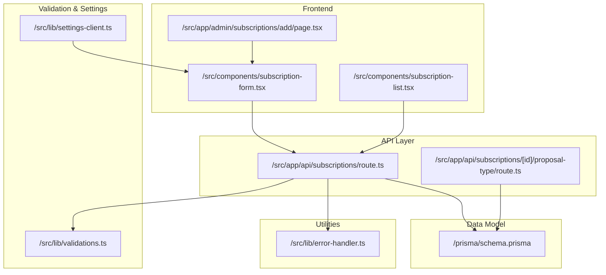
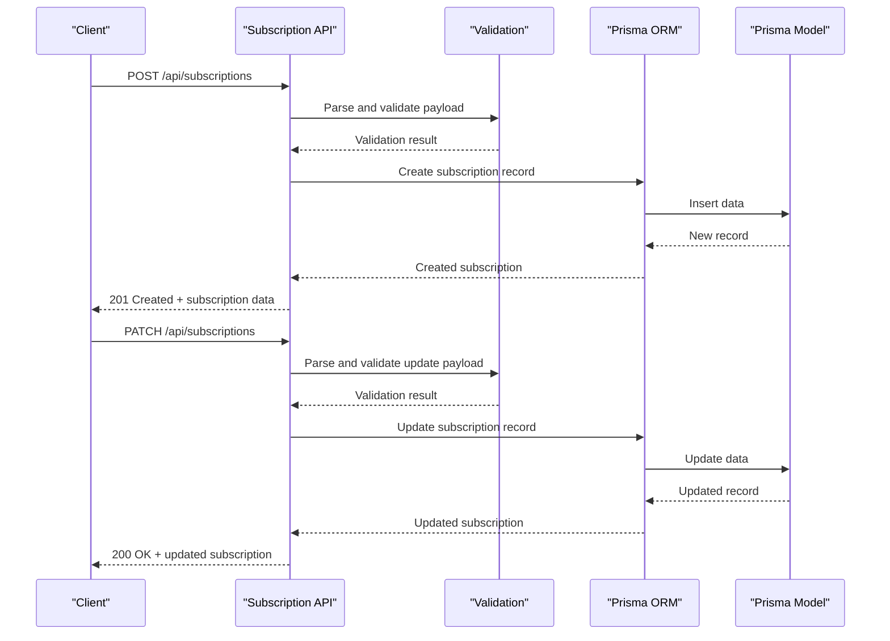
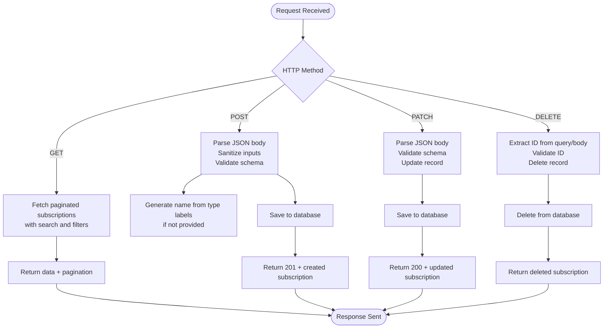
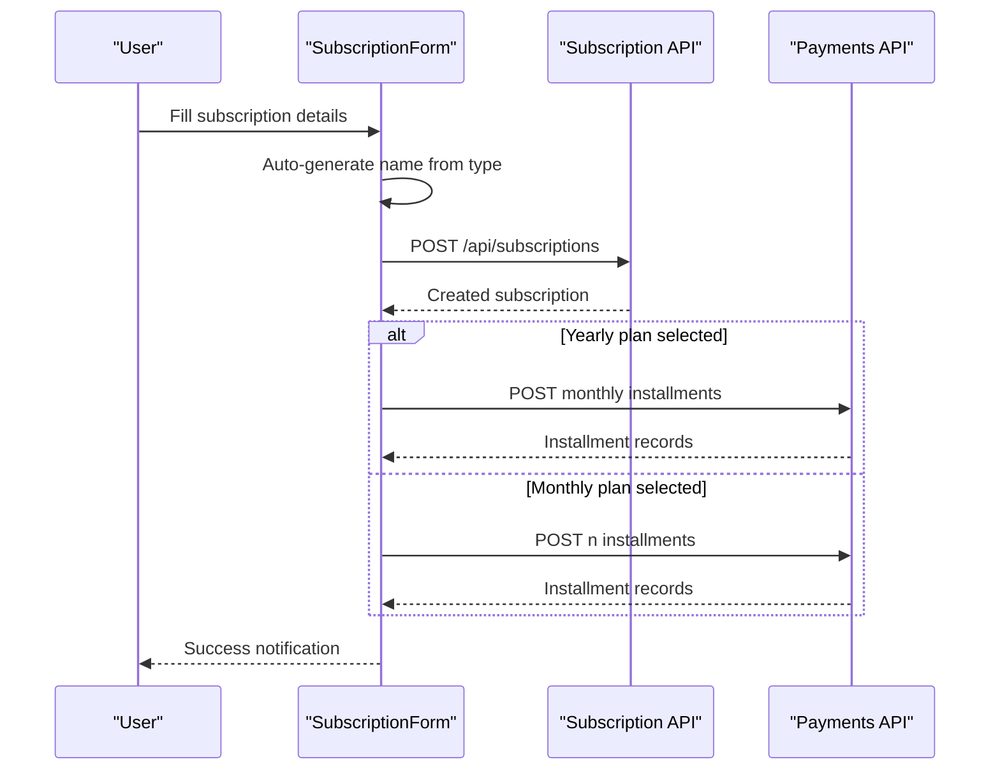
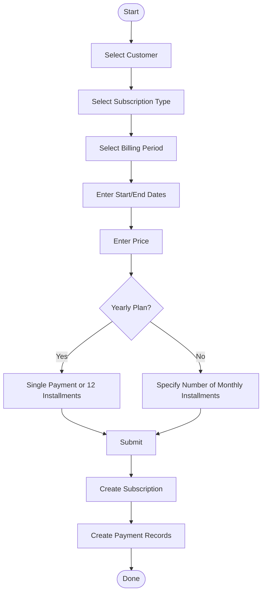
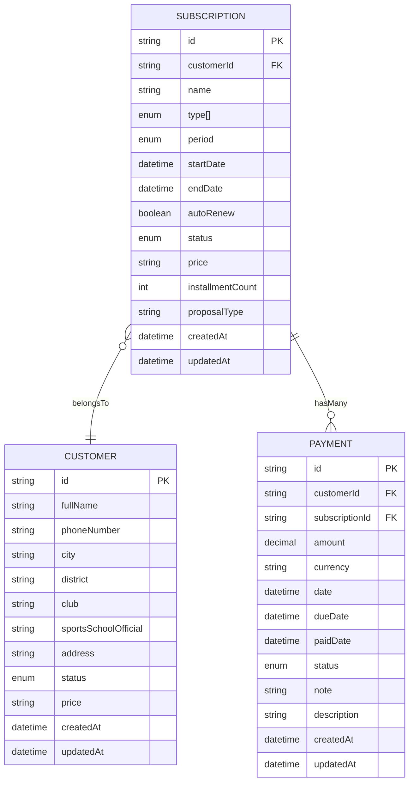
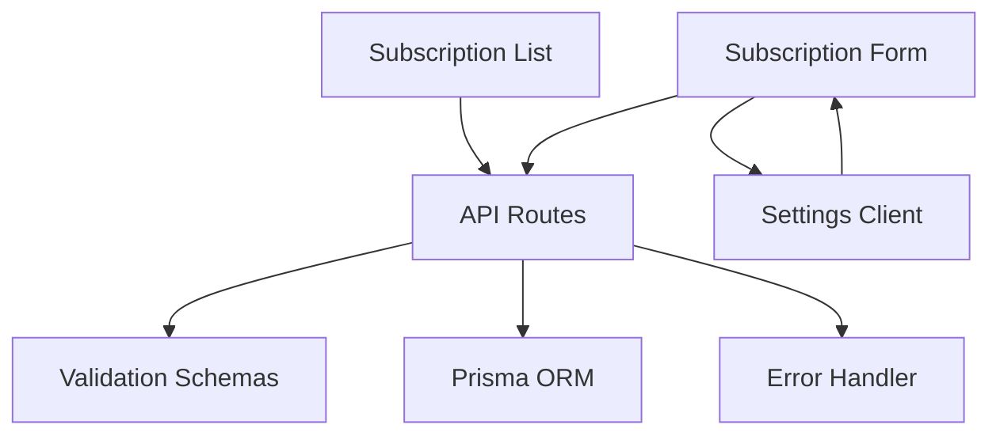

# Subscription Management API

<cite>
**Referenced Files in This Document**
- [route.ts](file://src/app/api/subscriptions/route.ts)
- [route.ts](file://src/app/api/subscriptions/[id]/proposal-type/route.ts)
- [schema.prisma](file://prisma/schema.prisma)
- [validations.ts](file://src/lib/validations.ts)
- [subscription-form.tsx](file://src/components/subscription-form.tsx)
- [subscription-list.tsx](file://src/components/subscription-list.tsx)
- [settings-client.ts](file://src/lib/settings-client.ts)
- [error-handler.ts](file://src/lib/error-handler.ts)
- [page.tsx](file://src/app/admin/subscriptions/add/page.tsx)
</cite>

## Table of Contents
1. [Introduction](#introduction)
2. [Project Structure](#project-structure)
3. [Core Components](#core-components)
4. [Architecture Overview](#architecture-overview)
5. [Detailed Component Analysis](#detailed-component-analysis)
6. [API Reference](#api-reference)
7. [Subscription Workflows](#subscription-workflows)
8. [Data Model](#data-model)
9. [Dependency Analysis](#dependency-analysis)
10. [Performance Considerations](#performance-considerations)
11. [Troubleshooting Guide](#troubleshooting-guide)
12. [Conclusion](#conclusion)

## Introduction
This document provides comprehensive API documentation for subscription management endpoints. It covers CRUD operations for multi-service subscriptions, including creation with billing periods, auto-renewal settings, and service associations. The documentation specifies subscription-specific fields such as subscription name, billing cycle, price, renewal date, status, and associated services. It also includes examples of subscription enrollment workflows, billing period management, and status updates, along with subscription-type relationships and service bundling capabilities.

## Project Structure
The subscription management functionality spans API routes, frontend forms, validation schemas, and the Prisma data model. The API routes handle CRUD operations, while the frontend components manage user interactions and workflows. Validation ensures data integrity, and the data model defines the underlying schema.

**Diagram sources**
- [route.ts:1-134](file://src/app/api/subscriptions/route.ts#L1-L134)
- [route.ts:1-47](file://src/app/api/subscriptions/[id]/proposal-type/route.ts#L1-L47)
- [subscription-form.tsx:1-459](file://src/components/subscription-form.tsx#L1-L459)
- [subscription-list.tsx:1-416](file://src/components/subscription-list.tsx#L1-L416)
- [page.tsx:1-15](file://src/app/admin/subscriptions/add/page.tsx#L1-L15)
- [validations.ts:1-243](file://src/lib/validations.ts#L1-L243)
- [settings-client.ts:1-126](file://src/lib/settings-client.ts#L1-L126)
- [error-handler.ts:1-34](file://src/lib/error-handler.ts#L1-L34)
- [schema.prisma:1-756](file://prisma/schema.prisma#L1-L756)

**Section sources**
- [route.ts:1-134](file://src/app/api/subscriptions/route.ts#L1-L134)
- [route.ts:1-47](file://src/app/api/subscriptions/[id]/proposal-type/route.ts#L1-L47)
- [subscription-form.tsx:1-459](file://src/components/subscription-form.tsx#L1-L459)
- [subscription-list.tsx:1-416](file://src/components/subscription-list.tsx#L1-L416)
- [page.tsx:1-15](file://src/app/admin/subscriptions/add/page.tsx#L1-L15)
- [validations.ts:1-243](file://src/lib/validations.ts#L1-L243)
- [settings-client.ts:1-126](file://src/lib/settings-client.ts#L1-L126)
- [error-handler.ts:1-34](file://src/lib/error-handler.ts#L1-L34)
- [schema.prisma:1-756](file://prisma/schema.prisma#L1-L756)

## Core Components
- API Routes: Handle GET (list/search), POST (create), PATCH (update), and DELETE (remove) operations for subscriptions.
- Frontend Forms: Provide user interfaces for creating and editing subscriptions, including billing period selection and installment planning.
- Validation Schemas: Enforce field requirements, formats, and constraints for subscription data.
- Data Model: Defines subscription fields, enums for billing periods and statuses, and relationships to customers and payments.
- Proposal Type Association: Supports linking subscriptions to proposal types via a dedicated endpoint.

**Section sources**
- [route.ts:7-134](file://src/app/api/subscriptions/route.ts#L7-L134)
- [subscription-form.tsx:104-213](file://src/components/subscription-form.tsx#L104-L213)
- [validations.ts:101-138](file://src/lib/validations.ts#L101-L138)
- [schema.prisma:206-226](file://prisma/schema.prisma#L206-L226)
- [route.ts:5-47](file://src/app/api/subscriptions/[id]/proposal-type/route.ts#L5-L47)

## Architecture Overview
The subscription management API follows a layered architecture:
- Presentation Layer: Next.js API routes expose REST endpoints.
- Business Logic: Validation schemas and error handling ensure robust processing.
- Data Access: Prisma ORM manages database operations with strong typing.
- Frontend Integration: React components coordinate user interactions and trigger API calls.

**Diagram sources**
- [route.ts:46-112](file://src/app/api/subscriptions/route.ts#L46-L112)
- [validations.ts:101-138](file://src/lib/validations.ts#L101-L138)
- [schema.prisma:206-226](file://prisma/schema.prisma#L206-L226)

## Detailed Component Analysis

### API Routes
- GET /api/subscriptions: Lists subscriptions with optional search and pagination filters.
- POST /api/subscriptions: Creates a new subscription with automatic name generation based on type labels.
- PATCH /api/subscriptions: Updates an existing subscription with sanitized and validated fields.
- DELETE /api/subscriptions: Removes a subscription by ID.
- PATCH /api/subscriptions/[id]/proposal-type: Associates or updates a proposal type for a subscription.

**Diagram sources**
- [route.ts:7-134](file://src/app/api/subscriptions/route.ts#L7-L134)
- [route.ts:5-47](file://src/app/api/subscriptions/[id]/proposal-type/route.ts#L5-L47)

**Section sources**
- [route.ts:7-134](file://src/app/api/subscriptions/route.ts#L7-L134)
- [route.ts:5-47](file://src/app/api/subscriptions/[id]/proposal-type/route.ts#L5-L47)

### Frontend Forms and Workflows
- SubscriptionForm: Handles creation and editing, including billing period selection, installment planning, and proposal type association.
- SubscriptionList: Displays paginated lists, filtering, and bulk actions (view, edit, delete).
- Add Page: Provides a dedicated page for creating new subscriptions.

**Diagram sources**
- [subscription-form.tsx:104-213](file://src/components/subscription-form.tsx#L104-L213)
- [route.ts:46-85](file://src/app/api/subscriptions/route.ts#L46-L85)

**Section sources**
- [subscription-form.tsx:1-459](file://src/components/subscription-form.tsx#L1-L459)
- [subscription-list.tsx:1-416](file://src/components/subscription-list.tsx#L1-L416)
- [page.tsx:1-15](file://src/app/admin/subscriptions/add/page.tsx#L1-L15)

## API Reference

### Base URL
All endpoints are relative to the application's base URL.

### Authentication and Authorization
- Authentication is handled by NextAuth integration outside the scope of this document.
- API routes enforce input sanitization and validation.

### Error Handling
- Validation errors return structured messages with status 400.
- General server errors return status 500 with a generic message.
- Input sanitization removes potentially harmful characters.

**Section sources**
- [error-handler.ts:4-25](file://src/lib/error-handler.ts#L4-L25)

### Endpoints

#### GET /api/subscriptions
- Description: Retrieve paginated list of subscriptions with optional filters.
- Query Parameters:
  - page: integer, default 1
  - limit: integer, min 1, max 100
  - search: string, partial match on name
  - customerId: string, filter by customer ID
- Response: Paginated array of subscriptions with metadata.

**Section sources**
- [route.ts:7-44](file://src/app/api/subscriptions/route.ts#L7-L44)

#### POST /api/subscriptions
- Description: Create a new subscription.
- Request Body Fields:
  - customerId: string (required)
  - name: string (optional, auto-generated if omitted)
  - types: array of strings (required, at least one)
  - period: "MONTHLY" | "YEARLY" (default "MONTHLY")
  - startDate: string (YYYY-MM-DD)
  - endDate: string (YYYY-MM-DD)
  - autoRenew: boolean (default false)
  - status: "ACTIVE" | "EXPIRED" | "CANCELED" (default "ACTIVE")
  - price: string (digits only, positive)
  - installmentCount: number (optional)
  - proposalType: string (optional)
- Response: 201 Created with created subscription object.

**Section sources**
- [route.ts:46-85](file://src/app/api/subscriptions/route.ts#L46-L85)
- [validations.ts:101-127](file://src/lib/validations.ts#L101-L127)

#### PATCH /api/subscriptions
- Description: Update an existing subscription.
- Request Body Fields:
  - id: string (required)
  - All create fields except id are supported (partial updates allowed)
- Response: 200 OK with updated subscription object.

**Section sources**
- [route.ts:87-112](file://src/app/api/subscriptions/route.ts#L87-L112)
- [validations.ts:129-138](file://src/lib/validations.ts#L129-L138)

#### DELETE /api/subscriptions
- Description: Delete a subscription.
- Query Parameters:
  - id: string (required)
- Response: 200 OK with deleted subscription object.

**Section sources**
- [route.ts:114-133](file://src/app/api/subscriptions/route.ts#L114-L133)

#### PATCH /api/subscriptions/[id]/proposal-type
- Description: Associate or update a proposal type for a subscription.
- Path Parameters:
  - id: string (required)
- Request Body Fields:
  - proposalType: string | null | undefined
- Response: 200 OK with updated subscription object.

**Section sources**
- [route.ts:5-47](file://src/app/api/subscriptions/[id]/proposal-type/route.ts#L5-L47)

## Subscription Workflows

### Creating a Subscription with Billing Periods
- Choose customer and subscription type.
- Select billing period (monthly/yearly).
- Enter dates and price.
- For yearly plans, choose single payment or 12-installment plan.
- For monthly plans, specify the number of installments.
- Submit to create the subscription and related payment records.

**Diagram sources**
- [subscription-form.tsx:104-213](file://src/components/subscription-form.tsx#L104-L213)
- [route.ts:46-85](file://src/app/api/subscriptions/route.ts#L46-L85)

### Updating Subscription Status
- Navigate to the subscription list or detail view.
- Edit the subscription and change the status field.
- Submit the update to persist the new status.

**Section sources**
- [subscription-list.tsx:384-410](file://src/components/subscription-list.tsx#L384-L410)
- [route.ts:87-112](file://src/app/api/subscriptions/route.ts#L87-L112)

### Managing Proposal Type Associations
- After creating a subscription, associate a proposal type via the dedicated endpoint.
- The proposal type influences naming and categorization.

**Section sources**
- [route.ts:5-47](file://src/app/api/subscriptions/[id]/proposal-type/route.ts#L5-L47)
- [settings-client.ts:10-32](file://src/lib/settings-client.ts#L10-L32)

## Data Model
The subscription entity includes fields for customer association, type enumeration, billing period, dates, auto-renewal, status, pricing, and optional proposal type linkage.

**Diagram sources**
- [schema.prisma:206-226](file://prisma/schema.prisma#L206-L226)
- [schema.prisma:95-134](file://prisma/schema.prisma#L95-L134)
- [schema.prisma:305-343](file://prisma/schema.prisma#L305-L343)

**Section sources**
- [schema.prisma:184-226](file://prisma/schema.prisma#L184-L226)

## Dependency Analysis
- API routes depend on validation schemas for input parsing and Prisma for database operations.
- Frontend components depend on API routes and settings client for proposal type data.
- Error handling utilities centralize error responses and input sanitization.

**Diagram sources**
- [route.ts:1-5](file://src/app/api/subscriptions/route.ts#L1-L5)
- [validations.ts:1-5](file://src/lib/validations.ts#L1-L5)
- [error-handler.ts:1-5](file://src/lib/error-handler.ts#L1-L5)
- [subscription-form.tsx:1-13](file://src/components/subscription-form.tsx#L1-L13)
- [subscription-list.tsx:1-19](file://src/components/subscription-list.tsx#L1-L19)
- [settings-client.ts:10-32](file://src/lib/settings-client.ts#L10-L32)

**Section sources**
- [route.ts:1-5](file://src/app/api/subscriptions/route.ts#L1-L5)
- [subscription-form.tsx:1-13](file://src/components/subscription-form.tsx#L1-L13)
- [subscription-list.tsx:1-19](file://src/components/subscription-list.tsx#L1-L19)
- [settings-client.ts:10-32](file://src/lib/settings-client.ts#L10-L32)
- [error-handler.ts:1-5](file://src/lib/error-handler.ts#L1-L5)

## Performance Considerations
- Pagination: Use page and limit parameters to control result sizes.
- Filtering: Apply search and customerId filters to reduce dataset size.
- Batch Operations: Installment creation uses batched requests; ensure appropriate concurrency limits.
- Validation Overhead: Keep validation schemas concise and avoid expensive checks.

## Troubleshooting Guide
- Validation Errors: Review returned validation details and correct invalid fields.
- ID Validation: Ensure IDs conform to allowed character patterns.
- Proposal Type Issues: Verify proposal type existence and format before association.
- Database Constraints: Confirm foreign key relationships and required fields.

**Section sources**
- [error-handler.ts:4-33](file://src/lib/error-handler.ts#L4-L33)
- [route.ts:14-20](file://src/app/api/subscriptions/[id]/proposal-type/route.ts#L14-L20)

## Conclusion
The subscription management API provides a robust foundation for handling multi-service subscriptions with flexible billing periods, auto-renewal options, and proposal type associations. The combination of strict validation, clear error handling, and comprehensive frontend workflows enables efficient subscription lifecycle management.