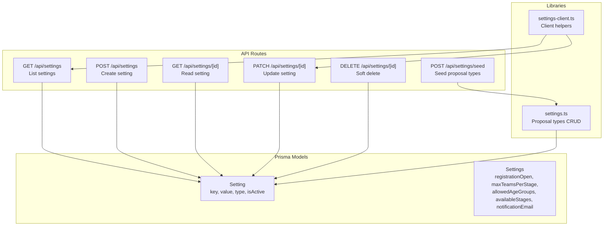
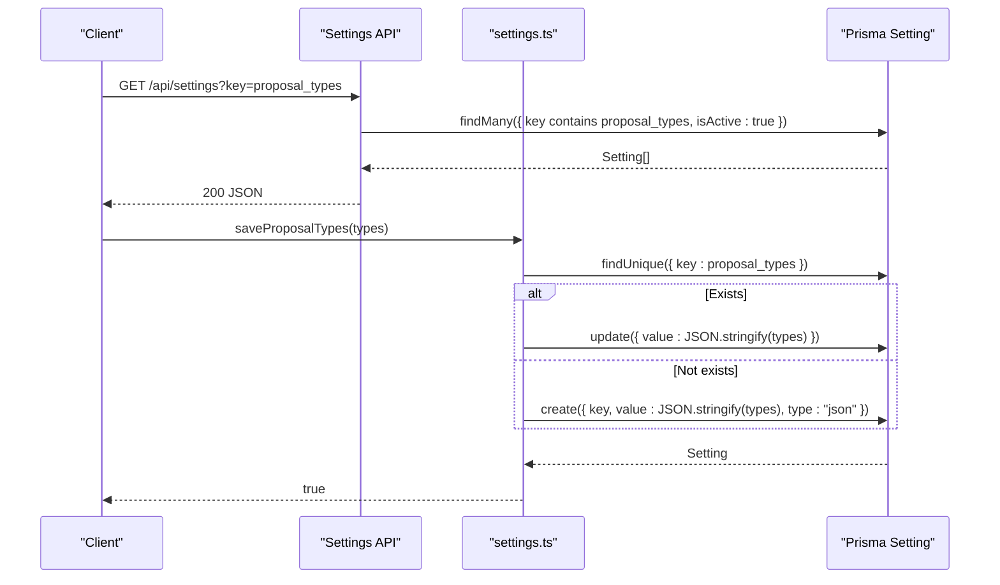
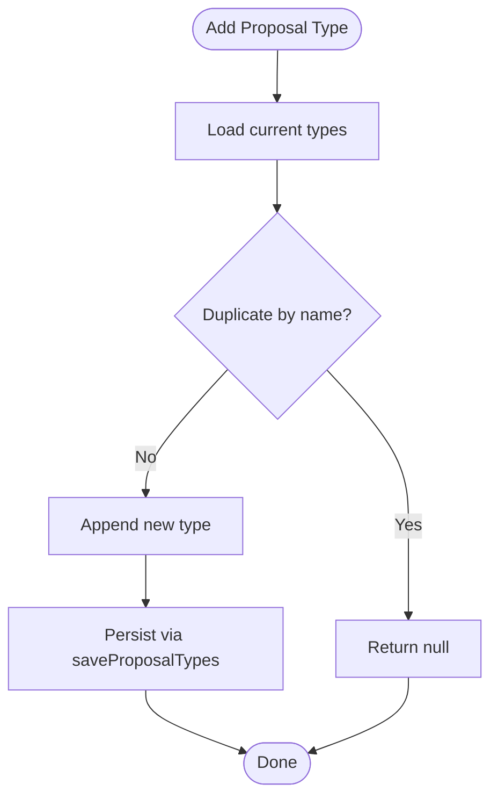
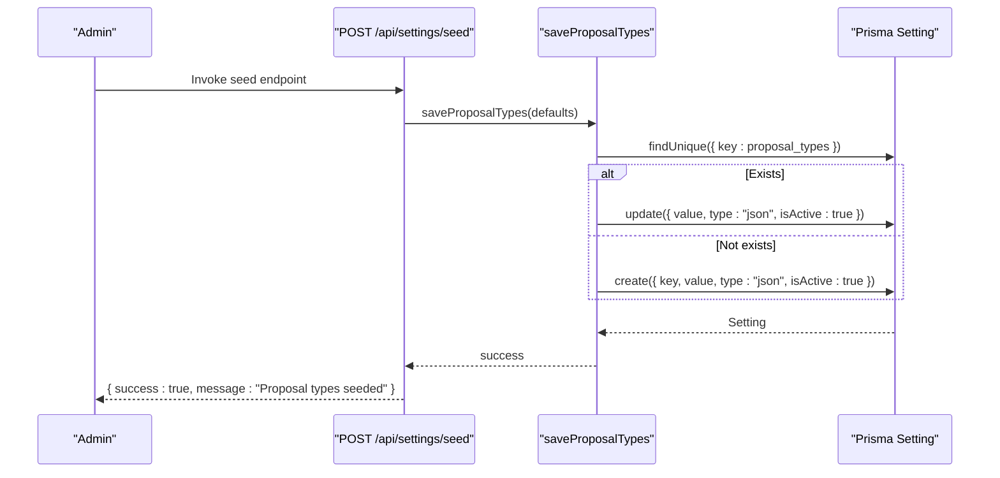
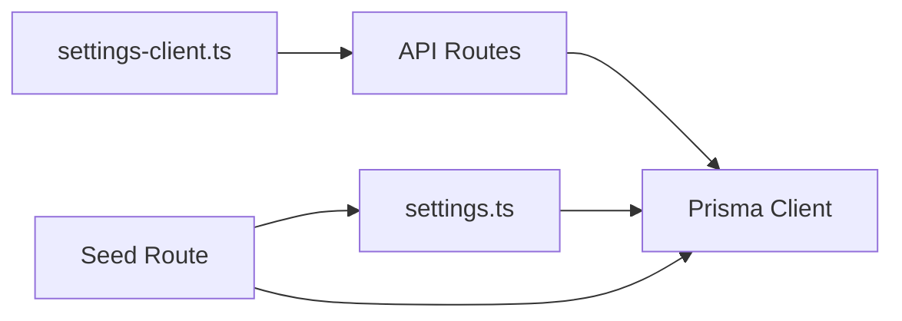

# Settings & Configuration API

<cite>
**Referenced Files in This Document**
- [schema.prisma](file://prisma/schema.prisma)
- [settings.ts](file://src/lib/settings.ts)
- [settings-client.ts](file://src/lib/settings-client.ts)
- [settings.route.ts](file://src/app/api/settings/route.ts)
- [settings.[id].route.ts](file://src/app/api/settings/[id]/route.ts)
- [settings.seed.route.ts](file://src/app/api/settings/seed/route.ts)
- [seed-settings.js](file://scripts/seed-settings.js)
- [clean-settings.js](file://scripts/clean-settings.js)
- [proposal-types.page.tsx](file://src/app/admin/settings/proposal-types/page.tsx)
- [webhooks.page.tsx](file://src/app/admin/settings/webhooks/page.tsx)
</cite>

## Table of Contents
1. [Introduction](#introduction)
2. [Project Structure](#project-structure)
3. [Core Components](#core-components)
4. [Architecture Overview](#architecture-overview)
5. [Detailed Component Analysis](#detailed-component-analysis)
6. [Dependency Analysis](#dependency-analysis)
7. [Performance Considerations](#performance-considerations)
8. [Troubleshooting Guide](#troubleshooting-guide)
9. [Conclusion](#conclusion)
10. [Appendices](#appendices)

## Introduction
This document describes the Settings & Configuration API that powers system-wide configuration and key-value settings. It covers:
- CRUD operations for generic key-value settings
- Default value management for proposal types
- Seed endpoint for initial data setup
- Validation rules and category semantics
- Backup and restore procedures
- Examples of customization, batch updates, and configuration workflows

The system distinguishes between:
- Generic key-value settings stored in the app_settings table
- Typed system settings (e.g., registration open, max teams per stage) stored in the settings table

## Project Structure
The settings system spans backend API routes, Prisma models, and client-side helpers:
- Backend API: Next.js routes under src/app/api/settings
- Data model: Prisma schema defines Setting and Settings models
- Client helpers: TypeScript modules for proposal types and generic settings
- Admin UI: Pages for proposal types and webhook configuration

**Diagram sources**
- [settings.route.ts:1-72](file://src/app/api/settings/route.ts#L1-L72)
- [settings.[id].route.ts](file://src/app/api/settings/[id]/route.ts#L1-L82)
- [settings.seed.route.ts:1-21](file://src/app/api/settings/seed/route.ts#L1-L21)
- [schema.prisma:171-182](file://prisma/schema.prisma#L171-L182)
- [settings.ts:1-154](file://src/lib/settings.ts#L1-L154)
- [settings-client.ts:1-126](file://src/lib/settings-client.ts#L1-L126)

**Section sources**
- [settings.route.ts:1-72](file://src/app/api/settings/route.ts#L1-L72)
- [settings.[id].route.ts](file://src/app/api/settings/[id]/route.ts#L1-L82)
- [settings.seed.route.ts:1-21](file://src/app/api/settings/seed/route.ts#L1-L21)
- [schema.prisma:171-182](file://prisma/schema.prisma#L171-L182)

## Core Components
- Generic key-value settings API
  - List settings with optional key filtering
  - Create settings with validation
  - Read/update/delete settings by ID
  - Soft delete via deactivation flag
- Proposal types configuration
  - Stored as JSON under a dedicated key
  - CRUD operations with defaults fallback
- Seed endpoint
  - Initializes proposal types with predefined values
- Client helpers
  - Fetch, create/update, add/update/delete proposal types
  - Default fallback when no persisted setting exists

**Section sources**
- [settings.route.ts:1-72](file://src/app/api/settings/route.ts#L1-L72)
- [settings.[id].route.ts](file://src/app/api/settings/[id]/route.ts#L1-L82)
- [settings.ts:1-154](file://src/lib/settings.ts#L1-L154)
- [settings-client.ts:1-126](file://src/lib/settings-client.ts#L1-L126)
- [settings.seed.route.ts:1-21](file://src/app/api/settings/seed/route.ts#L1-L21)

## Architecture Overview
The Settings API follows a layered architecture:
- Presentation: Next.js API routes handle HTTP requests and responses
- Domain: Business logic for proposal types and generic settings
- Persistence: Prisma ORM mapping to PostgreSQL tables

**Diagram sources**
- [settings.route.ts:4-35](file://src/app/api/settings/route.ts#L4-L35)
- [settings.ts:66-95](file://src/lib/settings.ts#L66-L95)

## Detailed Component Analysis

### Generic Key-Value Settings API
Endpoints:
- GET /api/settings
  - Optional query param key filters keys containing the substring
  - Returns active settings ordered by key
- POST /api/settings
  - Validates presence of key and value
  - Prevents duplicate keys
  - Creates setting with optional type and activation flag
- GET /api/settings/[id]
  - Returns the setting by internal ID
- PATCH /api/settings/[id]
  - Updates key, value, type, and isActive atomically
- DELETE /api/settings/[id]
  - Soft deletes by setting isActive to false

Validation rules:
- Required fields: key, value
- Unique key constraint enforced at creation
- type defaults to string if omitted
- isActive defaults to true if omitted

Category semantics:
- No explicit categories are defined in the schema
- Keys can be organized by convention (e.g., prefixed namespaces)
- Filtering supports substring matching for discovery

Backup and restore:
- Export: Query GET /api/settings and persist JSON
- Restore: POST /api/settings for missing keys; PATCH /api/settings/[id] to update values

**Section sources**
- [settings.route.ts:1-72](file://src/app/api/settings/route.ts#L1-L72)
- [settings.[id].route.ts](file://src/app/api/settings/[id]/route.ts#L1-L82)
- [schema.prisma:171-182](file://prisma/schema.prisma#L171-L182)

### Proposal Types Configuration
Purpose:
- Manage proposal type definitions used across the system
- Provide defaults when no persisted configuration exists

Key behaviors:
- Default fallback: If no setting exists for the proposal types key, a built-in default set is returned
- CRUD operations:
  - Add: Enforces uniqueness by name (case-insensitive)
  - Update: By ID
  - Delete: By ID
- Storage: JSON-encoded array under a single key

Client integration:
- Client helpers mirror server-side operations
- Fetches via generic settings API with key filtering
- Persists changes by creating or updating the single JSON setting

**Diagram sources**
- [settings.ts:97-123](file://src/lib/settings.ts#L97-L123)
- [settings-client.ts:73-94](file://src/lib/settings-client.ts#L73-L94)

**Section sources**
- [settings.ts:1-154](file://src/lib/settings.ts#L1-L154)
- [settings-client.ts:1-126](file://src/lib/settings-client.ts#L1-L126)
- [proposal-types.page.tsx:1-23](file://src/app/admin/settings/proposal-types/page.tsx#L1-L23)

### Seed Endpoint and Initial Setup
Purpose:
- Initialize proposal types during onboarding or reset scenarios

Behavior:
- POST /api/settings/seed creates or updates the proposal types setting with defaults
- A Node script is also available for programmatic seeding

**Diagram sources**
- [settings.seed.route.ts:1-21](file://src/app/api/settings/seed/route.ts#L1-L21)
- [seed-settings.js:1-56](file://scripts/seed-settings.js#L1-L56)
- [settings.ts:66-95](file://src/lib/settings.ts#L66-L95)

**Section sources**
- [settings.seed.route.ts:1-21](file://src/app/api/settings/seed/route.ts#L1-L21)
- [seed-settings.js:1-56](file://scripts/seed-settings.js#L1-L56)
- [clean-settings.js:1-20](file://scripts/clean-settings.js#L1-L20)

### System Parameter Configuration (Settings Model)
Beyond generic key-value settings, the system includes a typed Settings model for core system parameters:
- registrationOpen: Boolean controlling registration availability
- maxTeamsPerStage: Integer limiting teams per stage
- allowedAgeGroups: Enum array
- availableStages: Enum array
- notificationEmail: Optional string

These parameters are defined in the Prisma schema and can be managed via dedicated admin pages or APIs as needed.

**Section sources**
- [schema.prisma:157-169](file://prisma/schema.prisma#L157-L169)
- [webhooks.page.tsx:1-315](file://src/app/admin/settings/webhooks/page.tsx#L1-L315)

## Dependency Analysis
- API routes depend on Prisma for persistence
- Client helpers depend on generic settings API
- Proposal types logic depends on generic settings API and Prisma
- Seed endpoint depends on proposal types library and Prisma

**Diagram sources**
- [settings.route.ts:1-72](file://src/app/api/settings/route.ts#L1-L72)
- [settings.[id].route.ts](file://src/app/api/settings/[id]/route.ts#L1-L82)
- [settings.ts:1-154](file://src/lib/settings.ts#L1-L154)
- [settings-client.ts:1-126](file://src/lib/settings-client.ts#L1-L126)
- [settings.seed.route.ts:1-21](file://src/app/api/settings/seed/route.ts#L1-L21)

**Section sources**
- [settings.route.ts:1-72](file://src/app/api/settings/route.ts#L1-L72)
- [settings.[id].route.ts](file://src/app/api/settings/[id]/route.ts#L1-L82)
- [settings.ts:1-154](file://src/lib/settings.ts#L1-L154)
- [settings-client.ts:1-126](file://src/lib/settings-client.ts#L1-L126)
- [settings.seed.route.ts:1-21](file://src/app/api/settings/seed/route.ts#L1-L21)

## Performance Considerations
- Indexing: The Setting model has a unique key on key; consider adding composite indexes if querying by type or isActive frequently
- Pagination: For large datasets, implement pagination in list endpoints
- Caching: Cache default proposal types on the server to avoid repeated parsing
- Batch operations: Prefer bulk updates for large-scale configuration changes

## Troubleshooting Guide
Common issues and resolutions:
- Duplicate key on creation
  - Symptom: 400 error indicating key already exists
  - Resolution: Use PATCH to update or choose a unique key
- Non-existent setting lookup
  - Symptom: 404 error when reading by ID
  - Resolution: Ensure the ID is correct or create the setting first
- Soft deletion
  - Behavior: DELETE sets isActive to false; ensure consumers filter by isActive
- Proposal types conflicts
  - Symptom: Adding duplicates by name fails
  - Resolution: Use unique names or update existing entries

**Section sources**
- [settings.route.ts:37-71](file://src/app/api/settings/route.ts#L37-L71)
- [settings.[id].route.ts](file://src/app/api/settings/[id]/route.ts#L58-L81)
- [settings.ts:97-123](file://src/lib/settings.ts#L97-L123)

## Conclusion
The Settings & Configuration API provides a robust foundation for managing system-wide configuration. It supports:
- Flexible key-value settings with validation and soft deletion
- Default value management for proposal types with client-side helpers
- Seed endpoints for initial setup and recovery
- Clear separation between generic settings and typed system parameters

## Appendices

### API Definitions

- GET /api/settings
  - Query parameters: key (optional)
  - Response: Array of Setting objects (active only)
- POST /api/settings
  - Request body: { key, value, type?, isActive? }
  - Response: Created Setting
- GET /api/settings/[id]
  - Path parameter: id
  - Response: Setting object
- PATCH /api/settings/[id]
  - Path parameter: id
  - Request body: { key?, value?, type?, isActive? }
  - Response: Updated Setting
- DELETE /api/settings/[id]
  - Path parameter: id
  - Response: { success: true }

- POST /api/settings/seed
  - Request body: none
  - Response: { success: true, message: "Proposal types seeded" }

### Example Workflows

- Customize proposal types
  - Fetch current types via GET /api/settings?key=proposal_types
  - Add a new type via client helper; it persists as a single JSON setting
  - Update or delete types by ID using PATCH/DELETE

- Batch setting updates
  - Iterate over target keys and call PATCH /api/settings/[id] for each

- Configuration backup and restore
  - Backup: GET /api/settings to export all active settings
  - Restore: POST /api/settings for missing keys; PATCH /api/settings/[id] for updates

- Configuration restoration after cleanup
  - Use POST /api/settings/seed to reinitialize proposal types
  - Alternatively, use the Node script to seed programmatically

**Section sources**
- [settings.route.ts:1-72](file://src/app/api/settings/route.ts#L1-L72)
- [settings.[id].route.ts](file://src/app/api/settings/[id]/route.ts#L1-L82)
- [settings.seed.route.ts:1-21](file://src/app/api/settings/seed/route.ts#L1-L21)
- [seed-settings.js:1-56](file://scripts/seed-settings.js#L1-L56)
- [clean-settings.js:1-20](file://scripts/clean-settings.js#L1-L20)
- [settings-client.ts:1-126](file://src/lib/settings-client.ts#L1-L126)