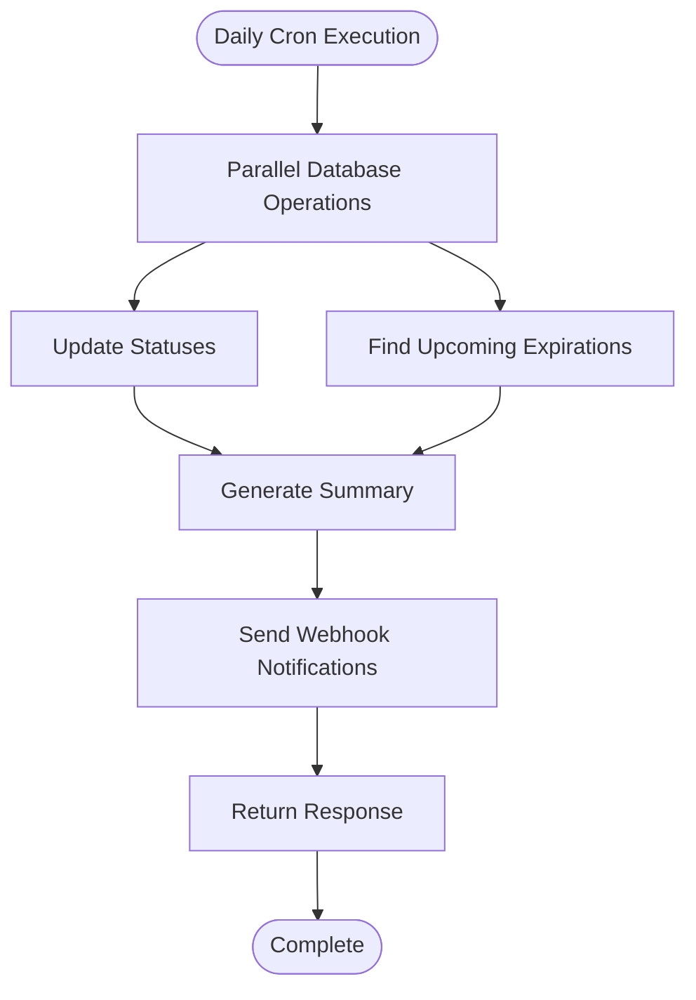
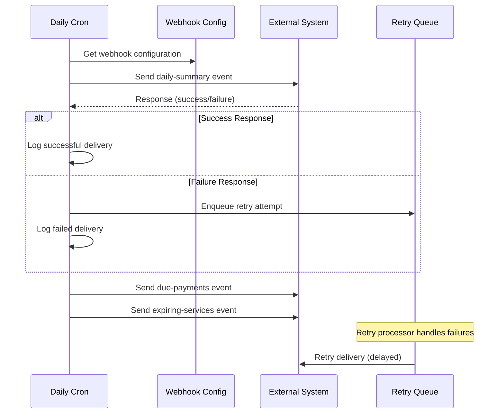
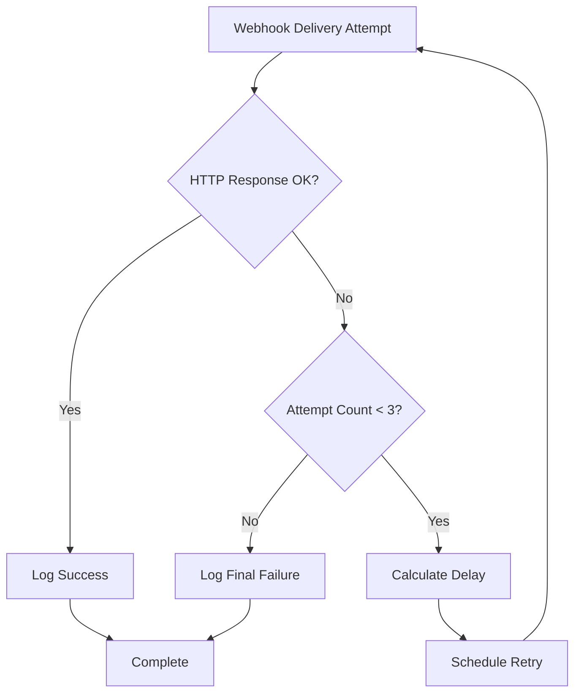

# Cron Scheduled Tasks API

<cite>
**Referenced Files in This Document**
- [route.ts](file://src/app/api/cron/daily/route.ts)
- [webhook-config.ts](file://src/lib/webhook-config.ts)
- [error-handler.ts](file://src/lib/error-handler.ts)
- [schema.prisma](file://prisma/schema.prisma)
- [page.tsx](file://src/app/admin/settings/webhooks/page.tsx)
- [middleware.ts](file://src/middleware.ts)
</cite>

## Table of Contents
1. [Introduction](#introduction)
2. [Endpoint Specification](#endpoint-specification)
3. [Daily Cron Operations](#daily-cron-operations)
4. [Webhook Integration](#webhook-integration)
5. [Manual Trigger Capability](#manual-trigger-capability)
6. [Security Considerations](#security-considerations)
7. [Error Handling and Logging](#error-handling-and-logging)
8. [Rate Limiting](#rate-limiting)
9. [Data Models](#data-models)
10. [Implementation Details](#implementation-details)
11. [Troubleshooting Guide](#troubleshooting-guide)
12. [Conclusion](#conclusion)

## Introduction

The Cron Scheduled Tasks API provides automated system maintenance functionality through a daily cron job endpoint. This endpoint performs essential maintenance operations including overdue payment notifications, renewal reminders, and system report generation. The API is designed to be triggered automatically by external scheduling systems while also supporting manual triggering for testing and administrative purposes.

The daily cron endpoint serves as the backbone of the system's automated maintenance workflow, ensuring that customer relationships remain healthy through timely notifications and status updates across payments, subscriptions, domains, and hosting services.

## Endpoint Specification

### Base URL
```
GET /api/cron/daily
```

### Authentication
- **Required**: No authentication required for cron endpoint
- **Purpose**: Allows external cron systems to trigger maintenance tasks without requiring user credentials

### Request Headers
- **Content-Type**: application/json (not applicable for GET requests)
- **Authorization**: Not required

### Response Format
The endpoint returns a JSON object containing operation summary statistics and webhook delivery information.

**Response Structure:**
```json
{
  "updated": {
    "paymentsLate": 0,
    "subscriptionsExpired": 0
  },
  "upcoming7Days": {
    "payments": 0,
    "domains": 0,
    "subscriptions": 0,
    "hosting": 0
  }
}
```

### Response Codes
- **200 OK**: Daily maintenance completed successfully
- **500 Internal Server Error**: Server-side error occurred during processing
- **400 Bad Request**: Validation error (if applicable)

## Daily Cron Operations

The daily cron endpoint performs several critical maintenance operations in parallel to optimize performance and reduce execution time.

### Operation Categories

#### 1. Status Updates
The system automatically updates entity statuses based on current dates:

**Overdue Payments Update:**
- Updates unpaid payments with due dates before today to "LATE" status
- Processes all eligible payments in a single database transaction

**Expired Subscriptions Update:**
- Updates active subscriptions with end dates before today to "EXPIRED" status
- Maintains subscription lifecycle integrity

#### 2. Upcoming Expiration Tracking
The system identifies entities nearing expiration within the next 7 days:

**Upcoming Payments:**
- Identifies payments due within 7 days (DUE/LATE status)
- Orders by due date for prioritized notifications

**Domain Renewals:**
- Identifies domains with renewal dates within 7 days
- Supports domain lifecycle management

**Subscription Expirations:**
- Identifies subscriptions ending within 7 days
- Enables proactive renewal reminders

**Hosting Expirations:**
- Identifies hosting services expiring within 7 days
- Supports service continuation notifications

### Parallel Processing Architecture

The endpoint utilizes concurrent processing to minimize execution time:



**Section sources**
- [route.ts:12-27](file://src/app/api/cron/daily/route.ts#L12-L27)
- [route.ts:29-37](file://src/app/api/cron/daily/route.ts#L29-L37)

## Webhook Integration

The daily cron endpoint integrates with external systems through a robust webhook notification system. When webhook configurations are present, the system sends multiple event types to registered endpoints.

### Webhook Configuration Management

**Configuration Storage:**
- Webhook URLs stored as comma-separated values
- Optional HMAC signature support for security
- Environment-based configuration management

**Security Features:**
- HMAC SHA-256 signature generation for webhook authenticity
- Configurable webhook secret for message verification
- Retry mechanism with exponential backoff

### Event Types

#### 1. Daily Summary Event
**Event Type:** `daily-summary`

**Payload Structure:**
```json
{
  "event": "daily-summary",
  "timestamp": "2024-01-01T00:00:00Z",
  "data": {
    "updated": {
      "paymentsLate": 5,
      "subscriptionsExpired": 2
    },
    "upcoming7Days": {
      "payments": 15,
      "domains": 8,
      "subscriptions": 12,
      "hosting": 3
    }
  }
}
```

#### 2. Due Payments Event
**Event Type:** `due-payments`

**Payload Structure:**
```json
{
  "event": "due-payments",
  "timestamp": "2024-01-01T00:00:00Z",
  "data": [
    {
      "id": "payment-id-1",
      "customerId": "customer-id-1",
      "dueDate": "2024-01-01T00:00:00Z",
      "amount": 1000.00,
      "currency": "TRY",
      "status": "DUE"
    }
  ]
}
```

#### 3. Expiring Services Event
**Event Type:** `expiring-services`

**Payload Structure:**
```json
{
  "event": "expiring-services",
  "timestamp": "2024-01-01T00:00:00Z",
  "data": [
    {
      "type": "subscription",
      "id": "subscription-id-1",
      "customerId": "customer-id-1",
      "name": "Premium Plan",
      "endDate": "2024-01-01T00:00:00Z"
    },
    {
      "type": "domain",
      "id": "domain-id-1",
      "customerId": "customer-id-1",
      "name": "example.com",
      "renewDate": "2024-01-01T00:00:00Z"
    }
  ]
}
```

### Webhook Delivery Process



**Section sources**
- [route.ts:52-129](file://src/app/api/cron/daily/route.ts#L52-L129)
- [webhook-config.ts:51-107](file://src/lib/webhook-config.ts#L51-L107)

## Manual Trigger Capability

The system provides a manual trigger mechanism for administrative testing and emergency situations.

### Frontend Integration

Administrators can manually trigger the daily cron through the web interface:

**UI Elements:**
- "Günlük Cron'u Test Et" (Test Daily Cron) button
- Real-time feedback through toast notifications
- Automatic log refresh after execution
- Queue status monitoring

**Execution Flow:**
1. Administrator clicks test button
2. Frontend makes GET request to `/api/cron/daily`
3. System processes daily operations
4. Results displayed in toast notification
5. Webhook logs and queue statistics refreshed

### Backend Implementation

The manual trigger uses the same endpoint logic as automatic cron execution, ensuring consistency between manual and automated operations.

**Section sources**
- [page.tsx:67-83](file://src/app/admin/settings/webhooks/page.tsx#L67-L83)

## Security Considerations

### Access Control

**Cron Endpoint Security:**
- No authentication required for cron endpoint
- Designed for external system access
- Should be protected by network-level controls

**Webhook Security:**
- HMAC SHA-256 signatures for message authenticity
- Configurable webhook secrets
- Signature verification in receiving systems

### Rate Limiting

The system implements comprehensive rate limiting to prevent abuse:

**Global Rate Limits:**
- 100 requests per minute per IP address
- 60-second sliding window
- Automatic blocking with retry-after headers

**Response Headers:**
- X-RateLimit-Limit: Maximum requests per window
- X-RateLimit-Remaining: Remaining requests in current window
- Retry-After: Seconds until rate limit resets

### Network Security

**Recommended Deployment:**
- Deploy behind reverse proxy with SSL termination
- Restrict cron endpoint access to trusted networks
- Implement firewall rules for cron system access
- Monitor access logs for suspicious activity

## Error Handling and Logging

### Error Handling Strategy

The system implements comprehensive error handling with structured responses:

**Error Response Format:**
```json
{
  "error": "Error message describing the problem",
  "details": [] // Additional validation details if applicable
}
```

**Error Types:**
- Database connection errors
- Validation failures
- Webhook delivery failures
- System resource limitations

### Webhook Logging System

The system maintains detailed logs of all webhook activities:

**Log Fields:**
- Event type and target URL
- Delivery attempt count
- HTTP status codes
- Error messages (if any)
- Timestamps for tracking

**Log Management:**
- Automatic cleanup of old logs
- Pagination support for large datasets
- Filtering by event type and URL
- Batch retry functionality

### Retry Mechanism



**Section sources**
- [error-handler.ts:4-25](file://src/lib/error-handler.ts#L4-L25)
- [webhook-config.ts:22-49](file://src/lib/webhook-config.ts#L22-L49)

## Rate Limiting

### Implementation Details

The middleware enforces rate limiting specifically for API endpoints:

**Configuration:**
- Window size: 60,000 milliseconds (1 minute)
- Request limit: 100 requests per window
- Per-IP enforcement

**Response Behavior:**
- Requests exceeding limit receive 429 Too Many Requests
- X-RateLimit-* headers provide rate limit information
- Retry-After header indicates wait time in seconds

**Header Information:**
- X-RateLimit-Limit: Maximum requests per window
- X-RateLimit-Remaining: Available requests in current window
- X-RateLimit-Reset: Time until window reset

### Impact on Cron Systems

**Cron System Requirements:**
- Implement exponential backoff for retry attempts
- Respect Retry-After headers
- Monitor rate limit headers for capacity planning
- Consider staggering multiple cron jobs

**Monitoring Recommendations:**
- Track rate limit violations
- Monitor remaining quota levels
- Implement alerting for near-limit conditions
- Log rate limit responses for debugging

## Data Models

### Core Entities Affected by Daily Cron

#### Payment Model
- **Status Updates**: DUE → LATE based on due date
- **Upcoming Tracking**: DUE/LATE payments within 7 days
- **Financial Reconciliation**: Automated status alignment

#### Subscription Model
- **Status Updates**: ACTIVE → EXPIRED based on end date
- **Lifecycle Management**: Automatic expiration handling
- **Renewal Triggers**: Expiration notifications

#### Domain Model
- **Renewal Tracking**: Renewal dates within 7 days
- **Auto-renewal Support**: Integration with renewal processes
- **Expiration Monitoring**: Pre-expiration notifications

#### Hosting Model
- **Service Expiration**: End dates within 7 days
- **Resource Management**: Expiration-based cleanup
- **Customer Communication**: Expiration reminders

### Database Schema Integration

The cron operations integrate with the existing Prisma schema through strongly-typed models, ensuring data integrity and type safety across all maintenance operations.

**Section sources**
- [schema.prisma:206-256](file://prisma/schema.prisma#L206-L256)
- [schema.prisma:305-343](file://prisma/schema.prisma#L305-L343)

## Implementation Details

### Database Operations

The daily cron performs efficient database operations using Prisma ORM:

**Bulk Updates:**
- Concurrent update operations for status changes
- Atomic transaction boundaries
- Optimized query execution plans

**Bulk Queries:**
- Efficient filtering by date ranges
- Index utilization for date-based queries
- Result ordering for notification prioritization

### Concurrency Management

**Promise.all Usage:**
- Parallel execution of independent database operations
- Reduced overall execution time
- Fail-safe error handling for individual operations

**Transaction Boundaries:**
- Separate transactions for different operation types
- Rollback protection for partial failures
- Consistent state management

### Memory Management

**Efficient Data Handling:**
- Streaming results for large datasets
- Memory-efficient processing of collections
- Proper cleanup of temporary data structures

## Troubleshooting Guide

### Common Issues and Solutions

#### 1. Webhook Delivery Failures
**Symptoms:**
- Failed webhook log entries
- Retry queue accumulation
- Missing external notifications

**Solutions:**
- Verify webhook URL accessibility
- Check HMAC signature configuration
- Review external system logs
- Monitor retry queue processing

#### 2. Rate Limit Exceeded
**Symptoms:**
- 429 Too Many Requests responses
- X-RateLimit-* header anomalies
- Cron job delays

**Solutions:**
- Implement exponential backoff in cron systems
- Increase rate limit window if justified
- Distribute cron job loads across time
- Monitor rate limit consumption patterns

#### 3. Database Connection Issues
**Symptoms:**
- Database timeout errors
- Transaction rollback failures
- Slow query performance

**Solutions:**
- Verify database connectivity
- Optimize query performance
- Check database resource limits
- Implement connection pooling

#### 4. Manual Trigger Failures
**Symptoms:**
- Test button failures
- Toast notification errors
- No response from endpoint

**Solutions:**
- Verify endpoint accessibility
- Check browser console for errors
- Validate authentication requirements
- Review server logs for stack traces

### Diagnostic Commands

**Webhook Configuration Check:**
```bash
curl -X GET /api/system/webhooks
```

**Webhook Logs:**
```bash
curl -X GET /api/system/webhooks/logs
```

**Queue Statistics:**
```bash
curl -X GET /api/system/webhooks/queue
```

**Manual Cron Trigger:**
```bash
curl -X GET /api/cron/daily
```

### Monitoring Checklist

**Daily Health Checks:**
- Verify cron endpoint accessibility
- Check webhook delivery success rates
- Monitor rate limit consumption
- Validate database connectivity
- Review error logs for patterns

**Performance Metrics:**
- Cron execution time
- Database query performance
- Webhook delivery latency
- Memory usage patterns
- CPU utilization trends

## Conclusion

The Cron Scheduled Tasks API provides a robust foundation for automated system maintenance through its daily cron endpoint. The implementation balances performance, reliability, and security while offering flexibility for both automated and manual operation modes.

Key strengths of the implementation include:

**Performance Optimization:**
- Parallel database operations
- Efficient bulk processing
- Minimal memory footprint
- Optimized query patterns

**Reliability Features:**
- Comprehensive error handling
- Automatic retry mechanisms
- Detailed logging and monitoring
- Graceful degradation on failures

**Security Measures:**
- HMAC signature verification
- Rate limiting protection
- Configurable access controls
- Audit trail capabilities

The system is designed to scale with growing data volumes while maintaining predictable performance characteristics. Administrators can confidently rely on the daily cron for consistent system maintenance while having the flexibility to trigger operations manually when needed.

Future enhancements could include configurable cron schedules, advanced filtering options, and enhanced monitoring capabilities, building upon the solid foundation established by the current implementation.