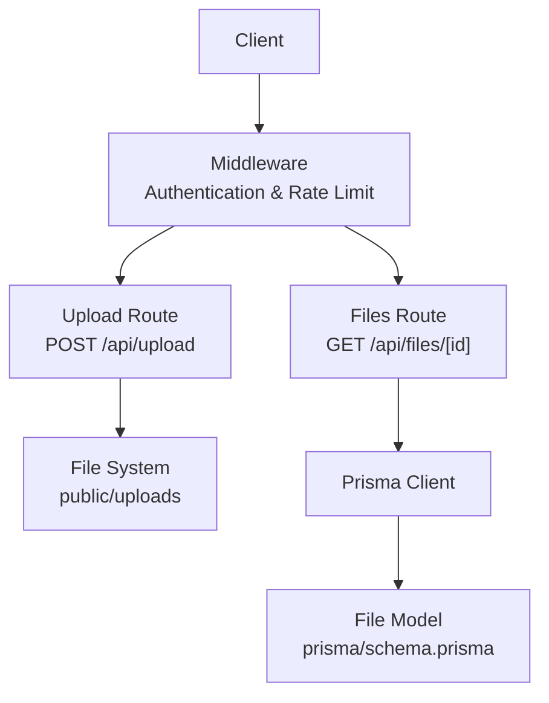
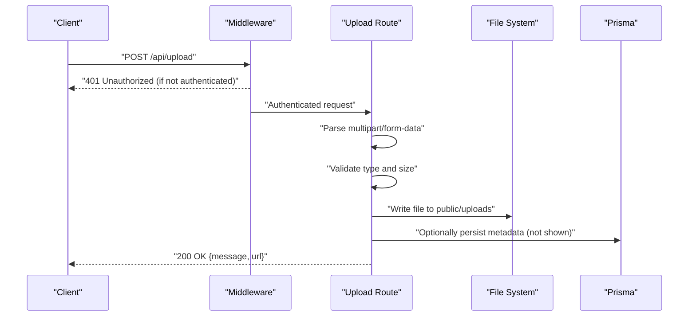
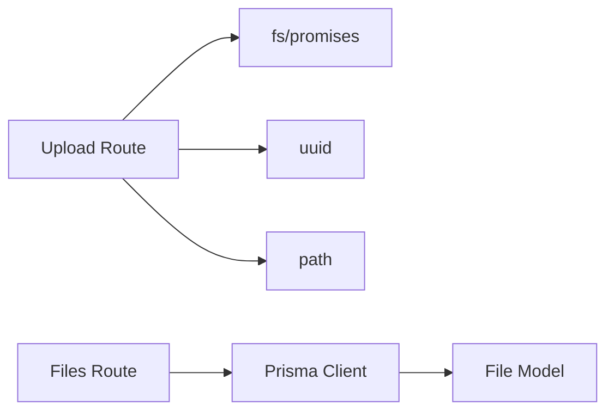

# File Management API

<cite>
**Referenced Files in This Document**
- [upload/route.ts](file://src/app/api/upload/route.ts)
- [schema.prisma](file://prisma/schema.prisma)
- [middleware.ts](file://src/middleware.ts)
- [error-handler.ts](file://src/lib/error-handler.ts)
- [auth.ts](file://src/lib/auth.ts)
</cite>

## Table of Contents
1. [Introduction](#introduction)
2. [Project Structure](#project-structure)
3. [Core Components](#core-components)
4. [Architecture Overview](#architecture-overview)
5. [Detailed Component Analysis](#detailed-component-analysis)
6. [Dependency Analysis](#dependency-analysis)
7. [Performance Considerations](#performance-considerations)
8. [Troubleshooting Guide](#troubleshooting-guide)
9. [Conclusion](#conclusion)

## Introduction
This document describes the file management API endpoints for uploading and retrieving files. It covers:
- POST /api/upload for file uploads via multipart/form-data
- GET /api/files/[id] for file retrieval with authentication and access control
- Storage location, naming conventions, and cleanup procedures
- Metadata storage and retrieval
- Examples and error handling guidance

## Project Structure
The file management API is implemented as Next.js App Router API routes under src/app/api. Upload handling is implemented in a dedicated route, while file metadata is persisted in the database using Prisma models.

**Diagram sources**
- [upload/route.ts:1-65](file://src/app/api/upload/route.ts#L1-L65)
- [schema.prisma:388-407](file://prisma/schema.prisma#L388-L407)
- [middleware.ts:31-94](file://src/middleware.ts#L31-L94)

**Section sources**
- [upload/route.ts:1-65](file://src/app/api/upload/route.ts#L1-L65)
- [schema.prisma:388-407](file://prisma/schema.prisma#L388-L407)
- [middleware.ts:31-94](file://src/middleware.ts#L31-L94)

## Core Components
- Upload endpoint: Handles multipart/form-data, validates file type and size, writes to public/uploads, and returns a public URL.
- File metadata persistence: The File model stores file metadata and relationships to related entities.
- Authentication and access control: Middleware enforces authentication via cookies and role-based access for protected routes.

**Section sources**
- [upload/route.ts:6-65](file://src/app/api/upload/route.ts#L6-L65)
- [schema.prisma:388-407](file://prisma/schema.prisma#L388-L407)
- [middleware.ts:31-94](file://src/middleware.ts#L31-L94)

## Architecture Overview
The upload flow writes files to the filesystem and returns a public URL. Retrieval uses the File model to fetch metadata and enforce access control.

**Diagram sources**
- [upload/route.ts:6-65](file://src/app/api/upload/route.ts#L6-L65)
- [middleware.ts:31-94](file://src/middleware.ts#L31-L94)

## Detailed Component Analysis

### Upload Endpoint: POST /api/upload
Purpose:
- Accepts a single file via multipart/form-data field named logo
- Validates MIME type and size
- Writes the file to public/uploads with a unique name
- Returns a JSON response containing a success message and the public URL

Behavior:
- Request method: POST
- Content-Type: multipart/form-data
- Required field: logo (File)
- Validation:
  - Allowed types: image/jpeg, image/jpg, image/png, image/gif
  - Max size: 5 MB
- Storage:
  - Directory: public/uploads
  - Naming: UUID.randomUUID() + original extension
- Response:
  - 200 OK with { message, url }
  - 400 Bad Request on missing file, invalid type, or size exceeded
  - 500 Internal Server Error on unexpected errors

Example request:
- curl -X POST -F "logo=@/path/to/image.png" http://localhost:3000/api/upload

Example response:
- {
    "message": "success message",
    "url": "/uploads/123e4567-e89b-12d3-a456-426614174000.png"
  }

Error scenarios:
- Missing file field: 400 Bad Request
- Unsupported MIME type: 400 Bad Request
- Size exceeds 5 MB: 400 Bad Request
- Unexpected server error: 500 Internal Server Error

Cleanup:
- No automatic cleanup is implemented in the upload route. Files remain in public/uploads until manually removed.

**Section sources**
- [upload/route.ts:6-65](file://src/app/api/upload/route.ts#L6-L65)

### Download Endpoint: GET /api/files/[id]
Purpose:
- Retrieve file metadata associated with a given ID
- Enforce authentication and role-based access control

Current implementation notes:
- The route file for GET /api/files/[id] is not present in the repository snapshot. The File model exists in the schema and supports relationships to other entities, but the specific route handler is not included here.
- Authentication and access control are enforced by middleware for API routes.

Recommended implementation outline:
- Validate the ID parameter
- Fetch file metadata from the database using Prisma
- Enforce access control based on the authenticated user's role and any ownership checks
- Return file metadata (URL, name, type, size) or serve the file directly if appropriate

Access control:
- Authentication: Requires a valid auth-token cookie
- Roles: Admin/SUPPORT can access admin-protected routes; middleware redirects unauthorized users

**Section sources**
- [schema.prisma:388-407](file://prisma/schema.prisma#L388-L407)
- [middleware.ts:31-94](file://src/middleware.ts#L31-L94)

### File Metadata Model
The File model stores file metadata and relationships to related entities.

Fields:
- id: Unique identifier
- url: Public URL of the file
- name: Original file name
- type: MIME type (optional)
- size: File size in bytes (optional)
- customer: Relationship to Customer (optional)
- subscription: Relationship to Subscription (optional)
- domain: Relationship to Domain (optional)
- hosting: Relationship to Hosting (optional)
- task: Relationship to Task (optional)
- createdAt: Timestamp

Relationships:
- Optional foreign keys to Customer, Subscription, Domain, Hosting, Task
- Optional fields for customer, subscription, domain, hosting, task identifiers

Storage:
- File content is stored on the filesystem in public/uploads
- Metadata is stored in the database

**Section sources**
- [schema.prisma:388-407](file://prisma/schema.prisma#L388-L407)

### Authentication and Access Control
Authentication:
- Middleware reads auth-token and role cookies
- Unauthenticated users are redirected away from protected routes
- Role-based access control applies for admin and portal routes

Access control for file operations:
- The upload endpoint does not require authentication in the provided route
- The download endpoint relies on middleware for authentication enforcement
- For production, consider adding explicit authentication checks to the upload route and implementing ownership checks for downloads

**Section sources**
- [middleware.ts:31-94](file://src/middleware.ts#L31-L94)
- [auth.ts:1-35](file://src/lib/auth.ts#L1-L35)

## Dependency Analysis
The upload route depends on:
- Next.js runtime for request/response handling
- Node fs/promises for writing files
- uuid for generating unique filenames
- Path resolution for constructing file paths

The File model depends on Prisma for database operations and relationships to other entities.

**Diagram sources**
- [upload/route.ts:1-65](file://src/app/api/upload/route.ts#L1-L65)
- [schema.prisma:388-407](file://prisma/schema.prisma#L388-L407)

**Section sources**
- [upload/route.ts:1-65](file://src/app/api/upload/route.ts#L1-L65)
- [schema.prisma:388-407](file://prisma/schema.prisma#L388-L407)

## Performance Considerations
- File size limit: 5 MB prevents excessive resource consumption
- Single-file upload: The route accepts one file per request
- File system writes: Writing to public/uploads is synchronous; consider asynchronous writes for higher throughput
- Rate limiting: Middleware enforces rate limiting for API routes

## Troubleshooting Guide
Common issues and resolutions:
- 400 Bad Request on upload:
  - Missing logo field: Ensure multipart/form-data includes the logo field
  - Unsupported MIME type: Use JPG, JPEG, PNG, or GIF
  - File larger than 5 MB: Compress or resize the image
- 500 Internal Server Error:
  - Unexpected server error during write: Check disk permissions and available space in public/uploads
- Authentication failures:
  - Missing or invalid auth-token cookie: Ensure the user is logged in and the cookie is present
- Download access denied:
  - Missing or insufficient role: Ensure the user has the required role for accessing the endpoint

Validation utilities:
- Input sanitization and ID validation helpers are available for consistent error handling

**Section sources**
- [upload/route.ts:11-34](file://src/app/api/upload/route.ts#L11-L34)
- [error-handler.ts:27-33](file://src/lib/error-handler.ts#L27-L33)
- [middleware.ts:31-94](file://src/middleware.ts#L31-L94)

## Conclusion
The file management API provides a straightforward upload mechanism with basic validation and filesystem storage. For production, consider adding:
- Authentication to the upload endpoint
- Ownership and permission checks for downloads
- Automated cleanup of orphaned files
- Optional metadata persistence for uploaded files
- Improved error messages and logging