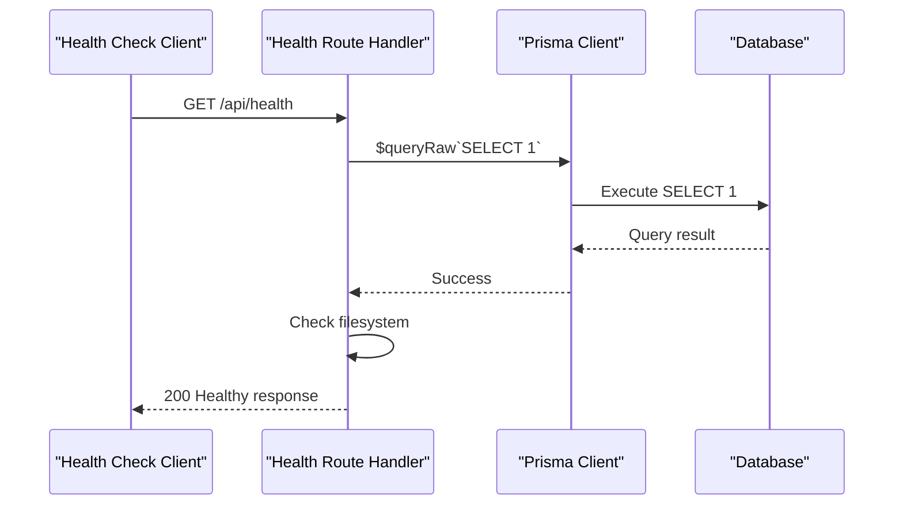
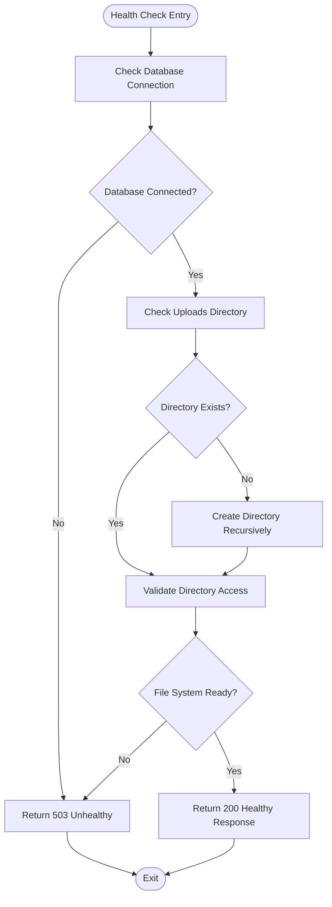
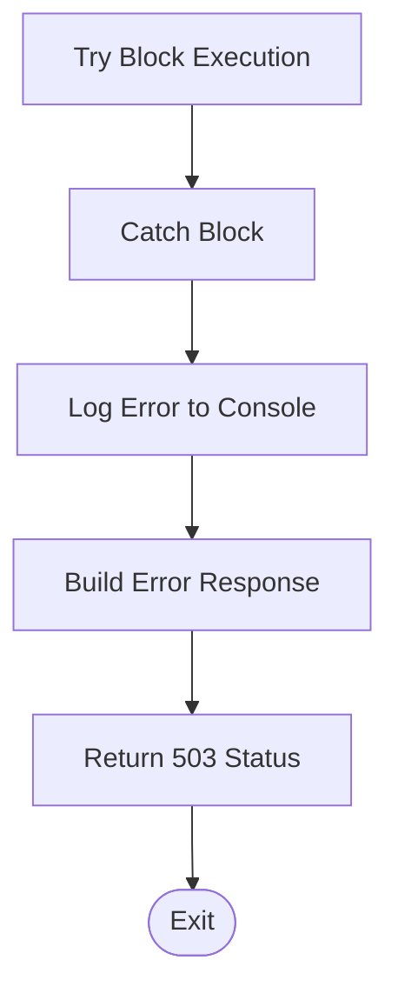

# Health Monitoring API

<cite>
**Referenced Files in This Document**
- [route.ts](file://src/app/api/health/route.ts)
- [prisma.ts](file://src/lib/prisma.ts)
- [error-handler.ts](file://src/lib/error-handler.ts)
- [docker-healthcheck.js](file://docker-healthcheck.js)
- [package.json](file://package.json)
</cite>

## Table of Contents
1. [Introduction](#introduction)
2. [Endpoint Specification](#endpoint-specification)
3. [Response Formats](#response-formats)
4. [Health Check Implementation](#health-check-implementation)
5. [Error Handling](#error-handling)
6. [Automatic Directory Creation](#automatic-directory-creation)
7. [Integration Examples](#integration-examples)
8. [Monitoring Best Practices](#monitoring-best-practices)
9. [Troubleshooting Guide](#troubleshooting-guide)
10. [Conclusion](#conclusion)

## Introduction

The Health Monitoring API provides a comprehensive system health check endpoint that validates critical application components. This endpoint serves as a crucial monitoring tool for container orchestration platforms, load balancers, and automated health checking systems. The `/api/health` endpoint performs essential system validation including database connectivity verification and file system accessibility checks.

The health check endpoint is designed to be lightweight, fast, and reliable, returning immediate feedback about the application's operational status. It's particularly important for containerized deployments where automatic restart policies and service discovery depend on accurate health status reporting.

## Endpoint Specification

### HTTP Method and Path
- **Method**: GET
- **Path**: `/api/health`
- **Authentication**: No authentication required
- **Rate Limiting**: Subject to global rate limiting middleware

### Request Headers
- No special headers required
- Standard Next.js request headers apply

### Response Status Codes
- **200 OK**: Application is healthy and all checks passed
- **503 Service Unavailable**: Application is unhealthy or maintenance mode
- **429 Too Many Requests**: Rate limit exceeded for API endpoints

## Response Formats

### Successful Health Response (200 OK)

When all system checks pass, the endpoint returns a JSON object with the following structure:

```json
{
  "status": "healthy",
  "timestamp": "2024-01-15T10:30:45.123Z",
  "database": "connected",
  "uploads": "accessible",
  "version": "0.1.0"
}
```

**Response Fields:**
- `status`: String indicating overall system health ("healthy")
- `timestamp`: ISO 8601 formatted datetime string
- `database`: String indicating database connection status ("connected")
- `uploads`: String indicating uploads directory accessibility ("accessible")
- `version`: String containing application version from package.json

### Unhealthy Response (503 Service Unavailable)

When system checks fail, the endpoint returns a JSON object with error details:

```json
{
  "status": "unhealthy",
  "timestamp": "2024-01-15T10:30:45.123Z",
  "error": "Database connection failed: Connection refused"
}
```

**Response Fields:**
- `status`: String indicating system health ("unhealthy")
- `timestamp`: ISO 8601 formatted datetime string
- `error`: String containing error message describing the failure

## Health Check Implementation

### Database Connectivity Verification

The health check performs a simple database connectivity test using Prisma's raw query interface:



**Diagram sources**
- [route.ts:4-7](file://src/app/api/health/route.ts#L4-L7)
- [prisma.ts:1-9](file://src/lib/prisma.ts#L1-L9)

### File System Accessibility Validation

The health check verifies uploads directory accessibility and creates it if necessary:



**Diagram sources**
- [route.ts:9-16](file://src/app/api/health/route.ts#L9-L16)

**Section sources**
- [route.ts:4-37](file://src/app/api/health/route.ts#L4-L37)

## Error Handling

### Database Connection Failures

The health check handles various database connection scenarios:

- **Connection Refused**: Network connectivity issues or database downtime
- **Authentication Failed**: Incorrect database credentials
- **Timeout Errors**: Database unresponsive or overloaded
- **Schema Mismatch**: Migration issues or database corruption

### File System Issues

The health check manages several file system scenarios:

- **Permission Denied**: Insufficient permissions for uploads directory
- **Disk Space Full**: No available disk space for directory creation
- **Path Resolution**: Invalid or inaccessible base paths
- **Network Storage Issues**: Remote storage connectivity problems

### Error Response Structure

All errors are handled consistently with standardized error responses:



**Diagram sources**
- [route.ts:25-36](file://src/app/api/health/route.ts#L25-L36)

**Section sources**
- [route.ts:25-36](file://src/app/api/health/route.ts#L25-L36)

## Automatic Directory Creation

The health check implements intelligent directory management:

### Directory Location
The uploads directory is located at: `{process.cwd()}/public/uploads`

### Creation Process
1. **Existence Check**: Verify if directory exists
2. **Recursive Creation**: Create directory tree if missing
3. **Permission Validation**: Ensure write permissions
4. **Accessibility Verification**: Confirm directory is accessible

### Security Considerations
- Directory is created with appropriate permissions
- Only necessary directories are created automatically
- No sensitive files are written during health check
- Path resolution prevents directory traversal attacks

**Section sources**
- [route.ts:14-16](file://src/app/api/health/route.ts#L14-L16)

## Integration Examples

### Docker Container Health Checks

The health endpoint integrates seamlessly with Docker's health check mechanism:

```javascript
// docker-healthcheck.js
const options = {
  hostname: 'localhost',
  port: process.env.PORT || 3000,
  path: '/api/health',
  method: 'GET',
  timeout: 5000
};
```

### Kubernetes Liveness Probes

```yaml
livenessProbe:
  httpGet:
    path: /api/health
    port: 3000
  initialDelaySeconds: 30
  periodSeconds: 10
  timeoutSeconds: 5
  failureThreshold: 3
```

### Load Balancer Health Checks

```javascript
// Example client implementation
fetch('http://localhost:3000/api/health')
  .then(response => response.json())
  .then(data => {
    if (data.status === 'healthy') {
      // Mark as healthy in load balancer
    }
  });
```

**Section sources**
- [docker-healthcheck.js:10-16](file://docker-healthcheck.js#L10-L16)

## Monitoring Best Practices

### Health Check Frequency
- **Production**: Every 30-60 seconds
- **Development**: Every 10-15 seconds
- **Staging**: Every 15-30 seconds

### Alert Thresholds
- **Immediate Action**: Continuous 503 responses for 2 minutes
- **Warning**: 3 consecutive failures within 5 minutes
- **Investigation**: Single failure with error details

### Metrics Collection
- Response time measurements
- Success/failure ratios
- Error type distributions
- Database connection metrics

### Performance Considerations
- Keep health checks lightweight
- Avoid heavy database queries
- Minimize file system operations
- Cache results for short intervals

## Troubleshooting Guide

### Common Issues and Solutions

#### Database Connection Problems
**Symptoms**: Consistent 503 responses with database error messages
**Solutions**:
- Verify database server is running
- Check network connectivity between application and database
- Validate database credentials and connection strings
- Review database logs for connection attempts

#### File System Permissions
**Symptoms**: Directory creation failures or permission denied errors
**Solutions**:
- Verify application has write permissions to deployment directory
- Check disk space availability
- Validate file system mount points
- Review container user permissions

#### Timeout Issues
**Symptoms**: Health check timeouts or slow responses
**Solutions**:
- Increase health check timeout values
- Optimize database connection pooling
- Review application startup time
- Check for resource constraints

### Debugging Steps
1. **Direct Access**: Test endpoint directly using curl or browser
2. **Log Analysis**: Check application logs for error messages
3. **Network Diagnostics**: Verify network connectivity to database
4. **Resource Monitoring**: Check CPU, memory, and disk usage
5. **Database Health**: Verify database server status and performance

### Monitoring Setup
- **Application Logs**: Enable detailed logging for health check failures
- **Metrics Collection**: Track response times and success rates
- **Alert Configuration**: Set up alerts for unhealthy states
- **Dashboard Creation**: Visualize health check results over time

**Section sources**
- [error-handler.ts:4-25](file://src/lib/error-handler.ts#L4-L25)

## Conclusion

The Health Monitoring API provides a robust and reliable mechanism for system health validation. Its comprehensive approach to checking database connectivity and file system accessibility makes it suitable for production environments requiring continuous monitoring and automated failover capabilities.

The endpoint's design emphasizes simplicity, reliability, and minimal resource consumption while providing comprehensive error reporting for troubleshooting. The automatic directory creation feature ensures that applications can recover from common deployment issues without manual intervention.

For optimal monitoring, combine the health endpoint with appropriate alerting, logging, and metrics collection strategies. Regular review of health check patterns and thresholds will help maintain system reliability and prevent false positives or negatives in automated monitoring systems.