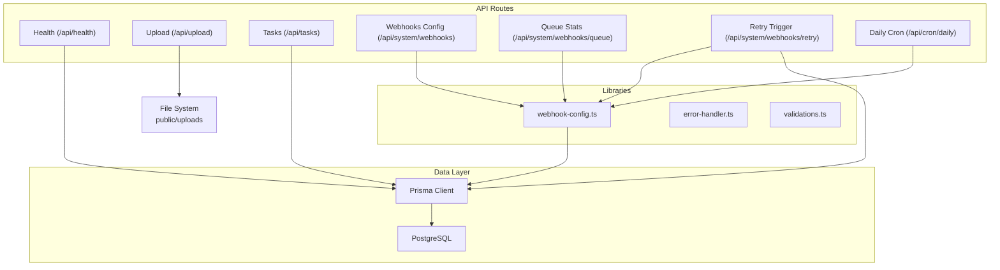
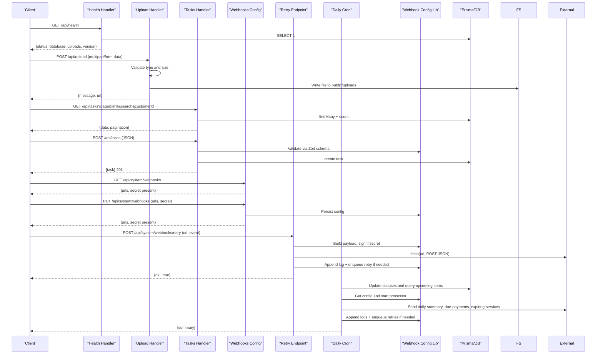
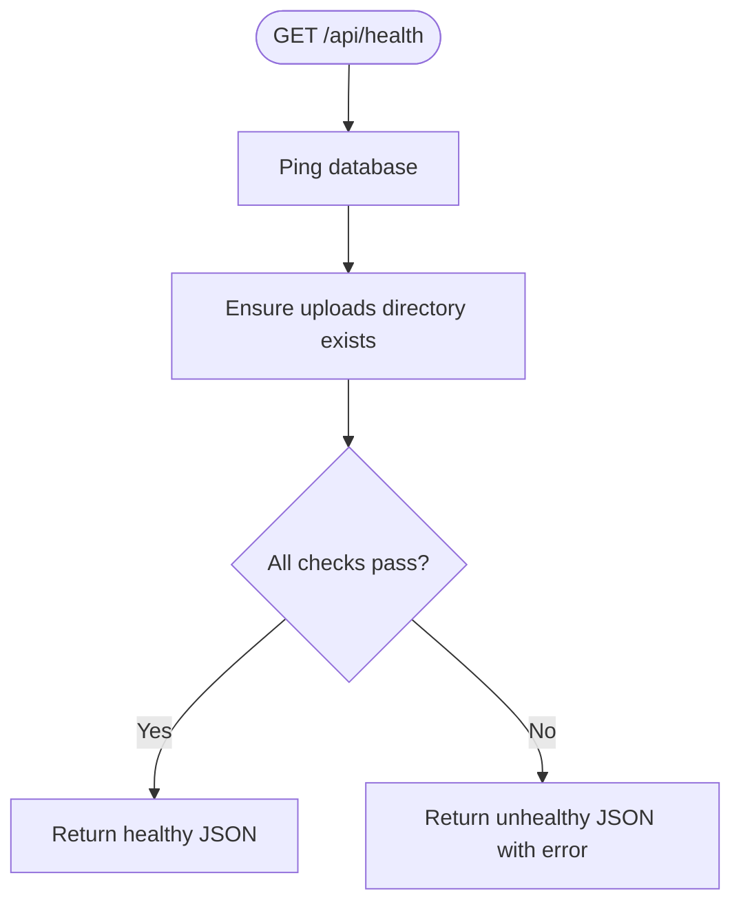
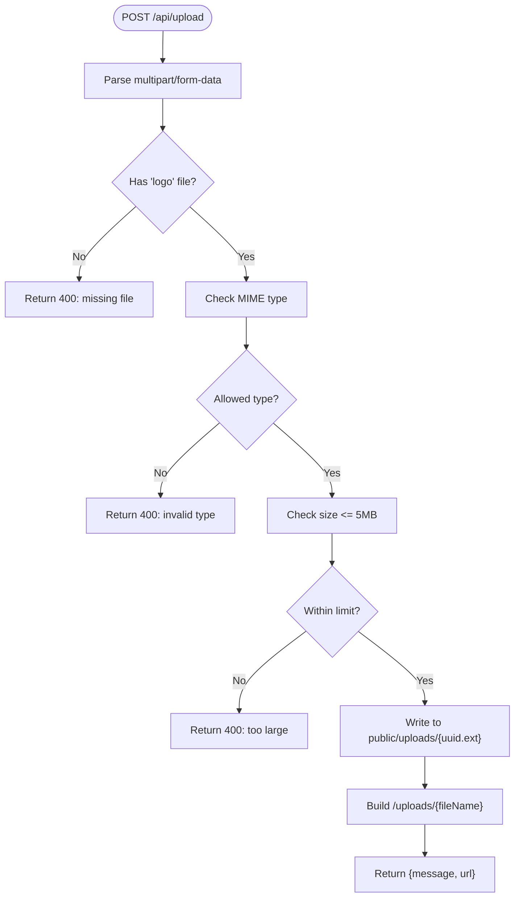
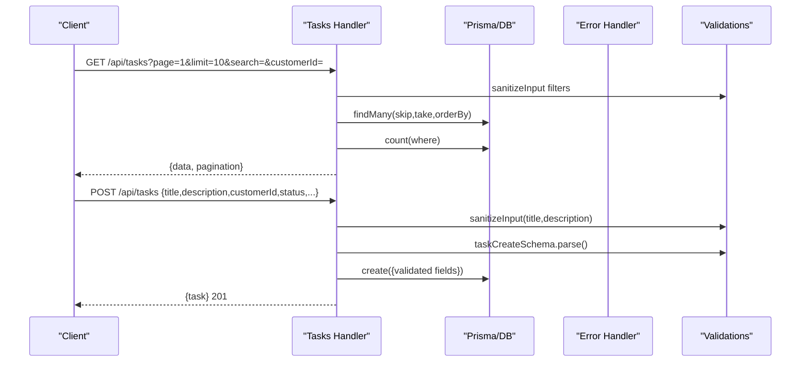
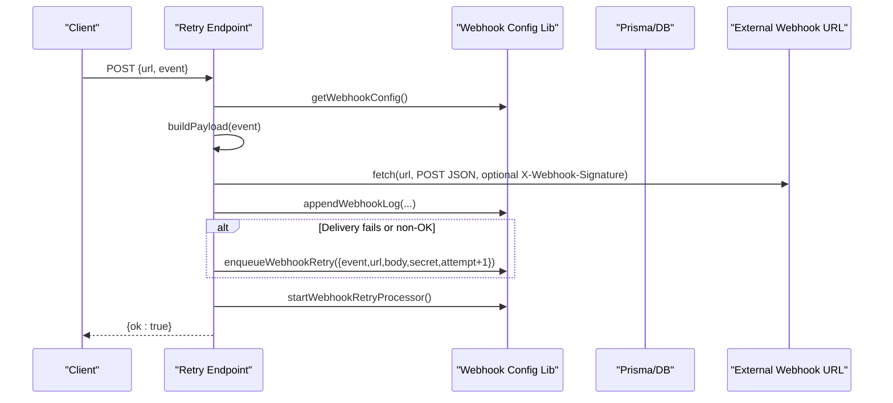
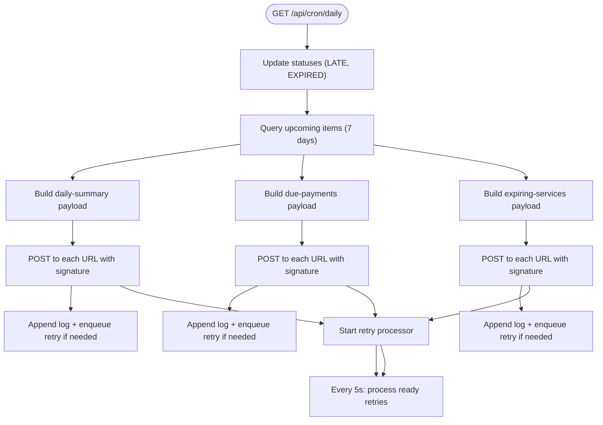
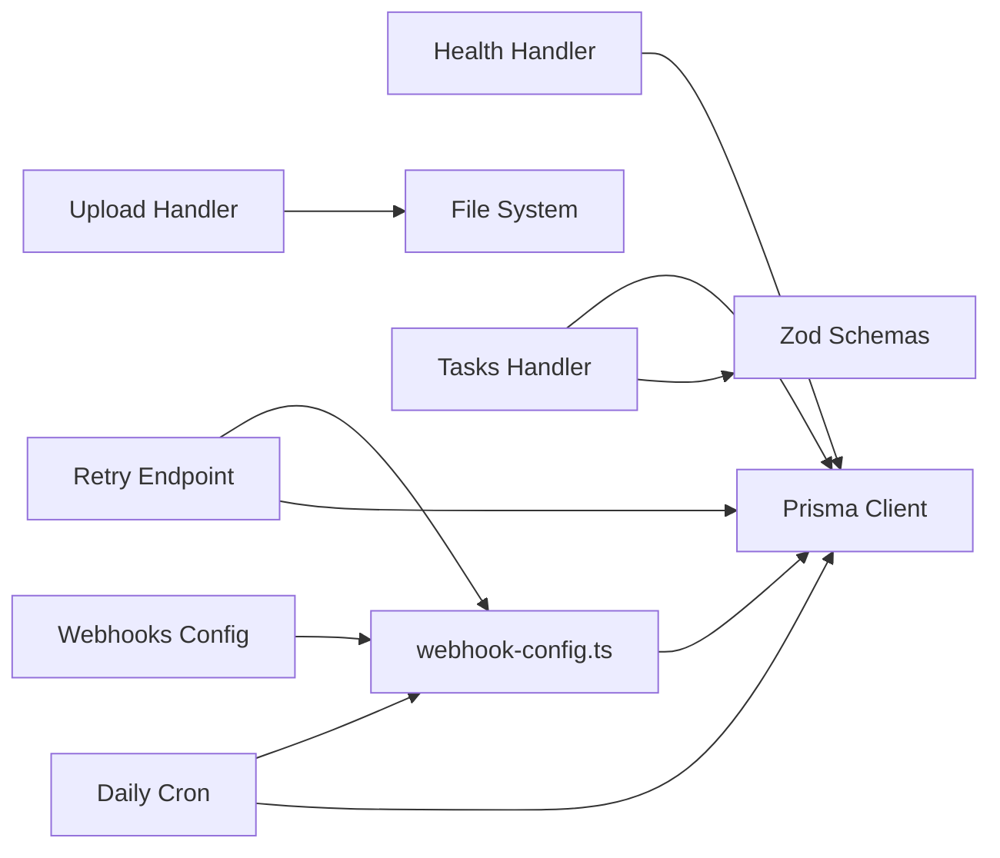

# System Utilities API

<cite>
**Referenced Files in This Document**
- [health/route.ts](file://src/app/api/health/route.ts)
- [upload/route.ts](file://src/app/api/upload/route.ts)
- [tasks/route.ts](file://src/app/api/tasks/route.ts)
- [system/webhooks/route.ts](file://src/app/api/system/webhooks/route.ts)
- [system/webhooks/queue/route.ts](file://src/app/api/system/webhooks/queue/route.ts)
- [system/webhooks/retry/route.ts](file://src/app/api/system/webhooks/retry/route.ts)
- [cron/daily/route.ts](file://src/app/api/cron/daily/route.ts)
- [webhook-config.ts](file://src/lib/webhook-config.ts)
- [error-handler.ts](file://src/lib/error-handler.ts)
- [validations.ts](file://src/lib/validations.ts)
- [schema.prisma](file://prisma/schema.prisma)
</cite>

## Table of Contents
1. [Introduction](#introduction)
2. [Project Structure](#project-structure)
3. [Core Components](#core-components)
4. [Architecture Overview](#architecture-overview)
5. [Detailed Component Analysis](#detailed-component-analysis)
6. [Dependency Analysis](#dependency-analysis)
7. [Performance Considerations](#performance-considerations)
8. [Troubleshooting Guide](#troubleshooting-guide)
9. [Conclusion](#conclusion)
10. [Appendices](#appendices)

## Introduction
This document describes the System Utilities API, covering health checks, file upload/download operations, task CRUD endpoints, webhook configuration and queue management, and cron-based system maintenance. It specifies file upload limits and supported formats, storage handling, webhook retry mechanisms, and queue processing behavior. It also documents the daily cron job that performs system maintenance and dispatches webhook notifications.

## Project Structure
The System Utilities API is organized under Next.js App Router API routes with modular handlers grouped by functional area:
- Health monitoring: src/app/api/health/route.ts
- File operations: src/app/api/upload/route.ts
- Task management: src/app/api/tasks/route.ts
- Webhook system: src/app/api/system/webhooks/* and src/lib/webhook-config.ts
- Cron maintenance: src/app/api/cron/daily/route.ts
- Shared utilities: src/lib/error-handler.ts, src/lib/validations.ts
- Data model: prisma/schema.prisma

**Diagram sources**
- [health/route.ts:1-37](file://src/app/api/health/route.ts#L1-L37)
- [upload/route.ts:1-65](file://src/app/api/upload/route.ts#L1-L65)
- [tasks/route.ts:1-64](file://src/app/api/tasks/route.ts#L1-L64)
- [system/webhooks/route.ts:1-26](file://src/app/api/system/webhooks/route.ts#L1-L26)
- [system/webhooks/queue/route.ts:1-7](file://src/app/api/system/webhooks/queue/route.ts#L1-L7)
- [system/webhooks/retry/route.ts:1-88](file://src/app/api/system/webhooks/retry/route.ts#L1-L88)
- [cron/daily/route.ts:1-135](file://src/app/api/cron/daily/route.ts#L1-L135)
- [webhook-config.ts:1-107](file://src/lib/webhook-config.ts#L1-L107)
- [error-handler.ts:1-34](file://src/lib/error-handler.ts#L1-L34)
- [validations.ts:158-166](file://src/lib/validations.ts#L158-L166)
- [schema.prisma:264-279](file://prisma/schema.prisma#L264-L279)

**Section sources**
- [health/route.ts:1-37](file://src/app/api/health/route.ts#L1-L37)
- [upload/route.ts:1-65](file://src/app/api/upload/route.ts#L1-L65)
- [tasks/route.ts:1-64](file://src/app/api/tasks/route.ts#L1-L64)
- [system/webhooks/route.ts:1-26](file://src/app/api/system/webhooks/route.ts#L1-L26)
- [system/webhooks/queue/route.ts:1-7](file://src/app/api/system/webhooks/queue/route.ts#L1-L7)
- [system/webhooks/retry/route.ts:1-88](file://src/app/api/system/webhooks/retry/route.ts#L1-L88)
- [cron/daily/route.ts:1-135](file://src/app/api/cron/daily/route.ts#L1-L135)
- [webhook-config.ts:1-107](file://src/lib/webhook-config.ts#L1-L107)
- [error-handler.ts:1-34](file://src/lib/error-handler.ts#L1-L34)
- [validations.ts:158-166](file://src/lib/validations.ts#L158-L166)
- [schema.prisma:264-279](file://prisma/schema.prisma#L264-L279)

## Core Components
- Health endpoint: Returns system status, database connectivity, and uploads directory accessibility.
- File upload: Validates type and size, stores in public/uploads with unique filenames, and returns a public URL.
- Task CRUD: Lists tasks with pagination and filtering, creates tasks with validation.
- Webhook system: Manages webhook URLs and secret, exposes queue statistics, triggers retries, and runs a retry processor.
- Daily cron: Performs maintenance updates and sends multiple webhook events to configured endpoints.
- Shared utilities: Centralized error handling and input sanitization; validation schemas for tasks.

**Section sources**
- [health/route.ts:4-36](file://src/app/api/health/route.ts#L4-L36)
- [upload/route.ts:6-64](file://src/app/api/upload/route.ts#L6-L64)
- [tasks/route.ts:7-63](file://src/app/api/tasks/route.ts#L7-L63)
- [system/webhooks/route.ts:5-25](file://src/app/api/system/webhooks/route.ts#L5-L25)
- [system/webhooks/queue/route.ts:4-6](file://src/app/api/system/webhooks/queue/route.ts#L4-L6)
- [system/webhooks/retry/route.ts:55-87](file://src/app/api/system/webhooks/retry/route.ts#L55-L87)
- [cron/daily/route.ts:7-134](file://src/app/api/cron/daily/route.ts#L7-L134)
- [error-handler.ts:4-33](file://src/lib/error-handler.ts#L4-L33)
- [validations.ts:158-166](file://src/lib/validations.ts#L158-L166)

## Architecture Overview
The System Utilities API integrates with Prisma for persistence and Node.js native modules for file operations. Webhook delivery is asynchronous with retry scheduling and periodic processing.

**Diagram sources**
- [health/route.ts:4-36](file://src/app/api/health/route.ts#L4-L36)
- [upload/route.ts:6-64](file://src/app/api/upload/route.ts#L6-L64)
- [tasks/route.ts:7-63](file://src/app/api/tasks/route.ts#L7-L63)
- [system/webhooks/route.ts:5-25](file://src/app/api/system/webhooks/route.ts#L5-L25)
- [system/webhooks/retry/route.ts:55-87](file://src/app/api/system/webhooks/retry/route.ts#L55-L87)
- [cron/daily/route.ts:7-134](file://src/app/api/cron/daily/route.ts#L7-L134)
- [webhook-config.ts:8-107](file://src/lib/webhook-config.ts#L8-L107)

## Detailed Component Analysis

### Health Endpoint
- Purpose: System monitoring and readiness probe.
- Behavior:
  - Verifies database connectivity using a raw query.
  - Ensures the uploads directory exists and is accessible.
  - Returns health status, timestamp, database state, uploads state, and version.
- Response:
  - Success: 200 OK with status, timestamp, database, uploads, and version.
  - Failure: 503 Service Unavailable with status and error details.

**Diagram sources**
- [health/route.ts:4-36](file://src/app/api/health/route.ts#L4-L36)

**Section sources**
- [health/route.ts:4-36](file://src/app/api/health/route.ts#L4-L36)

### File Upload Operations
- Endpoint: POST /api/upload
- Supported formats: image/jpeg, image/jpg, image/png, image/gif.
- Size limit: 5 MB.
- Storage: Writes to public/uploads with a unique filename derived from UUID and original extension.
- Response: Returns a public URL path for the uploaded file.
- Notes: Uses Node.js fs/promises and path modules; writes directly to filesystem.

**Diagram sources**
- [upload/route.ts:6-64](file://src/app/api/upload/route.ts#L6-L64)

**Section sources**
- [upload/route.ts:6-64](file://src/app/api/upload/route.ts#L6-L64)

### Task CRUD Endpoints
- List tasks: GET /api/tasks with query params page, limit, search, customerId.
  - Pagination enforced with a maximum limit of 100 per page.
  - Filters applied case-insensitively on title and customerId.
- Create task: POST /api/tasks with JSON body validated against taskCreateSchema.
  - Sanitizes title and description before validation.
  - Creates task with default status OPEN if not provided.

**Diagram sources**
- [tasks/route.ts:7-63](file://src/app/api/tasks/route.ts#L7-L63)
- [error-handler.ts:4-25](file://src/lib/error-handler.ts#L4-L25)
- [validations.ts:158-166](file://src/lib/validations.ts#L158-L166)

**Section sources**
- [tasks/route.ts:7-63](file://src/app/api/tasks/route.ts#L7-L63)
- [error-handler.ts:4-25](file://src/lib/error-handler.ts#L4-L25)
- [validations.ts:158-166](file://src/lib/validations.ts#L158-L166)

### Webhook System
- Configuration
  - GET /api/system/webhooks returns configured URLs and whether a secret is set.
  - PUT /api/system/webhooks updates URLs (comma-separated or array) and secret.
- Queue Management
  - GET /api/system/webhooks/queue returns queue statistics: pending count and next scheduled in milliseconds.
- Retry Mechanism
  - POST /api/system/webhooks/retry triggers immediate delivery to a single URL with a specified event.
  - Builds payload dynamically based on event type.
  - Adds HMAC signature header if secret is configured.
  - Logs outcomes and enqueues retries with exponential delays.
  - Starts the retry processor if not already started.
- Retry Processor
  - Periodic background job (every 5 seconds) processes queued retries.
  - Applies incremental delays per attempt and removes completed or exhausted jobs.
  - Maintains in-memory config cache and a flag to prevent duplicate processors.

**Diagram sources**
- [system/webhooks/retry/route.ts:55-87](file://src/app/api/system/webhooks/retry/route.ts#L55-L87)
- [webhook-config.ts:8-107](file://src/lib/webhook-config.ts#L8-L107)

**Section sources**
- [system/webhooks/route.ts:5-25](file://src/app/api/system/webhooks/route.ts#L5-L25)
- [system/webhooks/queue/route.ts:4-6](file://src/app/api/system/webhooks/queue/route.ts#L4-L6)
- [system/webhooks/retry/route.ts:55-87](file://src/app/api/system/webhooks/retry/route.ts#L55-L87)
- [webhook-config.ts:8-107](file://src/lib/webhook-config.ts#L8-L107)

### Cron Job Scheduling and System Maintenance
- Endpoint: GET /api/cron/daily
- Responsibilities:
  - Updates overdue payments to LATE and expired subscriptions to EXPIRED.
  - Identifies upcoming items within the next 7 days for payments, domains, subscriptions, and hosting.
  - Sends three webhook events: daily-summary, due-payments, and expiring-services.
  - Applies HMAC signatures if secret is configured.
  - Logs deliveries and enqueues retries on failures.
  - Starts the retry processor to handle scheduled retries.

**Diagram sources**
- [cron/daily/route.ts:7-134](file://src/app/api/cron/daily/route.ts#L7-L134)
- [webhook-config.ts:68-107](file://src/lib/webhook-config.ts#L68-L107)

**Section sources**
- [cron/daily/route.ts:7-134](file://src/app/api/cron/daily/route.ts#L7-L134)
- [webhook-config.ts:68-107](file://src/lib/webhook-config.ts#L68-L107)

## Dependency Analysis
- Health handler depends on Prisma for database connectivity checks and filesystem for uploads directory verification.
- Upload handler depends on Node fs/promises and path modules for file I/O.
- Tasks handler depends on Prisma for persistence and Zod schemas for validation.
- Webhook handlers depend on webhook-config library for configuration, signing, logging, and queue management.
- Cron handler orchestrates multiple Prisma operations and external webhook delivery.

**Diagram sources**
- [health/route.ts:1-37](file://src/app/api/health/route.ts#L1-L37)
- [upload/route.ts:1-65](file://src/app/api/upload/route.ts#L1-L65)
- [tasks/route.ts:1-64](file://src/app/api/tasks/route.ts#L1-L64)
- [system/webhooks/route.ts:1-26](file://src/app/api/system/webhooks/route.ts#L1-L26)
- [system/webhooks/retry/route.ts:1-88](file://src/app/api/system/webhooks/retry/route.ts#L1-L88)
- [cron/daily/route.ts:1-135](file://src/app/api/cron/daily/route.ts#L1-L135)
- [webhook-config.ts:1-107](file://src/lib/webhook-config.ts#L1-L107)

**Section sources**
- [health/route.ts:1-37](file://src/app/api/health/route.ts#L1-L37)
- [upload/route.ts:1-65](file://src/app/api/upload/route.ts#L1-L65)
- [tasks/route.ts:1-64](file://src/app/api/tasks/route.ts#L1-L64)
- [system/webhooks/route.ts:1-26](file://src/app/api/system/webhooks/route.ts#L1-L26)
- [system/webhooks/retry/route.ts:1-88](file://src/app/api/system/webhooks/retry/route.ts#L1-L88)
- [cron/daily/route.ts:1-135](file://src/app/api/cron/daily/route.ts#L1-L135)
- [webhook-config.ts:1-107](file://src/lib/webhook-config.ts#L1-L107)

## Performance Considerations
- Health endpoint: Minimal overhead; database ping and filesystem checks are lightweight.
- Upload endpoint: Single-file write; consider streaming large files if needed; ensure filesystem permissions are optimal.
- Tasks endpoint: Pagination caps improve response times; ensure appropriate indexes on filtered fields.
- Webhook retry processor: Runs every 5 seconds; batch processing is handled by taking a fixed number of ready items per cycle.
- Cron endpoint: Uses concurrent queries and parallel external deliveries; ensure webhook endpoints can handle bursts.

## Troubleshooting Guide
- Health endpoint returns unhealthy:
  - Verify database connectivity and Prisma configuration.
  - Confirm public/uploads directory exists and is writable.
- Upload returns validation errors:
  - Ensure file type is one of jpeg, jpg, png, gif.
  - Ensure file size is less than or equal to 5 MB.
- Tasks creation fails:
  - Validate input fields against taskCreateSchema.
  - Check sanitization of title and description.
- Webhook delivery failures:
  - Confirm WEBHOOK_URLS and WEBHOOK_SECRET environment variables.
  - Review webhook logs and queue statistics.
  - Inspect retry processor status and logs.

**Section sources**
- [health/route.ts:25-36](file://src/app/api/health/route.ts#L25-L36)
- [upload/route.ts:18-34](file://src/app/api/upload/route.ts#L18-L34)
- [error-handler.ts:4-25](file://src/lib/error-handler.ts#L4-L25)
- [webhook-config.ts:22-41](file://src/lib/webhook-config.ts#L22-L41)

## Conclusion
The System Utilities API provides robust endpoints for system health monitoring, secure file uploads, task lifecycle management, and a production-ready webhook system with retry and queue processing. The daily cron job automates maintenance and proactive notifications. Together, these components enable reliable system operation and integrations.

## Appendices

### API Definitions

- Health
  - Method: GET
  - Path: /api/health
  - Response: { status, timestamp, database, uploads, version }

- Upload
  - Method: POST
  - Path: /api/upload
  - Content-Type: multipart/form-data
  - Form Field: logo (File)
  - Constraints: Types [image/jpeg, image/jpg, image/png, image/gif], Max size 5 MB
  - Response: { message, url }

- Tasks
  - GET /api/tasks
    - Query Params: page (number, default 1), limit (number, max 100), search (string), customerId (string)
    - Response: { data: Task[], pagination: { page, limit, total, totalPages } }
  - POST /api/tasks
    - Body: TaskCreate fields validated by taskCreateSchema
    - Response: { Task } 201

- Webhooks
  - GET /api/system/webhooks
    - Response: { urls: string[], secret: boolean }
  - PUT /api/system/webhooks
    - Body: { urls: string[] | string, secret: string }
    - Response: { urls: string[], secret: boolean }
  - GET /api/system/webhooks/queue
    - Response: { pending: number, nextInMs: number }
  - POST /api/system/webhooks/retry
    - Body: { url: string, event: 'daily-summary' | 'due-payments' | 'expiring-services' }
    - Response: { ok: true }

- Cron
  - GET /api/cron/daily
    - Response: { updated: { paymentsLate: number, subscriptionsExpired: number }, upcoming7Days: { payments: number, domains: number, subscriptions: number, hosting: number } }

### Data Models Involved
- Task: includes id, customerId, title, description, status, assigneeId, timestamps.
- WebhookLog: includes id, event, url, ok, statusCode, error, attempt, timestamp.
- WebhookQueue: includes id, event, url, body, secret, attempt, nextAt, createdAt.

**Section sources**
- [schema.prisma:264-279](file://prisma/schema.prisma#L264-L279)
- [schema.prisma:409-433](file://prisma/schema.prisma#L409-L433)