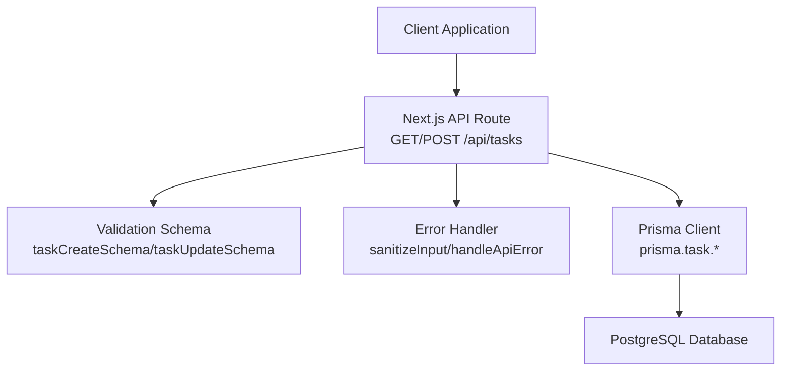
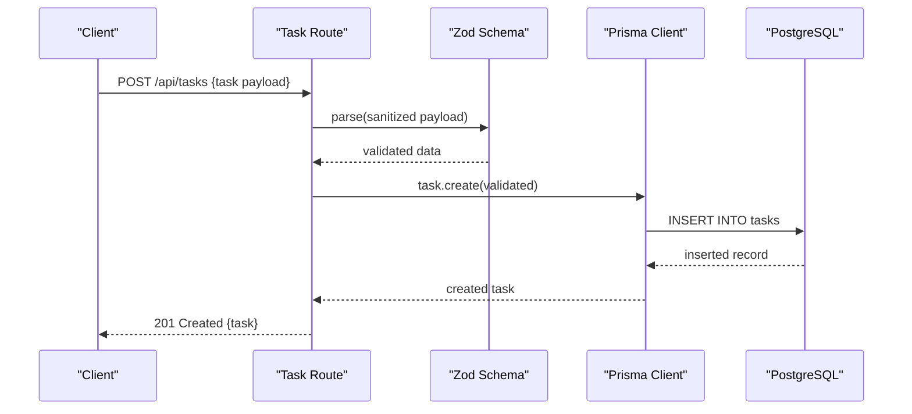
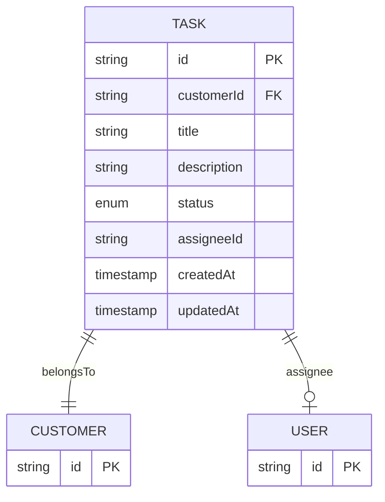
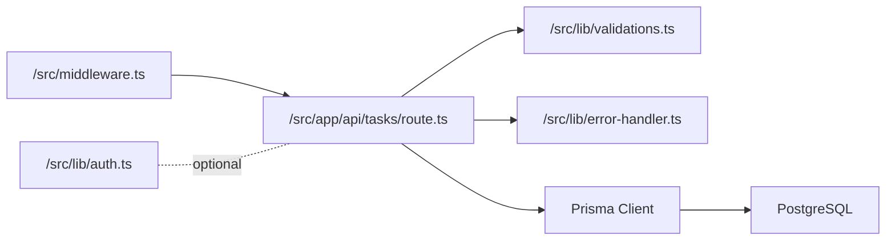

# Task Operations API

<cite>
**Referenced Files in This Document**
- [route.ts](file://src/app/api/tasks/route.ts)
- [validations.ts](file://src/lib/validations.ts)
- [schema.prisma](file://prisma/schema.prisma)
- [task-form.tsx](file://src/components/task-form.tsx)
- [task-list.tsx](file://src/components/task-list.tsx)
- [error-handler.ts](file://src/lib/error-handler.ts)
- [auth.ts](file://src/lib/auth.ts)
- [middleware.ts](file://src/middleware.ts)
</cite>

## Table of Contents
1. [Introduction](#introduction)
2. [Project Structure](#project-structure)
3. [Core Components](#core-components)
4. [Architecture Overview](#architecture-overview)
5. [Detailed Component Analysis](#detailed-component-analysis)
6. [Dependency Analysis](#dependency-analysis)
7. [Performance Considerations](#performance-considerations)
8. [Troubleshooting Guide](#troubleshooting-guide)
9. [Conclusion](#conclusion)

## Introduction
This document provides comprehensive API documentation for task management endpoints. It covers task CRUD operations (create, list, update, delete), request/response formats, authentication and authorization requirements, filtering and pagination options, and status transition behavior. The API is implemented as a Next.js App Router API route and integrates with Prisma ORM and Zod validation schemas.

## Project Structure
The task operations API is implemented under the Next.js App Router at `/src/app/api/tasks/route.ts`. Validation schemas reside in `/src/lib/validations.ts`, and the Prisma schema defines the Task model and related enums. Frontend components demonstrate usage patterns for task creation and listing.

**Diagram sources**
- [route.ts:1-64](file://src/app/api/tasks/route.ts#L1-L64)
- [validations.ts:158-165](file://src/lib/validations.ts#L158-L165)
- [error-handler.ts:27-34](file://src/lib/error-handler.ts#L27-L34)

**Section sources**
- [route.ts:1-64](file://src/app/api/tasks/route.ts#L1-L64)
- [validations.ts:158-165](file://src/lib/validations.ts#L158-L165)
- [schema.prisma:258-279](file://prisma/schema.prisma#L258-L279)

## Core Components
- Task API Route: Implements GET (list with pagination and filters) and POST (create) endpoints for tasks.
- Validation Schemas: Define allowed fields, types, defaults, and constraints for task creation and updates.
- Prisma Task Model: Defines the database schema, relations, and enum values for task status.
- Frontend Components: Demonstrate client-side usage for task creation and listing.

Key capabilities:
- Retrieve paginated task lists with optional search and customer filters.
- Create tasks with validation and sanitization.
- Enumerated status values: OPEN, PENDING, DONE.

**Section sources**
- [route.ts:7-43](file://src/app/api/tasks/route.ts#L7-L43)
- [validations.ts:158-165](file://src/lib/validations.ts#L158-L165)
- [schema.prisma:258-279](file://prisma/schema.prisma#L258-L279)

## Architecture Overview
The task API follows a layered architecture:
- HTTP Layer: Next.js route handlers receive requests and return JSON responses.
- Validation Layer: Zod schemas validate and normalize request bodies.
- Persistence Layer: Prisma ORM executes database queries.
- Error Handling: Centralized error handler manages validation and runtime errors.

**Diagram sources**
- [route.ts:45-64](file://src/app/api/tasks/route.ts#L45-L64)
- [validations.ts:158-165](file://src/lib/validations.ts#L158-L165)
- [schema.prisma:264-279](file://prisma/schema.prisma#L264-L279)

## Detailed Component Analysis

### Task API Endpoints

#### GET /api/tasks
Purpose: Retrieve paginated task list with optional filters.

Query Parameters:
- page: integer, default 1, minimum 1
- limit: integer, default 10, minimum 1, maximum 100
- search: string, partial match on title (case-insensitive)
- customerId: string, filter by customer ID

Response Format:
- data: array of task objects
- pagination: { page, limit, total, totalPages }

Task Object Fields:
- id: string
- customerId: string
- title: string
- description: string
- status: "OPEN" | "PENDING" | "DONE"
- assigneeId: string | null
- createdAt: datetime (ISO string)
- updatedAt: datetime (ISO string)

Notes:
- Pagination uses skip/take semantics.
- Filtering applies AND conditions for search and customerId.

Example Request:
- GET /api/tasks?page=1&limit=10&search=website&customerId=abc-123

Example Response:
- 200 OK with data array and pagination metadata

**Section sources**
- [route.ts:7-43](file://src/app/api/tasks/route.ts#L7-L43)
- [schema.prisma:264-279](file://prisma/schema.prisma#L264-L279)

#### POST /api/tasks
Purpose: Create a new task.

Request Body (validation rules):
- customerId: required, string (min length 1)
- title: required, string (min 2, max 200)
- description: required, string (min 1, max 4000)
- status: optional, enum ["OPEN","PENDING","DONE"], default "OPEN"
- assigneeId: optional, string

Response:
- 201 Created with the created task object
- 400 Bad Request on validation errors
- 500 Internal Server Error on other failures

Sanitization:
- Input trimming and HTML tag removal for title and description.

Example Request Body:
{
  "customerId": "customer-id-123",
  "title": "Implement authentication",
  "description": "Add login and logout functionality",
  "status": "OPEN",
  "assigneeId": "user-id-456"
}

**Section sources**
- [route.ts:45-64](file://src/app/api/tasks/route.ts#L45-L64)
- [validations.ts:158-165](file://src/lib/validations.ts#L158-L165)
- [error-handler.ts:27-34](file://src/lib/error-handler.ts#L27-L34)

### Task Data Model and Status Transitions
The Task model supports three statuses defined by the TaskStatus enum. The current API implementation does not expose explicit update endpoints for task records, so status transitions are not handled via the API documented here.

**Diagram sources**
- [schema.prisma:258-279](file://prisma/schema.prisma#L258-L279)

**Section sources**
- [schema.prisma:258-279](file://prisma/schema.prisma#L258-L279)

### Frontend Usage Patterns
- TaskForm demonstrates client-side form submission to POST /api/tasks with validation and user/customer selection.
- TaskList demonstrates fetching paginated data from GET /api/tasks and applying search filters.

**Section sources**
- [task-form.tsx:65-85](file://src/components/task-form.tsx#L65-L85)
- [task-list.tsx:44-69](file://src/components/task-list.tsx#L44-L69)

## Dependency Analysis
The task API depends on:
- Validation schemas for input parsing and enforcement
- Prisma client for database operations
- Error handler for consistent error responses
- Middleware for rate limiting and authentication checks

**Diagram sources**
- [route.ts:1-6](file://src/app/api/tasks/route.ts#L1-L6)
- [validations.ts:158-165](file://src/lib/validations.ts#L158-L165)
- [error-handler.ts:1-34](file://src/lib/error-handler.ts#L1-L34)
- [middleware.ts:1-32](file://src/middleware.ts#L1-L32)
- [auth.ts:1-35](file://src/lib/auth.ts#L1-L35)

**Section sources**
- [route.ts:1-6](file://src/app/api/tasks/route.ts#L1-L6)
- [validations.ts:158-165](file://src/lib/validations.ts#L158-L165)
- [error-handler.ts:1-34](file://src/lib/error-handler.ts#L1-L34)
- [middleware.ts:1-32](file://src/middleware.ts#L1-L32)
- [auth.ts:1-35](file://src/lib/auth.ts#L1-L35)

## Performance Considerations
- Pagination limits: The API caps limit at 100 per page to prevent excessive loads.
- Parallel queries: Listing tasks uses concurrent count and find operations for efficient pagination.
- Indexing: Ensure database indexes exist on frequently filtered columns (e.g., customerId, title).
- Sanitization: Input sanitization reduces risk but does not replace proper validation.

[No sources needed since this section provides general guidance]

## Troubleshooting Guide
Common issues and resolutions:
- Validation errors (HTTP 400): Ensure all required fields meet length and type constraints defined in the validation schema.
- Authentication/Authorization: The middleware checks for an auth token cookie; ensure clients include the appropriate cookie for protected routes.
- Rate limiting: Excessive requests within the rate window may be throttled by the middleware.

**Section sources**
- [error-handler.ts:4-25](file://src/lib/error-handler.ts#L4-L25)
- [middleware.ts:31-32](file://src/middleware.ts#L31-L32)

## Conclusion
The task management API provides a focused set of endpoints for listing and creating tasks with robust validation and sanitization. While the current implementation does not expose update/delete endpoints or explicit status transition controls, the underlying data model supports the OPEN/PENDING/DONE lifecycle. Clients should use the documented query parameters for filtering and pagination and adhere to the validation rules for request payloads.