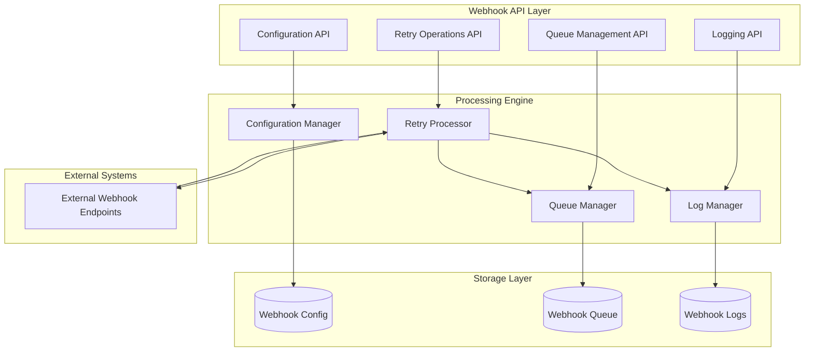
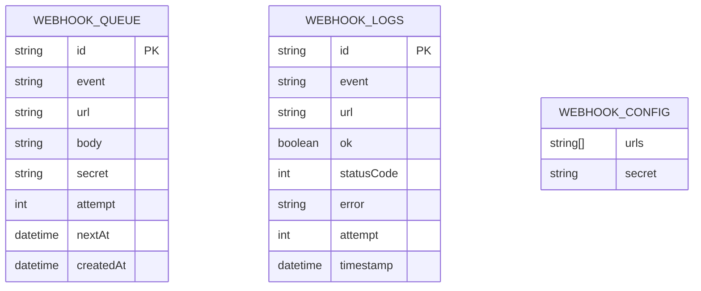
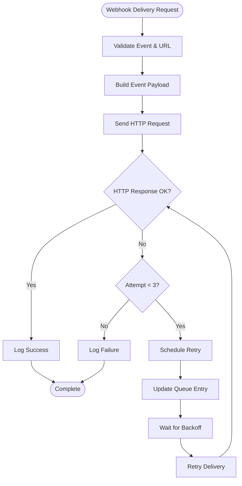

# Webhook System API

<cite>
**Referenced Files in This Document**
- [route.ts](file://src/app/api/system/webhooks/route.ts)
- [route.ts](file://src/app/api/system/webhooks/queue/route.ts)
- [route.ts](file://src/app/api/system/webhooks/retry/route.ts)
- [route.ts](file://src/app/api/system/webhooks/logs/route.ts)
- [webhook-config.ts](file://src/lib/webhook-config.ts)
- [schema.prisma](file://prisma/schema.prisma)
- [error-handler.ts](file://src/lib/error-handler.ts)
- [page.tsx](file://src/app/admin/settings/webhooks/page.tsx)
</cite>

## Table of Contents
1. [Introduction](#introduction)
2. [System Architecture](#system-architecture)
3. [Webhook Configuration](#webhook-configuration)
4. [API Endpoints](#api-endpoints)
5. [Queue Management](#queue-management)
6. [Retry Operations](#retry-operations)
7. [Payload Specifications](#payload-specifications)
8. [Monitoring and Logging](#monitoring-and-logging)
9. [Error Handling](#error-handling)
10. [Security Considerations](#security-considerations)
11. [Performance and Rate Limiting](#performance-and-rate-limiting)
12. [Troubleshooting Guide](#troubleshooting-guide)
13. [Conclusion](#conclusion)

## Introduction

The Webhook System API provides a comprehensive solution for managing webhook integrations within the customer management system. This system handles webhook delivery, retry mechanisms with exponential backoff, queue management, and comprehensive logging capabilities. The API supports multiple webhook endpoints, automatic retry logic, and provides monitoring tools for operational visibility.

The webhook system is designed to handle various business events including daily summaries, payment reminders, and service expiration notifications. It includes robust error handling, retry mechanisms, and monitoring capabilities to ensure reliable webhook delivery to external systems.

## System Architecture

The webhook system follows a distributed architecture with several key components working together:



**Diagram sources**
- [webhook-config.ts:1-107](file://src/lib/webhook-config.ts#L1-L107)
- [route.ts:1-26](file://src/app/api/system/webhooks/route.ts#L1-L26)
- [route.ts:1-88](file://src/app/api/system/webhooks/retry/route.ts#L1-L88)

## Webhook Configuration

### Configuration Management

The webhook system uses environment-based configuration with runtime modification capabilities:

| Configuration Parameter | Type | Description | Default |
|------------------------|------|-------------|---------|
| WEBHOOK_URLS | Comma-separated URLs | List of webhook endpoints to notify | Empty |
| WEBHOOK_SECRET | String | HMAC secret for payload signing | Empty |

### Configuration API Endpoints

The configuration system provides two main endpoints for managing webhook settings:

#### GET /api/system/webhooks
Retrieves current webhook configuration including registered URLs and secret status.

**Response Format:**
```json
{
  "urls": ["https://example.com/webhook1", "https://example.com/webhook2"],
  "secret": true
}
```

#### PUT /api/system/webhooks
Updates webhook configuration with new URLs and secret.

**Request Body:**
```json
{
  "urls": "https://example.com/webhook1,https://example.com/webhook2",
  "secret": "your-hmac-secret"
}
```

**Section sources**
- [route.ts:5-26](file://src/app/api/system/webhooks/route.ts#L5-L26)
- [webhook-config.ts:8-20](file://src/lib/webhook-config.ts#L8-L20)

## API Endpoints

### POST /api/system/webhooks/queue

This endpoint provides real-time queue statistics for monitoring webhook processing status.

**Request:** No body required
**Response:**
```json
{
  "pending": 15,
  "nextInMs": 30000
}
```

Where:
- `pending`: Number of webhook jobs currently waiting in the queue
- `nextInMs`: Time until the next scheduled retry in milliseconds

**Section sources**
- [route.ts:1-7](file://src/app/api/system/webhooks/queue/route.ts#L1-L7)
- [webhook-config.ts:43-49](file://src/lib/webhook-config.ts#L43-L49)

### POST /api/system/webhooks/retry

This endpoint triggers immediate retry operations for failed webhook deliveries.

**Request Body:**
```json
{
  "url": "https://external-service.com/webhook",
  "event": "daily-summary"
}
```

**Supported Events:**
- `daily-summary`: Daily business summary report
- `due-payments`: Upcoming payment reminders
- `expiring-services`: Expiring service notifications

**Response:**
```json
{
  "ok": true
}
```

**Section sources**
- [route.ts:55-88](file://src/app/api/system/webhooks/retry/route.ts#L55-L88)

## Queue Management

### Queue Structure

The webhook queue system uses a PostgreSQL database table with the following schema:



**Diagram sources**
- [schema.prisma:422-433](file://prisma/schema.prisma#L422-L433)
- [schema.prisma:409-420](file://prisma/schema.prisma#L409-L420)

### Queue Statistics

The queue management system provides comprehensive monitoring capabilities:

**Queue Monitoring Endpoint:**
- **GET** `/api/system/webhooks/queue`
- Returns current queue status including pending count and next execution timing

**Processing Logic:**
- Queue processor runs every 5 seconds
- Processes up to 20 ready jobs per cycle
- Jobs become ready when `nextAt` timestamp is reached
- Automatic cleanup of completed jobs

**Section sources**
- [webhook-config.ts:43-49](file://src/lib/webhook-config.ts#L43-L49)
- [webhook-config.ts:68-107](file://src/lib/webhook-config.ts#L68-L107)

## Retry Operations

### Exponential Backoff Strategy

The webhook system implements a sophisticated retry mechanism with exponential backoff:

| Attempt | Delay | Purpose |
|---------|-------|---------|
| 1st | 30 seconds | Immediate retry for transient failures |
| 2nd | 5 minutes | Secondary retry for persistent issues |
| 3rd | 30 minutes | Final retry attempt before giving up |

### Retry Processing Flow



**Diagram sources**
- [webhook-config.ts:51-66](file://src/lib/webhook-config.ts#L51-L66)
- [webhook-config.ts:68-107](file://src/lib/webhook-config.ts#L68-L107)

### Retry Trigger Mechanisms

The system supports multiple ways to trigger retries:

1. **Automatic Retries**: Triggered automatically on delivery failure
2. **Manual Retries**: Triggered via the retry endpoint
3. **Batch Retries**: Bulk retry operations for failed deliveries
4. **Scheduled Retries**: Automatic retry processing by the queue processor

**Section sources**
- [webhook-config.ts:51-66](file://src/lib/webhook-config.ts#L51-L66)
- [webhook-config.ts:68-107](file://src/lib/webhook-config.ts#L68-L107)

## Payload Specifications

### Event Types and Payload Structure

The webhook system generates different payload structures based on the event type:

#### Daily Summary Payload
```json
{
  "event": "daily-summary",
  "timestamp": "2024-01-15T10:30:00Z",
  "data": {
    "updated": {
      "paymentsLate": 0,
      "subscriptionsExpired": 0
    },
    "upcoming7Days": {
      "payments": 15,
      "domains": 8,
      "subscriptions": 12,
      "hosting": 5
    }
  }
}
```

#### Due Payments Payload
```json
{
  "event": "due-payments",
  "timestamp": "2024-01-15T10:30:00Z",
  "data": [
    {
      "id": "pay_123",
      "customerId": "cust_456",
      "dueDate": "2024-01-16T00:00:00Z",
      "amount": 1000.00,
      "currency": "TRY",
      "status": "DUE"
    }
  ]
}
```

#### Expiring Services Payload
```json
{
  "event": "expiring-services",
  "timestamp": "2024-01-15T10:30:00Z",
  "data": [
    {
      "type": "subscription",
      "id": "sub_123",
      "customerId": "cust_456",
      "name": "Premium Plan",
      "endDate": "2024-01-20T00:00:00Z"
    },
    {
      "type": "domain",
      "id": "dom_789",
      "customerId": "cust_456",
      "name": "example.com",
      "renewDate": "2024-01-18T00:00:00Z"
    }
  ]
}
```

### Security Headers

When a webhook secret is configured, the system automatically adds security headers:

- **X-Webhook-Signature**: HMAC-SHA256 signature of the payload
- **Content-Type**: application/json

**Section sources**
- [route.ts:9-53](file://src/app/api/system/webhooks/retry/route.ts#L9-L53)
- [route.ts:67-76](file://src/app/api/system/webhooks/retry/route.ts#L67-L76)

## Monitoring and Logging

### Log Management

The webhook system maintains comprehensive logs of all delivery attempts:

**Log Schema:**
- `id`: Unique log identifier
- `event`: Type of webhook event
- `url`: Target webhook endpoint
- `ok`: Delivery success status
- `statusCode`: HTTP response code (if applicable)
- `error`: Error message (if applicable)
- `attempt`: Retry attempt number
- `timestamp`: Log creation time

### Log Retrieval Endpoint

**GET** `/api/system/webhooks/logs`
Returns the 100 most recent webhook delivery logs with timestamp conversion to milliseconds.

**Response Format:**
```json
{
  "data": [
    {
      "id": "1705321800000-abc123",
      "event": "daily-summary",
      "url": "https://example.com/webhook",
      "ok": false,
      "statusCode": 500,
      "error": "Internal server error",
      "attempt": 2,
      "timestamp": 1705321800000
    }
  ]
}
```

### Administrative Interface

The system includes a comprehensive administrative interface for webhook management:

- Real-time queue monitoring with pending job counts
- Filterable log viewer with event and URL filtering
- Batch retry operations for failed deliveries
- Manual retry triggering for individual entries
- Configuration management interface

**Section sources**
- [webhook-config.ts:22-41](file://src/lib/webhook-config.ts#L22-L41)
- [route.ts:1-17](file://src/app/api/system/webhooks/logs/route.ts#L1-L17)
- [page.tsx:28-51](file://src/app/admin/settings/webhooks/page.tsx#L28-L51)

## Error Handling

### Error Categories

The webhook system handles several types of errors:

1. **Validation Errors**: Invalid event types or missing parameters
2. **Network Errors**: Timeout or connection failures
3. **HTTP Errors**: Non-2xx HTTP responses
4. **Processing Errors**: Internal system failures

### Error Response Format

All API endpoints follow a consistent error response format:

```json
{
  "error": "Error message describing the issue",
  "details": [
    {
      "field": "field_name",
      "message": "Specific validation error"
    }
  ]
}
```

### Error Handling Strategies

| Error Type | Response | Retry Strategy |
|------------|----------|----------------|
| Validation Error (400) | Immediate failure | No retry |
| Network Timeout | Automatic retry | Exponential backoff |
| HTTP 5xx | Automatic retry | Exponential backoff |
| HTTP 4xx | No retry (permanent) | Log and abandon |
| Processing Error | Immediate failure | No retry |

**Section sources**
- [error-handler.ts:4-25](file://src/lib/error-handler.ts#L4-L25)
- [route.ts:60-62](file://src/app/api/system/webhooks/retry/route.ts#L60-L62)

## Security Considerations

### Payload Signing

When a webhook secret is configured, the system automatically signs all outgoing payloads:

1. **Signature Calculation**: HMAC-SHA256 of the JSON payload
2. **Header Addition**: `X-Webhook-Signature` header containing the signature
3. **Verification**: External systems can verify signatures using the shared secret

### Configuration Security

- Secret values are never returned in configuration responses
- Configuration updates require authentication
- Environment variables are the primary storage mechanism

### Transport Security

- All webhook requests use HTTPS
- No plaintext HTTP endpoints are supported
- Certificate validation is performed automatically

**Section sources**
- [webhook-config.ts:6-14](file://src/lib/webhook-config.ts#L6-L14)
- [route.ts:67-76](file://src/app/api/system/webhooks/retry/route.ts#L67-L76)

## Performance and Rate Limiting

### Built-in Rate Limiting

The webhook system implements several built-in rate limiting mechanisms:

1. **Queue Processing Rate**: Maximum 20 jobs processed per 5-second interval
2. **Retry Frequency**: Controlled exponential backoff delays
3. **Concurrent Connections**: Managed by the underlying fetch implementation

### Performance Characteristics

- **Queue Processing**: ~4 jobs per second average throughput
- **Retry Delays**: 30s → 5min → 30min progression
- **Memory Usage**: Minimal - all data stored in database
- **Scalability**: Horizontal scaling supported through database clustering

### Monitoring Metrics

The system provides real-time metrics for performance monitoring:

- Pending queue length
- Next scheduled execution time
- Recent delivery success rates
- Error rates by event type

**Section sources**
- [webhook-config.ts:68-107](file://src/lib/webhook-config.ts#L68-L107)
- [page.tsx:227-230](file://src/app/admin/settings/webhooks/page.tsx#L227-L230)

## Troubleshooting Guide

### Common Issues and Solutions

#### Webhook Delivery Failures
**Symptoms**: Repeated failed deliveries with increasing retry attempts
**Solutions**:
1. Check external endpoint availability and SSL certificates
2. Verify webhook secret configuration matches external system
3. Review network connectivity between servers
4. Monitor queue backlog growth

#### Configuration Problems
**Symptoms**: Configuration changes not taking effect
**Solutions**:
1. Verify environment variables are properly set
2. Restart application to reload configuration
3. Check configuration file permissions
4. Validate URL format and accessibility

#### Performance Issues
**Symptoms**: Slow webhook processing or queue backlog
**Solutions**:
1. Scale database resources
2. Increase retry processor frequency
3. Optimize external endpoint response times
4. Implement external rate limiting

### Diagnostic Commands

**Check Queue Status:**
```bash
curl -X GET https://yoursystem.com/api/system/webhooks/queue
```

**View Recent Logs:**
```bash
curl -X GET https://yoursystem.com/api/system/webhooks/logs
```

**Test Configuration:**
```bash
curl -X GET https://yoursystem.com/api/system/webhooks
```

### Monitoring Setup

Recommended monitoring includes:

1. **Queue Length Alerts**: Notify when pending jobs exceed threshold
2. **Error Rate Monitoring**: Track delivery failure rates
3. **Response Time Tracking**: Monitor external endpoint performance
4. **Retry Progression**: Monitor exponential backoff effectiveness

**Section sources**
- [page.tsx:85-102](file://src/app/admin/settings/webhooks/page.tsx#L85-L102)
- [page.tsx:104-130](file://src/app/admin/settings/webhooks/page.tsx#L104-L130)

## Conclusion

The Webhook System API provides a robust, production-ready solution for managing webhook integrations. Key features include:

- **Reliable Delivery**: Automatic retry with exponential backoff
- **Comprehensive Monitoring**: Real-time queue status and detailed logging
- **Flexible Configuration**: Environment-based setup with runtime modifications
- **Security Features**: Payload signing and secure configuration management
- **Operational Visibility**: Administrative interface for monitoring and management

The system is designed for high reliability and easy maintenance, with clear separation of concerns between configuration, processing, and monitoring components. The modular architecture allows for easy extension and customization while maintaining system stability.

For optimal operation, administrators should monitor queue status, configure appropriate retry strategies, and maintain secure webhook endpoints with proper certificate management.