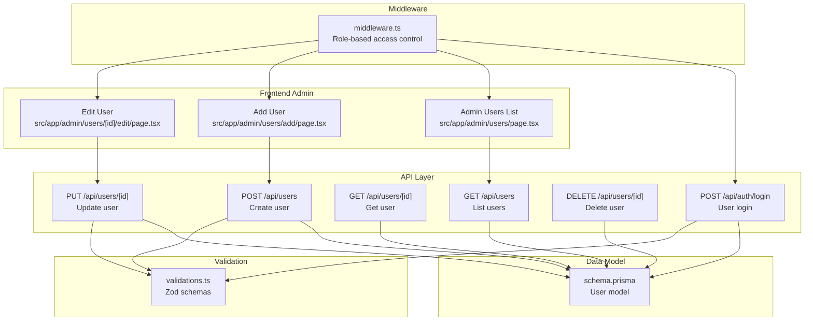
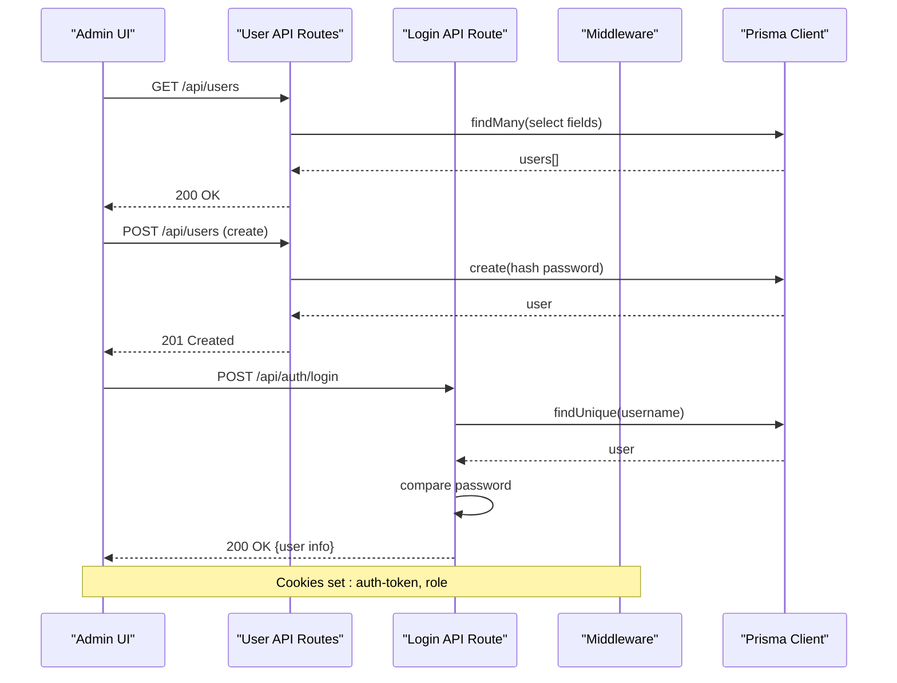
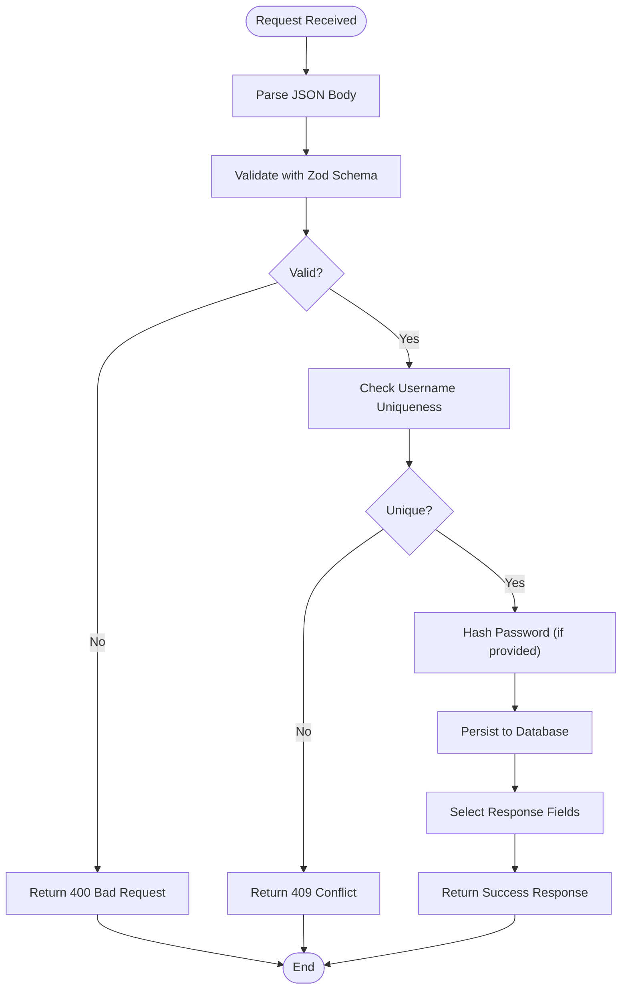
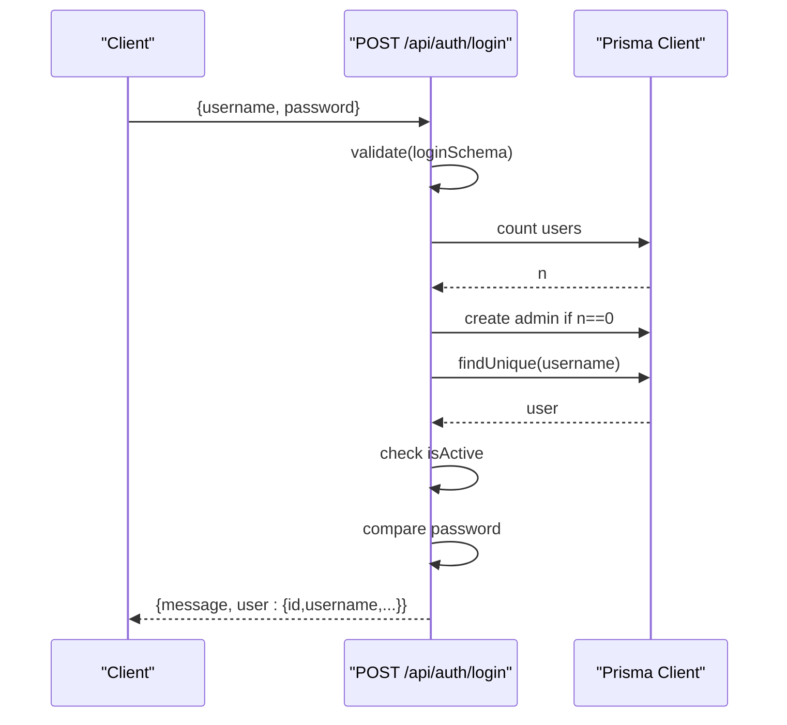
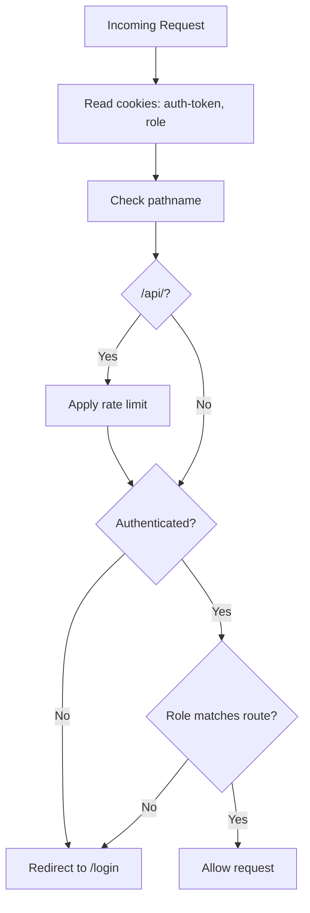
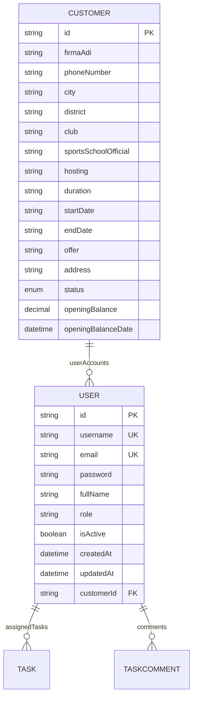
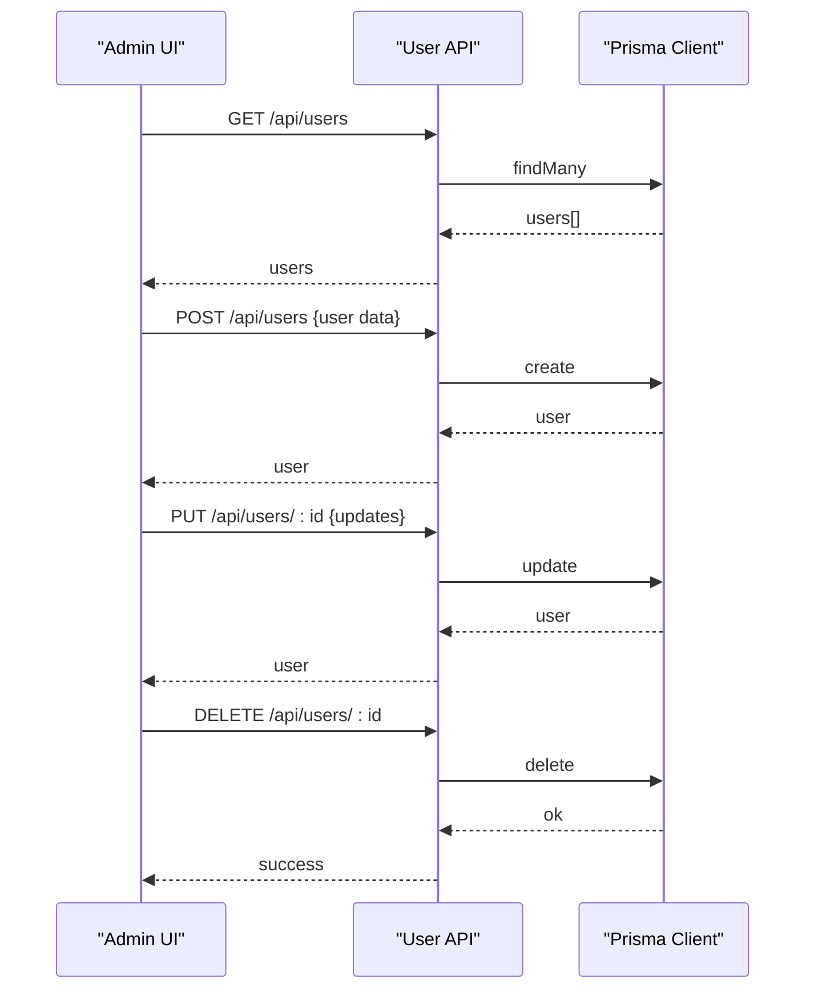
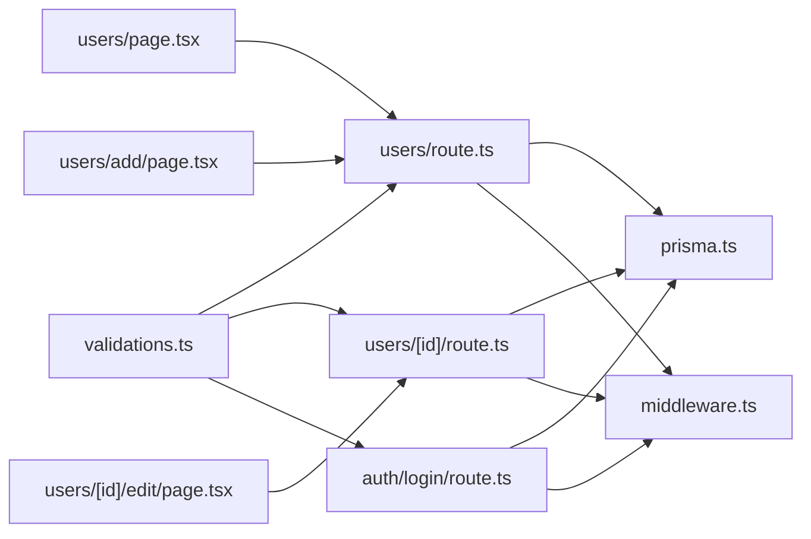

# User System API

<cite>
**Referenced Files in This Document**
- [users/route.ts](file://src/app/api/users/route.ts)
- [users/[id]/route.ts](file://src/app/api/users/[id]/route.ts)
- [auth/login/route.ts](file://src/app/api/auth/login/route.ts)
- [validations.ts](file://src/lib/validations.ts)
- [schema.prisma](file://prisma/schema.prisma)
- [middleware.ts](file://src/middleware.ts)
- [users/page.tsx](file://src/app/admin/users/page.tsx)
- [users/add/page.tsx](file://src/app/admin/users/add/page.tsx)
- [users/[id]/edit/page.tsx](file://src/app/admin/users/[id]/edit/page.tsx)
- [profile/page.tsx](file://src/app/portal/profile/page.tsx)
- [prisma.ts](file://src/lib/prisma.ts)
</cite>

## Table of Contents
1. [Introduction](#introduction)
2. [Project Structure](#project-structure)
3. [Core Components](#core-components)
4. [Architecture Overview](#architecture-overview)
5. [Detailed Component Analysis](#detailed-component-analysis)
6. [Dependency Analysis](#dependency-analysis)
7. [Performance Considerations](#performance-considerations)
8. [Troubleshooting Guide](#troubleshooting-guide)
9. [Conclusion](#conclusion)
10. [Appendices](#appendices)

## Introduction
This document provides comprehensive API documentation for user management in the system. It covers CRUD operations for user accounts, profile management, authentication, and access control. The user model supports multi-role authentication via cookies and middleware-based role checks. Administrative workflows include user creation, profile updates, and account deactivation. Permission handling is enforced through role-based routing and cookie-based session management.

## Project Structure
The user system spans API routes, frontend admin pages, middleware, validation schemas, and the Prisma data model.

**Diagram sources**
- [users/route.ts:8-33](file://src/app/api/users/route.ts#L8-L33)
- [users/[id]/route.ts](file://src/app/api/users/[id]/route.ts#L8-L42)
- [auth/login/route.ts:7-86](file://src/app/api/auth/login/route.ts#L7-L86)
- [users/page.tsx:56-69](file://src/app/admin/users/page.tsx#L56-L69)
- [users/add/page.tsx:51-74](file://src/app/admin/users/add/page.tsx#L51-L74)
- [users/[id]/edit/page.tsx](file://src/app/admin/users/[id]/edit/page.tsx#L91-L119)
- [middleware.ts:31-80](file://src/middleware.ts#L31-L80)
- [validations.ts:77-90](file://src/lib/validations.ts#L77-L90)
- [schema.prisma:725-743](file://prisma/schema.prisma#L725-L743)

**Section sources**
- [users/route.ts:1-93](file://src/app/api/users/route.ts#L1-L93)
- [users/[id]/route.ts](file://src/app/api/users/[id]/route.ts#L1-L164)
- [auth/login/route.ts:1-86](file://src/app/api/auth/login/route.ts#L1-L86)
- [users/page.tsx:1-315](file://src/app/admin/users/page.tsx#L1-L315)
- [users/add/page.tsx:1-229](file://src/app/admin/users/add/page.tsx#L1-L229)
- [users/[id]/edit/page.tsx](file://src/app/admin/users/[id]/edit/page.tsx#L1-L310)
- [middleware.ts:1-101](file://src/middleware.ts#L1-L101)
- [validations.ts:1-243](file://src/lib/validations.ts#L1-L243)
- [schema.prisma:725-743](file://prisma/schema.prisma#L725-L743)

## Core Components
- User API endpoints:
  - GET /api/users: List users with selected fields.
  - POST /api/users: Create a new user with validation and password hashing.
  - GET /api/users/[id]: Retrieve a single user by ID.
  - PUT /api/users/[id]: Update user profile, username uniqueness check, optional password update.
  - DELETE /api/users/[id]: Delete a user by ID.
- Authentication endpoint:
  - POST /api/auth/login: Validates credentials, ensures initial admin seeding, checks activity, compares passwords, returns user info without sensitive data.
- Validation schemas:
  - userCreateSchema, userUpdateSchema, loginSchema enforce field constraints and types.
- Middleware:
  - Enforces role-based access control using cookies (auth-token, role) and rate limiting for API routes.
- Frontend admin pages:
  - Admin users list, add user form, edit user form integrate with the above APIs.

**Section sources**
- [users/route.ts:8-93](file://src/app/api/users/route.ts#L8-L93)
- [users/[id]/route.ts](file://src/app/api/users/[id]/route.ts#L8-L164)
- [auth/login/route.ts:7-86](file://src/app/api/auth/login/route.ts#L7-L86)
- [validations.ts:77-90](file://src/lib/validations.ts#L77-L90)
- [middleware.ts:31-80](file://src/middleware.ts#L31-L80)
- [users/page.tsx:56-112](file://src/app/admin/users/page.tsx#L56-L112)
- [users/add/page.tsx:51-74](file://src/app/admin/users/add/page.tsx#L51-L74)
- [users/[id]/edit/page.tsx](file://src/app/admin/users/[id]/edit/page.tsx#L91-L119)

## Architecture Overview
The user system follows a layered architecture:
- Presentation layer: Admin pages trigger API calls.
- API layer: Route handlers implement CRUD and authentication.
- Validation layer: Zod schemas validate request payloads.
- Persistence layer: Prisma client interacts with PostgreSQL.
- Access control: Middleware enforces role-based routing and rate limits.

**Diagram sources**
- [users/route.ts:8-93](file://src/app/api/users/route.ts#L8-L93)
- [users/[id]/route.ts](file://src/app/api/users/[id]/route.ts#L8-L164)
- [auth/login/route.ts:7-86](file://src/app/api/auth/login/route.ts#L7-L86)
- [middleware.ts:31-80](file://src/middleware.ts#L31-L80)
- [prisma.ts:1-9](file://src/lib/prisma.ts#L1-L9)

## Detailed Component Analysis

### User Management API Endpoints
- GET /api/users
  - Returns paginated list of users with selected fields ordered by creation date.
  - Error handling for server failures.
- POST /api/users
  - Validates input using userCreateSchema.
  - Checks username uniqueness.
  - Hashes password and creates user record.
  - Returns created user with selected fields.
- GET /api/users/[id]
  - Retrieves a single user by ID with selected fields.
  - Handles not found scenario.
- PUT /api/users/[id]
  - Validates input using userUpdateSchema.
  - Ensures username uniqueness across users.
  - Updates profile fields and optionally hashes new password.
  - Returns updated user.
- DELETE /api/users/[id]
  - Confirms existence and deletes user.
  - Returns success message.

**Diagram sources**
- [users/route.ts:35-93](file://src/app/api/users/route.ts#L35-L93)
- [users/[id]/route.ts](file://src/app/api/users/[id]/route.ts#L44-L130)
- [validations.ts:77-90](file://src/lib/validations.ts#L77-L90)

**Section sources**
- [users/route.ts:8-93](file://src/app/api/users/route.ts#L8-L93)
- [users/[id]/route.ts](file://src/app/api/users/[id]/route.ts#L8-L164)
- [validations.ts:77-90](file://src/lib/validations.ts#L77-L90)

### Authentication Endpoint
- POST /api/auth/login
  - Validates credentials with loginSchema.
  - Seeds initial admin user if none exist.
  - Verifies user activity and password.
  - Returns sanitized user info suitable for session storage.

**Diagram sources**
- [auth/login/route.ts:7-86](file://src/app/api/auth/login/route.ts#L7-L86)
- [prisma.ts:1-9](file://src/lib/prisma.ts#L1-L9)

**Section sources**
- [auth/login/route.ts:7-86](file://src/app/api/auth/login/route.ts#L7-L86)

### Access Control and Middleware
- Cookie-based roles:
  - auth-token: indicates authenticated session.
  - role: determines access level (ADMIN, SUPPORT, CUSTOMER).
- Role enforcement:
  - Redirects unauthenticated users to login.
  - Restricts admin routes for non-admin roles.
  - Restricts portal routes for non-CUSTOMER roles.
- Rate limiting:
  - Limits API requests per IP per minute.

**Diagram sources**
- [middleware.ts:31-80](file://src/middleware.ts#L31-L80)

**Section sources**
- [middleware.ts:1-101](file://src/middleware.ts#L1-L101)

### Data Model: User
- Fields:
  - id, username (unique), email (unique), password, fullName, role, isActive, createdAt, updatedAt.
  - Optional customerId linking to Customer.
- Relationships:
  - One-to-many with Customer via customerId.
  - Assigned tasks and comments via relations.

**Diagram sources**
- [schema.prisma:725-743](file://prisma/schema.prisma#L725-L743)
- [schema.prisma:95-134](file://prisma/schema.prisma#L95-L134)

**Section sources**
- [schema.prisma:725-743](file://prisma/schema.prisma#L725-L743)

### Frontend Admin Workflows
- Listing users:
  - Fetches from GET /api/users and renders a searchable table with actions.
- Creating users:
  - Submits to POST /api/users with validated form data.
- Editing users:
  - Loads user, allows optional password update, submits to PUT /api/users/[id].
- Deactivating users:
  - Toggles isActive via PUT /api/users/[id].

**Diagram sources**
- [users/page.tsx:56-112](file://src/app/admin/users/page.tsx#L56-L112)
- [users/add/page.tsx:51-74](file://src/app/admin/users/add/page.tsx#L51-L74)
- [users/[id]/edit/page.tsx](file://src/app/admin/users/[id]/edit/page.tsx#L91-L119)
- [users/route.ts:8-93](file://src/app/api/users/route.ts#L8-L93)
- [users/[id]/route.ts](file://src/app/api/users/[id]/route.ts#L44-L164)

**Section sources**
- [users/page.tsx:1-315](file://src/app/admin/users/page.tsx#L1-L315)
- [users/add/page.tsx:1-229](file://src/app/admin/users/add/page.tsx#L1-L229)
- [users/[id]/edit/page.tsx](file://src/app/admin/users/[id]/edit/page.tsx#L1-L310)

### Profile Management (Portal)
- Portal profile page reads user info from local storage and displays basic details.
- No dedicated API endpoint is implemented for portal user profile updates; profile edits are handled within the portal UI.

**Section sources**
- [profile/page.tsx:1-56](file://src/app/portal/profile/page.tsx#L1-L56)

## Dependency Analysis
- API routes depend on:
  - Prisma client for database operations.
  - Zod schemas for input validation.
  - bcrypt for password hashing.
- Middleware depends on:
  - Cookies for authentication and role propagation.
  - Rate limiter for API protection.
- Frontend admin pages depend on:
  - API routes for data operations.

**Diagram sources**
- [validations.ts:77-90](file://src/lib/validations.ts#L77-L90)
- [users/route.ts:1-6](file://src/app/api/users/route.ts#L1-L6)
- [users/[id]/route.ts](file://src/app/api/users/[id]/route.ts#L1-L6)
- [auth/login/route.ts:1-5](file://src/app/api/auth/login/route.ts#L1-L5)
- [prisma.ts:1-9](file://src/lib/prisma.ts#L1-L9)
- [middleware.ts:31-80](file://src/middleware.ts#L31-L80)
- [users/page.tsx:56-69](file://src/app/admin/users/page.tsx#L56-L69)
- [users/add/page.tsx:51-74](file://src/app/admin/users/add/page.tsx#L51-L74)
- [users/[id]/edit/page.tsx](file://src/app/admin/users/[id]/edit/page.tsx#L91-L119)

**Section sources**
- [validations.ts:77-90](file://src/lib/validations.ts#L77-L90)
- [users/route.ts:1-6](file://src/app/api/users/route.ts#L1-L6)
- [users/[id]/route.ts](file://src/app/api/users/[id]/route.ts#L1-L6)
- [auth/login/route.ts:1-5](file://src/app/api/auth/login/route.ts#L1-L5)
- [prisma.ts:1-9](file://src/lib/prisma.ts#L1-L9)
- [middleware.ts:31-80](file://src/middleware.ts#L31-L80)
- [users/page.tsx:56-69](file://src/app/admin/users/page.tsx#L56-L69)
- [users/add/page.tsx:51-74](file://src/app/admin/users/add/page.tsx#L51-L74)
- [users/[id]/edit/page.tsx](file://src/app/admin/users/[id]/edit/page.tsx#L91-L119)

## Performance Considerations
- Prefer selective field retrieval in API responses to reduce payload size.
- Apply pagination for large user lists.
- Use database indexing on frequently queried fields (username, email).
- Rate limiting protects backend resources; tune thresholds as needed.
- Avoid unnecessary password hashing by conditionally updating only when provided.

## Troubleshooting Guide
- Common errors:
  - 400 Bad Request: Validation failed (invalid fields or types).
  - 401 Unauthorized: Invalid credentials or missing/invalid session.
  - 403 Forbidden: User account deactivated.
  - 404 Not Found: User does not exist.
  - 409 Conflict: Username already taken.
  - 500 Internal Server Error: Unexpected server-side failure.
- Typical causes and fixes:
  - Validation errors: Review request payload against userCreateSchema or userUpdateSchema.
  - Authentication failures: Ensure correct username/password and that account is active.
  - Middleware redirects: Confirm cookies presence and correct role values.
  - Rate limit exceeded: Wait for the reset window or adjust client-side request frequency.

**Section sources**
- [users/route.ts:26-32](file://src/app/api/users/route.ts#L26-L32)
- [users/[id]/route.ts](file://src/app/api/users/[id]/route.ts#L35-L41)
- [auth/login/route.ts:39-52](file://src/app/api/auth/login/route.ts#L39-L52)
- [middleware.ts:40-54](file://src/middleware.ts#L40-L54)

## Conclusion
The user system provides a robust foundation for user lifecycle management with clear separation of concerns across API, validation, persistence, and access control layers. The multi-role authentication model leverages cookies and middleware to enforce secure routing, while the admin UI streamlines CRUD operations. Extending the system with role-based permissions and audit logs would further strengthen governance.

## Appendices

### API Definitions

- Base URL
  - http://localhost:3000 (development)
  - Adjust base URL according to deployment

- Authentication
  - Cookies:
    - auth-token: session identifier
    - role: user role (ADMIN, SUPPORT, CUSTOMER)

- Headers
  - Content-Type: application/json

- Endpoints

  - GET /api/users
    - Description: List users with selected fields
    - Responses:
      - 200 OK: Array of users
      - 500 Internal Server Error: Error message

  - POST /api/users
    - Description: Create a new user
    - Request body:
      - username: string (required)
      - password: string (required)
      - fullName: string (optional)
      - email: string (optional)
      - isActive: boolean (optional, default true)
    - Responses:
      - 201 Created: User object
      - 400 Bad Request: Validation error details
      - 409 Conflict: Username already exists
      - 500 Internal Server Error: Error message

  - GET /api/users/[id]
    - Description: Get a user by ID
    - Responses:
      - 200 OK: User object
      - 404 Not Found: User not found
      - 500 Internal Server Error: Error message

  - PUT /api/users/[id]
    - Description: Update a user
    - Request body:
      - username: string (optional)
      - password: string (optional)
      - fullName: string (optional)
      - email: string (optional)
      - isActive: boolean (optional)
    - Responses:
      - 200 OK: Updated user object
      - 400 Bad Request: Validation error details
      - 404 Not Found: User not found
      - 409 Conflict: Username already exists
      - 500 Internal Server Error: Error message

  - DELETE /api/users/[id]
    - Description: Delete a user
    - Responses:
      - 200 OK: Success message
      - 404 Not Found: User not found
      - 500 Internal Server Error: Error message

  - POST /api/auth/login
    - Description: Authenticate user
    - Request body:
      - username: string (required)
      - password: string (required)
    - Responses:
      - 200 OK: { message, user: { id, username, fullName, email, isActive, role, customerId } }
      - 400 Bad Request: Validation error details
      - 401 Unauthorized: Invalid credentials
      - 403 Forbidden: Account deactivated
      - 500 Internal Server Error: Error message

- Field Reference

  - User object fields:
    - id: string
    - username: string
    - fullName: string | null
    - email: string
    - isActive: boolean
    - createdAt: datetime
    - updatedAt: datetime

- Examples

  - Create a user
    - Method: POST
    - URL: /api/users
    - Body:
      - username: "john_doe"
      - password: "securePass123"
      - fullName: "John Doe"
      - email: "john@example.com"
      - isActive: true

  - Update a user
    - Method: PUT
    - URL: /api/users/:id
    - Body:
      - fullName: "John Smith"
      - email: "john.smith@example.com"
      - isActive: true

  - Deactivate a user
    - Method: PUT
    - URL: /api/users/:id
    - Body:
      - isActive: false

  - Login
    - Method: POST
    - URL: /api/auth/login
    - Body:
      - username: "john_doe"
      - password: "securePass123"

- Notes
  - Passwords are hashed before storage.
  - Username uniqueness is enforced across users.
  - Middleware enforces role-based access control and rate limiting for API routes.