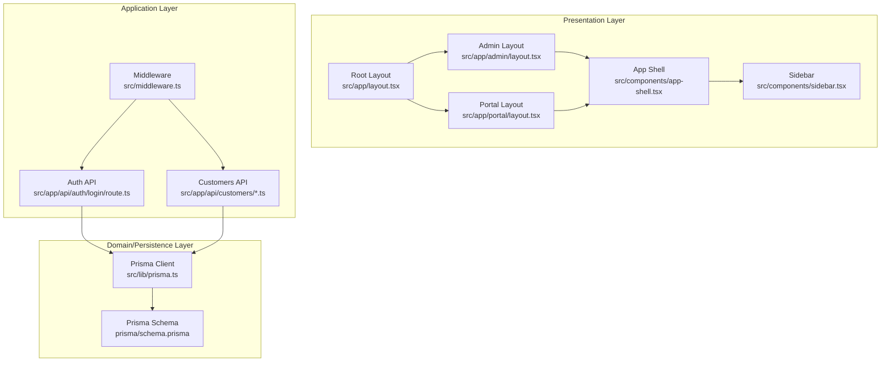
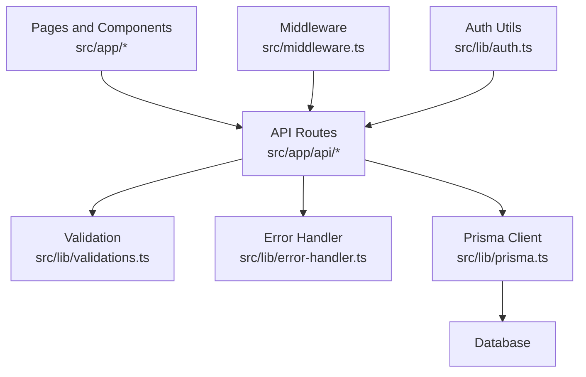
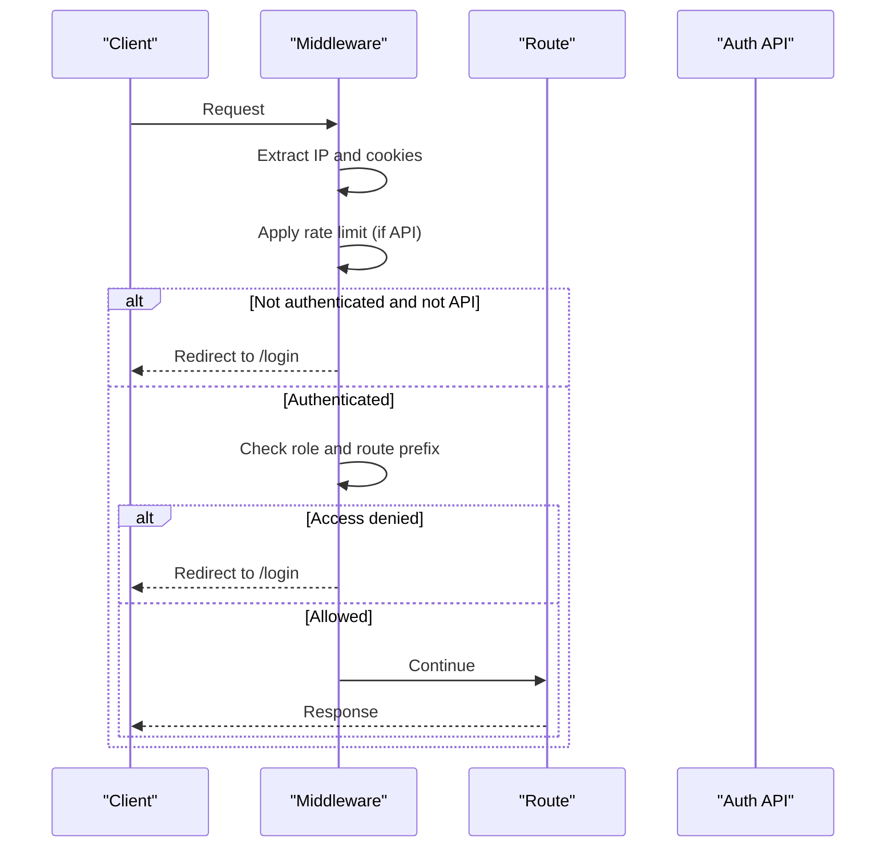
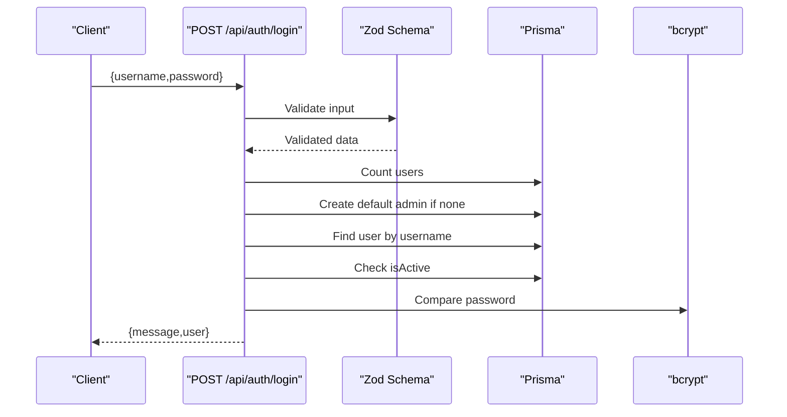
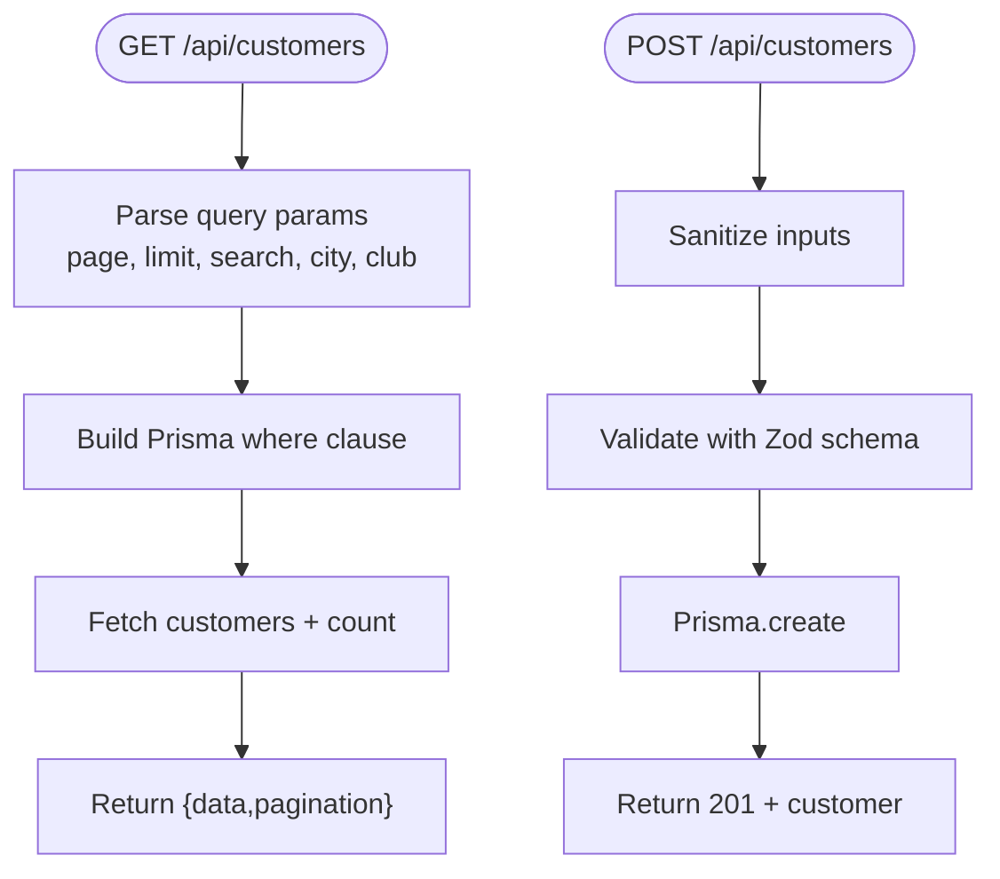
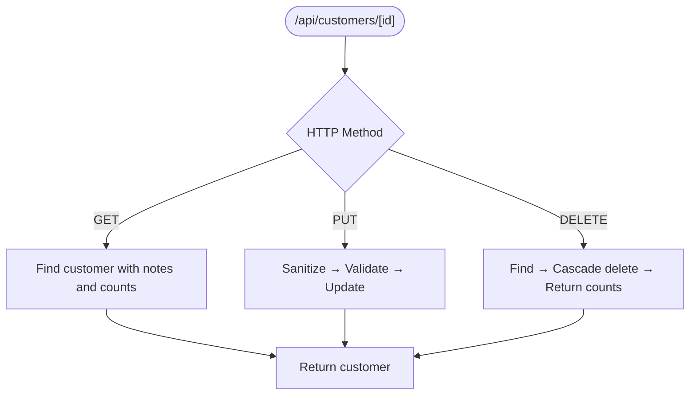
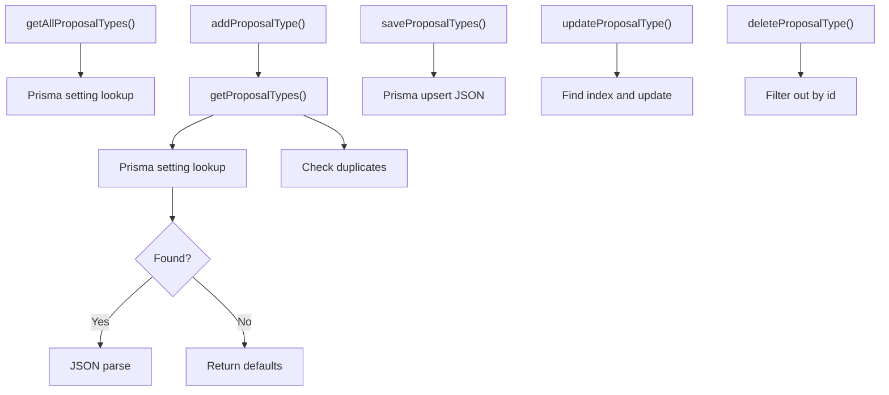
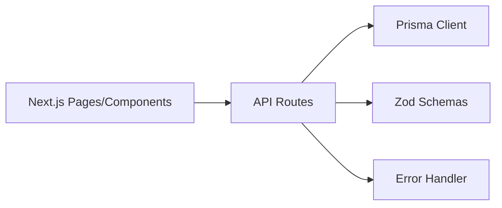
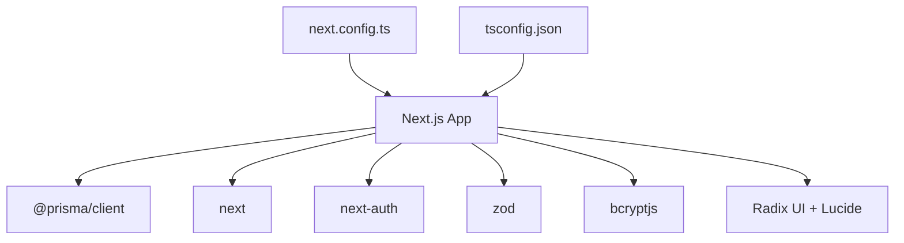
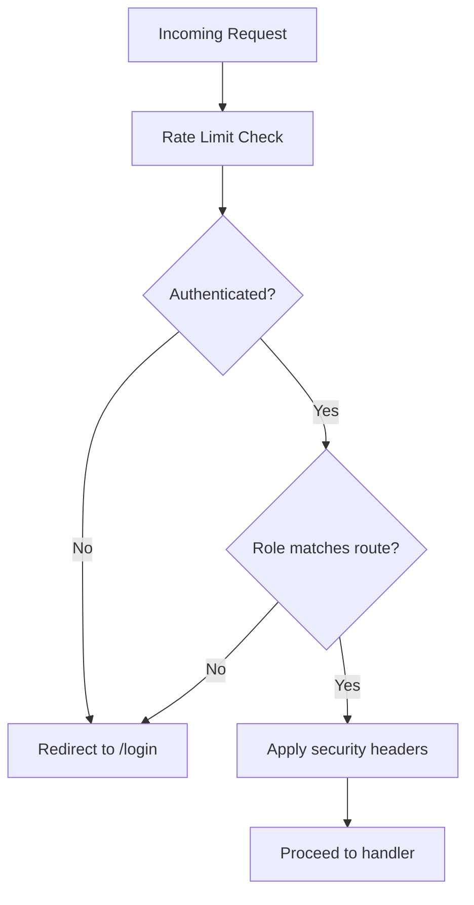

# Architecture Overview

<cite>
**Referenced Files in This Document**
- [middleware.ts](file://src/middleware.ts)
- [auth.ts](file://src/lib/auth.ts)
- [prisma.ts](file://src/lib/prisma.ts)
- [layout.tsx](file://src/app/layout.tsx)
- [admin/layout.tsx](file://src/app/admin/layout.tsx)
- [portal/layout.tsx](file://src/app/portal/layout.tsx)
- [app-shell.tsx](file://src/components/app-shell.tsx)
- [sidebar.tsx](file://src/components/sidebar.tsx)
- [routes.ts](file://src/lib/routes.ts)
- [settings.ts](file://src/lib/settings.ts)
- [validations.ts](file://src/lib/validations.ts)
- [error-handler.ts](file://src/lib/error-handler.ts)
- [login/route.ts](file://src/app/api/auth/login/route.ts)
- [customers/route.ts](file://src/app/api/customers/route.ts)
- [customers/[id]/route.ts](file://src/app/api/customers/[id]/route.ts)
- [package.json](file://package.json)
- [next.config.ts](file://next.config.ts)
- [tsconfig.json](file://tsconfig.json)
</cite>

## Table of Contents
1. [Introduction](#introduction)
2. [Project Structure](#project-structure)
3. [Core Components](#core-components)
4. [Architecture Overview](#architecture-overview)
5. [Detailed Component Analysis](#detailed-component-analysis)
6. [Dependency Analysis](#dependency-analysis)
7. [Performance Considerations](#performance-considerations)
8. [Security Patterns](#security-patterns)
9. [Scalability Considerations](#scalability-considerations)
10. [Troubleshooting Guide](#troubleshooting-guide)
11. [Conclusion](#conclusion)

## Introduction
This document describes the architecture of the Customer WebMahsul system. It is a Next.js 15 application using the App Router, TypeScript, and Prisma ORM. The system follows a layered architecture with clear separation of concerns:
- Presentation Layer: Next.js App Router pages and components
- Application Layer: API routes under src/app/api
- Domain and Persistence Layer: Prisma client and database

The system implements role-based access control via middleware, input validation with Zod, and a pragmatic error handling strategy. Authentication is handled via a lightweight admin session utility and a dedicated login API endpoint.

## Project Structure
The project is organized around Next.js App Router conventions:
- src/app: Page routes, nested layouts, and API routes
- src/components: Reusable UI components and shell/layout
- src/lib: Shared utilities, validation schemas, settings, and Prisma client
- prisma/: Database schema and migrations
- public/uploads: Static assets for uploads

**Diagram sources**
- [layout.tsx:1-35](file://src/app/layout.tsx#L1-L35)
- [admin/layout.tsx:1-10](file://src/app/admin/layout.tsx#L1-L10)
- [portal/layout.tsx:1-10](file://src/app/portal/layout.tsx#L1-L10)
- [app-shell.tsx:1-128](file://src/components/app-shell.tsx#L1-L128)
- [sidebar.tsx:1-321](file://src/components/sidebar.tsx#L1-L321)
- [middleware.ts:1-101](file://src/middleware.ts#L1-L101)
- [login/route.ts:1-86](file://src/app/api/auth/login/route.ts#L1-L86)
- [customers/route.ts:1-105](file://src/app/api/customers/route.ts#L1-L105)
- [customers/[id]/route.ts](file://src/app/api/customers/[id]/route.ts#L1-L121)
- [prisma.ts:1-9](file://src/lib/prisma.ts#L1-L9)
- [schema.prisma](file://prisma/schema.prisma)

**Section sources**
- [layout.tsx:1-35](file://src/app/layout.tsx#L1-L35)
- [admin/layout.tsx:1-10](file://src/app/admin/layout.tsx#L1-L10)
- [portal/layout.tsx:1-10](file://src/app/portal/layout.tsx#L1-L10)
- [app-shell.tsx:1-128](file://src/components/app-shell.tsx#L1-L128)
- [sidebar.tsx:1-321](file://src/components/sidebar.tsx#L1-L321)
- [middleware.ts:1-101](file://src/middleware.ts#L1-L101)
- [prisma.ts:1-9](file://src/lib/prisma.ts#L1-L9)

## Core Components
- Middleware: Implements rate limiting, authentication redirects, role-based access control, and security headers.
- Authentication Utilities: Lightweight admin session helpers and a login API endpoint.
- Prisma Client: Singleton client configured for development and production.
- Validation Layer: Zod schemas for all domain entities and API payloads.
- Error Handler: Centralized API error handling and input sanitization.
- Settings Manager: CRUD for dynamic settings persisted in the database.
- Routing Constants: Centralized route definitions for navigation and programmatic routing.

**Section sources**
- [middleware.ts:1-101](file://src/middleware.ts#L1-L101)
- [auth.ts:1-35](file://src/lib/auth.ts#L1-L35)
- [prisma.ts:1-9](file://src/lib/prisma.ts#L1-L9)
- [validations.ts:1-243](file://src/lib/validations.ts#L1-L243)
- [error-handler.ts:1-34](file://src/lib/error-handler.ts#L1-L34)
- [settings.ts:1-154](file://src/lib/settings.ts#L1-L154)
- [routes.ts:1-43](file://src/lib/routes.ts#L1-L43)

## Architecture Overview
The system follows a layered architecture:
- Presentation Layer: Uses Next.js App Router with nested layouts and shared UI components.
- Application Layer: API routes under src/app/api encapsulate business operations and orchestrate domain actions.
- Domain and Persistence Layer: Prisma client abstracts database operations and enforces schema-defined constraints.

**Diagram sources**
- [login/route.ts:1-86](file://src/app/api/auth/login/route.ts#L1-L86)
- [customers/route.ts:1-105](file://src/app/api/customers/route.ts#L1-L105)
- [validations.ts:1-243](file://src/lib/validations.ts#L1-L243)
- [error-handler.ts:1-34](file://src/lib/error-handler.ts#L1-L34)
- [prisma.ts:1-9](file://src/lib/prisma.ts#L1-L9)
- [middleware.ts:1-101](file://src/middleware.ts#L1-L101)
- [auth.ts:1-35](file://src/lib/auth.ts#L1-L35)

## Detailed Component Analysis

### Middleware and Authentication Flow
The middleware enforces:
- Rate limiting for API endpoints
- Authentication checks and redirects
- Role-based access control (ADMIN/SUPPORT vs CUSTOMER)
- Security headers for non-API routes

**Diagram sources**
- [middleware.ts:1-101](file://src/middleware.ts#L1-L101)

**Section sources**
- [middleware.ts:1-101](file://src/middleware.ts#L1-L101)

### Login API Workflow
The login endpoint validates input, ensures initial admin user creation, verifies user activity, compares passwords, and returns user data.

**Diagram sources**
- [login/route.ts:1-86](file://src/app/api/auth/login/route.ts#L1-L86)
- [validations.ts:87-90](file://src/lib/validations.ts#L87-L90)
- [prisma.ts:1-9](file://src/lib/prisma.ts#L1-L9)

**Section sources**
- [login/route.ts:1-86](file://src/app/api/auth/login/route.ts#L1-L86)
- [validations.ts:87-90](file://src/lib/validations.ts#L87-L90)

### Customers API: List and Create
The customers API supports paginated listing with filters and creation with input sanitization and validation.

**Diagram sources**
- [customers/route.ts:1-105](file://src/app/api/customers/route.ts#L1-L105)
- [validations.ts:4-49](file://src/lib/validations.ts#L4-L49)
- [error-handler.ts:27-34](file://src/lib/error-handler.ts#L27-L34)

**Section sources**
- [customers/route.ts:1-105](file://src/app/api/customers/route.ts#L1-L105)
- [validations.ts:4-49](file://src/lib/validations.ts#L4-L49)
- [error-handler.ts:1-34](file://src/lib/error-handler.ts#L1-L34)

### Customers API: Retrieve, Update, Delete
The single-customer endpoint handles GET, PUT, and DELETE with ID validation and sanitization.

**Diagram sources**
- [customers/[id]/route.ts](file://src/app/api/customers/[id]/route.ts#L1-L121)
- [validations.ts:4-49](file://src/lib/validations.ts#L4-L49)
- [error-handler.ts:27-34](file://src/lib/error-handler.ts#L27-L34)

**Section sources**
- [customers/[id]/route.ts](file://src/app/api/customers/[id]/route.ts#L1-L121)
- [validations.ts:4-49](file://src/lib/validations.ts#L4-L49)
- [error-handler.ts:1-34](file://src/lib/error-handler.ts#L1-L34)

### Settings Management
Proposal types are managed via a settings service that reads/writes JSON settings in the database.

**Diagram sources**
- [settings.ts:1-154](file://src/lib/settings.ts#L1-L154)
- [prisma.ts:1-9](file://src/lib/prisma.ts#L1-L9)

**Section sources**
- [settings.ts:1-154](file://src/lib/settings.ts#L1-L154)
- [prisma.ts:1-9](file://src/lib/prisma.ts#L1-L9)

### MVC-like Separation of Concerns
- Model: Prisma client and database schema define the data model.
- View: Next.js pages and components render UI.
- Controller: API routes orchestrate requests, apply validation, and delegate to domain logic.

**Diagram sources**
- [customers/route.ts:1-105](file://src/app/api/customers/route.ts#L1-L105)
- [prisma.ts:1-9](file://src/lib/prisma.ts#L1-L9)
- [validations.ts:1-243](file://src/lib/validations.ts#L1-L243)
- [error-handler.ts:1-34](file://src/lib/error-handler.ts#L1-L34)

## Dependency Analysis
Key runtime dependencies include Next.js, Prisma Client, bcrypt, Zod, and UI primitives. The project uses a standalone output configuration for containerized deployments.

**Diagram sources**
- [package.json:12-49](file://package.json#L12-L49)
- [next.config.ts:1-14](file://next.config.ts#L1-L14)
- [tsconfig.json:1-28](file://tsconfig.json#L1-L28)

**Section sources**
- [package.json:1-64](file://package.json#L1-L64)
- [next.config.ts:1-14](file://next.config.ts#L1-L14)
- [tsconfig.json:1-28](file://tsconfig.json#L1-L28)

## Performance Considerations
- Database queries: Pagination with skip/take and combined filters reduce payload sizes.
- Parallelization: Bulk operations (e.g., fetching data and count concurrently) improve responsiveness.
- Input sanitization: Minimal regex-based trimming reduces XSS risks and cleans inputs early.
- Prisma client lifecycle: Singleton pattern prevents connection overhead across requests.

Recommendations:
- Add database indexes for frequently filtered fields (city, district, search terms).
- Implement server-side caching for static lists (proposal types) to reduce DB load.
- Consider cursor-based pagination for large datasets to avoid deep skip operations.

**Section sources**
- [customers/route.ts:10-60](file://src/app/api/customers/route.ts#L10-L60)
- [prisma.ts:1-9](file://src/lib/prisma.ts#L1-L9)
- [error-handler.ts:27-34](file://src/lib/error-handler.ts#L27-L34)

## Security Patterns
- Middleware-driven enforcement: Rate limiting, authentication redirects, and role checks.
- Input validation: Strict Zod schemas prevent malformed payloads.
- Password hashing: bcrypt used for secure credential verification.
- Security headers: Non-API routes receive hardened headers; API routes include rate limit headers.
- Cookie-based session: Logout clears auth-token cookie.

**Diagram sources**
- [middleware.ts:1-101](file://src/middleware.ts#L1-L101)

**Section sources**
- [middleware.ts:1-101](file://src/middleware.ts#L1-L101)
- [login/route.ts:54-62](file://src/app/api/auth/login/route.ts#L54-L62)
- [validations.ts:87-90](file://src/lib/validations.ts#L87-L90)

## Scalability Considerations
- Horizontal scaling: Standalone output configuration supports containerized deployment.
- API boundaries: Clear API route organization enables independent scaling of services.
- Middleware: Centralized controls for rate limiting and redirects help manage traffic spikes.
- Prisma: Centralized client simplifies connection pooling and migration management.

Operational tips:
- Use environment-specific Prisma clients and secrets management.
- Introduce circuit breakers for external integrations (webhooks, notifications).
- Monitor API latency and error rates per route to identify hotspots.

**Section sources**
- [next.config.ts:3-11](file://next.config.ts#L3-L11)
- [middleware.ts:4-54](file://src/middleware.ts#L4-L54)
- [prisma.ts:1-9](file://src/lib/prisma.ts#L1-L9)

## Troubleshooting Guide
Common issues and resolutions:
- Validation errors: API routes return structured validation errors; check Zod schemas and input payloads.
- Authentication failures: Ensure cookies are set correctly and roles match route prefixes.
- Rate limit exceeded: Middleware returns 429 with reset timing; adjust client retry logic.
- Database connectivity: Verify Prisma client initialization and environment variables.

Debugging aids:
- Centralized error handler logs and returns consistent error shapes.
- Sanitization removes dangerous characters from inputs early.
- Settings service logs during proposal type operations for visibility.

**Section sources**
- [error-handler.ts:1-34](file://src/lib/error-handler.ts#L1-L34)
- [middleware.ts:40-54](file://src/middleware.ts#L40-L54)
- [settings.ts:14-32](file://src/lib/settings.ts#L14-L32)

## Conclusion
Customer WebMahsul employs a clean, layered architecture leveraging Next.js App Router, TypeScript, and Prisma. The middleware enforces robust security and access control, while Zod schemas and centralized error handling ensure predictable behavior. The modular API route organization and reusable components support maintainability and future growth. With targeted indexing, caching, and observability, the system can scale effectively under increased load.