# Authentication & Authorization

<cite>
**Referenced Files in This Document**
- [middleware.ts](file://src/middleware.ts)
- [routes.ts](file://src/lib/routes.ts)
- [login/page.tsx](file://src/app/login/page.tsx)
- [admin/login/page.tsx](file://src/app/admin/login/page.tsx)
- [auth.ts](file://src/lib/auth.ts)
- [login/route.ts](file://src/app/api/auth/login/route.ts)
- [schema.prisma](file://prisma/schema.prisma)
- [validations.ts](file://src/lib/validations.ts)
- [admin/layout.tsx](file://src/app/admin/layout.tsx)
- [portal/layout.tsx](file://src/app/portal/layout.tsx)
- [admin/dashboard/page.tsx](file://src/app/admin/dashboard/page.tsx)
- [portal/dashboard/page.tsx](file://src/app/portal/dashboard/page.tsx)
</cite>

## Table of Contents
1. [Introduction](#introduction)
2. [Project Structure](#project-structure)
3. [Core Components](#core-components)
4. [Architecture Overview](#architecture-overview)
5. [Detailed Component Analysis](#detailed-component-analysis)
6. [Dependency Analysis](#dependency-analysis)
7. [Performance Considerations](#performance-considerations)
8. [Troubleshooting Guide](#troubleshooting-guide)
9. [Conclusion](#conclusion)
10. [Appendices](#appendices)

## Introduction
This document explains the authentication and authorization model for Customer WebMahsul. It covers the session-based authentication flow, role-based access control (ADMIN, SUPPORT, CUSTOMER), middleware-based route protection, cookie-based session tokens, and multi-tenant routing. It also documents login/logout behavior, rate limiting, security headers, and best practices for securing the application.

## Project Structure
Authentication spans several layers:
- Middleware enforces global protections and redirects
- Public login pages collect credentials and exchange them for cookies
- Protected routes and dashboards render after successful authentication
- Roles drive navigation and access to admin/portal areas

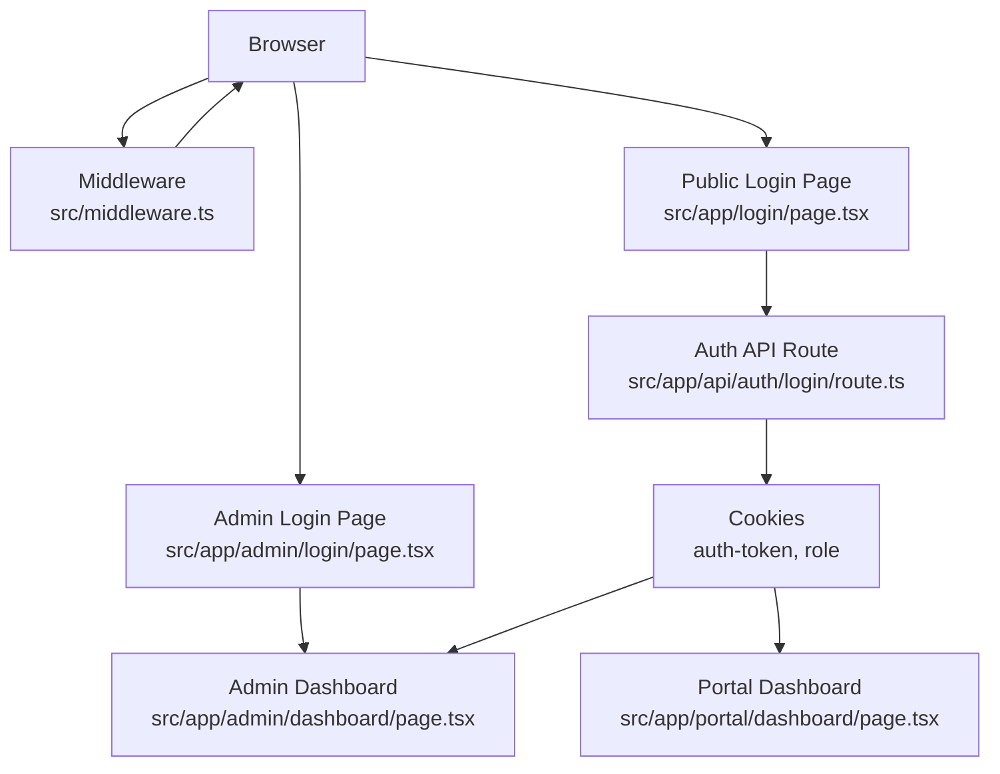

**Diagram sources**
- [middleware.ts:9-94](file://src/middleware.ts#L9-L94)
- [login/page.tsx:21-62](file://src/app/login/page.tsx#L21-L62)
- [admin/login/page.tsx:22-38](file://src/app/admin/login/page.tsx#L22-L38)
- [login/route.ts:7-86](file://src/app/api/auth/login/route.ts#L7-L86)
- [admin/dashboard/page.tsx:32-82](file://src/app/admin/dashboard/page.tsx#L32-L82)
- [portal/dashboard/page.tsx:28-78](file://src/app/portal/dashboard/page.tsx#L28-L78)

**Section sources**
- [middleware.ts:9-94](file://src/middleware.ts#L9-L94)
- [login/page.tsx:13-62](file://src/app/login/page.tsx#L13-L62)
- [admin/login/page.tsx:13-38](file://src/app/admin/login/page.tsx#L13-L38)
- [login/route.ts:7-86](file://src/app/api/auth/login/route.ts#L7-L86)
- [admin/dashboard/page.tsx:32-82](file://src/app/admin/dashboard/page.tsx#L32-L82)
- [portal/dashboard/page.tsx:28-78](file://src/app/portal/dashboard/page.tsx#L28-L78)

## Core Components
- Middleware: Enforces authentication, role checks, redirects, rate limiting, and security headers
- Login Pages: Client-side forms for public and admin logins
- Auth API: Validates credentials, hashes initial admin if needed, and returns user data
- Cookie Session: Stores auth-token and role for subsequent requests
- Protected Dashboards: Render after successful authentication and role-based redirection
- Routes: Centralized route definitions for navigation

Key responsibilities:
- Authentication: Cookie presence determines logged-in state
- Authorization: Role-based access to /admin vs /portal
- Rate Limiting: Per-IP limits for API routes
- Security Headers: Applied to non-API responses

**Section sources**
- [middleware.ts:9-94](file://src/middleware.ts#L9-L94)
- [login/page.tsx:21-62](file://src/app/login/page.tsx#L21-L62)
- [admin/login/page.tsx:22-38](file://src/app/admin/login/page.tsx#L22-L38)
- [login/route.ts:7-86](file://src/app/api/auth/login/route.ts#L7-L86)
- [routes.ts:1-43](file://src/lib/routes.ts#L1-L43)

## Architecture Overview
The authentication flow is cookie-based and role-driven. The middleware intercepts all requests to enforce protections and redirects. The login pages submit credentials to the backend, which validates them and sets secure cookies. Subsequent requests carry cookies that the middleware reads to determine role and redirect behavior.

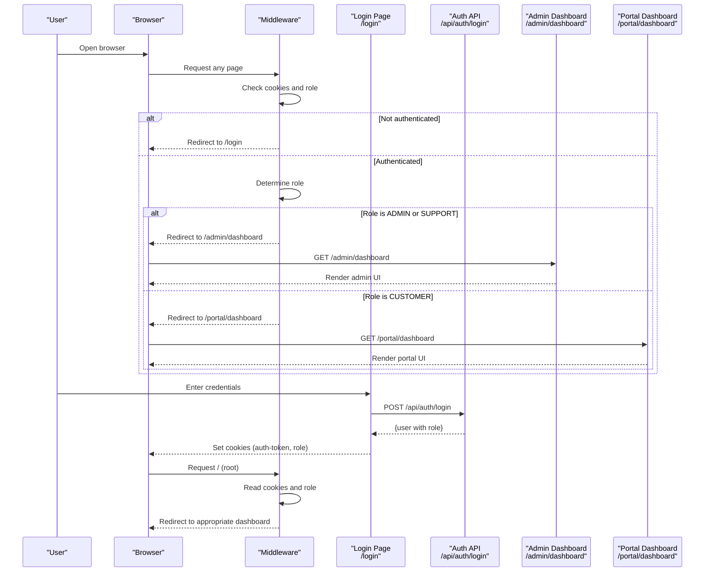

**Diagram sources**
- [middleware.ts:31-80](file://src/middleware.ts#L31-L80)
- [login/page.tsx:21-62](file://src/app/login/page.tsx#L21-L62)
- [login/route.ts:7-86](file://src/app/api/auth/login/route.ts#L7-L86)
- [admin/dashboard/page.tsx:32-82](file://src/app/admin/dashboard/page.tsx#L32-L82)
- [portal/dashboard/page.tsx:28-78](file://src/app/portal/dashboard/page.tsx#L28-L78)

## Detailed Component Analysis

### Middleware: Authentication, Authorization, and Rate Limiting
- Reads auth-token and role cookies
- Redirects unauthenticated users to /login (except API)
- Redirects authenticated users to role-appropriate dashboard on root
- Enforces role-based access: /admin requires ADMIN or SUPPORT; /portal requires CUSTOMER
- Applies security headers for non-API responses
- Rate limits API requests per IP

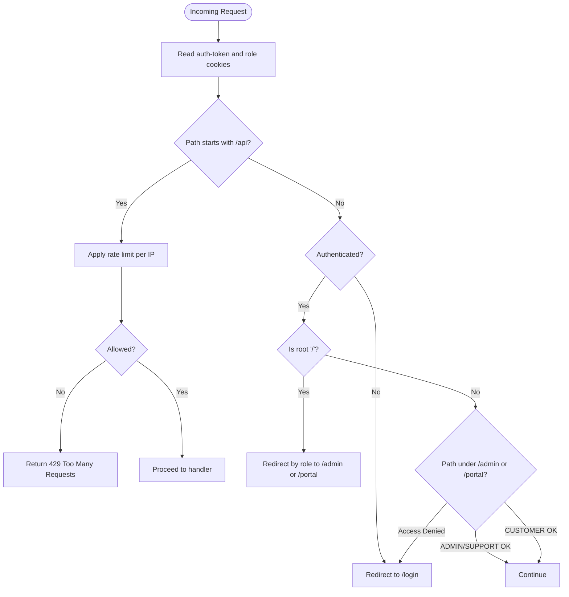

**Diagram sources**
- [middleware.ts:31-94](file://src/middleware.ts#L31-L94)

**Section sources**
- [middleware.ts:9-94](file://src/middleware.ts#L9-L94)

### Public Login Page: Client-Side Form Submission
- Collects username and password
- Calls /api/auth/login
- On success, sets auth-token and role cookies and navigates to role-specific dashboard

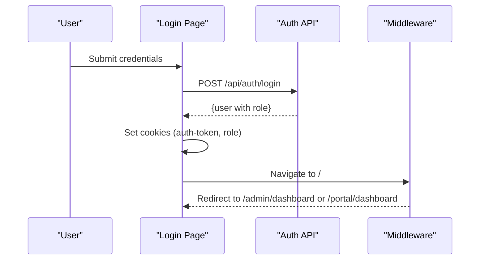

**Diagram sources**
- [login/page.tsx:21-62](file://src/app/login/page.tsx#L21-L62)
- [login/route.ts:7-86](file://src/app/api/auth/login/route.ts#L7-L86)
- [middleware.ts:66-80](file://src/middleware.ts#L66-L80)

**Section sources**
- [login/page.tsx:13-62](file://src/app/login/page.tsx#L13-L62)

### Admin Login Page: Client-Side Admin Panel Login
- Validates credentials locally against stored admin credentials
- Sets admin session in sessionStorage and navigates to /admin

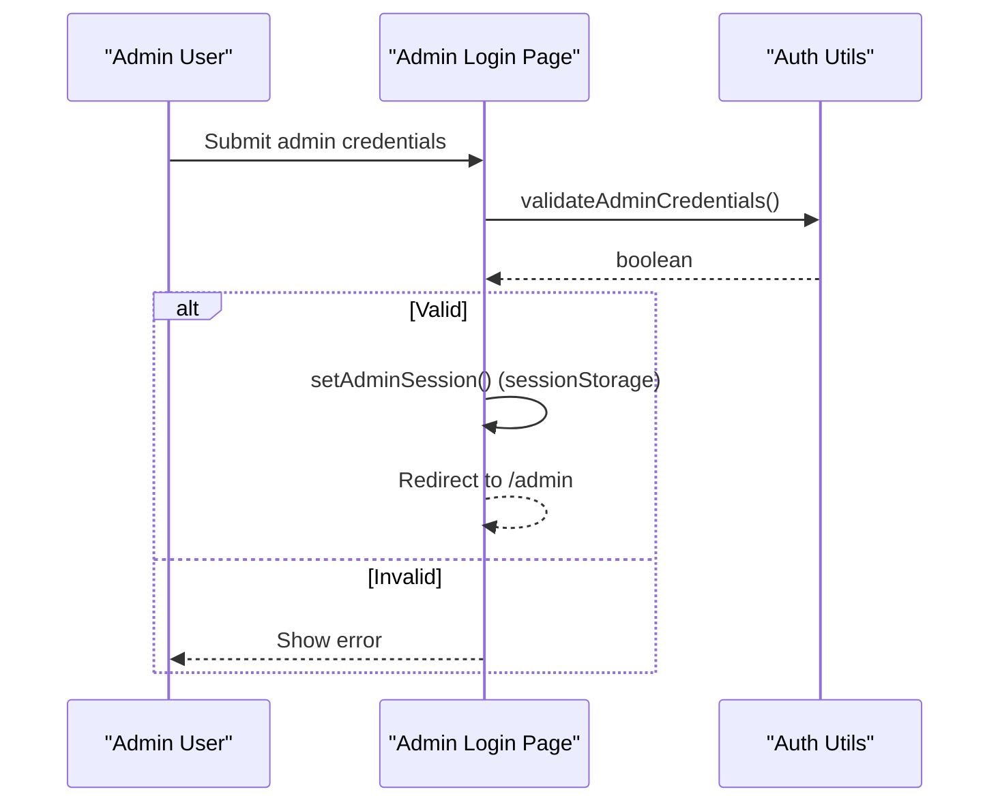

**Diagram sources**
- [admin/login/page.tsx:22-38](file://src/app/admin/login/page.tsx#L22-L38)
- [auth.ts:13-35](file://src/lib/auth.ts#L13-L35)

**Section sources**
- [admin/login/page.tsx:13-38](file://src/app/admin/login/page.tsx#L13-L38)
- [auth.ts:1-35](file://src/lib/auth.ts#L1-L35)

### Auth API Route: Credential Validation and Initial Setup
- Validates input via Zod schema
- Seeds admin user if none exists (hashed password)
- Finds user by username, checks active status, compares password hash
- Returns user payload without sensitive fields

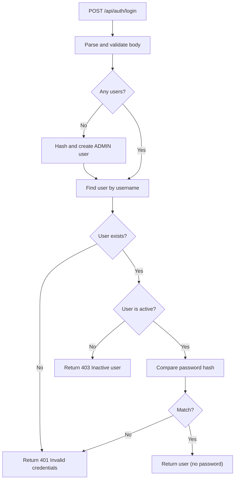

**Diagram sources**
- [login/route.ts:7-86](file://src/app/api/auth/login/route.ts#L7-L86)
- [validations.ts:87-90](file://src/lib/validations.ts#L87-L90)

**Section sources**
- [login/route.ts:7-86](file://src/app/api/auth/login/route.ts#L7-L86)
- [validations.ts:87-90](file://src/lib/validations.ts#L87-L90)

### Protected Routes and Layouts
- Admin area: Uses admin layout and renders admin dashboard
- Portal area: Uses portal layout and renders portal dashboard
- Both dashboards fetch data client-side after authentication

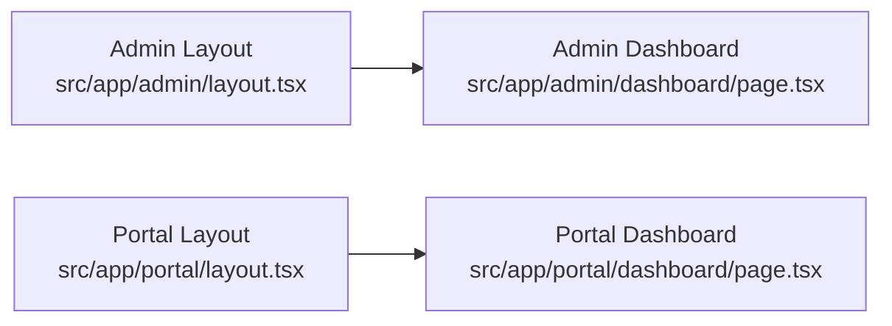

**Diagram sources**
- [admin/layout.tsx:1-10](file://src/app/admin/layout.tsx#L1-L10)
- [portal/layout.tsx:1-10](file://src/app/portal/layout.tsx#L1-L10)
- [admin/dashboard/page.tsx:32-82](file://src/app/admin/dashboard/page.tsx#L32-L82)
- [portal/dashboard/page.tsx:28-78](file://src/app/portal/dashboard/page.tsx#L28-L78)

**Section sources**
- [admin/layout.tsx:1-10](file://src/app/admin/layout.tsx#L1-L10)
- [portal/layout.tsx:1-10](file://src/app/portal/layout.tsx#L1-L10)
- [admin/dashboard/page.tsx:32-82](file://src/app/admin/dashboard/page.tsx#L32-L82)
- [portal/dashboard/page.tsx:28-78](file://src/app/portal/dashboard/page.tsx#L28-L78)

### Role-Based Access Control (RBAC)
Roles supported:
- ADMIN
- SUPPORT
- CUSTOMER

Access rules:
- ADMIN/SUPPORT can access /admin
- CUSTOMER can access /portal
- Root (/) redirects based on role
- Unauthenticated users are redirected to /login

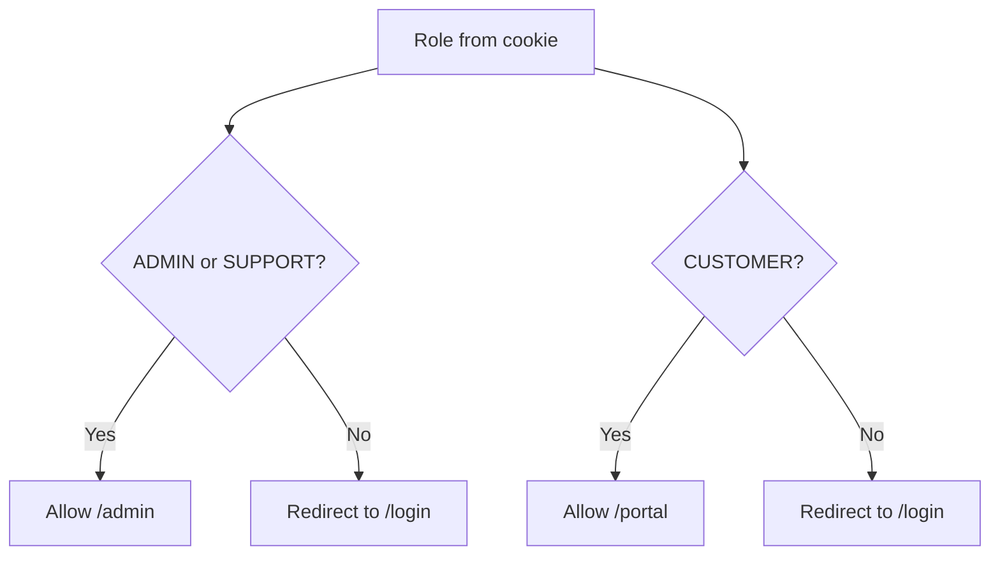

**Diagram sources**
- [middleware.ts:35-79](file://src/middleware.ts#L35-L79)

**Section sources**
- [middleware.ts:35-79](file://src/middleware.ts#L35-L79)

### Session Management and Token Handling
- Client-side login sets two cookies:
  - auth-token: user identifier
  - role: user role
- Middleware reads these cookies to determine authentication and role
- Admin panel login writes to sessionStorage for admin panel sessions

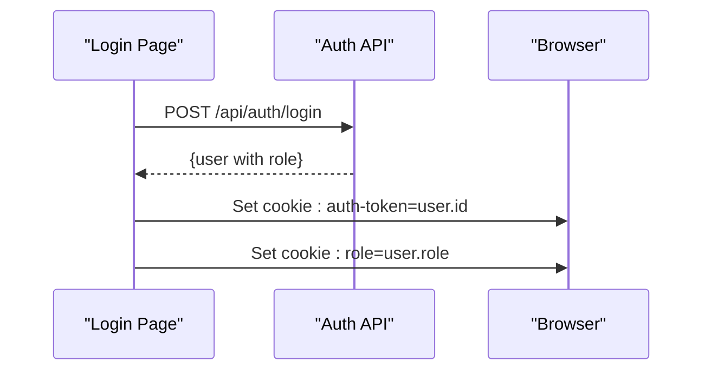

**Diagram sources**
- [login/page.tsx:46-52](file://src/app/login/page.tsx#L46-L52)
- [login/route.ts:64-78](file://src/app/api/auth/login/route.ts#L64-L78)

**Section sources**
- [login/page.tsx:46-52](file://src/app/login/page.tsx#L46-L52)
- [auth.ts:18-35](file://src/lib/auth.ts#L18-L35)

### Multi-Tenant Routing
- The portal dashboard reads the current customer ID from local storage and filters data by customerId for all API calls
- This enables role-based multi-tenancy within the portal

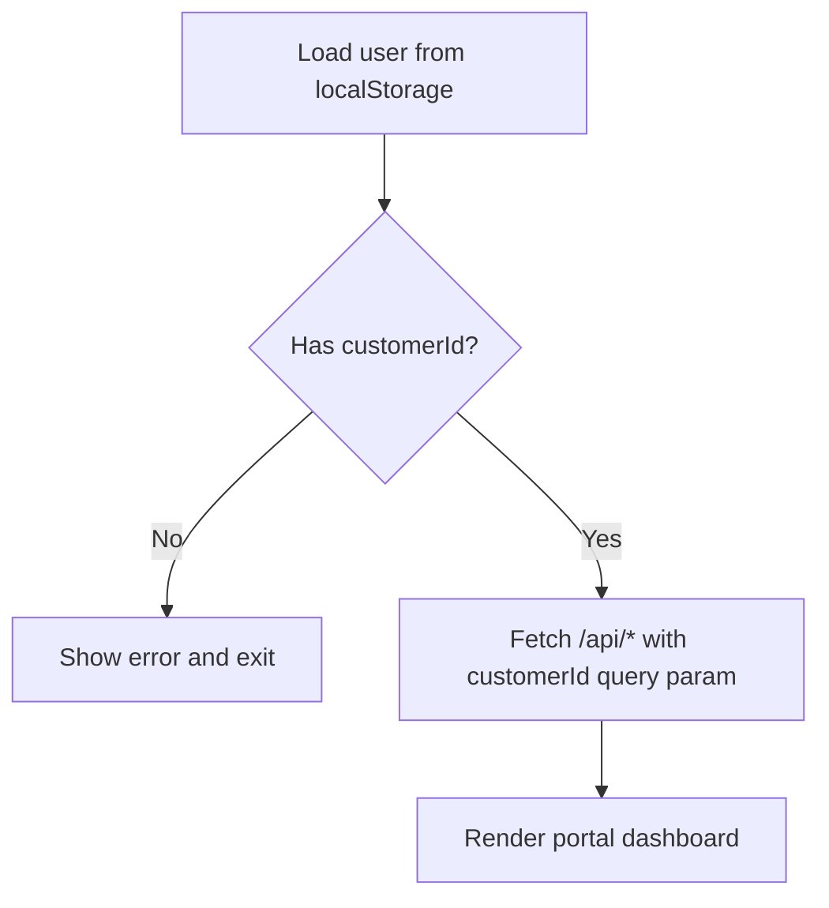

**Diagram sources**
- [portal/dashboard/page.tsx:17-78](file://src/app/portal/dashboard/page.tsx#L17-L78)

**Section sources**
- [portal/dashboard/page.tsx:17-78](file://src/app/portal/dashboard/page.tsx#L17-L78)

## Dependency Analysis
- Middleware depends on cookies and role constants
- Login pages depend on routes and cookie setting
- Auth API depends on Prisma and Zod validation
- Dashboards depend on routes and cookie-based role routing

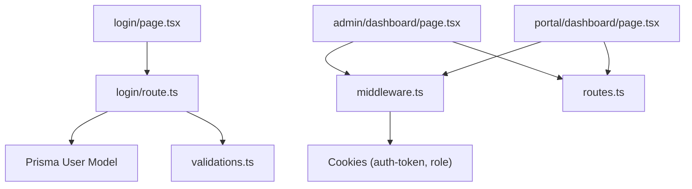

**Diagram sources**
- [middleware.ts:31-36](file://src/middleware.ts#L31-L36)
- [login/page.tsx:35-52](file://src/app/login/page.tsx#L35-L52)
- [login/route.ts:2-5](file://src/app/api/auth/login/route.ts#L2-L5)
- [routes.ts:1-43](file://src/lib/routes.ts#L1-L43)
- [admin/dashboard/page.tsx:21-32](file://src/app/admin/dashboard/page.tsx#L21-L32)
- [portal/dashboard/page.tsx:7-28](file://src/app/portal/dashboard/page.tsx#L7-L28)

**Section sources**
- [middleware.ts:31-36](file://src/middleware.ts#L31-L36)
- [login/page.tsx:35-52](file://src/app/login/page.tsx#L35-L52)
- [login/route.ts:2-5](file://src/app/api/auth/login/route.ts#L2-L5)
- [routes.ts:1-43](file://src/lib/routes.ts#L1-L43)
- [admin/dashboard/page.tsx:21-32](file://src/app/admin/dashboard/page.tsx#L21-L32)
- [portal/dashboard/page.tsx:7-28](file://src/app/portal/dashboard/page.tsx#L7-L28)

## Performance Considerations
- Rate limiting reduces API load and protects against brute force attempts
- Middleware short-circuits unauthorized requests early
- Client-side dashboards batch API calls to reduce round trips

[No sources needed since this section provides general guidance]

## Troubleshooting Guide
Common issues and resolutions:
- 401 Unauthorized during login
  - Ensure username/password match an existing active user
  - Verify the seeded admin user exists if no users are present
- 403 Inactive user
  - Activate the user account in the system
- Redirect loops to /login
  - Confirm cookies are being set and readable by the server
  - Check middleware matcher exclusions for static assets
- Role mismatch
  - Verify the role cookie matches ADMIN, SUPPORT, or CUSTOMER
- Rate limit errors (429)
  - Wait for the reset window or reduce request frequency
- Portal data not filtered by tenant
  - Ensure customerId is present in localStorage and passed as a query parameter

**Section sources**
- [login/route.ts:39-62](file://src/app/api/auth/login/route.ts#L39-L62)
- [middleware.ts:40-54](file://src/middleware.ts#L40-L54)
- [portal/dashboard/page.tsx:17-78](file://src/app/portal/dashboard/page.tsx#L17-L78)

## Conclusion
Customer WebMahsul implements a straightforward, cookie-based authentication and authorization system. Middleware governs access, roles determine navigation, and the login pages integrate with a backend API that validates credentials and seeds an initial admin user. The portal supports multi-tenancy by filtering data by customer ID. Additional security headers and rate limiting further harden the system.

[No sources needed since this section summarizes without analyzing specific files]

## Appendices

### Role Definitions and Permissions
- ADMIN: Full administrative access; can access /admin
- SUPPORT: Administrative access; can access /admin
- CUSTOMER: Tenant-specific access; can access /portal

**Section sources**
- [middleware.ts:35-79](file://src/middleware.ts#L35-L79)
- [schema.prisma:88-92](file://prisma/schema.prisma#L88-L92)

### Example Protected Routes and Access Patterns
- /admin/*
  - Allowed: ADMIN, SUPPORT
  - Denied: CUSTOMER, unauthenticated
- /portal/*
  - Allowed: CUSTOMER
  - Denied: ADMIN, SUPPORT, unauthenticated
- /
  - Redirects based on role to /admin/dashboard or /portal/dashboard

**Section sources**
- [middleware.ts:66-80](file://src/middleware.ts#L66-L80)