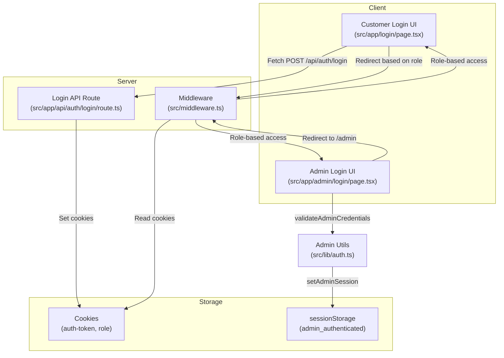
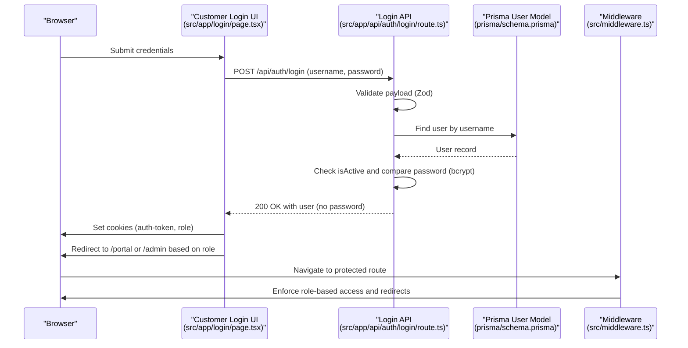
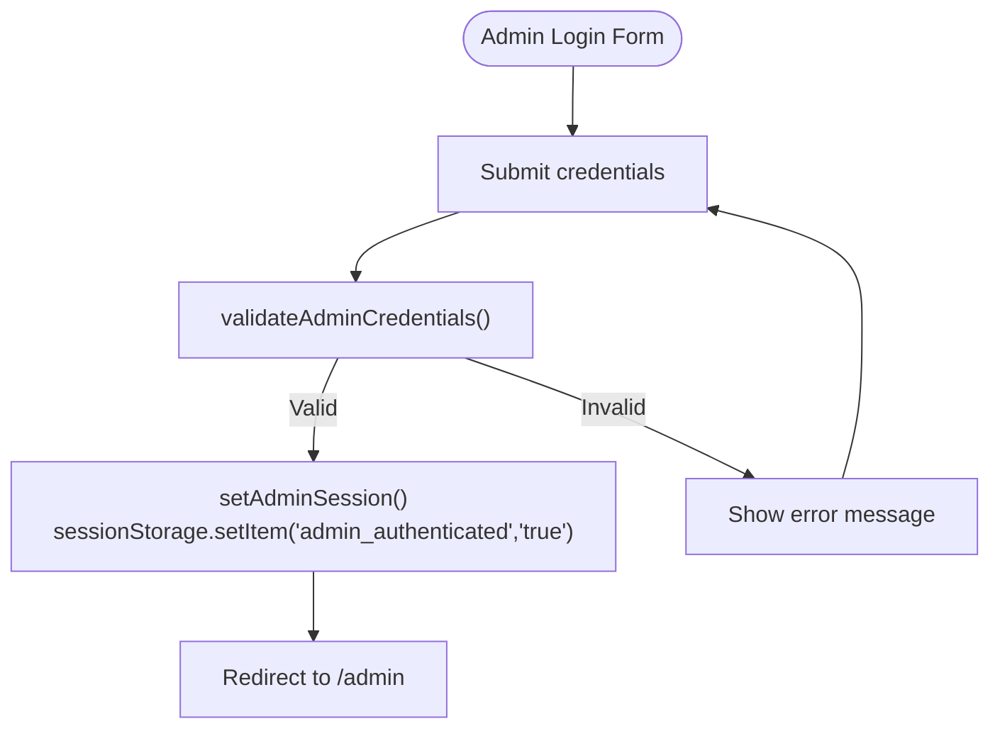
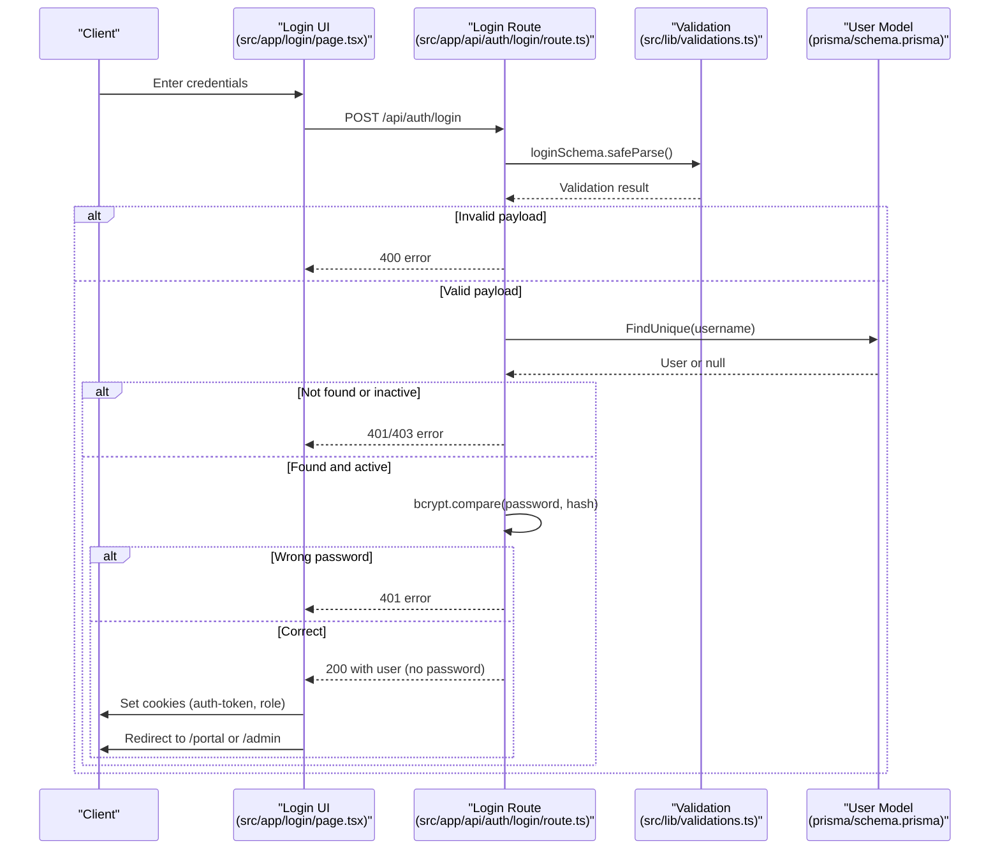
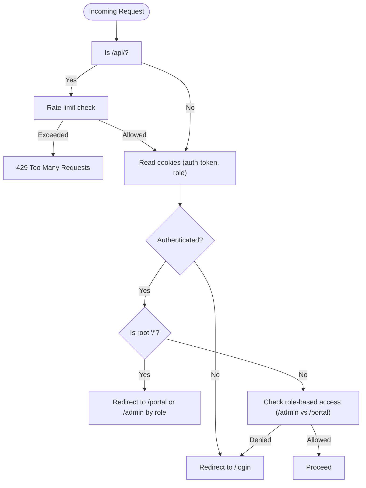
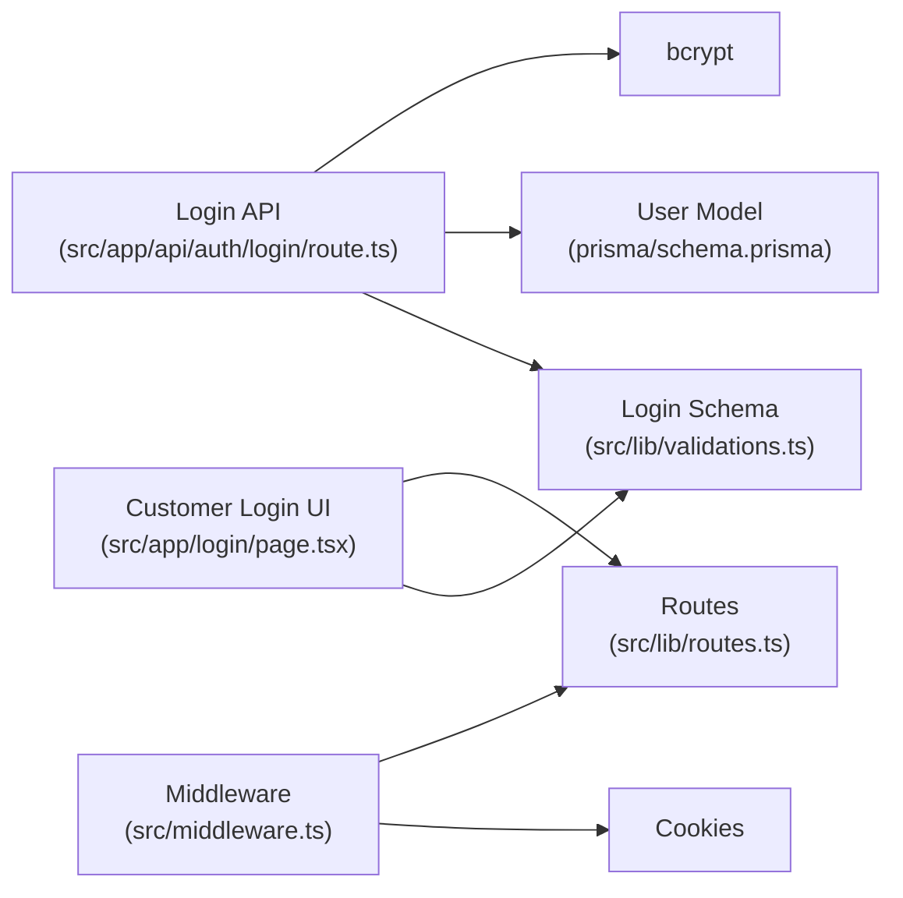

# Authentication Flow

<cite>
**Referenced Files in This Document**
- [src/lib/auth.ts](file://src/lib/auth.ts)
- [src/app/admin/login/page.tsx](file://src/app/admin/login/page.tsx)
- [src/app/login/page.tsx](file://src/app/login/page.tsx)
- [src/app/api/auth/login/route.ts](file://src/app/api/auth/login/route.ts)
- [src/middleware.ts](file://src/middleware.ts)
- [src/lib/validations.ts](file://src/lib/validations.ts)
- [src/lib/routes.ts](file://src/lib/routes.ts)
- [prisma/schema.prisma](file://prisma/schema.prisma)
</cite>

## Table of Contents
1. [Introduction](#introduction)
2. [Project Structure](#project-structure)
3. [Core Components](#core-components)
4. [Architecture Overview](#architecture-overview)
5. [Detailed Component Analysis](#detailed-component-analysis)
6. [Dependency Analysis](#dependency-analysis)
7. [Performance Considerations](#performance-considerations)
8. [Troubleshooting Guide](#troubleshooting-guide)
9. [Conclusion](#conclusion)

## Introduction
This document explains the authentication flow in Customer WebMahsul, focusing on:
- Session-based authentication for the customer portal
- Admin panel authentication using a simple client-side session
- Credential validation, session creation, and logout procedures
- Differences between admin and customer authentication
- Security considerations, error handling, and troubleshooting

The system integrates:
- A customer login flow backed by a Prisma-managed user database and bcrypt password hashing
- A middleware enforcing role-based access control and rate limiting
- An admin login page with a simple in-memory credential check and sessionStorage-based session

## Project Structure
Key authentication-related files and their roles:
- Admin panel authentication utilities and UI
  - [src/lib/auth.ts](file://src/lib/auth.ts): Admin credential validation and session helpers
  - [src/app/admin/login/page.tsx](file://src/app/admin/login/page.tsx): Admin login UI and submission handler
- Customer authentication and API
  - [src/app/login/page.tsx](file://src/app/login/page.tsx): Customer login UI and API call
  - [src/app/api/auth/login/route.ts](file://src/app/api/auth/login/route.ts): Customer login endpoint with validation and database lookup
  - [src/lib/validations.ts](file://src/lib/validations.ts): Zod schemas for login validation
  - [prisma/schema.prisma](file://prisma/schema.prisma): User model and roles
- Middleware and routing
  - [src/middleware.ts](file://src/middleware.ts): Authentication checks, redirects, role-based access, and rate limiting
  - [src/lib/routes.ts](file://src/lib/routes.ts): Named routes for navigation

**Diagram sources**
- [src/app/login/page.tsx:13-62](file://src/app/login/page.tsx#L13-L62)
- [src/app/api/auth/login/route.ts:7-86](file://src/app/api/auth/login/route.ts#L7-L86)
- [src/middleware.ts:31-80](file://src/middleware.ts#L31-L80)
- [src/lib/auth.ts:13-35](file://src/lib/auth.ts#L13-L35)
- [src/app/admin/login/page.tsx:22-38](file://src/app/admin/login/page.tsx#L22-L38)

**Section sources**
- [src/app/login/page.tsx:13-62](file://src/app/login/page.tsx#L13-L62)
- [src/app/api/auth/login/route.ts:7-86](file://src/app/api/auth/login/route.ts#L7-L86)
- [src/middleware.ts:31-80](file://src/middleware.ts#L31-L80)
- [src/lib/auth.ts:13-35](file://src/lib/auth.ts#L13-L35)
- [src/app/admin/login/page.tsx:22-38](file://src/app/admin/login/page.tsx#L22-L38)

## Core Components
- Admin authentication
  - Credential validation and session management via [src/lib/auth.ts](file://src/lib/auth.ts)
  - Admin login UI and submission handler via [src/app/admin/login/page.tsx](file://src/app/admin/login/page.tsx)
- Customer authentication
  - Login UI and cookie-based session via [src/app/login/page.tsx](file://src/app/login/page.tsx)
  - Login API endpoint with validation and database lookup via [src/app/api/auth/login/route.ts](file://src/app/api/auth/login/route.ts)
  - Validation schemas via [src/lib/validations.ts](file://src/lib/validations.ts)
- Middleware and routing
  - Role-based access control and redirects via [src/middleware.ts](file://src/middleware.ts)
  - Named routes via [src/lib/routes.ts](file://src/lib/routes.ts)
- Data model
  - User model and roles via [prisma/schema.prisma](file://prisma/schema.prisma)

**Section sources**
- [src/lib/auth.ts:13-35](file://src/lib/auth.ts#L13-L35)
- [src/app/admin/login/page.tsx:22-38](file://src/app/admin/login/page.tsx#L22-L38)
- [src/app/login/page.tsx:21-61](file://src/app/login/page.tsx#L21-L61)
- [src/app/api/auth/login/route.ts:7-86](file://src/app/api/auth/login/route.ts#L7-L86)
- [src/lib/validations.ts:87-90](file://src/lib/validations.ts#L87-L90)
- [src/middleware.ts:31-80](file://src/middleware.ts#L31-L80)
- [src/lib/routes.ts:1-43](file://src/lib/routes.ts#L1-L43)
- [prisma/schema.prisma:724-743](file://prisma/schema.prisma#L724-L743)

## Architecture Overview
The authentication architecture separates concerns:
- Admin: client-side session using sessionStorage
- Customer: server-backed session using cookies set by the login API
- Middleware enforces authentication and role-based access for both flows

**Diagram sources**
- [src/app/login/page.tsx:21-61](file://src/app/login/page.tsx#L21-L61)
- [src/app/api/auth/login/route.ts:7-86](file://src/app/api/auth/login/route.ts#L7-L86)
- [prisma/schema.prisma:724-743](file://prisma/schema.prisma#L724-L743)
- [src/middleware.ts:31-80](file://src/middleware.ts#L31-L80)

## Detailed Component Analysis

### Admin Authentication Flow
- UI: [src/app/admin/login/page.tsx](file://src/app/admin/login/page.tsx)
  - Collects username and password
  - Submits to client-side validator
- Validator and session: [src/lib/auth.ts](file://src/lib/auth.ts)
  - Validates credentials against hardcoded values
  - Sets a sessionStorage flag upon successful login
- Redirect: After login, navigates to the admin area

**Diagram sources**
- [src/app/admin/login/page.tsx:22-38](file://src/app/admin/login/page.tsx#L22-L38)
- [src/lib/auth.ts:13-22](file://src/lib/auth.ts#L13-L22)

**Section sources**
- [src/app/admin/login/page.tsx:22-38](file://src/app/admin/login/page.tsx#L22-L38)
- [src/lib/auth.ts:13-22](file://src/lib/auth.ts#L13-L22)

### Customer Authentication Flow
- UI: [src/app/login/page.tsx](file://src/app/login/page.tsx)
  - Collects username and password
  - Calls the login API endpoint
- API: [src/app/api/auth/login/route.ts](file://src/app/api/auth/login/route.ts)
  - Validates input with Zod
  - Creates an initial admin user if none exists
  - Looks up user by username, checks activity, compares password with bcrypt
  - Returns user data without sensitive fields
- Cookies and redirect: The UI sets cookies and redirects based on role

**Diagram sources**
- [src/app/login/page.tsx:21-61](file://src/app/login/page.tsx#L21-L61)
- [src/app/api/auth/login/route.ts:7-86](file://src/app/api/auth/login/route.ts#L7-L86)
- [src/lib/validations.ts:87-90](file://src/lib/validations.ts#L87-L90)
- [prisma/schema.prisma:724-743](file://prisma/schema.prisma#L724-L743)

**Section sources**
- [src/app/login/page.tsx:21-61](file://src/app/login/page.tsx#L21-L61)
- [src/app/api/auth/login/route.ts:7-86](file://src/app/api/auth/login/route.ts#L7-L86)
- [src/lib/validations.ts:87-90](file://src/lib/validations.ts#L87-L90)
- [prisma/schema.prisma:724-743](file://prisma/schema.prisma#L724-L743)

### Middleware and Access Control
- Reads cookies to determine authentication and role
- Redirects unauthenticated users to the login page
- Redirects authenticated users to appropriate dashboards
- Enforces role-based access for admin and portal routes
- Applies rate limiting for API endpoints

**Diagram sources**
- [src/middleware.ts:31-80](file://src/middleware.ts#L31-L80)

**Section sources**
- [src/middleware.ts:31-80](file://src/middleware.ts#L31-L80)

### Session Management and Logout
- Customer session
  - Created by setting two cookies after successful login
  - Used by middleware to enforce access control
  - No explicit logout endpoint shown; cookies persist until browser closes or are cleared
- Admin session
  - Created by setting a sessionStorage flag
  - No explicit logout function shown; clearing sessionStorage would remove the flag

**Section sources**
- [src/app/login/page.tsx:46-52](file://src/app/login/page.tsx#L46-L52)
- [src/lib/auth.ts:18-28](file://src/lib/auth.ts#L18-L28)

### Difference Between Admin and Customer Authentication
- Admin
  - Client-side validation and session using sessionStorage
  - No server-side session or database involvement
- Customer
  - Server-side validation with database lookup and bcrypt verification
  - Server sets cookies for session persistence
  - Middleware enforces role-based access control

**Section sources**
- [src/lib/auth.ts:13-35](file://src/lib/auth.ts#L13-L35)
- [src/app/api/auth/login/route.ts:37-62](file://src/app/api/auth/login/route.ts#L37-L62)
- [src/middleware.ts:31-80](file://src/middleware.ts#L31-L80)

## Dependency Analysis
- UI depends on:
  - Validation schemas for input sanitization
  - Routes for navigation
- API depends on:
  - Validation schemas
  - Prisma client and user model
  - bcrypt for password comparison
- Middleware depends on:
  - Cookies for authentication state
  - Roles for access control

**Diagram sources**
- [src/app/login/page.tsx:21-61](file://src/app/login/page.tsx#L21-L61)
- [src/lib/validations.ts:87-90](file://src/lib/validations.ts#L87-L90)
- [src/lib/routes.ts:1-43](file://src/lib/routes.ts#L1-L43)
- [src/app/api/auth/login/route.ts:7-86](file://src/app/api/auth/login/route.ts#L7-L86)
- [prisma/schema.prisma:724-743](file://prisma/schema.prisma#L724-L743)
- [src/middleware.ts:31-80](file://src/middleware.ts#L31-L80)

**Section sources**
- [src/app/login/page.tsx:21-61](file://src/app/login/page.tsx#L21-L61)
- [src/lib/validations.ts:87-90](file://src/lib/validations.ts#L87-L90)
- [src/lib/routes.ts:1-43](file://src/lib/routes.ts#L1-L43)
- [src/app/api/auth/login/route.ts:7-86](file://src/app/api/auth/login/route.ts#L7-L86)
- [prisma/schema.prisma:724-743](file://prisma/schema.prisma#L724-L743)
- [src/middleware.ts:31-80](file://src/middleware.ts#L31-L80)

## Performance Considerations
- Rate limiting for API endpoints reduces load and protects against abuse
- Client-side admin validation avoids server round trips but does not replace server-side checks for customer login
- Using bcrypt for password hashing ensures secure verification on the server

[No sources needed since this section provides general guidance]

## Troubleshooting Guide
Common issues and resolutions:
- Invalid credentials
  - Customer login returns 401; verify username and password match a user record and that the user is active
  - Admin login fails if credentials do not match the hardcoded values
- Account disabled
  - Customer login returns 403 if the user is not active
- Input validation errors
  - Customer login returns 400 if fields are missing or invalid according to the login schema
- Unexpected redirects
  - Middleware redirects unauthenticated users to the login page and authenticated users to the correct dashboard based on role
- API rate limit exceeded
  - Excessive API requests result in 429 responses with rate limit headers

**Section sources**
- [src/app/api/auth/login/route.ts:39-62](file://src/app/api/auth/login/route.ts#L39-L62)
- [src/lib/auth.ts:13-16](file://src/lib/auth.ts#L13-L16)
- [src/middleware.ts:40-54](file://src/middleware.ts#L40-L54)

## Conclusion
Customer WebMahsul implements two distinct authentication flows:
- Admin: fast client-side validation and sessionStorage-based session
- Customer: robust server-side validation, database-backed user records, and cookie-based sessions enforced by middleware

The middleware centralizes access control and rate limiting, while the login API ensures secure credential handling with bcrypt. Administrators should strengthen admin credentials and consider adding server-side admin sessions and explicit logout mechanisms for production deployments.