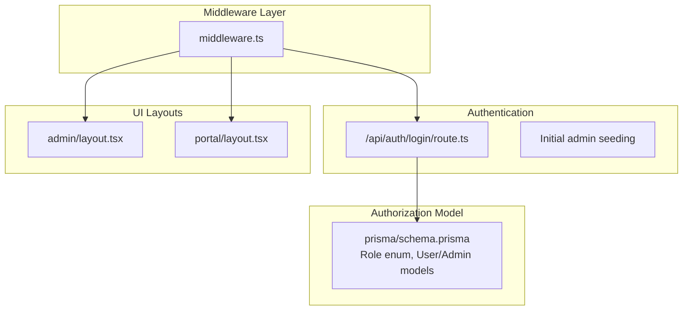
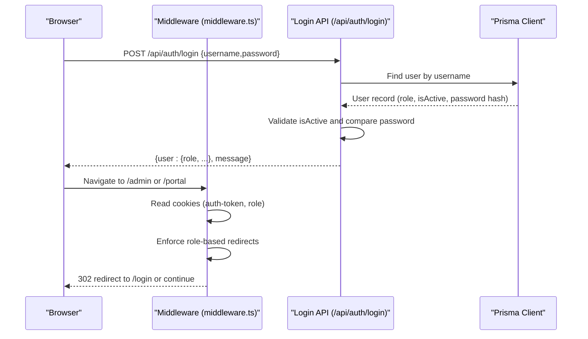
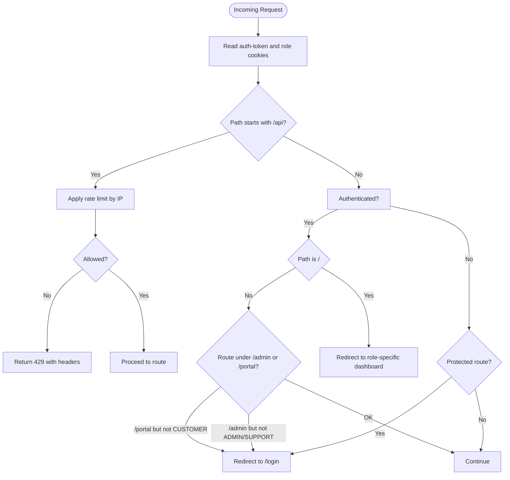
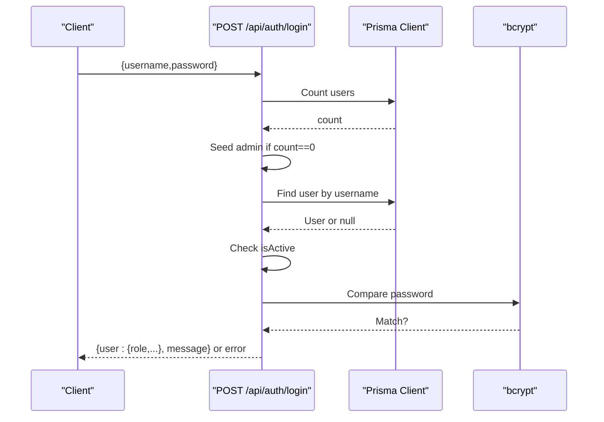
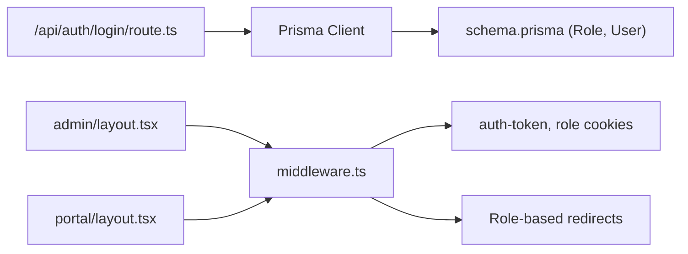

# Role-Based Access Control

<cite>
**Referenced Files in This Document**
- [middleware.ts](file://src/middleware.ts)
- [auth.ts](file://src/lib/auth.ts)
- [schema.prisma](file://prisma/schema.prisma)
- [route.ts](file://src/app/api/auth/login/route.ts)
- [routes.ts](file://src/lib/routes.ts)
- [layout.tsx](file://src/app/admin/layout.tsx)
- [layout.tsx](file://src/app/portal/layout.tsx)
- [page.tsx](file://src/app/portal/profile/page.tsx)
- [route.ts](file://src/app/api/users/route.ts)
- [page.tsx](file://src/app/admin/users/add/page.tsx)
- [page.tsx](file://src/app/admin/users/[id]/edit/page.tsx)
</cite>

## Table of Contents
1. [Introduction](#introduction)
2. [Project Structure](#project-structure)
3. [Core Components](#core-components)
4. [Architecture Overview](#architecture-overview)
5. [Detailed Component Analysis](#detailed-component-analysis)
6. [Dependency Analysis](#dependency-analysis)
7. [Performance Considerations](#performance-considerations)
8. [Troubleshooting Guide](#troubleshooting-guide)
9. [Conclusion](#conclusion)

## Introduction
This document describes the role-based access control (RBAC) system used by the application. It defines the three user roles (ADMIN, SUPPORT, CUSTOMER), outlines how authentication and authorization are enforced via middleware and API routes, and explains how different roles access distinct parts of the application. It also covers role assignment, permission inheritance, and practical troubleshooting steps.

## Project Structure
The RBAC system spans middleware, authentication APIs, Prisma models, and UI layouts:
- Middleware enforces route protection and redirects based on role cookies.
- Authentication APIs handle login and initial seeding of administrative users.
- Prisma schema defines the Role enum and user model with role attributes.
- UI layouts wrap admin and portal areas, while pages implement role-aware navigation and profile access.

**Diagram sources**
- [middleware.ts:1-101](file://src/middleware.ts#L1-L101)
- [route.ts:1-86](file://src/app/api/auth/login/route.ts#L1-L86)
- [schema.prisma:88-92](file://prisma/schema.prisma#L88-L92)
- [layout.tsx:1-10](file://src/app/admin/layout.tsx#L1-L10)
- [layout.tsx:1-10](file://src/app/portal/layout.tsx#L1-L10)

**Section sources**
- [middleware.ts:1-101](file://src/middleware.ts#L1-L101)
- [route.ts:1-86](file://src/app/api/auth/login/route.ts#L1-L86)
- [schema.prisma:88-92](file://prisma/schema.prisma#L88-L92)
- [layout.tsx:1-10](file://src/app/admin/layout.tsx#L1-L10)
- [layout.tsx:1-10](file://src/app/portal/layout.tsx#L1-L10)

## Core Components
- Roles: ADMIN, SUPPORT, CUSTOMER are defined as an enum in the Prisma schema and used throughout the system.
- Authentication cookie: The middleware reads role and auth-token cookies to determine access.
- Middleware enforcement: Redirects unauthenticated users to login, enforces role-based access to /admin and /portal routes, and applies rate limiting to API endpoints.
- Login API: Validates credentials, seeds an admin user if none exist, checks user activity, compares passwords, and returns user data with role.
- UI layouts: Admin and portal layouts wrap their respective route trees, ensuring consistent shell behavior.

Key implementation references:
- Role enum and models: [schema.prisma:88-92](file://prisma/schema.prisma#L88-L92), [schema.prisma:724-743](file://prisma/schema.prisma#L724-L743)
- Middleware role checks and redirects: [middleware.ts:31-80](file://src/middleware.ts#L31-L80)
- Rate limiting for API: [middleware.ts:40-54](file://src/middleware.ts#L40-L54)
- Login flow and seeding: [route.ts:22-35](file://src/app/api/auth/login/route.ts#L22-L35), [route.ts:37-62](file://src/app/api/auth/login/route.ts#L37-L62)
- Admin session helpers (legacy admin panel): [auth.ts:1-35](file://src/lib/auth.ts#L1-L35)

**Section sources**
- [schema.prisma:88-92](file://prisma/schema.prisma#L88-L92)
- [schema.prisma:724-743](file://prisma/schema.prisma#L724-L743)
- [middleware.ts:31-80](file://src/middleware.ts#L31-L80)
- [middleware.ts:40-54](file://src/middleware.ts#L40-L54)
- [route.ts:22-35](file://src/app/api/auth/login/route.ts#L22-L35)
- [route.ts:37-62](file://src/app/api/auth/login/route.ts#L37-L62)
- [auth.ts:1-35](file://src/lib/auth.ts#L1-L35)

## Architecture Overview
The RBAC architecture combines client-side cookie-based identity with server-side middleware enforcement and database-backed user records.

**Diagram sources**
- [middleware.ts:31-80](file://src/middleware.ts#L31-L80)
- [route.ts:37-62](file://src/app/api/auth/login/route.ts#L37-L62)

## Detailed Component Analysis

### Roles and Permissions
- Role enum: ADMIN, SUPPORT, CUSTOMER are defined in the schema.
- Effective admin privileges: The middleware treats ADMIN and SUPPORT equivalently for admin-panel access.
- Customer access: CUSTOMER role is restricted to the portal area.

References:
- Role enum definition: [schema.prisma:88-92](file://prisma/schema.prisma#L88-L92)
- Admin/SUPPORT equivalence: [middleware.ts:35-37](file://src/middleware.ts#L35-L37)
- Customer-only access: [middleware.ts:36-37](file://src/middleware.ts#L36-L37)

**Section sources**
- [schema.prisma:88-92](file://prisma/schema.prisma#L88-L92)
- [middleware.ts:35-37](file://src/middleware.ts#L35-L37)

### Middleware Implementation
The middleware performs:
- IP-based rate limiting for API endpoints.
- Authentication check via auth-token cookie.
- Role-based redirection for protected routes.
- Root-to-dashboard redirection based on role.
- Security headers for non-API routes.

**Diagram sources**
- [middleware.ts:9-94](file://src/middleware.ts#L9-L94)

**Section sources**
- [middleware.ts:9-94](file://src/middleware.ts#L9-L94)

### Authentication and Login Flow
The login endpoint validates input, seeds an admin user if none exist, verifies activity and password, and returns user data including role.

**Diagram sources**
- [route.ts:7-86](file://src/app/api/auth/login/route.ts#L7-L86)

**Section sources**
- [route.ts:7-86](file://src/app/api/auth/login/route.ts#L7-L86)

### Role Assignment and Multi-Tenant Routing
- Role assignment: Users are created with a role in the database; the login API returns the role to the client.
- Multi-tenant routing: Middleware uses the role cookie to redirect users to either the admin or portal dashboards upon accessing the root path.
- Protected routes: Requests to /admin require ADMIN or SUPPORT; requests to /portal require CUSTOMER.

References:
- Role enum and user model: [schema.prisma:88-92](file://prisma/schema.prisma#L88-L92), [schema.prisma:724-743](file://prisma/schema.prisma#L724-L743)
- Root-to-dashboard redirection: [middleware.ts:68-71](file://src/middleware.ts#L68-L71)
- Admin/portal access checks: [middleware.ts:74-79](file://src/middleware.ts#L74-L79)

**Section sources**
- [schema.prisma:88-92](file://prisma/schema.prisma#L88-L92)
- [schema.prisma:724-743](file://prisma/schema.prisma#L724-L743)
- [middleware.ts:68-71](file://src/middleware.ts#L68-L71)
- [middleware.ts:74-79](file://src/middleware.ts#L74-L79)

### Permission Inheritance and Scope
- ADMIN and SUPPORT inherit admin-panel access; CUSTOMER is restricted to portal routes.
- The middleware consolidates ADMIN and SUPPORT for access to admin routes.
- No explicit permission flags are present in the schema; access is determined solely by role equality checks.

References:
- Admin/SUPPORT consolidation: [middleware.ts:35-37](file://src/middleware.ts#L35-L37)
- Admin route restriction: [middleware.ts:74-76](file://src/middleware.ts#L74-L76)
- Portal route restriction: [middleware.ts:77-79](file://src/middleware.ts#L77-L79)

**Section sources**
- [middleware.ts:35-37](file://src/middleware.ts#L35-L37)
- [middleware.ts:74-76](file://src/middleware.ts#L74-L76)
- [middleware.ts:77-79](file://src/middleware.ts#L77-L79)

### Protected Routes and Role-Specific Navigation
- Admin routes: Accessible only to ADMIN/SUPPORT; examples include admin dashboard, customers, subscriptions, domains, hosting, proposals, tasks, finance, reports, users, and settings.
- Portal routes: Accessible only to CUSTOMER; examples include portal dashboard, subscriptions, domains, hosting, tickets, profile, and proposals.
- Navigation constants: Centralized route definitions are available for programmatic navigation.

References:
- Admin routes: [routes.ts:4-19](file://src/lib/routes.ts#L4-L19)
- Portal routes: [routes.ts:20-29](file://src/lib/routes.ts#L20-L29)
- Route definitions: [routes.ts:1-43](file://src/lib/routes.ts#L1-L43)

**Section sources**
- [routes.ts:4-19](file://src/lib/routes.ts#L4-L19)
- [routes.ts:20-29](file://src/lib/routes.ts#L20-L29)
- [routes.ts:1-43](file://src/lib/routes.ts#L1-L43)

### Role-Specific UI and Profile Access
- Admin layout: Wraps admin pages to provide admin shell behavior.
- Portal layout: Wraps portal pages to provide portal shell behavior.
- Customer profile: Reads user info from local storage to display profile details.

References:
- Admin layout: [layout.tsx:1-10](file://src/app/admin/layout.tsx#L1-L10)
- Portal layout: [layout.tsx:1-10](file://src/app/portal/layout.tsx#L1-L10)
- Customer profile page: [page.tsx:1-56](file://src/app/portal/profile/page.tsx#L1-L56)

**Section sources**
- [layout.tsx:1-10](file://src/app/admin/layout.tsx#L1-L10)
- [layout.tsx:1-10](file://src/app/portal/layout.tsx#L1-L10)
- [page.tsx:1-56](file://src/app/portal/profile/page.tsx#L1-L56)

### User Management Pages (Admin)
- Add user page: Provides a form to create new users with username, email, password, and activity status.
- Edit user page: Fetches and updates user details, optionally changing the password.

References:
- Add user page: [page.tsx:1-229](file://src/app/admin/users/add/page.tsx#L1-L229)
- Edit user page: [page.tsx:1-310](file://src/app/admin/users/[id]/edit/page.tsx#L1-L310)
- Users API: [route.ts:1-93](file://src/app/api/users/route.ts#L1-L93)

**Section sources**
- [page.tsx:1-229](file://src/app/admin/users/add/page.tsx#L1-L229)
- [page.tsx:1-310](file://src/app/admin/users/[id]/edit/page.tsx#L1-L310)
- [route.ts:1-93](file://src/app/api/users/route.ts#L1-L93)

## Dependency Analysis
The RBAC system depends on:
- Middleware for enforcing authentication and role-based access.
- Authentication API for validating credentials and returning role.
- Prisma schema for role definitions and user records.
- UI layouts to encapsulate admin and portal contexts.

**Diagram sources**
- [middleware.ts:31-80](file://src/middleware.ts#L31-L80)
- [route.ts:37-62](file://src/app/api/auth/login/route.ts#L37-L62)
- [schema.prisma:88-92](file://prisma/schema.prisma#L88-L92)
- [layout.tsx:1-10](file://src/app/admin/layout.tsx#L1-L10)
- [layout.tsx:1-10](file://src/app/portal/layout.tsx#L1-L10)

**Section sources**
- [middleware.ts:31-80](file://src/middleware.ts#L31-L80)
- [route.ts:37-62](file://src/app/api/auth/login/route.ts#L37-L62)
- [schema.prisma:88-92](file://prisma/schema.prisma#L88-L92)
- [layout.tsx:1-10](file://src/app/admin/layout.tsx#L1-L10)
- [layout.tsx:1-10](file://src/app/portal/layout.tsx#L1-L10)

## Performance Considerations
- Middleware rate limiting: Applies per-IP rate limiting for API endpoints to mitigate abuse.
- Security headers: Adds standard headers for non-API routes to improve defense-in-depth.
- Recommendation: Consider moving rate limiting to a shared service or external cache for distributed deployments.

[No sources needed since this section provides general guidance]

## Troubleshooting Guide
Common issues and resolutions:
- Unauthorized access to /admin or /portal:
  - Cause: Missing or incorrect role cookie.
  - Resolution: Ensure login succeeds and returns a role; verify middleware redirects to /login when unauthorized.
  - References: [middleware.ts:74-79](file://src/middleware.ts#L74-L79), [middleware.ts:62-64](file://src/middleware.ts#L62-L64)

- Redirect loops to /login:
  - Cause: No auth-token cookie or mismatched role.
  - Resolution: Confirm login response sets cookies and that role matches intended access level.
  - References: [middleware.ts:31-37](file://src/middleware.ts#L31-L37), [route.ts:64-78](file://src/app/api/auth/login/route.ts#L64-L78)

- API rate limit exceeded:
  - Cause: Exceeded request quota per minute.
  - Resolution: Wait for the reset window or adjust client-side retry logic.
  - References: [middleware.ts:40-54](file://src/middleware.ts#L40-L54), [middleware.ts:44-51](file://src/middleware.ts#L44-L51)

- Root path behavior:
  - Cause: Role cookie not set or unknown.
  - Resolution: After login, verify role cookie is present; middleware will redirect to role-appropriate dashboard.
  - References: [middleware.ts:68-71](file://src/middleware.ts#L68-L71)

- Admin panel session helpers:
  - Note: Legacy admin session helpers exist for admin panel; current system relies on auth-token and role cookies.
  - References: [auth.ts:1-35](file://src/lib/auth.ts#L1-L35)

**Section sources**
- [middleware.ts:31-37](file://src/middleware.ts#L31-L37)
- [middleware.ts:40-54](file://src/middleware.ts#L40-L54)
- [middleware.ts:44-51](file://src/middleware.ts#L44-L51)
- [middleware.ts:62-64](file://src/middleware.ts#L62-L64)
- [middleware.ts:68-71](file://src/middleware.ts#L68-L71)
- [middleware.ts:74-79](file://src/middleware.ts#L74-L79)
- [route.ts:64-78](file://src/app/api/auth/login/route.ts#L64-L78)
- [auth.ts:1-35](file://src/lib/auth.ts#L1-L35)

## Conclusion
The application implements a straightforward RBAC system centered on role cookies and middleware enforcement. ADMIN and SUPPORT share admin-panel access, while CUSTOMER is restricted to portal routes. Authentication is handled by a dedicated login API that seeds an initial admin user and returns role information. The system’s simplicity facilitates maintainability but should be extended with explicit permission flags and centralized policy enforcement for complex scenarios.