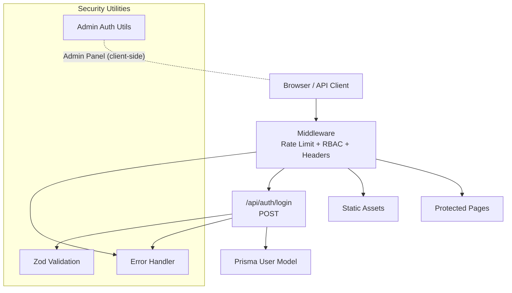
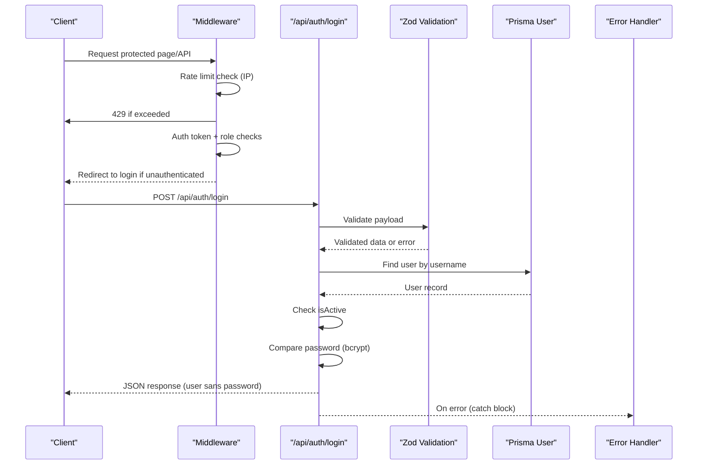
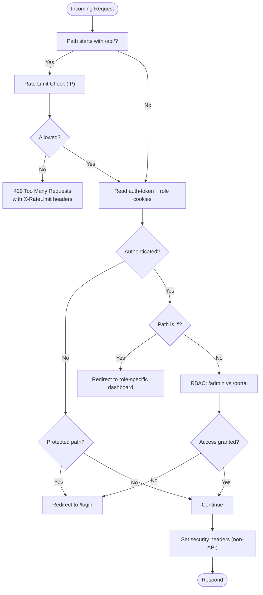
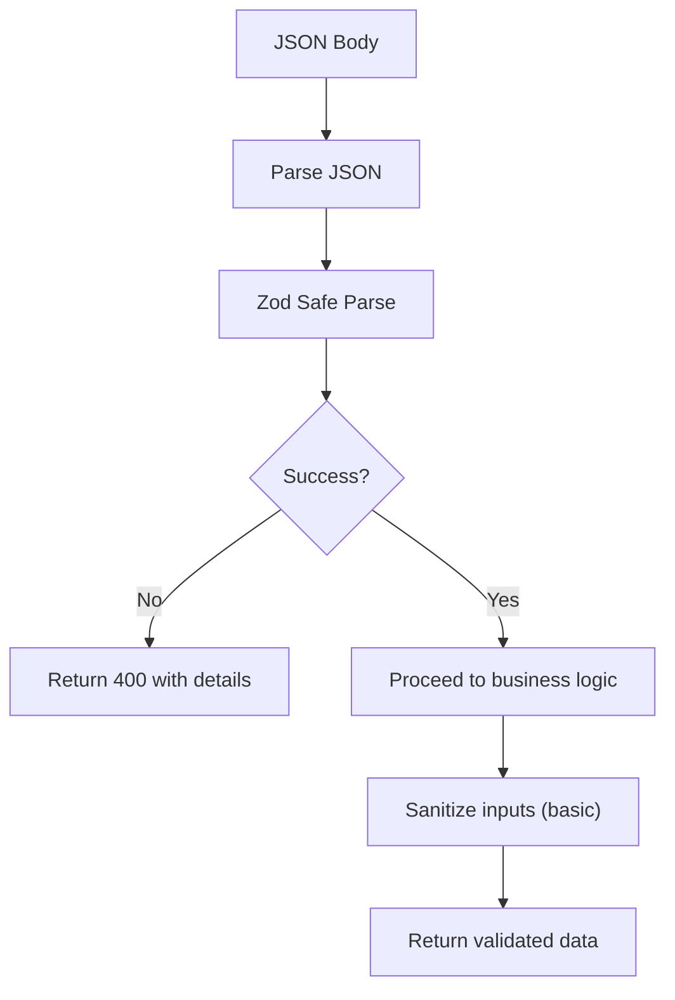
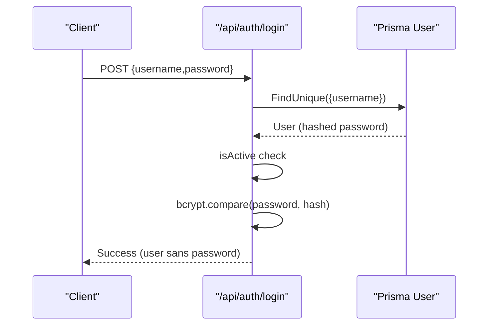
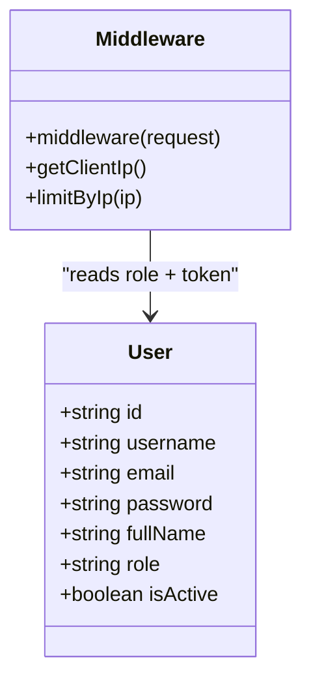
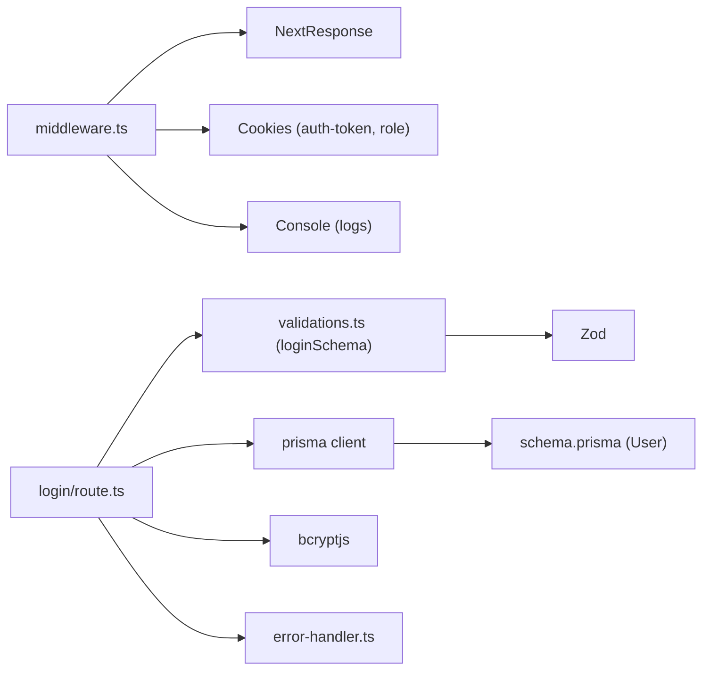

# Security Measures

<cite>
**Referenced Files in This Document**
- [middleware.ts](file://src/middleware.ts)
- [login/route.ts](file://src/app/api/auth/login/route.ts)
- [validations.ts](file://src/lib/validations.ts)
- [error-handler.ts](file://src/lib/error-handler.ts)
- [auth.ts](file://src/lib/auth.ts)
- [schema.prisma](file://prisma/schema.prisma)
</cite>

## Table of Contents
1. [Introduction](#introduction)
2. [Project Structure](#project-structure)
3. [Core Components](#core-components)
4. [Architecture Overview](#architecture-overview)
5. [Detailed Component Analysis](#detailed-component-analysis)
6. [Dependency Analysis](#dependency-analysis)
7. [Performance Considerations](#performance-considerations)
8. [Troubleshooting Guide](#troubleshooting-guide)
9. [Conclusion](#conclusion)
10. [Appendices](#appendices)

## Introduction
This document details the security measures implemented in the authentication and authorization system. It covers rate limiting, brute force protection, CSRF prevention, XSS mitigation, middleware security checks, request validation, access logging, secure credential storage, password handling, and session security. It also outlines best practices, vulnerability assessment considerations, and incident response procedures grounded in the repository’s current implementation.

## Project Structure
Security-critical logic is centralized in the Next.js middleware and the authentication API route, with shared validation and error-handling utilities. The Prisma schema defines the user model and roles used for authorization.

**Diagram sources**
- [middleware.ts:1-101](file://src/middleware.ts#L1-L101)
- [login/route.ts:1-86](file://src/app/api/auth/login/route.ts#L1-L86)
- [validations.ts:87-91](file://src/lib/validations.ts#L87-L91)
- [error-handler.ts:1-33](file://src/lib/error-handler.ts#L1-L33)
- [auth.ts:1-35](file://src/lib/auth.ts#L1-L35)
- [schema.prisma:724-743](file://prisma/schema.prisma#L724-L743)

**Section sources**
- [middleware.ts:1-101](file://src/middleware.ts#L1-L101)
- [login/route.ts:1-86](file://src/app/api/auth/login/route.ts#L1-L86)
- [validations.ts:87-91](file://src/lib/validations.ts#L87-L91)
- [error-handler.ts:1-33](file://src/lib/error-handler.ts#L1-L33)
- [auth.ts:1-35](file://src/lib/auth.ts#L1-L35)
- [schema.prisma:724-743](file://prisma/schema.prisma#L724-L743)

## Core Components
- Middleware: Implements IP-based rate limiting, role-based access control (RBAC), and security headers for non-API routes. It redirects unauthenticated users away from protected areas and enforces role gates for admin and portal paths.
- Authentication API: Validates login payloads, queries the user database, checks activation status, compares passwords using bcrypt, and returns user data without sensitive fields.
- Validation Layer: Uses Zod schemas to enforce strict input validation for login and other forms.
- Error Handling: Centralized handler for API errors, including Zod validation errors and generic exceptions.
- Admin Auth Utilities: Client-side admin session helpers for the admin panel (sessionStorage-based).
- Prisma User Model: Defines the user entity and roles used for authorization.

**Section sources**
- [middleware.ts:1-101](file://src/middleware.ts#L1-L101)
- [login/route.ts:1-86](file://src/app/api/auth/login/route.ts#L1-L86)
- [validations.ts:87-91](file://src/lib/validations.ts#L87-L91)
- [error-handler.ts:1-33](file://src/lib/error-handler.ts#L1-L33)
- [auth.ts:1-35](file://src/lib/auth.ts#L1-L35)
- [schema.prisma:724-743](file://prisma/schema.prisma#L724-L743)

## Architecture Overview
The authentication flow integrates middleware-based enforcement with a backend login endpoint. Validation ensures safe inputs, while error handling prevents information leakage. RBAC uses cookie-stored role and token to gate protected routes.

**Diagram sources**
- [middleware.ts:1-101](file://src/middleware.ts#L1-L101)
- [login/route.ts:1-86](file://src/app/api/auth/login/route.ts#L1-L86)
- [validations.ts:87-91](file://src/lib/validations.ts#L87-L91)
- [error-handler.ts:1-33](file://src/lib/error-handler.ts#L1-L33)

## Detailed Component Analysis

### Middleware Security Checks
- IP-based rate limiting:
  - Tracks timestamps per IP within a sliding window.
  - Returns 429 with X-RateLimit headers when threshold is exceeded.
- Authentication and redirection:
  - Reads auth token and role cookies.
  - Redirects unauthenticated users attempting to access non-API protected pages.
  - Redirects authenticated users from root to role-specific dashboards.
- Role-based access control:
  - Blocks access to admin routes for non-admin roles.
  - Blocks access to portal routes for non-customer roles.
- Security headers:
  - Sets X-Content-Type-Options, X-Frame-Options, X-XSS-Protection, and Referrer-Policy for non-API responses.
  - Adds X-RateLimit headers for API responses.

**Diagram sources**
- [middleware.ts:1-101](file://src/middleware.ts#L1-L101)

**Section sources**
- [middleware.ts:1-101](file://src/middleware.ts#L1-L101)

### Request Validation and Sanitization
- Zod schemas enforce strict input validation for login requests.
- Centralized error handler converts Zod errors to structured 400 responses and logs them.
- Basic sanitization helper removes angle brackets from input strings.

**Diagram sources**
- [login/route.ts:7-18](file://src/app/api/auth/login/route.ts#L7-L18)
- [validations.ts:87-91](file://src/lib/validations.ts#L87-L91)
- [error-handler.ts:1-25](file://src/lib/error-handler.ts#L1-L25)

**Section sources**
- [login/route.ts:7-18](file://src/app/api/auth/login/route.ts#L7-L18)
- [validations.ts:87-91](file://src/lib/validations.ts#L87-L91)
- [error-handler.ts:1-25](file://src/lib/error-handler.ts#L1-L25)

### Password Handling and Secure Credential Storage
- Password verification uses bcrypt comparison against stored hash.
- On first-run initialization, a default admin user is created with a bcrypt-hashed password.
- User records are retrieved by unique username to prevent enumeration via ID.

**Diagram sources**
- [login/route.ts:22-62](file://src/app/api/auth/login/route.ts#L22-L62)
- [schema.prisma:724-743](file://prisma/schema.prisma#L724-L743)

**Section sources**
- [login/route.ts:22-62](file://src/app/api/auth/login/route.ts#L22-L62)
- [schema.prisma:724-743](file://prisma/schema.prisma#L724-L743)

### Session Security
- Admin panel uses client-side sessionStorage to mark admin authentication state.
- The middleware relies on server-managed auth-token and role cookies for API and page-level protection.
- Recommendations:
  - Replace client-side admin session with server-managed sessions and secure, HttpOnly cookies.
  - Add SameSite and Secure flags to session cookies.
  - Implement CSRF protection for state-changing operations.

**Section sources**
- [auth.ts:18-35](file://src/lib/auth.ts#L18-L35)
- [middleware.ts:31-37](file://src/middleware.ts#L31-L37)

### Authorization Model and RBAC
- Roles are stored in cookies and enforced by middleware:
  - ADMIN/SUPPORT can access admin routes.
  - CUSTOMER can access portal routes.
- Users are associated with roles via the Prisma schema.

**Diagram sources**
- [schema.prisma:724-743](file://prisma/schema.prisma#L724-L743)
- [middleware.ts:1-101](file://src/middleware.ts#L1-L101)

**Section sources**
- [schema.prisma:724-743](file://prisma/schema.prisma#L724-L743)
- [middleware.ts:31-80](file://src/middleware.ts#L31-L80)

### Access Logging and Observability
- The middleware sets X-RateLimit headers for API responses, enabling clients and proxies to observe limits.
- Consider adding structured access logs (timestamp, method, path, IP, user-agent, status, latency) for auditability and anomaly detection.

**Section sources**
- [middleware.ts:44-51](file://src/middleware.ts#L44-L51)
- [middleware.ts:88-91](file://src/middleware.ts#L88-L91)

### CSRF Prevention
- Current implementation does not include CSRF tokens for state-changing requests.
- Recommendations:
  - Implement CSRF tokens for all non-idempotent methods.
  - Enforce SameSite=Lax|Strict on cookies.
  - Validate Origin/Header for cross-origin requests.

[No sources needed since this section provides general guidance]

### XSS Mitigation Strategies
- Middleware sets X-XSS-Protection and X-Content-Type-Options for non-API responses.
- Client-side sanitization helper removes angle brackets from inputs.
- Recommendations:
  - Use Content-Security-Policy headers.
  - Escape HTML on the server and avoid innerHTML in client code.
  - Sanitize and validate all user-generated content.

**Section sources**
- [middleware.ts:84-87](file://src/middleware.ts#L84-L87)
- [error-handler.ts:27-29](file://src/lib/error-handler.ts#L27-L29)

### Brute Force Protection
- IP-based sliding-window rate limiting reduces automated attack throughput.
- Recommendations:
  - Combine with account lockout after failed attempts.
  - Implement exponential backoff and CAPTCHA for repeated failures.
  - Monitor and alert on unusual spikes.

**Section sources**
- [middleware.ts:4-29](file://src/middleware.ts#L4-L29)

### Security Middleware Implementation Examples
- Rate limiting:
  - Sliding window per IP with 429 responses and Retry-After headers.
- RBAC:
  - Cookie-based role checks with redirects for unauthorized access.
- Security headers:
  - Non-API responses include X-Content-Type-Options, X-Frame-Options, X-XSS-Protection, Referrer-Policy.

**Section sources**
- [middleware.ts:1-101](file://src/middleware.ts#L1-L101)

### Threat Detection and Incident Response Procedures
- Monitoring:
  - Track 429 responses and blocked IPs.
  - Alert on sustained 401/403 spikes indicating brute force attempts.
- Response:
  - Temporarily block offending IPs.
  - Rotate secrets and invalidate sessions.
  - Review logs and update thresholds.

[No sources needed since this section provides general guidance]

## Dependency Analysis

**Diagram sources**
- [middleware.ts:1-101](file://src/middleware.ts#L1-L101)
- [login/route.ts:1-86](file://src/app/api/auth/login/route.ts#L1-L86)
- [validations.ts:87-91](file://src/lib/validations.ts#L87-L91)
- [error-handler.ts:1-33](file://src/lib/error-handler.ts#L1-L33)
- [schema.prisma:724-743](file://prisma/schema.prisma#L724-L743)

**Section sources**
- [middleware.ts:1-101](file://src/middleware.ts#L1-L101)
- [login/route.ts:1-86](file://src/app/api/auth/login/route.ts#L1-L86)
- [validations.ts:87-91](file://src/lib/validations.ts#L87-L91)
- [error-handler.ts:1-33](file://src/lib/error-handler.ts#L1-L33)
- [schema.prisma:724-743](file://prisma/schema.prisma#L724-L743)

## Performance Considerations
- Rate limiter uses an in-memory Map; consider Redis-backed storage for multi-instance deployments.
- Sliding window maintains arrays per IP; cap arrays or use leaky bucket for memory efficiency.
- bcrypt hashing cost can be tuned for deployment needs.

[No sources needed since this section provides general guidance]

## Troubleshooting Guide
- Validation errors:
  - Zod errors are returned with 400 and details array.
- Generic errors:
  - Catch-all returns 500 with logged error.
- Input sanitization:
  - Basic removal of angle brackets; ensure broader sanitization for HTML contexts.

**Section sources**
- [error-handler.ts:1-25](file://src/lib/error-handler.ts#L1-L25)
- [error-handler.ts:27-29](file://src/lib/error-handler.ts#L27-L29)

## Conclusion
The system implements essential security controls: middleware-based rate limiting, RBAC via cookies, robust input validation, and bcrypt-based password verification. To strengthen security posture, integrate CSRF protection, enhance session security, adopt CSP, implement stricter access logging, and harden brute force defenses with account lockout and monitoring.

[No sources needed since this section summarizes without analyzing specific files]

## Appendices

### Best Practices Checklist
- Enforce CSRF tokens for state-changing requests.
- Use secure, HttpOnly, SameSite cookies for sessions.
- Add Content-Security-Policy and HSTS.
- Implement structured audit logs and alerts.
- Regularly review and update hashing and rate-limit thresholds.

[No sources needed since this section provides general guidance]