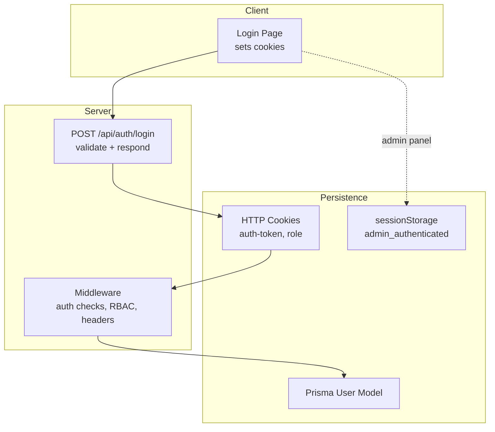
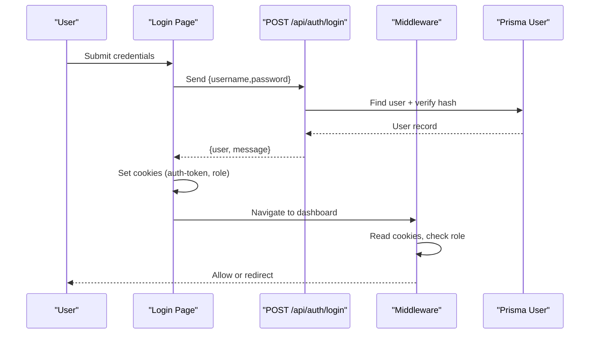
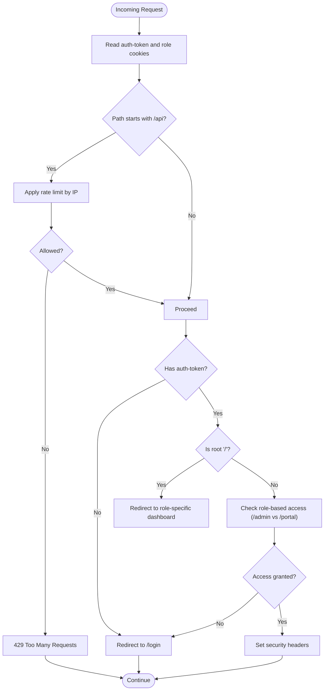
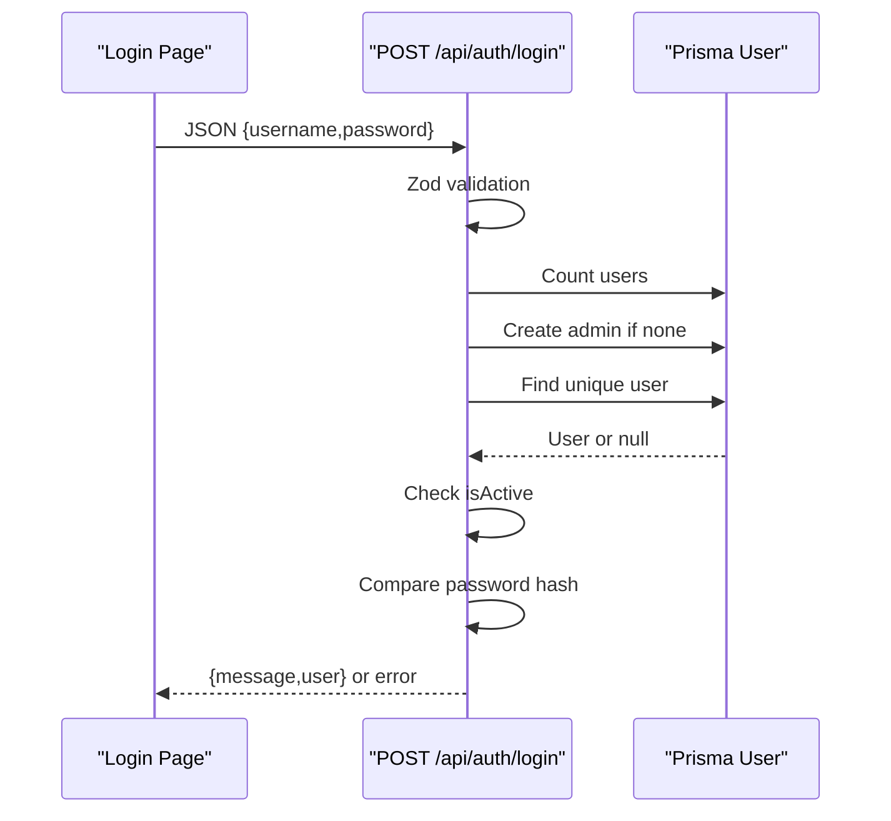
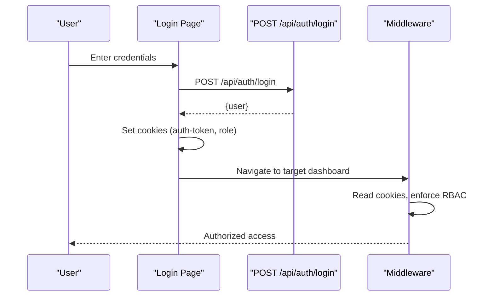
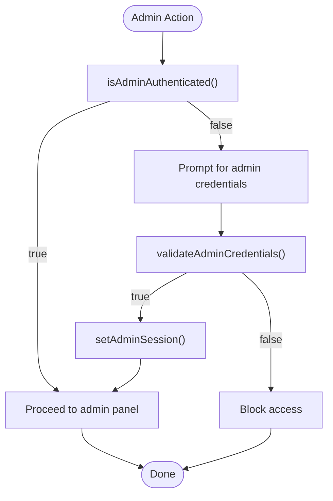
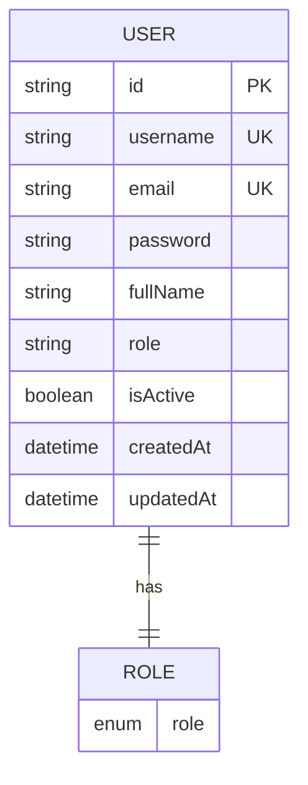
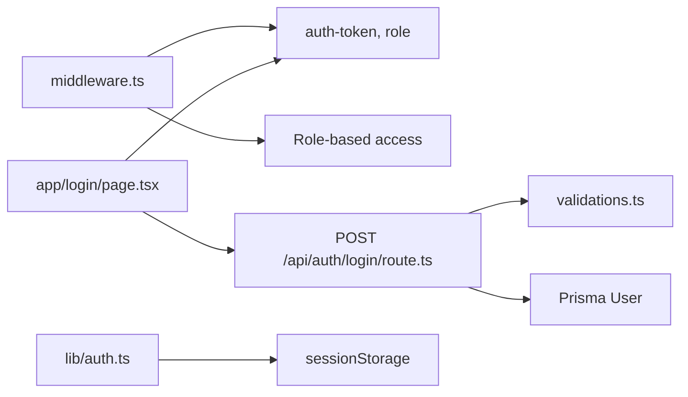

# Session Management

<cite>
**Referenced Files in This Document**
- [middleware.ts](file://src/middleware.ts)
- [auth.ts](file://src/lib/auth.ts)
- [route.ts](file://src/app/api/auth/login/route.ts)
- [page.tsx](file://src/app/login/page.tsx)
- [schema.prisma](file://prisma/schema.prisma)
- [package.json](file://package.json)
- [validations.ts](file://src/lib/validations.ts)
</cite>

## Table of Contents
1. [Introduction](#introduction)
2. [Project Structure](#project-structure)
3. [Core Components](#core-components)
4. [Architecture Overview](#architecture-overview)
5. [Detailed Component Analysis](#detailed-component-analysis)
6. [Dependency Analysis](#dependency-analysis)
7. [Performance Considerations](#performance-considerations)
8. [Troubleshooting Guide](#troubleshooting-guide)
9. [Conclusion](#conclusion)

## Introduction
This document explains session management across the application, focusing on:
- Dual authentication system: a cookie-based session for NextAuth.js users and a separate admin panel session
- Session creation, maintenance, and termination
- Persistence and timeout handling
- Session data structure and validation
- Security measures and troubleshooting

The system uses:
- Cookie-based authentication for customer/admin users via a login endpoint that sets auth cookies
- A separate admin panel session managed by a lightweight utility using browser sessionStorage

## Project Structure
Key areas involved in session management:
- Middleware enforces authentication and role-based access control and sets security headers
- Login API endpoint validates credentials and returns user info
- Frontend login page sets cookies upon successful authentication
- Admin panel utilities manage an admin-specific session in sessionStorage
- Prisma schema defines the user model and roles

**Diagram sources**
- [middleware.ts:31-80](file://src/middleware.ts#L31-L80)
- [route.ts:7-78](file://src/app/api/auth/login/route.ts#L7-L78)
- [page.tsx:38-62](file://src/app/login/page.tsx#L38-L62)
- [auth.ts:18-35](file://src/lib/auth.ts#L18-L35)
- [schema.prisma:724-743](file://prisma/schema.prisma#L724-L743)

**Section sources**
- [middleware.ts:1-101](file://src/middleware.ts#L1-L101)
- [route.ts:1-86](file://src/app/api/auth/login/route.ts#L1-L86)
- [page.tsx:38-62](file://src/app/login/page.tsx#L38-L62)
- [auth.ts:1-35](file://src/lib/auth.ts#L1-L35)
- [schema.prisma:724-743](file://prisma/schema.prisma#L724-L743)

## Core Components
- Middleware authentication and RBAC
  - Reads auth-token and role cookies
  - Redirects unauthenticated users away from protected routes
  - Enforces role-based access to /admin and /portal
  - Sets security headers for non-API routes
- Login API
  - Validates input using Zod schemas
  - Hashes initial admin password if no users exist
  - Verifies user existence, activity, and password
  - Returns user payload without sensitive fields
- Frontend login
  - Sends credentials to the login API
  - On success, sets auth-token and role cookies and redirects
- Admin panel session utilities
  - Validates admin credentials
  - Sets/clears admin_authenticated flag in sessionStorage
  - Checks admin authentication state

**Section sources**
- [middleware.ts:31-80](file://src/middleware.ts#L31-L80)
- [route.ts:12-62](file://src/app/api/auth/login/route.ts#L12-L62)
- [page.tsx:38-62](file://src/app/login/page.tsx#L38-L62)
- [auth.ts:13-35](file://src/lib/auth.ts#L13-L35)
- [validations.ts:87-90](file://src/lib/validations.ts#L87-L90)

## Architecture Overview
The dual-session architecture separates concerns:
- Customer/Admin users: cookie-based session via login endpoint
- Admin panel: browser sessionStorage-based session

**Diagram sources**
- [page.tsx:38-62](file://src/app/login/page.tsx#L38-L62)
- [route.ts:7-78](file://src/app/api/auth/login/route.ts#L7-L78)
- [middleware.ts:31-80](file://src/middleware.ts#L31-L80)

## Detailed Component Analysis

### Middleware Authentication and RBAC
Responsibilities:
- Extract IP for rate limiting
- Rate-limit API traffic
- Authenticate requests by checking presence of auth-token cookie
- Determine role from role cookie
- Redirect unauthenticated users to /login
- Redirect authenticated users away from /login
- Enforce role-based access to /admin and /portal
- Apply security headers for non-API routes

**Diagram sources**
- [middleware.ts:9-94](file://src/middleware.ts#L9-L94)

**Section sources**
- [middleware.ts:31-80](file://src/middleware.ts#L31-L80)

### Login API Endpoint
Responsibilities:
- Validate input payload using Zod
- Seed admin user if none exist
- Fetch user by username
- Check user activity
- Compare password hashes
- Return sanitized user object

**Diagram sources**
- [route.ts:7-78](file://src/app/api/auth/login/route.ts#L7-L78)
- [validations.ts:87-90](file://src/lib/validations.ts#L87-L90)

**Section sources**
- [route.ts:12-62](file://src/app/api/auth/login/route.ts#L12-L62)
- [validations.ts:87-90](file://src/lib/validations.ts#L87-L90)

### Frontend Login Flow and Cookie Handling
Responsibilities:
- Submit credentials to login API
- On success, set auth-token and role cookies with 24-hour max-age
- Redirect to role-specific dashboard

**Diagram sources**
- [page.tsx:38-62](file://src/app/login/page.tsx#L38-L62)
- [route.ts:75-78](file://src/app/api/auth/login/route.ts#L75-L78)
- [middleware.ts:31-80](file://src/middleware.ts#L31-L80)

**Section sources**
- [page.tsx:38-62](file://src/app/login/page.tsx#L38-L62)

### Admin Panel Session Utilities
Responsibilities:
- Validate admin credentials against stored values
- Manage admin_authenticated flag in sessionStorage
- Provide a simple check for admin authentication state

**Diagram sources**
- [auth.ts:18-35](file://src/lib/auth.ts#L18-L35)

**Section sources**
- [auth.ts:13-35](file://src/lib/auth.ts#L13-L35)

### Session Data Structures and Validation
- Cookie-based session fields
  - auth-token: user identifier used by middleware for authentication
  - role: user role (ADMIN, SUPPORT, CUSTOMER)
- Admin panel session field
  - admin_authenticated: boolean flag indicating admin login state
- User model and roles
  - User model includes username, email, password, fullName, role, isActive
  - Roles include ADMIN, SUPPORT, CUSTOMER

**Diagram sources**
- [schema.prisma:724-743](file://prisma/schema.prisma#L724-L743)

**Section sources**
- [schema.prisma:724-743](file://prisma/schema.prisma#L724-L743)

## Dependency Analysis
- Middleware depends on:
  - Cookie extraction for auth-token and role
  - Role constants for RBAC
- Login API depends on:
  - Zod validation schemas
  - Prisma client for user lookup and seeding
  - bcrypt for password comparison
- Frontend login depends on:
  - NextResponse redirect behavior
  - Cookie setting semantics
- Admin utilities depend on:
  - Browser sessionStorage availability

**Diagram sources**
- [middleware.ts:31-80](file://src/middleware.ts#L31-L80)
- [route.ts:1-86](file://src/app/api/auth/login/route.ts#L1-L86)
- [validations.ts:87-90](file://src/lib/validations.ts#L87-L90)
- [page.tsx:38-62](file://src/app/login/page.tsx#L38-L62)
- [auth.ts:18-35](file://src/lib/auth.ts#L18-L35)

**Section sources**
- [middleware.ts:31-80](file://src/middleware.ts#L31-L80)
- [route.ts:1-86](file://src/app/api/auth/login/route.ts#L1-L86)
- [validations.ts:87-90](file://src/lib/validations.ts#L87-L90)
- [page.tsx:38-62](file://src/app/login/page.tsx#L38-L62)
- [auth.ts:18-35](file://src/lib/auth.ts#L18-L35)

## Performance Considerations
- Rate limiting
  - Middleware applies per-IP rate limiting for API routes
  - Maintains sliding window counters in memory
- Cookie-based session
  - Lightweight; minimal server-side state
  - Reduces database queries for authentication
- Admin session
  - Uses sessionStorage; no network overhead
  - Minimal CPU overhead for simple checks

[No sources needed since this section provides general guidance]

## Troubleshooting Guide
Common issues and resolutions:
- Unauthenticated redirects
  - Symptom: Protected pages redirect to /login
  - Cause: Missing or expired auth-token cookie
  - Resolution: Log in again; ensure cookies are accepted and not blocked
  - Section sources
    - [middleware.ts:62-64](file://src/middleware.ts#L62-L64)
- Role-based access errors
  - Symptom: Redirect to /login when accessing /admin or /portal
  - Cause: role cookie mismatch or missing
  - Resolution: Verify role cookie value; log in again
  - Section sources
    - [middleware.ts:74-79](file://src/middleware.ts#L74-L79)
- Login failures
  - Symptom: Invalid credentials or inactive user errors
  - Causes: Incorrect username/password, user not active, validation errors
  - Resolution: Check input validation, ensure user is active, confirm seeded admin credentials
  - Section sources
    - [route.ts:39-52](file://src/app/api/auth/login/route.ts#L39-L52)
    - [route.ts:54-62](file://src/app/api/auth/login/route.ts#L54-L62)
    - [validations.ts:87-90](file://src/lib/validations.ts#L87-L90)
- Admin panel access blocked
  - Symptom: Admin area inaccessible
  - Cause: admin_authenticated flag not set
  - Resolution: Provide correct admin credentials; verify sessionStorage availability
  - Section sources
    - [auth.ts:30-35](file://src/lib/auth.ts#L30-L35)
- Rate limit exceeded
  - Symptom: 429 responses for API calls
  - Cause: Exceeded requests per minute
  - Resolution: Retry after the indicated interval; reduce request frequency
  - Section sources
    - [middleware.ts:43-51](file://src/middleware.ts#L43-L51)

## Conclusion
The application implements a dual session management strategy:
- Customer/Admin users rely on cookie-based sessions validated by middleware and enforced by RBAC
- Admin panel uses a simple sessionStorage-based session for internal navigation
- Security is strengthened by input validation, password hashing, and strict role checks
- Operational robustness is achieved through rate limiting and clear redirect flows