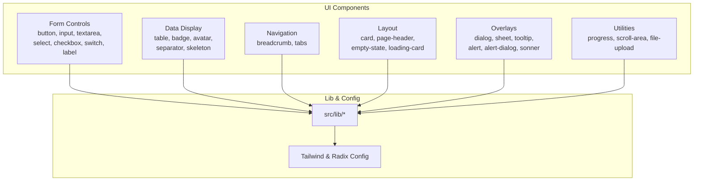
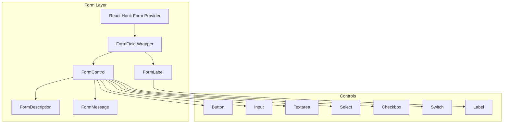
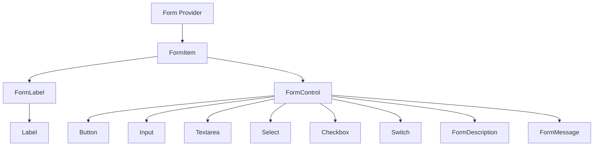

# Component Library

<cite>
**Referenced Files in This Document**
- [button.tsx](file://src/components/ui/button.tsx)
- [input.tsx](file://src/components/ui/input.tsx)
- [textarea.tsx](file://src/components/ui/textarea.tsx)
- [form.tsx](file://src/components/ui/form.tsx)
- [select.tsx](file://src/components/ui/select.tsx)
- [checkbox.tsx](file://src/components/ui/checkbox.tsx)
- [switch.tsx](file://src/components/ui/switch.tsx)
- [badge.tsx](file://src/components/ui/badge.tsx)
- [card.tsx](file://src/components/ui/card.tsx)
- [avatar.tsx](file://src/components/ui/avatar.tsx)
- [separator.tsx](file://src/components/ui/separator.tsx)
- [skeleton.tsx](file://src/components/ui/skeleton.tsx)
- [tabs.tsx](file://src/components/ui/tabs.tsx)
- [table.tsx](file://src/components/ui/table.tsx)
- [dialog.tsx](file://src/components/ui/dialog.tsx)
- [label.tsx](file://src/components/ui/label.tsx)
- [breadcrumb.tsx](file://src/components/ui/breadcrumb.tsx)
- [progress.tsx](file://src/components/ui/progress.tsx)
- [scroll-area.tsx](file://src/components/ui/scroll-area.tsx)
- [sheet.tsx](file://src/components/ui/sheet.tsx)
- [tooltip.tsx](file://src/components/ui/tooltip.tsx)
- [sonner.tsx](file://src/components/ui/sonner.tsx)
- [alert.tsx](file://src/components/ui/alert.tsx)
- [alert-dialog.tsx](file://src/components/ui/alert-dialog.tsx)
- [file-upload.tsx](file://src/components/ui/file-upload.tsx)
- [theme-toggle.tsx](file://src/components/theme-toggle.tsx)
- [app-shell.tsx](file://src/components/app-shell.tsx)
- [layout/header.tsx](file://src/components/layout/header.tsx)
- [layout/footer.tsx](file://src/components/layout/footer.tsx)
- [sidebar.tsx](file://src/components/sidebar.tsx)
- [page-header.tsx](file://src/components/page-header.tsx)
- [empty-state.tsx](file://src/components/empty-state.tsx)
- [loading-card.tsx](file://src/components/loading-card.tsx)
- [status-badge.tsx](file://src/components/status-badge.tsx)
- [customer-form.tsx](file://src/components/customer-form.tsx)
- [customer-list.tsx](file://src/components/customer-list.tsx)
- [domain-form.tsx](file://src/components/domain-form.tsx)
- [domain-list.tsx](file://src/components/domain-list.tsx)
- [hosting-form.tsx](file://src/components/hosting-form.tsx)
- [hosting-list.tsx](file://src/components/hosting-list.tsx)
- [proposal-form.tsx](file://src/components/proposal-form.tsx)
- [proposal-list.tsx](file://src/components/proposal-list.tsx)
- [proposal-type-form.tsx](file://src/components/proposal-type-form.tsx)
- [proposal-type-list.tsx](file://src/components/proposal-type-list.tsx)
- [subscription-form.tsx](file://src/components/subscription-form.tsx)
- [subscription-list.tsx](file://src/components/subscription-list.tsx)
- [task-form.tsx](file://src/components/task-form.tsx)
- [task-list.tsx](file://src/components/task-list.tsx)
- [payment-form.tsx](file://src/components/payment-form.tsx)
- [payment-list.tsx](file://src/components/payment-list.tsx)
- [proposal-detail.tsx](file://src/components/proposal-detail.tsx)
- [proposal-edit-form.tsx](file://src/components/proposal-edit-form.tsx)
- [customer-detail.tsx](file://src/components/customer-detail.tsx)
- [back-button.tsx](file://src/components/back-button.tsx)
- [customer-notes.tsx](file://src/components/customer-notes.tsx)
- [types.ts](file://src/lib/types.ts)
- [utils.ts](file://src/lib/utils.ts)
- [settings.ts](file://src/lib/settings.ts)
- [settings-client.ts](file://src/lib/settings-client.ts)
- [subscription-settings-client.ts](file://src/lib/subscription-settings-client.ts)
- [webhook-config.ts](file://src/lib/webhook-config.ts)
- [routes.ts](file://src/lib/routes.ts)
- [validations.ts](file://src/lib/validations.ts)
- [prisma.ts](file://src/lib/prisma.ts)
- [auth.ts](file://src/lib/auth.ts)
- [error-handler.ts](file://src/lib/error-handler.ts)
- [next.config.ts](file://next.config.ts)
- [postcss.config.mjs](file://postcss.config.mjs)
- [components.json](file://components.json)
- [tailwind.config.ts](file://tailwind.config.ts)
</cite>

## Table of Contents
1. [Introduction](#introduction)
2. [Project Structure](#project-structure)
3. [Core Components](#core-components)
4. [Architecture Overview](#architecture-overview)
5. [Detailed Component Analysis](#detailed-component-analysis)
6. [Dependency Analysis](#dependency-analysis)
7. [Performance Considerations](#performance-considerations)
8. [Troubleshooting Guide](#troubleshooting-guide)
9. [Conclusion](#conclusion)
10. [Appendices](#appendices)

## Introduction
This document describes the Customer WebMahsul UI component library. It focuses on reusable components built with Radix UI primitives and styled with Tailwind CSS. The library includes form controls, data display elements, navigation helpers, and layout scaffolding. Each component’s purpose, props, customization options, styling guidelines, accessibility features, and usage patterns are documented to enable consistent development and integration across the application.

## Project Structure
The UI components live under src/components/ui and are organized by function: form controls, data display, overlays, navigation, and layout. Supporting utilities and hooks are in src/lib. Theming and design tokens are configured via Tailwind and Radix UI.

**Section sources**
- [button.tsx:1-65](file://src/components/ui/button.tsx#L1-L65)
- [input.tsx:1-22](file://src/components/ui/input.tsx#L1-L22)
- [form.tsx:1-168](file://src/components/ui/form.tsx#L1-L168)
- [table.tsx:1-117](file://src/components/ui/table.tsx#L1-L117)
- [dialog.tsx:1-144](file://src/components/ui/dialog.tsx#L1-L144)
- [card.tsx:1-93](file://src/components/ui/card.tsx#L1-L93)
- [tabs.tsx:1-56](file://src/components/ui/tabs.tsx#L1-L56)
- [utils.ts](file://src/lib/utils.ts)
- [components.json](file://components.json)

## Core Components
This section summarizes the primary categories of components and their roles.

- Form Controls: Buttons, inputs, selects, checkboxes, switches, labels, and form wrappers for validation and accessibility.
- Data Display: Tables, badges, avatars, separators, and skeletons for content presentation.
- Navigation: Breadcrumbs and tabs for hierarchical and tabbed navigation.
- Layout: Cards, page headers, empty states, and loading cards for page scaffolding.
- Overlays: Dialogs, sheets, tooltips, alerts, and toast notifications for modal and contextual feedback.
- Utilities: Progress indicators, scroll areas, and file upload helpers.

Key shared patterns:
- Consistent focus states, ring highlights, and invalid-field styling using aria-invalid and focus-visible ring utilities.
- Variants and sizes standardized via class composition utilities.
- Accessibility attributes managed automatically (ARIA describedby, aria-invalid, role attributes).

**Section sources**
- [button.tsx:7-39](file://src/components/ui/button.tsx#L7-L39)
- [input.tsx:5-19](file://src/components/ui/input.tsx#L5-L19)
- [textarea.tsx:5-16](file://src/components/ui/textarea.tsx#L5-L16)
- [form.tsx:19-167](file://src/components/ui/form.tsx#L19-L167)
- [select.tsx:9-88](file://src/components/ui/select.tsx#L9-L88)
- [checkbox.tsx:9-30](file://src/components/ui/checkbox.tsx#L9-L30)
- [switch.tsx:8-26](file://src/components/ui/switch.tsx#L8-L26)
- [badge.tsx:7-27](file://src/components/ui/badge.tsx#L7-L27)
- [card.tsx:5-82](file://src/components/ui/card.tsx#L5-L82)
- [table.tsx:7-105](file://src/components/ui/table.tsx#L7-L105)
- [dialog.tsx:9-81](file://src/components/ui/dialog.tsx#L9-L81)
- [tabs.tsx:8-54](file://src/components/ui/tabs.tsx#L8-L54)
- [label.tsx](file://src/components/ui/label.tsx)
- [breadcrumb.tsx](file://src/components/ui/breadcrumb.tsx)
- [progress.tsx](file://src/components/ui/progress.tsx)
- [scroll-area.tsx](file://src/components/ui/scroll-area.tsx)
- [sheet.tsx](file://src/components/ui/sheet.tsx)
- [tooltip.tsx](file://src/components/ui/tooltip.tsx)
- [sonner.tsx](file://src/components/ui/sonner.tsx)
- [alert.tsx](file://src/components/ui/alert.tsx)
- [alert-dialog.tsx](file://src/components/ui/alert-dialog.tsx)
- [file-upload.tsx](file://src/components/ui/file-upload.tsx)

## Architecture Overview
The component library leverages:
- Radix UI for accessible base primitives and state-driven animations.
- Tailwind CSS for utility-first styling and responsive behavior.
- Class composition utilities for consistent variants and sizes.
- React Hook Form for form orchestration, validation, and accessibility integration.

**Diagram sources**
- [form.tsx:19-167](file://src/components/ui/form.tsx#L19-L167)
- [button.tsx:41-62](file://src/components/ui/button.tsx#L41-L62)
- [input.tsx:5-19](file://src/components/ui/input.tsx#L5-L19)
- [textarea.tsx:5-16](file://src/components/ui/textarea.tsx#L5-L16)
- [select.tsx:9-88](file://src/components/ui/select.tsx#L9-L88)
- [checkbox.tsx:9-30](file://src/components/ui/checkbox.tsx#L9-L30)
- [switch.tsx:8-26](file://src/components/ui/switch.tsx#L8-L26)
- [label.tsx](file://src/components/ui/label.tsx)

## Detailed Component Analysis

### Button
Purpose: Primary action affordance with consistent focus, hover, and disabled states.
Props:
- variant: default, destructive, outline, secondary, ghost, link
- size: default, xs, sm, lg, icon, icon-xs, icon-sm, icon-lg
- asChild: render as Radix Slot
- rest props passed to button/div
Styling: Uses class variance authority for variants and sizes; focus-visible ring and aria-invalid integration.
Accessibility: Inherits native button semantics; supports asChild for semantic composition.

Usage pattern:
- Compose with icons; use destructive for negative actions; use link for secondary actions.

**Section sources**
- [button.tsx:7-39](file://src/components/ui/button.tsx#L7-L39)
- [button.tsx:41-62](file://src/components/ui/button.tsx#L41-L62)

### Input
Purpose: Single-line text input with focus and invalid states.
Props: type, className, and standard input attributes.
Styling: Focus ring, placeholder color, disabled state, and aria-invalid integration.
Accessibility: Proper focus management and ARIA attributes handled by parent form components.

Usage pattern:
- Combine with FormLabel and FormMessage for accessible forms.

**Section sources**
- [input.tsx:5-19](file://src/components/ui/input.tsx#L5-L19)

### Textarea
Purpose: Multi-line text input with consistent focus and invalid states.
Props: className and standard textarea attributes.
Styling: Focus ring, placeholder color, disabled state, and aria-invalid integration.

Usage pattern:
- Use within FormItem for controlled validation and labeling.

**Section sources**
- [textarea.tsx:5-16](file://src/components/ui/textarea.tsx#L5-L16)

### Form System (Form, FormField, FormLabel, FormControl, FormDescription, FormMessage)
Purpose: Accessible form orchestration with React Hook Form integration.
Key behaviors:
- useFormField derives ids and aria attributes for label, description, and error message.
- FormControl sets aria-describedby and aria-invalid based on field state.
- FormLabel applies error-specific styling.
- FormMessage renders validation messages.
Accessibility:
- Automatic aria-labelledby/aria-describedby wiring.
- Error state propagation via form state.

Usage pattern:
- Wrap fields in FormItem; pair FormLabel with FormControl; optionally add FormDescription/FormMessage.

**Section sources**
- [form.tsx:19-167](file://src/components/ui/form.tsx#L19-L167)

### Select
Purpose: Accessible single/multi-selection control with keyboard navigation and popper positioning.
Props:
- Root: standard Radix Select props
- Trigger: size (sm/default)
- Content: position (popper), align
- Item: standard item props
- Scroll buttons: up/down
Styling: Focus-visible ring, invalid state, and size variants; viewport sizing adapts to trigger.
Accessibility: Keyboard navigation, ARIA expanded state, and role attributes managed by Radix.

Usage pattern:
- Use SelectTrigger for the button; SelectContent as a portal; SelectItem for options.

**Section sources**
- [select.tsx:9-88](file://src/components/ui/select.tsx#L9-L88)
- [select.tsx:103-125](file://src/components/ui/select.tsx#L103-L125)

### Checkbox
Purpose: Two-state selection with indicator.
Props: standard Radix checkbox props
Styling: Focus-visible ring, checked state styling, disabled state.
Accessibility: Inherits Radix semantics; indicator visible on checked state.

Usage pattern:
- Pair with FormLabel; use within FormItem.

**Section sources**
- [checkbox.tsx:9-30](file://src/components/ui/checkbox.tsx#L9-L30)

### Switch
Purpose: Toggle control with animated thumb.
Props: standard Radix switch props
Styling: Animated translation for checked/unchecked; focus-visible ring.
Accessibility: Native toggle semantics.

Usage pattern:
- Use within forms for boolean toggles.

**Section sources**
- [switch.tsx:8-26](file://src/components/ui/switch.tsx#L8-L26)

### Badge
Purpose: Short status or metadata labels.
Props:
- variant: default, secondary, destructive, outline, ghost, link
- asChild: render as Radix Slot
Styling: Uses class variance authority for variants; focus-visible ring and invalid state.

Usage pattern:
- Use for status chips; compose with icons.

**Section sources**
- [badge.tsx:7-27](file://src/components/ui/badge.tsx#L7-L27)
- [badge.tsx:29-46](file://src/components/ui/badge.tsx#L29-L46)

### Card
Purpose: Container for grouped content with optional action area.
Props: standard div props
Structure:
- CardHeader/CardTitle/CardDescription/CardAction/CardContent/CardFooter
Styling: Shadow, rounded corners, and responsive grid for action area.

Usage pattern:
- Use CardHeader for title and action; CardContent for body; CardFooter for secondary actions.

**Section sources**
- [card.tsx:5-82](file://src/components/ui/card.tsx#L5-L82)

### Table
Purpose: Tabular data display with responsive container and hover states.
Props: standard table/thead/tbody/tr/th/td/caption props
Structure:
- Table/TableHeader/TableBody/TableFooter/TableRow/TableHead/TableCell/TableCaption
Styling: Hover and selected states; responsive wrapper for overflow.

Usage pattern:
- Wrap Table in a scrollable container on small screens.

**Section sources**
- [table.tsx:7-105](file://src/components/ui/table.tsx#L7-L105)

### Dialog
Purpose: Modal overlay with backdrop and close controls.
Props:
- DialogRoot, DialogTrigger, DialogPortal, DialogOverlay
- DialogContent: showCloseButton flag
- DialogHeader/Footer, DialogTitle, DialogDescription
Styling: Centered content, backdrop fade, animation classes for open/close.
Accessibility: Portal rendering, focus trapping, screen reader labels.

Usage pattern:
- Use DialogTrigger to open; DialogClose for close button; DialogFooter for action grouping.

**Section sources**
- [dialog.tsx:9-81](file://src/components/ui/dialog.tsx#L9-L81)
- [dialog.tsx:83-130](file://src/components/ui/dialog.tsx#L83-L130)

### Tabs
Purpose: Tabbed interface with keyboard navigation.
Props: TabsRoot, TabsList, TabsTrigger, TabsContent
Styling: Active state styling, focus-visible ring, and transitions.

Usage pattern:
- Use TabsList for triggers; TabsContent for panels.

**Section sources**
- [tabs.tsx:8-54](file://src/components/ui/tabs.tsx#L8-L54)

### Additional Components (Overview)
- Label: Accessible label primitive for inputs and controls.
- Breadcrumb: Navigation breadcrumbs with separator.
- Progress: Determinate progress indicator.
- ScrollArea: Customizable scroll area.
- Sheet: Slide-in panel overlay.
- Tooltip: Floating hint text.
- Sonner: Toast notification system.
- Alert/AlertDialog: Non-modal and modal alerts.
- FileUpload: Upload widget with preview and validation.
- Avatar: Image with fallback.
- Separator: Horizontal or vertical divider.
- Skeleton: Pulse-loading placeholder.

These components follow consistent patterns: Radix primitives, Tailwind utilities, focus-visible rings, and aria-invalid states for validation.

**Section sources**
- [label.tsx](file://src/components/ui/label.tsx)
- [breadcrumb.tsx](file://src/components/ui/breadcrumb.tsx)
- [progress.tsx](file://src/components/ui/progress.tsx)
- [scroll-area.tsx](file://src/components/ui/scroll-area.tsx)
- [sheet.tsx](file://src/components/ui/sheet.tsx)
- [tooltip.tsx](file://src/components/ui/tooltip.tsx)
- [sonner.tsx](file://src/components/ui/sonner.tsx)
- [alert.tsx](file://src/components/ui/alert.tsx)
- [alert-dialog.tsx](file://src/components/ui/alert-dialog.tsx)
- [file-upload.tsx](file://src/components/ui/file-upload.tsx)
- [avatar.tsx:8-50](file://src/components/ui/avatar.tsx#L8-L50)
- [separator.tsx:8-28](file://src/components/ui/separator.tsx#L8-L28)
- [skeleton.tsx:3-13](file://src/components/ui/skeleton.tsx#L3-L13)

## Dependency Analysis
Component dependencies and relationships:

**Diagram sources**
- [form.tsx:19-167](file://src/components/ui/form.tsx#L19-L167)
- [button.tsx:41-62](file://src/components/ui/button.tsx#L41-L62)
- [input.tsx:5-19](file://src/components/ui/input.tsx#L5-L19)
- [textarea.tsx:5-16](file://src/components/ui/textarea.tsx#L5-L16)
- [select.tsx:9-88](file://src/components/ui/select.tsx#L9-L88)
- [checkbox.tsx:9-30](file://src/components/ui/checkbox.tsx#L9-L30)
- [switch.tsx:8-26](file://src/components/ui/switch.tsx#L8-L26)
- [label.tsx](file://src/components/ui/label.tsx)

Coupling and cohesion:
- Form components are tightly coupled to React Hook Form and Radix UI for accessibility.
- Presentational components (Badge, Avatar, Separator, Skeleton) are loosely coupled and reusable across contexts.
- Overlay components (Dialog, Sheet, Alert) share common patterns for portals, overlays, and focus management.

Potential circular dependencies:
- None observed among UI components; utilities are imported from lib/utils.

External dependencies:
- Radix UI primitives for accessible base components.
- Lucide icons for visual indicators.
- React Hook Form for form orchestration.

**Section sources**
- [form.tsx:1-18](file://src/components/ui/form.tsx#L1-L18)
- [button.tsx:1-6](file://src/components/ui/button.tsx#L1-L6)
- [input.tsx:1-4](file://src/components/ui/input.tsx#L1-L4)
- [select.tsx:1-8](file://src/components/ui/select.tsx#L1-L8)
- [checkbox.tsx:1-8](file://src/components/ui/checkbox.tsx#L1-L8)
- [switch.tsx:1-7](file://src/components/ui/switch.tsx#L1-L7)
- [utils.ts](file://src/lib/utils.ts)

## Performance Considerations
- Prefer variant and size props over ad-hoc className overrides to maintain atomic styles and reduce bundle size.
- Use Skeleton for placeholders to avoid layout shifts during async loads.
- Limit heavy DOM nesting in Table and Dialog; keep content minimal inside overlays.
- Use asChild patterns (e.g., Button with asChild) to avoid unnecessary wrappers and improve semantic markup.
- Defer heavy computations in form validation; leverage React Hook Form’s optimized re-renders.

[No sources needed since this section provides general guidance]

## Troubleshooting Guide
Common issues and resolutions:
- Validation not reflected: Ensure FormControl wraps the control and use useFormField to derive aria attributes.
- Focus ring not visible: Verify focus-visible ring utilities are applied; check variant and size combinations.
- Disabled state not working: Confirm disabled prop is passed to the underlying element; ensure disabled pointer-events classes are present.
- Overlay not closing: Ensure DialogClose is rendered and showCloseButton is enabled when needed.
- Select options clipped: Use SelectContent with proper portal and viewport sizing.

**Section sources**
- [form.tsx:107-123](file://src/components/ui/form.tsx#L107-L123)
- [dialog.tsx:49-81](file://src/components/ui/dialog.tsx#L49-L81)
- [select.tsx:53-88](file://src/components/ui/select.tsx#L53-L88)

## Conclusion
The Customer WebMahsul UI component library provides a cohesive set of accessible, customizable, and performant components. By leveraging Radix UI and Tailwind CSS, the library ensures consistent behavior, robust accessibility, and easy customization. Following the patterns outlined here will help maintain design system integrity and improve developer productivity.

[No sources needed since this section summarizes without analyzing specific files]

## Appendices

### Design System and Theming
- Tokens: Primary, secondary, muted, border, input, ring, foreground, background, card, popover, destructive, accent, warning, info, success, destructive.
- Dark mode: Supported via dark:bg-* variants and dark:focus-visible ring adjustments.
- Responsive breakpoints: Tailwind utilities handle responsive behavior; ensure components adapt to small screens (e.g., Table in a scroll container).

**Section sources**
- [button.tsx:10-38](file://src/components/ui/button.tsx#L10-L38)
- [input.tsx:10-15](file://src/components/ui/input.tsx#L10-L15)
- [select.tsx:39-42](file://src/components/ui/select.tsx#L39-L42)
- [checkbox.tsx:16-19](file://src/components/ui/checkbox.tsx#L16-L19)
- [switch.tsx:13-25](file://src/components/ui/switch.tsx#L13-L25)

### Responsive Behavior
- Inputs and controls scale with text size and padding; ensure adequate spacing on mobile.
- Dialogs and Sheets use centered layouts with max-width constraints and responsive padding.
- Tables are wrapped in overflow containers for horizontal scrolling on small screens.

**Section sources**
- [dialog.tsx:62-67](file://src/components/ui/dialog.tsx#L62-L67)
- [table.tsx:9-19](file://src/components/ui/table.tsx#L9-L19)

### Accessibility Features
- ARIA attributes: aria-invalid, aria-describedby, role attributes are managed by components and form hooks.
- Focus management: Focus-visible rings, focus traps in overlays, and keyboard navigation in selects and tabs.
- Semantic markup: asChild patterns preserve semantics; labels associate with controls.

**Section sources**
- [form.tsx:107-123](file://src/components/ui/form.tsx#L107-L123)
- [select.tsx:103-125](file://src/components/ui/select.tsx#L103-L125)
- [tabs.tsx:25-53](file://src/components/ui/tabs.tsx#L25-L53)

### Component Composition Patterns
- Form composition: FormItem -> FormLabel + FormControl (+ FormDescription/FormMessage)
- Overlay composition: DialogRoot -> DialogTrigger -> DialogPortal -> DialogOverlay -> DialogContent -> DialogClose
- Card composition: CardHeader (title/action) + CardContent + CardFooter

**Section sources**
- [form.tsx:76-167](file://src/components/ui/form.tsx#L76-L167)
- [dialog.tsx:9-81](file://src/components/ui/dialog.tsx#L9-L81)
- [card.tsx:18-82](file://src/components/ui/card.tsx#L18-L82)

### Integration Guidelines
- Use cn from lib/utils for composing Tailwind classes safely.
- Integrate with React Hook Form for validation and accessibility.
- Apply variants and sizes consistently across similar components.
- For layout scaffolding, combine PageHeader, EmptyState, and LoadingCard with Cards.

**Section sources**
- [utils.ts](file://src/lib/utils.ts)
- [form.tsx:1-18](file://src/components/ui/form.tsx#L1-L18)
- [page-header.tsx](file://src/components/page-header.tsx)
- [empty-state.tsx](file://src/components/empty-state.tsx)
- [loading-card.tsx](file://src/components/loading-card.tsx)