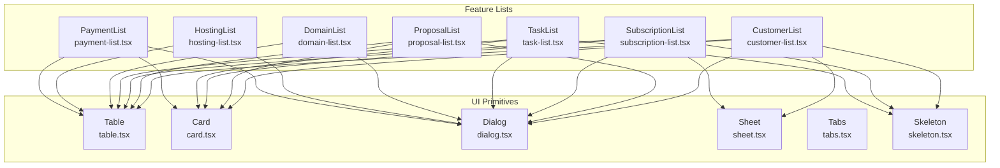
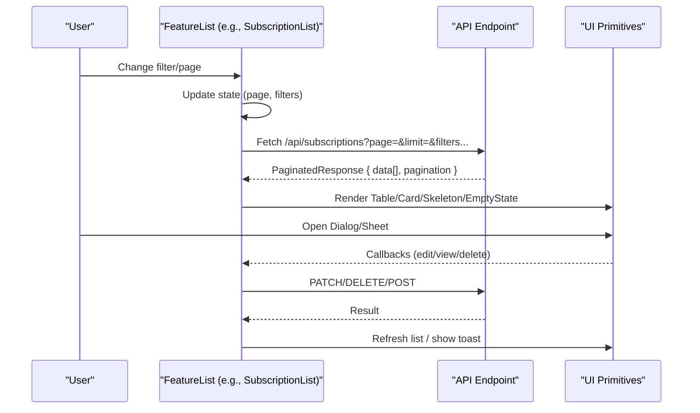
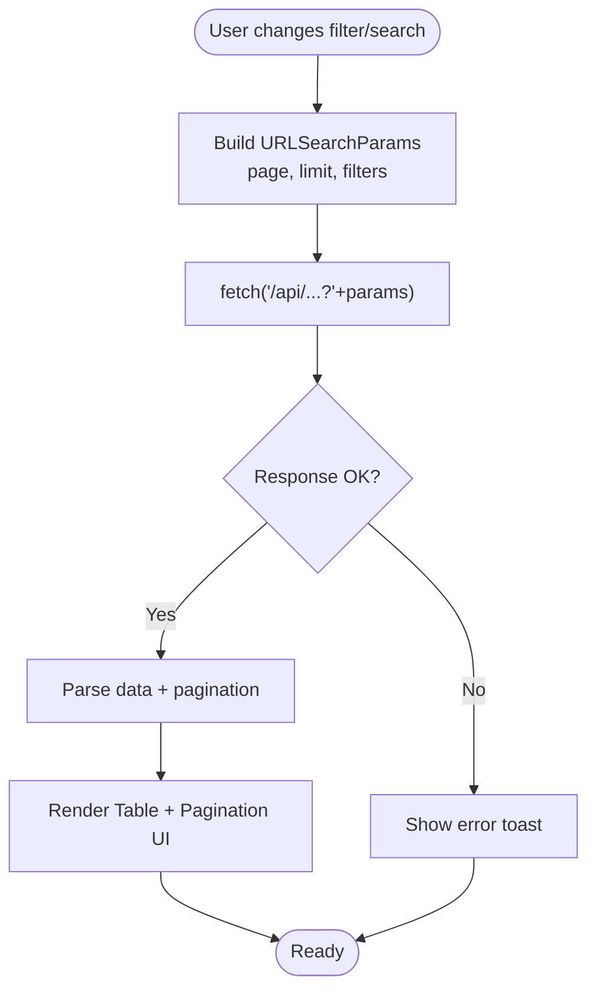
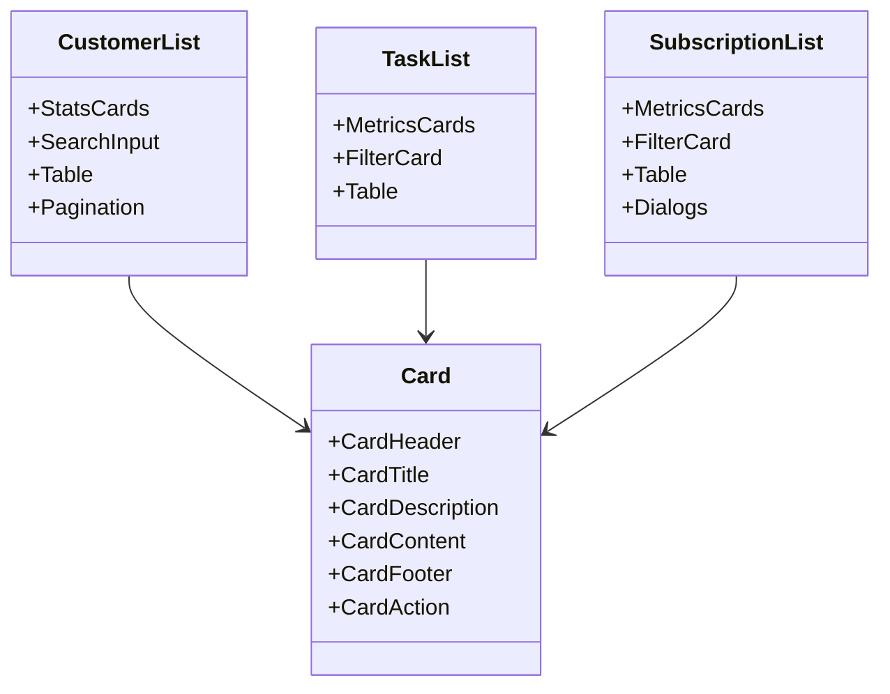
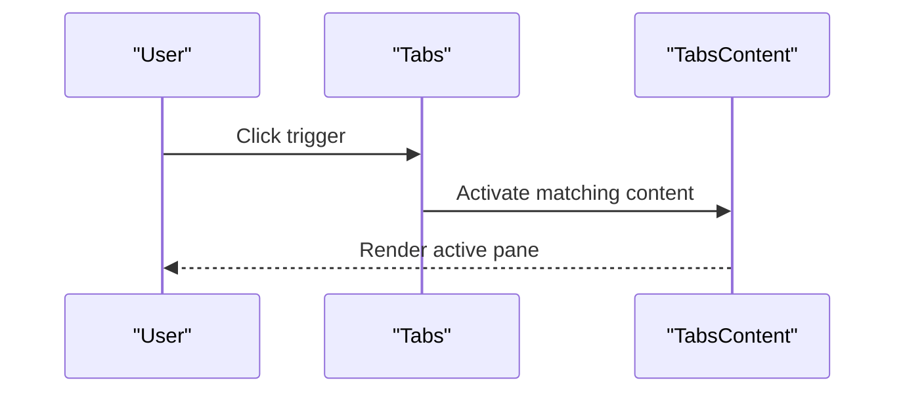
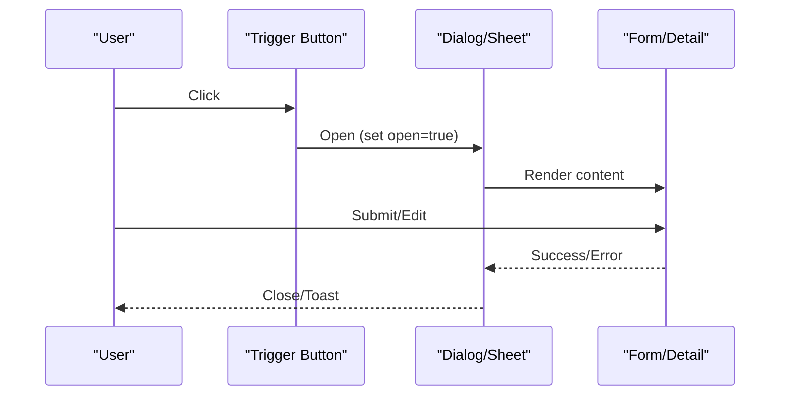
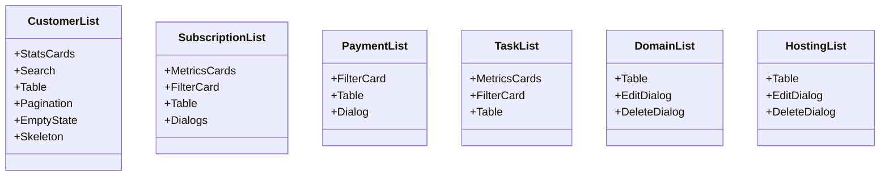
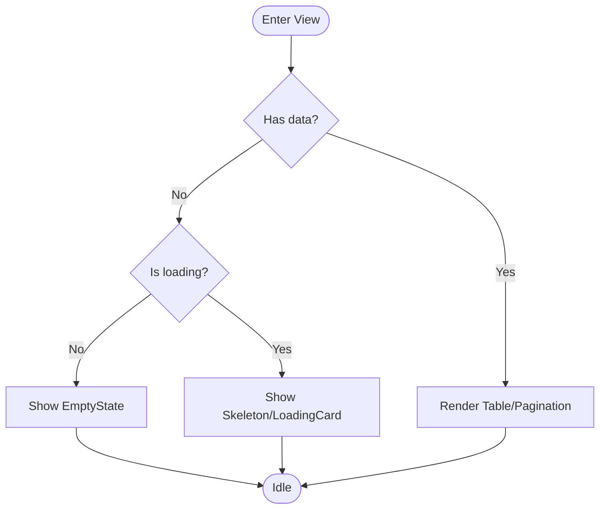
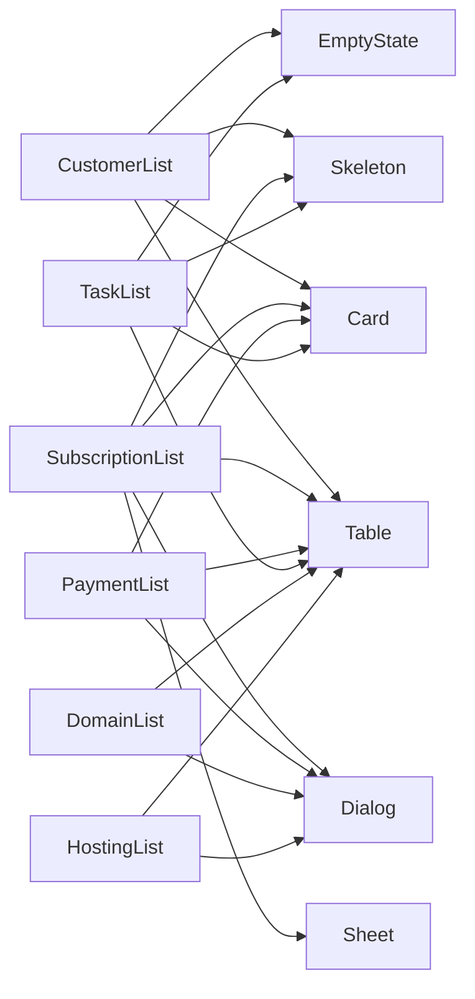

# Data Display Components

<cite>
**Referenced Files in This Document**
- [table.tsx](file://src/components/ui/table.tsx)
- [card.tsx](file://src/components/ui/card.tsx)
- [tabs.tsx](file://src/components/ui/tabs.tsx)
- [dialog.tsx](file://src/components/ui/dialog.tsx)
- [sheet.tsx](file://src/components/ui/sheet.tsx)
- [skeleton.tsx](file://src/components/ui/skeleton.tsx)
- [empty-state.tsx](file://src/components/empty-state.tsx)
- [customer-list.tsx](file://src/components/customer-list.tsx)
- [domain-list.tsx](file://src/components/domain-list.tsx)
- [hosting-list.tsx](file://src/components/hosting-list.tsx)
- [proposal-list.tsx](file://src/components/proposal-list.tsx)
- [payment-list.tsx](file://src/components/payment-list.tsx)
- [subscription-list.tsx](file://src/components/subscription-list.tsx)
- [task-list.tsx](file://src/components/task-list.tsx)
- [loading-card.tsx](file://src/components/loading-card.tsx)
</cite>

## Table of Contents
1. [Introduction](#introduction)
2. [Project Structure](#project-structure)
3. [Core Components](#core-components)
4. [Architecture Overview](#architecture-overview)
5. [Detailed Component Analysis](#detailed-component-analysis)
6. [Dependency Analysis](#dependency-analysis)
7. [Performance Considerations](#performance-considerations)
8. [Troubleshooting Guide](#troubleshooting-guide)
9. [Conclusion](#conclusion)

## Introduction
This document explains the data display and presentation components used across Customer WebMahsul. It focuses on:
- Table components with sorting, filtering, and pagination
- Card layouts, tabbed interfaces, modal dialogs, and sheets
- Complex data tables, interactive cards, and layered content presentation
- Loading states, empty states, and error handling patterns
- Responsive design, accessibility, and performance guidance for large datasets

## Project Structure
The data display system is built around reusable UI primitives and feature-specific lists:
- Primitive UI components under src/components/ui implement base building blocks (tables, cards, dialogs, sheets, tabs, skeletons).
- Feature-specific list components orchestrate data fetching, filters, pagination, and presentation.

**Diagram sources**
- [table.tsx:1-117](file://src/components/ui/table.tsx#L1-L117)
- [card.tsx:1-93](file://src/components/ui/card.tsx#L1-L93)
- [dialog.tsx:1-144](file://src/components/ui/dialog.tsx#L1-L144)
- [sheet.tsx:1-141](file://src/components/ui/sheet.tsx#L1-L141)
- [tabs.tsx:1-56](file://src/components/ui/tabs.tsx#L1-L56)
- [skeleton.tsx:1-16](file://src/components/ui/skeleton.tsx#L1-L16)
- [customer-list.tsx:1-319](file://src/components/customer-list.tsx#L1-L319)
- [proposal-list.tsx:1-274](file://src/components/proposal-list.tsx#L1-L274)
- [subscription-list.tsx:1-416](file://src/components/subscription-list.tsx#L1-L416)
- [task-list.tsx:1-294](file://src/components/task-list.tsx#L1-L294)
- [domain-list.tsx:1-254](file://src/components/domain-list.tsx#L1-L254)
- [hosting-list.tsx:1-254](file://src/components/hosting-list.tsx#L1-L254)
- [payment-list.tsx:1-285](file://src/components/payment-list.tsx#L1-L285)

**Section sources**
- [table.tsx:1-117](file://src/components/ui/table.tsx#L1-L117)
- [card.tsx:1-93](file://src/components/ui/card.tsx#L1-L93)
- [dialog.tsx:1-144](file://src/components/ui/dialog.tsx#L1-L144)
- [sheet.tsx:1-141](file://src/components/ui/sheet.tsx#L1-L141)
- [tabs.tsx:1-56](file://src/components/ui/tabs.tsx#L1-L56)
- [skeleton.tsx:1-16](file://src/components/ui/skeleton.tsx#L1-L16)
- [customer-list.tsx:1-319](file://src/components/customer-list.tsx#L1-L319)
- [proposal-list.tsx:1-274](file://src/components/proposal-list.tsx#L1-L274)
- [subscription-list.tsx:1-416](file://src/components/subscription-list.tsx#L1-L416)
- [task-list.tsx:1-294](file://src/components/task-list.tsx#L1-L294)
- [domain-list.tsx:1-254](file://src/components/domain-list.tsx#L1-L254)
- [hosting-list.tsx:1-254](file://src/components/hosting-list.tsx#L1-L254)
- [payment-list.tsx:1-285](file://src/components/payment-list.tsx#L1-L285)

## Core Components
This section documents the foundational UI components used across data displays.

- Table primitives
  - Container and cell roles: Table, TableHeader, TableBody, TableFooter, TableRow, TableHead, TableCell, TableCaption
  - Responsive container with horizontal scrolling and semantic markup
  - Hover and selection states for rows
  - Accessible slot attributes for testing and styling hooks

- Card primitives
  - Card, CardHeader, CardTitle, CardDescription, CardAction, CardContent, CardFooter
  - Grid-based header layout supporting actions and responsive stacking
  - Consistent spacing and typography

- Dialog and Sheet
  - Dialog: Root, Trigger, Portal, Close, Overlay, Content, Header, Footer, Title, Description
  - Sheet: Root, Trigger, Portal, Overlay, Content (with side variants), Header, Footer, Title, Description
  - Focus management, overlay backdrop, close buttons, and animation classes

- Tabs
  - Tabs Root, List, Trigger, Content with Radix UI integration
  - Active state styling and keyboard navigation

- Skeleton
  - Pulse animation for loading placeholders
  - Reusable building block for list and card placeholders

- EmptyState
  - Structured empty state with optional icon, title, description, and action
  - Centered layout with rounded borders and dashed outline

**Section sources**
- [table.tsx:1-117](file://src/components/ui/table.tsx#L1-L117)
- [card.tsx:1-93](file://src/components/ui/card.tsx#L1-L93)
- [dialog.tsx:1-144](file://src/components/ui/dialog.tsx#L1-L144)
- [sheet.tsx:1-141](file://src/components/ui/sheet.tsx#L1-L141)
- [tabs.tsx:1-56](file://src/components/ui/tabs.tsx#L1-L56)
- [skeleton.tsx:1-16](file://src/components/ui/skeleton.tsx#L1-L16)
- [empty-state.tsx:1-39](file://src/components/empty-state.tsx#L1-L39)

## Architecture Overview
The data display architecture follows a pattern:
- Feature list components manage state (filters, pagination, loading)
- They fetch paginated data via API endpoints
- UI primitives render structured content with consistent UX
- Modals and sheets present layered editing and detail views

**Diagram sources**
- [subscription-list.tsx:60-75](file://src/components/subscription-list.tsx#L60-L75)
- [payment-list.tsx:36-56](file://src/components/payment-list.tsx#L36-L56)
- [proposal-list.tsx:59-80](file://src/components/proposal-list.tsx#L59-L80)
- [customer-list.tsx:41-64](file://src/components/customer-list.tsx#L41-L64)
- [table.tsx:1-117](file://src/components/ui/table.tsx#L1-L117)
- [dialog.tsx:1-144](file://src/components/ui/dialog.tsx#L1-L144)
- [sheet.tsx:1-141](file://src/components/ui/sheet.tsx#L1-L141)

## Detailed Component Analysis

### Table Components: Sorting, Filtering, Pagination
- Sorting
  - Implemented in higher-order components (e.g., SubscriptionList) via URL parameters and state updates
  - Sorting controls are not part of the primitive Table; consumers add Select/Input controls and pass parameters to the backend
- Filtering
  - Search and filter controls (Select, Input) trigger re-fetches with query parameters
  - Debounced search in ProposalList prevents excessive requests
- Pagination
  - Page state drives URLSearchParams; total pages parsed from API response pagination metadata
  - Previous/Next buttons update page state and re-fetch

**Diagram sources**
- [subscription-list.tsx:60-75](file://src/components/subscription-list.tsx#L60-L75)
- [payment-list.tsx:36-56](file://src/components/payment-list.tsx#L36-L56)
- [proposal-list.tsx:59-96](file://src/components/proposal-list.tsx#L59-L96)
- [customer-list.tsx:41-64](file://src/components/customer-list.tsx#L41-L64)

**Section sources**
- [subscription-list.tsx:1-416](file://src/components/subscription-list.tsx#L1-L416)
- [payment-list.tsx:1-285](file://src/components/payment-list.tsx#L1-L285)
- [proposal-list.tsx:1-274](file://src/components/proposal-list.tsx#L1-L274)
- [customer-list.tsx:1-319](file://src/components/customer-list.tsx#L1-L319)

### Card Layouts and Interactive Cards
- Cards wrap content with consistent spacing, typography, and optional actions
- Interactive cards (e.g., CustomerList stats) combine gradient overlays and icons
- TaskList and SubscriptionList use cards for filters and metrics

**Diagram sources**
- [card.tsx:1-93](file://src/components/ui/card.tsx#L1-L93)
- [customer-list.tsx:106-148](file://src/components/customer-list.tsx#L106-L148)
- [task-list.tsx:95-151](file://src/components/task-list.tsx#L95-L151)
- [subscription-list.tsx:103-159](file://src/components/subscription-list.tsx#L103-L159)

**Section sources**
- [card.tsx:1-93](file://src/components/ui/card.tsx#L1-L93)
- [customer-list.tsx:106-148](file://src/components/customer-list.tsx#L106-L148)
- [task-list.tsx:95-151](file://src/components/task-list.tsx#L95-L151)
- [subscription-list.tsx:103-159](file://src/components/subscription-list.tsx#L103-L159)

### Tabbed Interfaces
- Tabs provide segmented content areas with triggers and content panes
- Useful for organizing related but distinct views within a single screen

**Diagram sources**
- [tabs.tsx:1-56](file://src/components/ui/tabs.tsx#L1-L56)

**Section sources**
- [tabs.tsx:1-56](file://src/components/ui/tabs.tsx#L1-L56)

### Modal Dialogs and Sheets
- Dialogs
  - Overlay backdrop, animated entrance/exit, close button, and accessible header/footer/title/description slots
  - Used for confirmations, editing forms, and detail views
- Sheets
  - Slide-in panels from sides with overlay and close affordance
  - Suitable for compact forms and quick edits

**Diagram sources**
- [dialog.tsx:1-144](file://src/components/ui/dialog.tsx#L1-L144)
- [sheet.tsx:1-141](file://src/components/ui/sheet.tsx#L1-L141)
- [subscription-list.tsx:379-412](file://src/components/subscription-list.tsx#L379-L412)
- [payment-list.tsx:257-282](file://src/components/payment-list.tsx#L257-L282)

**Section sources**
- [dialog.tsx:1-144](file://src/components/ui/dialog.tsx#L1-L144)
- [sheet.tsx:1-141](file://src/components/ui/sheet.tsx#L1-L141)
- [subscription-list.tsx:355-412](file://src/components/subscription-list.tsx#L355-L412)
- [payment-list.tsx:257-282](file://src/components/payment-list.tsx#L257-L282)

### Complex Data Tables
- CustomerList
  - Stats cards, search, table with actions, pagination, and empty state
  - Uses Skeleton during loading
- SubscriptionList
  - Metrics cards, filter card, table with badges and status indicators, dialogs for view/edit
- PaymentList
  - Multi-faceted filters (customer, subscription, status, date range, currency), table, and inline edit dialog
- TaskList
  - Metrics cards, filter card, table with status badges, pagination
- DomainList and HostingList
  - Simple tables with edit/delete dialogs and basic pagination

**Diagram sources**
- [customer-list.tsx:1-319](file://src/components/customer-list.tsx#L1-L319)
- [subscription-list.tsx:1-416](file://src/components/subscription-list.tsx#L1-L416)
- [payment-list.tsx:1-285](file://src/components/payment-list.tsx#L1-L285)
- [task-list.tsx:1-294](file://src/components/task-list.tsx#L1-L294)
- [domain-list.tsx:1-254](file://src/components/domain-list.tsx#L1-L254)
- [hosting-list.tsx:1-254](file://src/components/hosting-list.tsx#L1-L254)

**Section sources**
- [customer-list.tsx:1-319](file://src/components/customer-list.tsx#L1-L319)
- [subscription-list.tsx:1-416](file://src/components/subscription-list.tsx#L1-L416)
- [payment-list.tsx:1-285](file://src/components/payment-list.tsx#L1-L285)
- [task-list.tsx:1-294](file://src/components/task-list.tsx#L1-L294)
- [domain-list.tsx:1-254](file://src/components/domain-list.tsx#L1-L254)
- [hosting-list.tsx:1-254](file://src/components/hosting-list.tsx#L1-L254)

### Loading States, Empty States, and Error Handling
- Loading states
  - Skeleton components used inside cards and lists while data is being fetched
  - LoadingCard provides a reusable skeleton card with configurable header and rows
- Empty states
  - EmptyState component renders a centered message with optional icon/action
  - Used when filtered results are empty or initial load yields no data
- Error handling
  - Try/catch around fetch calls; toast notifications for failures
  - Fallback UI (EmptyState or skeleton) ensures graceful degradation

**Diagram sources**
- [skeleton.tsx:1-16](file://src/components/ui/skeleton.tsx#L1-L16)
- [loading-card.tsx:1-56](file://src/components/loading-card.tsx#L1-L56)
- [empty-state.tsx:1-39](file://src/components/empty-state.tsx#L1-L39)
- [customer-list.tsx:176-195](file://src/components/customer-list.tsx#L176-L195)
- [subscription-list.tsx:235-254](file://src/components/subscription-list.tsx#L235-L254)

**Section sources**
- [skeleton.tsx:1-16](file://src/components/ui/skeleton.tsx#L1-L16)
- [loading-card.tsx:1-56](file://src/components/loading-card.tsx#L1-L56)
- [empty-state.tsx:1-39](file://src/components/empty-state.tsx#L1-L39)
- [customer-list.tsx:176-195](file://src/components/customer-list.tsx#L176-L195)
- [subscription-list.tsx:235-254](file://src/components/subscription-list.tsx#L235-L254)

## Dependency Analysis
- Coupling
  - Feature lists depend on UI primitives (Table, Card, Dialog, Sheet, Skeleton, EmptyState)
  - Dialogs and Sheets encapsulate overlay and animation concerns, reducing duplication
- Cohesion
  - Each list component encapsulates its own state, fetch logic, and rendering pipeline
- External dependencies
  - @radix-ui/react-tabs for Tabs
  - lucide-react icons for visual cues
  - sonner for toast notifications
  - class-variance-authority for Sheet variants

**Diagram sources**
- [customer-list.tsx:1-319](file://src/components/customer-list.tsx#L1-L319)
- [subscription-list.tsx:1-416](file://src/components/subscription-list.tsx#L1-L416)
- [payment-list.tsx:1-285](file://src/components/payment-list.tsx#L1-L285)
- [task-list.tsx:1-294](file://src/components/task-list.tsx#L1-L294)
- [domain-list.tsx:1-254](file://src/components/domain-list.tsx#L1-L254)
- [hosting-list.tsx:1-254](file://src/components/hosting-list.tsx#L1-L254)
- [table.tsx:1-117](file://src/components/ui/table.tsx#L1-L117)
- [card.tsx:1-93](file://src/components/ui/card.tsx#L1-L93)
- [dialog.tsx:1-144](file://src/components/ui/dialog.tsx#L1-L144)
- [sheet.tsx:1-141](file://src/components/ui/sheet.tsx#L1-L141)
- [skeleton.tsx:1-16](file://src/components/ui/skeleton.tsx#L1-L16)
- [empty-state.tsx:1-39](file://src/components/empty-state.tsx#L1-L39)

**Section sources**
- [customer-list.tsx:1-319](file://src/components/customer-list.tsx#L1-L319)
- [subscription-list.tsx:1-416](file://src/components/subscription-list.tsx#L1-L416)
- [payment-list.tsx:1-285](file://src/components/payment-list.tsx#L1-L285)
- [task-list.tsx:1-294](file://src/components/task-list.tsx#L1-L294)
- [domain-list.tsx:1-254](file://src/components/domain-list.tsx#L1-L254)
- [hosting-list.tsx:1-254](file://src/components/hosting-list.tsx#L1-L254)

## Performance Considerations
- Pagination
  - Always use server-side pagination (limit/page) to avoid large payloads
  - Keep limit reasonable (e.g., 10–20) for fast rendering
- Debouncing
  - Debounce search inputs to reduce network requests (as seen in ProposalList)
- Minimal re-renders
  - Use stable callbacks (useCallback) and memoized queries
- Virtualization
  - For very large datasets, consider virtualized lists to render only visible rows
- Lazy loading
  - Load auxiliary data (e.g., customer/subscription maps) on demand
- Skeletons
  - Use Skeleton/LoadingCard to maintain perceived performance during fetches

[No sources needed since this section provides general guidance]

## Troubleshooting Guide
- No data shown
  - Verify pagination metadata is returned and parsed (totalPages, data)
  - Check for EmptyState conditions and ensure fallback UI is rendered
- Fetch errors
  - Inspect toast messages and console logs; ensure try/catch wraps fetch calls
  - Confirm API endpoints accept query parameters (page, limit, filters)
- Dialog/Form issues
  - Ensure Dialog/Sheet open state is controlled and reset after submit
  - Validate form submission handlers and error handling paths
- Accessibility
  - Ensure Dialog/Sheet have proper focus trapping and close semantics
  - Use meaningful alt/title text for icons and buttons
  - Maintain sufficient color contrast and readable fonts

**Section sources**
- [subscription-list.tsx:314-322](file://src/components/subscription-list.tsx#L314-L322)
- [payment-list.tsx:106-117](file://src/components/payment-list.tsx#L106-L117)
- [proposal-list.tsx:98-108](file://src/components/proposal-list.tsx#L98-L108)
- [dialog.tsx:1-144](file://src/components/ui/dialog.tsx#L1-L144)
- [sheet.tsx:1-141](file://src/components/ui/sheet.tsx#L1-L141)

## Conclusion
Customer WebMahsul’s data display system combines reusable UI primitives with feature-specific list components to deliver responsive, accessible, and efficient data presentation. Tables, cards, dialogs, sheets, and skeletons work together to support robust filtering, pagination, and layered interactions. Following the outlined patterns ensures consistent UX and scalability for larger datasets.