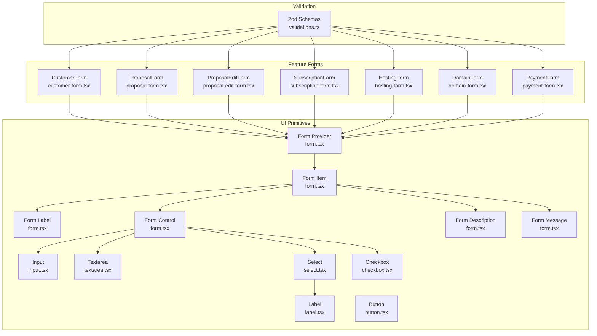
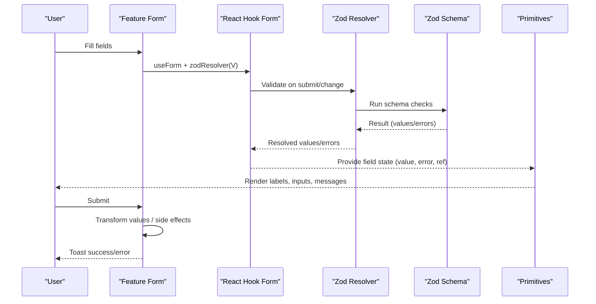
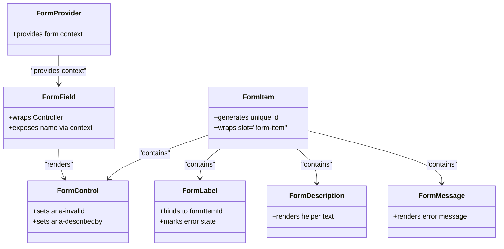
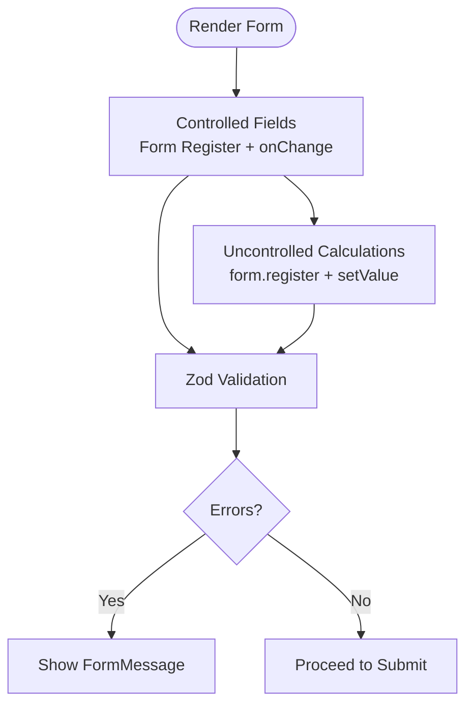
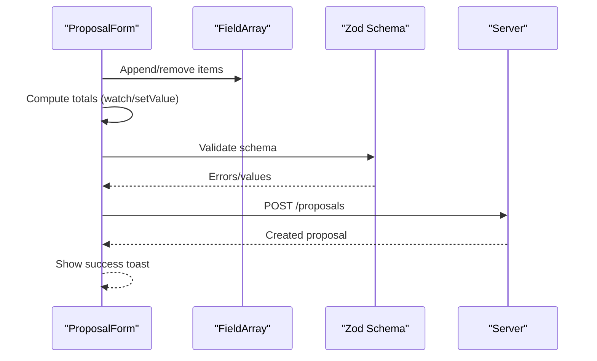
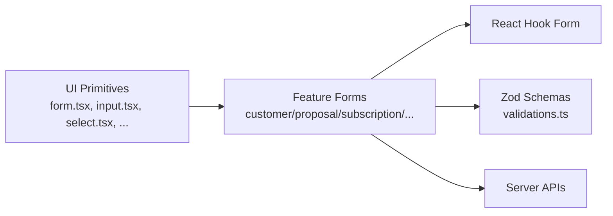

# Form Components

<cite>
**Referenced Files in This Document**
- [form.tsx](file://src/components/ui/form.tsx)
- [input.tsx](file://src/components/ui/input.tsx)
- [textarea.tsx](file://src/components/ui/textarea.tsx)
- [select.tsx](file://src/components/ui/select.tsx)
- [checkbox.tsx](file://src/components/ui/checkbox.tsx)
- [label.tsx](file://src/components/ui/label.tsx)
- [button.tsx](file://src/components/ui/button.tsx)
- [validations.ts](file://src/lib/validations.ts)
- [customer-form.tsx](file://src/components/customer-form.tsx)
- [proposal-form.tsx](file://src/components/proposal-form.tsx)
- [proposal-edit-form.tsx](file://src/components/proposal-edit-form.tsx)
- [subscription-form.tsx](file://src/components/subscription-form.tsx)
- [hosting-form.tsx](file://src/components/hosting-form.tsx)
- [domain-form.tsx](file://src/components/domain-form.tsx)
- [payment-form.tsx](file://src/components/payment-form.tsx)
</cite>

## Table of Contents
1. [Introduction](#introduction)
2. [Project Structure](#project-structure)
3. [Core Components](#core-components)
4. [Architecture Overview](#architecture-overview)
5. [Detailed Component Analysis](#detailed-component-analysis)
6. [Dependency Analysis](#dependency-analysis)
7. [Performance Considerations](#performance-considerations)
8. [Troubleshooting Guide](#troubleshooting-guide)
9. [Conclusion](#conclusion)
10. [Appendices](#appendices)

## Introduction
This document explains the form-related components and patterns used in the Customer WebMahsul component library. It focuses on how forms are structured, validated with Zod via React Hook Form, and how controlled and uncontrolled behaviors are applied. It also documents input variants, sizes, error states, accessibility features, and practical examples for form layouts, validation schemas, custom field types, submission workflows, file uploads, multi-select components, and complex form interactions. Finally, it provides guidelines for accessibility compliance and UX best practices.

## Project Structure
The form system is built around a reusable Form abstraction and a set of UI primitives. Feature-specific forms wrap these primitives and integrate with Zod schemas and server APIs.

**Diagram sources**
- [form.tsx:19-167](file://src/components/ui/form.tsx#L19-L167)
- [input.tsx:5-19](file://src/components/ui/input.tsx#L5-L19)
- [textarea.tsx:5-16](file://src/components/ui/textarea.tsx#L5-L16)
- [select.tsx:9-187](file://src/components/ui/select.tsx#L9-L187)
- [checkbox.tsx:9-30](file://src/components/ui/checkbox.tsx#L9-L30)
- [label.tsx:8-22](file://src/components/ui/label.tsx#L8-L22)
- [button.tsx:41-64](file://src/components/ui/button.tsx#L41-L64)
- [validations.ts:4-243](file://src/lib/validations.ts#L4-L243)
- [customer-form.tsx:25-264](file://src/components/customer-form.tsx#L25-L264)
- [proposal-form.tsx:36-467](file://src/components/proposal-form.tsx#L36-L467)
- [proposal-edit-form.tsx:41-293](file://src/components/proposal-edit-form.tsx#L41-L293)
- [subscription-form.tsx:25-458](file://src/components/subscription-form.tsx#L25-L458)
- [hosting-form.tsx:23-156](file://src/components/hosting-form.tsx#L23-L156)
- [domain-form.tsx:23-172](file://src/components/domain-form.tsx#L23-L172)
- [payment-form.tsx:25-360](file://src/components/payment-form.tsx#L25-L360)

**Section sources**
- [form.tsx:19-167](file://src/components/ui/form.tsx#L19-L167)
- [validations.ts:4-243](file://src/lib/validations.ts#L4-L243)

## Core Components
- Form provider and field wiring:
  - FormProvider wraps React Hook Form’s context so that FormField, FormControl, FormLabel, FormMessage, and FormDescription can resolve field state and ids.
  - FormField composes React Hook Form’s Controller with a field context to pass the field name down to child components.
  - useFormField reads field state, generates accessible ids, and exposes error and aria attributes for downstream controls.
- Primitive inputs:
  - Input, Textarea, Select, Checkbox, and Label are thin wrappers that apply consistent styling and accessibility attributes (e.g., aria-invalid, aria-describedby).
- Validation integration:
  - Zod schemas define strong typing and validation rules. Each form initializes React Hook Form with zodResolver(schema) to connect validation to the form state.

Key behaviors:
- Controlled components: Inputs receive value and onChange handlers from React Hook Form, ensuring two-way binding and immediate validation feedback.
- Uncontrolled segments: Some dynamic parts (e.g., computed totals in ProposalForm) use form.register and manual setValue to update values without full React state synchronization.
- Accessibility:
  - FormLabel associates labels with inputs via htmlFor and data-slot.
  - FormControl sets aria-describedby and aria-invalid based on field state.
  - Select triggers expose data-size and data-slot for styling while preserving semantics.

**Section sources**
- [form.tsx:19-167](file://src/components/ui/form.tsx#L19-L167)
- [input.tsx:5-19](file://src/components/ui/input.tsx#L5-L19)
- [textarea.tsx:5-16](file://src/components/ui/textarea.tsx#L5-L16)
- [select.tsx:9-187](file://src/components/ui/select.tsx#L9-L187)
- [checkbox.tsx:9-30](file://src/components/ui/checkbox.tsx#L9-L30)
- [label.tsx:8-22](file://src/components/ui/label.tsx#L8-L22)
- [validations.ts:4-243](file://src/lib/validations.ts#L4-L243)

## Architecture Overview
The form architecture follows a layered pattern:
- UI primitives encapsulate styling and accessibility.
- Form provider and field helpers manage React Hook Form integration.
- Feature forms orchestrate data fetching, field arrays, and submission.
- Validation schemas enforce correctness and drive error messages.

**Diagram sources**
- [form.tsx:19-167](file://src/components/ui/form.tsx#L19-L167)
- [validations.ts:4-243](file://src/lib/validations.ts#L4-L243)
- [customer-form.tsx:29-93](file://src/components/customer-form.tsx#L29-L93)
- [proposal-form.tsx:44-192](file://src/components/proposal-form.tsx#L44-L192)
- [proposal-edit-form.tsx:46-92](file://src/components/proposal-edit-form.tsx#L46-L92)
- [subscription-form.tsx:45-213](file://src/components/subscription-form.tsx#L45-L213)
- [hosting-form.tsx:27-70](file://src/components/hosting-form.tsx#L27-L70)
- [domain-form.tsx:27-72](file://src/components/domain-form.tsx#L27-L72)
- [payment-form.tsx:37-152](file://src/components/payment-form.tsx#L37-L152)

## Detailed Component Analysis

### Form Provider and Field Helpers
- Purpose: Centralized integration between Radix UI slots, React Hook Form, and accessible labeling.
- Key exports: Form, FormField, FormItem, FormLabel, FormControl, FormDescription, FormMessage, useFormField.
- Behavior:
  - useFormField computes ids for label, description, and message; merges field state (error, isDirty, etc.) from React Hook Form.
  - FormControl sets aria-invalid and aria-describedby dynamically based on error presence.
  - FormLabel applies data-error to reflect invalid state visually.

**Diagram sources**
- [form.tsx:19-167](file://src/components/ui/form.tsx#L19-L167)

**Section sources**
- [form.tsx:19-167](file://src/components/ui/form.tsx#L19-L167)

### Input Variants, Sizes, and Error States
- Input and Textarea:
  - Both support data-slot for styling hooks and apply aria-invalid when validation fails.
  - Focus states use ring classes for visible focus indicators.
- Select:
  - Supports size variants (sm/default) via data-size.
  - Trigger includes icons and proper sizing tokens.
- Checkbox:
  - Uses indicator pattern with CheckIcon and aria-invalid ring.
- Label:
  - Provides consistent typography and disabled state handling.

Accessibility highlights:
- Inputs receive aria-invalid when errors exist.
- FormControl sets aria-describedby to combine description and message ids.
- FormLabel uses htmlFor bound to the form item id.

**Section sources**
- [input.tsx:5-19](file://src/components/ui/input.tsx#L5-L19)
- [textarea.tsx:5-16](file://src/components/ui/textarea.tsx#L5-L16)
- [select.tsx:27-51](file://src/components/ui/select.tsx#L27-L51)
- [checkbox.tsx:9-30](file://src/components/ui/checkbox.tsx#L9-L30)
- [label.tsx:8-22](file://src/components/ui/label.tsx#L8-L22)
- [form.tsx:90-156](file://src/components/ui/form.tsx#L90-L156)

### Validation Integration with Zod
- Each feature form initializes React Hook Form with zodResolver(schema) and defaultValues derived from either incoming props or empty shapes.
- Validation schemas define:
  - Required fields, min/max lengths, numeric constraints, date formats, enums, and refine rules.
  - Partial schemas for updates (e.g., customerUpdateSchema).
- Error rendering:
  - FormMessage displays the first error for a field.
  - Buttons and selects can be marked aria-required when applicable.

Examples of validation patterns:
- Numeric-only fields with regex and max length.
- Date fields with YYYY-MM-DD regex.
- Enum-based fields with defaults.
- Refine rules for inter-field constraints (e.g., proposal amount > 0).

**Section sources**
- [validations.ts:4-243](file://src/lib/validations.ts#L4-L243)
- [customer-form.tsx:29-48](file://src/components/customer-form.tsx#L29-L48)
- [proposal-form.tsx:44-58](file://src/components/proposal-form.tsx#L44-L58)
- [proposal-edit-form.tsx:46-57](file://src/components/proposal-edit-form.tsx#L46-L57)
- [subscription-form.tsx:45-60](file://src/components/subscription-form.tsx#L45-L60)
- [hosting-form.tsx:27-35](file://src/components/hosting-form.tsx#L27-L35)
- [domain-form.tsx:27-37](file://src/components/domain-form.tsx#L27-L37)
- [payment-form.tsx:37-49](file://src/components/payment-form.tsx#L37-L49)

### Controlled vs Uncontrolled Behaviors
- Controlled:
  - All FormField inputs receive value and onChange from React Hook Form, enabling immediate validation and real-time feedback.
- Uncontrolled:
  - Some calculations (e.g., ProposalForm item totals) use form.register and manual setValue to update values without full React state re-renders.
- Mixed strategy:
  - Feature forms orchestrate both controlled inputs and uncontrolled computations to keep performance and UX smooth.

**Diagram sources**
- [proposal-form.tsx:166-170](file://src/components/proposal-form.tsx#L166-L170)
- [proposal-form.tsx:344-378](file://src/components/proposal-form.tsx#L344-L378)

**Section sources**
- [proposal-form.tsx:166-170](file://src/components/proposal-form.tsx#L166-L170)
- [proposal-form.tsx:344-378](file://src/components/proposal-form.tsx#L344-L378)

### Form Layouts and Submission Workflows
- CustomerForm:
  - Grid layout for personal info; single column for address.
  - Fetches city list on mount; submits via custom onSubmit or default fetch to /api/customers.
- ProposalForm:
  - Multi-section layout: customer/type/title/description/items/amount/validUntil/notes.
  - Field array for items; dynamic quantity/unitPrice/totalPrice; computed total.
  - Handles invalid submissions with user-friendly toast messages.
- ProposalEditForm:
  - Editable metadata with status buttons; updates via PATCH.
- SubscriptionForm:
  - Customer/type/period/start/end/price; optional proposalType.
  - Conditional yearly/monthly flows; creates related payments (single or installments).
- HostingForm and DomainForm:
  - Minimal layouts focused on required fields and optional notes.
- PaymentForm:
  - Customer/subscriptions/amount/currency/due/paid/status/note.
  - Computes debt and remaining balance; auto-creates next due when applicable.

Submission patterns:
- All forms set isLoading during fetch; show success/error toasts; call onSuccess callbacks.
- Many forms accept an onSubmit prop to override default fetch behavior.

**Section sources**
- [customer-form.tsx:25-93](file://src/components/customer-form.tsx#L25-L93)
- [proposal-form.tsx:36-192](file://src/components/proposal-form.tsx#L36-L192)
- [proposal-edit-form.tsx:41-112](file://src/components/proposal-edit-form.tsx#L41-L112)
- [subscription-form.tsx:25-213](file://src/components/subscription-form.tsx#L25-L213)
- [hosting-form.tsx:23-70](file://src/components/hosting-form.tsx#L23-L70)
- [domain-form.tsx:23-72](file://src/components/domain-form.tsx#L23-L72)
- [payment-form.tsx:25-152](file://src/components/payment-form.tsx#L25-L152)

### File Upload Handling
- The UI library does not include a dedicated file upload primitive.
- Forms that require uploads should integrate a file input with appropriate validation and submission logic. Recommended approach:
  - Use an Input with type="file" inside a FormField.
  - Add schema validation for file types/sizes.
  - Submit multipart/form-data to the backend endpoint.
- Example reference:
  - [file-upload.tsx](file://src/components/ui/file-upload.tsx) exists in the UI library but is not used in the analyzed forms.

**Section sources**
- [file-upload.tsx](file://src/components/ui/file-upload.tsx)

### Multi-Select Components
- Select supports single selection by default.
- For multi-select scenarios:
  - Use Select with multiple values and custom logic to toggle selections.
  - Alternatively, build a custom multi-select using Checkbox items within a Select-like container.
- Example reference:
  - [select.tsx:9-187](file://src/components/ui/select.tsx#L9-L187) defines Select primitives; multi-select behavior would be implemented in feature forms.

**Section sources**
- [select.tsx:9-187](file://src/components/ui/select.tsx#L9-L187)

### Complex Form Interactions
- ProposalForm demonstrates:
  - Field arrays with dynamic rows.
  - Real-time computation of totals and amounts.
  - Integration with external data (customers, products, proposal types).
- SubscriptionForm demonstrates:
  - Conditional UI based on period (monthly/yearly).
  - Side effects: creating related payments (single or installments).
- PaymentForm demonstrates:
  - Cascading effects: computing debt, remaining balance, and creating follow-up due dates.

**Diagram sources**
- [proposal-form.tsx:60-63](file://src/components/proposal-form.tsx#L60-L63)
- [proposal-form.tsx:166-170](file://src/components/proposal-form.tsx#L166-L170)
- [proposal-form.tsx:172-192](file://src/components/proposal-form.tsx#L172-L192)

**Section sources**
- [proposal-form.tsx:60-63](file://src/components/proposal-form.tsx#L60-L63)
- [proposal-form.tsx:166-170](file://src/components/proposal-form.tsx#L166-L170)
- [proposal-form.tsx:172-192](file://src/components/proposal-form.tsx#L172-L192)

### Accessibility Features
- Labels:
  - FormLabel binds to the form item id; data-slot enables styling hooks.
- Controls:
  - FormControl sets aria-invalid and aria-describedby to include description and message ids.
- Selects:
  - Triggers expose data-size and data-slot; icons indicate state.
- Buttons:
  - Support variant and size variants; focus/ring styles included.
- Keyboard and screen reader:
  - All inputs use native HTML semantics; Select leverages @radix-ui/react-select for accessible dropdowns.

Best practices:
- Always pair FormLabel with FormControl.
- Use FormDescription for helper text; FormMessage for error text.
- Mark required fields with aria-required where appropriate.
- Keep focus order logical; avoid hidden required fields.

**Section sources**
- [form.tsx:90-156](file://src/components/ui/form.tsx#L90-L156)
- [select.tsx:27-51](file://src/components/ui/select.tsx#L27-L51)
- [button.tsx:41-64](file://src/components/ui/button.tsx#L41-L64)

## Dependency Analysis
- UI primitives depend on:
  - Radix UI for accessible base components (Label, Select, Checkbox).
  - Class merging utility for consistent styling.
- Feature forms depend on:
  - React Hook Form for state and validation.
  - Zod schemas for type-safe validation.
  - External APIs for data fetching and submission.
- Coupling and cohesion:
  - Strong cohesion within each feature form around a single domain entity.
  - Loose coupling via shared UI primitives and Form helpers.

**Diagram sources**
- [form.tsx:19-167](file://src/components/ui/form.tsx#L19-L167)
- [validations.ts:4-243](file://src/lib/validations.ts#L4-L243)
- [customer-form.tsx:25-93](file://src/components/customer-form.tsx#L25-L93)
- [proposal-form.tsx:36-192](file://src/components/proposal-form.tsx#L36-L192)
- [subscription-form.tsx:25-213](file://src/components/subscription-form.tsx#L25-L213)

**Section sources**
- [form.tsx:19-167](file://src/components/ui/form.tsx#L19-L167)
- [validations.ts:4-243](file://src/lib/validations.ts#L4-L243)

## Performance Considerations
- Prefer controlled inputs for frequent validation to minimize unnecessary renders.
- Use form.watch selectively to avoid triggering heavy computations on every keystroke.
- For complex calculations (e.g., totals), debounce or batch updates to reduce re-renders.
- Lazy-load external lists (customers, products, proposal types) to avoid blocking initial render.
- Use defaultValues to prevent hydration mismatches when data is fetched asynchronously.

## Troubleshooting Guide
Common issues and resolutions:
- Missing useFormField context:
  - Ensure FormField wraps FormControl; otherwise useFormField throws an error.
- No error messages displayed:
  - Verify FormMessage is rendered within FormItem and that the field has an error.
- Select value not updating:
  - Confirm onValueChange is passed to Select and that default values match option values.
- Zod validation not firing:
  - Ensure zodResolver is provided to useForm and that schema matches field names.
- Toasts not appearing:
  - Confirm toast is imported and used in submit handlers; check for caught exceptions.

**Section sources**
- [form.tsx:45-66](file://src/components/ui/form.tsx#L45-L66)
- [customer-form.tsx:64-93](file://src/components/customer-form.tsx#L64-L93)
- [proposal-form.tsx:194-209](file://src/components/proposal-form.tsx#L194-L209)
- [subscription-form.tsx:215-232](file://src/components/subscription-form.tsx#L215-L232)

## Conclusion
The form system combines accessible UI primitives with robust validation and controlled/uncontrolled patterns. Feature forms demonstrate scalable approaches to complex workflows, including field arrays, conditional UI, and cascading side effects. By following the documented patterns and accessibility guidelines, teams can build consistent, user-friendly forms that remain maintainable and performant.

## Appendices

### Validation Schema Reference
- Customer: create/update schemas with string constraints and optional fields.
- Proposal: base schema plus item arrays and amount refinement.
- Subscription: base schema with proposalType refine and period-dependent flows.
- Domain/Hosting/Payment: strict field validation with date and numeric constraints.

**Section sources**
- [validations.ts:4-243](file://src/lib/validations.ts#L4-L243)