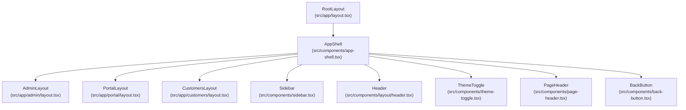
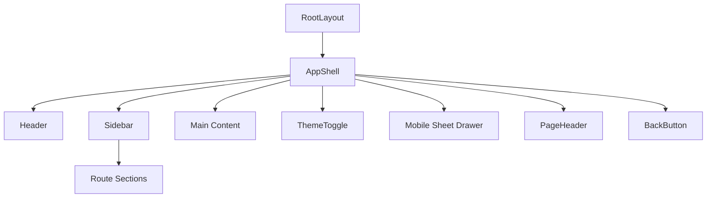
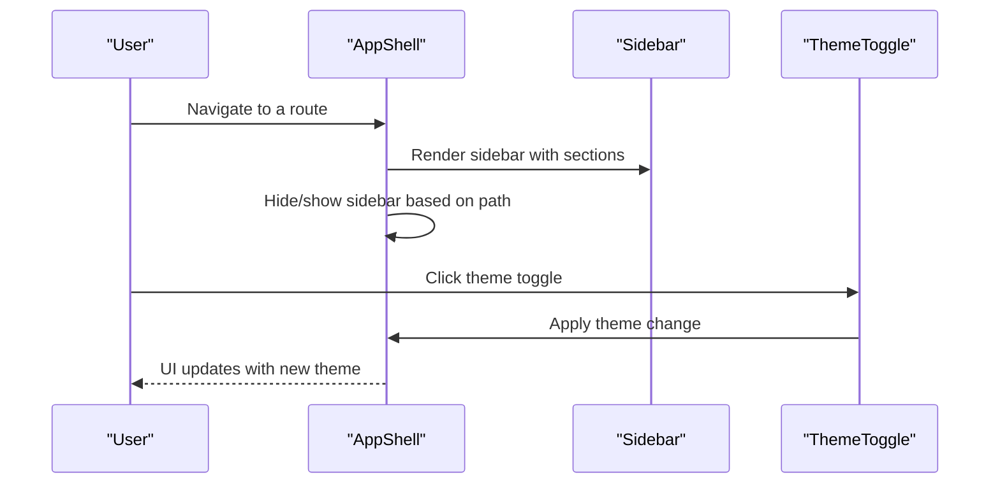
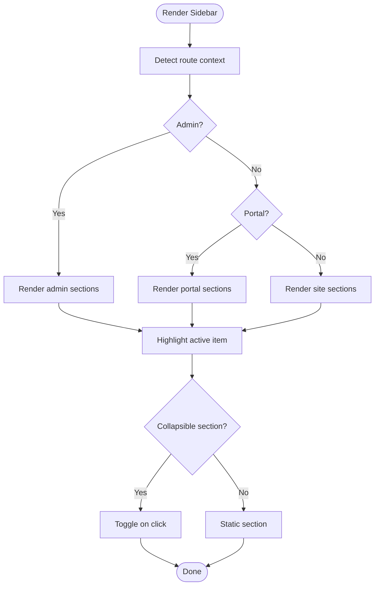
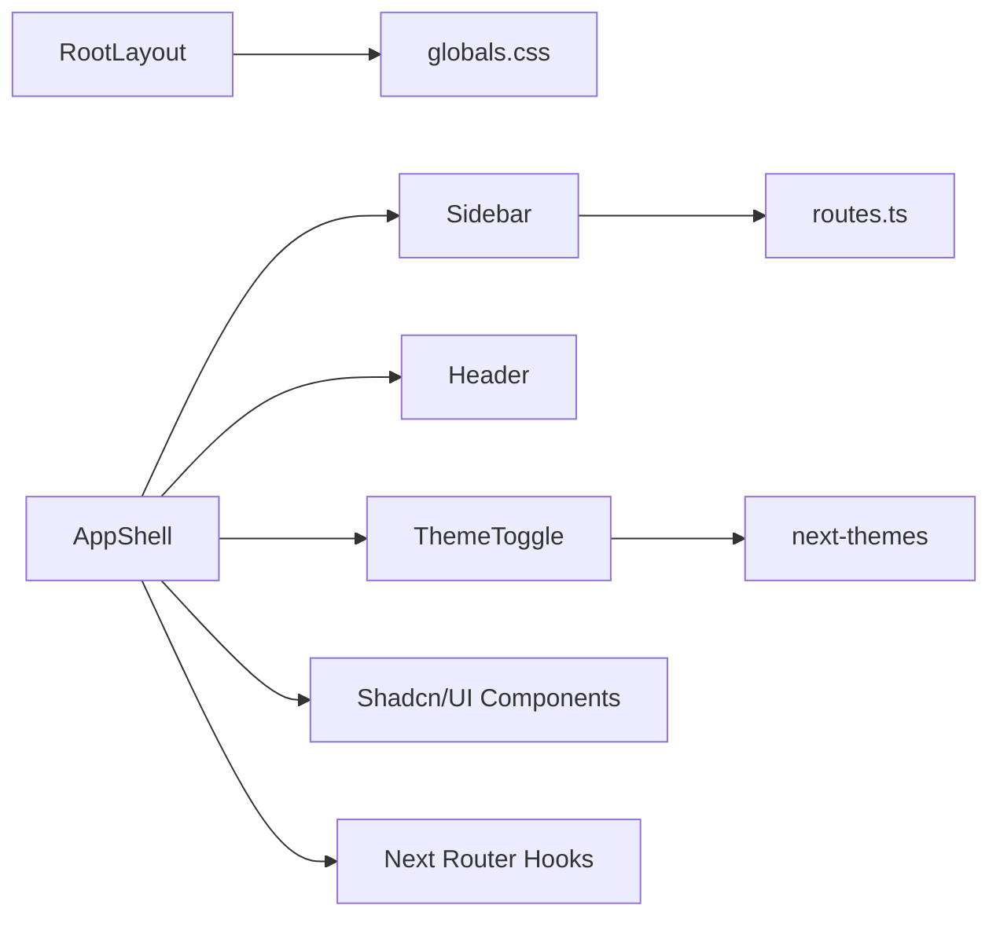

# Layout Components

<cite>
**Referenced Files in This Document**
- [layout.tsx](file://src/app/layout.tsx)
- [app-shell.tsx](file://src/components/app-shell.tsx)
- [sidebar.tsx](file://src/components/sidebar.tsx)
- [header.tsx](file://src/components/layout/header.tsx)
- [routes.ts](file://src/lib/routes.ts)
- [globals.css](file://src/app/globals.css)
- [theme-toggle.tsx](file://src/components/theme-toggle.tsx)
- [page-header.tsx](file://src/components/page-header.tsx)
- [back-button.tsx](file://src/components/back-button.tsx)
- [admin/layout.tsx](file://src/app/admin/layout.tsx)
- [customers/layout.tsx](file://src/app/customers/layout.tsx)
- [portal/layout.tsx](file://src/app/portal/layout.tsx)
- [admin/dashboard/page.tsx](file://src/app/admin/dashboard/page.tsx)
- [login/page.tsx](file://src/app/login/page.tsx)
</cite>

## Table of Contents
1. [Introduction](#introduction)
2. [Project Structure](#project-structure)
3. [Core Components](#core-components)
4. [Architecture Overview](#architecture-overview)
5. [Detailed Component Analysis](#detailed-component-analysis)
6. [Dependency Analysis](#dependency-analysis)
7. [Performance Considerations](#performance-considerations)
8. [Troubleshooting Guide](#troubleshooting-guide)
9. [Conclusion](#conclusion)
10. [Appendices](#appendices)

## Introduction
This document explains the layout and structural components of Customer WebMahsul. It covers the main application shell, navigation sidebar, header components, and page structure elements. It also documents layout composition patterns, responsive breakpoints, navigation state management, theming integration, dark mode support, and mobile-responsive design patterns. Practical examples illustrate different layout configurations, sidebar behaviors, and header interactions, along with guidelines for customizing layouts while maintaining design system consistency.

## Project Structure
The layout system is built around a shared application shell that wraps page content. Different application sections (admin, portal, customers) use the same shell via dedicated layout wrappers. The shell composes:
- A persistent left sidebar with collapsible sections
- A sticky header with search, notifications, and theme toggle
- A main content area
- A mobile-friendly sheet-based drawer for navigation

**Diagram sources**
- [layout.tsx:1-35](file://src/app/layout.tsx#L1-L35)
- [app-shell.tsx:1-128](file://src/components/app-shell.tsx#L1-L128)
- [admin/layout.tsx:1-10](file://src/app/admin/layout.tsx#L1-L10)
- [portal/layout.tsx:1-10](file://src/app/portal/layout.tsx#L1-L10)
- [customers/layout.tsx:1-10](file://src/app/customers/layout.tsx#L1-L10)
- [sidebar.tsx:1-321](file://src/components/sidebar.tsx#L1-L321)
- [header.tsx:1-59](file://src/components/layout/header.tsx#L1-L59)
- [theme-toggle.tsx:1-15](file://src/components/theme-toggle.tsx#L1-L15)
- [page-header.tsx:1-64](file://src/components/page-header.tsx#L1-L64)
- [back-button.tsx:1-45](file://src/components/back-button.tsx#L1-L45)

**Section sources**
- [layout.tsx:1-35](file://src/app/layout.tsx#L1-L35)
- [app-shell.tsx:1-128](file://src/components/app-shell.tsx#L1-L128)
- [admin/layout.tsx:1-10](file://src/app/admin/layout.tsx#L1-L10)
- [portal/layout.tsx:1-10](file://src/app/portal/layout.tsx#L1-L10)
- [customers/layout.tsx:1-10](file://src/app/customers/layout.tsx#L1-L10)

## Core Components
- RootLayout: Provides global HTML wrapper and fonts.
- AppShell: Central layout container with sidebar, header, and main content area; integrates theming and mobile drawer.
- Sidebar: Dynamic navigation with collapsible sections, tooltips, and logout action; adapts to admin, portal, and site contexts.
- Header: Top navigation bar with branding, desktop nav links, and mobile menu trigger.
- ThemeToggle: Switches between light and dark themes.
- PageHeader: Standardized page headers with breadcrumbs, title, description, and optional actions.
- BackButton: Consistent back navigation with fallback handling.

**Section sources**
- [layout.tsx:1-35](file://src/app/layout.tsx#L1-L35)
- [app-shell.tsx:1-128](file://src/components/app-shell.tsx#L1-L128)
- [sidebar.tsx:1-321](file://src/components/sidebar.tsx#L1-L321)
- [header.tsx:1-59](file://src/components/layout/header.tsx#L1-L59)
- [theme-toggle.tsx:1-15](file://src/components/theme-toggle.tsx#L1-L15)
- [page-header.tsx:1-64](file://src/components/page-header.tsx#L1-L64)
- [back-button.tsx:1-45](file://src/components/back-button.tsx#L1-L45)

## Architecture Overview
The layout architecture follows a layered pattern:
- RootLayout sets up the document and global fonts.
- AppShell manages the shell structure and hides the sidebar on login.
- Sidebar adapts to current route context (admin, portal, site) and maintains collapsible state.
- Header provides branding and desktop navigation; a mobile drawer is integrated via AppShell.
- Theming is globally applied via next-themes and styled with Tailwind CSS variables.

**Diagram sources**
- [layout.tsx:1-35](file://src/app/layout.tsx#L1-L35)
- [app-shell.tsx:1-128](file://src/components/app-shell.tsx#L1-L128)
- [sidebar.tsx:1-321](file://src/components/sidebar.tsx#L1-L321)
- [header.tsx:1-59](file://src/components/layout/header.tsx#L1-L59)
- [theme-toggle.tsx:1-15](file://src/components/theme-toggle.tsx#L1-L15)
- [page-header.tsx:1-64](file://src/components/page-header.tsx#L1-L64)
- [back-button.tsx:1-45](file://src/components/back-button.tsx#L1-L45)

## Detailed Component Analysis

### AppShell
AppShell orchestrates the shell layout:
- Uses next-themes for theme management.
- Conditionally renders the sidebar based on the current path (hides on login).
- Provides a sticky header with search, notifications, and theme toggle.
- Includes a mobile drawer (sheet) that hosts the sidebar on small screens.
- Wraps page content in a padded main area.

Responsive behavior:
- Desktop: Fixed sidebar (hidden on login), sticky header.
- Mobile: Sheet-based drawer replaces fixed sidebar; header shrinks to essential controls.

Navigation state management:
- Uses Next.js router hooks to compute visibility and interactions.
- Integrates with the sidebar’s collapsible state and active item highlighting.

Theming integration:
- next-themes provider configured with system default.
- ThemeToggle switches between light and dark modes.

**Diagram sources**
- [app-shell.tsx:1-128](file://src/components/app-shell.tsx#L1-L128)
- [sidebar.tsx:1-321](file://src/components/sidebar.tsx#L1-L321)
- [theme-toggle.tsx:1-15](file://src/components/theme-toggle.tsx#L1-L15)

**Section sources**
- [app-shell.tsx:1-128](file://src/components/app-shell.tsx#L1-L128)

### Sidebar
Sidebar adapts to three contexts:
- Admin: Comprehensive sections for dashboards, services, accounting, inventory, operations, finance, users, and settings.
- Portal: Sections for dashboard, services, operations, and account.
- Site: Minimal customer list section.

Behavior:
- Collapsible sections with chevrons; default open state for multiple sections.
- Active item highlighting based on current path.
- Tooltips for collapsed icons; right-side content appears on larger screens.
- Logout action clears auth cookie and navigates to login.

**Diagram sources**
- [sidebar.tsx:30-159](file://src/components/sidebar.tsx#L30-L159)

**Section sources**
- [sidebar.tsx:1-321](file://src/components/sidebar.tsx#L1-L321)
- [routes.ts:1-43](file://src/lib/routes.ts#L1-L43)

### Header
Header displays branding and desktop navigation. On mobile, a menu button triggers the mobile drawer. Desktop navigation items are derived from a static navigation array and highlighted based on the current path.

Responsive behavior:
- Desktop: Horizontal nav with active state styling.
- Mobile: Hamburger menu opens the sheet drawer.

**Section sources**
- [header.tsx:1-59](file://src/components/layout/header.tsx#L1-L59)

### ThemeToggle and Theming
ThemeToggle toggles between light and dark modes. The design system uses Tailwind CSS variables mapped to oklch color tokens and supports dark mode variants.

Key points:
- next-themes provider wraps the shell.
- ThemeToggle switches theme on click.
- globals.css defines CSS variables and dark mode overrides.

**Section sources**
- [theme-toggle.tsx:1-15](file://src/components/theme-toggle.tsx#L1-L15)
- [globals.css:1-128](file://src/app/globals.css#L1-L128)

### PageHeader and BackButton
PageHeader standardizes page headers with breadcrumbs, title, description, and optional actions. BackButton provides consistent back navigation with a fallback route and adaptive styling based on context.

Usage examples:
- Admin dashboard page uses PageHeader with breadcrumbs and actions.
- BackButton adapts variant and size depending on the current route context.

**Section sources**
- [page-header.tsx:1-64](file://src/components/page-header.tsx#L1-L64)
- [back-button.tsx:1-45](file://src/components/back-button.tsx#L1-L45)
- [admin/dashboard/page.tsx:220-227](file://src/app/admin/dashboard/page.tsx#L220-L227)

### Login Page Behavior
The login page intentionally omits the AppShell to present a standalone authentication experience. After successful login, users are redirected to either admin or portal dashboards based on role.

**Section sources**
- [login/page.tsx:1-144](file://src/app/login/page.tsx#L1-L144)

## Dependency Analysis
The layout components depend on:
- Next.js routing and navigation APIs for path detection and programmatic navigation.
- next-themes for theme management.
- shadcn/ui components for UI primitives (buttons, inputs, separators, sheets, scroll areas).
- lucide-react for icons.
- Tailwind CSS and CSS variables for styling.

**Diagram sources**
- [layout.tsx:1-35](file://src/app/layout.tsx#L1-L35)
- [app-shell.tsx:1-128](file://src/components/app-shell.tsx#L1-L128)
- [sidebar.tsx:1-321](file://src/components/sidebar.tsx#L1-L321)
- [routes.ts:1-43](file://src/lib/routes.ts#L1-L43)
- [globals.css:1-128](file://src/app/globals.css#L1-L128)
- [theme-toggle.tsx:1-15](file://src/components/theme-toggle.tsx#L1-L15)

**Section sources**
- [layout.tsx:1-35](file://src/app/layout.tsx#L1-L35)
- [app-shell.tsx:1-128](file://src/components/app-shell.tsx#L1-L128)
- [sidebar.tsx:1-321](file://src/components/sidebar.tsx#L1-L321)
- [routes.ts:1-43](file://src/lib/routes.ts#L1-L43)
- [globals.css:1-128](file://src/app/globals.css#L1-L128)
- [theme-toggle.tsx:1-15](file://src/components/theme-toggle.tsx#L1-L15)

## Performance Considerations
- Keep sidebar sections collapsed by default to reduce DOM size on initial render.
- Use lazy loading for heavy dashboard widgets and defer non-critical data fetching.
- Minimize re-renders by memoizing computed values and avoiding unnecessary prop drilling.
- Prefer server-side rendering for static metadata and client-side hydration for interactive components.

## Troubleshooting Guide
Common issues and resolutions:
- Sidebar not visible on login: Verify the path check in AppShell; ensure login route matches the condition.
- Active item highlighting incorrect: Confirm the active comparison against the current path and route definitions.
- Theme not switching: Ensure next-themes provider is initialized and ThemeToggle is mounted within it.
- Mobile drawer not opening: Check that the sheet trigger is rendered and the sheet content includes the sidebar.
- Icons missing: Confirm lucide-react is installed and icons are imported correctly.

**Section sources**
- [app-shell.tsx:16-89](file://src/components/app-shell.tsx#L16-L89)
- [sidebar.tsx:228-321](file://src/components/sidebar.tsx#L228-L321)
- [theme-toggle.tsx:6-14](file://src/components/theme-toggle.tsx#L6-L14)

## Conclusion
Customer WebMahsul’s layout system centers on a flexible AppShell that composes a responsive sidebar, sticky header, and main content area. The Sidebar adapts to distinct contexts (admin, portal, site) with collapsible sections and active state management. Theming is integrated via next-themes and styled with Tailwind CSS variables. The design supports both desktop and mobile experiences, with clear patterns for breadcrumbs, page headers, and back navigation. Following the guidelines below ensures consistent customization while preserving the design system.

## Appendices

### Responsive Breakpoints and Patterns
- Desktop: Sidebar remains visible; header includes desktop navigation and search.
- Mobile: Sidebar moves into a sheet drawer; header reduces to essential controls (menu, search, notifications, theme toggle).

### Navigation State Management
- Path-based visibility: AppShell hides the sidebar on login.
- Active item detection: Sidebar compares current path to item hrefs.
- Collapsible state: Sidebar stores open sections in local state and toggles on demand.

### Theming Integration and Dark Mode
- next-themes provider enables theme switching with system preference.
- globals.css defines CSS variables and dark mode overrides for consistent theming across components.

### Examples of Layout Configurations
- Admin Dashboard: Uses AppShell with admin layout wrapper; includes PageHeader with breadcrumbs and actions.
- Portal Dashboard: Similar shell with portal-specific sidebar sections.
- Customers Listing: Wrapped with AppShell; content area contains lists and actions.
- Login: Standalone page outside AppShell for authentication flow.

### Guidelines for Customizing Layouts
- Maintain route definitions in a central location for consistent navigation.
- Use PageHeader for standardized page headers with breadcrumbs and actions.
- Keep sidebar sections grouped by functional domains and collapsible for readability.
- Preserve theme variables and dark mode support across custom components.
- Ensure mobile drawer includes the same navigation structure as the desktop sidebar.