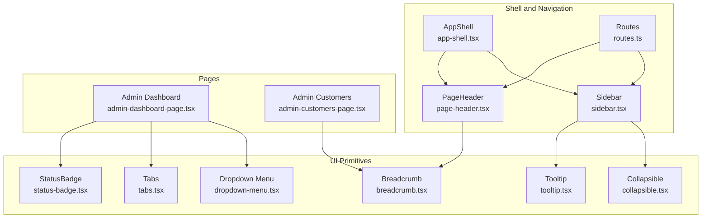
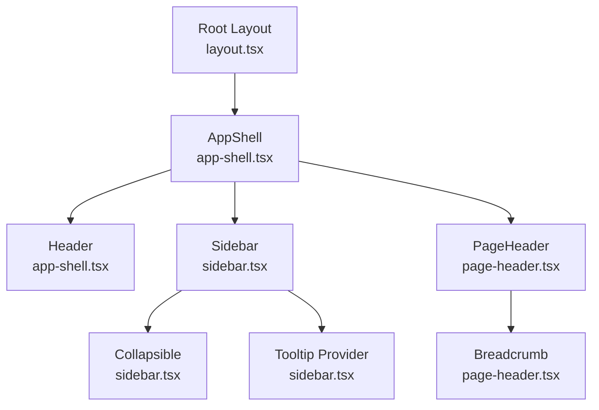
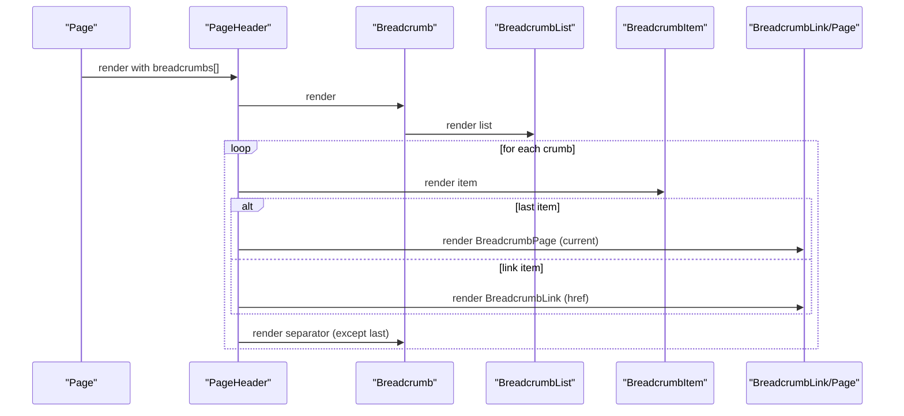
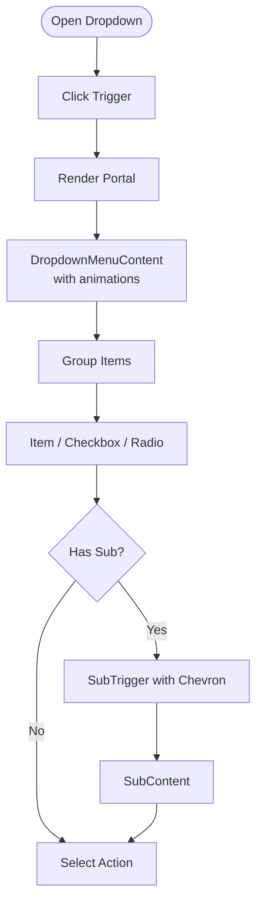
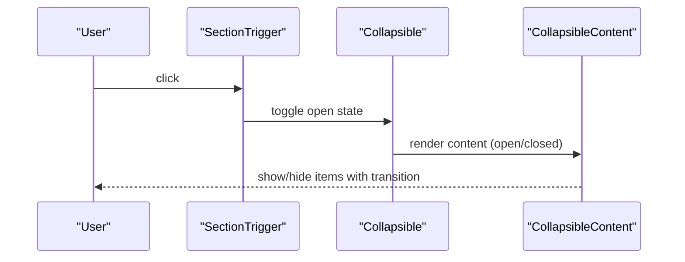
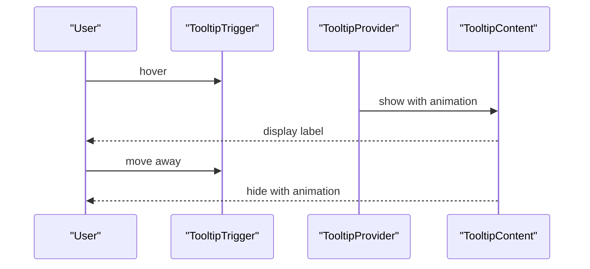
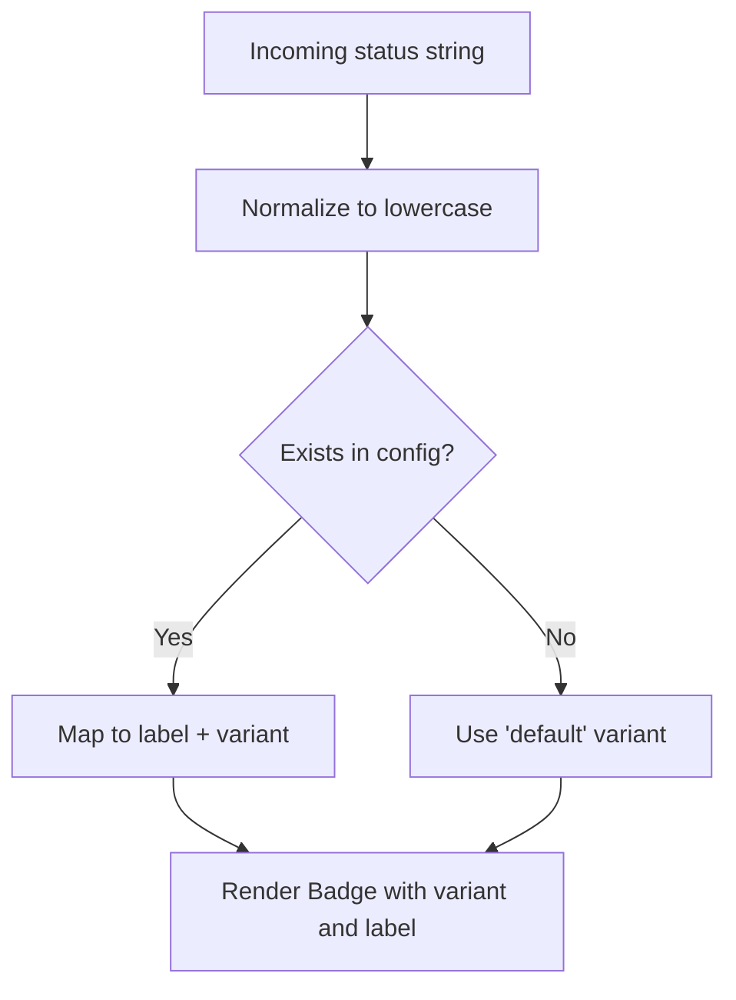
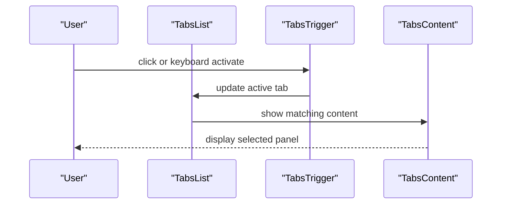
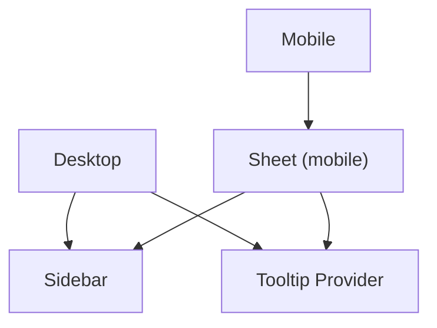
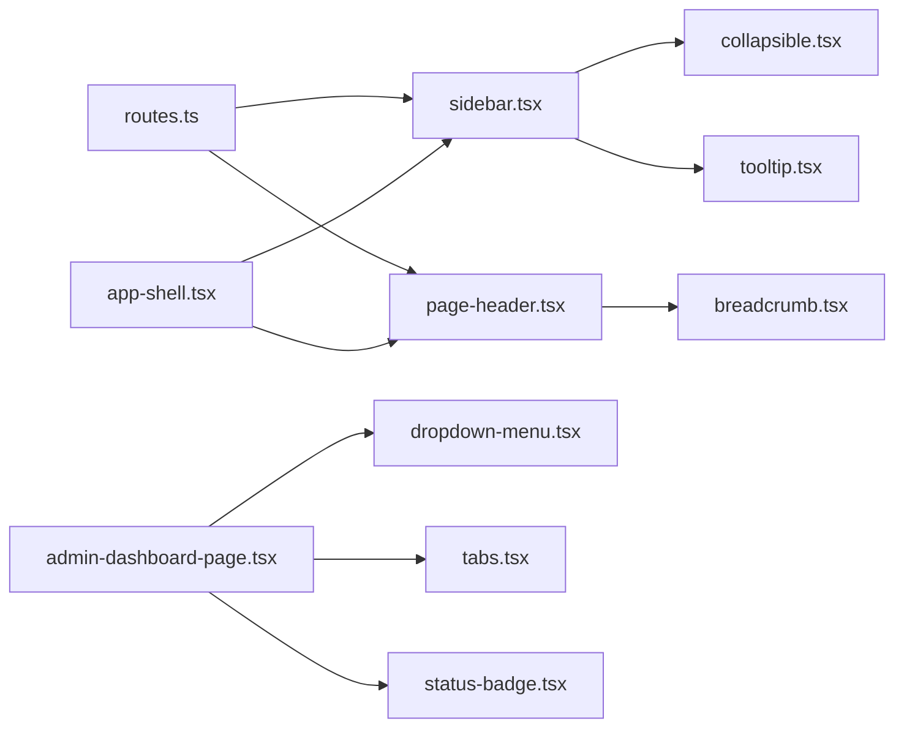

# Navigation Components

<cite>
**Referenced Files in This Document**
- [breadcrumb.tsx](file://src/components/ui/breadcrumb.tsx)
- [dropdown-menu.tsx](file://src/components/ui/dropdown-menu.tsx)
- [collapsible.tsx](file://src/components/ui/collapsible.tsx)
- [tooltip.tsx](file://src/components/ui/tooltip.tsx)
- [sidebar.tsx](file://src/components/sidebar.tsx)
- [app-shell.tsx](file://src/components/app-shell.tsx)
- [page-header.tsx](file://src/components/page-header.tsx)
- [routes.ts](file://src/lib/routes.ts)
- [tabs.tsx](file://src/components/ui/tabs.tsx)
- [status-badge.tsx](file://src/components/status-badge.tsx)
- [layout.tsx](file://src/app/layout.tsx)
- [admin-dashboard-page.tsx](file://src/app/admin/dashboard/page.tsx)
- [admin-customers-page.tsx](file://src/app/admin/customers/page.tsx)
</cite>

## Table of Contents
1. [Introduction](#introduction)
2. [Project Structure](#project-structure)
3. [Core Components](#core-components)
4. [Architecture Overview](#architecture-overview)
5. [Detailed Component Analysis](#detailed-component-analysis)
6. [Dependency Analysis](#dependency-analysis)
7. [Performance Considerations](#performance-considerations)
8. [Troubleshooting Guide](#troubleshooting-guide)
9. [Conclusion](#conclusion)

## Introduction
This document describes the navigation and interaction components used in Customer WebMahsul. It focuses on breadcrumb navigation, dropdown menus, collapsible sections, tooltips, and status indicators. It also explains navigation patterns, keyboard accessibility, focus management, animation behaviors, positioning logic, responsive navigation, and guidelines for building accessible and consistent navigation experiences across screen sizes.

## Project Structure
The navigation system is built around shared UI primitives and shell-level layouts:
- UI primitives: breadcrumb, dropdown menu, collapsible, tooltip, tabs, and status badge
- Shell and navigation: app shell, sidebar, and page header
- Routing: centralized routes definition
- Example usage: admin dashboard and customer list pages

**Diagram sources**
- [breadcrumb.tsx:1-116](file://src/components/ui/breadcrumb.tsx#L1-L116)
- [dropdown-menu.tsx:1-258](file://src/components/ui/dropdown-menu.tsx#L1-L258)
- [collapsible.tsx:1-12](file://src/components/ui/collapsible.tsx#L1-L12)
- [tooltip.tsx:1-31](file://src/components/ui/tooltip.tsx#L1-L31)
- [tabs.tsx:1-56](file://src/components/ui/tabs.tsx#L1-L56)
- [status-badge.tsx:1-63](file://src/components/status-badge.tsx#L1-L63)
- [app-shell.tsx:1-128](file://src/components/app-shell.tsx#L1-L128)
- [sidebar.tsx:1-321](file://src/components/sidebar.tsx#L1-L321)
- [page-header.tsx:1-64](file://src/components/page-header.tsx#L1-L64)
- [routes.ts:1-43](file://src/lib/routes.ts#L1-L43)
- [admin-dashboard-page.tsx:1-815](file://src/app/admin/dashboard/page.tsx#L1-L815)
- [admin-customers-page.tsx:1-42](file://src/app/admin/customers/page.tsx#L1-L42)

**Section sources**
- [layout.tsx:1-35](file://src/app/layout.tsx#L1-L35)
- [routes.ts:1-43](file://src/lib/routes.ts#L1-L43)
- [app-shell.tsx:1-128](file://src/components/app-shell.tsx#L1-L128)
- [sidebar.tsx:1-321](file://src/components/sidebar.tsx#L1-L321)
- [page-header.tsx:1-64](file://src/components/page-header.tsx#L1-L64)
- [breadcrumb.tsx:1-116](file://src/components/ui/breadcrumb.tsx#L1-L116)
- [dropdown-menu.tsx:1-258](file://src/components/ui/dropdown-menu.tsx#L1-L258)
- [collapsible.tsx:1-12](file://src/components/ui/collapsible.tsx#L1-L12)
- [tooltip.tsx:1-31](file://src/components/ui/tooltip.tsx#L1-L31)
- [tabs.tsx:1-56](file://src/components/ui/tabs.tsx#L1-L56)
- [status-badge.tsx:1-63](file://src/components/status-badge.tsx#L1-L63)
- [admin-dashboard-page.tsx:1-815](file://src/app/admin/dashboard/page.tsx#L1-L815)
- [admin-customers-page.tsx:1-42](file://src/app/admin/customers/page.tsx#L1-L42)

## Core Components
- Breadcrumb: Provides hierarchical navigation cues with accessible roles and separators.
- Dropdown Menu: Implements nested menus, submenus, checkboxes, radios, and shortcuts with animations and portals.
- Collapsible: Enables expandable/collapsible sections with Radix UI primitives.
- Tooltip: Offers contextual help with animated positioning and provider setup.
- StatusBadge: Visual indicator for entity states with color variants and normalized statuses.
- Tabs: Organizes related content into selectable sections with keyboard support.
- AppShell and Sidebar: Provide responsive navigation shells with mobile-friendly sheets and collapsible sections.

**Section sources**
- [breadcrumb.tsx:1-116](file://src/components/ui/breadcrumb.tsx#L1-L116)
- [dropdown-menu.tsx:1-258](file://src/components/ui/dropdown-menu.tsx#L1-L258)
- [collapsible.tsx:1-12](file://src/components/ui/collapsible.tsx#L1-L12)
- [tooltip.tsx:1-31](file://src/components/ui/tooltip.tsx#L1-L31)
- [status-badge.tsx:1-63](file://src/components/status-badge.tsx#L1-L63)
- [tabs.tsx:1-56](file://src/components/ui/tabs.tsx#L1-L56)
- [app-shell.tsx:1-128](file://src/components/app-shell.tsx#L1-L128)
- [sidebar.tsx:1-321](file://src/components/sidebar.tsx#L1-L321)

## Architecture Overview
The navigation architecture combines:
- Centralized routing via a single routes definition
- A shell that injects header, sidebar, and main content areas
- Reusable UI primitives for consistent behavior and accessibility
- Responsive patterns: desktop sidebar vs. mobile sheet

**Diagram sources**
- [layout.tsx:1-35](file://src/app/layout.tsx#L1-L35)
- [app-shell.tsx:1-128](file://src/components/app-shell.tsx#L1-L128)
- [sidebar.tsx:1-321](file://src/components/sidebar.tsx#L1-L321)
- [page-header.tsx:1-64](file://src/components/page-header.tsx#L1-L64)
- [breadcrumb.tsx:1-116](file://src/components/ui/breadcrumb.tsx#L1-L116)

## Detailed Component Analysis

### Breadcrumb Navigation
- Purpose: Communicates current location and enables quick navigation through hierarchical pages.
- Implementation highlights:
  - Accessible labeling via ARIA attributes
  - Flexible separators and ellipsis for overflow
  - Page item marked as current and disabled for interaction
- Usage pattern:
  - PageHeader composes BreadcrumbList, BreadcrumbItem, BreadcrumbLink, BreadcrumbPage, BreadcrumbSeparator
  - Example breadcrumbs passed from pages to PageHeader

**Diagram sources**
- [page-header.tsx:22-63](file://src/components/page-header.tsx#L22-L63)
- [breadcrumb.tsx:15-115](file://src/components/ui/breadcrumb.tsx#L15-L115)
- [admin-customers-page.tsx:20-33](file://src/app/admin/customers/page.tsx#L20-L33)

**Section sources**
- [breadcrumb.tsx:1-116](file://src/components/ui/breadcrumb.tsx#L1-L116)
- [page-header.tsx:1-64](file://src/components/page-header.tsx#L1-L64)
- [admin-customers-page.tsx:1-42](file://src/app/admin/customers/page.tsx#L1-L42)

### Dropdown Menus
- Purpose: Present contextual actions and options with nested submenus.
- Implementation highlights:
  - Uses Radix UI primitives with portals for proper stacking
  - Animations on open/close and directional slide-in
  - Supports labels, items, checkboxes, radios, separators, and shortcuts
  - Submenu triggers include chevrons and nested content
- Usage pattern:
  - Admin dashboard demonstrates filters and toggles using DropdownMenu, DropdownMenuCheckboxItem, DropdownMenuSeparator, and DropdownMenuContent

**Diagram sources**
- [dropdown-menu.tsx:34-239](file://src/components/ui/dropdown-menu.tsx#L34-L239)
- [admin-dashboard-page.tsx:665-758](file://src/app/admin/dashboard/page.tsx#L665-L758)

**Section sources**
- [dropdown-menu.tsx:1-258](file://src/components/ui/dropdown-menu.tsx#L1-L258)
- [admin-dashboard-page.tsx:665-758](file://src/app/admin/dashboard/page.tsx#L665-L758)

### Collapsible Sections
- Purpose: Hide and reveal grouped navigation items to save space.
- Implementation highlights:
  - Uses Radix UI Collapsible primitives
  - Animated transitions for open/close
  - Chevron rotation indicates expanded state
- Usage pattern:
  - Sidebar defines collapsible sections and toggles state per section title

**Diagram sources**
- [collapsible.tsx:1-12](file://src/components/ui/collapsible.tsx#L1-L12)
- [sidebar.tsx:258-279](file://src/components/sidebar.tsx#L258-L279)

**Section sources**
- [collapsible.tsx:1-12](file://src/components/ui/collapsible.tsx#L1-L12)
- [sidebar.tsx:189-226](file://src/components/sidebar.tsx#L189-L226)

### Tooltips
- Purpose: Provide contextual help or labels for icons and controls.
- Implementation highlights:
  - Provider wraps tooltip consumers
  - Animated positioning with side offsets
  - Delayed appearance controlled at provider level
- Usage pattern:
  - Sidebar links use TooltipTrigger and TooltipContent; content shown on hover except on small screens

**Diagram sources**
- [tooltip.tsx:8-28](file://src/components/ui/tooltip.tsx#L8-L28)
- [sidebar.tsx:161-187](file://src/components/sidebar.tsx#L161-L187)

**Section sources**
- [tooltip.tsx:1-31](file://src/components/ui/tooltip.tsx#L1-L31)
- [sidebar.tsx:161-187](file://src/components/sidebar.tsx#L161-L187)

### Status Indicators
- Purpose: Visually communicate state for items such as subscriptions, domains, payments, and customers.
- Implementation highlights:
  - Normalizes incoming status strings to predefined variants
  - Applies color variants and hover states for clarity
- Usage pattern:
  - Dashboard displays StatusBadge alongside lists and cards

**Diagram sources**
- [status-badge.tsx:32-62](file://src/components/status-badge.tsx#L32-L62)
- [admin-dashboard-page.tsx:487-488](file://src/app/admin/dashboard/page.tsx#L487-L488)

**Section sources**
- [status-badge.tsx:1-63](file://src/components/status-badge.tsx#L1-L63)
- [admin-dashboard-page.tsx:487-488](file://src/app/admin/dashboard/page.tsx#L487-L488)

### Tabs
- Purpose: Organize related content into selectable sections.
- Implementation highlights:
  - Keyboard accessible triggers and content regions
  - Active state styling and focus-visible rings
- Usage pattern:
  - Dashboard uses Tabs to split reminders, expiring items, and payments

**Diagram sources**
- [tabs.tsx:10-53](file://src/components/ui/tabs.tsx#L10-L53)
- [admin-dashboard-page.tsx:504-509](file://src/app/admin/dashboard/page.tsx#L504-L509)

**Section sources**
- [tabs.tsx:1-56](file://src/components/ui/tabs.tsx#L1-L56)
- [admin-dashboard-page.tsx:504-509](file://src/app/admin/dashboard/page.tsx#L504-L509)

### Responsive Navigation Patterns
- Desktop:
  - Fixed sidebar with collapsible sections and tooltips
  - Sticky header with search, notifications, and theme toggle
- Mobile:
  - Sheet overlay triggered by a hamburger menu
  - Collapsible sidebar content inside the sheet

**Diagram sources**
- [app-shell.tsx:23-49](file://src/components/app-shell.tsx#L23-L49)
- [app-shell.tsx:92-127](file://src/components/app-shell.tsx#L92-L127)
- [sidebar.tsx:249-318](file://src/components/sidebar.tsx#L249-L318)

**Section sources**
- [app-shell.tsx:1-128](file://src/components/app-shell.tsx#L1-L128)
- [sidebar.tsx:1-321](file://src/components/sidebar.tsx#L1-L321)

### Navigation Patterns and Focus Management
- Focus management:
  - Tabs and dropdowns rely on Radix UI’s roving focus and focus-visible styles
  - Tooltips are hover-triggered; keyboard users can still reach targets via Tab order
- Keyboard accessibility:
  - DropdownMenu supports keyboard navigation and submenus
  - Tabs are keyboard operable with arrow keys and Enter/Space
- Focus traps:
  - No explicit focus trap is present; ensure future modals/sheets integrate focus trapping if added

**Section sources**
- [dropdown-menu.tsx:1-258](file://src/components/ui/dropdown-menu.tsx#L1-L258)
- [tabs.tsx:1-56](file://src/components/ui/tabs.tsx#L1-L56)
- [tooltip.tsx:1-31](file://src/components/ui/tooltip.tsx#L1-L31)

### Animation Behaviors and Positioning Logic
- Animations:
  - DropdownMenu and Tooltip use data-driven animations (fade, zoom, slide-in) keyed by open/closed states and side
  - Collapsible transitions handled by Radix UI primitives
- Positioning:
  - DropdownMenuContent uses sideOffset and portal rendering for correct stacking and viewport alignment
  - TooltipContent positions relative to trigger with side-specific offsets

**Section sources**
- [dropdown-menu.tsx:34-52](file://src/components/ui/dropdown-menu.tsx#L34-L52)
- [tooltip.tsx:14-27](file://src/components/ui/tooltip.tsx#L14-L27)
- [collapsible.tsx:1-12](file://src/components/ui/collapsible.tsx#L1-L12)

### Complex Navigation Hierarchies and Contextual Menus
- Hierarchies:
  - Sidebar organizes sections and items; collapsible sections reduce clutter
  - Breadcrumb provides top-down navigation within a page
- Contextual menus:
  - DropdownMenu serves as a contextual action menu for filtering and toggling options
  - Submenus enable nested selections

**Section sources**
- [sidebar.tsx:30-159](file://src/components/sidebar.tsx#L30-L159)
- [page-header.tsx:22-63](file://src/components/page-header.tsx#L22-L63)
- [admin-dashboard-page.tsx:665-758](file://src/app/admin/dashboard/page.tsx#L665-L758)

## Dependency Analysis
- Centralized routes connect UI navigation to page URLs
- AppShell composes Sidebar and PageHeader
- Sidebar depends on Collapsible and Tooltip primitives
- PageHeader composes Breadcrumb primitives
- Dashboard integrates DropdownMenu, Tabs, and StatusBadge

**Diagram sources**
- [routes.ts:1-43](file://src/lib/routes.ts#L1-L43)
- [app-shell.tsx:1-128](file://src/components/app-shell.tsx#L1-L128)
- [sidebar.tsx:1-321](file://src/components/sidebar.tsx#L1-L321)
- [page-header.tsx:1-64](file://src/components/page-header.tsx#L1-L64)
- [breadcrumb.tsx:1-116](file://src/components/ui/breadcrumb.tsx#L1-L116)
- [collapsible.tsx:1-12](file://src/components/ui/collapsible.tsx#L1-L12)
- [tooltip.tsx:1-31](file://src/components/ui/tooltip.tsx#L1-L31)
- [dropdown-menu.tsx:1-258](file://src/components/ui/dropdown-menu.tsx#L1-L258)
- [tabs.tsx:1-56](file://src/components/ui/tabs.tsx#L1-L56)
- [status-badge.tsx:1-63](file://src/components/status-badge.tsx#L1-L63)
- [admin-dashboard-page.tsx:1-815](file://src/app/admin/dashboard/page.tsx#L1-L815)

**Section sources**
- [routes.ts:1-43](file://src/lib/routes.ts#L1-L43)
- [app-shell.tsx:1-128](file://src/components/app-shell.tsx#L1-L128)
- [sidebar.tsx:1-321](file://src/components/sidebar.tsx#L1-L321)
- [page-header.tsx:1-64](file://src/components/page-header.tsx#L1-L64)
- [breadcrumb.tsx:1-116](file://src/components/ui/breadcrumb.tsx#L1-L116)
- [collapsible.tsx:1-12](file://src/components/ui/collapsible.tsx#L1-L12)
- [tooltip.tsx:1-31](file://src/components/ui/tooltip.tsx#L1-L31)
- [dropdown-menu.tsx:1-258](file://src/components/ui/dropdown-menu.tsx#L1-L258)
- [tabs.tsx:1-56](file://src/components/ui/tabs.tsx#L1-L56)
- [status-badge.tsx:1-63](file://src/components/status-badge.tsx#L1-L63)
- [admin-dashboard-page.tsx:1-815](file://src/app/admin/dashboard/page.tsx#L1-L815)

## Performance Considerations
- Prefer lazy loading and virtualization for long lists within collapsible or tabbed content.
- Minimize re-renders by memoizing computed props (e.g., upcoming reminders) in pages.
- Use CSS containment for heavy tab panels to improve layout stability.
- Keep dropdown content lightweight; avoid heavy DOM trees inside portals.

## Troubleshooting Guide
- Dropdown menu not visible:
  - Ensure the portal is rendered and z-index stacking is correct.
  - Verify sideOffset and side props are appropriate for the layout.
- Tooltip not appearing:
  - Confirm TooltipProvider is wrapping the trigger and content.
  - Check that delayDuration is not excessively high.
- Collapsible not toggling:
  - Verify open/onOpenChange props are bound correctly.
  - Ensure state updates are reflected in the UI.
- Breadcrumb not accessible:
  - Confirm BreadcrumbPage has aria-current and is not interactive.
  - Ensure separators are present for non-last items.
- StatusBadge unexpected variant:
  - Normalize status strings to lowercase before lookup.
  - Add missing statuses to the config map.

**Section sources**
- [dropdown-menu.tsx:34-52](file://src/components/ui/dropdown-menu.tsx#L34-L52)
- [tooltip.tsx:8-28](file://src/components/ui/tooltip.tsx#L8-L28)
- [collapsible.tsx:1-12](file://src/components/ui/collapsible.tsx#L1-L12)
- [breadcrumb.tsx:60-73](file://src/components/ui/breadcrumb.tsx#L60-L73)
- [status-badge.tsx:32-38](file://src/components/status-badge.tsx#L32-L38)

## Conclusion
Customer WebMahsul’s navigation system leverages accessible UI primitives and a responsive shell to deliver a consistent, keyboard-friendly experience across devices. By centralizing routes, composing reusable components (breadcrumb, dropdown, collapsible, tooltip, tabs, status badges), and applying thoughtful animations and positioning, the platform ensures predictable navigation patterns. Following the guidelines herein will help maintain accessibility, responsiveness, and usability as the system evolves.