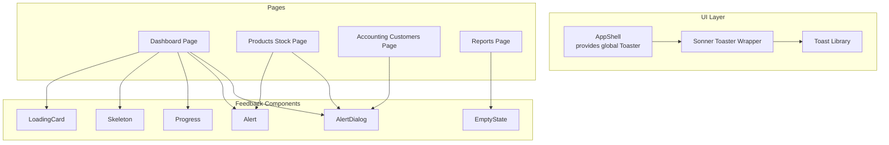
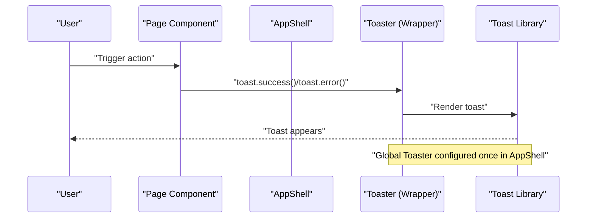
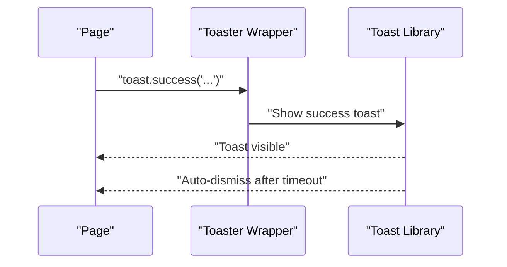
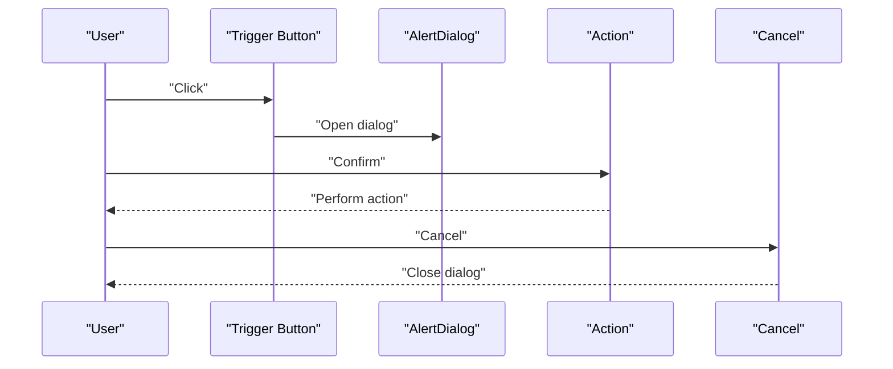
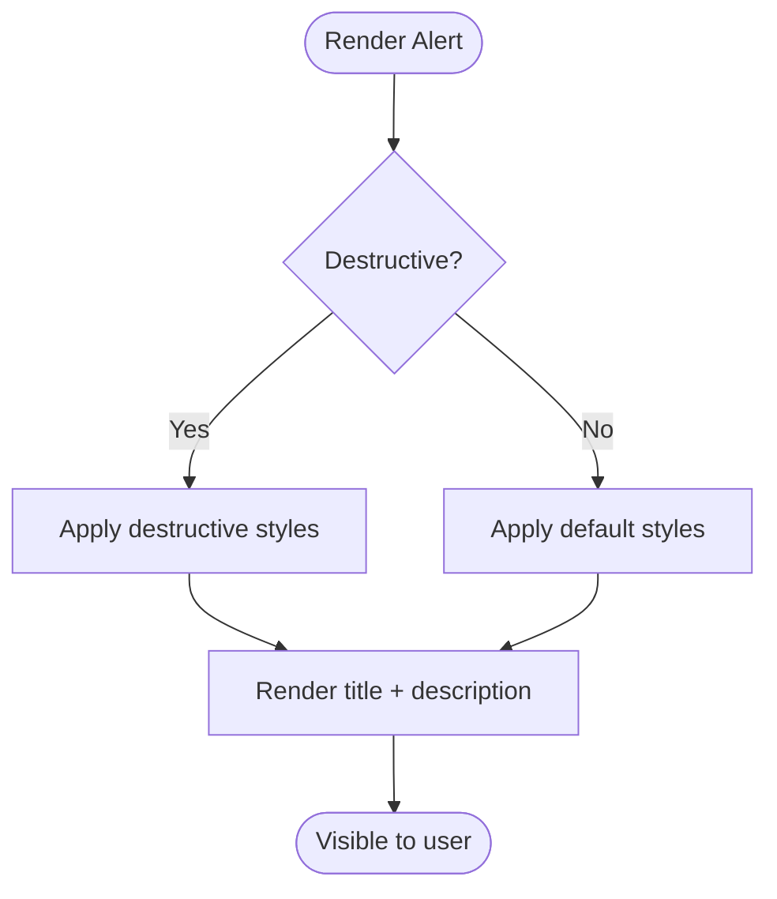
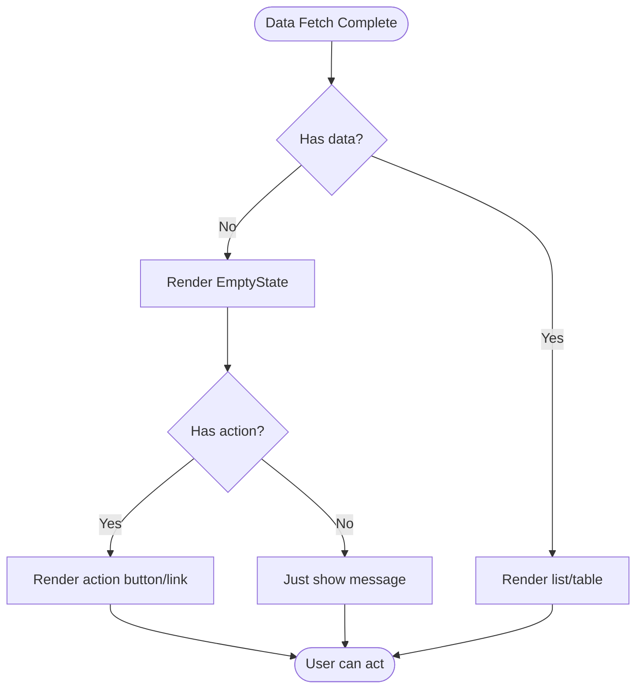
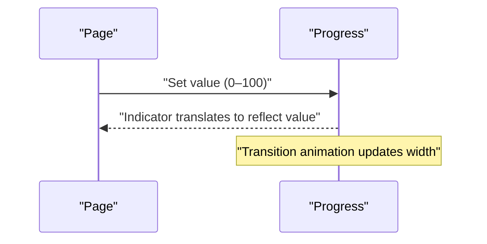
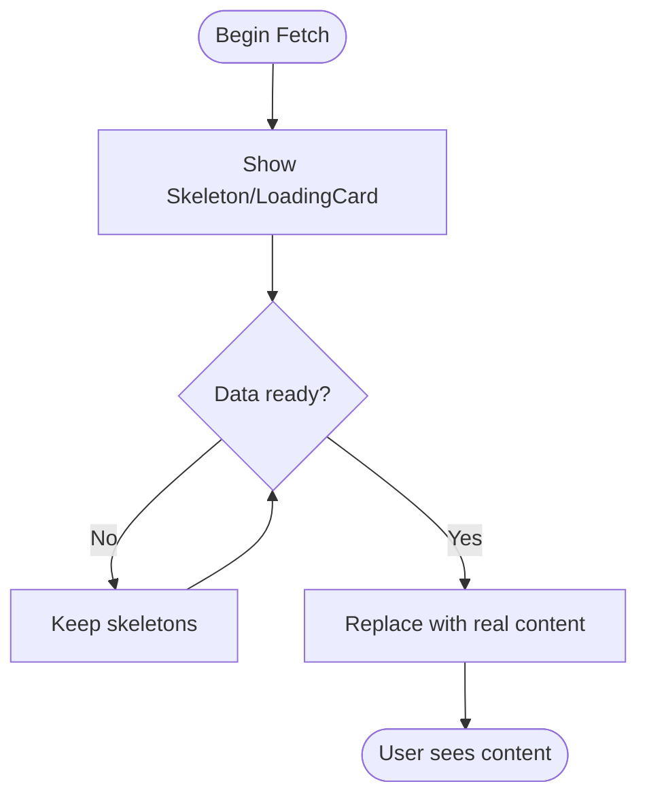
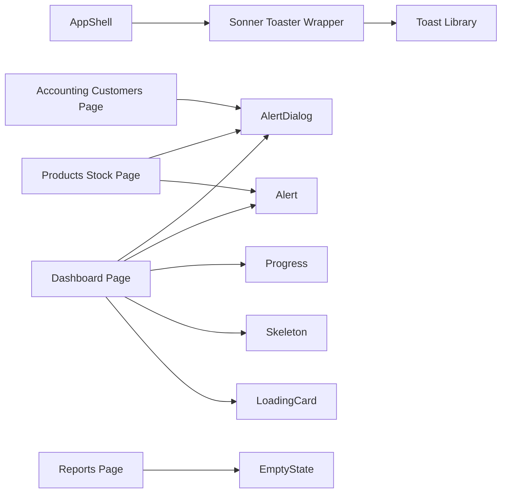

# Notification & Feedback Components

<cite>
**Referenced Files in This Document**
- [app-shell.tsx](file://src/components/app-shell.tsx)
- [sonner.tsx](file://src/components/ui/sonner.tsx)
- [alert-dialog.tsx](file://src/components/ui/alert-dialog.tsx)
- [alert.tsx](file://src/components/ui/alert.tsx)
- [empty-state.tsx](file://src/components/empty-state.tsx)
- [loading-card.tsx](file://src/components/loading-card.tsx)
- [progress.tsx](file://src/components/ui/progress.tsx)
- [skeleton.tsx](file://src/components/ui/skeleton.tsx)
- [dashboard/page.tsx](file://src/app/admin/dashboard/page.tsx)
- [products/[id]/stock/page.tsx](file://src/app/admin/products/[id]/stock/page.tsx)
- [accounting/customers/[id]/page.tsx](file://src/app/admin/accounting/customers/[id]/page.tsx)
- [reports/page.tsx](file://src/app/admin/reports/page.tsx)
</cite>

## Table of Contents
1. [Introduction](#introduction)
2. [Project Structure](#project-structure)
3. [Core Components](#core-components)
4. [Architecture Overview](#architecture-overview)
5. [Detailed Component Analysis](#detailed-component-analysis)
6. [Dependency Analysis](#dependency-analysis)
7. [Performance Considerations](#performance-considerations)
8. [Troubleshooting Guide](#troubleshooting-guide)
9. [Conclusion](#conclusion)

## Introduction
This document explains the notification and feedback systems used in Customer WebMahsul. It covers alert dialogs, toast notifications, empty state displays, and loading indicators. It also documents timing, user interaction patterns, accessibility considerations, animation sequences, dismissal behaviors, and stacking patterns. Practical examples are drawn from real application pages to illustrate success messages, error handling, confirmation dialogs, and progress indicators during asynchronous operations.

## Project Structure
The feedback stack is composed of:
- Toast notifications via a thin wrapper around a toast library
- Confirmation dialogs built on a dialog primitive
- Alert banners for inline contextual messaging
- Empty state placeholders for empty or filtered views
- Progress bars for long-running or multi-step operations
- Skeleton loaders for perceived performance during data fetches

**Diagram sources**
- [app-shell.tsx:87](file://src/components/app-shell.tsx#L87)
- [sonner.tsx:13-38](file://src/components/ui/sonner.tsx#L13-L38)
- [alert-dialog.tsx:9-157](file://src/components/ui/alert-dialog.tsx#L9-L157)
- [alert.tsx:22-66](file://src/components/ui/alert.tsx#L22-L66)
- [empty-state.tsx:12-38](file://src/components/empty-state.tsx#L12-L38)
- [progress.tsx:8-28](file://src/components/ui/progress.tsx#L8-L28)
- [skeleton.tsx:3-15](file://src/components/ui/skeleton.tsx#L3-L15)
- [loading-card.tsx:11-55](file://src/components/loading-card.tsx#L11-L55)
- [dashboard/page.tsx:266](file://src/app/admin/dashboard/page.tsx#L266)
- [products/[id]/stock/page.tsx:124](file://src/app/admin/products/[id]/stock/page.tsx#L124)
- [accounting/customers/[id]/page.tsx:85](file://src/app/admin/accounting/customers/[id]/page.tsx#L85)
- [reports/page.tsx:324](file://src/app/admin/reports/page.tsx#L324)

**Section sources**
- [app-shell.tsx:16-90](file://src/components/app-shell.tsx#L16-L90)
- [sonner.tsx:13-38](file://src/components/ui/sonner.tsx#L13-L38)

## Core Components
- Toast notifications: centralized via a Toaster component that wraps a toast library, enabling global success/error/info/warning/loading notifications.
- Alert dialogs: confirmation prompts with title, description, actions, and cancellations.
- Inline alerts: contextual banners for success/error messages within page content.
- Empty states: friendly placeholders with optional actions for empty or filtered lists.
- Progress indicators: determinate progress bars for multi-step or long-running tasks.
- Skeleton loaders: animated placeholders to communicate loading states.

**Section sources**
- [sonner.tsx:13-38](file://src/components/ui/sonner.tsx#L13-L38)
- [alert-dialog.tsx:9-157](file://src/components/ui/alert-dialog.tsx#L9-L157)
- [alert.tsx:22-66](file://src/components/ui/alert.tsx#L22-L66)
- [empty-state.tsx:12-38](file://src/components/empty-state.tsx#L12-L38)
- [progress.tsx:8-28](file://src/components/ui/progress.tsx#L8-L28)
- [skeleton.tsx:3-15](file://src/components/ui/skeleton.tsx#L3-L15)
- [loading-card.tsx:11-55](file://src/components/loading-card.tsx#L11-L55)

## Architecture Overview
The feedback architecture centers on a single Toaster instance rendered at the shell level. Pages trigger toast events through imported toast APIs. Dialogs and alerts are rendered locally on demand. Empty states and progress indicators are used to guide users during async operations.

**Diagram sources**
- [app-shell.tsx:87](file://src/components/app-shell.tsx#L87)
- [sonner.tsx:13-38](file://src/components/ui/sonner.tsx#L13-L38)

## Detailed Component Analysis

### Toast Notifications
- Purpose: Non-blocking, ephemeral feedback for operations (success, error, info, warning, loading).
- Placement: Global Toaster rendered in the application shell.
- Icons and theming: Custom icons and CSS variables align with the current theme.
- Stacking: Multiple toasts can appear; the library manages stacking order and auto-dismissal.
- Dismissal: Auto-dismiss after a delay; users can dismiss manually.

**Diagram sources**
- [app-shell.tsx:87](file://src/components/app-shell.tsx#L87)
- [sonner.tsx:13-38](file://src/components/ui/sonner.tsx#L13-L38)

Examples from application pages:
- Success: [products/[id]/stock/page.tsx:124](file://src/app/admin/products/[id]/stock/page.tsx#L124)
- Error: [products/[id]/stock/page.tsx:95](file://src/app/admin/products/[id]/stock/page.tsx#L95), [products/[id]/stock/page.tsx:105](file://src/app/admin/products/[id]/stock/page.tsx#L105), [products/[id]/stock/page.tsx:129](file://src/app/admin/products/[id]/stock/page.tsx#L129)
- Dashboard error: [dashboard/page.tsx:75](file://src/app/admin/dashboard/page.tsx#L75)

Accessibility considerations:
- Ensure toast messages are concise and actionable.
- Prefer keyboard-accessible triggers and avoid relying solely on motion.
- Keep auto-dismiss timeouts reasonable to allow reading.

Timing and UX:
- Use loading toasts before long operations.
- Show success immediately after completion.
- Show error toasts with clear, user-friendly messages.

**Section sources**
- [sonner.tsx:13-38](file://src/components/ui/sonner.tsx#L13-L38)
- [app-shell.tsx:87](file://src/components/app-shell.tsx#L87)
- [products/[id]/stock/page.tsx:95-129](file://src/app/admin/products/[id]/stock/page.tsx#L95-L129)
- [dashboard/page.tsx:75](file://src/app/admin/dashboard/page.tsx#L75)

### Alert Dialogs
- Purpose: Confirm destructive or important actions with explicit choices.
- Composition: Overlay, Content, Header/Footer, Title, Description, Action, Cancel.
- Animations: Fade and zoom transitions driven by open/closed state.
- Interaction: Trigger opens the dialog; Action confirms; Cancel closes without action.

**Diagram sources**
- [alert-dialog.tsx:9-157](file://src/components/ui/alert-dialog.tsx#L9-L157)

Usage examples:
- Confirmation dialogs are used in product stock management and similar workflows across pages.

Accessibility considerations:
- Focus management: ensure focus moves into the dialog and returns to the trigger on close.
- Keyboard navigation: support Escape to close.
- ARIA roles: ensure title and description are announced.

**Section sources**
- [alert-dialog.tsx:9-157](file://src/components/ui/alert-dialog.tsx#L9-L157)

### Inline Alerts
- Purpose: Present contextual messages (success, error) directly in page content.
- Variants: Default and destructive variants.
- Accessibility: Uses role="alert" to signal assistive technologies.

**Diagram sources**
- [alert.tsx:6-20](file://src/components/ui/alert.tsx#L6-L20)

**Section sources**
- [alert.tsx:22-66](file://src/components/ui/alert.tsx#L22-L66)

### Empty States
- Purpose: Friendly messaging when lists or views are empty or filtered with no results.
- Composition: Optional icon, title, description, and action.
- Behavior: Encourage user actions (e.g., add new item).

**Diagram sources**
- [empty-state.tsx:12-38](file://src/components/empty-state.tsx#L12-L38)
- [reports/page.tsx:322-324](file://src/app/admin/reports/page.tsx#L322-L324)

**Section sources**
- [empty-state.tsx:12-38](file://src/components/empty-state.tsx#L12-L38)
- [reports/page.tsx:322-324](file://src/app/admin/reports/page.tsx#L322-L324)

### Progress Indicators
- Purpose: Visualize completion percentage for long-running or multi-step operations.
- Implementation: Determinate indicator with smooth transitions.
- Usage: Commonly shown alongside loading cards or metrics.

**Diagram sources**
- [progress.tsx:8-28](file://src/components/ui/progress.tsx#L8-L28)
- [dashboard/page.tsx:266](file://src/app/admin/dashboard/page.tsx#L266)

**Section sources**
- [progress.tsx:8-28](file://src/components/ui/progress.tsx#L8-L28)
- [dashboard/page.tsx:266](file://src/app/admin/dashboard/page.tsx#L266)

### Skeleton and Loading Cards
- Purpose: Communicate that content is loading while preserving layout.
- Skeleton: Lightweight animated pulse effect.
- LoadingCard: Card-based skeleton with configurable header and rows.
- LoadingMetric: Compact skeleton for metric cards.

**Diagram sources**
- [skeleton.tsx:3-15](file://src/components/ui/skeleton.tsx#L3-L15)
- [loading-card.tsx:11-55](file://src/components/loading-card.tsx#L11-L55)

**Section sources**
- [skeleton.tsx:3-15](file://src/components/ui/skeleton.tsx#L3-L15)
- [loading-card.tsx:11-55](file://src/components/loading-card.tsx#L11-L55)
- [dashboard/page.tsx:348](file://src/app/admin/dashboard/page.tsx#L348)

## Dependency Analysis
- AppShell renders the Toaster globally, ensuring all pages can trigger toast notifications without local setup.
- Sonner wrapper configures icons, theme, and CSS variables for consistent appearance.
- Dialogs and alerts are self-contained UI primitives with minimal external dependencies.
- Empty states and progress indicators are standalone components used across pages.
- Skeleton and LoadingCard depend on shared UI primitives for consistent styling.

**Diagram sources**
- [app-shell.tsx:87](file://src/components/app-shell.tsx#L87)
- [sonner.tsx:13-38](file://src/components/ui/sonner.tsx#L13-L38)
- [alert-dialog.tsx:9-157](file://src/components/ui/alert-dialog.tsx#L9-L157)
- [alert.tsx:22-66](file://src/components/ui/alert.tsx#L22-L66)
- [empty-state.tsx:12-38](file://src/components/empty-state.tsx#L12-L38)
- [progress.tsx:8-28](file://src/components/ui/progress.tsx#L8-L28)
- [skeleton.tsx:3-15](file://src/components/ui/skeleton.tsx#L3-L15)
- [loading-card.tsx:11-55](file://src/components/loading-card.tsx#L11-L55)

**Section sources**
- [app-shell.tsx:87](file://src/components/app-shell.tsx#L87)
- [sonner.tsx:13-38](file://src/components/ui/sonner.tsx#L13-L38)

## Performance Considerations
- Toast stacking: Limit concurrent toasts to avoid visual clutter; group related updates when possible.
- Skeleton usage: Prefer skeleton over full-page spinners to maintain perceived performance.
- Progress updates: Batch progress updates to reduce re-renders; throttle updates for long tasks.
- Dialogs: Keep content lightweight; defer heavy initialization until the dialog is opened.

## Troubleshooting Guide
Common issues and resolutions:
- Toasts not appearing:
  - Ensure the Toaster is rendered in the shell.
  - Verify the toast wrapper is imported and used correctly.
  - Check for theme-related CSS variable overrides.
  - References: [app-shell.tsx:87](file://src/components/app-shell.tsx#L87), [sonner.tsx:13-38](file://src/components/ui/sonner.tsx#L13-L38)
- Dialog does not close:
  - Confirm cancel/close handlers are wired.
  - Ensure overlay click-to-close is enabled if desired.
  - References: [alert-dialog.tsx:9-157](file://src/components/ui/alert-dialog.tsx#L9-L157)
- Empty state not visible:
  - Verify data fetch logic sets empty state when appropriate.
  - Ensure action prop is passed if an action is intended.
  - References: [empty-state.tsx:12-38](file://src/components/empty-state.tsx#L12-L38), [reports/page.tsx:322-324](file://src/app/admin/reports/page.tsx#L322-L324)
- Progress not updating:
  - Ensure value prop is a number between 0 and 100.
  - Verify parent container allows the progress bar to render.
  - References: [progress.tsx:8-28](file://src/components/ui/progress.tsx#L8-L28), [dashboard/page.tsx:266](file://src/app/admin/dashboard/page.tsx#L266)
- Skeleton looks static:
  - Confirm the pulse animation class is applied.
  - References: [skeleton.tsx:3-15](file://src/components/ui/skeleton.tsx#L3-L15)

**Section sources**
- [app-shell.tsx:87](file://src/components/app-shell.tsx#L87)
- [sonner.tsx:13-38](file://src/components/ui/sonner.tsx#L13-L38)
- [alert-dialog.tsx:9-157](file://src/components/ui/alert-dialog.tsx#L9-L157)
- [empty-state.tsx:12-38](file://src/components/empty-state.tsx#L12-L38)
- [progress.tsx:8-28](file://src/components/ui/progress.tsx#L8-L28)
- [skeleton.tsx:3-15](file://src/components/ui/skeleton.tsx#L3-L15)

## Conclusion
Customer WebMahsul’s feedback system combines a global toast layer with localized UI primitives to deliver timely, accessible, and user-friendly feedback. By centralizing toasts in the shell, the system ensures consistent behavior across pages. Dialogs, alerts, empty states, progress indicators, and skeleton loaders work together to guide users through asynchronous operations and present meaningful outcomes. Following the guidelines and examples in this document will help maintain a coherent and effective feedback experience.