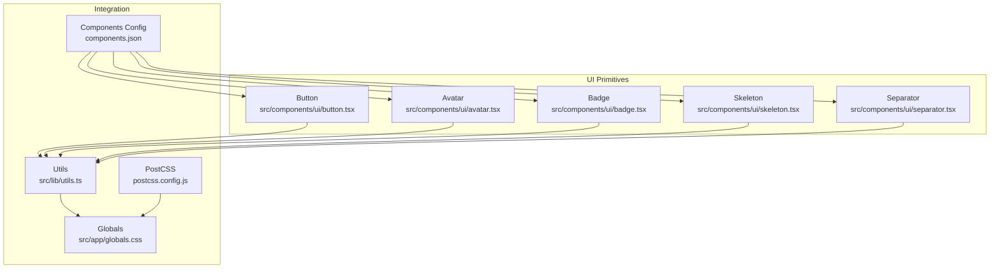
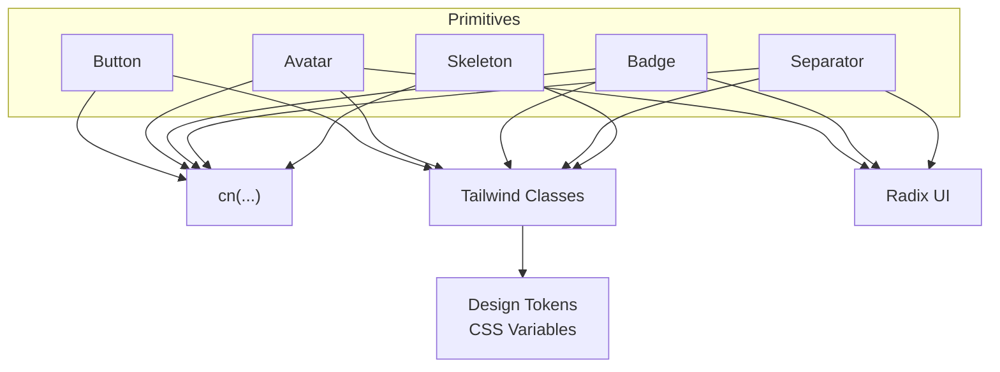
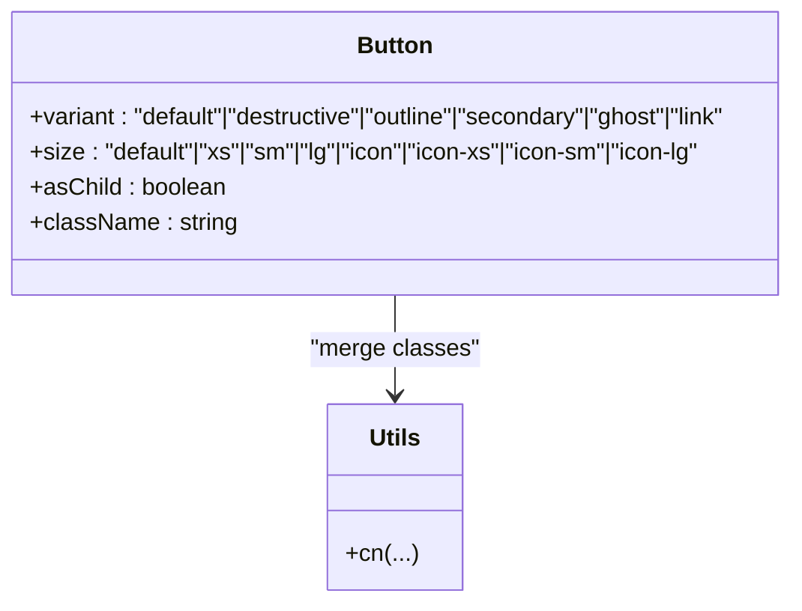
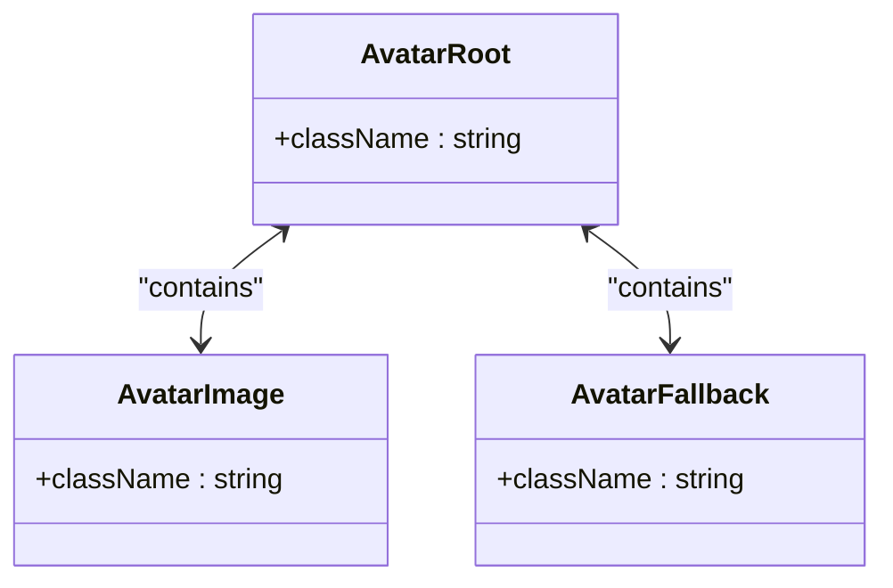
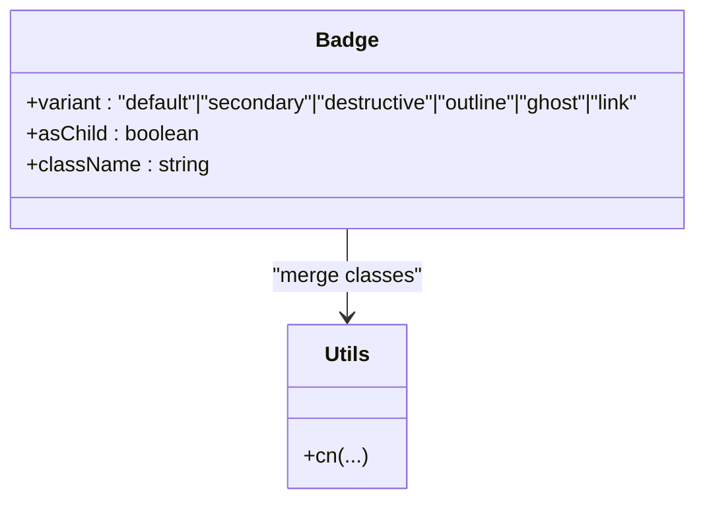
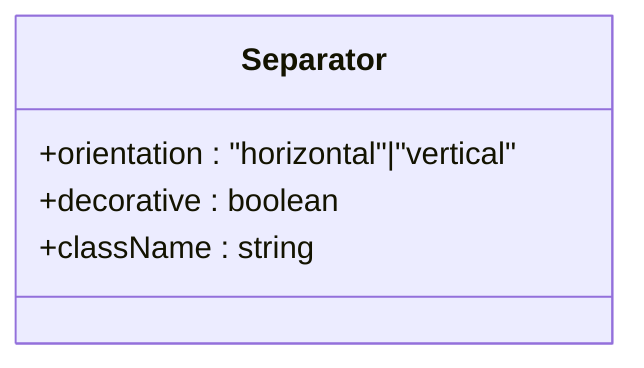
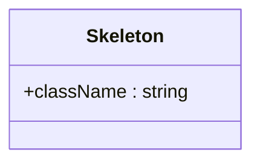
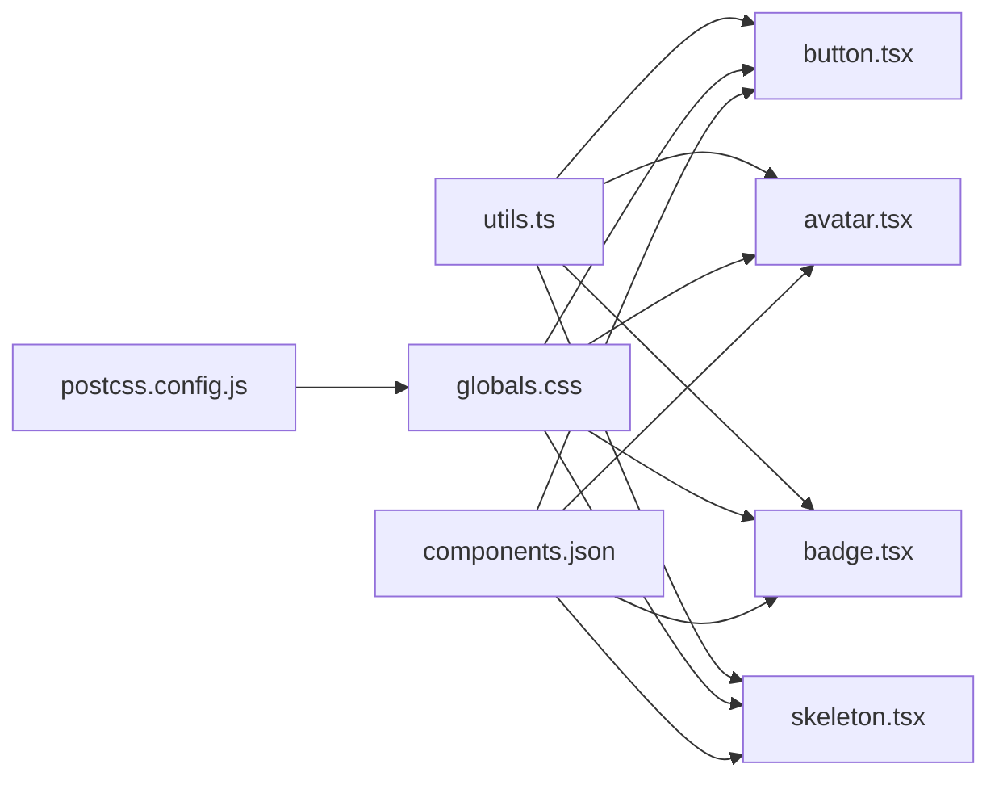
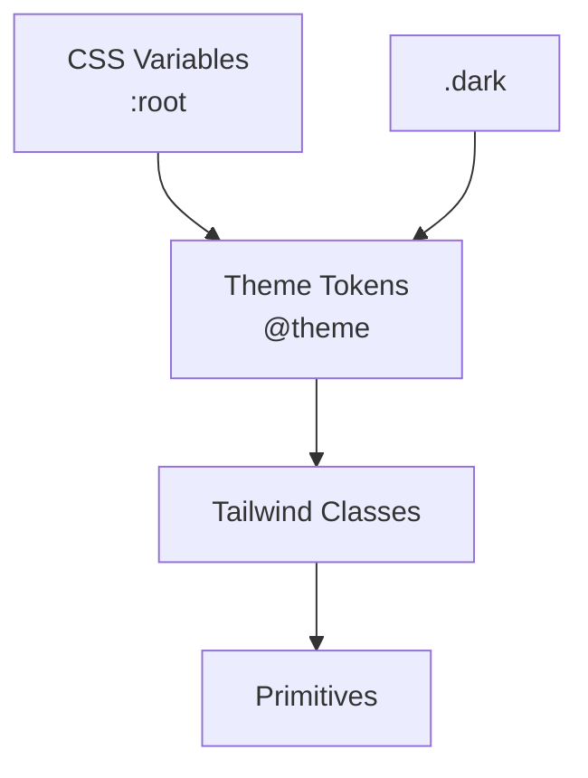

# UI Primitives

<cite>
**Referenced Files in This Document**
- [button.tsx](file://src/components/ui/button.tsx)
- [avatar.tsx](file://src/components/ui/avatar.tsx)
- [badge.tsx](file://src/components/ui/badge.tsx)
- [separator.tsx](file://src/components/ui/separator.tsx)
- [skeleton.tsx](file://src/components/ui/skeleton.tsx)
- [status-badge.tsx](file://src/components/status-badge.tsx)
- [theme-toggle.tsx](file://src/components/theme-toggle.tsx)
- [globals.css](file://src/app/globals.css)
- [utils.ts](file://src/lib/utils.ts)
- [components.json](file://components.json)
- [postcss.config.js](file://postcss.config.js)
</cite>

## Table of Contents
1. [Introduction](#introduction)
2. [Project Structure](#project-structure)
3. [Core Components](#core-components)
4. [Architecture Overview](#architecture-overview)
5. [Detailed Component Analysis](#detailed-component-analysis)
6. [Dependency Analysis](#dependency-analysis)
7. [Performance Considerations](#performance-considerations)
8. [Troubleshooting Guide](#troubleshooting-guide)
9. [Conclusion](#conclusion)
10. [Appendices](#appendices)

## Introduction
This document describes the foundational UI primitive components that serve as building blocks for the Customer WebMahsul interface: Button, Avatar, Badge, Separator, and Skeleton. It explains component props, variants, sizes, colors, styling customization, accessibility features, responsive behavior, and how these primitives integrate with the design tokens, spacing system, and color palette. It also provides guidelines for extending primitives and maintaining consistency across the component library.

## Project Structure
The primitives live under the UI module and are styled via Tailwind CSS with design tokens defined in the global stylesheet. Utilities consolidate class merging, while configuration files define the design system’s shape and integration.

**Diagram sources**
- [button.tsx:1-65](file://src/components/ui/button.tsx#L1-L65)
- [avatar.tsx:1-51](file://src/components/ui/avatar.tsx#L1-L51)
- [badge.tsx:1-49](file://src/components/ui/badge.tsx#L1-L49)
- [separator.tsx:1-32](file://src/components/ui/separator.tsx#L1-L32)
- [skeleton.tsx:1-16](file://src/components/ui/skeleton.tsx#L1-L16)
- [utils.ts:1-7](file://src/lib/utils.ts#L1-L7)
- [globals.css:1-128](file://src/app/globals.css#L1-L128)
- [components.json:1-23](file://components.json#L1-L23)
- [postcss.config.js:1-6](file://postcss.config.js#L1-L6)

**Section sources**
- [button.tsx:1-65](file://src/components/ui/button.tsx#L1-L65)
- [avatar.tsx:1-51](file://src/components/ui/avatar.tsx#L1-L51)
- [badge.tsx:1-49](file://src/components/ui/badge.tsx#L1-L49)
- [separator.tsx:1-32](file://src/components/ui/separator.tsx#L1-L32)
- [skeleton.tsx:1-16](file://src/components/ui/skeleton.tsx#L1-L16)
- [utils.ts:1-7](file://src/lib/utils.ts#L1-L7)
- [globals.css:1-128](file://src/app/globals.css#L1-L128)
- [components.json:1-23](file://components.json#L1-L23)
- [postcss.config.js:1-6](file://postcss.config.js#L1-L6)

## Core Components
This section summarizes the props, variants, sizes, colors, and customization options for each primitive.

- Button
  - Purpose: Interactive actions with strong affordance.
  - Props:
    - variant: default, destructive, outline, secondary, ghost, link
    - size: default, xs, sm, lg, icon, icon-xs, icon-sm, icon-lg
    - asChild: render as a slot wrapper
    - className: additional Tailwind classes
  - Accessibility: Focus-visible ring, aria-invalid support, pointer events disabled when disabled.
  - Responsive: Uses rem-based sizing and padding; icons scale appropriately.
  - Customization: Accepts className; variant and size classes are merged via utility function.

- Avatar
  - Purpose: Display user or entity identity with image fallback.
  - Props:
    - Root: container props
    - Image: img props
    - Fallback: fallback content props
  - Accessibility: Delegates to Radix primitives; supports decorative semantics.
  - Customization: Accepts className; maintains aspect ratio and rounded-full by default.

- Badge
  - Purpose: Short labels for status, categories, or metadata.
  - Props:
    - variant: default, secondary, destructive, outline, ghost, link
    - asChild: render as a slot wrapper
    - className: additional Tailwind classes
  - Accessibility: Focus-visible ring and border styles; supports aria-invalid.
  - Customization: Accepts className; variant classes applied via variant engine.

- Separator
  - Purpose: Visually separate sections or group related content.
  - Props:
    - orientation: horizontal or vertical
    - decorative: whether to mark as decorative
    - className: additional Tailwind classes
  - Accessibility: Uses Radix primitive; decorative prop controls semantic importance.
  - Customization: Accepts className; thickness controlled by orientation.

- Skeleton
  - Purpose: Provide perceived loading feedback while content loads.
  - Props:
    - className: additional Tailwind classes
  - Behavior: Applies pulse animation and muted background.
  - Customization: Accepts className; wraps a div.

**Section sources**
- [button.tsx:7-39](file://src/components/ui/button.tsx#L7-L39)
- [avatar.tsx:8-48](file://src/components/ui/avatar.tsx#L8-L48)
- [badge.tsx:7-27](file://src/components/ui/badge.tsx#L7-L27)
- [separator.tsx:8-28](file://src/components/ui/separator.tsx#L8-L28)
- [skeleton.tsx:3-13](file://src/components/ui/skeleton.tsx#L3-L13)

## Architecture Overview
The primitives rely on:
- Utility function for safe class merging
- Tailwind CSS for atomic styling and design tokens
- Radix UI primitives for accessible semantics
- Configuration files to align with the design system

**Diagram sources**
- [utils.ts:4-6](file://src/lib/utils.ts#L4-L6)
- [globals.css:6-44](file://src/app/globals.css#L6-L44)
- [avatar.tsx:4-4](file://src/components/ui/avatar.tsx#L4-L4)
- [badge.tsx:3-3](file://src/components/ui/badge.tsx#L3-L3)
- [separator.tsx:4-4](file://src/components/ui/separator.tsx#L4-L4)
- [button.tsx:2-5](file://src/components/ui/button.tsx#L2-L5)

## Detailed Component Analysis

### Button
- Variants and sizes are defined via a variant engine and applied conditionally.
- Focus-visible ring integrates with the design token for ring color.
- Disabled state applies opacity and disables pointer events.
- Icon support scales SVGs inside the button consistently.

**Diagram sources**
- [button.tsx:7-39](file://src/components/ui/button.tsx#L7-L39)
- [utils.ts:4-6](file://src/lib/utils.ts#L4-L6)

**Section sources**
- [button.tsx:7-39](file://src/components/ui/button.tsx#L7-L39)
- [button.tsx:41-62](file://src/components/ui/button.tsx#L41-L62)
- [utils.ts:4-6](file://src/lib/utils.ts#L4-L6)

### Avatar
- Composed of three parts: root container, image, and fallback.
- Uses Radix UI for semantics and accessibility.
- Maintains square aspect ratio and circular clipping.

**Diagram sources**
- [avatar.tsx:8-21](file://src/components/ui/avatar.tsx#L8-L21)
- [avatar.tsx:23-33](file://src/components/ui/avatar.tsx#L23-L33)
- [avatar.tsx:35-48](file://src/components/ui/avatar.tsx#L35-L48)

**Section sources**
- [avatar.tsx:8-21](file://src/components/ui/avatar.tsx#L8-L21)
- [avatar.tsx:23-33](file://src/components/ui/avatar.tsx#L23-L33)
- [avatar.tsx:35-48](file://src/components/ui/avatar.tsx#L35-L48)

### Badge
- Variant engine defines color roles and hover states.
- Supports wrapping with a slot for composition.

**Diagram sources**
- [badge.tsx:7-27](file://src/components/ui/badge.tsx#L7-L27)
- [utils.ts:4-6](file://src/lib/utils.ts#L4-L6)

**Section sources**
- [badge.tsx:7-27](file://src/components/ui/badge.tsx#L7-L27)
- [badge.tsx:29-46](file://src/components/ui/badge.tsx#L29-L46)
- [utils.ts:4-6](file://src/lib/utils.ts#L4-L6)

### Separator
- Orientation-driven thickness and dimension.
- Decorative prop controls semantic importance.

**Diagram sources**
- [separator.tsx:8-28](file://src/components/ui/separator.tsx#L8-L28)

**Section sources**
- [separator.tsx:8-28](file://src/components/ui/separator.tsx#L8-L28)

### Skeleton
- Provides a simple animated placeholder.

**Diagram sources**
- [skeleton.tsx:3-13](file://src/components/ui/skeleton.tsx#L3-L13)

**Section sources**
- [skeleton.tsx:3-13](file://src/components/ui/skeleton.tsx#L3-L13)

## Dependency Analysis
- Utilities: Centralized class merging via a single utility function.
- Styles: Design tokens defined in CSS variables and consumed by Tailwind.
- Configuration: Components registry and aliases configured for consistent imports and styling.

**Diagram sources**
- [utils.ts:4-6](file://src/lib/utils.ts#L4-L6)
- [button.tsx:5-5](file://src/components/ui/button.tsx#L5-L5)
- [avatar.tsx:6-6](file://src/components/ui/avatar.tsx#L6-L6)
- [badge.tsx:5-5](file://src/components/ui/badge.tsx#L5-L5)
- [skeleton.tsx:1-1](file://src/components/ui/skeleton.tsx#L1-L1)
- [globals.css:6-44](file://src/app/globals.css#L6-L44)
- [components.json:6-21](file://components.json#L6-L21)
- [postcss.config.js:1-6](file://postcss.config.js#L1-L6)

**Section sources**
- [utils.ts:4-6](file://src/lib/utils.ts#L4-L6)
- [globals.css:6-44](file://src/app/globals.css#L6-L44)
- [components.json:6-21](file://components.json#L6-L21)
- [postcss.config.js:1-6](file://postcss.config.js#L1-L6)

## Performance Considerations
- Prefer variant and size props over ad-hoc classes to keep the class payload minimal.
- Use Skeleton sparingly during initial renders; avoid animating heavy content.
- Avatar images should be optimized; leverage browser lazy-loading attributes when appropriate.
- Badge text should remain short to minimize layout shifts.

## Troubleshooting Guide
- Button disabled state not applying:
  - Ensure the disabled prop is passed; verify that pointer-events and opacity classes are present.
- Button icon sizing inconsistent:
  - Confirm that icons inside the button use supported sizes and that the button size prop is set appropriately.
- Badge variant not taking effect:
  - Verify the variant prop matches one of the supported values and that className does not override conflicting classes unintentionally.
- Separator orientation not visible:
  - Check orientation value and confirm the container has sufficient space along the perpendicular axis.
- Avatar fallback not showing:
  - Ensure the image fails to load or the src is missing; confirm fallback styles are not overridden.
- Skeleton not animating:
  - Confirm the pulse animation is not globally disabled and that the muted background is applied.

**Section sources**
- [button.tsx:7-39](file://src/components/ui/button.tsx#L7-L39)
- [badge.tsx:7-27](file://src/components/ui/badge.tsx#L7-L27)
- [separator.tsx:12-28](file://src/components/ui/separator.tsx#L12-L28)
- [avatar.tsx:23-48](file://src/components/ui/avatar.tsx#L23-L48)
- [skeleton.tsx:3-13](file://src/components/ui/skeleton.tsx#L3-L13)

## Conclusion
These primitives provide a consistent, accessible, and extensible foundation for Customer WebMahsul. By leveraging design tokens, variant engines, and Radix UI semantics, they ensure predictable behavior across contexts. Extending them should follow established patterns: add variants via the variant engine, keep accessibility defaults, and maintain alignment with the design system.

## Appendices

### Design Tokens, Spacing, and Color Palette
- Design tokens are defined as CSS variables and exposed to Tailwind via a theme block.
- Colors include primary, secondary, muted, accent, destructive, border, input, and ring.
- Radius tokens define corner radii for consistent rounding.
- Dark mode adjusts color values for contrast and readability.

**Diagram sources**
- [globals.css:46-79](file://src/app/globals.css#L46-L79)
- [globals.css:81-113](file://src/app/globals.css#L81-L113)
- [globals.css:6-44](file://src/app/globals.css#L6-L44)

**Section sources**
- [globals.css:46-79](file://src/app/globals.css#L46-L79)
- [globals.css:81-113](file://src/app/globals.css#L81-L113)
- [globals.css:6-44](file://src/app/globals.css#L6-L44)

### Usage Examples and Patterns
- Button
  - Pattern: Use variant and size props; pass className for minor overrides; avoid overriding variant classes.
  - Accessibility: Keep focus-visible ring; avoid disabling pointer-events manually.
- Avatar
  - Pattern: Wrap image and fallback; ensure alt text on image; avoid fixed dimensions unless intended.
- Badge
  - Pattern: Use variant to communicate meaning; combine with StatusBadge for domain-specific statuses.
- Separator
  - Pattern: Choose orientation based on layout; use decorative when visually separating only.
- Skeleton
  - Pattern: Wrap content areas; avoid animating large lists; remove after data loads.

**Section sources**
- [button.tsx:41-62](file://src/components/ui/button.tsx#L41-L62)
- [avatar.tsx:8-48](file://src/components/ui/avatar.tsx#L8-L48)
- [badge.tsx:29-46](file://src/components/ui/badge.tsx#L29-L46)
- [separator.tsx:12-28](file://src/components/ui/separator.tsx#L12-L28)
- [skeleton.tsx:3-13](file://src/components/ui/skeleton.tsx#L3-L13)
- [status-badge.tsx:40-62](file://src/components/status-badge.tsx#L40-L62)

### Extending Primitives and Consistency Guidelines
- Extend Button/Badge:
  - Add new variant entries in the variant engine; keep hover/focus/aria-invalid states consistent.
  - Use design tokens for colors and ring focus styles.
- Maintain consistency:
  - Use the utility function for class merging.
  - Align sizes and radii with existing tokens.
  - Preserve accessibility defaults (focus-visible, aria-invalid).
- Example extension pattern:
  - Introduce a new variant in the variant engine; apply consistent hover/focus states; update documentation and usage examples.

**Section sources**
- [button.tsx:7-39](file://src/components/ui/button.tsx#L7-L39)
- [badge.tsx:7-27](file://src/components/ui/badge.tsx#L7-L27)
- [utils.ts:4-6](file://src/lib/utils.ts#L4-L6)
- [globals.css:6-44](file://src/app/globals.css#L6-L44)