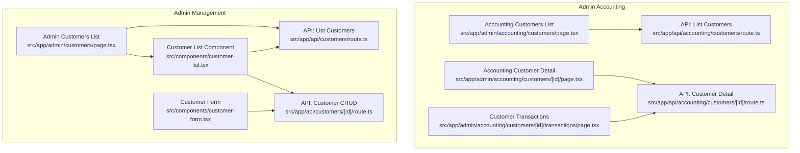
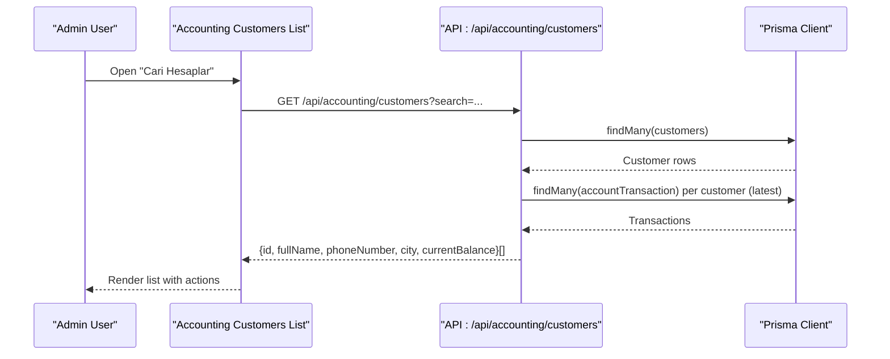
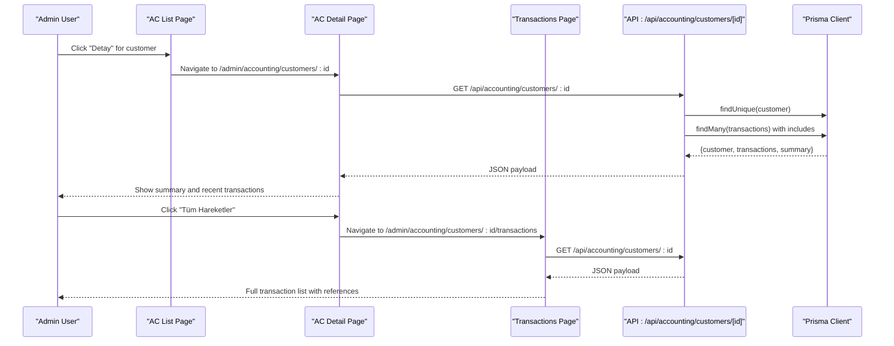
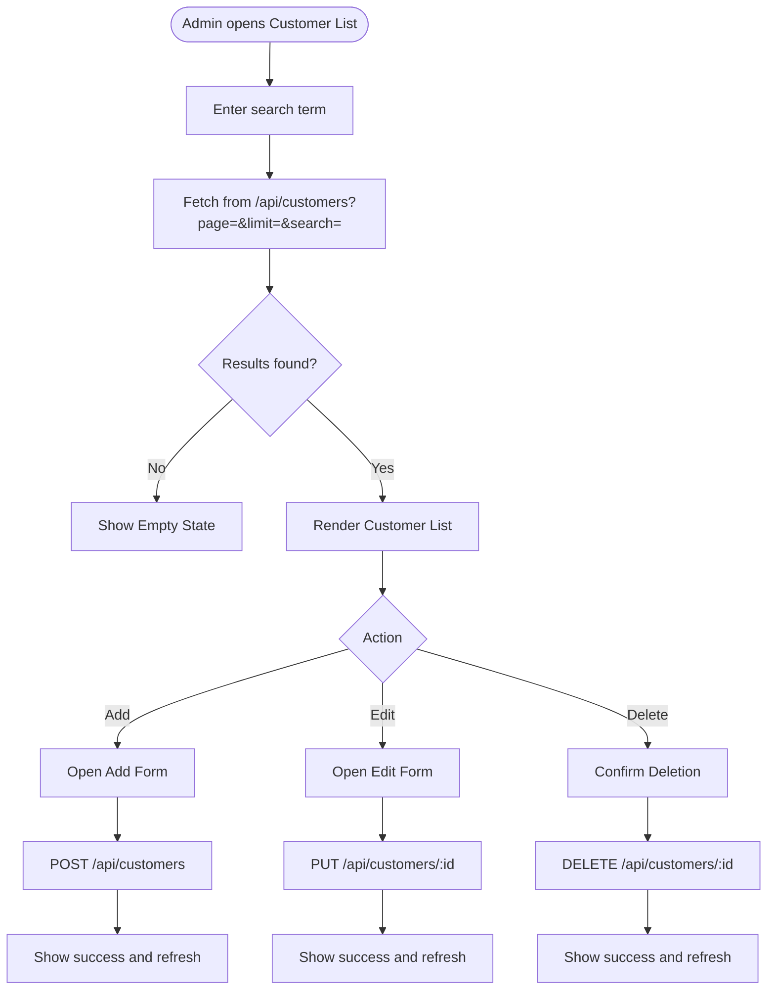
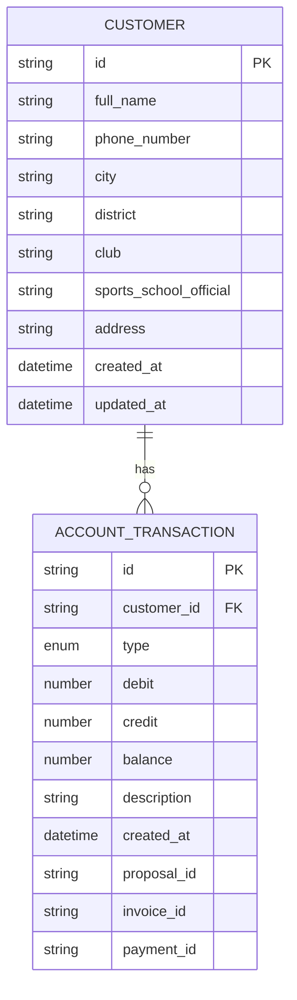
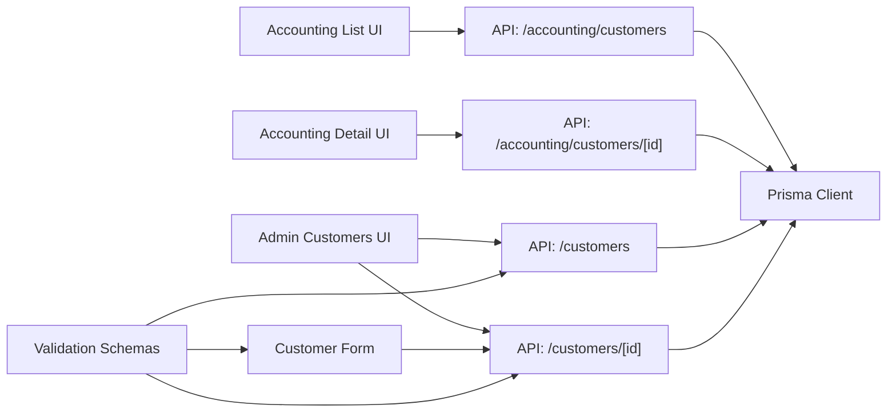

# Administrative Customer Operations

<cite>
**Referenced Files in This Document**
- [src/app/admin/accounting/customers/page.tsx](file://src/app/admin/accounting/customers/page.tsx)
- [src/app/admin/accounting/customers/[id]/page.tsx](file://src/app/admin/accounting/customers/[id]/page.tsx)
- [src/app/admin/accounting/customers/[id]/transactions/page.tsx](file://src/app/admin/accounting/customers/[id]/transactions/page.tsx)
- [src/app/api/accounting/customers/route.ts](file://src/app/api/accounting/customers/route.ts)
- [src/app/api/accounting/customers/[id]/route.ts](file://src/app/api/accounting/customers/[id]/route.ts)
- [src/app/admin/customers/page.tsx](file://src/app/admin/customers/page.tsx)
- [src/app/api/customers/route.ts](file://src/app/api/customers/route.ts)
- [src/app/api/customers/[id]/route.ts](file://src/app/api/customers/[id]/route.ts)
- [src/components/customer-form.tsx](file://src/components/customer-form.tsx)
- [src/components/customer-list.tsx](file://src/components/customer-list.tsx)
- [src/app/customers/[id]/page.tsx](file://src/app/customers/[id]/page.tsx)
- [src/app/customers/[id]/edit/page.tsx](file://src/app/customers/[id]/edit/page.tsx)
- [src/lib/validations.ts](file://src/lib/validations.ts)
- [src/lib/types.ts](file://src/lib/types.ts)
</cite>

## Table of Contents
1. [Introduction](#introduction)
2. [Project Structure](#project-structure)
3. [Core Components](#core-components)
4. [Architecture Overview](#architecture-overview)
5. [Detailed Component Analysis](#detailed-component-analysis)
6. [Dependency Analysis](#dependency-analysis)
7. [Performance Considerations](#performance-considerations)
8. [Troubleshooting Guide](#troubleshooting-guide)
9. [Conclusion](#conclusion)

## Introduction
This document describes the administrative customer operations implemented in the application. It covers full customer management capabilities from the admin panel, including profile editing, transaction history viewing, and customer activity monitoring. It also documents administrative workflows for customer onboarding, profile updates, status changes, transaction management, payment history review, financial relationship tracking, bulk customer operations, customer segmentation, administrative reporting features, customer deactivation procedures, data export capabilities, and audit trail functionality.

## Project Structure
The administrative customer features are organized around two primary areas:
- Admin accounting views for financial oversight (customer balances, transactions)
- Admin customer management for CRUD operations and bulk actions

**Diagram sources**
- [src/app/admin/accounting/customers/page.tsx:1-176](file://src/app/admin/accounting/customers/page.tsx#L1-L176)
- [src/app/admin/accounting/customers/[id]/page.tsx:1-366](file://src/app/admin/accounting/customers/[id]/page.tsx#L1-L366)
- [src/app/admin/accounting/customers/[id]/transactions/page.tsx:1-216](file://src/app/admin/accounting/customers/[id]/transactions/page.tsx#L1-L216)
- [src/app/api/accounting/customers/route.ts:1-54](file://src/app/api/accounting/customers/route.ts#L1-L54)
- [src/app/api/accounting/customers/[id]/route.ts:1-139](file://src/app/api/accounting/customers/[id]/route.ts#L1-L139)
- [src/app/admin/customers/page.tsx:1-42](file://src/app/admin/customers/page.tsx#L1-L42)
- [src/app/api/customers/route.ts:1-105](file://src/app/api/customers/route.ts#L1-L105)
- [src/app/api/customers/[id]/route.ts:1-121](file://src/app/api/customers/[id]/route.ts#L1-L121)
- [src/components/customer-form.tsx:1-265](file://src/components/customer-form.tsx#L1-L265)
- [src/components/customer-list.tsx:1-319](file://src/components/customer-list.tsx#L1-L319)

**Section sources**
- [src/app/admin/accounting/customers/page.tsx:1-176](file://src/app/admin/accounting/customers/page.tsx#L1-L176)
- [src/app/admin/accounting/customers/[id]/page.tsx:1-366](file://src/app/admin/accounting/customers/[id]/page.tsx#L1-L366)
- [src/app/admin/accounting/customers/[id]/transactions/page.tsx:1-216](file://src/app/admin/accounting/customers/[id]/transactions/page.tsx#L1-L216)
- [src/app/admin/customers/page.tsx:1-42](file://src/app/admin/customers/page.tsx#L1-L42)
- [src/components/customer-list.tsx:1-319](file://src/components/customer-list.tsx#L1-L319)
- [src/components/customer-form.tsx:1-265](file://src/components/customer-form.tsx#L1-L265)

## Core Components
- Accounting customer list: displays customers with balances and quick actions to view details and transactions.
- Accounting customer detail: shows financial summary, customer info, and recent transactions.
- Customer transactions view: lists all transactions with references and balances.
- Admin customer list: paginated, searchable list with add/edit/delete actions.
- Customer form: reusable form for creating/updating customer profiles with validation.
- Customer API endpoints: list, create, update, delete customers; detail endpoint for accounting.

Key capabilities:
- Profile editing via admin form with validation and sanitization.
- Transaction history viewing with references to proposals/invoices/payments.
- Financial relationship tracking via totals and balances.
- Bulk operations: list with pagination and search; delete with cascade.
- Administrative reporting: financial summaries and transaction listings.

**Section sources**
- [src/app/admin/accounting/customers/page.tsx:36-176](file://src/app/admin/accounting/customers/page.tsx#L36-L176)
- [src/app/admin/accounting/customers/[id]/page.tsx:63-366](file://src/app/admin/accounting/customers/[id]/page.tsx#L63-L366)
- [src/app/admin/accounting/customers/[id]/transactions/page.tsx:41-216](file://src/app/admin/accounting/customers/[id]/transactions/page.tsx#L41-L216)
- [src/app/admin/customers/page.tsx:11-42](file://src/app/admin/customers/page.tsx#L11-L42)
- [src/components/customer-list.tsx:29-319](file://src/components/customer-list.tsx#L29-L319)
- [src/components/customer-form.tsx:25-265](file://src/components/customer-form.tsx#L25-L265)
- [src/app/api/customers/route.ts:7-105](file://src/app/api/customers/route.ts#L7-L105)
- [src/app/api/customers/[id]/route.ts:7-121](file://src/app/api/customers/[id]/route.ts#L7-L121)

## Architecture Overview
The admin customer operations follow a clear separation of concerns:
- UI pages orchestrate data fetching and navigation.
- API routes handle database queries, validation, and sanitization.
- Shared components encapsulate presentation and interactions.
- Validation schemas ensure data integrity.

**Diagram sources**
- [src/app/admin/accounting/customers/page.tsx:42-61](file://src/app/admin/accounting/customers/page.tsx#L42-L61)
- [src/app/api/accounting/customers/route.ts:5-54](file://src/app/api/accounting/customers/route.ts#L5-L54)

**Section sources**
- [src/app/admin/accounting/customers/page.tsx:36-176](file://src/app/admin/accounting/customers/page.tsx#L36-L176)
- [src/app/api/accounting/customers/route.ts:1-54](file://src/app/api/accounting/customers/route.ts#L1-L54)

## Detailed Component Analysis

### Accounting Customer Management
This area focuses on financial oversight and transaction review.

**Diagram sources**
- [src/app/admin/accounting/customers/page.tsx:146-164](file://src/app/admin/accounting/customers/page.tsx#L146-L164)
- [src/app/admin/accounting/customers/[id]/page.tsx:142-152](file://src/app/admin/accounting/customers/[id]/page.tsx#L142-L152)
- [src/app/admin/accounting/customers/[id]/transactions/page.tsx:93-109](file://src/app/admin/accounting/customers/[id]/transactions/page.tsx#L93-L109)
- [src/app/api/accounting/customers/[id]/route.ts:11-79](file://src/app/api/accounting/customers/[id]/route.ts#L11-L79)

**Section sources**
- [src/app/admin/accounting/customers/page.tsx:36-176](file://src/app/admin/accounting/customers/page.tsx#L36-L176)
- [src/app/admin/accounting/customers/[id]/page.tsx:63-366](file://src/app/admin/accounting/customers/[id]/page.tsx#L63-L366)
- [src/app/admin/accounting/customers/[id]/transactions/page.tsx:41-216](file://src/app/admin/accounting/customers/[id]/transactions/page.tsx#L41-L216)
- [src/app/api/accounting/customers/[id]/route.ts:11-79](file://src/app/api/accounting/customers/[id]/route.ts#L11-L79)

### Admin Customer Management (CRUD)
This area supports full lifecycle management of customer records.

**Diagram sources**
- [src/app/admin/customers/page.tsx:11-42](file://src/app/admin/customers/page.tsx#L11-L42)
- [src/components/customer-list.tsx:41-95](file://src/components/customer-list.tsx#L41-L95)
- [src/app/api/customers/route.ts:7-105](file://src/app/api/customers/route.ts#L7-L105)
- [src/app/api/customers/[id]/route.ts:40-121](file://src/app/api/customers/[id]/route.ts#L40-L121)

**Section sources**
- [src/app/admin/customers/page.tsx:11-42](file://src/app/admin/customers/page.tsx#L11-L42)
- [src/components/customer-list.tsx:29-319](file://src/components/customer-list.tsx#L29-L319)
- [src/components/customer-form.tsx:25-265](file://src/components/customer-form.tsx#L25-L265)
- [src/app/api/customers/route.ts:7-105](file://src/app/api/customers/route.ts#L7-L105)
- [src/app/api/customers/[id]/route.ts:7-121](file://src/app/api/customers/[id]/route.ts#L7-L121)

### Data Models and Validation
Customer data is validated and sanitized before persistence. The shared validation schemas ensure consistent rules across create/update operations.

**Diagram sources**
- [src/lib/validations.ts:4-51](file://src/lib/validations.ts#L4-L51)
- [src/app/api/accounting/customers/[id]/route.ts:28-51](file://src/app/api/accounting/customers/[id]/route.ts#L28-L51)

**Section sources**
- [src/lib/validations.ts:4-51](file://src/lib/validations.ts#L4-L51)
- [src/lib/types.ts:7-19](file://src/lib/types.ts#L7-L19)

## Dependency Analysis
- UI pages depend on API routes for data retrieval and mutations.
- API routes depend on Prisma client for database operations.
- Validation schemas are shared across API routes and forms.
- Components reuse shared types for type safety.

**Diagram sources**
- [src/app/admin/accounting/customers/page.tsx:42-61](file://src/app/admin/accounting/customers/page.tsx#L42-L61)
- [src/app/admin/accounting/customers/[id]/page.tsx:77-90](file://src/app/admin/accounting/customers/[id]/page.tsx#L77-L90)
- [src/app/admin/customers/page.tsx:34-38](file://src/app/admin/customers/page.tsx#L34-L38)
- [src/app/api/customers/route.ts:7-105](file://src/app/api/customers/route.ts#L7-L105)
- [src/app/api/customers/[id]/route.ts:40-121](file://src/app/api/customers/[id]/route.ts#L40-L121)
- [src/components/customer-form.tsx:64-93](file://src/components/customer-form.tsx#L64-L93)
- [src/lib/validations.ts:4-51](file://src/lib/validations.ts#L4-L51)

**Section sources**
- [src/app/admin/accounting/customers/page.tsx:36-176](file://src/app/admin/accounting/customers/page.tsx#L36-L176)
- [src/app/admin/customers/page.tsx:11-42](file://src/app/admin/customers/page.tsx#L11-L42)
- [src/components/customer-form.tsx:25-265](file://src/components/customer-form.tsx#L25-L265)
- [src/lib/validations.ts:4-51](file://src/lib/validations.ts#L4-L51)

## Performance Considerations
- Pagination: Customer listing uses page and limit parameters with a maximum limit to prevent heavy loads.
- Efficient queries: Accounting list computes balances by fetching latest transactions per customer; consider indexing on customer ID and created time for scalability.
- Client-side caching: UI pages can cache recent results to reduce repeated network requests.
- Batch operations: Bulk actions (delete) operate per record; for very large deletions, batch processing and confirmation dialogs are recommended.

[No sources needed since this section provides general guidance]

## Troubleshooting Guide
Common issues and resolutions:
- Customer not found errors: Verify IDs and existence before performing updates/deletes.
- Validation failures: Ensure inputs match validation schemas (name lengths, phone format, address length).
- Network errors: UI displays toasts on fetch failures; check API endpoints and server logs.
- Transaction detail missing references: Some transactions may not link to proposals/invoices/payments; UI gracefully handles null references.

**Section sources**
- [src/app/api/customers/[id]/route.ts:27-32](file://src/app/api/customers/[id]/route.ts#L27-L32)
- [src/lib/validations.ts:4-51](file://src/lib/validations.ts#L4-L51)
- [src/components/customer-list.tsx:58-63](file://src/components/customer-list.tsx#L58-L63)
- [src/app/admin/accounting/customers/[id]/transactions/page.tsx:198-204](file://src/app/admin/accounting/customers/[id]/transactions/page.tsx#L198-L204)

## Conclusion
The administrative customer operations provide a comprehensive toolkit for managing customer profiles, financial relationships, and transaction histories. The system separates financial oversight from general customer management, ensuring clarity and maintainability. Robust validation, pagination, and UI feedback support efficient administration at scale.