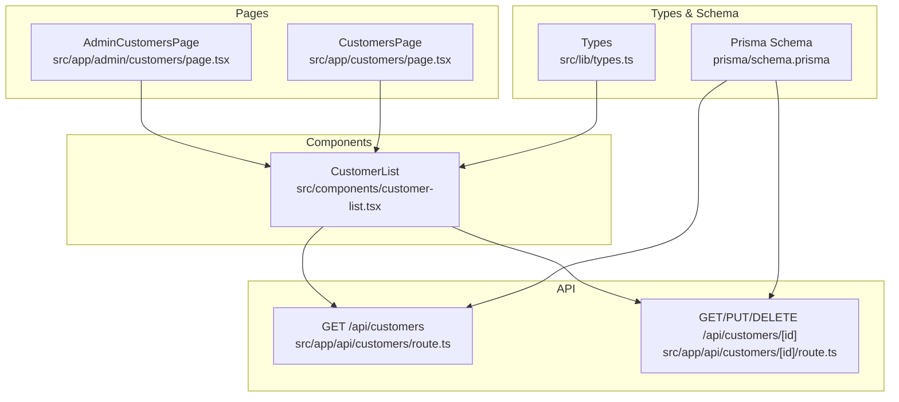
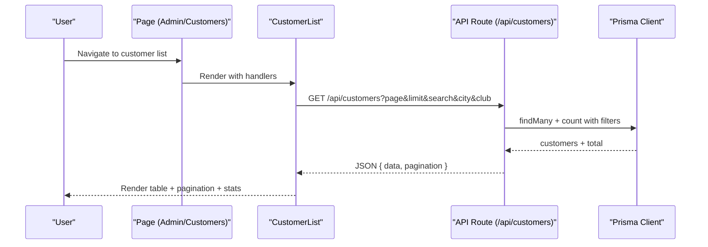
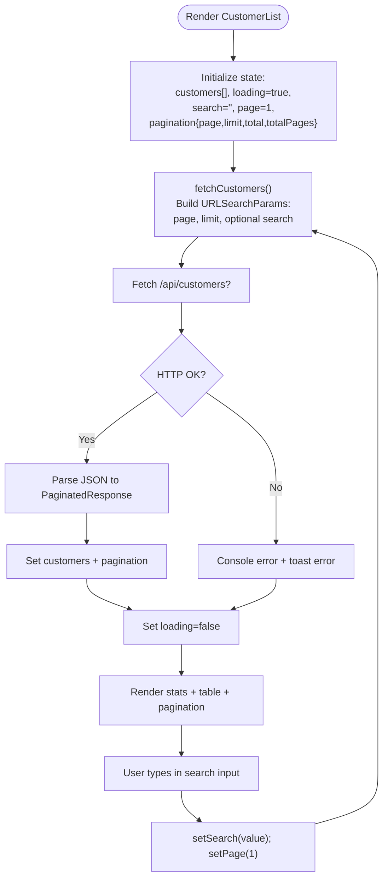
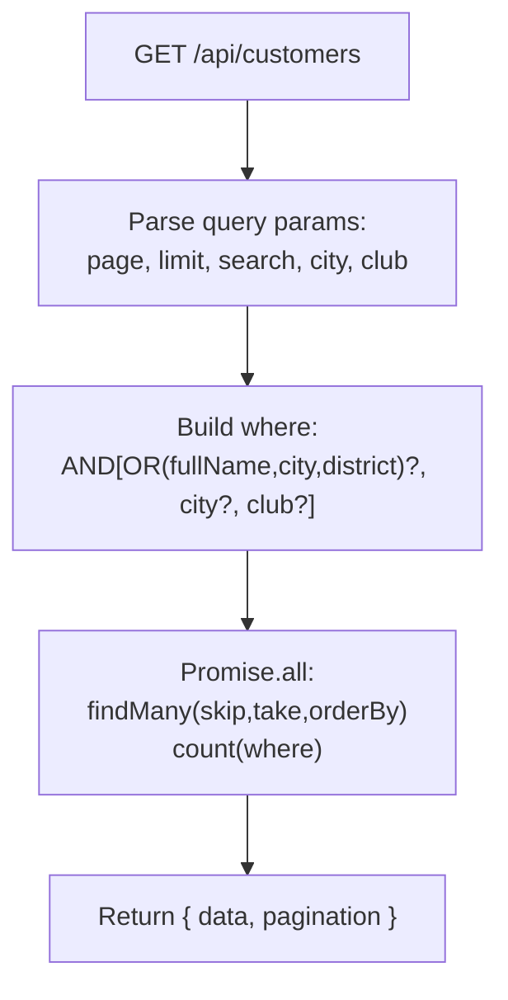
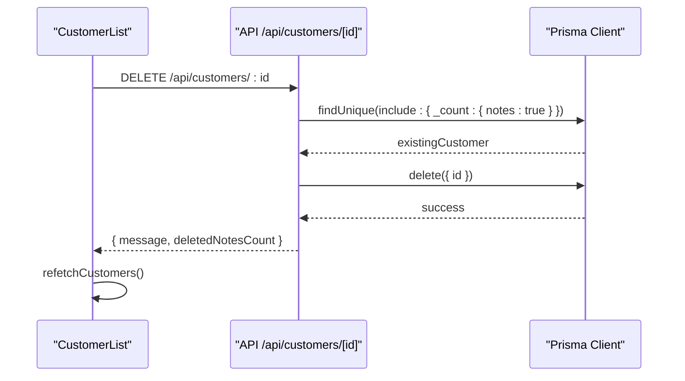
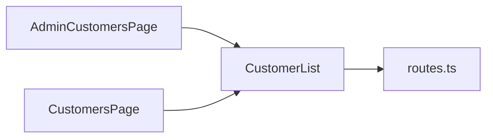
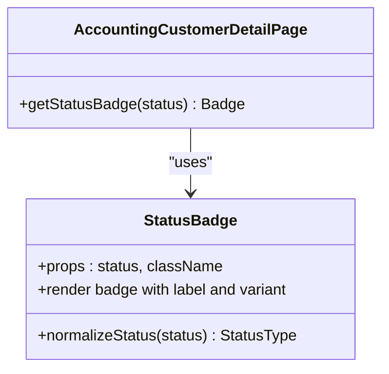
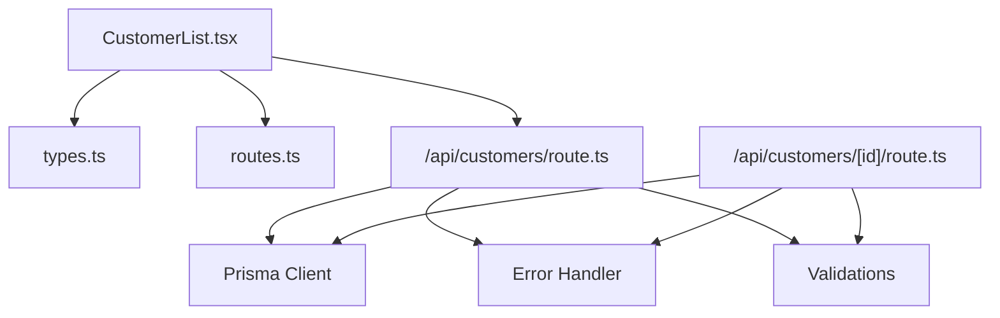

# Customer Lists & Search Functionality

<cite>
**Referenced Files in This Document**
- [customer-list.tsx](file://src/components/customer-list.tsx)
- [admin-customers-page.tsx](file://src/app/admin/customers/page.tsx)
- [customers-page.tsx](file://src/app/customers/page.tsx)
- [customer-api-route.ts](file://src/app/api/customers/route.ts)
- [customer-id-api-route.ts](file://src/app/api/customers/[id]/route.ts)
- [types.ts](file://src/lib/types.ts)
- [routes.ts](file://src/lib/routes.ts)
- [schema.prisma](file://prisma/schema.prisma)
- [status-badge.tsx](file://src/components/status-badge.tsx)
- [accounting-customer-detail-page.tsx](file://src/app/admin/accounting/customers/[id]/page.tsx)
</cite>

## Table of Contents
1. [Introduction](#introduction)
2. [Project Structure](#project-structure)
3. [Core Components](#core-components)
4. [Architecture Overview](#architecture-overview)
5. [Detailed Component Analysis](#detailed-component-analysis)
6. [Dependency Analysis](#dependency-analysis)
7. [Performance Considerations](#performance-considerations)
8. [Troubleshooting Guide](#troubleshooting-guide)
9. [Conclusion](#conclusion)

## Introduction
This document explains the customer listing and search functionality across the application. It covers how customer data is fetched, displayed in paginated tables, filtered via keyword and advanced filters, and managed through CRUD operations. It also documents performance characteristics, UI behaviors, and integration points with the backend API.

## Project Structure
The customer listing feature spans frontend components, pages, and backend API routes:
- Frontend pages render customer lists and handle navigation
- The customer list component manages search, pagination, and table rendering
- The API routes implement server-side filtering, sorting, and pagination
- Types define the shape of list items and pagination responses
- Prisma schema defines the underlying customer model and status enumeration

**Diagram sources**
- [admin-customers-page.tsx:11-41](file://src/app/admin/customers/page.tsx#L11-L41)
- [customers-page.tsx:8-36](file://src/app/customers/page.tsx#L8-L36)
- [customer-list.tsx:29-68](file://src/components/customer-list.tsx#L29-L68)
- [customer-api-route.ts:7-61](file://src/app/api/customers/route.ts#L7-L61)
- [customer-id-api-route.ts:7-120](file://src/app/api/customers/[id]/route.ts#L7-L120)
- [types.ts:7-27](file://src/lib/types.ts#L7-L27)
- [schema.prisma:94-141](file://prisma/schema.prisma#L94-L141)

**Section sources**
- [admin-customers-page.tsx:11-41](file://src/app/admin/customers/page.tsx#L11-L41)
- [customers-page.tsx:8-36](file://src/app/customers/page.tsx#L8-L36)
- [customer-list.tsx:29-68](file://src/components/customer-list.tsx#L29-L68)
- [customer-api-route.ts:7-61](file://src/app/api/customers/route.ts#L7-L61)
- [customer-id-api-route.ts:7-120](file://src/app/api/customers/[id]/route.ts#L7-L120)
- [types.ts:7-27](file://src/lib/types.ts#L7-L27)
- [schema.prisma:94-141](file://prisma/schema.prisma#L94-L141)

## Core Components
- CustomerList: Manages search, pagination, loading states, and renders the customer table with actions (view, edit, delete). It fetches data from the backend API and updates pagination metadata.
- AdminCustomersPage and CustomersPage: Provide entry points for administrators and general users respectively, wiring navigation and action handlers to the CustomerList component.
- API routes: Implement server-side filtering, pagination, and sorting for customer listings.
- Types: Define the shape of list items and pagination responses.
- Prisma schema: Defines the customer model and status enumeration used in the UI.

Key responsibilities:
- Search: Keyword search across multiple fields
- Filtering: City and club filters via URL parameters
- Sorting: Default descending creation date ordering
- Pagination: Page-based navigation with total counts
- Actions: View, edit, and delete operations
- Status indicators: Visual badges for customer status

**Section sources**
- [customer-list.tsx:29-318](file://src/components/customer-list.tsx#L29-L318)
- [admin-customers-page.tsx:11-41](file://src/app/admin/customers/page.tsx#L11-L41)
- [customers-page.tsx:8-36](file://src/app/customers/page.tsx#L8-L36)
- [customer-api-route.ts:7-61](file://src/app/api/customers/route.ts#L7-L61)
- [types.ts:7-27](file://src/lib/types.ts#L7-L27)
- [schema.prisma:94-141](file://prisma/schema.prisma#L94-L141)

## Architecture Overview
The customer listing architecture follows a client-driven UI pattern with server-side API endpoints:

**Diagram sources**
- [admin-customers-page.tsx:34-38](file://src/app/admin/customers/page.tsx#L34-L38)
- [customer-list.tsx:41-64](file://src/components/customer-list.tsx#L41-L64)
- [customer-api-route.ts:7-61](file://src/app/api/customers/route.ts#L7-L61)

## Detailed Component Analysis

### CustomerList Component
Responsibilities:
- State management for customers, loading, search term, current page, and pagination metadata
- Fetching data via a controlled effect that responds to page and search changes
- Rendering statistics cards (total, showing, page)
- Search input with debounced-like behavior (immediate state update resets page to 1)
- Table rendering with columns for name, club, phone, location, and actions
- Pagination controls (previous/next) and page range display
- Action handlers for view, edit, and delete operations
- Deletion confirmation and error handling with toast feedback

**Diagram sources**
- [customer-list.tsx:29-68](file://src/components/customer-list.tsx#L29-L68)
- [customer-list.tsx:41-64](file://src/components/customer-list.tsx#L41-L64)
- [customer-list.tsx:75-95](file://src/components/customer-list.tsx#L75-L95)

**Section sources**
- [customer-list.tsx:29-318](file://src/components/customer-list.tsx#L29-L318)

### API Route: GET /api/customers
Capabilities:
- Accepts page, limit (capped at 100), search, city, and club parameters
- Applies filters using Prisma where conditions with OR on fullName, city, and district when search is provided
- Applies additional filters for city and club when provided
- Returns paginated results ordered by createdAt descending
- Includes note counts for each customer

**Diagram sources**
- [customer-api-route.ts:7-61](file://src/app/api/customers/route.ts#L7-L61)

**Section sources**
- [customer-api-route.ts:7-61](file://src/app/api/customers/route.ts#L7-L61)

### API Route: GET/PUT/DELETE /api/customers/[id]
Capabilities:
- GET: Retrieve a single customer with notes ordered by creation date and note counts
- PUT: Update customer fields with sanitization and validation
- DELETE: Remove a customer and cascade-delete associated notes; returns deletion summary

**Diagram sources**
- [customer-id-api-route.ts:87-120](file://src/app/api/customers/[id]/route.ts#L87-L120)
- [customer-list.tsx:75-95](file://src/components/customer-list.tsx#L75-L95)

**Section sources**
- [customer-id-api-route.ts:7-120](file://src/app/api/customers/[id]/route.ts#L7-L120)

### Pages and Navigation
- AdminCustomersPage: Provides admin context with breadcrumbs and an action to add customers; passes navigation handlers to CustomerList
- CustomersPage: General user-facing page with similar navigation handlers

**Diagram sources**
- [admin-customers-page.tsx:11-41](file://src/app/admin/customers/page.tsx#L11-L41)
- [customers-page.tsx:8-36](file://src/app/customers/page.tsx#L8-L36)
- [routes.ts:30-35](file://src/lib/routes.ts#L30-L35)

**Section sources**
- [admin-customers-page.tsx:11-41](file://src/app/admin/customers/page.tsx#L11-L41)
- [customers-page.tsx:8-36](file://src/app/customers/page.tsx#L8-L36)
- [routes.ts:30-35](file://src/lib/routes.ts#L30-L35)

### Customer Status Indicators
- Customer status is part of the Prisma schema and rendered in specialized views (e.g., accounting customer detail page) using a status badge component that maps status values to localized labels and variants.
- The status badge component normalizes status strings and applies appropriate visual styles.

**Diagram sources**
- [status-badge.tsx:40-62](file://src/components/status-badge.tsx#L40-L62)
- [accounting-customer-detail-page.tsx:106-115](file://src/app/admin/accounting/customers/[id]/page.tsx#L106-L115)

**Section sources**
- [schema.prisma:136-141](file://prisma/schema.prisma#L136-L141)
- [status-badge.tsx:40-62](file://src/components/status-badge.tsx#L40-L62)
- [accounting-customer-detail-page.tsx:106-115](file://src/app/admin/accounting/customers/[id]/page.tsx#L106-L115)

## Dependency Analysis
- CustomerList depends on:
  - API routes for data and mutations
  - Types for list item shape and pagination contract
  - UI primitives (Button, Input, Table, Badge, Skeleton, EmptyState)
  - Routing helpers for navigation
- API routes depend on:
  - Prisma client for database queries
  - Validation and sanitization utilities
  - Error handling utilities

**Diagram sources**
- [customer-list.tsx:17-20](file://src/components/customer-list.tsx#L17-L20)
- [types.ts:7-19](file://src/lib/types.ts#L7-L19)
- [routes.ts:30-35](file://src/lib/routes.ts#L30-L35)
- [customer-api-route.ts:2-5](file://src/app/api/customers/route.ts#L2-L5)
- [customer-id-api-route.ts:3-5](file://src/app/api/customers/[id]/route.ts#L3-L5)

**Section sources**
- [customer-list.tsx:17-20](file://src/components/customer-list.tsx#L17-L20)
- [types.ts:7-19](file://src/lib/types.ts#L7-L19)
- [routes.ts:30-35](file://src/lib/routes.ts#L30-L35)
- [customer-api-route.ts:2-5](file://src/app/api/customers/route.ts#L2-L5)
- [customer-id-api-route.ts:3-5](file://src/app/api/customers/[id]/route.ts#L3-L5)

## Performance Considerations
- Pagination limits: The API caps limit at 100 items per page to prevent excessive payloads.
- Efficient filtering: Filters are applied server-side with Prisma where conditions; search uses insensitive containment across relevant fields.
- Sorting: Default descending creation date ordering ensures recent entries appear first.
- Client-side state updates: Immediate search updates reset the page to 1, minimizing redundant requests while keeping results fresh.
- Lazy loading: The table skeleton appears during loading; empty state is shown when no results match filters.
- Recommendations:
  - Add debouncing for search input to reduce frequent network requests.
  - Consider adding index hints on frequently filtered columns (fullName, city, district, club) in the database.
  - Implement virtualized lists for very large datasets to improve rendering performance.

[No sources needed since this section provides general guidance]

## Troubleshooting Guide
Common issues and resolutions:
- Fetch failures: The component displays an error toast and logs to the console when the API returns a non-OK response.
- Deletion errors: Errors during deletion show a toast and preserve local state; ensure the backend returns proper status codes.
- Empty results: When no customers match the search criteria, an empty state component suggests adding a customer.
- Navigation: Ensure routes are correctly configured to avoid broken links.

**Section sources**
- [customer-list.tsx:58-63](file://src/components/customer-list.tsx#L58-L63)
- [customer-list.tsx:91-94](file://src/components/customer-list.tsx#L91-L94)
- [customer-list.tsx:184-195](file://src/components/customer-list.tsx#L184-L195)

## Conclusion
The customer listing and search functionality is built around a robust client-server architecture:
- The frontend provides a responsive, paginated table with search and basic filters
- The backend enforces safe, efficient queries with server-side pagination and filtering
- Status indicators and navigation integrate seamlessly with the UI
- The system is extensible for advanced filtering and performance enhancements