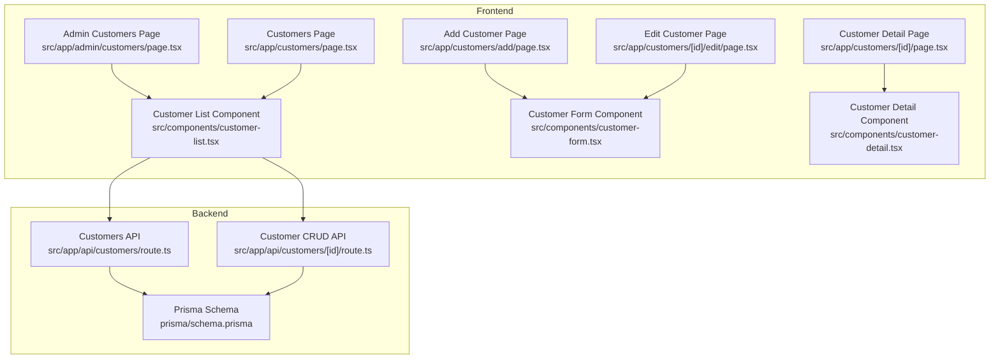
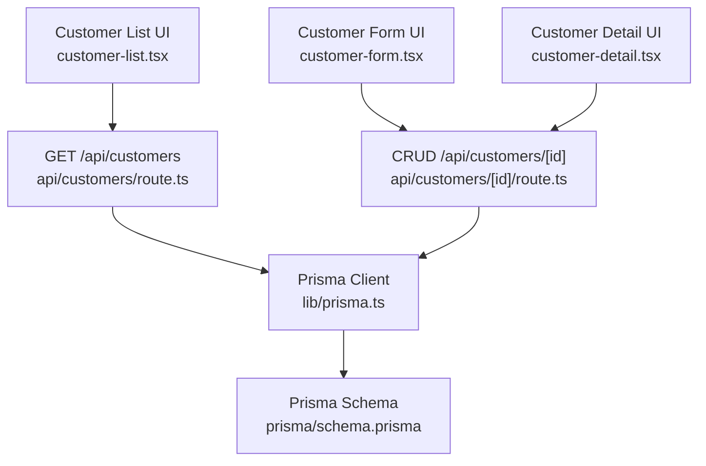
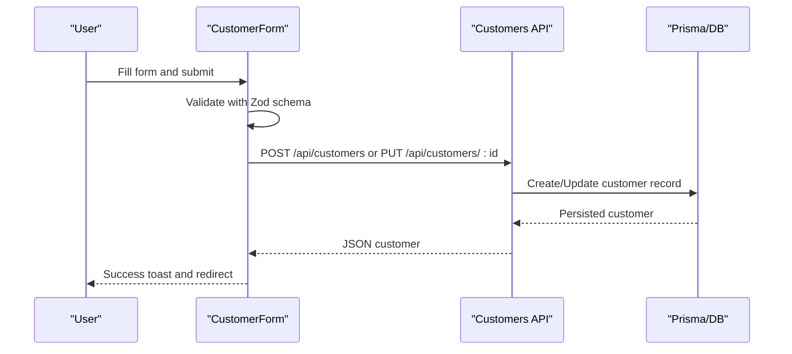
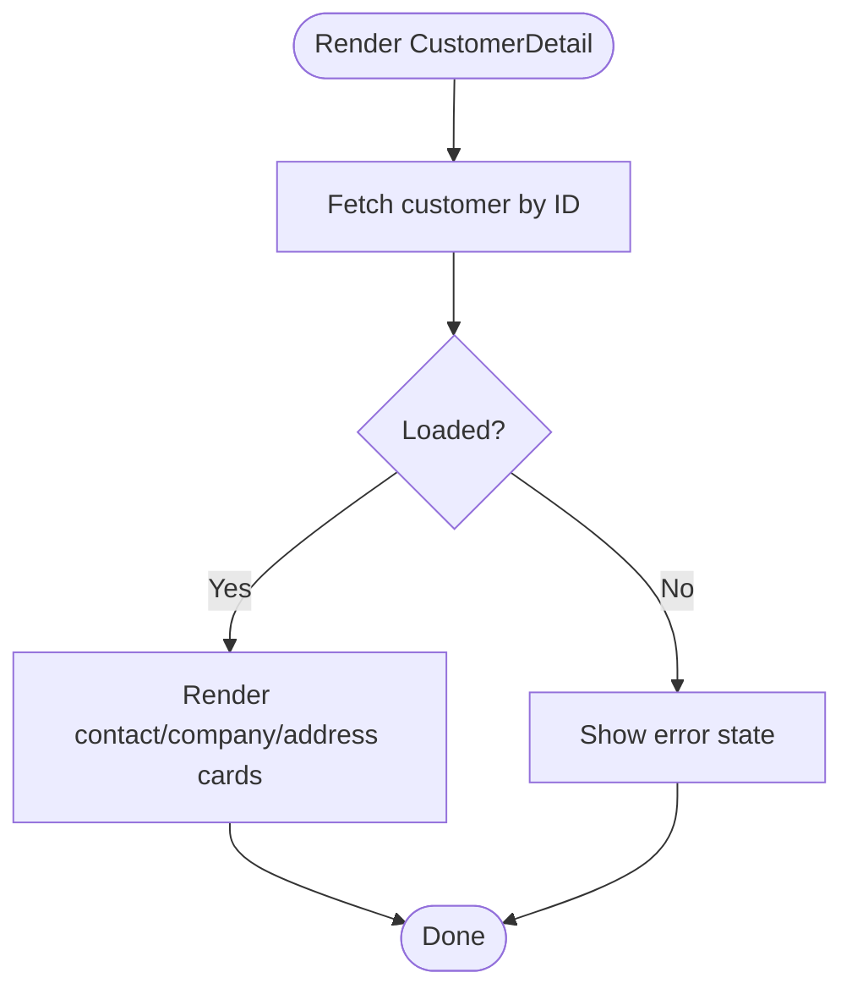
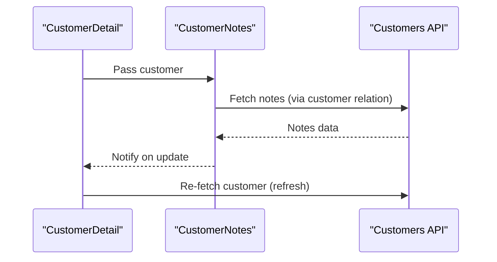
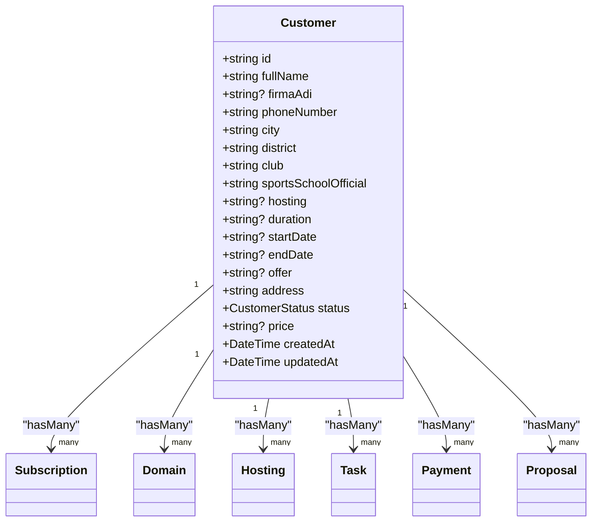
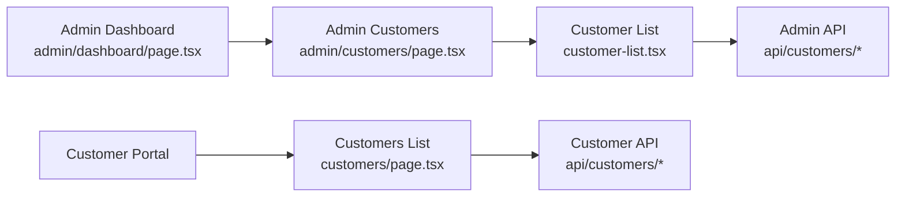
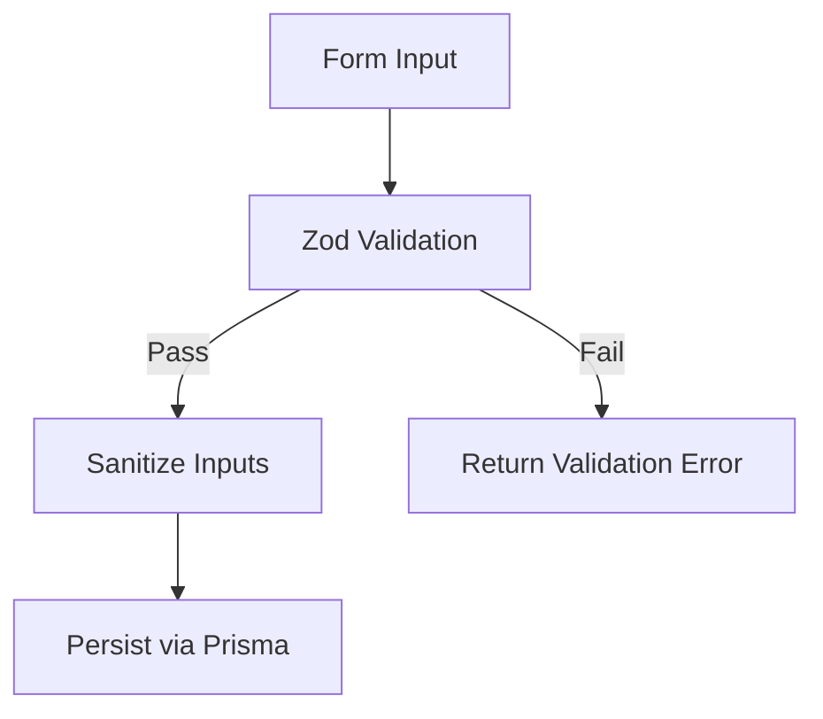
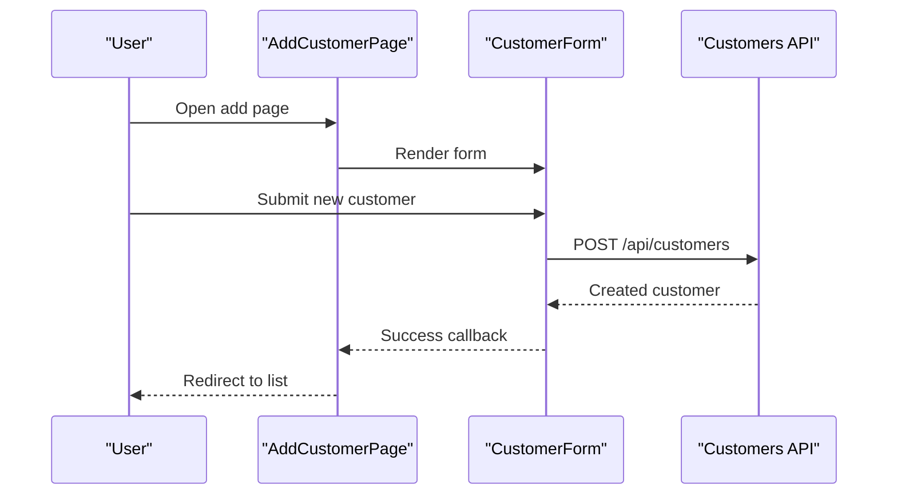

# Customer Management System

<cite>
**Referenced Files in This Document**
- [README.md](file://README.md)
- [schema.prisma](file://prisma/schema.prisma)
- [routes.ts](file://src/lib/routes.ts)
- [types.ts](file://src/lib/types.ts)
- [validations.ts](file://src/lib/validations.ts)
- [error-handler.ts](file://src/lib/error-handler.ts)
- [prisma.ts](file://src/lib/prisma.ts)
- [admin/customers/page.tsx](file://src/app/admin/customers/page.tsx)
- [customers/page.tsx](file://src/app/customers/page.tsx)
- [customer-list.tsx](file://src/components/customer-list.tsx)
- [customer-form.tsx](file://src/components/customer-form.tsx)
- [customer-detail.tsx](file://src/components/customer-detail.tsx)
- [customers/add/page.tsx](file://src/app/customers/add/page.tsx)
- [customers/[id]/page.tsx](file://src/app/customers/[id]/page.tsx)
- [customers/[id]/edit/page.tsx](file://src/app/customers/[id]/edit/page.tsx)
- [api/customers/route.ts](file://src/app/api/customers/route.ts)
- [api/customers/[id]/route.ts](file://src/app/api/customers/[id]/route.ts)
- [admin/dashboard/page.tsx](file://src/app/admin/dashboard/page.tsx)
</cite>

## Table of Contents
1. [Introduction](#introduction)
2. [Project Structure](#project-structure)
3. [Core Components](#core-components)
4. [Architecture Overview](#architecture-overview)
5. [Detailed Component Analysis](#detailed-component-analysis)
6. [Dependency Analysis](#dependency-analysis)
7. [Performance Considerations](#performance-considerations)
8. [Troubleshooting Guide](#troubleshooting-guide)
9. [Conclusion](#conclusion)
10. [Appendices](#appendices)

## Introduction
This document describes the Customer Management System, focusing on customer profile creation, contact information management, activity tracking, and customer lifecycle management. It explains the dual interface for administrators and customers, data validation rules, customer status management, onboarding workflows, profile updates, activity logging, and relationship management with services. It also documents search and filtering capabilities, bulk operations, and customer data export features.

## Project Structure
The system is a Next.js application with:
- Frontend pages and components under src/app and src/components
- Shared libraries under src/lib (routing, types, validations, Prisma client)
- Backend API routes under src/app/api
- Database schema under prisma/schema.prisma

**Diagram sources**
- [admin/customers/page.tsx:11-41](file://src/app/admin/customers/page.tsx#L11-L41)
- [customers/page.tsx:8-36](file://src/app/customers/page.tsx#L8-L36)
- [customer-list.tsx:29-318](file://src/components/customer-list.tsx#L29-L318)
- [customer-form.tsx:25-264](file://src/components/customer-form.tsx#L25-L264)
- [customer-detail.tsx:31-243](file://src/components/customer-detail.tsx#L31-L243)
- [customers/add/page.tsx:9-44](file://src/app/customers/add/page.tsx#L9-L44)
- [customers/[id]/page.tsx](file://src/app/customers/[id]/page.tsx#L10-L42)
- [customers/[id]/edit/page.tsx](file://src/app/customers/[id]/edit/page.tsx#L11-L90)
- [api/customers/route.ts:7-61](file://src/app/api/customers/route.ts#L7-L61)
- [api/customers/[id]/route.ts](file://src/app/api/customers/[id]/route.ts#L7-L37)
- [schema.prisma:94-134](file://prisma/schema.prisma#L94-L134)

**Section sources**
- [routes.ts:1-43](file://src/lib/routes.ts#L1-L43)
- [types.ts:1-28](file://src/lib/types.ts#L1-L28)
- [validations.ts:1-243](file://src/lib/validations.ts#L1-L243)
- [prisma.ts](file://src/lib/prisma.ts)

## Core Components
- Customer list with search, pagination, and actions
- Customer form with validation and submission
- Customer detail view with contact info, company info, address, and notes
- Admin and customer-facing pages with routing
- API endpoints for listing, creating, updating, and deleting customers
- Prisma schema defining the Customer model and related entities

Key responsibilities:
- Administrators manage customer lists, add/edit/delete, and view details
- Customers can view their own profiles and related services
- Validation ensures data integrity
- API routes implement filtering, pagination, and sanitization

**Section sources**
- [customer-list.tsx:29-318](file://src/components/customer-list.tsx#L29-L318)
- [customer-form.tsx:25-264](file://src/components/customer-form.tsx#L25-L264)
- [customer-detail.tsx:31-243](file://src/components/customer-detail.tsx#L31-L243)
- [api/customers/route.ts:7-61](file://src/app/api/customers/route.ts#L7-L61)
- [api/customers/[id]/route.ts](file://src/app/api/customers/[id]/route.ts#L7-L37)
- [schema.prisma:94-134](file://prisma/schema.prisma#L94-L134)

## Architecture Overview
The system follows a layered architecture:
- Presentation layer: Next.js pages and shared components
- Business logic: Zod validations and API handlers
- Data access: Prisma ORM with PostgreSQL
- Routing: Centralized routes module

**Diagram sources**
- [customer-list.tsx:41-64](file://src/components/customer-list.tsx#L41-L64)
- [customer-form.tsx:64-93](file://src/components/customer-form.tsx#L64-L93)
- [customer-detail.tsx:35-50](file://src/components/customer-detail.tsx#L35-L50)
- [api/customers/route.ts:7-61](file://src/app/api/customers/route.ts#L7-L61)
- [api/customers/[id]/route.ts](file://src/app/api/customers/[id]/route.ts#L7-L37)
- [prisma.ts](file://src/lib/prisma.ts)
- [schema.prisma:94-134](file://prisma/schema.prisma#L94-L134)

## Detailed Component Analysis

### Customer Profile Creation and Updates
- The form captures full name, phone, city, district, club, sports school official, and address
- Validation enforces length limits and formats (e.g., phone regex)
- Submission either creates a new customer or updates an existing one via API
- Success triggers navigation to the customer list

**Diagram sources**
- [customer-form.tsx:25-93](file://src/components/customer-form.tsx#L25-L93)
- [api/customers/route.ts:63-104](file://src/app/api/customers/route.ts#L63-L104)
- [api/customers/[id]/route.ts](file://src/app/api/customers/[id]/route.ts#L40-L84)

**Section sources**
- [customer-form.tsx:25-264](file://src/components/customer-form.tsx#L25-L264)
- [validations.ts:4-49](file://src/lib/validations.ts#L4-L49)
- [api/customers/route.ts:63-104](file://src/app/api/customers/route.ts#L63-L104)
- [api/customers/[id]/route.ts](file://src/app/api/customers/[id]/route.ts#L40-L84)

### Contact Information Management
- Fields include full name, phone, city, district, club, sports school official, and address
- City selection is populated from a static list loaded by the form
- Display components show contact and company info in structured cards

**Diagram sources**
- [customer-detail.tsx:35-71](file://src/components/customer-detail.tsx#L35-L71)

**Section sources**
- [customer-detail.tsx:149-237](file://src/components/customer-detail.tsx#L149-L237)
- [customer-form.tsx:14-62](file://src/components/customer-form.tsx#L14-L62)

### Activity Tracking and Notes
- Customer records include a relation to notes
- The detail view integrates a notes component that refreshes customer data after updates
- API includes note counts and note relations in responses

**Diagram sources**
- [customer-detail.tsx:73-75](file://src/components/customer-detail.tsx#L73-L75)
- [api/customers/[id]/route.ts](file://src/app/api/customers/[id]/route.ts#L15-L24)

**Section sources**
- [customer-detail.tsx:240-240](file://src/components/customer-detail.tsx#L240-L240)
- [api/customers/[id]/route.ts](file://src/app/api/customers/[id]/route.ts#L15-L24)
- [schema.prisma:114-123](file://prisma/schema.prisma#L114-L123)

### Customer Lifecycle Management
- Customer model includes a status enum with potential values
- The detail view displays customer information; lifecycle states can be managed via updates
- Related entities (subscriptions, domains, hostings, tasks, payments, proposals) are modeled and can influence lifecycle stages

**Diagram sources**
- [schema.prisma:94-134](file://prisma/schema.prisma#L94-L134)
- [schema.prisma:206-226](file://prisma/schema.prisma#L206-L226)
- [schema.prisma:228-242](file://prisma/schema.prisma#L228-L242)
- [schema.prisma:244-256](file://prisma/schema.prisma#L244-L256)
- [schema.prisma:264-279](file://prisma/schema.prisma#L264-L279)
- [schema.prisma:305-343](file://prisma/schema.prisma#L305-L343)
- [schema.prisma:458-503](file://prisma/schema.prisma#L458-L503)

**Section sources**
- [schema.prisma:136-141](file://prisma/schema.prisma#L136-L141)
- [schema.prisma:94-134](file://prisma/schema.prisma#L94-L134)

### Dual Interface: Administrators and Customers
- Admin area: dedicated pages for managing customers, subscriptions, domains, hosting, and reports
- Customer area: customer-specific pages for viewing and editing profiles
- Routing centralizes navigation for both roles

**Diagram sources**
- [admin/dashboard/page.tsx:32-82](file://src/app/admin/dashboard/page.tsx#L32-L82)
- [admin/customers/page.tsx:11-41](file://src/app/admin/customers/page.tsx#L11-L41)
- [customers/page.tsx:8-36](file://src/app/customers/page.tsx#L8-L36)
- [customer-list.tsx:29-318](file://src/components/customer-list.tsx#L29-L318)
- [api/customers/route.ts:7-61](file://src/app/api/customers/route.ts#L7-L61)
- [api/customers/[id]/route.ts](file://src/app/api/customers/[id]/route.ts#L7-L37)

**Section sources**
- [routes.ts:1-43](file://src/lib/routes.ts#L1-L43)
- [admin/dashboard/page.tsx:32-82](file://src/app/admin/dashboard/page.tsx#L32-L82)
- [admin/customers/page.tsx:11-41](file://src/app/admin/customers/page.tsx#L11-L41)
- [customers/page.tsx:8-36](file://src/app/customers/page.tsx#L8-L36)

### Data Validation Rules
- Zod schemas enforce:
  - String length constraints
  - Phone number format validation
  - Optional vs required fields
  - Enum constraints for statuses and types
- API routes sanitize inputs and apply validation before persistence

**Diagram sources**
- [validations.ts:4-49](file://src/lib/validations.ts#L4-L49)
- [api/customers/route.ts:67-78](file://src/app/api/customers/route.ts#L67-L78)
- [api/customers/[id]/route.ts](file://src/app/api/customers/[id]/route.ts#L50-L64)

**Section sources**
- [validations.ts:1-243](file://src/lib/validations.ts#L1-L243)
- [error-handler.ts](file://src/lib/error-handler.ts)

### Customer Status Management
- Customer status is represented by an enum with potential values
- Status can be part of filters and can influence lifecycle stages
- Status updates are handled via the update endpoint

**Section sources**
- [schema.prisma:136-141](file://prisma/schema.prisma#L136-L141)
- [api/customers/[id]/route.ts](file://src/app/api/customers/[id]/route.ts#L64-L64)
- [validations.ts:66-74](file://src/lib/validations.ts#L66-L74)

### Customer Onboarding Workflows
- New customer creation via the add page and form
- Successful creation navigates back to the customer list
- Initial status defaults are applied during creation

**Diagram sources**
- [customers/add/page.tsx:9-44](file://src/app/customers/add/page.tsx#L9-L44)
- [customer-form.tsx:64-93](file://src/components/customer-form.tsx#L64-L93)
- [api/customers/route.ts:63-104](file://src/app/api/customers/route.ts#L63-L104)

**Section sources**
- [customers/add/page.tsx:9-44](file://src/app/customers/add/page.tsx#L9-L44)
- [customer-form.tsx:25-93](file://src/components/customer-form.tsx#L25-L93)

### Profile Updates
- Edit page loads customer data and renders the form pre-filled
- Update endpoint validates and persists changes
- Success navigates back to the list

**Section sources**
- [customers/[id]/edit/page.tsx](file://src/app/customers/[id]/edit/page.tsx#L11-L90)
- [customer-form.tsx:25-93](file://src/components/customer-form.tsx#L25-L93)
- [api/customers/[id]/route.ts](file://src/app/api/customers/[id]/route.ts#L40-L84)

### Activity Logging
- Activities are represented by related entities (subscriptions, domains, hostings, tasks, payments, proposals)
- The admin dashboard aggregates recent activities and service summaries
- Filtering and pagination are supported for customer listings

**Section sources**
- [admin/dashboard/page.tsx:32-82](file://src/app/admin/dashboard/page.tsx#L32-L82)
- [api/customers/route.ts:7-61](file://src/app/api/customers/route.ts#L7-L61)

### Relationship Management with Services
- Customer has relations to subscriptions, domains, hostings, tasks, payments, proposals, and notes
- These relationships enable lifecycle tracking and cross-service management

**Section sources**
- [schema.prisma:114-123](file://prisma/schema.prisma#L114-L123)
- [schema.prisma:206-226](file://prisma/schema.prisma#L206-L226)
- [schema.prisma:228-242](file://prisma/schema.prisma#L228-L242)
- [schema.prisma:244-256](file://prisma/schema.prisma#L244-L256)
- [schema.prisma:264-279](file://prisma/schema.prisma#L264-L279)
- [schema.prisma:305-343](file://prisma/schema.prisma#L305-L343)
- [schema.prisma:458-503](file://prisma/schema.prisma#L458-L503)

### Search and Filtering Capabilities
- Listing endpoint supports search, city, and club filters
- Pagination with page and limit parameters
- Filters are validated and sanitized before querying

**Section sources**
- [api/customers/route.ts:7-61](file://src/app/api/customers/route.ts#L7-L61)
- [validations.ts:66-74](file://src/lib/validations.ts#L66-L74)
- [customer-list.tsx:41-64](file://src/components/customer-list.tsx#L41-L64)

### Bulk Operations
- No explicit bulk operations are implemented in the customer module
- The system focuses on individual customer CRUD and list operations

### Customer Data Export Features
- No explicit export endpoints are present in the customer API
- Data export would require adding endpoints to generate CSV/Excel from the customer list

## Dependency Analysis
- Pages depend on components and shared routing
- Components depend on validation schemas and API routes
- API routes depend on Prisma client and error handler
- Prisma schema defines entity relationships and enums

```mermaid
graph TB
Routes["routes.ts"]
Types["types.ts"]
Valid["validations.ts"]
ErrorHandler["error-handler.ts"]
Prisma["prisma.ts"]
Schema["schema.prisma"]
AdminCustomers["admin/customers/page.tsx"] --> Routes
CustomersPage["customers/page.tsx"] --> Routes
CustomerList["customer-list.tsx"] --> Valid
CustomerList --> Types
CustomerForm["customer-form.tsx"] --> Valid
CustomerDetail["customer-detail.tsx"] --> Types
AddPage["customers/add/page.tsx"] --> Routes
DetailPage["customers/[id]/page.tsx"] --> Routes
EditPage["customers/[id]/edit/page.tsx"] --> Routes
ApiList["api/customers/route.ts"] --> Valid
ApiList --> ErrorHandler
ApiList --> Prisma
ApiList --> Schema
ApiId["api/customers/[id]/route.ts"] --> Valid
ApiId --> ErrorHandler
ApiId --> Prisma
ApiId --> Schema
```

**Diagram sources**
- [routes.ts:1-43](file://src/lib/routes.ts#L1-L43)
- [types.ts:1-28](file://src/lib/types.ts#L1-L28)
- [validations.ts:1-243](file://src/lib/validations.ts#L1-L243)
- [error-handler.ts](file://src/lib/error-handler.ts)
- [prisma.ts](file://src/lib/prisma.ts)
- [schema.prisma:94-134](file://prisma/schema.prisma#L94-L134)
- [admin/customers/page.tsx:11-41](file://src/app/admin/customers/page.tsx#L11-L41)
- [customers/page.tsx:8-36](file://src/app/customers/page.tsx#L8-L36)
- [customer-list.tsx:29-318](file://src/components/customer-list.tsx#L29-L318)
- [customer-form.tsx:25-264](file://src/components/customer-form.tsx#L25-L264)
- [customer-detail.tsx:31-243](file://src/components/customer-detail.tsx#L31-L243)
- [customers/add/page.tsx:9-44](file://src/app/customers/add/page.tsx#L9-L44)
- [customers/[id]/page.tsx](file://src/app/customers/[id]/page.tsx#L10-L42)
- [customers/[id]/edit/page.tsx](file://src/app/customers/[id]/edit/page.tsx#L11-L90)
- [api/customers/route.ts:7-61](file://src/app/api/customers/route.ts#L7-L61)
- [api/customers/[id]/route.ts](file://src/app/api/customers/[id]/route.ts#L7-L37)

**Section sources**
- [routes.ts:1-43](file://src/lib/routes.ts#L1-L43)
- [types.ts:1-28](file://src/lib/types.ts#L1-L28)
- [validations.ts:1-243](file://src/lib/validations.ts#L1-L243)
- [error-handler.ts](file://src/lib/error-handler.ts)
- [prisma.ts](file://src/lib/prisma.ts)
- [schema.prisma:94-134](file://prisma/schema.prisma#L94-L134)

## Performance Considerations
- Pagination is enforced with a maximum limit to prevent heavy queries
- Filtering uses indexed fields (name, city, district, club) with insensitive containment
- Parallel queries are used for count and list to reduce round trips
- Client-side caching is minimal; consider implementing SWR or React Query for improved UX

## Troubleshooting Guide
Common issues and resolutions:
- Validation errors: Ensure inputs match Zod constraints (lengths, formats)
- Sanitization failures: Verify input sanitation and error handling
- Not found errors: Confirm customer ID validity and existence
- API errors: Check error handler status mapping and messages

**Section sources**
- [error-handler.ts](file://src/lib/error-handler.ts)
- [api/customers/[id]/route.ts](file://src/app/api/customers/[id]/route.ts#L27-L31)
- [api/customers/[id]/route.ts](file://src/app/api/customers/[id]/route.ts#L95-L111)

## Conclusion
The Customer Management System provides a robust foundation for customer onboarding, profile management, and lifecycle tracking. It leverages Zod for validation, Prisma for data modeling, and a clear separation between admin and customer interfaces. Extending the system with bulk operations, export endpoints, and enhanced activity logging would further improve operational efficiency.

## Appendices
- Additional modules (subscriptions, domains, hostings, tasks, payments, proposals) are defined in the schema and integrate with customer records to support comprehensive lifecycle management.

**Section sources**
- [schema.prisma:206-226](file://prisma/schema.prisma#L206-L226)
- [schema.prisma:228-242](file://prisma/schema.prisma#L228-L242)
- [schema.prisma:244-256](file://prisma/schema.prisma#L244-L256)
- [schema.prisma:264-279](file://prisma/schema.prisma#L264-L279)
- [schema.prisma:305-343](file://prisma/schema.prisma#L305-L343)
- [schema.prisma:458-503](file://prisma/schema.prisma#L458-L503)