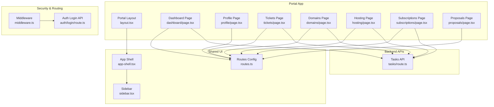
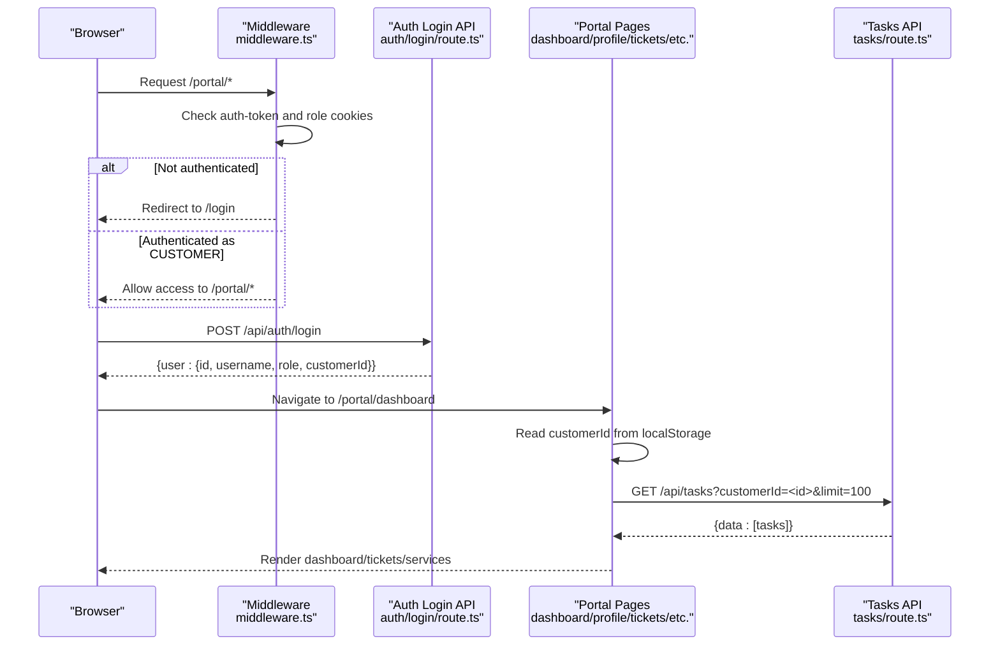
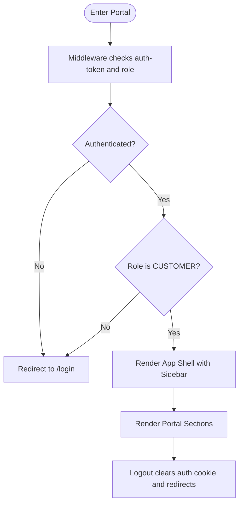
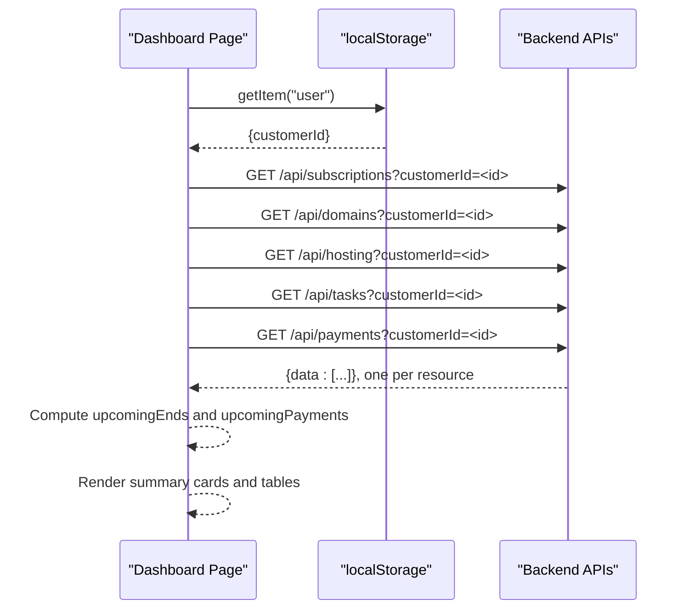
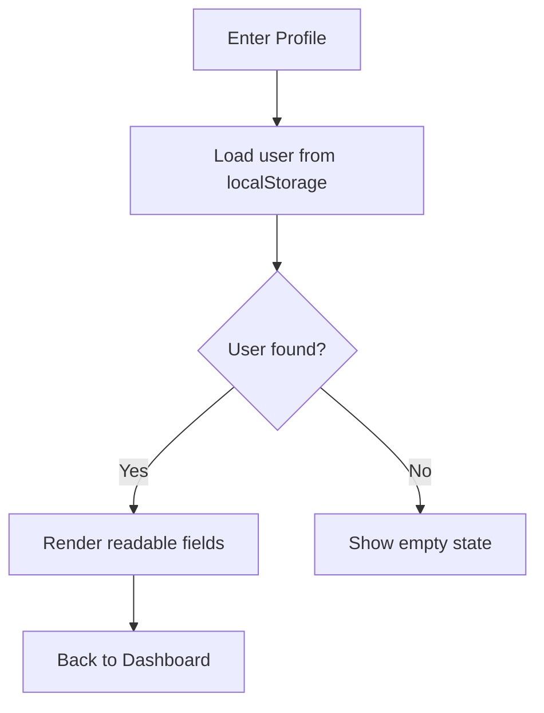
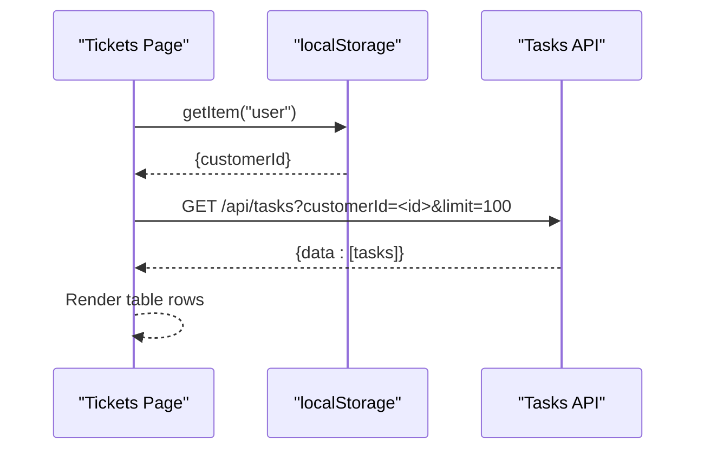
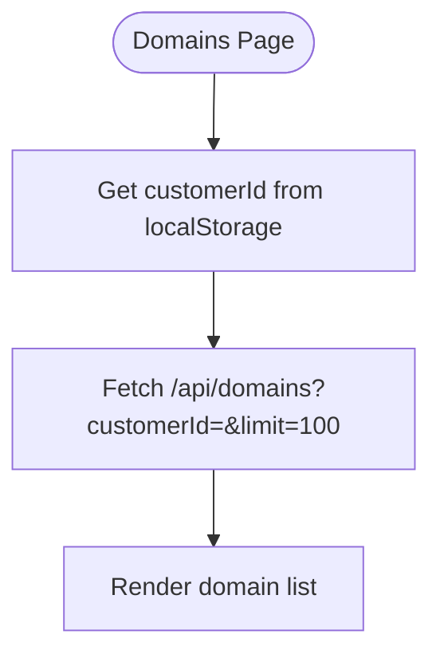
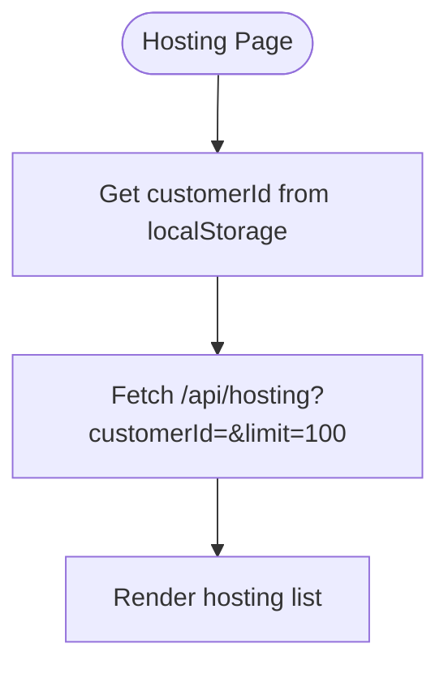
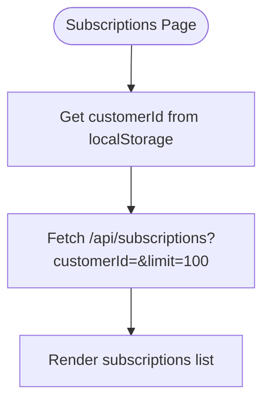
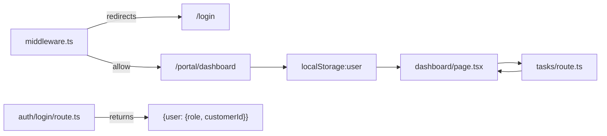

# Customer Portal Interface

<cite>
**Referenced Files in This Document**
- [layout.tsx](file://src/app/portal/layout.tsx)
- [page.tsx](file://src/app/portal/page.tsx)
- [dashboard/page.tsx](file://src/app/portal/dashboard/page.tsx)
- [profile/page.tsx](file://src/app/portal/profile/page.tsx)
- [tickets/page.tsx](file://src/app/portal/tickets/page.tsx)
- [domains/page.tsx](file://src/app/portal/domains/page.tsx)
- [hosting/page.tsx](file://src/app/portal/hosting/page.tsx)
- [proposals/page.tsx](file://src/app/portal/proposals/page.tsx)
- [subscriptions/page.tsx](file://src/app/portal/subscriptions/page.tsx)
- [routes.ts](file://src/lib/routes.ts)
- [middleware.ts](file://src/middleware.ts)
- [app-shell.tsx](file://src/components/app-shell.tsx)
- [sidebar.tsx](file://src/components/sidebar.tsx)
- [auth/login/route.ts](file://src/app/api/auth/login/route.ts)
- [tasks/route.ts](file://src/app/api/tasks/route.ts)
</cite>

## Table of Contents
1. [Introduction](#introduction)
2. [Project Structure](#project-structure)
3. [Core Components](#core-components)
4. [Architecture Overview](#architecture-overview)
5. [Detailed Component Analysis](#detailed-component-analysis)
6. [Dependency Analysis](#dependency-analysis)
7. [Performance Considerations](#performance-considerations)
8. [Troubleshooting Guide](#troubleshooting-guide)
9. [Conclusion](#conclusion)

## Introduction
This document describes the customer-facing portal interface, focusing on customer self-service capabilities, profile viewing permissions, and limited administrative functions exposed to customers. It explains portal navigation, dashboard features, and service access controls. It also covers customer account management, password changes, and profile updates within portal constraints, along with portal security measures, session management, access restrictions, support ticket creation, service status viewing, and communication features available in the portal.

## Project Structure
The customer portal is implemented as a Next.js app under the “portal” namespace. It uses a shared app shell and a role-aware sidebar to render navigation. Authentication is enforced via middleware that checks cookies and redirects unauthenticated or unauthorized users. The portal pages fetch data from backend APIs filtered by the authenticated customer ID stored in local storage.

**Diagram sources**
- [layout.tsx:1-10](file://src/app/portal/layout.tsx#L1-L10)
- [dashboard/page.tsx:1-202](file://src/app/portal/dashboard/page.tsx#L1-L202)
- [profile/page.tsx:1-56](file://src/app/portal/profile/page.tsx#L1-L56)
- [tickets/page.tsx:1-93](file://src/app/portal/tickets/page.tsx#L1-L93)
- [domains/page.tsx:1-97](file://src/app/portal/domains/page.tsx#L1-L97)
- [hosting/page.tsx:1-97](file://src/app/portal/hosting/page.tsx#L1-L97)
- [subscriptions/page.tsx:1-101](file://src/app/portal/subscriptions/page.tsx#L1-L101)
- [proposals/page.tsx:1-10](file://src/app/portal/proposals/page.tsx#L1-L10)
- [app-shell.tsx:1-128](file://src/components/app-shell.tsx#L1-L128)
- [sidebar.tsx:1-321](file://src/components/sidebar.tsx#L1-L321)
- [routes.ts:1-43](file://src/lib/routes.ts#L1-L43)
- [middleware.ts:1-101](file://src/middleware.ts#L1-L101)
- [auth/login/route.ts:1-86](file://src/app/api/auth/login/route.ts#L1-L86)
- [tasks/route.ts:1-64](file://src/app/api/tasks/route.ts#L1-L64)

**Section sources**
- [layout.tsx:1-10](file://src/app/portal/layout.tsx#L1-L10)
- [routes.ts:1-43](file://src/lib/routes.ts#L1-L43)
- [middleware.ts:1-101](file://src/middleware.ts#L1-L101)

## Core Components
- Portal layout and shell: Wraps pages with a responsive shell and role-aware sidebar.
- Dashboard: Aggregates subscriptions, domains, hosting, tasks, and payments for the logged-in customer.
- Profile: Displays current user’s readable profile fields.
- Services: Lists subscriptions, domains, and hosting associated with the customer.
- Tickets: Lists customer-specific tasks (support tickets).
- Navigation: Route-driven sidebar tailored for customer roles.

Key behaviors:
- Pages read the customer identifier from local storage to filter API queries.
- Middleware enforces authentication and role-based access, redirecting to login or appropriate dashboards.
- Routes centralize navigation URLs for portal pages.

**Section sources**
- [dashboard/page.tsx:17-78](file://src/app/portal/dashboard/page.tsx#L17-L78)
- [profile/page.tsx:10-27](file://src/app/portal/profile/page.tsx#L10-L27)
- [tickets/page.tsx:12-47](file://src/app/portal/tickets/page.tsx#L12-L47)
- [domains/page.tsx:12-47](file://src/app/portal/domains/page.tsx#L12-L47)
- [hosting/page.tsx:12-47](file://src/app/portal/hosting/page.tsx#L12-L47)
- [subscriptions/page.tsx:12-47](file://src/app/portal/subscriptions/page.tsx#L12-L47)
- [routes.ts:20-29](file://src/lib/routes.ts#L20-L29)
- [middleware.ts:31-80](file://src/middleware.ts#L31-L80)

## Architecture Overview
The portal enforces authentication and role-based access at the edge via middleware. On successful login, the server responds with user data including role and optional customer association. The client stores minimal user info in local storage and uses it to query customer-scoped resources. The sidebar adapts to the current route and role to show only relevant sections.

**Diagram sources**
- [middleware.ts:31-80](file://src/middleware.ts#L31-L80)
- [auth/login/route.ts:64-78](file://src/app/api/auth/login/route.ts#L64-L78)
- [dashboard/page.tsx:48-78](file://src/app/portal/dashboard/page.tsx#L48-L78)
- [tasks/route.ts:7-43](file://src/app/api/tasks/route.ts#L7-L43)

## Detailed Component Analysis

### Portal Layout and Navigation
- The portal layout wraps pages with a shared app shell and hides the sidebar on the login page.
- The sidebar renders role-aware sections and items, including a logout action that clears the auth cookie and navigates to login.

**Diagram sources**
- [middleware.ts:31-80](file://src/middleware.ts#L31-L80)
- [app-shell.tsx:16-89](file://src/components/app-shell.tsx#L16-L89)
- [sidebar.tsx:241-244](file://src/components/sidebar.tsx#L241-L244)

**Section sources**
- [layout.tsx:1-10](file://src/app/portal/layout.tsx#L1-L10)
- [app-shell.tsx:16-89](file://src/components/app-shell.tsx#L16-L89)
- [sidebar.tsx:228-320](file://src/components/sidebar.tsx#L228-L320)

### Dashboard
- Loads customer services and tasks using a single customer ID extracted from local storage.
- Fetches subscriptions, domains, hosting, tasks, and payments concurrently.
- Computes upcoming expirations and upcoming payments within defined windows.
- Provides quick navigation to tickets.

**Diagram sources**
- [dashboard/page.tsx:17-78](file://src/app/portal/dashboard/page.tsx#L17-L78)
- [dashboard/page.tsx:92-111](file://src/app/portal/dashboard/page.tsx#L92-L111)

**Section sources**
- [dashboard/page.tsx:28-78](file://src/app/portal/dashboard/page.tsx#L28-L78)
- [dashboard/page.tsx:97-111](file://src/app/portal/dashboard/page.tsx#L97-L111)

### Profile
- Reads user info from local storage and displays readable fields.
- Provides a back button to the dashboard.

**Diagram sources**
- [profile/page.tsx:10-27](file://src/app/portal/profile/page.tsx#L10-L27)

**Section sources**
- [profile/page.tsx:21-54](file://src/app/portal/profile/page.tsx#L21-L54)

### Support Tickets (Tasks)
- Lists tasks filtered by the customer ID from local storage.
- Displays title, description, and status in a table.

**Diagram sources**
- [tickets/page.tsx:12-47](file://src/app/portal/tickets/page.tsx#L12-L47)
- [tasks/route.ts:7-43](file://src/app/api/tasks/route.ts#L7-L43)

**Section sources**
- [tickets/page.tsx:23-92](file://src/app/portal/tickets/page.tsx#L23-L92)

### Domains
- Lists domains for the customer with registration and renewal dates.

**Diagram sources**
- [domains/page.tsx:12-47](file://src/app/portal/domains/page.tsx#L12-L47)

**Section sources**
- [domains/page.tsx:23-96](file://src/app/portal/domains/page.tsx#L23-L96)

### Hosting
- Lists hosting accounts with package, server, IP, and end date.

**Diagram sources**
- [hosting/page.tsx:12-47](file://src/app/portal/hosting/page.tsx#L12-L47)

**Section sources**
- [hosting/page.tsx:23-96](file://src/app/portal/hosting/page.tsx#L23-L96)

### Subscriptions
- Lists subscriptions with type, period, start/end dates, and status.

**Diagram sources**
- [subscriptions/page.tsx:12-47](file://src/app/portal/subscriptions/page.tsx#L12-L47)

**Section sources**
- [subscriptions/page.tsx:23-100](file://src/app/portal/subscriptions/page.tsx#L23-L100)

### Proposals
- Renders a proposal list without actions, suitable for customer review.

**Section sources**
- [proposals/page.tsx:1-10](file://src/app/portal/proposals/page.tsx#L1-L10)

### Root Redirect
- Redirects the portal root to the dashboard.

**Section sources**
- [page.tsx:1-7](file://src/app/portal/page.tsx#L1-L7)

## Dependency Analysis
- Authentication and routing:
  - Middleware reads cookies to determine role and enforces access to portal routes only for CUSTOMER.
  - Login API returns user data including role and optional customer association.
- Frontend-to-backend:
  - Portal pages query APIs with a customer ID filter derived from local storage.
  - Tasks API supports filtering by customer ID and search.

**Diagram sources**
- [middleware.ts:31-80](file://src/middleware.ts#L31-L80)
- [auth/login/route.ts:64-78](file://src/app/api/auth/login/route.ts#L64-L78)
- [dashboard/page.tsx:17-78](file://src/app/portal/dashboard/page.tsx#L17-L78)
- [tasks/route.ts:7-43](file://src/app/api/tasks/route.ts#L7-L43)

**Section sources**
- [middleware.ts:31-80](file://src/middleware.ts#L31-L80)
- [auth/login/route.ts:64-78](file://src/app/api/auth/login/route.ts#L64-L78)
- [tasks/route.ts:7-43](file://src/app/api/tasks/route.ts#L7-L43)

## Performance Considerations
- Concurrent API fetching on the dashboard reduces total latency by overlapping network requests.
- Pagination and limits are applied in API endpoints to cap payload sizes.
- Client-side computations (e.g., upcoming windows) are memoized to avoid unnecessary recalculation.

[No sources needed since this section provides general guidance]

## Troubleshooting Guide
- No customer data shown:
  - Ensure the user is authenticated and the customer ID is present in local storage.
  - Confirm middleware allows access to portal routes for CUSTOMER role.
- Tickets, domains, hosting, or subscriptions not loading:
  - Verify the customer ID query parameter is included in API requests.
  - Check API responses for errors and confirm the customer ID matches backend records.
- Login issues:
  - Validate input against the login schema and ensure the user account is active.
  - Confirm the returned role and customer association are correct.

**Section sources**
- [dashboard/page.tsx:17-26](file://src/app/portal/dashboard/page.tsx#L17-L26)
- [tickets/page.tsx:27-32](file://src/app/portal/tickets/page.tsx#L27-L32)
- [domains/page.tsx:27-32](file://src/app/portal/domains/page.tsx#L27-L32)
- [hosting/page.tsx:27-32](file://src/app/portal/hosting/page.tsx#L27-L32)
- [subscriptions/page.tsx:27-32](file://src/app/portal/subscriptions/page.tsx#L27-L32)
- [auth/login/route.ts:12-18](file://src/app/api/auth/login/route.ts#L12-L18)
- [auth/login/route.ts:37-52](file://src/app/api/auth/login/route.ts#L37-L52)

## Conclusion
The customer portal provides a focused, role-aware interface for customers to view services, manage support tickets, review proposals, and inspect profile details. Access is controlled via middleware and authenticated sessions, while pages rely on customer-scoped API filters to enforce data isolation. The design emphasizes simplicity, clear navigation, and secure session management.