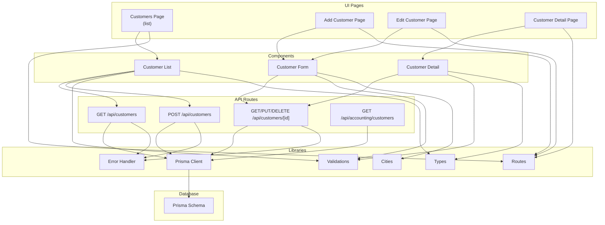
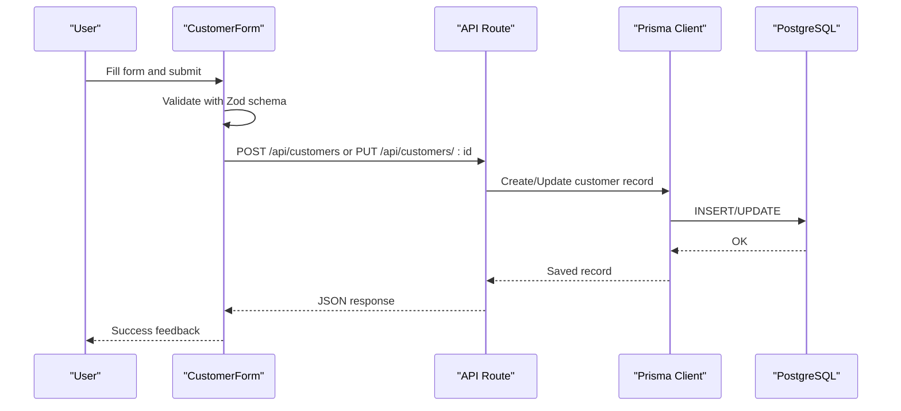
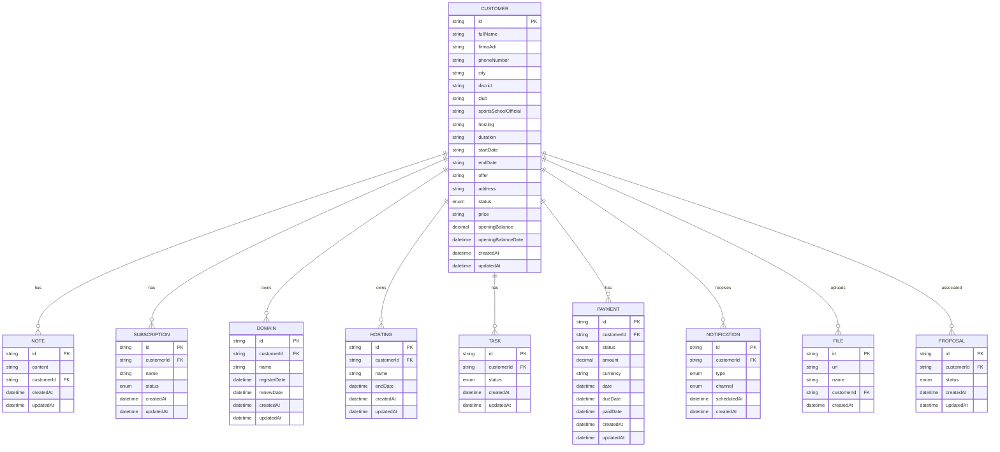
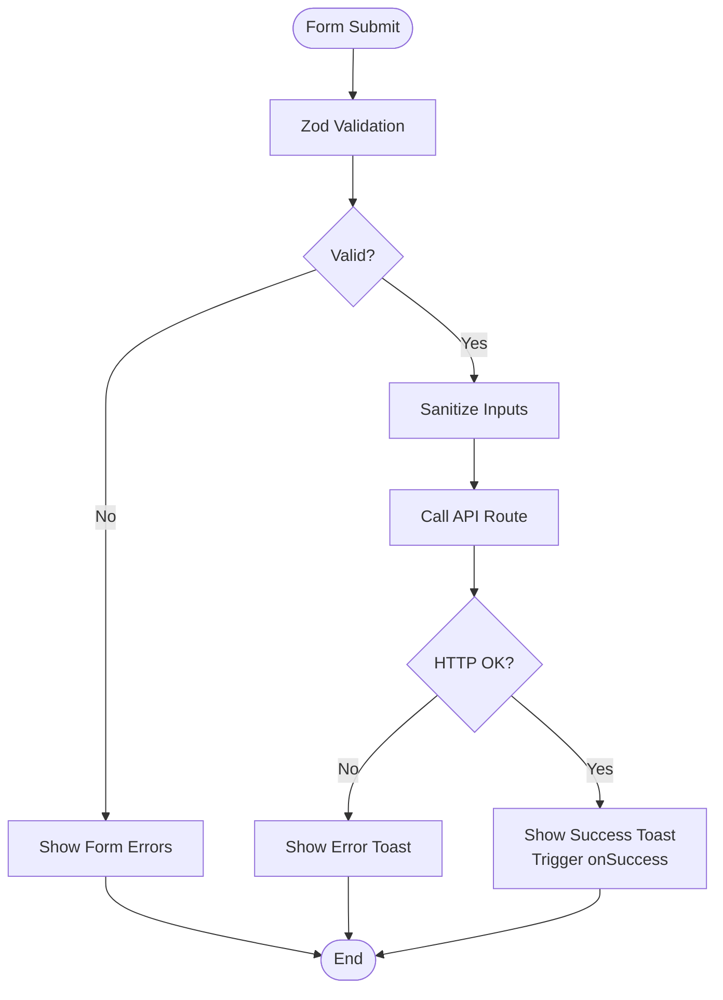
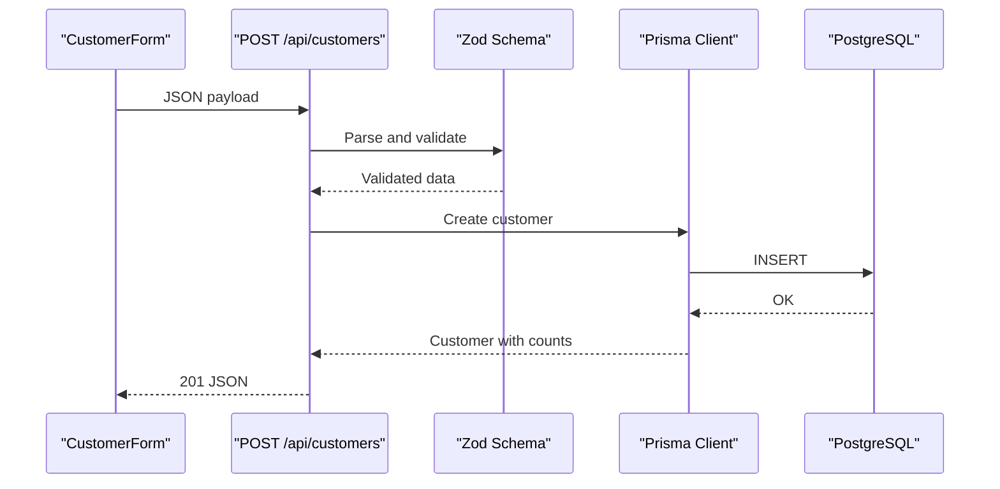
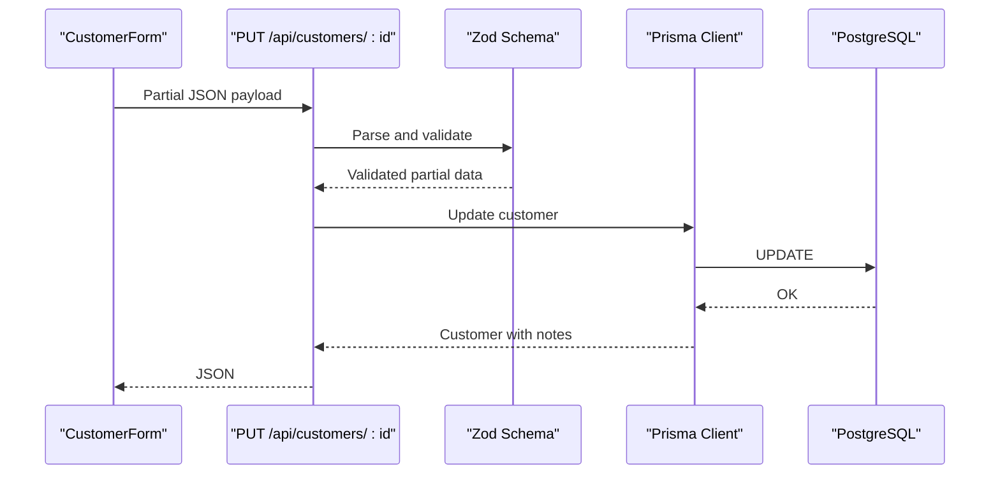
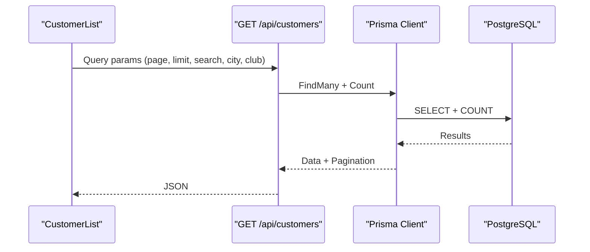
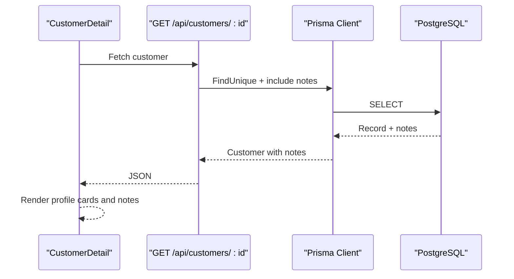
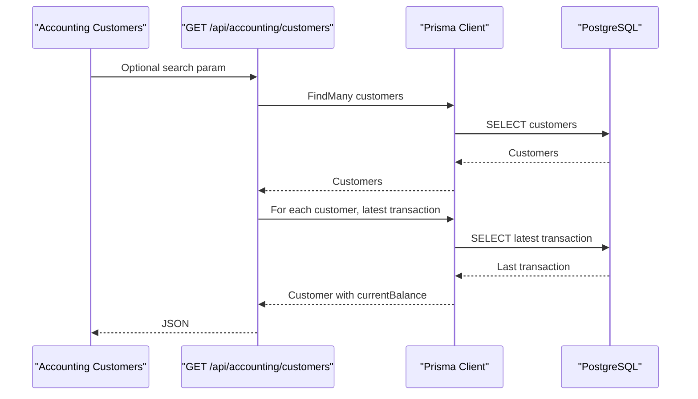
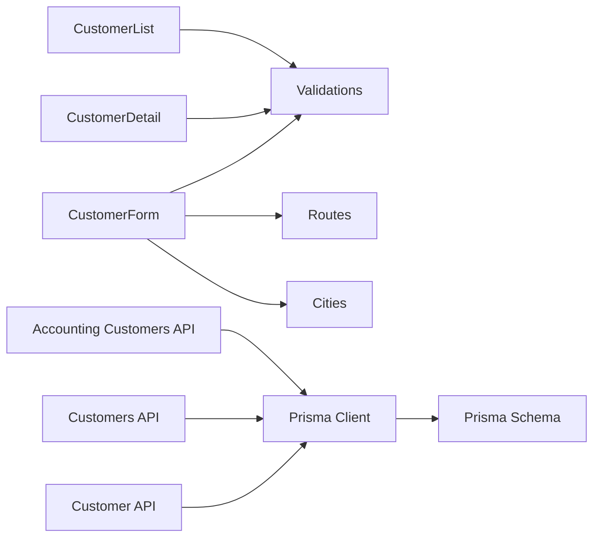

# Customer Profiles & Data Management

<cite>
**Referenced Files in This Document**
- [schema.prisma](file://prisma/schema.prisma)
- [prisma.ts](file://src/lib/prisma.ts)
- [validations.ts](file://src/lib/validations.ts)
- [error-handler.ts](file://src/lib/error-handler.ts)
- [routes.ts](file://src/lib/routes.ts)
- [cities.ts](file://src/lib/cities.ts)
- [types.ts](file://src/lib/types.ts)
- [customer-form.tsx](file://src/components/customer-form.tsx)
- [customer-list.tsx](file://src/components/customer-list.tsx)
- [customer-detail.tsx](file://src/components/customer-detail.tsx)
- [customers page.tsx](file://src/app/customers/page.tsx)
- [add customer page.tsx](file://src/app/customers/add/page.tsx)
- [edit customer page.tsx](file://src/app/customers/[id]/edit/page.tsx)
- [customer detail page.tsx](file://src/app/customers/[id]/page.tsx)
- [customers route.ts](file://src/app/api/customers/route.ts)
- [customer route.ts](file://src/app/api/customers/[id]/route.ts)
- [accounting customers route.ts](file://src/app/api/accounting/customers/route.ts)
</cite>

## Table of Contents
1. [Introduction](#introduction)
2. [Project Structure](#project-structure)
3. [Core Components](#core-components)
4. [Architecture Overview](#architecture-overview)
5. [Detailed Component Analysis](#detailed-component-analysis)
6. [Dependency Analysis](#dependency-analysis)
7. [Performance Considerations](#performance-considerations)
8. [Troubleshooting Guide](#troubleshooting-guide)
9. [Conclusion](#conclusion)
10. [Appendices](#appendices)

## Introduction
This document explains the customer profile management and data handling system. It covers form validation, profile creation and update workflows, data persistence, and profile viewing. It also documents the customer data model, field definitions, validation rules, data integrity constraints, contact information management, and profile completeness considerations. Additionally, it outlines validation schemas, error handling, and form submission processes, and addresses data privacy, security measures, and compliance considerations.

## Project Structure
The customer management feature spans UI components, API routes, validation schemas, and the Prisma data model. The frontend pages orchestrate navigation and data presentation, while API routes handle CRUD operations and filtering. Validation schemas enforce input correctness, and the Prisma schema defines the database model and relationships.

**Diagram sources**
- [customers page.tsx:1-37](file://src/app/customers/page.tsx#L1-L37)
- [add customer page.tsx:1-45](file://src/app/customers/add/page.tsx#L1-L45)
- [edit customer page.tsx:1-91](file://src/app/customers/[id]/edit/page.tsx#L1-L91)
- [customer detail page.tsx:1-43](file://src/app/customers/[id]/page.tsx#L1-L43)
- [customer-form.tsx:1-265](file://src/components/customer-form.tsx#L1-L265)
- [customer-list.tsx:1-319](file://src/components/customer-list.tsx#L1-L319)
- [customer-detail.tsx:1-244](file://src/components/customer-detail.tsx#L1-L244)
- [customers route.ts:1-105](file://src/app/api/customers/route.ts#L1-L105)
- [customer route.ts:1-121](file://src/app/api/customers/[id]/route.ts#L1-L121)
- [accounting customers route.ts:1-54](file://src/app/api/accounting/customers/route.ts#L1-L54)
- [validations.ts:1-243](file://src/lib/validations.ts#L1-L243)
- [error-handler.ts:1-34](file://src/lib/error-handler.ts#L1-L34)
- [routes.ts:1-43](file://src/lib/routes.ts#L1-L43)
- [cities.ts:1-93](file://src/lib/cities.ts#L1-L93)
- [types.ts:1-28](file://src/lib/types.ts#L1-L28)
- [prisma.ts:1-9](file://src/lib/prisma.ts#L1-L9)
- [schema.prisma:94-141](file://prisma/schema.prisma#L94-L141)

**Section sources**
- [customers page.tsx:1-37](file://src/app/customers/page.tsx#L1-L37)
- [customer-form.tsx:1-265](file://src/components/customer-form.tsx#L1-L265)
- [customer-list.tsx:1-319](file://src/components/customer-list.tsx#L1-L319)
- [customer-detail.tsx:1-244](file://src/components/customer-detail.tsx#L1-L244)
- [customers route.ts:1-105](file://src/app/api/customers/route.ts#L1-L105)
- [customer route.ts:1-121](file://src/app/api/customers/[id]/route.ts#L1-L121)
- [accounting customers route.ts:1-54](file://src/app/api/accounting/customers/route.ts#L1-L54)
- [validations.ts:1-243](file://src/lib/validations.ts#L1-L243)
- [error-handler.ts:1-34](file://src/lib/error-handler.ts#L1-L34)
- [routes.ts:1-43](file://src/lib/routes.ts#L1-L43)
- [cities.ts:1-93](file://src/lib/cities.ts#L1-L93)
- [types.ts:1-28](file://src/lib/types.ts#L1-L28)
- [prisma.ts:1-9](file://src/lib/prisma.ts#L1-L9)
- [schema.prisma:94-141](file://prisma/schema.prisma#L94-L141)

## Core Components
- Customer data model and relationships defined in the Prisma schema.
- Validation schemas for create/update operations and filters.
- UI components for listing, viewing, and editing customer profiles.
- API routes for CRUD operations, filtering, and pagination.
- Utility libraries for routing, sanitization, and city lists.

Key responsibilities:
- Enforce input validation and sanitize user inputs.
- Persist and retrieve customer records with Prisma.
- Provide paginated and searchable customer listings.
- Support profile editing and deletion with proper error handling.

**Section sources**
- [schema.prisma:94-141](file://prisma/schema.prisma#L94-L141)
- [validations.ts:4-49](file://src/lib/validations.ts#L4-L49)
- [customer-form.tsx:1-265](file://src/components/customer-form.tsx#L1-L265)
- [customer-list.tsx:1-319](file://src/components/customer-list.tsx#L1-L319)
- [customer-detail.tsx:1-244](file://src/components/customer-detail.tsx#L1-L244)
- [customers route.ts:1-105](file://src/app/api/customers/route.ts#L1-L105)
- [customer route.ts:1-121](file://src/app/api/customers/[id]/route.ts#L1-L121)

## Architecture Overview
The system follows a layered architecture:
- Presentation layer: Next.js app pages and shared UI components.
- Business logic: React hooks forms, validation, and navigation.
- API layer: Next.js App Router API handlers for customer CRUD and queries.
- Persistence layer: Prisma ORM with PostgreSQL.

**Diagram sources**
- [customer-form.tsx:64-93](file://src/components/customer-form.tsx#L64-L93)
- [customers route.ts:63-104](file://src/app/api/customers/route.ts#L63-L104)
- [customer route.ts:40-84](file://src/app/api/customers/[id]/route.ts#L40-L84)
- [prisma.ts:1-9](file://src/lib/prisma.ts#L1-L9)
- [schema.prisma:94-141](file://prisma/schema.prisma#L94-L141)

## Detailed Component Analysis

### Customer Data Model
The Customer model defines the core profile fields and relationships. It includes personal and company contact information, location fields, status enumeration, timestamps, and associations to related entities.

**Diagram sources**
- [schema.prisma:94-141](file://prisma/schema.prisma#L94-L141)
- [schema.prisma:144-155](file://prisma/schema.prisma#L144-L155)
- [schema.prisma:206-226](file://prisma/schema.prisma#L206-L226)
- [schema.prisma:228-242](file://prisma/schema.prisma#L228-L242)
- [schema.prisma:244-256](file://prisma/schema.prisma#L244-L256)
- [schema.prisma:264-279](file://prisma/schema.prisma#L264-L279)
- [schema.prisma:305-343](file://prisma/schema.prisma#L305-L343)
- [schema.prisma:358-370](file://prisma/schema.prisma#L358-L370)
- [schema.prisma:388-407](file://prisma/schema.prisma#L388-L407)
- [schema.prisma:458-503](file://prisma/schema.prisma#L458-L503)

**Section sources**
- [schema.prisma:94-141](file://prisma/schema.prisma#L94-L141)

### Customer Form Validation and Submission
The form integrates React Hook Form with Zod resolvers to validate inputs before submission. It supports both creation and update modes, loads city options, and handles success/error feedback.

**Diagram sources**
- [customer-form.tsx:29-93](file://src/components/customer-form.tsx#L29-L93)
- [validations.ts:4-49](file://src/lib/validations.ts#L4-L49)
- [error-handler.ts:4-25](file://src/lib/error-handler.ts#L4-L25)

**Section sources**
- [customer-form.tsx:1-265](file://src/components/customer-form.tsx#L1-L265)
- [validations.ts:4-49](file://src/lib/validations.ts#L4-L49)
- [error-handler.ts:1-34](file://src/lib/error-handler.ts#L1-L34)

### Customer Creation Workflow
The creation endpoint sanitizes inputs, validates via Zod, and persists the record. It returns the created entity with counts and notes included.

**Diagram sources**
- [customers route.ts:63-104](file://src/app/api/customers/route.ts#L63-L104)
- [validations.ts:4-49](file://src/lib/validations.ts#L4-L49)
- [error-handler.ts:27-29](file://src/lib/error-handler.ts#L27-L29)
- [prisma.ts:1-9](file://src/lib/prisma.ts#L1-L9)
- [schema.prisma:94-141](file://prisma/schema.prisma#L94-L141)

**Section sources**
- [customers route.ts:63-104](file://src/app/api/customers/route.ts#L63-L104)
- [validations.ts:4-49](file://src/lib/validations.ts#L4-L49)
- [error-handler.ts:27-29](file://src/lib/error-handler.ts#L27-L29)

### Customer Update Workflow
The update endpoint validates and sanitizes partial updates, then persists changes. It returns the updated record with related notes.

**Diagram sources**
- [customer route.ts:40-84](file://src/app/api/customers/[id]/route.ts#L40-L84)
- [validations.ts:51-51](file://src/lib/validations.ts#L51-L51)
- [error-handler.ts:27-29](file://src/lib/error-handler.ts#L27-L29)
- [prisma.ts:1-9](file://src/lib/prisma.ts#L1-L9)
- [schema.prisma:94-141](file://prisma/schema.prisma#L94-L141)

**Section sources**
- [customer route.ts:40-84](file://src/app/api/customers/[id]/route.ts#L40-L84)
- [validations.ts:51-51](file://src/lib/validations.ts#L51-L51)
- [error-handler.ts:27-29](file://src/lib/error-handler.ts#L27-L29)

### Customer Listing and Filtering
The listing API supports pagination, search across multiple fields, and filtering by city and club. It returns a paginated response with counts.

**Diagram sources**
- [customer-list.tsx:41-64](file://src/components/customer-list.tsx#L41-L64)
- [customers route.ts:7-61](file://src/app/api/customers/route.ts#L7-L61)
- [prisma.ts:1-9](file://src/lib/prisma.ts#L1-L9)
- [schema.prisma:94-141](file://prisma/schema.prisma#L94-L141)

**Section sources**
- [customer-list.tsx:1-319](file://src/components/customer-list.tsx#L1-L319)
- [customers route.ts:7-61](file://src/app/api/customers/route.ts#L7-L61)

### Customer Detail View
The detail page displays profile information, contact details, company info, address, and notes. It supports navigation to edit mode.

**Diagram sources**
- [customer-detail.tsx:31-71](file://src/components/customer-detail.tsx#L31-L71)
- [customer route.ts:7-38](file://src/app/api/customers/[id]/route.ts#L7-L38)
- [prisma.ts:1-9](file://src/lib/prisma.ts#L1-L9)
- [schema.prisma:94-141](file://prisma/schema.prisma#L94-L141)

**Section sources**
- [customer-detail.tsx:1-244](file://src/components/customer-detail.tsx#L1-L244)
- [customer route.ts:7-38](file://src/app/api/customers/[id]/route.ts#L7-L38)

### Accounting Customer Listing
The accounting endpoint retrieves customers with computed balances based on recent account transactions.

**Diagram sources**
- [accounting customers route.ts:4-53](file://src/app/api/accounting/customers/route.ts#L4-L53)
- [prisma.ts:1-9](file://src/lib/prisma.ts#L1-L9)
- [schema.prisma:94-141](file://prisma/schema.prisma#L94-L141)

**Section sources**
- [accounting customers route.ts:1-54](file://src/app/api/accounting/customers/route.ts#L1-L54)

## Dependency Analysis
The system exhibits clear separation of concerns:
- UI components depend on validation schemas and routing helpers.
- API routes depend on validation schemas, error handling, and Prisma client.
- Prisma client depends on the Prisma schema and database connection.
- City utilities support the form’s city selection.

**Diagram sources**
- [customer-form.tsx:1-265](file://src/components/customer-form.tsx#L1-L265)
- [customer-list.tsx:1-319](file://src/components/customer-list.tsx#L1-L319)
- [customer-detail.tsx:1-244](file://src/components/customer-detail.tsx#L1-L244)
- [validations.ts:1-243](file://src/lib/validations.ts#L1-L243)
- [routes.ts:1-43](file://src/lib/routes.ts#L1-L43)
- [cities.ts:1-93](file://src/lib/cities.ts#L1-L93)
- [customers route.ts:1-105](file://src/app/api/customers/route.ts#L1-L105)
- [customer route.ts:1-121](file://src/app/api/customers/[id]/route.ts#L1-L121)
- [accounting customers route.ts:1-54](file://src/app/api/accounting/customers/route.ts#L1-L54)
- [prisma.ts:1-9](file://src/lib/prisma.ts#L1-L9)
- [schema.prisma:94-141](file://prisma/schema.prisma#L94-L141)

**Section sources**
- [customer-form.tsx:1-265](file://src/components/customer-form.tsx#L1-L265)
- [customer-list.tsx:1-319](file://src/components/customer-list.tsx#L1-L319)
- [customer-detail.tsx:1-244](file://src/components/customer-detail.tsx#L1-L244)
- [validations.ts:1-243](file://src/lib/validations.ts#L1-L243)
- [routes.ts:1-43](file://src/lib/routes.ts#L1-L43)
- [cities.ts:1-93](file://src/lib/cities.ts#L1-L93)
- [customers route.ts:1-105](file://src/app/api/customers/route.ts#L1-L105)
- [customer route.ts:1-121](file://src/app/api/customers/[id]/route.ts#L1-L121)
- [accounting customers route.ts:1-54](file://src/app/api/accounting/customers/route.ts#L1-L54)
- [prisma.ts:1-9](file://src/lib/prisma.ts#L1-L9)
- [schema.prisma:94-141](file://prisma/schema.prisma#L94-L141)

## Performance Considerations
- Pagination: The listing API caps page size and computes totals efficiently.
- Indexing: Ensure database indexes on frequently filtered fields (e.g., fullName, city, district, club).
- Queries: Prefer selective field retrieval and include only necessary relations.
- Caching: Consider caching city lists and static metadata.
- Validation: Keep Zod schemas minimal and avoid heavy transformations in API routes.

[No sources needed since this section provides general guidance]

## Troubleshooting Guide
Common issues and resolutions:
- Validation errors: Zod validation failures return structured error details; ensure inputs match schema constraints.
- Sanitization: Inputs are trimmed and HTML-like characters removed; confirm UI does not bypass sanitization.
- ID validation: Non-compliant IDs are rejected; ensure route parameters conform to allowed patterns.
- API errors: Generic server errors return standardized messages; check logs for underlying causes.
- City loading: Failures to load city lists show user-friendly messages; verify network connectivity and utility availability.

**Section sources**
- [error-handler.ts:4-25](file://src/lib/error-handler.ts#L4-L25)
- [error-handler.ts:27-33](file://src/lib/error-handler.ts#L27-L33)
- [customer-form.tsx:51-62](file://src/components/customer-form.tsx#L51-L62)
- [customer-list.tsx:58-63](file://src/components/customer-list.tsx#L58-L63)

## Conclusion
The customer profile management system combines robust validation, a clear UI, and reliable persistence. It supports creation, updates, listing, and detailed views with strong input sanitization and error handling. The Prisma schema defines a comprehensive model with relationships to related entities, enabling rich customer insights and integrations.

[No sources needed since this section summarizes without analyzing specific files]

## Appendices

### Data Validation Schemas
- Customer create schema enforces length and format constraints for personal and contact fields.
- Customer update schema allows partial updates.
- Filters schema supports pagination and search across multiple fields.

**Section sources**
- [validations.ts:4-49](file://src/lib/validations.ts#L4-L49)
- [validations.ts:51-51](file://src/lib/validations.ts#L51-L51)
- [validations.ts:66-74](file://src/lib/validations.ts#L66-L74)

### Data Integrity Constraints
- Unique identifiers and enums for statuses.
- Cascading deletes for notes and related entities.
- Timestamps for auditability.

**Section sources**
- [schema.prisma:94-141](file://prisma/schema.prisma#L94-L141)

### Privacy, Security, and Compliance
- Input sanitization reduces XSS risks.
- Zod validation ensures data correctness.
- API routes centralize validation and error handling.
- Consider implementing authentication and authorization for protected routes.
- For GDPR or similar regulations, ensure lawful basis for processing, data minimization, and user rights (access, rectification, erasure).

[No sources needed since this section provides general guidance]