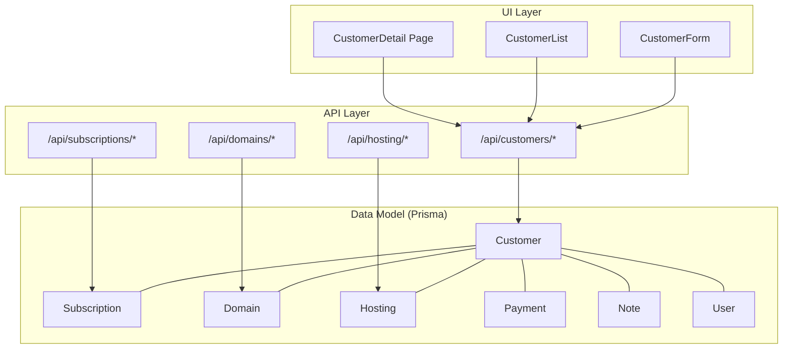
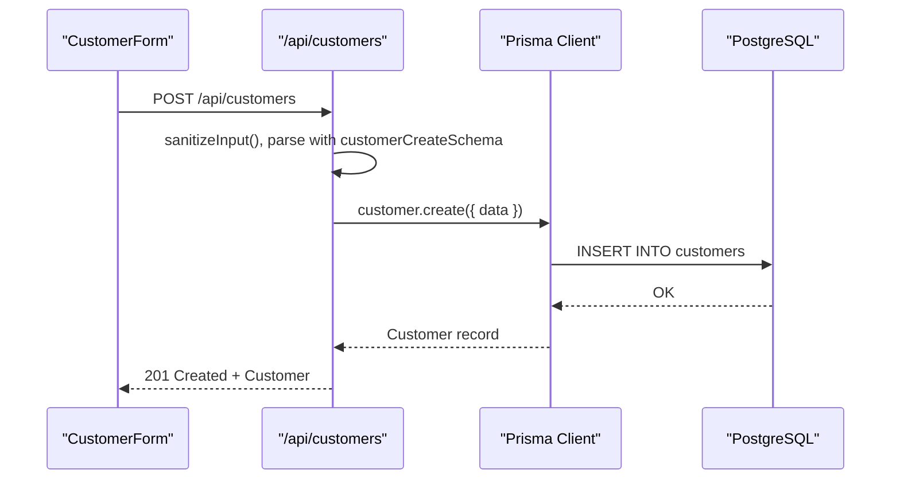
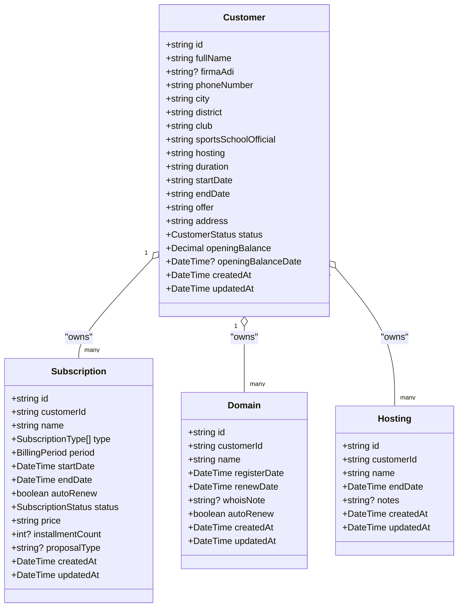
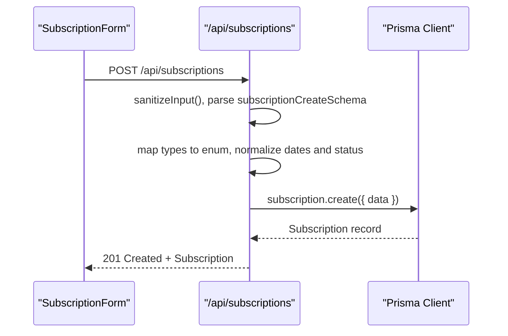
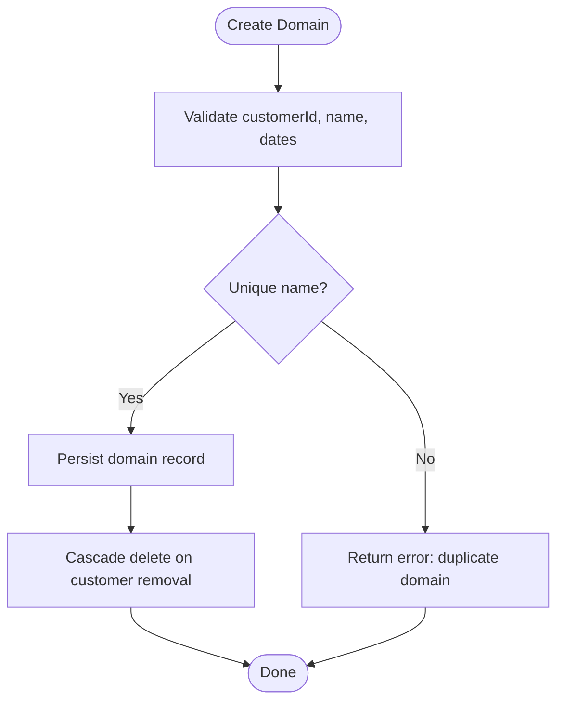
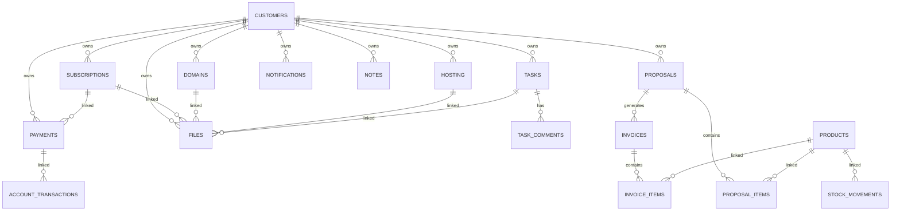

# Business Entities

<cite>
**Referenced Files in This Document**
- [schema.prisma](file://prisma/schema.prisma)
- [route.ts](file://src/app/api/customers/route.ts)
- [route.ts](file://src/app/api/subscriptions/route.ts)
- [route.ts](file://src/app/api/domains/route.ts)
- [route.ts](file://src/app/api/hosting/route.ts)
- [validations.ts](file://src/lib/validations.ts)
- [types.ts](file://src/lib/types.ts)
- [customer-form.tsx](file://src/components/customer-form.tsx)
- [customer-list.tsx](file://src/components/customer-list.tsx)
- [page.tsx](file://src/app/customers/[id]/page.tsx)
- [subscription-settings-client.ts](file://src/lib/subscription-settings-client.ts)
- [migration.sql](file://prisma/migrations/20260215091826_init/migration.sql)
- [fix_sub_type.sql](file://scripts/fix_sub_type.sql)
</cite>

## Table of Contents
1. [Introduction](#introduction)
2. [Project Structure](#project-structure)
3. [Core Components](#core-components)
4. [Architecture Overview](#architecture-overview)
5. [Detailed Component Analysis](#detailed-component-analysis)
6. [Dependency Analysis](#dependency-analysis)
7. [Performance Considerations](#performance-considerations)
8. [Troubleshooting Guide](#troubleshooting-guide)
9. [Conclusion](#conclusion)
10. [Appendices](#appendices)

## Introduction
This document describes the core business entities and their relationships in Customer WebMahsul. The system is centered around the concept of a customer owning and consuming multiple services: Subscriptions, Domains, and Hosting. All service records are linked to a customer via foreign keys, ensuring referential integrity and enabling portfolio-style queries. We define each entity’s fields, data types, constraints, and validation rules, and explain lifecycle management through status enums and business rules enforced by the Prisma schema and API layers.

## Project Structure
The data model is defined in the Prisma schema and surfaced through Next.js API routes and React components. The customer-centric design ensures that all services are owned by a customer, and cascading deletes propagate when a customer is removed.

**Diagram sources**
- [schema.prisma](file://prisma/schema.prisma)
- [route.ts](file://src/app/api/customers/route.ts)
- [route.ts](file://src/app/api/subscriptions/route.ts)
- [route.ts](file://src/app/api/domains/route.ts)
- [route.ts](file://src/app/api/hosting/route.ts)
- [customer-form.tsx](file://src/components/customer-form.tsx)
- [customer-list.tsx](file://src/components/customer-list.tsx)
- [page.tsx](file://src/app/customers/[id]/page.tsx)

**Section sources**
- [schema.prisma](file://prisma/schema.prisma)
- [route.ts](file://src/app/api/customers/route.ts)
- [route.ts](file://src/app/api/subscriptions/route.ts)
- [route.ts](file://src/app/api/domains/route.ts)
- [route.ts](file://src/app/api/hosting/route.ts)
- [customer-form.tsx](file://src/components/customer-form.tsx)
- [customer-list.tsx](file://src/components/customer-list.tsx)
- [page.ts](file://src/app/customers/[id]/page.tsx)

## Core Components
This section documents the five core business entities: Customer, Subscription, Domain, Hosting, and supporting enums and validations.

- Customer
  - Purpose: Central record for individuals or organizations receiving services.
  - Key fields: identifiers, contact info, location, status, timestamps, and financial metadata (opening balances).
  - Relationships: owns many Subscriptions, Domains, Hosting, Notes, Tasks, Payments, Notifications, Files, Proposals; optional user accounts; optional account transactions and invoices.
  - Status enum: CustomerStatus (POTENTIAL, ACTIVE, INACTIVE, LOST).
  - Constraints: unique identifiers, required fields for creation, soft-deletion via cascade on dependent entities.

- Subscription
  - Purpose: Recurring or time-bound service plans owned by a customer.
  - Key fields: customer linkage, name, type(s), billing period, dates, auto-renew flag, status, pricing, installments, proposal type.
  - Status enum: SubscriptionStatus (ACTIVE, EXPIRED, CANCELED).
  - Constraints: type stored as array of SubscriptionType; required customer; cascading delete on customer removal.

- Domain
  - Purpose: Registered domain names owned by a customer.
  - Key fields: customer linkage, unique domain name, registration/renewal dates, WHOIS notes, auto-renew flag.
  - Constraints: unique domain name; cascading delete on customer removal.

- Hosting
  - Purpose: Hosting accounts owned by a customer.
  - Key fields: customer linkage, name, end date, notes.
  - Constraints: cascading delete on customer removal.

- Supporting enums and validations
  - Enums: CustomerStatus, SubscriptionStatus, SubscriptionType, BillingPeriod, TaskStatus, PaymentStatus, PaymentType, NotificationType, NotificationChannel, TransactionType, InvoiceType, InvoiceStatus, ProposalStatus, ProposalType, MovementType.
  - Validation schemas enforce input constraints and business rules at the API boundary.

**Section sources**
- [schema.prisma](file://prisma/schema.prisma)
- [validations.ts](file://src/lib/validations.ts)

## Architecture Overview
The system follows a layered architecture:
- Data layer: Prisma schema defines entities, relations, and enums.
- API layer: Next.js routes implement CRUD operations with input sanitization and validation.
- UI layer: React components render forms and lists, invoking API endpoints.

**Diagram sources**
- [customer-form.tsx](file://src/components/customer-form.tsx)
- [route.ts](file://src/app/api/customers/route.ts)
- [validations.ts](file://src/lib/validations.ts)

**Section sources**
- [customer-form.tsx](file://src/components/customer-form.tsx)
- [route.ts](file://src/app/api/customers/route.ts)
- [validations.ts](file://src/lib/validations.ts)

## Detailed Component Analysis

### Customer Entity
- Identity and contact
  - Fields: id, fullName, firmaAdi (optional), phoneNumber, city, district, club, sportsSchoolOfficial, address, status (CustomerStatus), timestamps.
  - Constraints: fullName length limits; phone number format and length; city/district length limits; optional firm name; address length limits; status defaults to POTENTIAL.
- Financial metadata
  - Fields: openingBalance (Decimal default 0), openingBalanceDate (DateTime optional).
- Ownership relationships
  - Has-many: subscriptions, domains, hostings, notes, tasks, payments, notifications, files, proposals; optional userAccounts, accountTransactions, invoices.
- Lifecycle
  - Status progression: POTENTIAL → ACTIVE → INACTIVE → LOST; transitions managed by business logic outside this schema.
- API behavior
  - GET paginates and filters by search, city, and club; includes note counts.
  - POST validates and sanitizes inputs; creates customer with default values for certain fields; returns created record with counts.

**Diagram sources**
- [schema.prisma](file://prisma/schema.prisma)

**Section sources**
- [schema.prisma](file://prisma/schema.prisma)
- [route.ts](file://src/app/api/customers/route.ts)
- [validations.ts](file://src/lib/validations.ts)
- [types.ts](file://src/lib/types.ts)

### Subscription Entity
- Purpose and ownership
  - Owned by a customer; supports multiple types; billing period and dates define lifecycle.
- Types and periods
  - Type: array of SubscriptionType (e.g., SOFTWARE_RENTAL, CUSTOM_PROJECT, MAINTENANCE, NEXT_GEN_COACHING, AIDAT_TAKIP, FOOTBALL_CMS, DOMAIN, HOSTING).
  - Period: MONTHLY or YEARLY.
- Lifecycle and status
  - Status: ACTIVE, EXPIRED, CANCELED; defaults to ACTIVE.
- Validation rules
  - customerId required; name optional but auto-generated if missing; types required; dates must match format; price positive integer; optional proposalType with refinement.
- API behavior
  - GET supports pagination and filtering by search and customerId; includes customer name.
  - POST/PUT parse and normalize dates and enums; enforce type array presence.

**Diagram sources**
- [route.ts](file://src/app/api/subscriptions/route.ts)
- [validations.ts](file://src/lib/validations.ts)

**Section sources**
- [schema.prisma](file://prisma/schema.prisma)
- [route.ts](file://src/app/api/subscriptions/route.ts)
- [validations.ts](file://src/lib/validations.ts)
- [subscription-settings-client.ts](file://src/lib/subscription-settings-client.ts)
- [fix_sub_type.sql](file://scripts/fix_sub_type.sql)

### Domain Entity
- Purpose and ownership
  - Registered domain names owned by a customer; unique domain name constraint prevents duplicates.
- Lifecycle
  - Registration and renewal dates; optional auto-renew flag; cascading delete on customer removal.
- Validation rules
  - customerId required; name length limits; dates must match format; optional WHOIS notes; optional autoRenew.

**Diagram sources**
- [schema.prisma](file://prisma/schema.prisma)
- [route.ts](file://src/app/api/domains/route.ts)
- [validations.ts](file://src/lib/validations.ts)

**Section sources**
- [schema.prisma](file://prisma/schema.prisma)
- [route.ts](file://src/app/api/domains/route.ts)
- [validations.ts](file://src/lib/validations.ts)

### Hosting Entity
- Purpose and ownership
  - Hosting accounts owned by a customer; end date indicates validity.
- Lifecycle
  - End date and optional notes; cascading delete on customer removal.
- Validation rules
  - customerId required; name length limits; end date format; optional notes.

**Section sources**
- [schema.prisma](file://prisma/schema.prisma)
- [route.ts](file://src/app/api/hosting/route.ts)
- [validations.ts](file://src/lib/validations.ts)

### Status Enums and Business Rules
- CustomerStatus: POTENTIAL, ACTIVE, INACTIVE, LOST.
- SubscriptionStatus: ACTIVE, EXPIRED, CANCELED.
- Additional enums: SubscriptionType, BillingPeriod, TaskStatus, PaymentStatus, PaymentType, NotificationType, NotificationChannel, TransactionType, InvoiceType, InvoiceStatus, ProposalStatus, ProposalType, MovementType.

Business rule enforcement:
- Cascading deletes: Customer deletion removes Subscriptions, Domains, Hosting, Tasks, Payments, Notifications, Notes, and related files.
- Unique constraints: Customer fullName, city, district; Domain name; Setting key; Invoice number; Proposal number.
- Input validation: Zod schemas validate and sanitize all API inputs; enums normalized in API routes.

**Section sources**
- [schema.prisma](file://prisma/schema.prisma)
- [validations.ts](file://src/lib/validations.ts)
- [route.ts](file://src/app/api/customers/route.ts)
- [route.ts](file://src/app/api/subscriptions/route.ts)
- [route.ts](file://src/app/api/domains/route.ts)
- [route.ts](file://src/app/api/hosting/route.ts)

## Dependency Analysis
Foreign key relationships and cascade behaviors are defined in the Prisma schema and enforced by database migrations.

**Diagram sources**
- [schema.prisma](file://prisma/schema.prisma)
- [migration.sql](file://prisma/migrations/20260215091826_init/migration.sql)

**Section sources**
- [schema.prisma](file://prisma/schema.prisma)
- [migration.sql](file://prisma/migrations/20260215091826_init/migration.sql)

## Performance Considerations
- Indexing: Unique constraints on name fields and identifiers improve lookup performance.
- Pagination: API routes support page and limit parameters with max limit enforcement to prevent heavy queries.
- Filtering: WHERE clauses combine multiple filters; ensure appropriate indices exist for searched fields.
- Includes: API endpoints include related counts or minimal fields to reduce payload sizes.

## Troubleshooting Guide
Common issues and resolutions:
- Duplicate domain name
  - Symptom: Creation fails with unique constraint violation.
  - Resolution: Ensure domain name is unique; check existing records before insert.
- Invalid customer ID
  - Symptom: Subscription/domain/hosting creation fails due to missing customerId.
  - Resolution: Verify customer exists and ID is provided correctly.
- Enum normalization
  - Symptom: Unexpected values in type/status fields.
  - Resolution: Ensure API routes normalize string values to enum types before persisting.
- Cascading delete expectations
  - Symptom: Deleting a customer unexpectedly removes dependent records.
  - Resolution: Confirm cascade delete behavior is intended; otherwise adjust schema accordingly.

**Section sources**
- [schema.prisma](file://prisma/schema.prisma)
- [route.ts](file://src/app/api/customers/route.ts)
- [route.ts](file://src/app/api/subscriptions/route.ts)
- [route.ts](file://src/app/api/domains/route.ts)
- [route.ts](file://src/app/api/hosting/route.ts)

## Conclusion
Customer WebMahsul’s data model centers on the Customer entity and links all services—Subscriptions, Domains, and Hosting—via foreign keys. Enums and validation schemas enforce business rules, while cascade deletes maintain referential integrity. The API layer consistently normalizes inputs and applies constraints, enabling reliable portfolio-style queries and robust data management.

## Appendices

### Practical Query Patterns
- Retrieve a customer’s service portfolio
  - Fetch customer with includes for subscriptions, domains, and hostings.
  - Filter by customerId in subscriptions, domains, and hostings endpoints.
- Find overdue or expiring services
  - Use date comparisons on endDate and current date for subscriptions, domains, and hosting.
- Aggregate customer activity
  - Use counts and sums across payments, invoices, and account transactions.

### UI Integration Examples
- Customer list with search and pagination
  - Uses API endpoint with page and limit parameters and search term.
- Customer detail page
  - Navigates to customer detail route and renders associated services.

**Section sources**
- [customer-list.tsx](file://src/components/customer-list.tsx)
- [page.tsx](file://src/app/customers/[id]/page.tsx)
- [route.ts](file://src/app/api/customers/route.ts)