# Customer Entity

<cite>
**Referenced Files in This Document**
- [schema.prisma](file://prisma/schema.prisma)
- [route.ts](file://src/app/api/customers/route.ts)
- [route.ts](file://src/app/api/customers/[id]/route.ts)
- [validations.ts](file://src/lib/validations.ts)
- [customer-form.tsx](file://src/components/customer-form.tsx)
- [types.ts](file://src/lib/types.ts)
- [page.tsx](file://src/app/admin/accounting/customers/page.tsx)
- [route.ts](file://src/app/api/accounting/customers/route.ts)
- [page.tsx](file://src/app/admin/accounting/customers/[id]/page.tsx)
</cite>

## Table of Contents
1. [Introduction](#introduction)
2. [Project Structure](#project-structure)
3. [Core Components](#core-components)
4. [Architecture Overview](#architecture-overview)
5. [Detailed Component Analysis](#detailed-component-analysis)
6. [Dependency Analysis](#dependency-analysis)
7. [Performance Considerations](#performance-considerations)
8. [Troubleshooting Guide](#troubleshooting-guide)
9. [Conclusion](#conclusion)

## Introduction
This document provides a comprehensive data model specification for the Customer entity, detailing the record structure, validation rules, defaults, business constraints, and relationships to related domain objects. It also documents the customer lifecycle, status management, and the new accounting features including opening balances and account transactions.

## Project Structure
The Customer entity is defined in the Prisma schema and surfaced via API endpoints and UI components. The schema defines the entity, enums, and relations. API routes handle CRUD operations and expose customer data to the frontend. Validation schemas ensure data integrity. UI components render forms and lists for customer management.

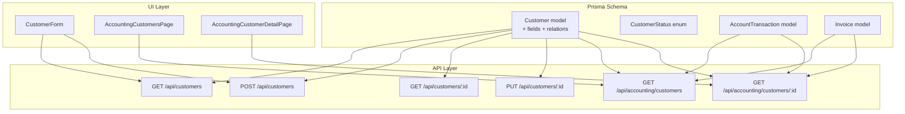

**Diagram sources**
- [schema.prisma](file://prisma/schema.prisma)
- [route.ts](file://src/app/api/customers/route.ts)
- [route.ts](file://src/app/api/customers/[id]/route.ts)
- [route.ts](file://src/app/api/accounting/customers/route.ts)
- [page.tsx](file://src/app/admin/accounting/customers/page.tsx)
- [page.tsx](file://src/app/admin/accounting/customers/[id]/page.tsx)
- [customer-form.tsx](file://src/components/customer-form.tsx)

**Section sources**
- [schema.prisma](file://prisma/schema.prisma)
- [route.ts](file://src/app/api/customers/route.ts)
- [route.ts](file://src/app/api/customers/[id]/route.ts)
- [route.ts](file://src/app/api/accounting/customers/route.ts)
- [page.tsx](file://src/app/admin/accounting/customers/page.tsx)
- [page.tsx](file://src/app/admin/accounting/customers/[id]/page.tsx)
- [customer-form.tsx](file://src/components/customer-form.tsx)

## Core Components
- Customer entity: Core record with personal and business information, lifecycle status, and accounting fields.
- Status enum: CustomerStatus with POTENTIAL, ACTIVE, INACTIVE, LOST.
- Accounting fields: openingBalance (Decimal default 0) and openingBalanceDate (DateTime optional).
- Relationships: One-to-many to subscriptions, domains, hostings, tasks, payments, notifications, files, proposals, accountTransactions, invoices.

Key fields and defaults:
- fullName: Required string
- phoneNumber: Required string
- city: Required string
- district: Required string
- club: Optional string
- sportsSchoolOfficial: Optional string
- hosting: Optional string
- duration: Optional string
- startDate: Optional string
- endDate: Optional string
- offer: Optional string
- address: Optional string
- price: Optional string
- status: Enum CustomerStatus with default POTENTIAL
- openingBalance: Decimal default 0
- openingBalanceDate: DateTime optional

Validation rules (selected):
- fullName: length 2–100
- phoneNumber: regex pattern for digits and common separators, length 10–20
- city: length 2–50
- district: length 2–50
- club: length 2–100
- sportsSchoolOfficial: length 2–100
- address: length 10–500
- price: numeric, max length 10

**Section sources**
- [schema.prisma](file://prisma/schema.prisma)
- [validations.ts](file://src/lib/validations.ts)

## Architecture Overview
The Customer entity participates in multiple domain workflows:
- Customer lifecycle: Creation → Potential → Active → Inactive/Lost
- Business information: firmaAdi, club, sportsSchoolOfficial, hosting, duration, startDate, endDate, offer, price
- Status management: Controlled via API updates and validated by Zod schemas
- Accounting integration: Opening balance and account transactions track receivables/payables per customer

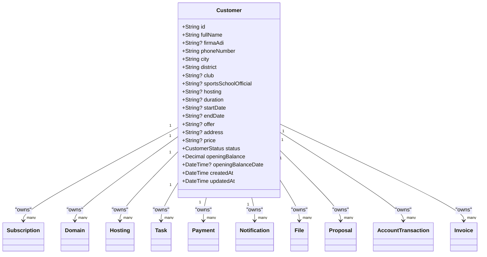

**Diagram sources**
- [schema.prisma](file://prisma/schema.prisma)

## Detailed Component Analysis

### Customer Data Model Definition
- Fields: fullName, phoneNumber, city, district, club, sportsSchoolOfficial, hosting, duration, startDate, endDate, offer, address, price, status, openingBalance, openingBalanceDate, timestamps.
- Defaults: status=CustomerStatus.POTENTIAL, openingBalance=0, optional openingBalanceDate.
- Validation: Enforced by Zod schemas for create/update operations.

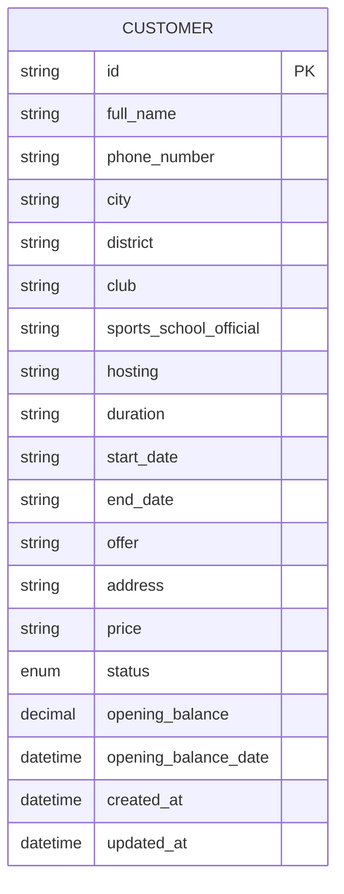

**Diagram sources**
- [schema.prisma](file://prisma/schema.prisma)

**Section sources**
- [schema.prisma](file://prisma/schema.prisma)
- [validations.ts](file://src/lib/validations.ts)

### Customer Lifecycle and Status Management
- Initial state: POTENTIAL upon creation.
- Transitions:
  - Potential → Active: After conversion from proposal or first service delivery.
  - Active → Inactive: Suspension or deactivation.
  - Active → Lost: Churn or contract termination.
  - Inactive → Active: Re-engagement.
  - Lost: Typically remains lost unless reactivated externally.
- Status is controlled via API updates and validated by Zod schemas.

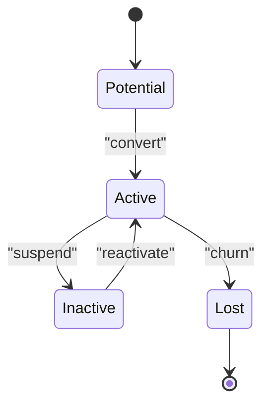

**Section sources**
- [schema.prisma](file://prisma/schema.prisma)
- [route.ts](file://src/app/api/customers/[id]/route.ts)
- [validations.ts](file://src/lib/validations.ts)

### API Workflows

#### Create Customer
- Endpoint: POST /api/customers
- Input: Sanitized and validated customer data
- Behavior: Creates customer with default status POTENTIAL and empty business fields; returns created record with counts

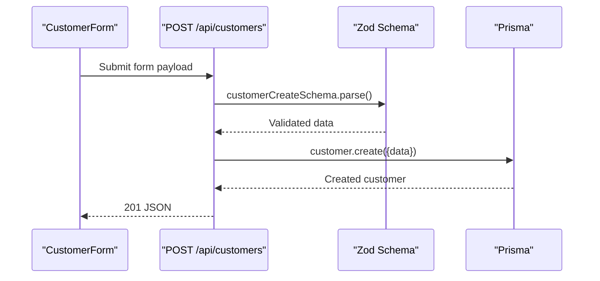

**Diagram sources**
- [route.ts](file://src/app/api/customers/route.ts)
- [validations.ts](file://src/lib/validations.ts)
- [customer-form.tsx](file://src/components/customer-form.tsx)

**Section sources**
- [route.ts](file://src/app/api/customers/route.ts)
- [validations.ts](file://src/lib/validations.ts)
- [customer-form.tsx](file://src/components/customer-form.tsx)

#### Update Customer
- Endpoint: PUT /api/customers/:id
- Input: Partial customer fields with sanitization and validation
- Behavior: Updates customer record and returns updated data

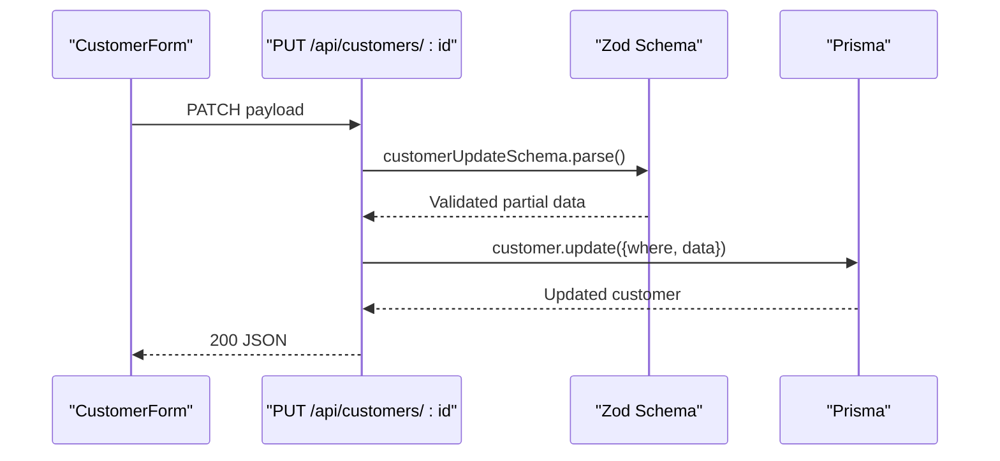

**Diagram sources**
- [route.ts](file://src/app/api/customers/[id]/route.ts)
- [validations.ts](file://src/lib/validations.ts)
- [customer-form.tsx](file://src/components/customer-form.tsx)

**Section sources**
- [route.ts](file://src/app/api/customers/[id]/route.ts)
- [validations.ts](file://src/lib/validations.ts)
- [customer-form.tsx](file://src/components/customer-form.tsx)

#### Retrieve Customer
- Endpoint: GET /api/customers/:id
- Behavior: Returns customer with notes ordered by newest and note count

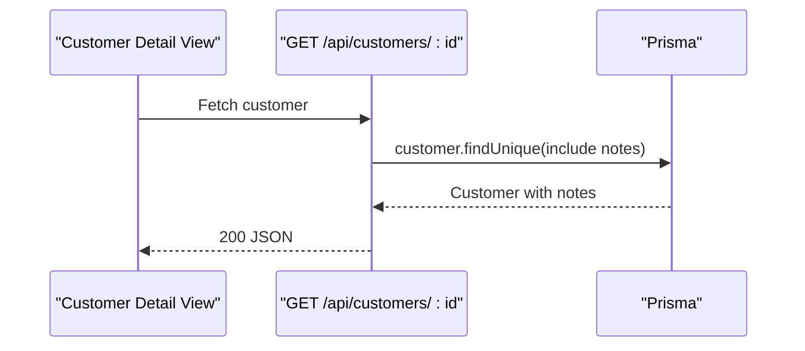

**Diagram sources**
- [route.ts](file://src/app/api/customers/[id]/route.ts)

**Section sources**
- [route.ts](file://src/app/api/customers/[id]/route.ts)

#### List Customers
- Endpoint: GET /api/customers
- Behavior: Paginated list with filters (search, city, club); includes note counts

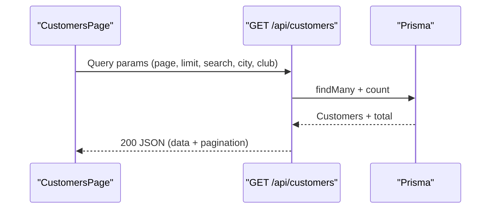

**Diagram sources**
- [route.ts](file://src/app/api/customers/route.ts)
- [page.tsx](file://src/app/customers/page.tsx)

**Section sources**
- [route.ts](file://src/app/api/customers/route.ts)
- [page.tsx](file://src/app/customers/page.tsx)
- [types.ts](file://src/lib/types.ts)

### Accounting Integration

#### Portfolio View (Accounting)
- Endpoint: GET /api/accounting/customers
- Behavior: Lists customers with computed current balance derived from latest account transaction

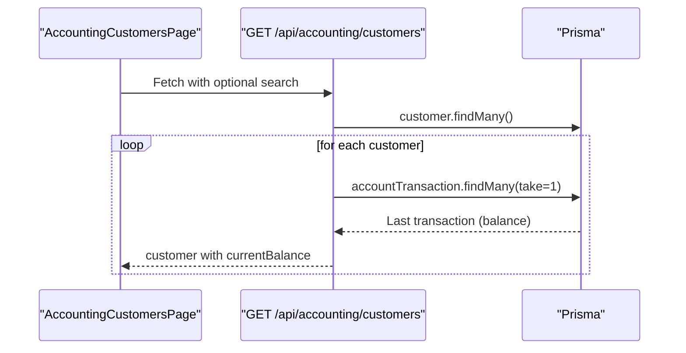

**Diagram sources**
- [route.ts](file://src/app/api/accounting/customers/route.ts)
- [page.tsx](file://src/app/admin/accounting/customers/page.tsx)

**Section sources**
- [route.ts](file://src/app/api/accounting/customers/route.ts)
- [page.tsx](file://src/app/admin/accounting/customers/page.tsx)

#### Customer Detail (Accounting)
- Endpoint: GET /api/accounting/customers/:id
- Behavior: Returns customer, transactions, and summary (totals and balance)

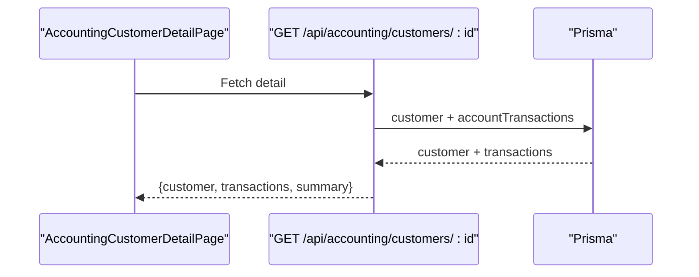

**Diagram sources**
- [page.tsx](file://src/app/admin/accounting/customers/[id]/page.tsx)
- [route.ts](file://src/app/api/accounting/customers/[id]/page.tsx)

**Section sources**
- [page.tsx](file://src/app/admin/accounting/customers/[id]/page.tsx)
- [route.ts](file://src/app/api/accounting/customers/[id]/page.tsx)

### Field Validation Rules and Defaults
- Personal info:
  - fullName: 2–100 chars
  - phoneNumber: regex digits/+, length 10–20
  - city: 2–50 chars
  - district: 2–50 chars
- Business info:
  - club: 2–100 chars
  - sportsSchoolOfficial: 2–100 chars
  - address: 10–500 chars
  - price: numeric, max 10 digits
- Status: Enum CustomerStatus with default POTENTIAL
- Accounting:
  - openingBalance: Decimal default 0
  - openingBalanceDate: DateTime optional

**Section sources**
- [validations.ts](file://src/lib/validations.ts)
- [schema.prisma](file://prisma/schema.prisma)

### Business Constraints and Defaults
- Cascading deletes: Deleting a customer cascades to related records (subscriptions, domains, hostings, tasks, payments, notifications, files, proposals, accountTransactions, invoices).
- Optional business fields: hosting, duration, startDate, endDate, offer, price, address, club, sportsSchoolOfficial.
- Default status: POTENTIAL for new customers.

**Section sources**
- [schema.prisma](file://prisma/schema.prisma)

### Practical Use Cases
- Customer creation workflow:
  - Use CustomerForm to enter personal info and submit to POST /api/customers.
  - On success, navigate to customer detail or list.
- Status transitions:
  - Update customer status via PUT /api/customers/:id to ACTIVE/INACTIVE/LOST.
- Portfolio management:
  - Use AccountingCustomersPage to filter/search and view balances.
  - Drill into AccountingCustomerDetailPage for transaction history and summaries.

**Section sources**
- [customer-form.tsx](file://src/components/customer-form.tsx)
- [route.ts](file://src/app/api/customers/route.ts)
- [route.ts](file://src/app/api/customers/[id]/route.ts)
- [page.tsx](file://src/app/admin/accounting/customers/page.tsx)
- [page.tsx](file://src/app/admin/accounting/customers/[id]/page.tsx)

## Dependency Analysis
- Customer depends on:
  - Prisma schema for persistence and relations
  - Zod validation schemas for input sanitization and constraints
  - API routes for CRUD operations
  - UI components for rendering and user interaction
- Accounting features depend on AccountTransaction and Invoice models, with computed balances.

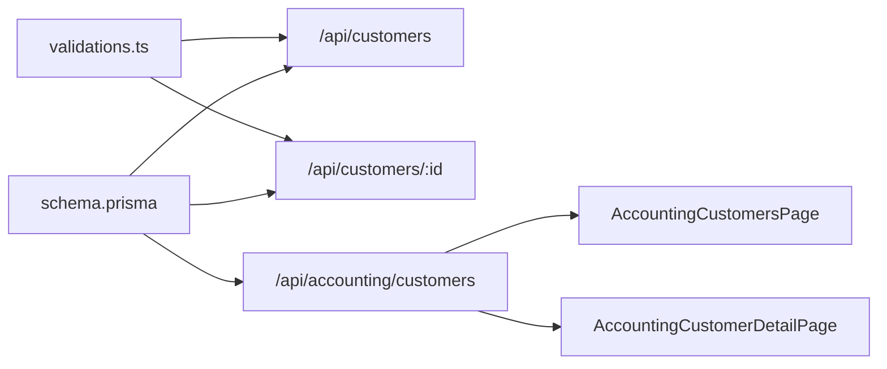

**Diagram sources**
- [schema.prisma](file://prisma/schema.prisma)
- [validations.ts](file://src/lib/validations.ts)
- [route.ts](file://src/app/api/customers/route.ts)
- [route.ts](file://src/app/api/customers/[id]/route.ts)
- [route.ts](file://src/app/api/accounting/customers/route.ts)
- [page.tsx](file://src/app/admin/accounting/customers/page.tsx)
- [page.tsx](file://src/app/admin/accounting/customers/[id]/page.tsx)

**Section sources**
- [schema.prisma](file://prisma/schema.prisma)
- [validations.ts](file://src/lib/validations.ts)
- [route.ts](file://src/app/api/customers/route.ts)
- [route.ts](file://src/app/api/customers/[id]/route.ts)
- [route.ts](file://src/app/api/accounting/customers/route.ts)
- [page.tsx](file://src/app/admin/accounting/customers/page.tsx)
- [page.tsx](file://src/app/admin/accounting/customers/[id]/page.tsx)

## Performance Considerations
- Pagination: API endpoints support page and limit parameters with a cap to prevent excessive loads.
- Filtering: Index-friendly filters on fullName, city, and club reduce database scan overhead.
- Computed balances: Accounting endpoints compute balances from latest transactions; consider caching or materialized views for high-volume scenarios.

## Troubleshooting Guide
- Validation errors: Ensure inputs match Zod patterns (phone regex, lengths, numeric constraints).
- ID validation: API routes validate resource IDs; incorrect IDs cause 404 responses.
- Cascading deletes: Deleting a customer removes dependent records automatically; confirm intent before deletion.
- Sanitization: API routes sanitize string inputs; malformed payloads may be rejected.

**Section sources**
- [route.ts](file://src/app/api/customers/route.ts)
- [route.ts](file://src/app/api/customers/[id]/route.ts)
- [route.ts](file://src/app/api/accounting/customers/route.ts)

## Conclusion
The Customer entity integrates personal and business information with robust validation, lifecycle status management, and comprehensive accounting features. Its relationships to subscriptions, domains, hostings, tasks, payments, notifications, files, proposals, account transactions, and invoices enable holistic customer portfolio management. The API and UI components provide structured workflows for creation, updates, viewing, and financial tracking.