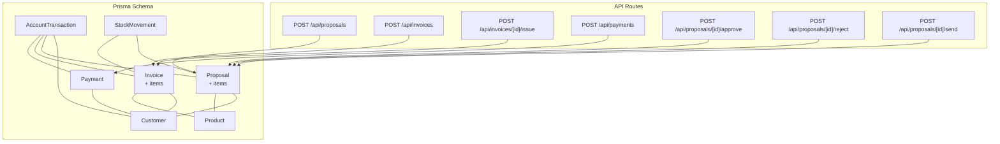
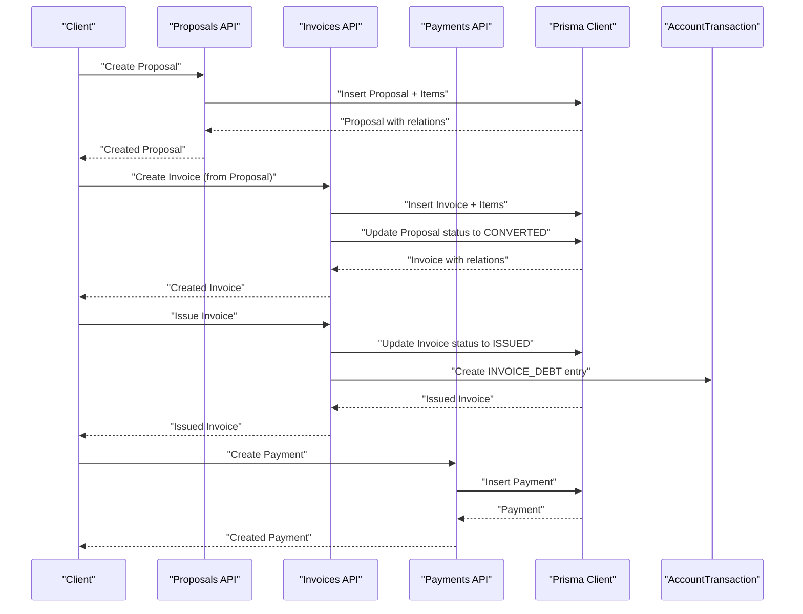
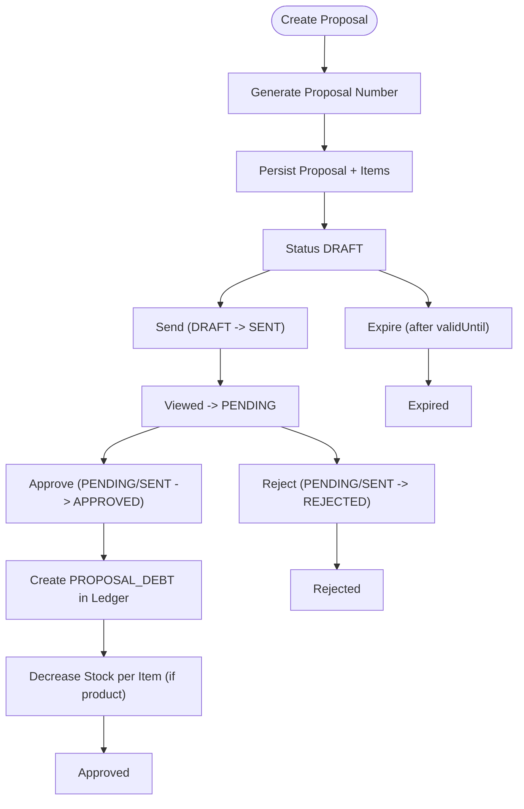
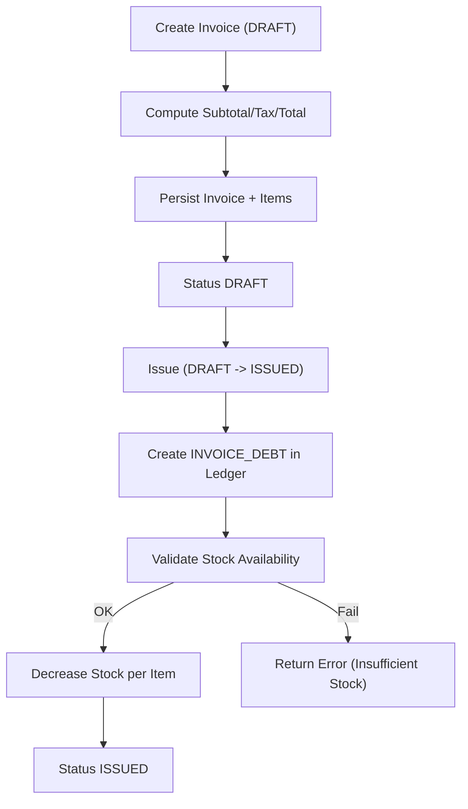
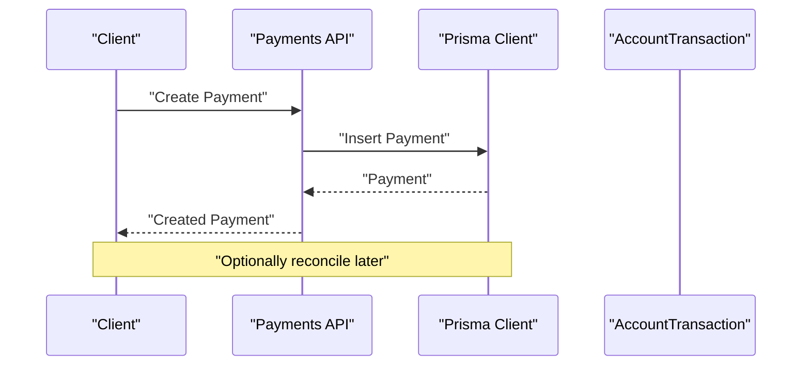
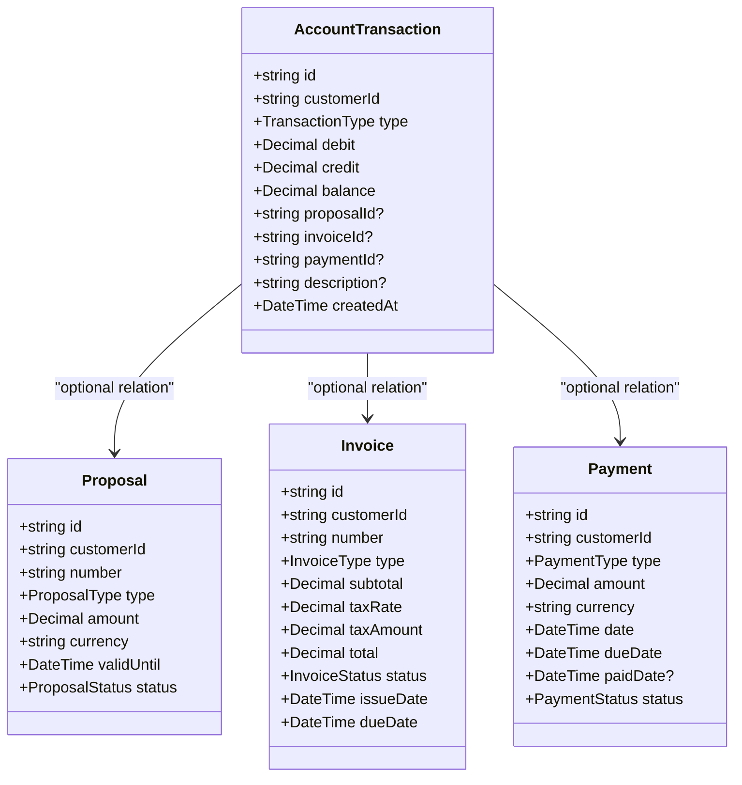
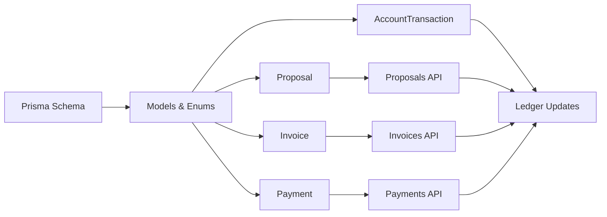

# Financial Entities

<cite>
**Referenced Files in This Document**
- [schema.prisma](file://prisma/schema.prisma)
- [proposals route.ts](file://src/app/api/proposals/route.ts)
- [proposal [id] route.ts](file://src/app/api/proposals/[id]/route.ts)
- [proposal approve route.ts](file://src/app/api/proposals/[id]/approve/route.ts)
- [proposal reject route.ts](file://src/app/api/proposals/[id]/reject/route.ts)
- [proposal send route.ts](file://src/app/api/proposals/[id]/send/route.ts)
- [invoices route.ts](file://src/app/api/invoices/route.ts)
- [invoice issue route.ts](file://src/app/api/invoices/[id]/issue/route.ts)
- [payments route.ts](file://src/app/api/payments/route.ts)
</cite>

## Table of Contents
1. [Introduction](#introduction)
2. [Project Structure](#project-structure)
3. [Core Components](#core-components)
4. [Architecture Overview](#architecture-overview)
5. [Detailed Component Analysis](#detailed-component-analysis)
6. [Dependency Analysis](#dependency-analysis)
7. [Performance Considerations](#performance-considerations)
8. [Troubleshooting Guide](#troubleshooting-guide)
9. [Conclusion](#conclusion)

## Introduction
This document describes the financial entities and the new accounting integration in the system. It covers:
- Proposal: creation, approval workflows, validity periods, and relationships to customers and invoices
- Invoice: generation, tax calculations, issuance, and payment tracking
- Payment: processing, reconciliation, and relationships to customers, invoices, and subscriptions
- Accounting integration: AccountTransaction ledger entries and TransactionType enumeration, and how proposals, invoices, and payments relate to the ledger

The goal is to provide a clear, practical understanding of the financial data model, business rules, and API flows without requiring deep technical knowledge.

## Project Structure
The financial domain spans the Prisma schema and several API routes:
- Prisma schema defines models, enums, relations, and constraints
- API routes implement CRUD and workflow actions for proposals, invoices, and payments
- Validation schemas ensure data integrity and enforce business rules

**Diagram sources**
- [schema.prisma](file://prisma/schema.prisma)
- [proposals route.ts](file://src/app/api/proposals/route.ts)
- [invoices route.ts](file://src/app/api/invoices/route.ts)
- [invoice issue route.ts](file://src/app/api/invoices/[id]/issue/route.ts)
- [payments route.ts](file://src/app/api/payments/route.ts)
- [proposal approve route.ts](file://src/app/api/proposals/[id]/approve/route.ts)
- [proposal reject route.ts](file://src/app/api/proposals/[id]/reject/route.ts)
- [proposal send route.ts](file://src/app/api/proposals/[id]/send/route.ts)

**Section sources**
- [schema.prisma](file://prisma/schema.prisma)
- [proposals route.ts](file://src/app/api/proposals/route.ts)
- [invoices route.ts](file://src/app/api/invoices/route.ts)
- [invoice issue route.ts](file://src/app/api/invoices/[id]/issue/route.ts)
- [payments route.ts](file://src/app/api/payments/route.ts)
- [proposal approve route.ts](file://src/app/api/proposals/[id]/approve/route.ts)
- [proposal reject route.ts](file://src/app/api/proposals/[id]/reject/route.ts)
- [proposal send route.ts](file://src/app/api/proposals/[id]/send/route.ts)

## Core Components
This section outlines the financial entities and their attributes, constraints, and relationships.

- Proposal
  - Unique number, title, type, description, amount with decimal precision, currency, validity period, status lifecycle, and optional notes
  - Relationship to Customer and optional Invoice(s)
  - Optional ProposalItem lines linked to Product
  - Optional AccountTransaction entries for ledger
  - Optional StockMovement entries for inventory

- Invoice
  - Unique number, customer relation, optional proposal origin, type (SALE or RETURN), tax rate and amounts, totals, status lifecycle, dates, and optional notes
  - InvoiceItem lines linked to Product
  - Payments collection and StockMovement entries
  - AccountTransaction entries for ledger

- Payment
  - Customer relation, optional invoice and subscription relations, type (CASH, TRANSFER, CREDIT_CARD), amount with decimal precision, currency, date and dueDate, optional paidDate, status (DUE, LATE, PAID), optional note/description
  - Optional AccountTransaction entries for ledger

- Accounting Integration
  - AccountTransaction: customer relation, type (OPENING_BALANCE, PROPOSAL_DEBT, INVOICE_DEBT, PAYMENT_CREDIT, MANUAL_ADJUSTMENT), debit/credit/running balance, optional relations to Proposal/Invoice/Payment, description, createdAt
  - TransactionType enumeration
  - StockMovement: product relation, movement type (IN, OUT, ADJUSTMENT), quantity, optional relations to Proposal/Invoice, description, createdAt

**Section sources**
- [schema.prisma](file://prisma/schema.prisma)

## Architecture Overview
The financial architecture connects entities via relations and enforces business rules through API endpoints and database constraints. The accounting ledger is updated during key events (proposal approval, invoice issuance, payment creation).

**Diagram sources**
- [proposals route.ts](file://src/app/api/proposals/route.ts)
- [invoices route.ts](file://src/app/api/invoices/route.ts)
- [invoice issue route.ts](file://src/app/api/invoices/[id]/issue/route.ts)
- [payments route.ts](file://src/app/api/payments/route.ts)
- [schema.prisma](file://prisma/schema.prisma)

## Detailed Component Analysis

### Proposal Entity
Proposal captures commercial offers with structured items and lifecycle management.

Key attributes and behaviors:
- Numbering: auto-generated with a yearly sequence format
- Types: enumerated (SUBSCRIPTION, PROJECT, MAINTENANCE, etc.)
- Amount and currency: decimal precision with default currency
- Validity: validUntil date controls expiration
- Status lifecycle: DRAFT → SENT → PENDING → APPROVED/REJECTED → EXPIRED/CONVERTED
- Approval workflow: requires SENT/PENDING status, creates PROPOSAL_DEBT ledger entry, updates stock if items reference products
- Relationship to Customer and optional Invoice(s)
- Optional ProposalItem lines and StockMovement entries

**Diagram sources**
- [proposals route.ts](file://src/app/api/proposals/route.ts)
- [proposal send route.ts](file://src/app/api/proposals/[id]/send/route.ts)
- [proposal approve route.ts](file://src/app/api/proposals/[id]/approve/route.ts)
- [proposal reject route.ts](file://src/app/api/proposals/[id]/reject/route.ts)
- [schema.prisma](file://prisma/schema.prisma)

**Section sources**
- [proposals route.ts](file://src/app/api/proposals/route.ts)
- [proposal [id] route.ts](file://src/app/api/proposals/[id]/route.ts)
- [proposal send route.ts](file://src/app/api/proposals/[id]/send/route.ts)
- [proposal approve route.ts](file://src/app/api/proposals/[id]/approve/route.ts)
- [proposal reject route.ts](file://src/app/api/proposals/[id]/reject/route.ts)
- [schema.prisma](file://prisma/schema.prisma)

### Invoice Entity
Invoice represents sales or return documents with tax calculations and issuance workflow.

Key attributes and behaviors:
- Numbering: auto-generated with a yearly sequence format
- Origin: optional link to Proposal (CONVERTED upon creation)
- Type: SALE or RETURN
- Tax calculation: subtotal, taxRate, taxAmount, total
- Status lifecycle: DRAFT → ISSUED → PARTIAL → PAID → CANCELLED
- Issuance: updates status to ISSUED and creates INVOICE_DEBT ledger entry, validates stock availability and updates inventory
- Relationships: Customer, Proposal, InvoiceItem lines, Payments, StockMovement, AccountTransaction

**Diagram sources**
- [invoices route.ts](file://src/app/api/invoices/route.ts)
- [invoice issue route.ts](file://src/app/api/invoices/[id]/issue/route.ts)
- [schema.prisma](file://prisma/schema.prisma)

**Section sources**
- [invoices route.ts](file://src/app/api/invoices/route.ts)
- [invoice issue route.ts](file://src/app/api/invoices/[id]/issue/route.ts)
- [schema.prisma](file://prisma/schema.prisma)

### Payment Entity
Payment tracks cash, transfer, and credit card receipts against invoices and subscriptions.

Key attributes and behaviors:
- Types: CASH, TRANSFER, CREDIT_CARD
- Amount and currency: decimal precision
- Dates: date and dueDate; optional paidDate
- Status: DUE, LATE, PAID
- Relationships: Customer, optional Invoice and Subscription
- Optional AccountTransaction entries for ledger

**Diagram sources**
- [payments route.ts](file://src/app/api/payments/route.ts)
- [schema.prisma](file://prisma/schema.prisma)

**Section sources**
- [payments route.ts](file://src/app/api/payments/route.ts)
- [schema.prisma](file://prisma/schema.prisma)

### Accounting Integration
AccountTransaction serves as the central ledger for financial activity.

- Entries created on:
  - Proposal approval: PROPOSAL_DEBT (debit)
  - Invoice issuance: INVOICE_DEBT (debit)
  - Payment receipt: PAYMENT_CREDIT (credit)
  - Opening balances and manual adjustments: OPENING_BALANCE and MANUAL_ADJUSTMENT
- Running balance maintained per entry
- Optional relations to Proposal, Invoice, and Payment for traceability
- Movement of goods tracked via StockMovement for OUT flows when proposals/invoices are processed

**Diagram sources**
- [schema.prisma](file://prisma/schema.prisma)

**Section sources**
- [schema.prisma](file://prisma/schema.prisma)

## Dependency Analysis
Financial entities and workflows depend on:
- Prisma schema for data modeling and referential integrity
- API routes for business logic and transaction boundaries
- Validation schemas for input sanitization and constraints
- Decimal arithmetic for precise financial computations

**Diagram sources**
- [schema.prisma](file://prisma/schema.prisma)
- [proposals route.ts](file://src/app/api/proposals/route.ts)
- [invoices route.ts](file://src/app/api/invoices/route.ts)
- [invoice issue route.ts](file://src/app/api/invoices/[id]/issue/route.ts)
- [payments route.ts](file://src/app/api/payments/route.ts)

**Section sources**
- [schema.prisma](file://prisma/schema.prisma)
- [proposals route.ts](file://src/app/api/proposals/route.ts)
- [invoices route.ts](file://src/app/api/invoices/route.ts)
- [invoice issue route.ts](file://src/app/api/invoices/[id]/issue/route.ts)
- [payments route.ts](file://src/app/api/payments/route.ts)

## Performance Considerations
- Prefer batched queries and pagination for listing endpoints
- Use database transactions for multi-entity writes (e.g., invoice creation, proposal approval) to maintain consistency
- Indexes on frequently filtered fields (customer, status, dates) improve query performance
- Decimal arithmetic should be handled carefully; rely on database Decimal types and avoid floating-point conversions
- Limit payload sizes for invoice items and proposal items to reduce memory overhead

## Troubleshooting Guide
Common issues and resolutions:
- Proposal creation fails due to validation errors: ensure required fields (title, amount, validUntil) and proper types are provided
- Proposal approval fails due to invalid status: only SENT or PENDING proposals can be approved
- Proposal approval fails due to insufficient stock: verify product stock quantities before approval
- Invoice creation fails due to missing items or invalid tax values: ensure at least one item exists and taxRate is valid
- Invoice issuance fails due to insufficient stock: confirm product availability before issuing
- Payment creation/update fails: sanitize inputs and ensure amount/currency/status are valid

**Section sources**
- [proposal approve route.ts](file://src/app/api/proposals/[id]/approve/route.ts)
- [proposal reject route.ts](file://src/app/api/proposals/[id]/reject/route.ts)
- [proposal send route.ts](file://src/app/api/proposals/[id]/send/route.ts)
- [invoices route.ts](file://src/app/api/invoices/route.ts)
- [invoice issue route.ts](file://src/app/api/invoices/[id]/issue/route.ts)
- [payments route.ts](file://src/app/api/payments/route.ts)

## Conclusion
The financial module provides a robust foundation for managing proposals, invoices, payments, and accounting entries. The schema enforces strong data integrity, while API routes encapsulate business rules and ledger updates. By leveraging transactions, validation, and clear status lifecycles, the system supports reliable financial workflows and accurate reporting through the ledger.