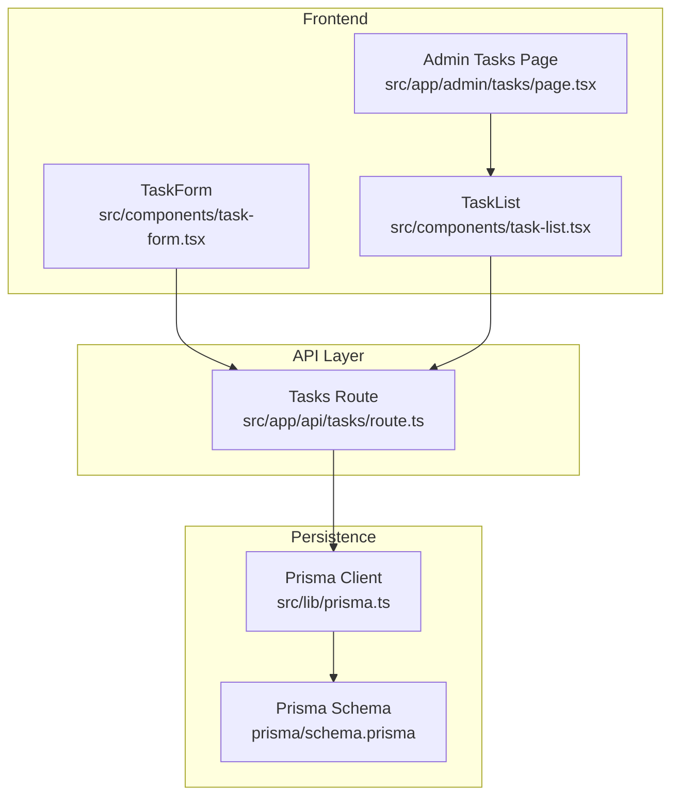
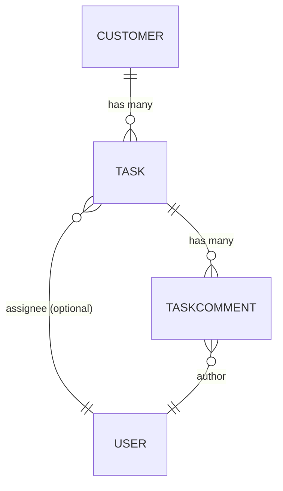
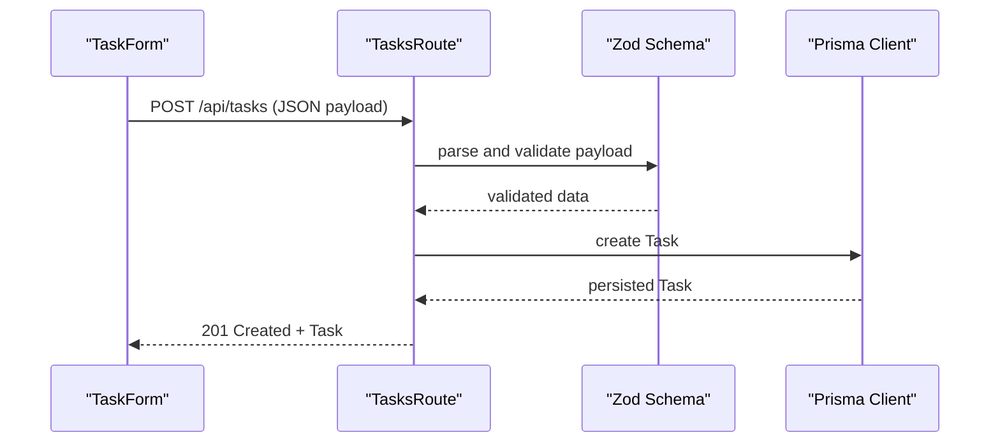
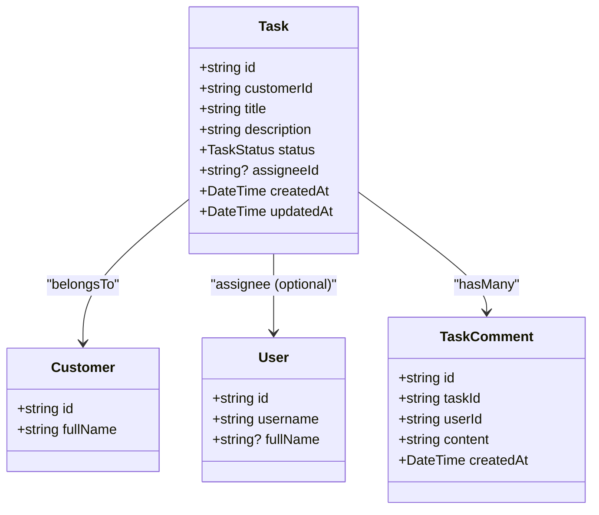
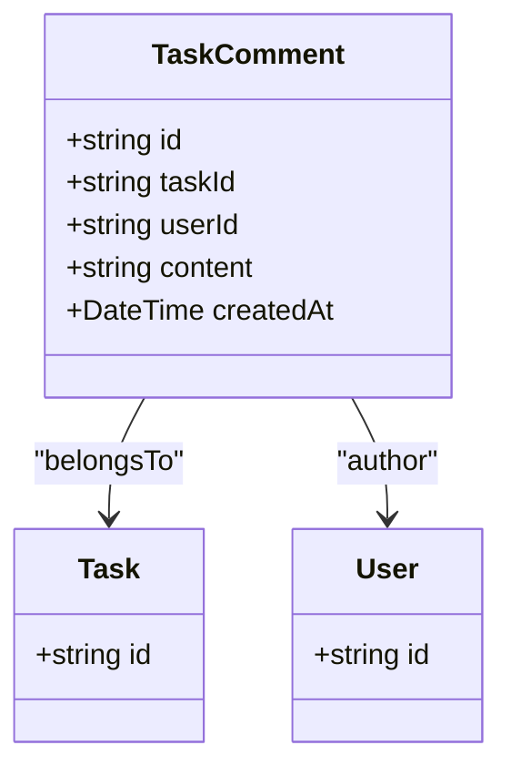
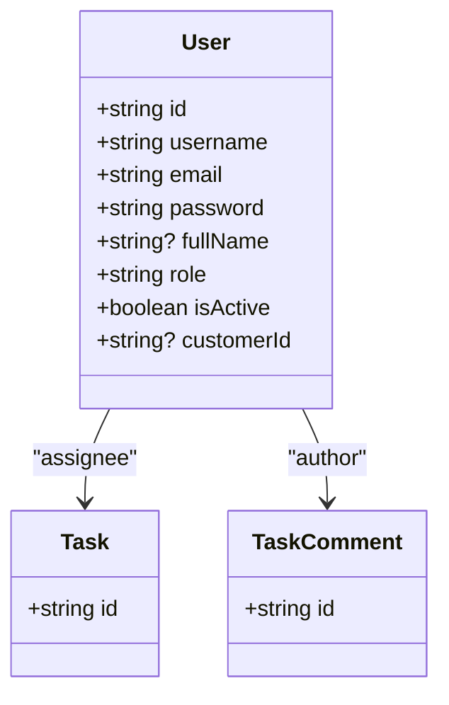
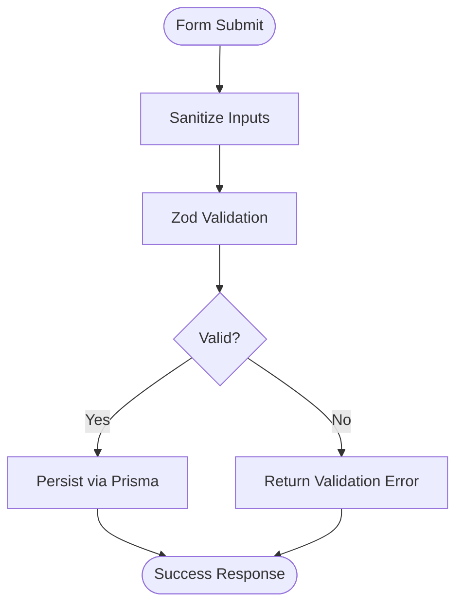
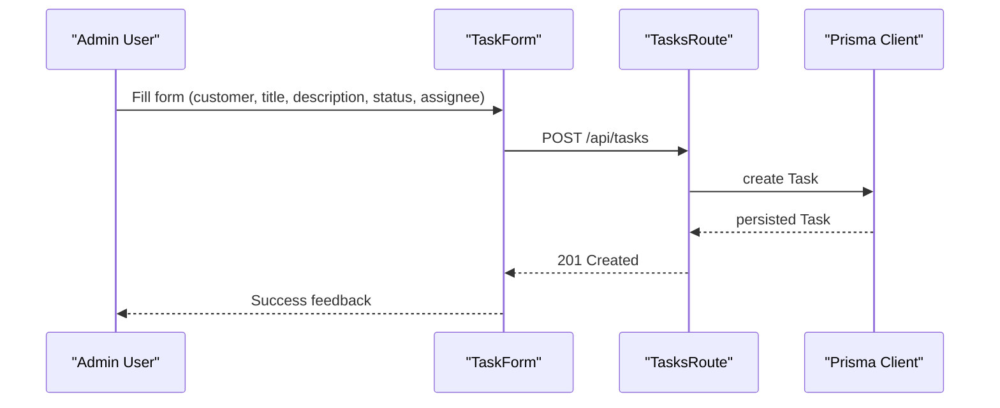
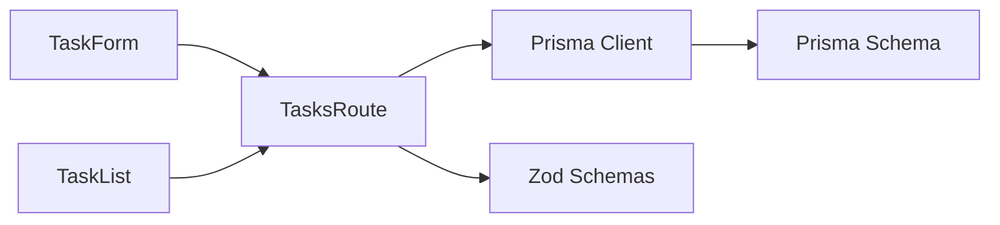

# Operational Entities

<cite>
**Referenced Files in This Document**
- [schema.prisma](file://prisma/schema.prisma)
- [prisma.ts](file://src/lib/prisma.ts)
- [route.ts](file://src/app/api/tasks/route.ts)
- [validations.ts](file://src/lib/validations.ts)
- [task-form.tsx](file://src/components/task-form.tsx)
- [task-list.tsx](file://src/components/task-list.tsx)
- [page.tsx](file://src/app/admin/tasks/page.tsx)
- [auth.ts](file://src/lib/auth.ts)
</cite>

## Table of Contents
1. [Introduction](#introduction)
2. [Project Structure](#project-structure)
3. [Core Components](#core-components)
4. [Architecture Overview](#architecture-overview)
5. [Detailed Component Analysis](#detailed-component-analysis)
6. [Dependency Analysis](#dependency-analysis)
7. [Performance Considerations](#performance-considerations)
8. [Troubleshooting Guide](#troubleshooting-guide)
9. [Conclusion](#conclusion)
10. [Appendices](#appendices)

## Introduction
This document describes the operational entities that power customer service and collaboration workflows: Task, TaskComment, and User. It explains how Tasks connect to Customers and Users, how TaskComments capture collaboration history, and how the system validates inputs and orchestrates workflows. It also outlines permission considerations and operational patterns for task assignment, progress tracking, team collaboration, and customer service management.

## Project Structure
The operational models are defined in the Prisma schema and surfaced via Next.js API routes and React components:
- Data model: Task, TaskComment, User, and Customer are defined in the Prisma schema.
- API layer: Next.js route handlers under src/app/api/tasks manage CRUD operations for tasks.
- Frontend: TaskForm and TaskList components provide creation and listing experiences.
- Validation: Zod schemas define field-level validation rules for task creation and updates.
- Persistence: Prisma client is initialized globally and used by API handlers.

**Diagram sources**
- [task-form.tsx:1-250](file://src/components/task-form.tsx#L1-L250)
- [task-list.tsx:1-294](file://src/components/task-list.tsx#L1-L294)
- [page.tsx:1-32](file://src/app/admin/tasks/page.tsx#L1-L32)
- [route.ts:1-64](file://src/app/api/tasks/route.ts#L1-L64)
- [prisma.ts:1-9](file://src/lib/prisma.ts#L1-L9)
- [schema.prisma:264-291](file://prisma/schema.prisma#L264-L291)

**Section sources**
- [schema.prisma:264-291](file://prisma/schema.prisma#L264-L291)
- [route.ts:1-64](file://src/app/api/tasks/route.ts#L1-L64)
- [task-form.tsx:1-250](file://src/components/task-form.tsx#L1-L250)
- [task-list.tsx:1-294](file://src/components/task-list.tsx#L1-L294)
- [page.tsx:1-32](file://src/app/admin/tasks/page.tsx#L1-L32)
- [prisma.ts:1-9](file://src/lib/prisma.ts#L1-L9)

## Core Components
This section documents the three operational entities and their relationships.

- Task
  - Purpose: Tracks customer service requests or work items.
  - Key fields: title, description, status (OPEN, PENDING, DONE), assigneeId (optional), customerId (required).
  - Relationships: belongs to Customer; optionally assigned to User; contains TaskComment entries; may attach files.
  - Status lifecycle: OPEN → PENDING → DONE (and back to OPEN if reopened).

- TaskComment
  - Purpose: Captures collaboration history for a task.
  - Key fields: content, timestamps; links to Task and User.
  - Audit trail: created timestamps per comment; ties contributions to specific users.

- User
  - Purpose: Represents internal collaborators who can be assigned to tasks and post comments.
  - Key fields: username, email, password, fullName, role, isActive, optional customerId.
  - Relationships: can be assigned to tasks; can author comments; optionally linked to a Customer.

**Diagram sources**
- [schema.prisma:95-134](file://prisma/schema.prisma#L95-L134)
- [schema.prisma:264-279](file://prisma/schema.prisma#L264-L279)
- [schema.prisma:281-291](file://prisma/schema.prisma#L281-L291)
- [schema.prisma:725-743](file://prisma/schema.prisma#L725-L743)

**Section sources**
- [schema.prisma:95-134](file://prisma/schema.prisma#L95-L134)
- [schema.prisma:264-279](file://prisma/schema.prisma#L264-L279)
- [schema.prisma:281-291](file://prisma/schema.prisma#L281-L291)
- [schema.prisma:725-743](file://prisma/schema.prisma#L725-L743)

## Architecture Overview
The operational workflow spans frontend forms, API routes, validation, and persistence:

- Creation flow: TaskForm posts to TasksRoute, which validates via Zod, sanitizes inputs, persists via Prisma, and returns the created Task.
- Listing flow: TaskList fetches paginated tasks from TasksRoute, filters by search and status, and renders summaries.
- Relationships: Tasks are always associated with a Customer; assignment to a User is optional; comments are attached to tasks and attributed to users.

**Diagram sources**
- [task-form.tsx:65-85](file://src/components/task-form.tsx#L65-L85)
- [route.ts:45-64](file://src/app/api/tasks/route.ts#L45-L64)
- [validations.ts:158-165](file://src/lib/validations.ts#L158-L165)
- [prisma.ts:1-9](file://src/lib/prisma.ts#L1-L9)

**Section sources**
- [task-form.tsx:1-250](file://src/components/task-form.tsx#L1-L250)
- [route.ts:1-64](file://src/app/api/tasks/route.ts#L1-L64)
- [validations.ts:158-165](file://src/lib/validations.ts#L158-L165)
- [prisma.ts:1-9](file://src/lib/prisma.ts#L1-L9)

## Detailed Component Analysis

### Task Entity
- Fields and constraints
  - title: required, length limits enforced by validation schema.
  - description: required, length limits enforced by validation schema.
  - status: enum with OPEN, PENDING, DONE; defaults to OPEN.
  - assigneeId: optional; if present, must reference a User.
  - customerId: required; must reference a Customer.
- Relationships
  - belongs to Customer (required).
  - optional assignee relationship to User.
  - contains TaskComment entries.
  - may include files.
- Status management
  - OPEN indicates newly created or reopened tasks.
  - PENDING indicates active work.
  - DONE indicates completion; tasks may revert to OPEN if reopened.

**Diagram sources**
- [schema.prisma:264-279](file://prisma/schema.prisma#L264-L279)
- [schema.prisma:95-134](file://prisma/schema.prisma#L95-L134)
- [schema.prisma:725-743](file://prisma/schema.prisma#L725-L743)
- [schema.prisma:281-291](file://prisma/schema.prisma#L281-L291)

**Section sources**
- [schema.prisma:258-279](file://prisma/schema.prisma#L258-L279)
- [validations.ts:158-165](file://src/lib/validations.ts#L158-L165)

### TaskComment Entity
- Fields and constraints
  - content: required, length limits enforced by validation schema.
  - timestamps: createdAt is automatically managed.
  - taskId: required; must reference a Task.
  - userId: required; must reference a User.
- Audit trail
  - Each comment records who authored it and when it was created.
- Integration
  - Comments are fetched and displayed alongside tasks; authors are shown with initials/avatar placeholders.

**Diagram sources**
- [schema.prisma:281-291](file://prisma/schema.prisma#L281-L291)
- [schema.prisma:264-279](file://prisma/schema.prisma#L264-L279)
- [schema.prisma:725-743](file://prisma/schema.prisma#L725-L743)

**Section sources**
- [schema.prisma:281-291](file://prisma/schema.prisma#L281-L291)
- [task-list.tsx:248-268](file://src/components/task-list.tsx#L248-L268)

### User Entity
- Fields and constraints
  - username: unique, required, length limits.
  - email: unique, required, email format.
  - password: required, minimum length.
  - fullName: optional, length limits.
  - role: string with default USER.
  - isActive: boolean flag.
  - customerId: optional; links a user to a Customer.
- Relationships
  - can be assigned to tasks (assignee).
  - can author comments.
  - optional association to Customer.

**Diagram sources**
- [schema.prisma:725-743](file://prisma/schema.prisma#L725-L743)
- [schema.prisma:264-279](file://prisma/schema.prisma#L264-L279)
- [schema.prisma:281-291](file://prisma/schema.prisma#L281-L291)

**Section sources**
- [schema.prisma:725-743](file://prisma/schema.prisma#L725-L743)
- [validations.ts:77-85](file://src/lib/validations.ts#L77-L85)

### Field Validation Rules
Validation schemas enforce data quality and consistency:
- Task creation requires:
  - customerId: non-empty.
  - title: 2–200 characters.
  - description: 1–4000 characters.
  - status: one of OPEN, PENDING, DONE; defaults to OPEN if omitted.
  - assigneeId: optional, must reference a valid User if provided.
- Additional sanitization occurs in the API route to remove unsafe characters from title and description.

**Diagram sources**
- [route.ts:45-64](file://src/app/api/tasks/route.ts#L45-L64)
- [validations.ts:158-165](file://src/lib/validations.ts#L158-L165)

**Section sources**
- [validations.ts:158-165](file://src/lib/validations.ts#L158-L165)
- [route.ts:45-64](file://src/app/api/tasks/route.ts#L45-L64)

### Permission Systems
- Authentication for administrative access:
  - Admin credentials are validated in-memory; session state is stored in browser storage.
  - This is suitable for development/demo environments; in production, integrate secure authentication (e.g., NextAuth).
- Access control patterns:
  - Assignees and comment authors are determined by the current User context; ensure backend checks are implemented to restrict updates/deletes to authorized users.
  - Consider adding role-based policies (e.g., ADMIN vs. SUPPORT) to limit who can create/edit tasks and comments.

**Section sources**
- [auth.ts:1-35](file://src/lib/auth.ts#L1-L35)

### Operational Workflow Patterns
Common workflows supported by the operational entities:

- Task assignment
  - Create a Task with customerId and optional assigneeId; assigneeId must reference an existing User.
  - Display assignee initials/avatar in lists.

- Progress tracking
  - Update task status among OPEN, PENDING, DONE; maintain audit trail via comments.

- Team collaboration
  - Users post TaskComments to share updates, decisions, and notes; comments are timestamped and attributed to authors.

- Customer service management
  - Tasks are always linked to a Customer; this ensures all work items are traceable to customer records.

**Diagram sources**
- [task-form.tsx:65-85](file://src/components/task-form.tsx#L65-L85)
- [route.ts:45-64](file://src/app/api/tasks/route.ts#L45-L64)
- [prisma.ts:1-9](file://src/lib/prisma.ts#L1-L9)

**Section sources**
- [task-form.tsx:1-250](file://src/components/task-form.tsx#L1-L250)
- [route.ts:1-64](file://src/app/api/tasks/route.ts#L1-L64)

## Dependency Analysis
- Internal dependencies
  - TasksRoute depends on Prisma client initialization and validation schemas.
  - TaskForm and TaskList depend on API endpoints for data fetching and submission.
- External dependencies
  - Prisma client connects to PostgreSQL via DATABASE_URL.
  - Zod enforces runtime validation for request payloads.

**Diagram sources**
- [task-form.tsx:1-250](file://src/components/task-form.tsx#L1-L250)
- [task-list.tsx:1-294](file://src/components/task-list.tsx#L1-L294)
- [route.ts:1-64](file://src/app/api/tasks/route.ts#L1-L64)
- [prisma.ts:1-9](file://src/lib/prisma.ts#L1-L9)
- [validations.ts:158-165](file://src/lib/validations.ts#L158-L165)

**Section sources**
- [route.ts:1-64](file://src/app/api/tasks/route.ts#L1-L64)
- [prisma.ts:1-9](file://src/lib/prisma.ts#L1-L9)
- [validations.ts:158-165](file://src/lib/validations.ts#L158-L165)

## Performance Considerations
- Pagination and filtering
  - API supports page and limit parameters; enforce a maximum limit to prevent heavy queries.
- Indexing
  - Ensure database indexes exist on frequently filtered fields (e.g., customerId, status, createdAt).
- Client-side caching
  - Cache customer and user lists in TaskForm to reduce repeated network requests.
- Validation overhead
  - Keep Zod schemas minimal and reuse where possible to avoid redundant checks.

## Troubleshooting Guide
- Validation errors
  - If creation fails, check the validation schema constraints for title, description, and status.
- Authentication issues
  - Admin session relies on in-memory credentials; ensure correct username/password and that browser storage permits sessionStorage.
- Data inconsistencies
  - Verify that assigneeId references an existing User and that customerId references an existing Customer.

**Section sources**
- [validations.ts:158-165](file://src/lib/validations.ts#L158-L165)
- [auth.ts:1-35](file://src/lib/auth.ts#L1-L35)

## Conclusion
The operational entities Task, TaskComment, and User form a cohesive collaboration and customer service backbone. Tasks connect to Customers and Users, while TaskComments provide an audit trail of team interactions. Validation schemas and API routes ensure data integrity, and the frontend components deliver a responsive user experience. For production, strengthen authentication, implement role-based access control, and add backend authorization checks to protect sensitive operations.

## Appendices
- Example fields summary
  - Task: title, description, status, assigneeId, customerId.
  - TaskComment: content, taskId, userId.
  - User: username, email, password, fullName, role, isActive, customerId.