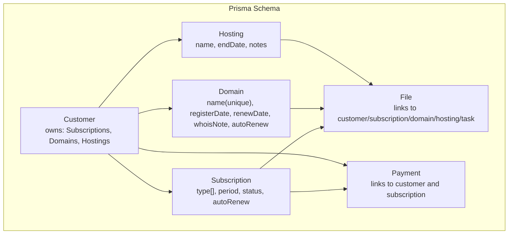
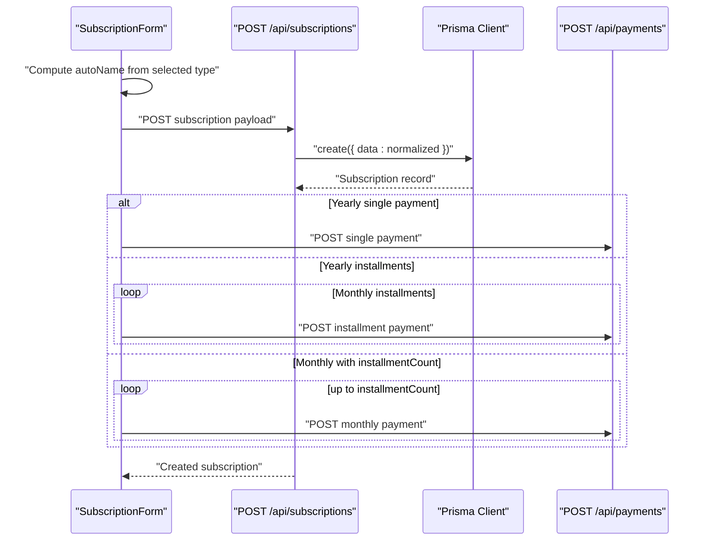
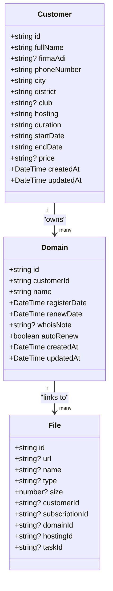
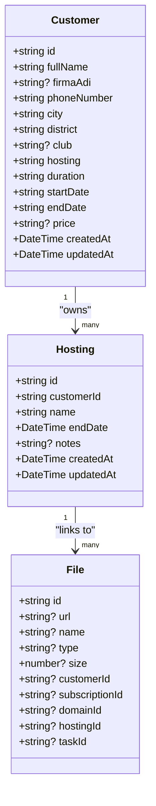
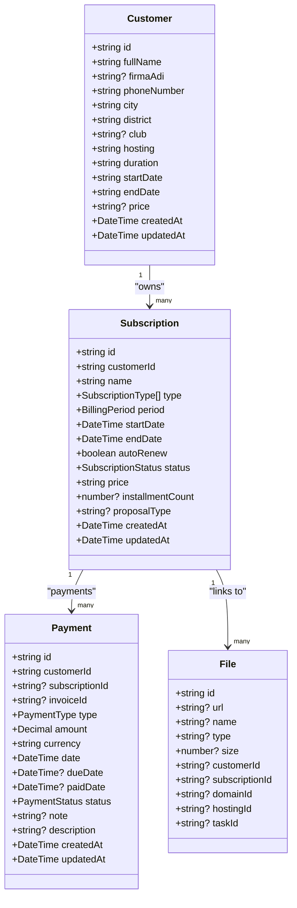
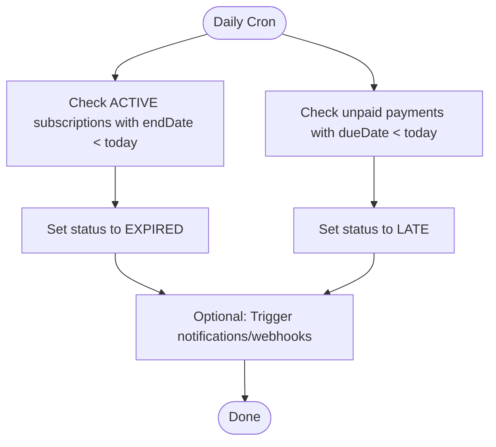
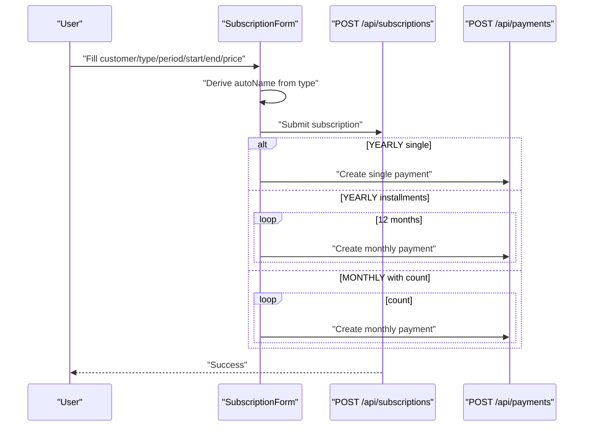
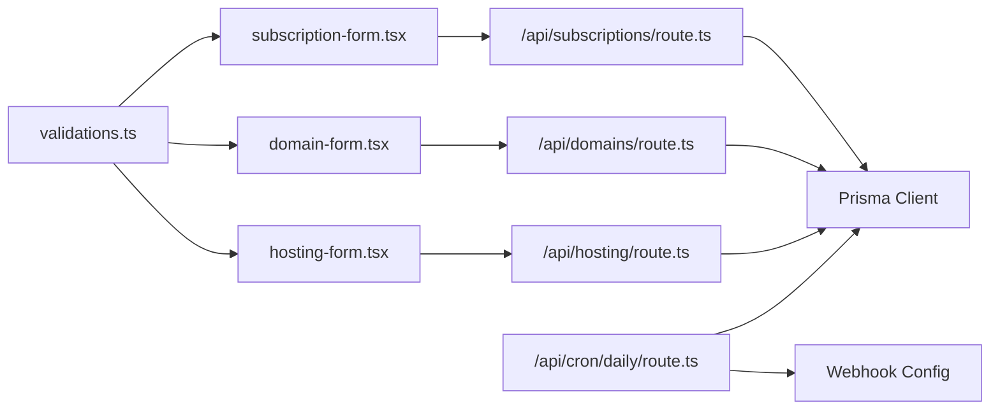

# Service Entities

<cite>
**Referenced Files in This Document**
- [schema.prisma](file://prisma/schema.prisma)
- [route.ts](file://src/app/api/subscriptions/route.ts)
- [route.ts](file://src/app/api/domains/route.ts)
- [route.ts](file://src/app/api/hosting/route.ts)
- [subscription-form.tsx](file://src/components/subscription-form.tsx)
- [domain-form.tsx](file://src/components/domain-form.tsx)
- [hosting-form.tsx](file://src/components/hosting-form.tsx)
- [validations.ts](file://src/lib/validations.ts)
- [route.ts](file://src/app/api/cron/daily/route.ts)
- [subscription-settings-client.ts](file://src/lib/subscription-settings-client.ts)
</cite>

## Table of Contents
1. [Introduction](#introduction)
2. [Project Structure](#project-structure)
3. [Core Components](#core-components)
4. [Architecture Overview](#architecture-overview)
5. [Detailed Component Analysis](#detailed-component-analysis)
6. [Dependency Analysis](#dependency-analysis)
7. [Performance Considerations](#performance-considerations)
8. [Troubleshooting Guide](#troubleshooting-guide)
9. [Conclusion](#conclusion)
10. [Appendices](#appendices)

## Introduction
This document provides a comprehensive guide to the three core service-related entities: Domain, Hosting, and Subscription. It explains their data models, relationships to customers and files, business rules around expiration and renewal, and operational workflows for enrollment, renewal, and reporting. It also documents the backend APIs and frontend forms that manage these services, and outlines cascading behavior and referential integrity constraints.

## Project Structure
The service entities are defined in the Prisma schema and surfaced via Next.js API routes and React components. The schema defines enums for types and statuses, and relations to the Customer entity. Forms and API handlers enforce validation and create/update records while linking to files and payments.

**Diagram sources**
- [schema.prisma:95-134](file://prisma/schema.prisma#L95-L134)
- [schema.prisma:206-226](file://prisma/schema.prisma#L206-L226)
- [schema.prisma:228-242](file://prisma/schema.prisma#L228-L242)
- [schema.prisma:244-256](file://prisma/schema.prisma#L244-L256)
- [schema.prisma:388-407](file://prisma/schema.prisma#L388-L407)
- [schema.prisma:305-343](file://prisma/schema.prisma#L305-L343)

**Section sources**
- [schema.prisma:95-134](file://prisma/schema.prisma#L95-L134)
- [schema.prisma:206-226](file://prisma/schema.prisma#L206-L226)
- [schema.prisma:228-242](file://prisma/schema.prisma#L228-L242)
- [schema.prisma:244-256](file://prisma/schema.prisma#L244-L256)
- [schema.prisma:388-407](file://prisma/schema.prisma#L388-L407)
- [schema.prisma:305-343](file://prisma/schema.prisma#L305-L343)

## Core Components
- Domain: Tracks registered domains with unique names, registration/renewal dates, WHOIS notes, and auto-renewal flag. Cascades deletion with customer.
- Hosting: Manages hosting services with service name, end date, optional notes, and customer linkage. Cascades deletion with customer.
- Subscription: Multi-service container supporting multiple types (SOFTWARE_RENTAL, CUSTOM_PROJECT, MAINTENANCE, NEXT_GEN_COACHING, AIDAT_TAKIP, FOOTBALL_CMS, DOMAIN, HOSTING), billing periods (MONTHLY, YEARLY), status (ACTIVE, EXPIRED, CANCELED), auto-renewal, and links to payments and files.

Key constraints and behaviors:
- Unique domain names enforced at database level.
- Cascade delete on customer affects related Domains, Hostings, Subscriptions, Tasks, Payments, and Notifications.
- File relations support soft-deletion semantics (foreign keys set to NULL) for customer, subscription, domain, hosting, and task.
- Daily cron job updates payment statuses to LATE and subscription statuses to EXPIRED based on current date.

**Section sources**
- [schema.prisma:228-242](file://prisma/schema.prisma#L228-L242)
- [schema.prisma:244-256](file://prisma/schema.prisma#L244-L256)
- [schema.prisma:206-226](file://prisma/schema.prisma#L206-L226)
- [schema.prisma:388-407](file://prisma/schema.prisma#L388-L407)
- [schema.prisma:305-343](file://prisma/schema.prisma#L305-L343)
- [route.ts:101-135](file://src/app/api/cron/daily/route.ts#L101-L135)

## Architecture Overview
The system uses a layered architecture:
- Prisma schema defines entities and relationships.
- API routes validate inputs, transform dates, and persist data.
- Frontend forms collect user input, compute derived values (like auto-generated names), and trigger payment creation for yearly plans.
- Daily cron job enforces business rules for expiration and late payments.

**Diagram sources**
- [subscription-form.tsx:104-213](file://src/components/subscription-form.tsx#L104-L213)
- [route.ts:46-85](file://src/app/api/subscriptions/route.ts#L46-L85)
- [route.ts:136-204](file://src/components/subscription-form.tsx#L136-L204)

**Section sources**
- [subscription-form.tsx:104-213](file://src/components/subscription-form.tsx#L104-L213)
- [route.ts:46-85](file://src/app/api/subscriptions/route.ts#L46-L85)
- [route.ts:136-204](file://src/components/subscription-form.tsx#L136-L204)

## Detailed Component Analysis

### Domain Entity
- Purpose: Track domain registrations with lifecycle management.
- Fields:
  - name: unique domain identifier
  - registerDate: registration date
  - renewDate: renewal date
  - whoisNote: optional administrative notes
  - autoRenew: automatic renewal flag
  - customerId: foreign key to Customer
- Relationships:
  - Belongs to Customer (onDelete: Cascade)
  - Can be linked to File records (SetNull on delete)
- Business rules:
  - Unique constraint on name ensures no duplicates.
  - Auto-renewal flag controls whether renewal reminders are emphasized.
- API and form:
  - API validates dates and persists records.
  - Form collects customer, domain name, registration/renewal dates, optional WHOIS notes, and auto-renewal preference.

**Diagram sources**
- [schema.prisma:95-134](file://prisma/schema.prisma#L95-L134)
- [schema.prisma:228-242](file://prisma/schema.prisma#L228-L242)
- [schema.prisma:388-407](file://prisma/schema.prisma#L388-L407)

**Section sources**
- [schema.prisma:228-242](file://prisma/schema.prisma#L228-L242)
- [route.ts:44-64](file://src/app/api/domains/route.ts#L44-L64)
- [domain-form.tsx:52-72](file://src/components/domain-form.tsx#L52-L72)

### Hosting Entity
- Purpose: Manage hosting services with end dates and optional notes.
- Fields:
  - name: hosting package/service name
  - endDate: termination/end date
  - notes: optional technical/administrative notes
  - customerId: foreign key to Customer
- Relationships:
  - Belongs to Customer (onDelete: Cascade)
  - Can be linked to File records (SetNull on delete)
- Business rules:
  - End date determines lifecycle; daily cron can mark related services as expired.
- API and form:
  - API validates dates and persists records.
  - Form collects customer, service name, end date, and optional notes.

**Diagram sources**
- [schema.prisma:95-134](file://prisma/schema.prisma#L95-L134)
- [schema.prisma:244-256](file://prisma/schema.prisma#L244-L256)
- [schema.prisma:388-407](file://prisma/schema.prisma#L388-L407)

**Section sources**
- [schema.prisma:244-256](file://prisma/schema.prisma#L244-L256)
- [route.ts:44-63](file://src/app/api/hosting/route.ts#L44-L63)
- [hosting-form.tsx:50-70](file://src/components/hosting-form.tsx#L50-L70)

### Subscription Entity
- Purpose: Multi-service subscription container with flexible billing and status management.
- Fields:
  - name: human-readable subscription name (auto-derived from type if omitted)
  - type: array of SubscriptionType (SOFTWARE_RENTAL, CUSTOM_PROJECT, MAINTENANCE, NEXT_GEN_COACHING, AIDAT_TAKIP, FOOTBALL_CMS, DOMAIN, HOSTING)
  - period: BillingPeriod (MONTHLY, YEARLY)
  - startDate, endDate: billing cycle boundaries
  - autoRenew: enable auto-renewal
  - status: SubscriptionStatus (ACTIVE, EXPIRED, CANCELED)
  - price: amount per period
  - installmentCount: optional for monthly installments
  - proposalType: optional association to proposal type
  - customerId: foreign key to Customer
- Relationships:
  - Belongs to Customer (onDelete: Cascade)
  - Links to Payment records (optional subscriptionId)
  - Links to File records (SetNull on delete)
- Business rules:
  - Daily cron sets payment status to LATE if dueDate precedes today and status is not PAID.
  - Daily cron sets subscription status to EXPIRED if status is ACTIVE and endDate precedes today.
  - Auto-name generation uses the first type’s label if name is not provided.
  - Yearly plans can be recorded as a single payment or split into 12 monthly installments.
  - Monthly plans can be recorded as a series of payments spanning a user-specified number of installments.
- API and form:
  - API validates and normalizes dates and enums, creates records, and supports pagination and filtering.
  - Form computes autoName, handles yearly single vs. installments, and triggers payment creation.

**Diagram sources**
- [schema.prisma:95-134](file://prisma/schema.prisma#L95-L134)
- [schema.prisma:206-226](file://prisma/schema.prisma#L206-L226)
- [schema.prisma:305-343](file://prisma/schema.prisma#L305-L343)
- [schema.prisma:388-407](file://prisma/schema.prisma#L388-L407)

**Section sources**
- [schema.prisma:206-226](file://prisma/schema.prisma#L206-L226)
- [schema.prisma:305-343](file://prisma/schema.prisma#L305-L343)
- [route.ts:7-44](file://src/app/api/subscriptions/route.ts#L7-L44)
- [route.ts:46-85](file://src/app/api/subscriptions/route.ts#L46-L85)
- [subscription-form.tsx:104-213](file://src/components/subscription-form.tsx#L104-L213)

### Expiration and Renewal Workflows
- Expiration:
  - Daily cron checks ACTIVE subscriptions whose endDate is before today and marks them EXPIRED.
  - Daily cron checks unpaid payments whose dueDate is before today and marks them LATE.
- Renewal:
  - Auto-renewal is represented by the autoRenew flag on Domain and Subscription. The system does not automatically extend dates; operators should update endDate or trigger renewal workflows externally.
- Status transitions:
  - ACTIVE → EXPIRED (when endDate < today)
  - DUE → LATE (when dueDate < today and status != PAID)
  - Manual transitions supported via API updates (e.g., status to CANCELED).

**Diagram sources**
- [route.ts:101-135](file://src/app/api/cron/daily/route.ts#L101-L135)

**Section sources**
- [route.ts:101-135](file://src/app/api/cron/daily/route.ts#L101-L135)

### Practical Workflows

#### Service Enrollment (Subscription)
- Select customer and service type(s); choose billing period (MONTHLY or YEARLY).
- For YEARLY:
  - Choose single payment or 12 installments; system posts payments accordingly.
- For MONTHLY:
  - Optionally specify installmentCount; system posts that many monthly payments.
- Auto-name derivation: If name is blank, system derives it from the first selected type.

**Diagram sources**
- [subscription-form.tsx:104-213](file://src/components/subscription-form.tsx#L104-L213)
- [route.ts:46-85](file://src/app/api/subscriptions/route.ts#L46-L85)
- [route.ts:136-204](file://src/components/subscription-form.tsx#L136-L204)

**Section sources**
- [subscription-form.tsx:104-213](file://src/components/subscription-form.tsx#L104-L213)
- [route.ts:46-85](file://src/app/api/subscriptions/route.ts#L46-L85)
- [route.ts:136-204](file://src/components/subscription-form.tsx#L136-L204)

#### Renewal Management
- For Domains and Hostings, set autoRenew to true to emphasize renewal reminders.
- For Subscriptions, set autoRenew to true; operators should manually extend endDate or implement automated renewal processes outside the scope of the current schema.

**Section sources**
- [schema.prisma:228-242](file://prisma/schema.prisma#L228-L242)
- [schema.prisma:244-256](file://prisma/schema.prisma#L244-L256)
- [schema.prisma:206-226](file://prisma/schema.prisma#L206-L226)

#### Service Portfolio Queries
- Retrieve subscriptions with pagination and filters:
  - Filter by customer ID and/or partial name match.
  - Paginate with page and limit parameters.
- Retrieve domains and hostings similarly with customer and name filters.

**Section sources**
- [route.ts:7-44](file://src/app/api/subscriptions/route.ts#L7-L44)
- [route.ts:6-42](file://src/app/api/domains/route.ts#L6-L42)
- [route.ts:6-41](file://src/app/api/hosting/route.ts#L6-L41)

## Dependency Analysis
- Internal dependencies:
  - Forms depend on validation schemas for input normalization.
  - API routes depend on Prisma client and shared error handling utilities.
  - Daily cron depends on webhook configuration utilities to notify external systems.
- External dependencies:
  - PostgreSQL via Prisma.
  - Next.js runtime for API routes and React components.

**Diagram sources**
- [validations.ts:101-156](file://src/lib/validations.ts#L101-L156)
- [subscription-form.tsx:104-213](file://src/components/subscription-form.tsx#L104-L213)
- [domain-form.tsx:52-72](file://src/components/domain-form.tsx#L52-L72)
- [hosting-form.tsx:50-70](file://src/components/hosting-form.tsx#L50-L70)
- [route.ts:46-85](file://src/app/api/subscriptions/route.ts#L46-L85)
- [route.ts:44-64](file://src/app/api/domains/route.ts#L44-L64)
- [route.ts:44-63](file://src/app/api/hosting/route.ts#L44-L63)
- [route.ts:101-135](file://src/app/api/cron/daily/route.ts#L101-L135)

**Section sources**
- [validations.ts:101-156](file://src/lib/validations.ts#L101-L156)
- [subscription-form.tsx:104-213](file://src/components/subscription-form.tsx#L104-L213)
- [domain-form.tsx:52-72](file://src/components/domain-form.tsx#L52-L72)
- [hosting-form.tsx:50-70](file://src/components/hosting-form.tsx#L50-L70)
- [route.ts:46-85](file://src/app/api/subscriptions/route.ts#L46-L85)
- [route.ts:44-64](file://src/app/api/domains/route.ts#L44-L64)
- [route.ts:44-63](file://src/app/api/hosting/route.ts#L44-L63)
- [route.ts:101-135](file://src/app/api/cron/daily/route.ts#L101-L135)

## Performance Considerations
- Pagination: API routes support page and limit parameters with a maximum cap to prevent excessive loads.
- Indexing: Unique constraints on domain names and customer relations are efficient for lookups.
- Batch operations: Yearly installments are posted concurrently to reduce latency.
- Cron efficiency: Bulk updates for payment and subscription statuses minimize repeated scans.

[No sources needed since this section provides general guidance]

## Troubleshooting Guide
- Validation errors:
  - Ensure dates follow YYYY-MM-DD format and numeric fields contain only digits.
  - For subscriptions, provide at least one type and a positive price.
- API failures:
  - Verify customer ID exists and is a valid UUID-like string.
  - Check that domain name is unique.
- Expiration not updating:
  - Confirm cron endpoint runs daily and timezone alignment.
  - Review logs for webhook delivery attempts if notifications are expected.

**Section sources**
- [validations.ts:101-156](file://src/lib/validations.ts#L101-L156)
- [route.ts:101-135](file://src/app/api/cron/daily/route.ts#L101-L135)

## Conclusion
The Domain, Hosting, and Subscription entities form the backbone of service management. They integrate tightly with Customer, File, and Payment entities, enabling robust lifecycle tracking, automated status updates, and flexible billing arrangements. The provided APIs and forms streamline enrollment and renewal workflows, while the schema enforces referential integrity and cascading behavior.

[No sources needed since this section summarizes without analyzing specific files]

## Appendices

### Enumerations and Defaults
- SubscriptionType: SOFTWARE_RENTAL, CUSTOM_PROJECT, MAINTENANCE, NEXT_GEN_COACHING, AIDAT_TAKIP, FOOTBALL_CMS, DOMAIN, HOSTING
- BillingPeriod: MONTHLY, YEARLY
- SubscriptionStatus: ACTIVE, EXPIRED, CANCELED
- PaymentStatus: DUE, LATE, PAID
- PaymentType: CASH, TRANSFER, CREDIT_CARD

**Section sources**
- [schema.prisma:184-204](file://prisma/schema.prisma#L184-L204)
- [schema.prisma:293-303](file://prisma/schema.prisma#L293-L303)

### Default Subscription Types (Client-side)
- The client retrieves a curated list of subscription types for selection in forms.

**Section sources**
- [subscription-settings-client.ts:8-24](file://src/lib/subscription-settings-client.ts#L8-L24)