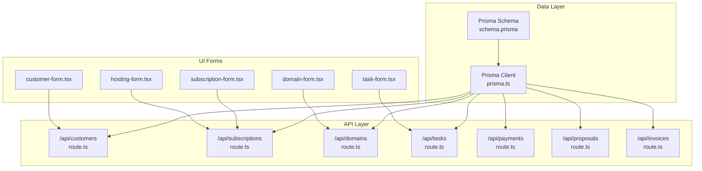
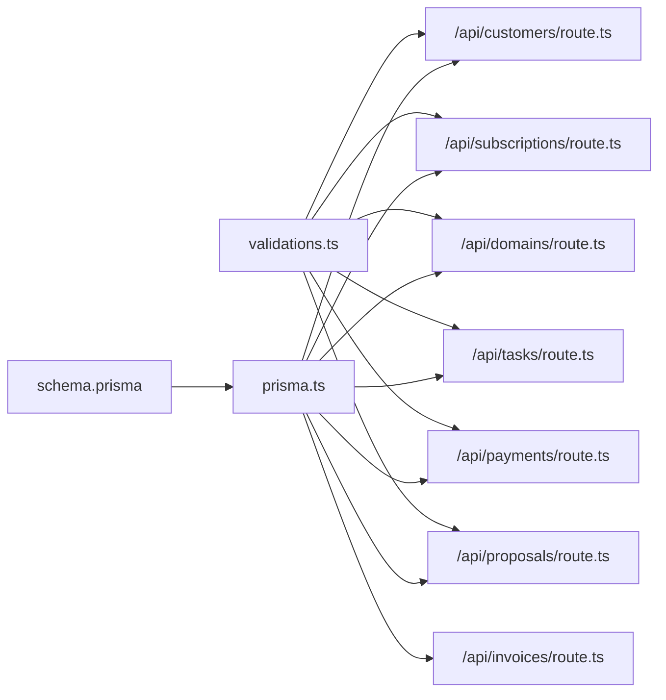

# Core Entities

<cite>
**Referenced Files in This Document**
- [schema.prisma](file://prisma/schema.prisma)
- [prisma.ts](file://src/lib/prisma.ts)
- [route.ts (customers)](file://src/app/api/customers/route.ts)
- [route.ts (subscriptions)](file://src/app/api/subscriptions/route.ts)
- [route.ts (domains)](file://src/app/api/domains/route.ts)
- [route.ts (tasks)](file://src/app/api/tasks/route.ts)
- [route.ts (payments)](file://src/app/api/payments/route.ts)
- [route.ts (proposals)](file://src/app/api/proposals/route.ts)
- [route.ts (invoices)](file://src/app/api/invoices/route.ts)
- [validations.ts](file://src/lib/validations.ts)
- [customer-form.tsx](file://src/components/customer-form.tsx)
- [subscription-form.tsx](file://src/components/subscription-form.tsx)
- [domain-form.tsx](file://src/components/domain-form.tsx)
- [hosting-form.tsx](file://src/components/hosting-form.tsx)
- [task-form.tsx](file://src/components/task-form.tsx)
</cite>

## Table of Contents
1. [Introduction](#introduction)
2. [Project Structure](#project-structure)
3. [Core Components](#core-components)
4. [Architecture Overview](#architecture-overview)
5. [Detailed Component Analysis](#detailed-component-analysis)
6. [Dependency Analysis](#dependency-analysis)
7. [Performance Considerations](#performance-considerations)
8. [Troubleshooting Guide](#troubleshooting-guide)
9. [Conclusion](#conclusion)

## Introduction
This document describes the core data model for the Customer WebMahsul application, focusing on the customer-centric entities and their relationships. It covers the fundamental business entities: Customer, Subscription, Domain, Hosting, Task, Payment, Proposal, and Invoice. For each entity, we define fields, data types, constraints, validation rules, lifecycle management, status enums, and business rule enforcement. We also illustrate typical relationships and common query patterns used in the backend APIs.

## Project Structure
The data model is defined in the Prisma schema and enforced by server-side API routes and frontend forms. The Prisma client is initialized globally and used by API handlers to interact with the database.



**Diagram sources**
- [schema.prisma](file://prisma/schema.prisma)
- [prisma.ts](file://src/lib/prisma.ts)
- [route.ts (customers)](file://src/app/api/customers/route.ts)
- [route.ts (subscriptions)](file://src/app/api/subscriptions/route.ts)
- [route.ts (domains)](file://src/app/api/domains/route.ts)
- [route.ts (tasks)](file://src/app/api/tasks/route.ts)
- [route.ts (payments)](file://src/app/api/payments/route.ts)
- [route.ts (proposals)](file://src/app/api/proposals/route.ts)
- [route.ts (invoices)](file://src/app/api/invoices/route.ts)
- [customer-form.tsx](file://src/components/customer-form.tsx)
- [subscription-form.tsx](file://src/components/subscription-form.tsx)
- [domain-form.tsx](file://src/components/domain-form.tsx)
- [hosting-form.tsx](file://src/components/hosting-form.tsx)
- [task-form.tsx](file://src/components/task-form.tsx)

**Section sources**
- [schema.prisma](file://prisma/schema.prisma)
- [prisma.ts](file://src/lib/prisma.ts)

## Core Components
This section documents the core entities and their attributes, constraints, and enums. All entities are customer-centric: each service record (Subscription, Domain, Hosting, Task, Payment, Proposal, Invoice) links to a Customer via a foreign key.

- Customer
  - Identity: id (UUID), fullName, phoneNumber, city, district, club, sportsSchoolOfficial, address
  - Optional: firmaAdi, price
  - Status: CustomerStatus (POTENTIAL, ACTIVE, INACTIVE, LOST)
  - Timestamps: createdAt, updatedAt
  - Relationships: subscriptions, domains, hostings, tasks, payments, proposals, invoices, notes, userAccounts, notifications, files, accountTransactions
  - Accounting: openingBalance (Decimal), openingBalanceDate (DateTime?)

- Subscription
  - Identity: id (UUID), name, type (array of SubscriptionType), period (BillingPeriod), status (SubscriptionStatus)
  - Dates: startDate, endDate
  - Auto-renew: autoRenew (Boolean)
  - Price: price (String), installmentCount (Int?)
  - Link: customerId -> Customer
  - Files: files
  - Payments: payments
  - Proposal association: proposalType (String?)

- Domain
  - Identity: id (UUID), name (unique), registerDate, renewDate, whoisNote, autoRenew
  - Link: customerId -> Customer
  - Files: files

- Hosting
  - Identity: id (UUID), name, endDate, notes
  - Link: customerId -> Customer
  - Files: files

- Task
  - Identity: id (UUID), title, description, status (TaskStatus)
  - Assignee: assigneeId -> User?
  - Link: customerId -> Customer
  - Comments: comments
  - Files: files

- Payment
  - Identity: id (UUID)
  - Customer link: customerId -> Customer
  - Optional invoice link: invoiceId -> Invoice?
  - Optional subscription link: subscriptionId -> Subscription?
  - Type: PaymentType (CASH, TRANSFER, CREDIT_CARD)
  - Amount: amount (Decimal), currency (String, default TRY)
  - Date fields: date (DateTime), dueDate (DateTime?), paidDate (DateTime?)
  - Status: PaymentStatus (DUE, LATE, PAID)
  - Notes: note, description
  - Account transactions: accountTransactions

- Proposal
  - Identity: id (UUID), number (unique), title, type (ProposalType), description
  - Amount: amount (Decimal), currency (String, default TRY)
  - Validity: validUntil (DateTime), status (ProposalStatus)
  - Sender: sentAt (DateTime?)
  - Approval: approvedBy (String?), approvedAt (DateTime?)
  - Rejection: rejectedAt (DateTime?), rejectReason (String?)
  - Items: ProposalItem[]
  - Invoices: Invoice[]
  - Account transactions: AccountTransaction[]
  - Stock movements: StockMovement[]
  - Notes: notes

- Invoice
  - Identity: id (UUID), number (unique), type (InvoiceType), status (InvoiceStatus)
  - Customer link: customerId -> Customer
  - Optional proposal link: proposalId -> Proposal?
  - Amounts: subtotal, taxRate (Decimal, default 20), taxAmount, total
  - Dates: issueDate, dueDate
  - Items: InvoiceItem[]
  - Payments: Payment[]
  - Stock movements: StockMovement[]
  - Account transactions: AccountTransaction[]
  - Notes: notes

- Enums
  - CustomerStatus: POTENTIAL, ACTIVE, INACTIVE, LOST
  - SubscriptionType: SOFTWARE_RENTAL, CUSTOM_PROJECT, MAINTENANCE, NEXT_GEN_COACHING, AIDAT_TAKIP, FOOTBALL_CMS, DOMAIN, HOSTING
  - BillingPeriod: MONTHLY, YEARLY
  - SubscriptionStatus: ACTIVE, EXPIRED, CANCELED
  - TaskStatus: OPEN, PENDING, DONE
  - PaymentStatus: DUE, LATE, PAID
  - PaymentType: CASH, TRANSFER, CREDIT_CARD
  - ProposalStatus: DRAFT, SENT, PENDING, APPROVED, REJECTED, EXPIRED, CONVERTED
  - ProposalType: SUBSCRIPTION, PROJECT, MAINTENANCE, RENEWAL, NETWORK, HARDWARE, SOFTWARE, SERVICE, CONSULTING, OTHER
  - InvoiceType: SALE, RETURN
  - InvoiceStatus: DRAFT, ISSUED, PARTIAL, PAID, CANCELLED

Constraints and validation rules are enforced by Zod schemas in the validation module and by Prisma schema definitions. Business rules include:
- Customer status lifecycle and defaults
- Subscription billing periods, auto-renewal, and status transitions
- Domain and Hosting renewal dates and optional autoRenew flag
- Payment dueDate, paidDate, and status transitions
- Proposal number generation and status transitions
- Invoice number generation, tax calculation, and conversion from Proposal

**Section sources**
- [schema.prisma](file://prisma/schema.prisma)
- [validations.ts](file://src/lib/validations.ts)

## Architecture Overview
The application follows a customer-centric architecture. Every service entity (Subscription, Domain, Hosting, Task, Payment, Proposal, Invoice) maintains a mandatory customerId relationship to Customer. This ensures all services are anchored to a customer record, enabling unified reporting, invoicing, and accounting.

```mermaid
erDiagram
CUSTOMER {
string id PK
string fullName
string? firmaAdi
string phoneNumber
string city
string district
string club
string sportsSchoolOfficial
string hosting
string duration
string startDate
string endDate
string offer
string address
enum status
decimal? openingBalance
datetime? openingBalanceDate
datetime createdAt
datetime updatedAt
}
SUBSCRIPTION {
string id PK
string customerId FK
string name
enum[] type
enum period
datetime startDate
datetime endDate
boolean autoRenew
enum status
string price
int? installmentCount
string? proposalType
datetime createdAt
datetime updatedAt
}
DOMAIN {
string id PK
string customerId FK
string name UNQ
datetime registerDate
datetime renewDate
string? whoisNote
boolean autoRenew
datetime createdAt
datetime updatedAt
}
HOSTING {
string id PK
string customerId FK
string name
datetime endDate
string? notes
datetime createdAt
datetime updatedAt
}
TASK {
string id PK
string customerId FK
string title
string description
enum status
string? assigneeId
datetime createdAt
datetime updatedAt
}
PAYMENT {
string id PK
string customerId FK
string? invoiceId
string? subscriptionId
enum type
decimal amount
string currency
datetime date
datetime? dueDate
datetime? paidDate
enum status
string? note
string? description
datetime createdAt
datetime updatedAt
}
PROPOSAL {
string id PK
string customerId FK
string number UNQ
string title
enum type
string? description
decimal amount
string currency
datetime validUntil
enum status
datetime? sentAt
string? approvedBy
datetime? approvedAt
datetime? rejectedAt
string? rejectReason
string? notes
datetime createdAt
datetime updatedAt
}
INVOICE {
string id PK
string number UNQ
string customerId FK
string? proposalId
enum type
decimal subtotal
decimal taxRate
decimal taxAmount
decimal total
enum status
datetime issueDate
datetime dueDate
string? notes
datetime createdAt
datetime updatedAt
}
CUSTOMER ||--o{ SUBSCRIPTION : "has"
CUSTOMER ||--o{ DOMAIN : "has"
CUSTOMER ||--o{ HOSTING : "has"
CUSTOMER ||--o{ TASK : "has"
CUSTOMER ||--o{ PAYMENT : "has"
CUSTOMER ||--o{ PROPOSAL : "has"
CUSTOMER ||--o{ INVOICE : "has"
SUBSCRIPTION ||--o{ PAYMENT : "generates"
PROPOSAL ||--o{ INVOICE : "converts to"
INVOICE ||--o{ PAYMENT : "receives"
```

**Diagram sources**
- [schema.prisma](file://prisma/schema.prisma)

## Detailed Component Analysis

### Customer
- Purpose: Central customer record with contact info, status, and financial anchors (opening balance).
- Key constraints:
  - fullName, phoneNumber, city, district, club, sportsSchoolOfficial, address have length and format validations.
  - Optional firmaAdi and price.
  - Status defaults to POTENTIAL.
- Lifecycle:
  - Status progression aligned with sales funnel; defaults to POTENTIAL on creation.
- Typical queries:
  - List with pagination and filters (search by fullName, city, district, club).
  - Create with sanitized inputs and default values for certain fields.
- Example API usage:
  - GET /api/customers with pagination and filters.
  - POST /api/customers with validated payload.

**Section sources**
- [schema.prisma](file://prisma/schema.prisma)
- [validations.ts](file://src/lib/validations.ts)
- [route.ts (customers)](file://src/app/api/customers/route.ts)
- [customer-form.tsx](file://src/components/customer-form.tsx)

### Subscription
- Purpose: Tracks customer service plans with billing cycles, auto-renewal, and optional installments.
- Key constraints:
  - type is an array of SubscriptionType; at least one must be selected.
  - period is MONTHLY or YEARLY; startDate and endDate must be valid dates.
  - price must be positive integer-like string; optional installmentCount for monthly plans.
  - status defaults to ACTIVE.
- Lifecycle:
  - Status transitions: ACTIVE → EXPIRED or CANCELED.
  - Auto-renew toggles recurring billing.
- Typical queries:
  - List by customer and search by name.
  - Create with mapped default name based on first type.
  - Update with refined validation for proposalType.
- Example API usage:
  - GET /api/subscriptions with filters.
  - POST /api/subscriptions with type mapping and date normalization.
  - PATCH /api/subscriptions to update fields safely.

**Section sources**
- [schema.prisma](file://prisma/schema.prisma)
- [validations.ts](file://src/lib/validations.ts)
- [route.ts (subscriptions)](file://src/app/api/subscriptions/route.ts)
- [subscription-form.tsx](file://src/components/subscription-form.tsx)

### Domain
- Purpose: Manages customer-owned domain registrations and renewal reminders.
- Key constraints:
  - name is unique; registerDate and renewDate must be valid dates.
  - Optional whoisNote; autoRenew defaults to false.
- Lifecycle:
  - Renewal reminders and optional autoRenew flag.
- Typical queries:
  - List by customer and search by domain name.
- Example API usage:
  - GET /api/domains with filters.
  - POST /api/domains with date normalization.

**Section sources**
- [schema.prisma](file://prisma/schema.prisma)
- [validations.ts](file://src/lib/validations.ts)
- [route.ts (domains)](file://src/app/api/domains/route.ts)
- [domain-form.tsx](file://src/components/domain-form.tsx)

### Hosting
- Purpose: Tracks shared or VPS hosting accounts with end dates and notes.
- Key constraints:
  - name and endDate required; optional notes.
- Lifecycle:
  - End-date drives renewal reminders.
- Typical queries:
  - List by customer and search by name.
- Example API usage:
  - GET /api/hosting (note: endpoint path differs; see routing).
  - POST /api/hosting with date normalization.

**Section sources**
- [schema.prisma](file://prisma/schema.prisma)
- [validations.ts](file://src/lib/validations.ts)
- [hosting-form.tsx](file://src/components/hosting-form.tsx)

### Task
- Purpose: Internal or customer-related work items with assignees and statuses.
- Key constraints:
  - title and description lengths; status defaults to OPEN.
  - Optional assigneeId linking to User.
- Lifecycle:
  - Status transitions: OPEN → PENDING → DONE.
- Typical queries:
  - List by customer and search by title.
- Example API usage:
  - GET /api/tasks with filters.
  - POST /api/tasks with status normalization.

**Section sources**
- [schema.prisma](file://prisma/schema.prisma)
- [validations.ts](file://src/lib/validations.ts)
- [route.ts (tasks)](file://src/app/api/tasks/route.ts)
- [task-form.tsx](file://src/components/task-form.tsx)

### Payment
- Purpose: Records cash-flow events against subscriptions or invoices.
- Key constraints:
  - amount is positive integer-like string; dueDate and optional paidDate must be valid dates.
  - status defaults to DUE; type defaults to CASH.
- Lifecycle:
  - Status transitions: DUE → LATE → PAID.
  - Supports linking to Subscription and/or Invoice.
- Typical queries:
  - List by customer, subscription, status, currency, and dueDate range.
  - Create with date normalization and status mapping.
  - Update with optional fields and status transitions.
- Example API usage:
  - GET /api/payments with filters.
  - POST /api/payments with date normalization.
  - PUT /api/payments to update dueDate/paidDate/status.

**Section sources**
- [schema.prisma](file://prisma/schema.prisma)
- [validations.ts](file://src/lib/validations.ts)
- [route.ts (payments)](file://src/app/api/payments/route.ts)

### Proposal
- Purpose: Sales proposals with items, amounts, validity, and approval workflow.
- Key constraints:
  - title and description lengths; amount must be positive integer-like string.
  - validUntil must be a valid date; status defaults to DRAFT.
  - Items require productId or description with numeric quantities and prices.
- Lifecycle:
  - Status transitions: DRAFT → SENT/PENDING → APPROVED/REJECTED → EXPIRED/CONVERTED.
  - Number generation follows a standardized format.
- Typical queries:
  - List by status, type, customer, and search terms.
  - Create with number generation and item creation.
- Example API usage:
  - GET /api/proposals with filters.
  - POST /api/proposals with number generation and item mapping.

**Section sources**
- [schema.prisma](file://prisma/schema.prisma)
- [validations.ts](file://src/lib/validations.ts)
- [route.ts (proposals)](file://src/app/api/proposals/route.ts)

### Invoice
- Purpose: Financial documents issued to customers, optionally from Proposals.
- Key constraints:
  - type is SALE or RETURN; taxRate defaults to 20; amounts computed from items.
  - status defaults to DRAFT; number generation follows a standardized format.
  - Items require description and positive numeric quantity/unitPrice/totalPrice.
- Lifecycle:
  - Status transitions: DRAFT → ISSUED → PARTIAL → PAID or CANCELLED.
  - Converts Proposal to INVOICE and updates Proposal status to CONVERTED.
- Typical queries:
  - List by customer, status, and search terms.
  - Create with number generation, tax computation, and item creation.
- Example API usage:
  - GET /api/invoices with filters.
  - POST /api/invoices with transactional creation and Proposal conversion.

**Section sources**
- [schema.prisma](file://prisma/schema.prisma)
- [route.ts (invoices)](file://src/app/api/invoices/route.ts)

## Dependency Analysis
The backend APIs depend on the Prisma client and enforce validation via Zod schemas. Forms in the UI feed into these APIs, ensuring consistent data entry and constraints.



**Diagram sources**
- [validations.ts](file://src/lib/validations.ts)
- [schema.prisma](file://prisma/schema.prisma)
- [prisma.ts](file://src/lib/prisma.ts)
- [route.ts (customers)](file://src/app/api/customers/route.ts)
- [route.ts (subscriptions)](file://src/app/api/subscriptions/route.ts)
- [route.ts (domains)](file://src/app/api/domains/route.ts)
- [route.ts (tasks)](file://src/app/api/tasks/route.ts)
- [route.ts (payments)](file://src/app/api/payments/route.ts)
- [route.ts (proposals)](file://src/app/api/proposals/route.ts)
- [route.ts (invoices)](file://src/app/api/invoices/route.ts)

**Section sources**
- [validations.ts](file://src/lib/validations.ts)
- [schema.prisma](file://prisma/schema.prisma)
- [prisma.ts](file://src/lib/prisma.ts)
- [route.ts (customers)](file://src/app/api/customers/route.ts)
- [route.ts (subscriptions)](file://src/app/api/subscriptions/route.ts)
- [route.ts (domains)](file://src/app/api/domains/route.ts)
- [route.ts (tasks)](file://src/app/api/tasks/route.ts)
- [route.ts (payments)](file://src/app/api/payments/route.ts)
- [route.ts (proposals)](file://src/app/api/proposals/route.ts)
- [route.ts (invoices)](file://src/app/api/invoices/route.ts)

## Performance Considerations
- Pagination: All list endpoints support page and limit parameters with a maximum cap to prevent heavy loads.
- Filtering: Queries apply where conditions to reduce result sets; ensure appropriate indexes on frequently filtered fields (e.g., customerId, status, dates).
- Includes: Some endpoints include related counts or nested relations; avoid unnecessary includes in high-throughput scenarios.
- Transactions: Invoice creation uses Prisma transactions to maintain consistency for multi-entity writes.

[No sources needed since this section provides general guidance]

## Troubleshooting Guide
- Validation errors:
  - Zod schemas enforce strict field checks (lengths, formats, positivity). Errors surface as structured messages in API responses.
- Sanitization:
  - Input sanitization is applied to string fields before validation and persistence.
- Common issues:
  - Invalid date formats cause validation failures; ensure YYYY-MM-DD strings.
  - Empty or invalid amount strings fail validation; ensure numeric-only strings.
  - Unique constraints (e.g., domain name) trigger conflicts if duplicated.
  - Missing required fields (customerId, title, description, etc.) produce validation errors.

**Section sources**
- [validations.ts](file://src/lib/validations.ts)
- [route.ts (customers)](file://src/app/api/customers/route.ts)
- [route.ts (subscriptions)](file://src/app/api/subscriptions/route.ts)
- [route.ts (domains)](file://src/app/api/domains/route.ts)
- [route.ts (tasks)](file://src/app/api/tasks/route.ts)
- [route.ts (payments)](file://src/app/api/payments/route.ts)
- [route.ts (proposals)](file://src/app/api/proposals/route.ts)
- [route.ts (invoices)](file://src/app/api/invoices/route.ts)

## Conclusion
The Customer WebMahsul data model is designed around the Customer entity, ensuring that all services—Subscriptions, Domains, Hosting, Tasks, Payments, Proposals, and Invoices—are customer-linked. Constraints and enums provide strong typing and lifecycle control, while Zod validations and API routes enforce robust business rules. The documented relationships, constraints, and query patterns enable predictable development and reliable operations across the platform.