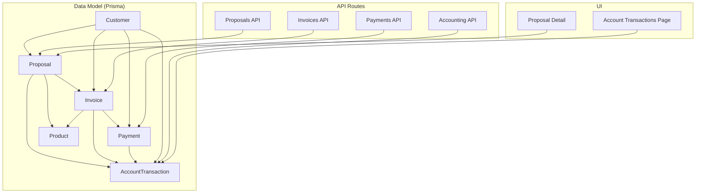
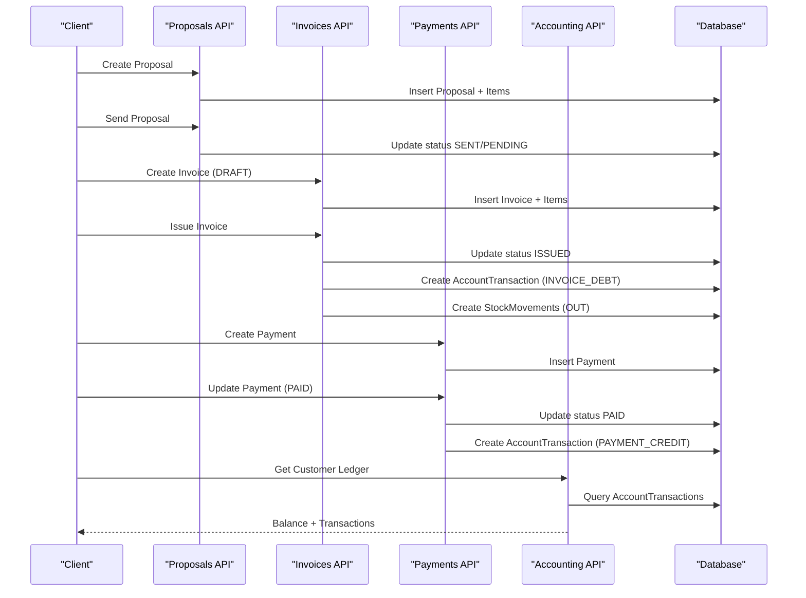
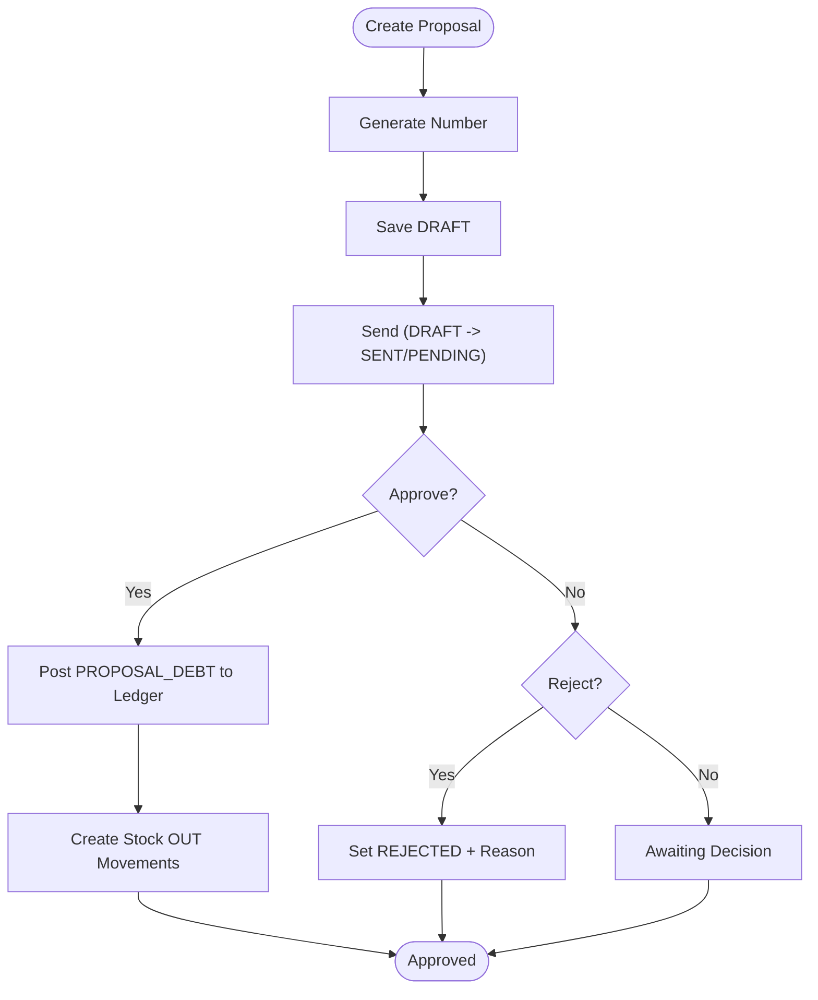
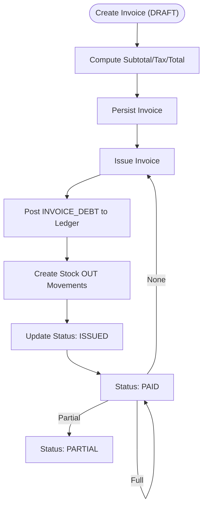
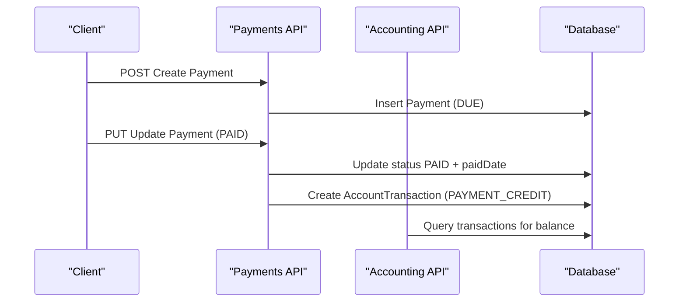
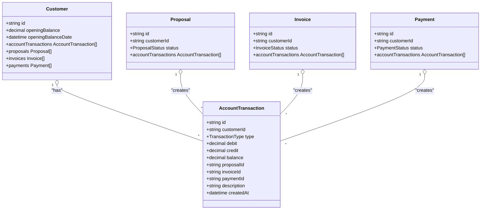
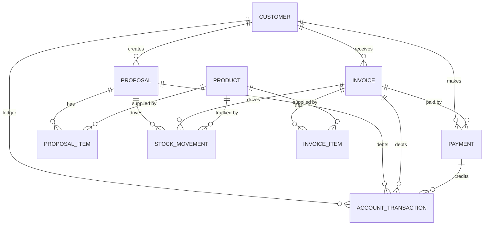

# Financial Entities

<cite>
**Referenced Files in This Document**
- [schema.prisma](file://prisma/schema.prisma)
- [route.ts](file://src/app/api/proposals/route.ts)
- [route.ts](file://src/app/api/proposals/[id]/send/route.ts)
- [route.ts](file://src/app/api/proposals/[id]/approve/route.ts)
- [route.ts](file://src/app/api/proposals/[id]/reject/route.ts)
- [route.ts](file://src/app/api/invoices/route.ts)
- [route.ts](file://src/app/api/invoices/[id]/issue/route.ts)
- [route.ts](file://src/app/api/payments/route.ts)
- [route.ts](file://src/app/api/accounting/customers/route.ts)
- [route.ts](file://src/app/api/accounting/customers/[id]/route.ts)
- [route.ts](file://src/app/api/accounting/customers/[id]/transactions/page.tsx)
- [proposal-detail.tsx](file://src/components/proposal-detail.tsx)
- [settings-client.ts](file://src/lib/settings-client.ts)
- [seed-proposal-types.mjs](file://scripts/seed-proposal-types.mjs)
- [migration.sql](file://prisma/migrations/20260215091826_init/migration.sql)
</cite>

## Table of Contents
1. [Introduction](#introduction)
2. [Project Structure](#project-structure)
3. [Core Components](#core-components)
4. [Architecture Overview](#architecture-overview)
5. [Detailed Component Analysis](#detailed-component-analysis)
6. [Dependency Analysis](#dependency-analysis)
7. [Performance Considerations](#performance-considerations)
8. [Troubleshooting Guide](#troubleshooting-guide)
9. [Conclusion](#conclusion)

## Introduction
This document describes the financial data model for Proposal, Invoice, Payment, and supporting models. It explains entity attributes, status management, categorization, workflows, and the accounting integration via AccountTransaction for debt/credit tracking and balance management. It also documents the numbering systems, tax calculations, and relationships among entities.

## Project Structure
The financial domain is defined in the Prisma schema and backed by API routes and UI components:
- Data model definitions and enums are in the Prisma schema.
- Business logic for Proposal lifecycle, Invoice creation and issuance, and Payment CRUD is implemented in API routes.
- Accounting endpoints expose customer balances and transaction history.
- UI components render statuses and proposal types.

**Diagram sources**
- [schema.prisma](file://prisma/schema.prisma)
- [route.ts](file://src/app/api/proposals/route.ts)
- [route.ts](file://src/app/api/invoices/route.ts)
- [route.ts](file://src/app/api/payments/route.ts)
- [route.ts](file://src/app/api/accounting/customers/[id]/route.ts)
- [proposal-detail.tsx](file://src/components/proposal-detail.tsx)
- [route.ts](file://src/app/api/accounting/customers/[id]/transactions/page.tsx)

**Section sources**
- [schema.prisma](file://prisma/schema.prisma)
- [route.ts](file://src/app/api/proposals/route.ts)
- [route.ts](file://src/app/api/invoices/route.ts)
- [route.ts](file://src/app/api/payments/route.ts)
- [route.ts](file://src/app/api/accounting/customers/[id]/route.ts)

## Core Components
This section outlines the primary financial entities and their key characteristics.

- Proposal
  - Purpose: Quote/work estimate with optional line items.
  - Numbering: Auto-generated with a prefix and zero-padded sequence per year.
  - Status lifecycle: DRAFT → SENT/PENDING → APPROVED or REJECTED or EXPIRED; can convert to INVOICE.
  - Type categorization: SUBSCRIPTION, PROJECT, MAINTENANCE, RENEWAL, NETWORK, HARDWARE, SOFTWARE, SERVICE, CONSULTING, OTHER.
  - Approval workflow: Send from DRAFT to SENT/PENDING; approve creates debt in AccountTransaction; reject updates rejection metadata.
  - Relationship: Can produce one or more Invoices; tracked via invoices collection.

- Invoice
  - Purpose: Taxable document issued to a Customer.
  - Numbering: Auto-generated with a prefix and zero-padded sequence per year.
  - Tax calculation: Subtotal, taxRate (default 20), taxAmount, total computed on creation.
  - Status lifecycle: DRAFT → ISSUED → PARTIAL/PAID/CANCELLED.
  - Relationship: Optional link to Proposal; contains line items; linked to Payments.

- Payment
  - Purpose: Receipt of money against an Invoice or Subscription.
  - Methods: CASH, TRANSFER, CREDIT_CARD.
  - Status lifecycle: DUE/LATE → PAID.
  - Currency: Multi-currency support via currency field.
  - Relationship: Links to Invoice and Subscription; records transaction in AccountTransaction.

- AccountTransaction
  - Purpose: Double-entry-like ledger for each Customer.
  - Types: OPENING_BALANCE, PROPOSAL_DEBT, INVOICE_DEBT, PAYMENT_CREDIT, MANUAL_ADJUSTMENT.
  - Fields: debit, credit, balance, optional links to Proposal/Invoice/Payment, description.
  - Maintains running balance per transaction.

- Supporting Models
  - ProposalItem and InvoiceItem: Line items with product linkage and pricing.
  - StockMovement: Tracks inventory outflows for items associated with Proposal/Invoice.
  - Product: Inventory item with costPrice, profitMargin, unitPrice, and stock tracking.

**Section sources**
- [schema.prisma](file://prisma/schema.prisma)
- [route.ts](file://src/app/api/proposals/route.ts)
- [route.ts](file://src/app/api/invoices/route.ts)
- [route.ts](file://src/app/api/payments/route.ts)
- [route.ts](file://src/app/api/invoices/[id]/issue/route.ts)
- [route.ts](file://src/app/api/proposals/[id]/approve/route.ts)
- [route.ts](file://src/app/api/proposals/[id]/reject/route.ts)
- [route.ts](file://src/app/api/accounting/customers/[id]/route.ts)

## Architecture Overview
The financial system integrates three core entities with an accounting ledger and inventory tracking:
- Proposal → Invoice conversion triggers debt posting and stock movement.
- Invoice issuance posts debt and reduces inventory.
- Payment receipts update invoice status and post credits to the ledger.

**Diagram sources**
- [route.ts](file://src/app/api/proposals/route.ts)
- [route.ts](file://src/app/api/proposals/[id]/send/route.ts)
- [route.ts](file://src/app/api/invoices/route.ts)
- [route.ts](file://src/app/api/invoices/[id]/issue/route.ts)
- [route.ts](file://src/app/api/payments/route.ts)
- [route.ts](file://src/app/api/accounting/customers/[id]/route.ts)

## Detailed Component Analysis

### Proposal Entity
- Attributes
  - Unique number (auto-generated per year).
  - Title, type, description, amount, currency, validUntil.
  - Status with lifecycle transitions.
  - Optional sentAt, approvedBy/approvedAt, rejectedAt/rejectReason, notes.
  - Line items via ProposalItem; invoices; accountTransactions; stockMovements.
- Numbering
  - Yearly sequence with a fixed prefix; generated during creation.
- Workflow
  - Creation → Send (DRAFT → SENT/PENDING) → Approve (creates debt) or Reject (updates rejection fields).
- Type Categorization
  - Enumerated types include SUBSCRIPTION, PROJECT, MAINTENANCE, RENEWAL, and others.
  - UI labels are mapped for display.

**Diagram sources**
- [route.ts](file://src/app/api/proposals/route.ts)
- [route.ts](file://src/app/api/proposals/[id]/send/route.ts)
- [route.ts](file://src/app/api/proposals/[id]/approve/route.ts)
- [route.ts](file://src/app/api/proposals/[id]/reject/route.ts)
- [schema.prisma](file://prisma/schema.prisma)

**Section sources**
- [schema.prisma](file://prisma/schema.prisma)
- [route.ts](file://src/app/api/proposals/route.ts)
- [route.ts](file://src/app/api/proposals/[id]/send/route.ts)
- [route.ts](file://src/app/api/proposals/[id]/approve/route.ts)
- [route.ts](file://src/app/api/proposals/[id]/reject/route.ts)
- [proposal-detail.tsx](file://src/components/proposal-detail.tsx)
- [settings-client.ts](file://src/lib/settings-client.ts)
- [seed-proposal-types.mjs](file://scripts/seed-proposal-types.mjs)

### Invoice Entity
- Attributes
  - Unique number (auto-generated per year).
  - Customer, optional Proposal link, type (SALE/RETURN), subtotal, taxRate, taxAmount, total.
  - Status lifecycle: DRAFT → ISSUED → PARTIAL → PAID → CANCELLED.
  - Issue date and due date.
  - Line items via InvoiceItem; payments; stockMovements; accountTransactions.
- Numbering
  - Yearly sequence with a fixed prefix; generated during creation.
- Tax Calculation
  - Computed from items subtotal and taxRate; total equals subtotal plus taxAmount.
- Workflow
  - Creation (DRAFT) → Issuance (ISSUED) posts debt to ledger and reduces inventory.

**Diagram sources**
- [route.ts](file://src/app/api/invoices/route.ts)
- [route.ts](file://src/app/api/invoices/[id]/issue/route.ts)
- [schema.prisma](file://prisma/schema.prisma)

**Section sources**
- [schema.prisma](file://prisma/schema.prisma)
- [route.ts](file://src/app/api/invoices/route.ts)
- [route.ts](file://src/app/api/invoices/[id]/issue/route.ts)

### Payment Entity
- Attributes
  - Customer, optional Invoice and Subscription links.
  - Type: CASH, TRANSFER, CREDIT_CARD.
  - Amount, currency, date, dueDate, optional paidDate.
  - Status: DUE, LATE, PAID.
  - Notes/description.
  - AccountTransaction entries for cash application.
- Workflow
  - Creation → Updates to PAID → Ledger credit posting.

**Diagram sources**
- [route.ts](file://src/app/api/payments/route.ts)
- [route.ts](file://src/app/api/accounting/customers/[id]/route.ts)
- [schema.prisma](file://prisma/schema.prisma)

**Section sources**
- [schema.prisma](file://prisma/schema.prisma)
- [route.ts](file://src/app/api/payments/route.ts)

### Accounting Integration (AccountTransaction)
- Purpose
  - Track debt/credit per Customer and maintain a running balance.
- Types
  - OPENING_BALANCE, PROPOSAL_DEBT, INVOICE_DEBT, PAYMENT_CREDIT, MANUAL_ADJUSTMENT.
- Fields
  - debit, credit, balance; optional foreign keys to Proposal, Invoice, Payment.
- Usage
  - Proposal approval and Invoice issuance create debt entries.
  - Payment updates create credit entries.
  - Customer endpoint aggregates totals and returns balance.

**Diagram sources**
- [schema.prisma](file://prisma/schema.prisma)
- [route.ts](file://src/app/api/accounting/customers/[id]/route.ts)

**Section sources**
- [schema.prisma](file://prisma/schema.prisma)
- [route.ts](file://src/app/api/accounting/customers/[id]/route.ts)
- [route.ts](file://src/app/api/accounting/customers/route.ts)
- [route.ts](file://src/app/api/accounting/customers/[id]/transactions/page.tsx)

## Dependency Analysis
- Proposal depends on Customer and optionally Product via ProposalItem.
- Invoice depends on Customer and optionally Proposal; contains InvoiceItem and links to Payment.
- Payment depends on Customer and optionally Invoice/Subscription; posts to AccountTransaction.
- AccountTransaction depends on Customer and optionally Proposal/Invoice/Payment.
- StockMovements depend on Product and optionally Proposal/Invoice.

**Diagram sources**
- [schema.prisma](file://prisma/schema.prisma)
- [migration.sql](file://prisma/migrations/20260215091826_init/migration.sql)

**Section sources**
- [schema.prisma](file://prisma/schema.prisma)
- [migration.sql](file://prisma/migrations/20260215091826_init/migration.sql)

## Performance Considerations
- Use database indexes on frequently filtered fields (e.g., status, dueDate, customerId).
- Batch operations for bulk invoice/item creation to reduce round-trips.
- Denormalize minimal aggregates (e.g., invoice totals) at creation time to avoid expensive recalculations.
- Limit pagination sizes for transaction lists to prevent large result sets.

## Troubleshooting Guide
- Proposal Numbering Issues
  - Ensure yearly prefix and sequence generation logic runs atomically; verify uniqueness constraints.
  - Validate that only DRAFT proposals can be sent.
- Invoice Numbering and Tax
  - Confirm taxRate default and computation align with business rules.
  - Verify stock availability before issuing invoices; negative stock should be prevented.
- Payment Status Updates
  - Ensure paidDate and status transitions are handled consistently.
  - Validate currency and amount formats.
- Accounting Balance Discrepancies
  - Reconcile totals by summing debit/credit entries and comparing to customer’s last transaction balance.
  - Check for missing AccountTransaction entries after Proposal approval or Invoice issuance.

**Section sources**
- [route.ts](file://src/app/api/proposals/[id]/send/route.ts)
- [route.ts](file://src/app/api/invoices/[id]/issue/route.ts)
- [route.ts](file://src/app/api/payments/route.ts)
- [route.ts](file://src/app/api/accounting/customers/[id]/route.ts)

## Conclusion
The financial data model centers on Proposal, Invoice, and Payment with robust status management and clear workflows. The AccountTransaction model provides accurate debt/credit tracking and running balances per customer, while StockMovement ensures inventory integrity. The API routes enforce business rules and maintain data consistency, and the UI surfaces statuses and proposal types for operational clarity.