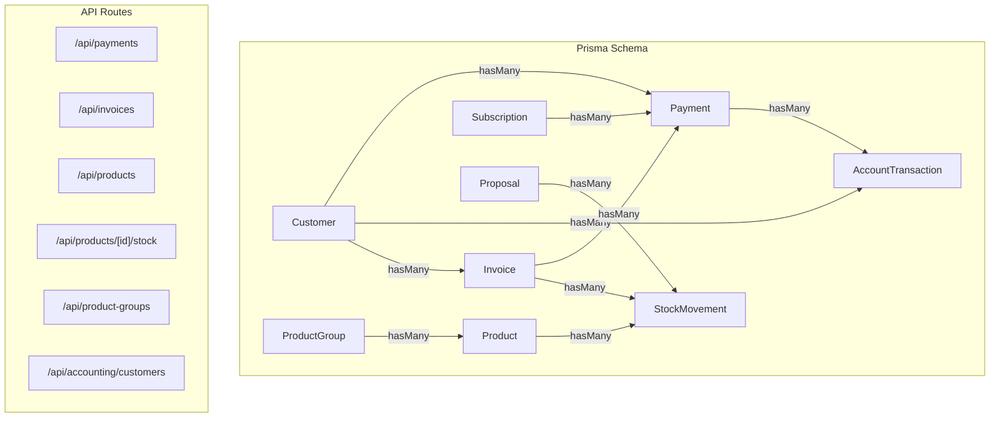
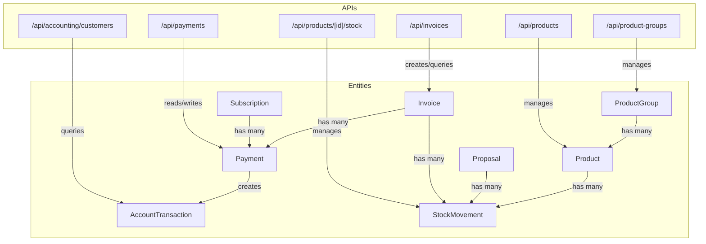
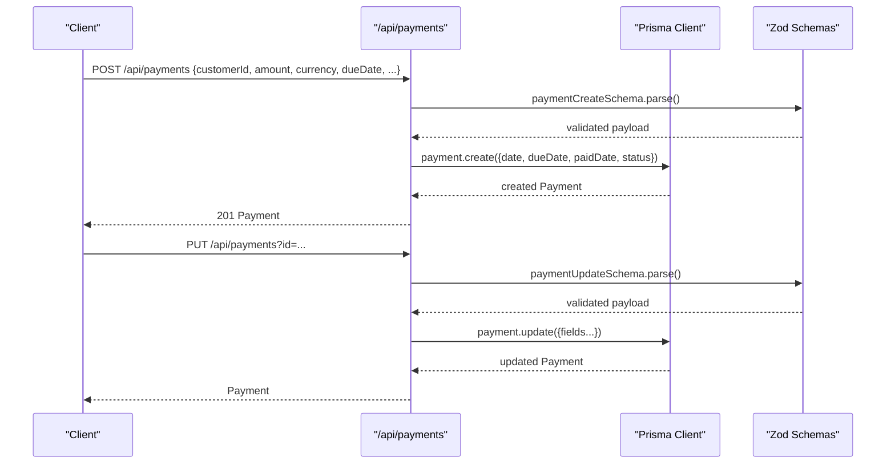
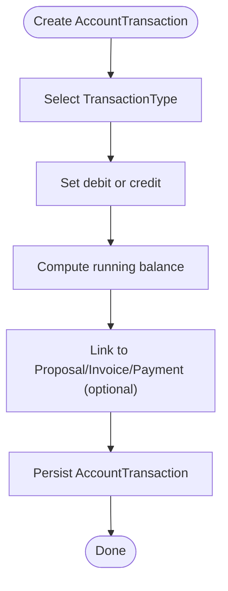
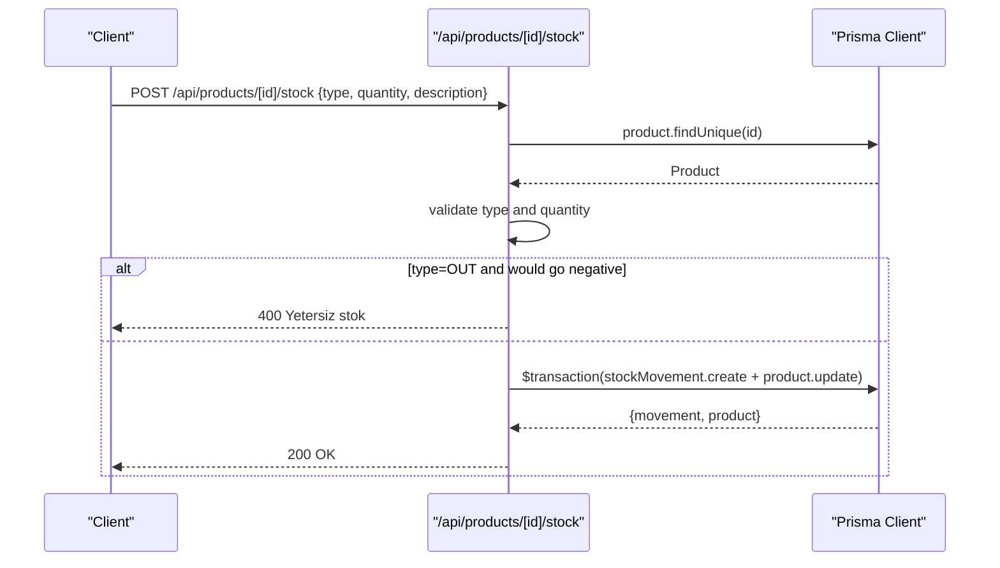
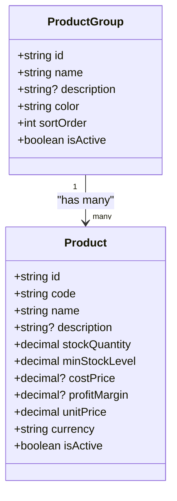
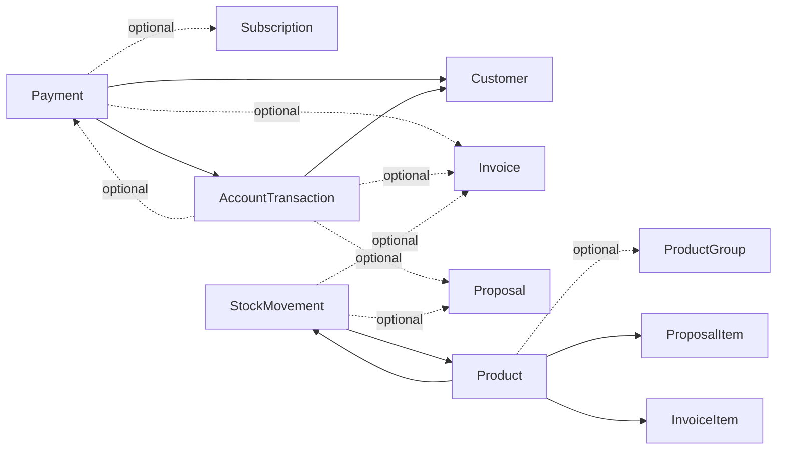

# Payment and Accounting Entities

<cite>
**Referenced Files in This Document**
- [schema.prisma](file://prisma/schema.prisma)
- [route.ts](file://src/app/api/payments/route.ts)
- [route.ts](file://src/app/api/accounting/customers/route.ts)
- [route.ts](file://src/app/api/products/route.ts)
- [route.ts](file://src/app/api/products/[id]/stock/route.ts)
- [route.ts](file://src/app/api/product-groups/route.ts)
- [route.ts](file://src/app/api/invoices/route.ts)
- [validations.ts](file://src/lib/validations.ts)
- [error-handler.ts](file://src/lib/error-handler.ts)
</cite>

## Table of Contents
1. [Introduction](#introduction)
2. [Project Structure](#project-structure)
3. [Core Components](#core-components)
4. [Architecture Overview](#architecture-overview)
5. [Detailed Component Analysis](#detailed-component-analysis)
6. [Dependency Analysis](#dependency-analysis)
7. [Performance Considerations](#performance-considerations)
8. [Troubleshooting Guide](#troubleshooting-guide)
9. [Conclusion](#conclusion)

## Introduction
This document explains the Payment and Accounting entities and their relationships within the system. It covers:
- Payment entity with payment methods (Cash, Transfer, Credit Card), status tracking (Due, Late, Paid), currency support, and relationships to invoices and subscriptions
- AccountTransaction model for financial tracking including opening balances, debt/credit entries, and running balance calculations with TransactionType enumeration
- StockMovement model for inventory tracking with movement types (In, Out, Adjustment) and product associations
- Product and ProductGroup entities for inventory management with pricing, stock levels, cost price, profit margin, and unit price calculations
- End-to-end workflows for payment processing, financial reconciliation, inventory management, and balance tracking

## Project Structure
The relevant models and APIs are defined in the Prisma schema and implemented via Next.js API routes. The schema defines enums and relations; the API routes implement CRUD operations and business logic.

**Diagram sources**
- [schema.prisma](file://prisma/schema.prisma)
- [route.ts](file://src/app/api/payments/route.ts)
- [route.ts](file://src/app/api/invoices/route.ts)
- [route.ts](file://src/app/api/products/route.ts)
- [route.ts](file://src/app/api/products/[id]/stock/route.ts)
- [route.ts](file://src/app/api/product-groups/route.ts)
- [route.ts](file://src/app/api/accounting/customers/route.ts)

**Section sources**
- [schema.prisma](file://prisma/schema.prisma)
- [route.ts](file://src/app/api/payments/route.ts)
- [route.ts](file://src/app/api/invoices/route.ts)
- [route.ts](file://src/app/api/products/route.ts)
- [route.ts](file://src/app/api/products/[id]/stock/route.ts)
- [route.ts](file://src/app/api/product-groups/route.ts)
- [route.ts](file://src/app/api/accounting/customers/route.ts)

## Core Components
This section documents the core entities and their attributes, enumerations, and relationships.

- Payment
  - Fields: customer relation, invoice relation (optional), subscription relation (optional), type (Cash/Transfer/Credit Card), amount (Decimal), currency (default "TRY"), date, dueDate, paidDate, status (Due/Late/Paid), note, description, accountTransactions (hasMany)
  - Enumerations: PaymentType, PaymentStatus
  - Relationships: belongs to Customer; optional belongs to Invoice; optional belongs to Subscription; has many AccountTransaction
  - Currency support: stored per record; defaults to TRY

- AccountTransaction
  - Fields: customer relation, type (TransactionType), debit (Decimal), credit (Decimal), balance (Decimal), optional proposal/invoice/payment relations, description, createdAt
  - Enumerations: TransactionType (Opening Balance, Proposal Debt, Invoice Debt, Payment Credit, Manual Adjustment)
  - Relationships: belongs to Customer; optional belongs to Proposal, Invoice, Payment
  - Running balance: balance field stores cumulative balance after each transaction

- StockMovement
  - Fields: product relation, type (MovementType), quantity (Decimal), optional proposal/invoice relations, description, createdAt
  - Enumerations: MovementType (In, Out, Adjustment)
  - Relationships: belongs to Product; optional belongs to Proposal, Invoice

- Product
  - Fields: code (unique), name, description, group relation (optional), stockQuantity (Decimal), minStockLevel (Decimal), costPrice (Decimal), profitMargin (Decimal), unitPrice (Decimal), currency (default "TRY"), isActive, createdAt, updatedAt
  - Relationships: belongs to ProductGroup (optional); has many StockMovement; has many ProposalItem; has many InvoiceItem

- ProductGroup
  - Fields: name (unique), description, color (default blue), sortOrder (Int), isActive, createdAt, updatedAt
  - Relationships: has many Product

- Invoice
  - Fields: number (unique), customer relation, optional proposal relation, type (Sale/Return), subtotal, taxRate, taxAmount, total, status (Draft/Issued/Partial/Paid/Cancelled), issueDate, dueDate, notes, items (hasMany), payments (hasMany), stockMovements (hasMany), accountTransactions (hasMany)
  - Enumerations: InvoiceType, InvoiceStatus
  - Relationships: belongs to Customer; optional belongs to Proposal; has many Payment; has many StockMovement; has many AccountTransaction

- Proposal
  - Fields: customer relation, number (unique), title, type, description, amount (Decimal), currency (default "TRY"), validUntil, status (Draft/Sent/Pending/Approved/Rejected/Expired/Converted), sentAt, approvedBy/approvedAt, rejectedAt/rejectReason, notes, items (hasMany), invoices (hasMany), accountTransactions (hasMany), stockMovements (hasMany)
  - Relationships: belongs to Customer; has many Invoice; has many AccountTransaction; has many StockMovement

**Section sources**
- [schema.prisma](file://prisma/schema.prisma)

## Architecture Overview
The system integrates payments, invoicing, inventory, and accounting through relational models and API endpoints. Payments can originate from subscriptions or invoices and create corresponding AccountTransaction entries. Inventory movements are tracked via StockMovement and linked to proposals and invoices.

**Diagram sources**
- [schema.prisma](file://prisma/schema.prisma)
- [route.ts](file://src/app/api/payments/route.ts)
- [route.ts](file://src/app/api/invoices/route.ts)
- [route.ts](file://src/app/api/accounting/customers/route.ts)
- [route.ts](file://src/app/api/products/route.ts)
- [route.ts](file://src/app/api/products/[id]/stock/route.ts)
- [route.ts](file://src/app/api/product-groups/route.ts)

## Detailed Component Analysis

### Payment Entity
- Purpose: Track incoming/outgoing cash flows with method, status, and currency.
- Methods: Cash, Transfer, Credit Card
- Status: Due, Late, Paid
- Currency: Stored per record; default "TRY"
- Relationships:
  - Belongs to Customer
  - Optional belongs to Invoice
  - Optional belongs to Subscription
  - Has many AccountTransaction entries
- API endpoints:
  - GET: List payments with filters (customer, subscription, status, currency, dueDate range)
  - POST: Create payment; sets date and dueDate from input; validates amount/currency/date/status
  - PUT: Update payment; sanitizes and validates fields
  - DELETE: Delete payment by id

**Diagram sources**
- [route.ts](file://src/app/api/payments/route.ts)
- [validations.ts](file://src/lib/validations.ts)

**Section sources**
- [schema.prisma](file://prisma/schema.prisma)
- [route.ts](file://src/app/api/payments/route.ts)
- [validations.ts](file://src/lib/validations.ts)
- [error-handler.ts](file://src/lib/error-handler.ts)

### AccountTransaction Model
- Purpose: Comprehensive financial ledger capturing opening balances, debts, credits, and running balances.
- Types: Opening Balance, Proposal Debt, Invoice Debt, Payment Credit, Manual Adjustment
- Fields: debit, credit, balance (running balance), optional relations to Proposal, Invoice, Payment
- Behavior:
  - Each transaction updates the balance field
  - Can be linked to a Payment (when money is received)
  - Can be linked to an Invoice or Proposal (for receivables)
  - Supports manual adjustments
- API usage:
  - Customers endpoint queries last transaction per customer to compute current balance

**Diagram sources**
- [schema.prisma](file://prisma/schema.prisma)
- [route.ts](file://src/app/api/accounting/customers/route.ts)

**Section sources**
- [schema.prisma](file://prisma/schema.prisma)
- [route.ts](file://src/app/api/accounting/customers/route.ts)

### StockMovement Model
- Purpose: Track inventory changes with movement types and product associations.
- Types: In (receipt), Out (sale/usage), Adjustment (physical count correction)
- Validation:
  - Prevents negative stock on Out movements
  - Supports IN/OUT/ADJUSTMENT quantities
- API:
  - POST: Create movement; update product stockQuantity atomically
  - GET: List movements with pagination and related Proposal/Invoice info

**Diagram sources**
- [route.ts](file://src/app/api/products/[id]/stock/route.ts)
- [schema.prisma](file://prisma/schema.prisma)

**Section sources**
- [schema.prisma](file://prisma/schema.prisma)
- [route.ts](file://src/app/api/products/[id]/stock/route.ts)

### Product and ProductGroup
- Product:
  - Unique code, name, description
  - Group relation (optional)
  - Stock levels (stockQuantity, minStockLevel)
  - Pricing (costPrice, profitMargin, unitPrice), currency (default "TRY")
  - IsActive flag
  - Relations: ProductGroup, StockMovement, ProposalItem, InvoiceItem
- ProductGroup:
  - Name (unique), description, color, sortOrder, isActive
  - Relations: Products

**Diagram sources**
- [schema.prisma](file://prisma/schema.prisma)

**Section sources**
- [schema.prisma](file://prisma/schema.prisma)
- [route.ts](file://src/app/api/products/route.ts)
- [route.ts](file://src/app/api/product-groups/route.ts)

### Invoice and Proposal
- Invoice:
  - Unique number, customer, optional proposal, type (Sale/Return), dates, totals, status, items, payments, stockMovements, accountTransactions
  - API: Create draft invoice, compute totals, optionally convert proposal to Converted
- Proposal:
  - Customer, number, title, type, amounts, currency, validity, status, items, invoices, accountTransactions, stockMovements

These entities integrate with payments and inventory:
- Invoices generate AccountTransaction entries (debts) and StockMovement entries
- Payments link to invoices and create AccountTransaction entries (credits)

**Section sources**
- [schema.prisma](file://prisma/schema.prisma)
- [route.ts](file://src/app/api/invoices/route.ts)

## Dependency Analysis
- Payment depends on:
  - Customer (required)
  - Subscription (optional)
  - Invoice (optional)
  - AccountTransaction (created upon payment)
- AccountTransaction depends on:
  - Customer (required)
  - Proposal/Invoice/Payment (optional)
- StockMovement depends on:
  - Product (required)
  - Proposal/Invoice (optional)
- Product depends on:
  - ProductGroup (optional)
  - StockMovement, ProposalItem, InvoiceItem

**Diagram sources**
- [schema.prisma](file://prisma/schema.prisma)

**Section sources**
- [schema.prisma](file://prisma/schema.prisma)

## Performance Considerations
- Use pagination for listing endpoints (payments, stock movements, products) to avoid large payloads.
- Prefer filtering by indexed fields (customerId, status, date ranges) to reduce query cost.
- Batch operations where possible; for example, invoice creation uses a transaction to ensure atomicity.
- Keep balance computations localized to the AccountTransaction model to avoid recalculating balances on reads.

## Troubleshooting Guide
- Validation errors:
  - Payment creation/update requires amount, currency, dueDate in valid format; invalid inputs return structured validation errors.
- Input sanitization:
  - API routes sanitize input strings and trim unsafe characters.
- Negative stock:
  - Out movements prevent going below zero; returns current stock level to help diagnose issues.
- Unknown errors:
  - API error handler returns generic messages with 500 status for unhandled exceptions.

**Section sources**
- [route.ts](file://src/app/api/payments/route.ts)
- [route.ts](file://src/app/api/products/[id]/stock/route.ts)
- [error-handler.ts](file://src/lib/error-handler.ts)

## Conclusion
The Payment and Accounting subsystem provides a robust foundation for financial tracking, inventory control, and revenue recognition. Payments integrate with invoices and subscriptions while generating AccountTransaction records for accurate balance tracking. Stock movements are controlled with strict validation to prevent negative inventory, and Product/ProductGroup entities support pricing and categorization. Together, these components enable end-to-end workflows for payment processing, financial reconciliation, and inventory management.