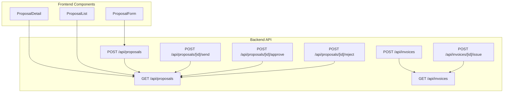
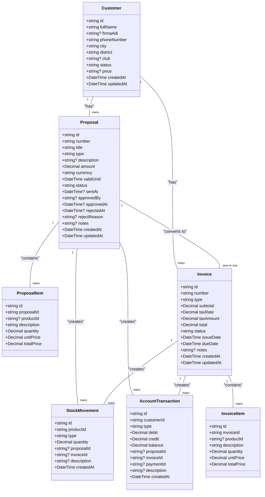
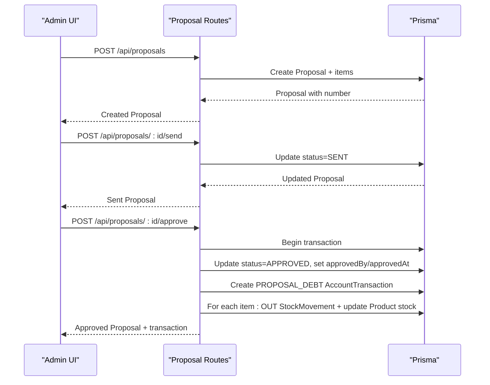
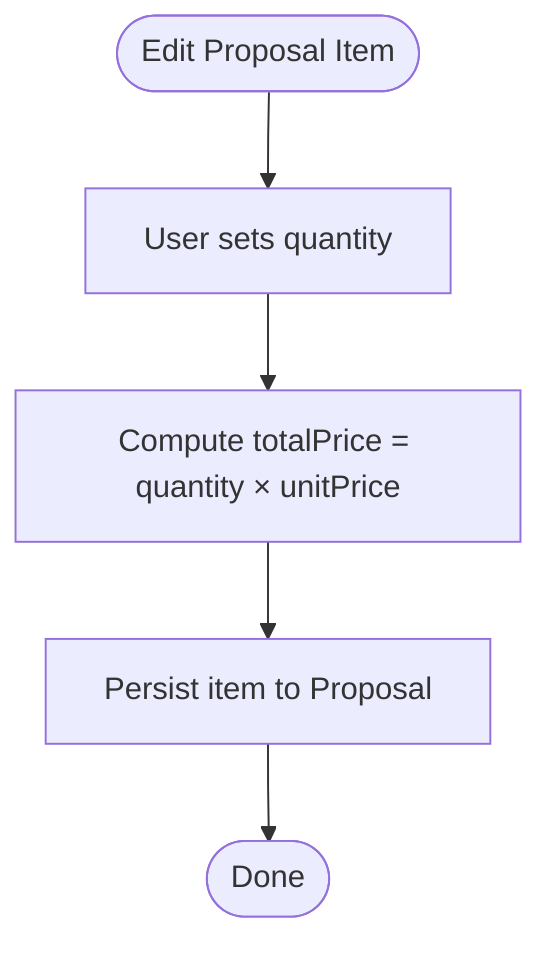
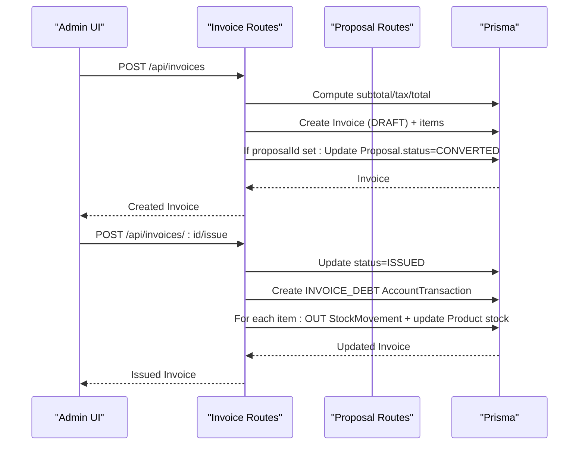
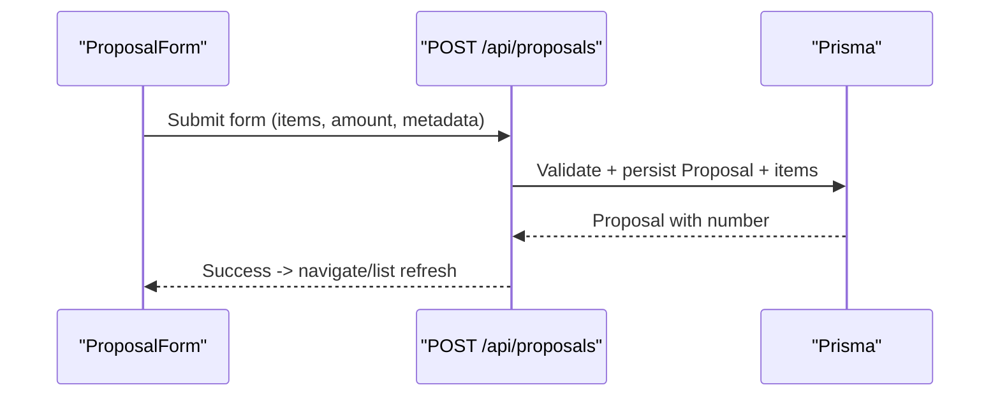
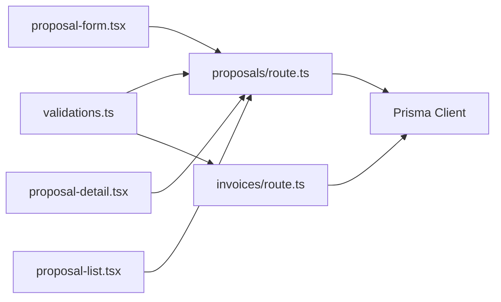

# Proposal and Invoice Entities

<cite>
**Referenced Files in This Document**
- [schema.prisma](file://prisma/schema.prisma)
- [route.ts](file://src/app/api/proposals/route.ts)
- [route.ts](file://src/app/api/proposals/[id]/approve/route.ts)
- [route.ts](file://src/app/api/proposals/[id]/reject/route.ts)
- [route.ts](file://src/app/api/proposals/[id]/send/route.ts)
- [route.ts](file://src/app/api/invoices/route.ts)
- [route.ts](file://src/app/api/invoices/[id]/issue/route.ts)
- [validations.ts](file://src/lib/validations.ts)
- [proposal-form.tsx](file://src/components/proposal-form.tsx)
- [proposal-detail.tsx](file://src/components/proposal-detail.tsx)
- [proposal-list.tsx](file://src/components/proposal-list.tsx)
</cite>

## Table of Contents
1. [Introduction](#introduction)
2. [Project Structure](#project-structure)
3. [Core Components](#core-components)
4. [Architecture Overview](#architecture-overview)
5. [Detailed Component Analysis](#detailed-component-analysis)
6. [Dependency Analysis](#dependency-analysis)
7. [Performance Considerations](#performance-considerations)
8. [Troubleshooting Guide](#troubleshooting-guide)
9. [Conclusion](#conclusion)

## Introduction
This document explains the Proposal and Invoice entities and their relationship within the system. It covers:
- Proposal lifecycle: creation, sending, approval/rejection, expiration, and conversion to invoices
- ProposalItem model: product associations, quantities, pricing, and totals
- Invoice generation from proposals: tax calculations, payment tracking, and statuses
- Bidirectional relationship between proposals and invoices
- Approval workflow, approver tracking, rejection reasons, and expiration handling
- Examples of workflows and financial reporting via these entities

## Project Structure
The relevant backend APIs and frontend components are organized as follows:
- Backend API routes under src/app/api handle CRUD and workflow actions for proposals and invoices
- Validation schemas in src/lib define request shapes and constraints
- Frontend components in src/components manage proposal creation, viewing, and listing



**Diagram sources**
- [route.ts:1-118](file://src/app/api/proposals/route.ts#L1-L118)
- [route.ts:1-48](file://src/app/api/proposals/[id]/send/route.ts#L1-L48)
- [route.ts:1-121](file://src/app/api/proposals/[id]/approve/route.ts#L1-L121)
- [route.ts:1-63](file://src/app/api/proposals/[id]/reject/route.ts#L1-L63)
- [route.ts:1-170](file://src/app/api/invoices/route.ts#L1-L170)
- [route.ts:1-101](file://src/app/api/invoices/[id]/issue/route.ts#L1-L101)
- [proposal-form.tsx:1-468](file://src/components/proposal-form.tsx#L1-L468)
- [proposal-detail.tsx:1-415](file://src/components/proposal-detail.tsx#L1-L415)
- [proposal-list.tsx:1-274](file://src/components/proposal-list.tsx#L1-L274)

**Section sources**
- [route.ts:1-118](file://src/app/api/proposals/route.ts#L1-L118)
- [route.ts:1-170](file://src/app/api/invoices/route.ts#L1-L170)

## Core Components
- Proposal: A sales quotation with status, customer association, optional items, and metadata (number, title, type, amount, currency, validUntil, notes). Supports workflow transitions: DRAFT → SENT → PENDING → APPROVED/REJECTED → EXPIRED/CONVERTED.
- ProposalItem: Line items linked to a product (optional) with description, quantity, unitPrice, and totalPrice.
- Invoice: A financial document with type (SALE/RETURN), dates, tax rate, tax amount, subtotal, total, status, and bidirectional relation to Proposal (when created from a proposal).
- InvoiceItem: Line items linked to a product (optional) mirroring item structure.
- Validation schemas enforce constraints for creation and updates.

Key data model enums and relations:
- ProposalStatus: DRAFT, SENT, PENDING, APPROVED, REJECTED, EXPIRED, CONVERTED
- ProposalType: SUBSCRIPTION, PROJECT, MAINTENANCE, RENEWAL, NETWORK, HARDWARE, SOFTWARE, SERVICE, CONSULTING, OTHER
- InvoiceStatus: DRAFT, ISSUED, PARTIAL, PAID, CANCELLED
- InvoiceType: SALE, RETURN
- Proposal ↔ Customer (many-to-one)
- Proposal → ProposalItem (one-to-many)
- Invoice ↔ Customer (many-to-one)
- Invoice ← Proposal (many-to-one, optional)
- Invoice → InvoiceItem (one-to-many)
- Both Proposal and Invoice → AccountTransaction (financial ledger entries)
- Both Proposal and Invoice → StockMovement (inventory tracking)

**Section sources**
- [schema.prisma:435-443](file://prisma/schema.prisma#L435-L443)
- [schema.prisma:445-456](file://prisma/schema.prisma#L445-L456)
- [schema.prisma:645-693](file://prisma/schema.prisma#L645-L693)
- [schema.prisma:695-706](file://prisma/schema.prisma#L695-L706)
- [schema.prisma:629-643](file://prisma/schema.prisma#L629-L643)
- [schema.prisma:708-722](file://prisma/schema.prisma#L708-L722)

## Architecture Overview
The Proposal and Invoice subsystem integrates with:
- Prisma schema for persistence and relations
- API routes for business logic and transactions
- Validation schemas for request parsing and constraints
- Frontend components for user interaction and reporting



**Diagram sources**
- [schema.prisma:95-134](file://prisma/schema.prisma#L95-L134)
- [schema.prisma:458-503](file://prisma/schema.prisma#L458-L503)
- [schema.prisma:629-643](file://prisma/schema.prisma#L629-L643)
- [schema.prisma:646-693](file://prisma/schema.prisma#L646-L693)
- [schema.prisma:708-722](file://prisma/schema.prisma#L708-L722)
- [schema.prisma:510-539](file://prisma/schema.prisma#L510-L539)
- [schema.prisma:602-620](file://prisma/schema.prisma#L602-L620)

## Detailed Component Analysis

### Proposal Entity Workflow
Proposal lifecycle and transitions:
- Creation: POST /api/proposals generates a unique number and persists items
- Sending: POST /api/proposals/[id]/send moves status from DRAFT to SENT
- Approval: POST /api/proposals/[id]/approve sets APPROVED, records approver/approval timestamp, creates a PROPOSAL_DEBT transaction, and performs stock OUT movements per item
- Rejection: POST /api/proposals/[id]/reject sets REJECTED with optional rejectReason
- Expiration: Not handled in provided routes; can be implemented via cron or manual update
- Conversion: When an invoice is created from a proposal, the proposal status becomes CONVERTED



**Diagram sources**
- [route.ts:58-117](file://src/app/api/proposals/route.ts#L58-L117)
- [route.ts:1-48](file://src/app/api/proposals/[id]/send/route.ts#L1-L48)
- [route.ts:1-121](file://src/app/api/proposals/[id]/approve/route.ts#L1-L121)

**Section sources**
- [route.ts:1-118](file://src/app/api/proposals/route.ts#L1-L118)
- [route.ts:1-48](file://src/app/api/proposals/[id]/send/route.ts#L1-L48)
- [route.ts:1-121](file://src/app/api/proposals/[id]/approve/route.ts#L1-L121)
- [route.ts:1-63](file://src/app/api/proposals/[id]/reject/route.ts#L1-L63)
- [validations.ts:200-233](file://src/lib/validations.ts#L200-L233)

### ProposalItem Model
ProposalItem captures per-line details:
- Optional productId links to Product
- Description, quantity, unitPrice, totalPrice
- Calculations are driven by the frontend form and validated server-side



**Diagram sources**
- [proposal-form.tsx:140-170](file://src/components/proposal-form.tsx#L140-L170)
- [schema.prisma:629-643](file://prisma/schema.prisma#L629-L643)

**Section sources**
- [schema.prisma:629-643](file://prisma/schema.prisma#L629-L643)
- [proposal-form.tsx:125-170](file://src/components/proposal-form.tsx#L125-L170)
- [validations.ts:190-198](file://src/lib/validations.ts#L190-L198)

### Invoice Generation from Proposals
Invoice creation supports:
- Tax calculation: subtotal, taxAmount, total computed from items and taxRate
- Status management: DRAFT initially; ISSUED via POST /api/invoices/[id]/issue
- Bidirectional relation: invoice.proposalId links back to originating Proposal
- Financial impact: creates INVOICE_DEBT transaction and performs stock OUT movements



**Diagram sources**
- [route.ts:79-169](file://src/app/api/invoices/route.ts#L79-L169)
- [route.ts:1-101](file://src/app/api/invoices/[id]/issue/route.ts#L1-L101)

**Section sources**
- [route.ts:1-170](file://src/app/api/invoices/route.ts#L1-L170)
- [route.ts:1-101](file://src/app/api/invoices/[id]/issue/route.ts#L1-L101)
- [schema.prisma:646-693](file://prisma/schema.prisma#L646-L693)

### Financial Reporting Through Entities
AccountTransaction tracks debits/credits per Proposal/Invoice/Payment:
- PROPOSAL_DEBT and INVOICE_DEBT types record receivables
- Running balance maintained per transaction
- Ledger ties to Proposal, Invoice, and Payment entities

```mermaid
erDiagram
ACCOUNT_TRANSACTION {
string id PK
string customerId
string type
decimal debit
decimal credit
decimal balance
string? proposalId
string? invoiceId
string? paymentId
string? description
datetime createdAt
}
PROPOSAL ||--o{ ACCOUNT_TRANSACTION : "creates"
INVOICE ||--o{ ACCOUNT_TRANSACTION : "creates"
PAYMENT ||--o{ ACCOUNT_TRANSACTION : "creates"
```

**Diagram sources**
- [schema.prisma:510-539](file://prisma/schema.prisma#L510-L539)

**Section sources**
- [schema.prisma:510-539](file://prisma/schema.prisma#L510-L539)

### Frontend Integration
- ProposalForm: Creates proposals with items, computes totals, and posts to /api/proposals
- ProposalDetail: Displays proposal details, handles approval/rejection actions, and PDF export
- ProposalList: Filters and paginates proposals, supports actions (view/edit/download/delete)



**Diagram sources**
- [proposal-form.tsx:172-192](file://src/components/proposal-form.tsx#L172-L192)
- [route.ts:58-117](file://src/app/api/proposals/route.ts#L58-L117)

**Section sources**
- [proposal-form.tsx:1-468](file://src/components/proposal-form.tsx#L1-L468)
- [proposal-detail.tsx:1-415](file://src/components/proposal-detail.tsx#L1-L415)
- [proposal-list.tsx:1-274](file://src/components/proposal-list.tsx#L1-L274)

## Dependency Analysis
- API routes depend on Prisma client and Zod validation schemas
- Proposal routes coordinate transactions for approvals and stock updates
- Invoice routes compute taxes and maintain bidirectional relations
- Frontend components depend on API endpoints and settings for proposal types



**Diagram sources**
- [validations.ts:190-243](file://src/lib/validations.ts#L190-L243)
- [route.ts:1-118](file://src/app/api/proposals/route.ts#L1-L118)
- [route.ts:1-170](file://src/app/api/invoices/route.ts#L1-L170)
- [proposal-form.tsx:1-468](file://src/components/proposal-form.tsx#L1-L468)
- [proposal-detail.tsx:1-415](file://src/components/proposal-detail.tsx#L1-L415)
- [proposal-list.tsx:1-274](file://src/components/proposal-list.tsx#L1-L274)

**Section sources**
- [validations.ts:190-243](file://src/lib/validations.ts#L190-L243)
- [route.ts:1-118](file://src/app/api/proposals/route.ts#L1-L118)
- [route.ts:1-170](file://src/app/api/invoices/route.ts#L1-L170)

## Performance Considerations
- Use database indexes on frequently filtered fields (status, type, customerId) as defined in Prisma schema
- Batch operations for item creation/update to minimize round-trips
- Prefer server-side pagination for proposal/invoice lists
- Validate monetary values as decimals to avoid precision loss
- Use transactions for approval/issuance to ensure atomicity of financial and inventory updates

## Troubleshooting Guide
Common issues and resolutions:
- Validation errors on proposal creation: ensure items conform to schema and amount is positive
- Approval failures: verify proposal status is SENT or PENDING and product stocks are sufficient
- Issuance failures: confirm invoice status is DRAFT and product stocks are sufficient
- PDF export: ensure the PDF endpoint is reachable and the proposal exists

**Section sources**
- [route.ts:110-117](file://src/app/api/proposals/route.ts#L110-L117)
- [route.ts:108-120](file://src/app/api/proposals/[id]/approve/route.ts#L108-L120)
- [route.ts:94-100](file://src/app/api/invoices/[id]/issue/route.ts#L94-L100)

## Conclusion
The Proposal and Invoice subsystem provides a robust foundation for sales quoting, approval workflows, and invoicing with integrated financial and inventory tracking. The design leverages Prisma relations, server-side transactions, and frontend components to support end-to-end business processes, enabling accurate financial reporting and operational visibility.