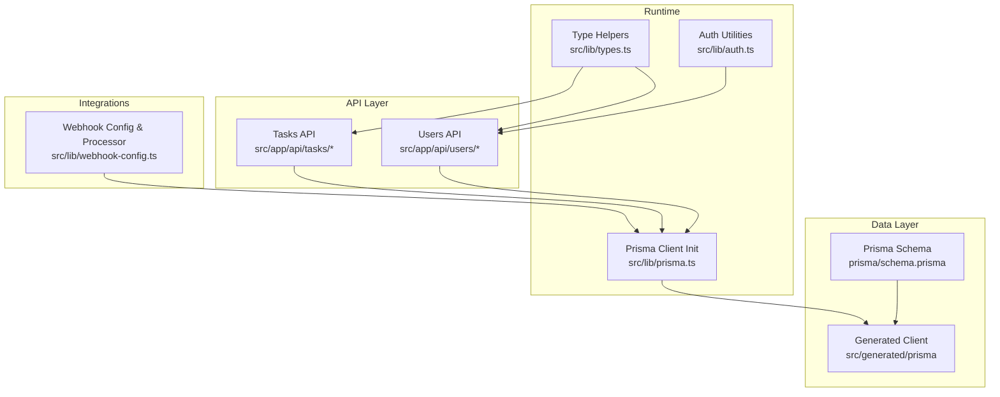
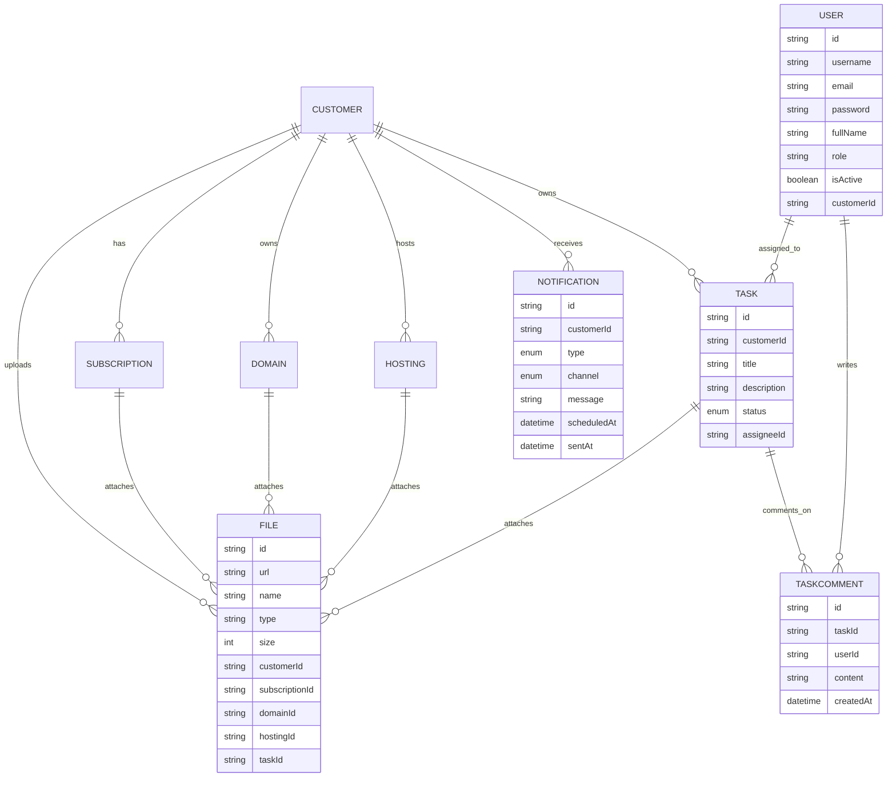
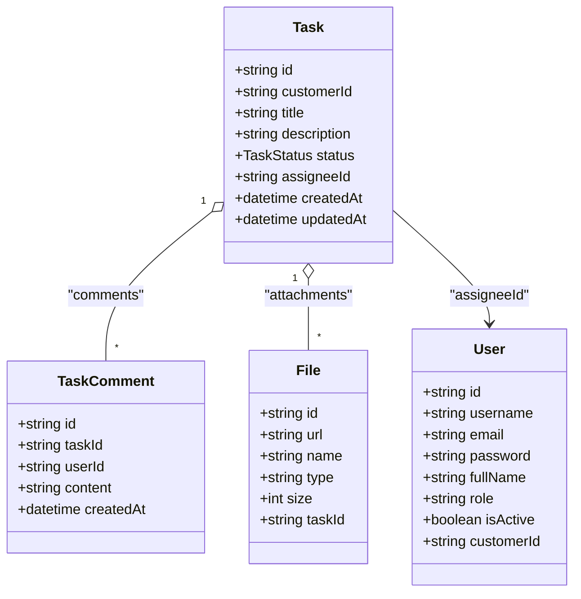
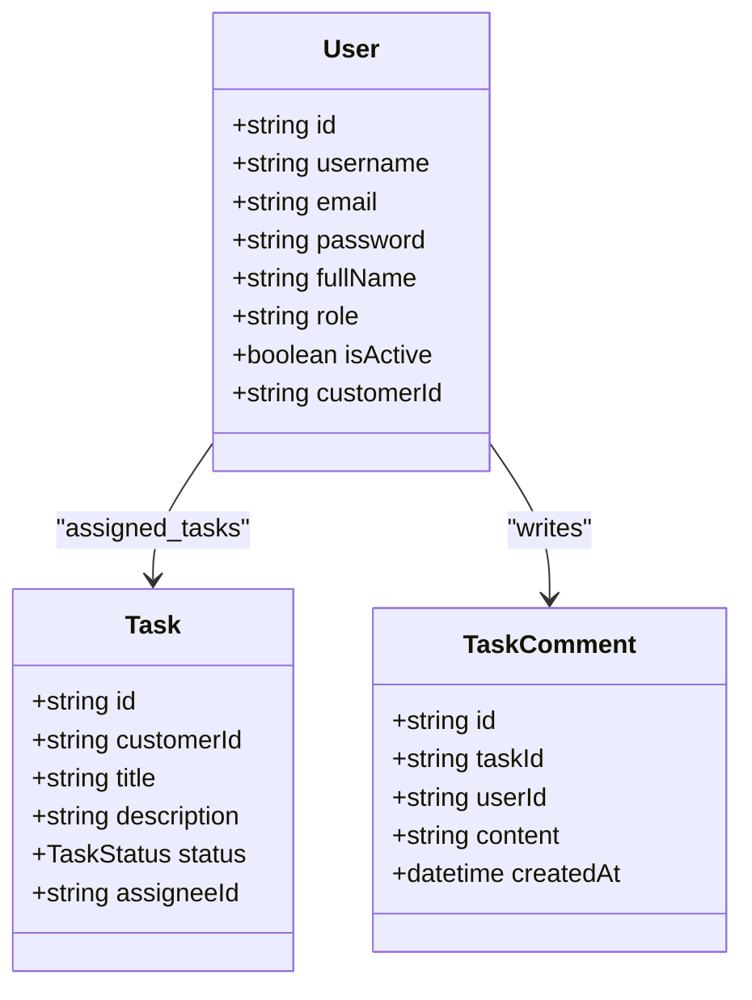
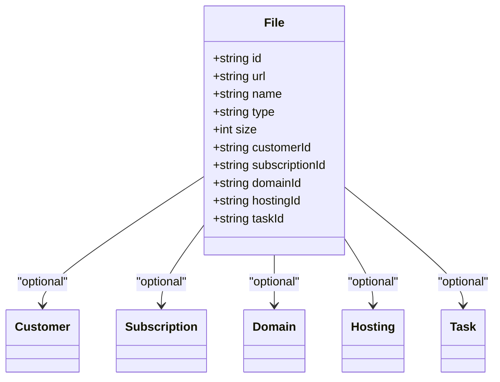
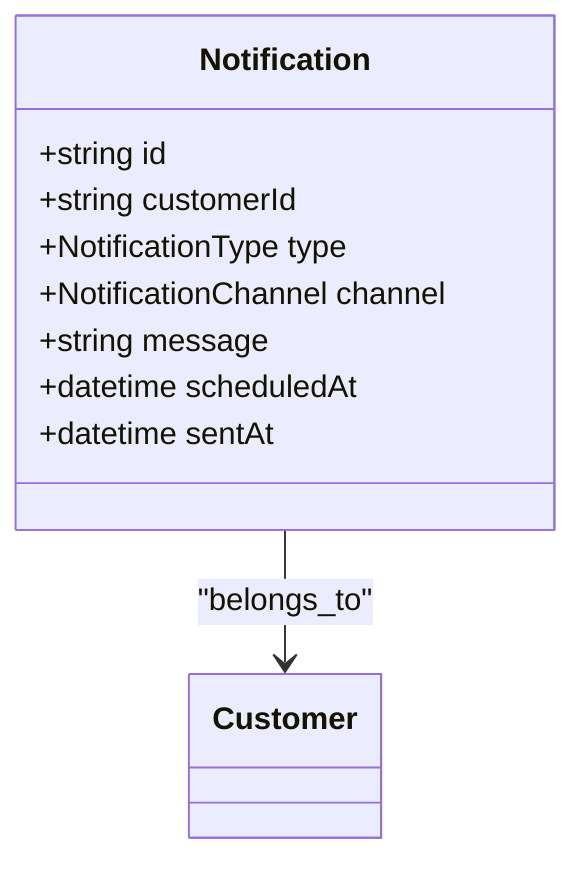
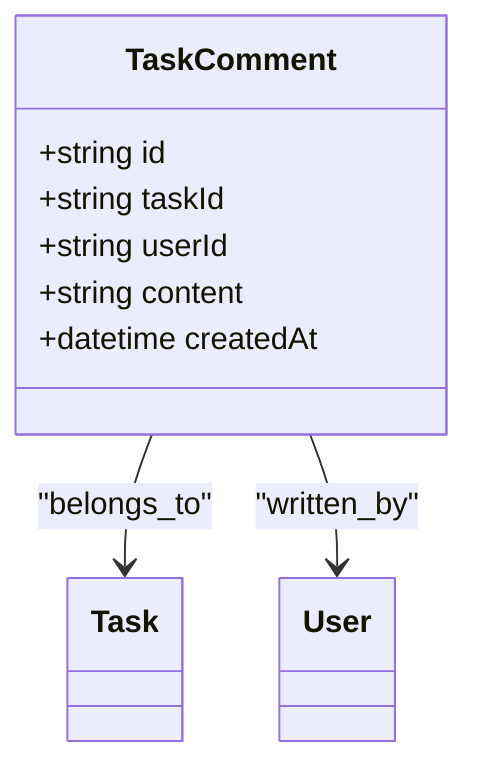
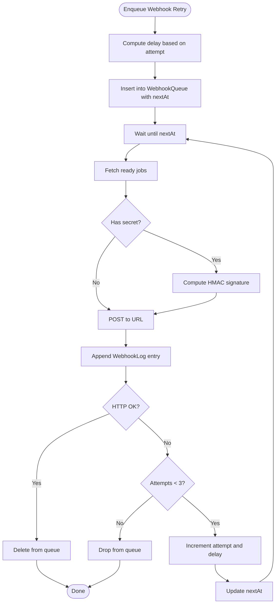
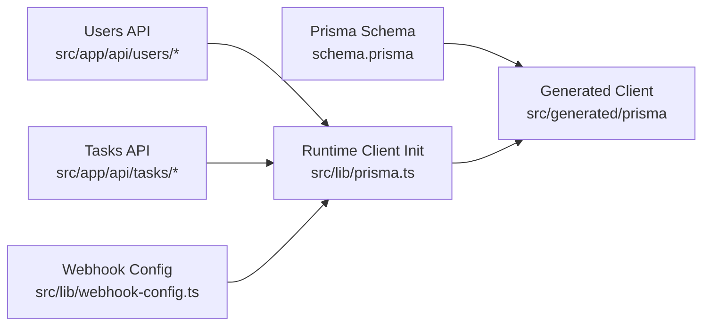

# Operational Entities

<cite>
**Referenced Files in This Document**
- [schema.prisma](file://prisma/schema.prisma)
- [prisma.ts](file://src/lib/prisma.ts)
- [types.ts](file://src/lib/types.ts)
- [auth.ts](file://src/lib/auth.ts)
- [route.ts](file://src/app/api/users/route.ts)
- [route.ts](file://src/app/api/users/[id]/route.ts)
- [route.ts](file://src/app/api/tasks/route.ts)
- [webhook-config.ts](file://src/lib/webhook-config.ts)
</cite>

## Table of Contents
1. [Introduction](#introduction)
2. [Project Structure](#project-structure)
3. [Core Components](#core-components)
4. [Architecture Overview](#architecture-overview)
5. [Detailed Component Analysis](#detailed-component-analysis)
6. [Dependency Analysis](#dependency-analysis)
7. [Performance Considerations](#performance-considerations)
8. [Troubleshooting Guide](#troubleshooting-guide)
9. [Conclusion](#conclusion)

## Introduction
This document provides comprehensive data model documentation for the operational entities in the system: Task, User, File, Notification, and supporting models. It explains how these entities are modeled in the Prisma schema, their relationships, and how they integrate with backend APIs and webhook infrastructure. Special attention is given to:
- Task status lifecycle and assignment tracking
- User roles and authentication credentials
- File associations across multiple entities and metadata
- Notification types, channels, and scheduling
- TaskComment for collaborative task management
- Webhook queue and logging for system integrations

## Project Structure
The data model is defined centrally in the Prisma schema and consumed by Next.js API routes and libraries. Key locations:
- Data model definitions: prisma/schema.prisma
- Generated Prisma client bindings: src/generated/prisma
- Runtime Prisma client initialization: src/lib/prisma.ts
- Type helpers: src/lib/types.ts
- Authentication utilities: src/lib/auth.ts
- API routes for User and Task: src/app/api/users/* and src/app/api/tasks/*
- Webhook configuration and processor: src/lib/webhook-config.ts

**Diagram sources**
- [schema.prisma](file://prisma/schema.prisma)
- [prisma.ts](file://src/lib/prisma.ts)
- [types.ts](file://src/lib/types.ts)
- [auth.ts](file://src/lib/auth.ts)
- [route.ts](file://src/app/api/users/route.ts)
- [route.ts](file://src/app/api/users/[id]/route.ts)
- [route.ts](file://src/app/api/tasks/route.ts)
- [webhook-config.ts](file://src/lib/webhook-config.ts)

**Section sources**
- [schema.prisma](file://prisma/schema.prisma)
- [prisma.ts](file://src/lib/prisma.ts)
- [types.ts](file://src/lib/types.ts)
- [auth.ts](file://src/lib/auth.ts)
- [route.ts](file://src/app/api/users/route.ts)
- [route.ts](file://src/app/api/users/[id]/route.ts)
- [route.ts](file://src/app/api/tasks/route.ts)
- [webhook-config.ts](file://src/lib/webhook-config.ts)

## Core Components
This section summarizes the core operational entities and their primary attributes and relationships.

- Task
  - Status lifecycle: OPEN, PENDING, DONE
  - Assignment: optional relation to User via assigneeId
  - Comments: one-to-many via TaskComment
  - Files: one-to-many via File.taskId
  - Customer linkage: belongs to Customer

- User
  - Credentials: username, email, password
  - Profile: fullName, isActive
  - Role: string field with default USER
  - Relationship: optional Customer membership via customerId
  - Assigned tasks and comments: relations to Task and TaskComment

- File
  - Metadata: url, name, type, size
  - Multi-entity associations: optional foreign keys to Customer, Subscription, Domain, Hosting, Task
  - Created timestamp

- Notification
  - Type: DOMAIN_RENEWAL, HOSTING_RENEWAL, SUBSCRIPTION_PAYMENT, MAINTENANCE_EXPIRY, ADMIN_REMINDER
  - Channel: EMAIL, SMS
  - Content: message
  - Scheduling: scheduledAt, sentAt
  - Customer linkage: belongs to Customer

- TaskComment
  - Belongs to Task and User
  - Content: textual comment
  - Timestamp: createdAt

- WebhookLog and WebhookQueue
  - WebhookLog: event, url, ok, statusCode, error, attempt, timestamp
  - WebhookQueue: event, url, body, secret, attempt, nextAt, createdAt
  - Retry processor: periodic dispatch with exponential backoff and HMAC signing

**Section sources**
- [schema.prisma](file://prisma/schema.prisma)
- [webhook-config.ts](file://src/lib/webhook-config.ts)

## Architecture Overview
The system’s operational data architecture centers around the Prisma schema with explicit relations and enums. API routes consume the Prisma client to enforce validation and sanitization before persisting data. Webhooks are queued and retried asynchronously with logging.

**Diagram sources**
- [schema.prisma](file://prisma/schema.prisma)

## Detailed Component Analysis

### Task Entity
Task captures work items with status management and collaboration support.

- Status lifecycle
  - OPEN: initial state
  - PENDING: in-progress or awaiting action
  - DONE: completed
- Assignment tracking
  - Optional assigneeId linking to User
- Comment system integration
  - One-to-many with TaskComment
- File attachments
  - One-to-many with File via taskId
- Customer linkage
  - Each task belongs to a Customer

**Diagram sources**
- [schema.prisma](file://prisma/schema.prisma)

**Section sources**
- [schema.prisma](file://prisma/schema.prisma)
- [route.ts](file://src/app/api/tasks/route.ts)

### User Entity
User manages system users with credentials and role semantics.

- Authentication credentials
  - username, email, password
- Profile and state
  - fullName, isActive
- Role
  - role stored as string with default USER
- Relationship to Customer
  - optional customerId for customer-linked accounts
- Collaborative relations
  - assignedTasks (Task)
  - comments (TaskComment)

**Diagram sources**
- [schema.prisma](file://prisma/schema.prisma)

**Section sources**
- [schema.prisma](file://prisma/schema.prisma)
- [route.ts](file://src/app/api/users/route.ts)
- [route.ts](file://src/app/api/users/[id]/route.ts)
- [auth.ts](file://src/lib/auth.ts)

### File Entity
File represents uploaded artifacts associated with multiple entities.

- Metadata
  - url, name, type, size
- Multi-entity associations
  - Optional customerId → Customer
  - Optional subscriptionId → Subscription
  - Optional domainId → Domain
  - Optional hostingId → Hosting
  - Optional taskId → Task
- Storage management
  - Files are persisted with createdAt timestamp
  - Deletion behavior respects foreign key constraints (e.g., SetNull on delete for optional relations)

**Diagram sources**
- [schema.prisma](file://prisma/schema.prisma)

**Section sources**
- [schema.prisma](file://prisma/schema.prisma)

### Notification Entity
Notification encapsulates scheduled alerts categorized by type and delivered via channel.

- Type categorization
  - DOMAIN_RENEWAL
  - HOSTING_RENEWAL
  - SUBSCRIPTION_PAYMENT
  - MAINTENANCE_EXPIRY
  - ADMIN_REMINDER
- Channel management
  - EMAIL
  - SMS
- Scheduling
  - scheduledAt: planned delivery time
  - sentAt: actual delivery time (nullable)
- Customer linkage
  - Each notification belongs to a Customer

**Diagram sources**
- [schema.prisma](file://prisma/schema.prisma)

**Section sources**
- [schema.prisma](file://prisma/schema.prisma)

### TaskComment Entity
TaskComment enables collaborative task management by capturing comments tied to tasks and users.

- Relations
  - task → Task
  - user → User
- Content and audit
  - content: textual comment
  - createdAt: timestamp

**Diagram sources**
- [schema.prisma](file://prisma/schema.prisma)

**Section sources**
- [schema.prisma](file://prisma/schema.prisma)

### Webhook-Related Entities
WebhookLog and WebhookQueue support asynchronous system integrations with retry logic and HMAC signing.

- WebhookQueue
  - event, url, body, secret
  - attempt, nextAt, createdAt
- WebhookLog
  - event, url, ok, statusCode, error, attempt, timestamp
- Retry processor
  - Periodic dispatch for ready jobs
  - Exponential backoff per attempt
  - HMAC SHA-256 signing when secret is configured

**Diagram sources**
- [webhook-config.ts](file://src/lib/webhook-config.ts)

**Section sources**
- [webhook-config.ts](file://src/lib/webhook-config.ts)

## Dependency Analysis
Operational entities and their dependencies are defined in the Prisma schema. The runtime relies on the generated Prisma client initialized in the application library.

**Diagram sources**
- [schema.prisma](file://prisma/schema.prisma)
- [prisma.ts](file://src/lib/prisma.ts)
- [route.ts](file://src/app/api/users/route.ts)
- [route.ts](file://src/app/api/users/[id]/route.ts)
- [route.ts](file://src/app/api/tasks/route.ts)
- [webhook-config.ts](file://src/lib/webhook-config.ts)

**Section sources**
- [schema.prisma](file://prisma/schema.prisma)
- [prisma.ts](file://src/lib/prisma.ts)
- [route.ts](file://src/app/api/users/route.ts)
- [route.ts](file://src/app/api/users/[id]/route.ts)
- [route.ts](file://src/app/api/tasks/route.ts)
- [webhook-config.ts](file://src/lib/webhook-config.ts)

## Performance Considerations
- Indexing and uniqueness
  - Unique constraints on username and email in User reduce lookup overhead and prevent duplicates.
  - Unique constraints on customer.fullName and similar identifiers improve search performance.
- Pagination and filtering
  - API routes for Tasks implement pagination and filtering to avoid large result sets.
- Asynchronous processing
  - Webhook retries are handled asynchronously with bounded concurrency and backoff to prevent overload.
- Client initialization
  - Centralized Prisma client initialization avoids redundant connections and ensures consistent behavior.

[No sources needed since this section provides general guidance]

## Troubleshooting Guide
- User creation/update errors
  - Validation failures return structured error responses with details.
  - Duplicate usernames trigger conflict responses.
  - Password hashing is handled securely during create/update.
- Task retrieval and creation
  - Sanitized inputs and schema validation ensure robust persistence.
  - Pagination limits are enforced to avoid excessive loads.
- Webhook delivery issues
  - Logs capture status codes, errors, and attempts.
  - Retry processor applies exponential backoff and stops after three attempts.
  - HMAC signatures are computed when a secret is configured.

**Section sources**
- [route.ts](file://src/app/api/users/route.ts)
- [route.ts](file://src/app/api/users/[id]/route.ts)
- [route.ts](file://src/app/api/tasks/route.ts)
- [webhook-config.ts](file://src/lib/webhook-config.ts)

## Conclusion
The operational data model defines clear boundaries for Tasks, Users, Files, Notifications, and supporting entities. Enums and relations ensure consistent state transitions and multi-entity associations. API routes enforce validation and sanitization, while webhook infrastructure provides resilient external integration with logging and retry logic. Together, these components form a cohesive foundation for task management, customer operations, and system integrations.