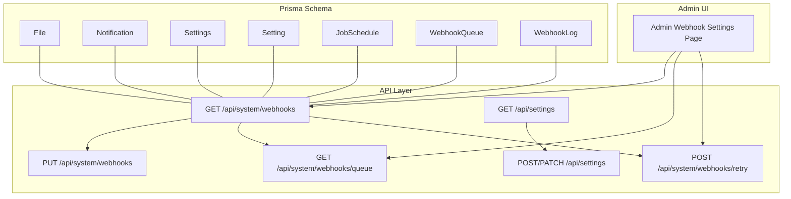
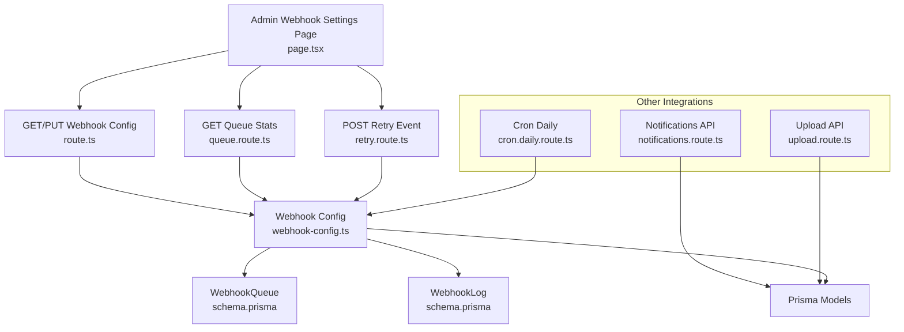
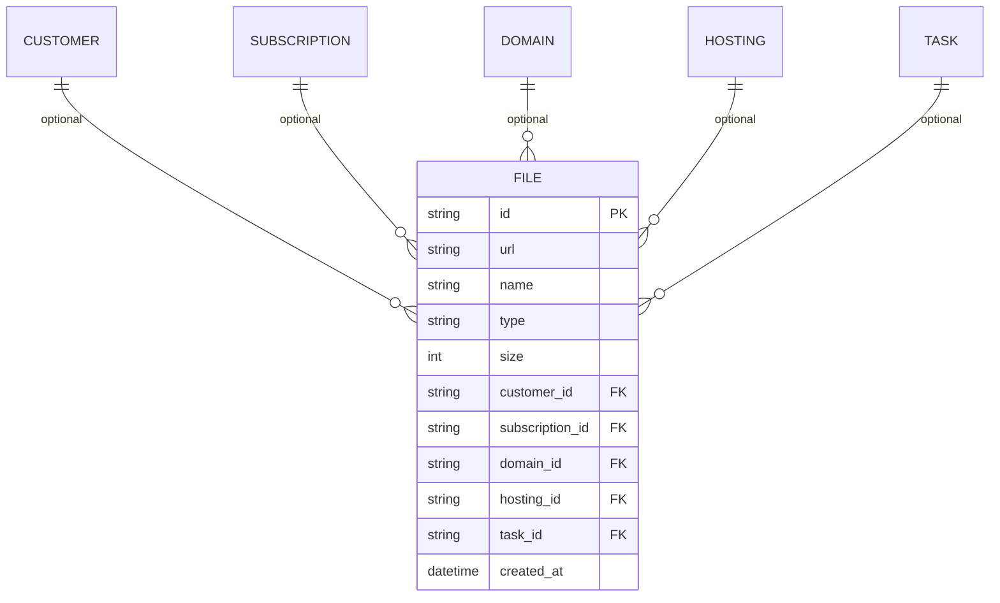
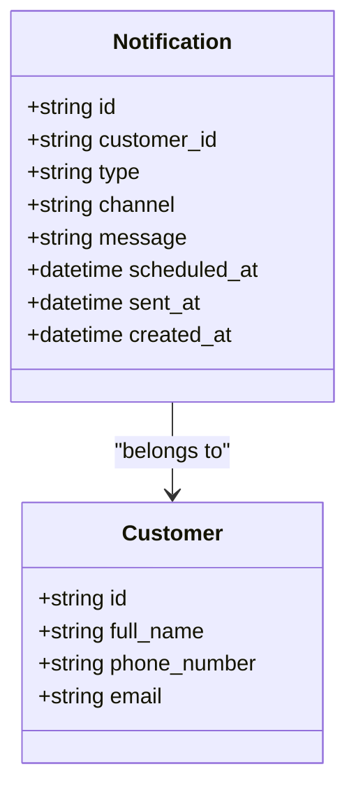
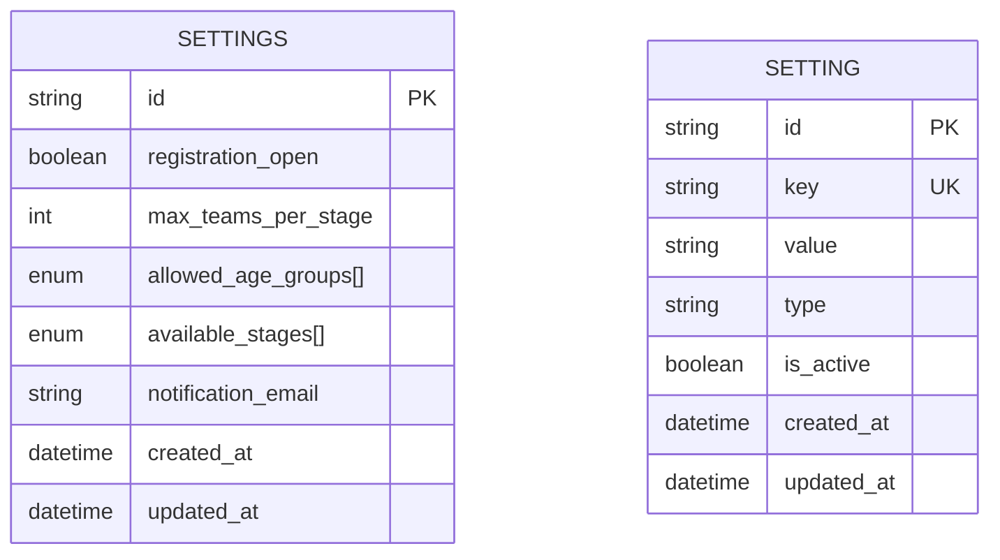
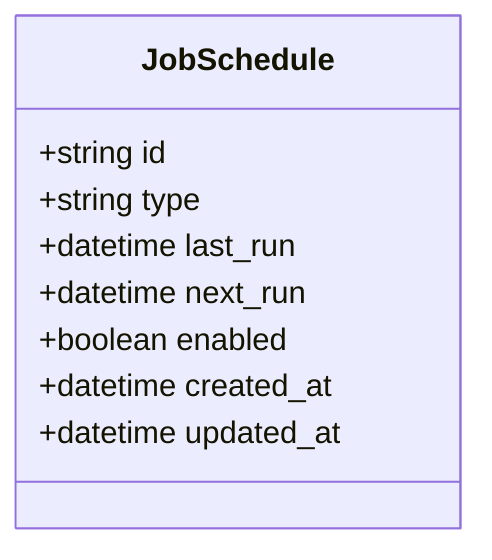
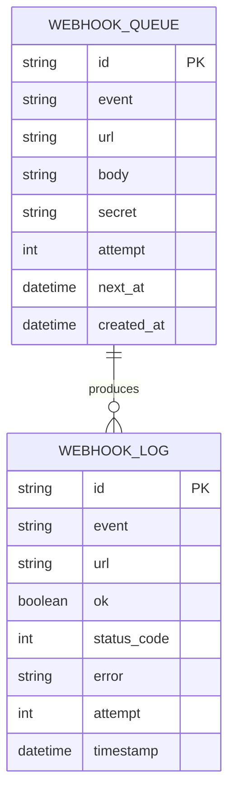
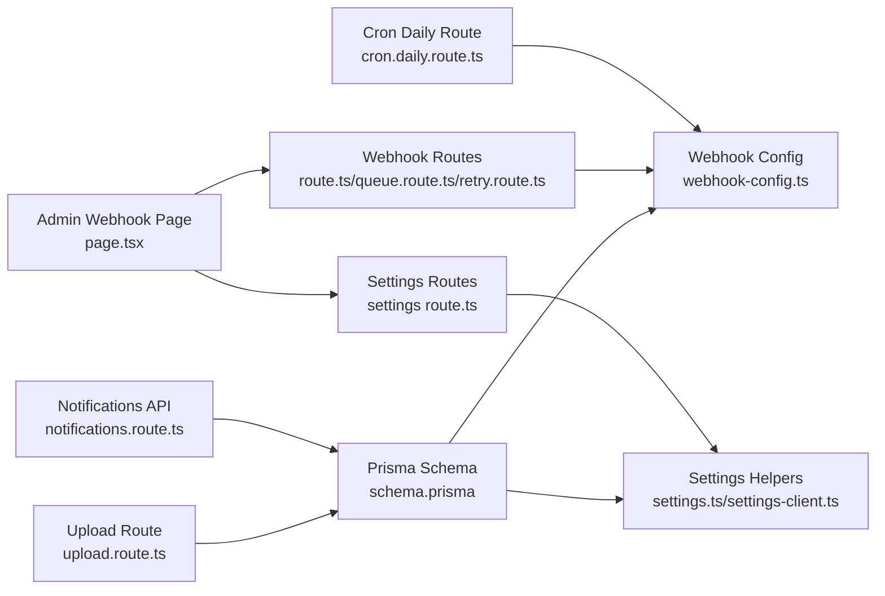

# System Management Entities

<cite>
**Referenced Files in This Document**
- [schema.prisma](file://prisma/schema.prisma)
- [settings.ts](file://src/lib/settings.ts)
- [settings-client.ts](file://src/lib/settings-client.ts)
- [webhook-config.ts](file://src/lib/webhook-config.ts)
- [route.ts](file://src/app/api/system/webhooks/route.ts)
- [page.tsx](file://src/app/admin/settings/webhooks/page.tsx)
- [queue.route.ts](file://src/app/api/system/webhooks/queue/route.ts)
- [retry.route.ts](file://src/app/api/system/webhooks/retry/route.ts)
- [upload.route.ts](file://src/app/api/upload/route.ts)
- [notifications.route.ts](file://src/app/api/notifications/)
- [cron.daily.route.ts](file://src/app/api/cron/daily/route.ts)
</cite>

## Table of Contents
1. [Introduction](#introduction)
2. [Project Structure](#project-structure)
3. [Core Components](#core-components)
4. [Architecture Overview](#architecture-overview)
5. [Detailed Component Analysis](#detailed-component-analysis)
6. [Dependency Analysis](#dependency-analysis)
7. [Performance Considerations](#performance-considerations)
8. [Troubleshooting Guide](#troubleshooting-guide)
9. [Conclusion](#conclusion)
10. [Appendices](#appendices)

## Introduction
This document describes the system management entities and related workflows for file handling, notifications, settings, and webhook integrations. It focuses on:
- File entity with multi-entity associations and storage metadata
- Notification entity with types, channels, scheduling, and delivery tracking
- Settings and Setting entities for system configuration and key-value parameter management
- JobSchedule entity for automated task scheduling
- WebhookQueue and WebhookLog entities for external system integrations

It also provides practical examples of file upload workflows, notification automation, system configuration management, and webhook integration patterns, along with the settings management interface and webhook configuration system.

## Project Structure
The system is defined via Prisma schema and supported by server-side APIs and a React admin page:
- Prisma models define entities and relationships
- API routes expose CRUD and operational endpoints for settings and webhooks
- Client-side hooks manage configuration and proposal types
- Admin UI provides a settings page for webhook configuration and monitoring

**Diagram sources**
- [schema.prisma:388-433](file://prisma/schema.prisma#L388-L433)
- [route.ts:5-26](file://src/app/api/system/webhooks/route.ts#L5-L26)
- [page.tsx:17-315](file://src/app/admin/settings/webhooks/page.tsx#L17-L315)
- [queue.route.ts:1-7](file://src/app/api/system/webhooks/queue/route.ts#L1-L7)
- [retry.route.ts:1-88](file://src/app/api/system/webhooks/retry/route.ts#L1-L88)
- [settings.ts:12-154](file://src/lib/settings.ts#L12-L154)
- [settings-client.ts:10-126](file://src/lib/settings-client.ts#L10-L126)

**Section sources**
- [schema.prisma:158-182](file://prisma/schema.prisma#L158-L182)
- [schema.prisma:358-370](file://prisma/schema.prisma#L358-L370)
- [schema.prisma:376-386](file://prisma/schema.prisma#L376-L386)
- [schema.prisma:409-433](file://prisma/schema.prisma#L409-L433)

## Core Components
This section documents the core entities and their responsibilities.

- File
  - Purpose: Store file metadata and associate with multiple entities (Customer, Subscription, Domain, Hosting, Task)
  - Key attributes: url, name, type, size, timestamps
  - Associations: Optional foreign keys to Customer, Subscription, Domain, Hosting, Task
  - Storage: Files are stored under the public uploads directory; URLs are persisted

- Notification
  - Purpose: Track scheduled notifications across channels (EMAIL, SMS)
  - Types: DOMAIN_RENEWAL, HOSTING_RENEWAL, SUBSCRIPTION_PAYMENT, MAINTENANCE_EXPIRY, ADMIN_REMINDER
  - Channels: EMAIL, SMS
  - Tracking: scheduledAt, sentAt, creation timestamp

- Settings and Setting
  - Settings: Global system configuration (e.g., registration open, max teams per stage, allowed age groups, available stages, notification email)
  - Setting: Key-value parameters with type and activation flag; used for dynamic configurations like proposal types

- JobSchedule
  - Purpose: Manage automated jobs (e.g., daily scan) with lastRun, nextRun, and enabled flag

- WebhookQueue and WebhookLog
  - WebhookQueue: Pending webhook events with URL, body, secret, attempt count, and next delivery time
  - WebhookLog: Delivery attempts with event, URL, status code, error, attempt, and timestamp

**Section sources**
- [schema.prisma:388-407](file://prisma/schema.prisma#L388-L407)
- [schema.prisma:358-370](file://prisma/schema.prisma#L358-L370)
- [schema.prisma:158-182](file://prisma/schema.prisma#L158-L182)
- [schema.prisma:376-386](file://prisma/schema.prisma#L376-L386)
- [schema.prisma:409-433](file://prisma/schema.prisma#L409-L433)

## Architecture Overview
The system integrates Prisma-managed entities with Next.js API routes and a React admin UI. Webhooks are configured via environment variables or runtime settings, queued for delivery, and logged for observability. Notifications are scheduled and tracked, while files are associated with business entities and stored externally.

**Diagram sources**
- [page.tsx:17-315](file://src/app/admin/settings/webhooks/page.tsx#L17-L315)
- [route.ts:5-26](file://src/app/api/system/webhooks/route.ts#L5-L26)
- [queue.route.ts:1-7](file://src/app/api/system/webhooks/queue/route.ts#L1-L7)
- [retry.route.ts:1-88](file://src/app/api/system/webhooks/retry/route.ts#L1-L88)
- [webhook-config.ts:8-107](file://src/lib/webhook-config.ts#L8-L107)
- [schema.prisma:409-433](file://prisma/schema.prisma#L409-L433)

## Detailed Component Analysis

### File Entity
The File entity stores metadata for uploaded assets and supports multi-entity associations. It enables flexible linking to Customer, Subscription, Domain, Hosting, and Task.

- Multi-entity associations: Each optional foreign key allows a file to belong to one or none of the related entities
- Storage management: The url field holds the public URL; files are stored under the public uploads directory
- Metadata: name, type, size capture basic file attributes

Example usage patterns:
- Upload a file and associate it with a Customer
- Link a file to a Task for evidence or attachments
- Reference a file in a Subscription for contract or invoice attachments

**Diagram sources**
- [schema.prisma:388-407](file://prisma/schema.prisma#L388-L407)

**Section sources**
- [schema.prisma:388-407](file://prisma/schema.prisma#L388-L407)

### Notification Entity
The Notification entity manages scheduled notifications across EMAIL and SMS channels. It tracks type, channel, message, scheduling, and delivery.

- Notification types: DOMAIN_RENEWAL, HOSTING_RENEWAL, SUBSCRIPTION_PAYMENT, MAINTENANCE_EXPIRY, ADMIN_REMINDER
- Channels: EMAIL, SMS
- Scheduling: scheduledAt determines when the notification should be sent
- Delivery tracking: sentAt captures successful delivery

Operational flow:
- Create a Notification with a type and channel
- Optionally schedule for future delivery
- On dispatch, set sentAt and persist delivery logs

**Diagram sources**
- [schema.prisma:358-370](file://prisma/schema.prisma#L358-L370)

**Section sources**
- [schema.prisma:345-370](file://prisma/schema.prisma#L345-L370)

### Settings and Setting Entities
The Settings entity holds global system configuration flags and preferences. The Setting entity stores key-value parameters with type and activation flags for dynamic configuration.

- Settings: Global flags and lists (e.g., allowedAgeGroups, availableStages)
- Setting: Dynamic key-value entries (e.g., proposal_types) with type and isActive
- Proposal types: Managed via dedicated helpers and API endpoints

Key capabilities:
- Retrieve and update proposal types dynamically
- Persist structured configuration as JSON values
- Provide defaults when no configuration exists

**Diagram sources**
- [schema.prisma:158-182](file://prisma/schema.prisma#L158-L182)

**Section sources**
- [schema.prisma:158-182](file://prisma/schema.prisma#L158-L182)
- [settings.ts:12-154](file://src/lib/settings.ts#L12-L154)
- [settings-client.ts:10-126](file://src/lib/settings-client.ts#L10-L126)

### JobSchedule Entity
JobSchedule controls automated tasks such as daily scans. It maintains timing and enablement state.

Typical usage:
- Initialize a daily scan job with nextRun set to midnight UTC
- Update lastRun after successful completion
- Toggle enabled to pause/resume

**Diagram sources**
- [schema.prisma:376-386](file://prisma/schema.prisma#L376-L386)

**Section sources**
- [schema.prisma:376-386](file://prisma/schema.prisma#L376-L386)

### WebhookQueue and WebhookLog Entities
WebhookQueue handles pending deliveries with exponential backoff and retry scheduling. WebhookLog records outcomes for observability.

Operational behavior:
- Enqueue events with initial delay
- Retry with increasing delays (30s, 5min, 30min) up to 3 attempts
- Append logs for each attempt
- UI supports manual retries and batch retry actions

**Diagram sources**
- [schema.prisma:409-433](file://prisma/schema.prisma#L409-L433)

**Section sources**
- [schema.prisma:409-433](file://prisma/schema.prisma#L409-L433)
- [webhook-config.ts:51-107](file://src/lib/webhook-config.ts#L51-L107)

## Dependency Analysis
The following diagram maps key dependencies among entities and modules:

**Diagram sources**
- [schema.prisma:388-433](file://prisma/schema.prisma#L388-L433)
- [webhook-config.ts:8-107](file://src/lib/webhook-config.ts#L8-L107)
- [route.ts:5-26](file://src/app/api/system/webhooks/route.ts#L5-L26)
- [queue.route.ts:1-7](file://src/app/api/system/webhooks/queue/route.ts#L1-L7)
- [retry.route.ts:1-88](file://src/app/api/system/webhooks/retry/route.ts#L1-L88)
- [page.tsx:17-315](file://src/app/admin/settings/webhooks/page.tsx#L17-L315)
- [settings.ts:12-154](file://src/lib/settings.ts#L12-L154)
- [settings-client.ts:10-126](file://src/lib/settings-client.ts#L10-L126)

**Section sources**
- [schema.prisma:388-433](file://prisma/schema.prisma#L388-L433)
- [webhook-config.ts:8-107](file://src/lib/webhook-config.ts#L8-L107)
- [route.ts:5-26](file://src/app/api/system/webhooks/route.ts#L5-L26)
- [page.tsx:17-315](file://src/app/admin/settings/webhooks/page.tsx#L17-L315)

## Performance Considerations
- Webhook retries: Exponential backoff reduces load spikes during failures; limit concurrent processing to avoid overwhelming external systems
- Queue scanning: Polling interval balances responsiveness and resource usage; adjust based on expected throughput
- Logs pagination: Admin UI limits displayed logs to reduce rendering overhead
- File associations: Use selective queries to avoid N+1 when fetching files linked to multiple entities
- Notification scheduling: Batch-send notifications to minimize repeated database writes

## Troubleshooting Guide
Common issues and resolutions:
- Webhook delivery failures
  - Check WebhookLog entries for error messages and status codes
  - Use the admin UI to trigger retry for individual or selected failed entries
  - Verify webhook secret configuration and signature header presence
- Configuration not applied
  - Confirm environment variables for webhook URLs and secret are set
  - Use the admin UI to save and confirm configuration updates
- Proposal types not loading
  - Ensure the proposal_types key exists in Setting; otherwise defaults are returned
  - Validate JSON structure and uniqueness of type names

**Section sources**
- [page.tsx:85-156](file://src/app/admin/settings/webhooks/page.tsx#L85-L156)
- [webhook-config.ts:22-49](file://src/lib/webhook-config.ts#L22-L49)
- [settings.ts:35-64](file://src/lib/settings.ts#L35-L64)

## Conclusion
The system provides robust support for file management, notification scheduling, dynamic settings, automated job scheduling, and reliable webhook integrations. The modular design separates concerns between persistence, API orchestration, and UI, enabling maintainable and extensible operations.

## Appendices

### Examples and Workflows

- File upload workflow
  - Upload endpoint receives multipart/form-data and returns a URL
  - Persist a File record with url and optional entity associations
  - Reference the file in related entities (Customer, Subscription, Domain, Hosting, Task)

  Example references:
  - [upload.route.ts](file://src/app/api/upload/route.ts)

- Notification automation
  - Define Notification with type and channel
  - Schedule for future delivery using scheduledAt
  - Dispatch and record sentAt; track delivery via logs

  Example references:
  - [schema.prisma:358-370](file://prisma/schema.prisma#L358-L370)
  - [notifications.route.ts](file://src/app/api/notifications/)

- System configuration management
  - Retrieve and update Settings globally
  - Manage dynamic key-value parameters (e.g., proposal_types)
  - Use client-side helpers for UI-driven updates

  Example references:
  - [schema.prisma:158-182](file://prisma/schema.prisma#L158-L182)
  - [settings.ts:12-154](file://src/lib/settings.ts#L12-L154)
  - [settings-client.ts:10-126](file://src/lib/settings-client.ts#L10-L126)

- Webhook integration patterns
  - Configure webhook URLs and optional secret
  - Trigger retry for failed events or selected entries
  - Monitor queue statistics and recent logs in the admin UI

  Example references:
  - [route.ts:5-26](file://src/app/api/system/webhooks/route.ts#L5-L26)
  - [page.tsx:17-315](file://src/app/admin/settings/webhooks/page.tsx#L17-L315)
  - [retry.route.ts:55-88](file://src/app/api/system/webhooks/retry/route.ts#L55-L88)
  - [queue.route.ts:1-7](file://src/app/api/system/webhooks/queue/route.ts#L1-L7)