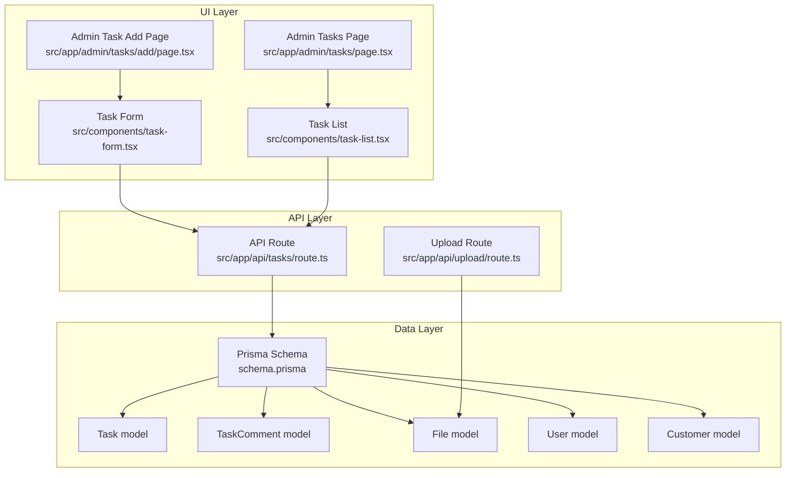
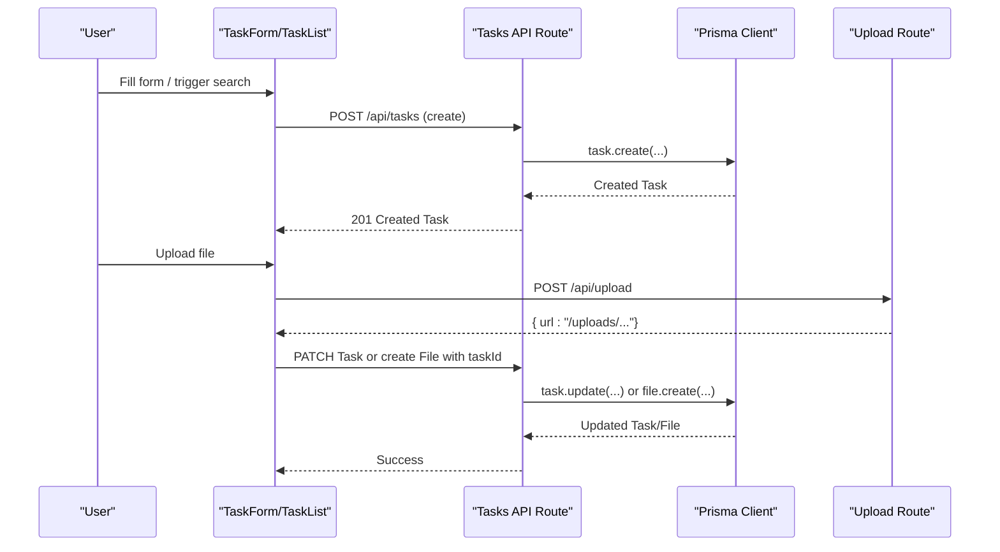
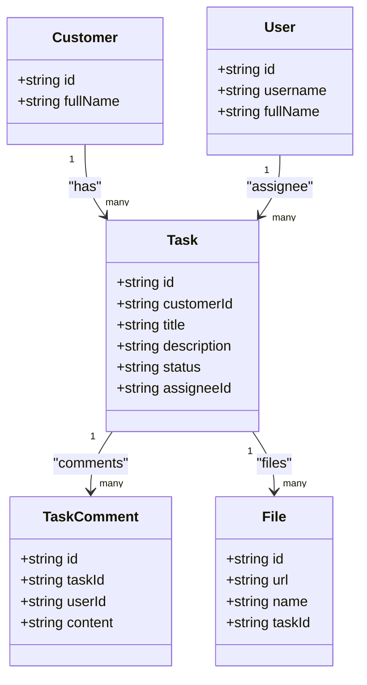
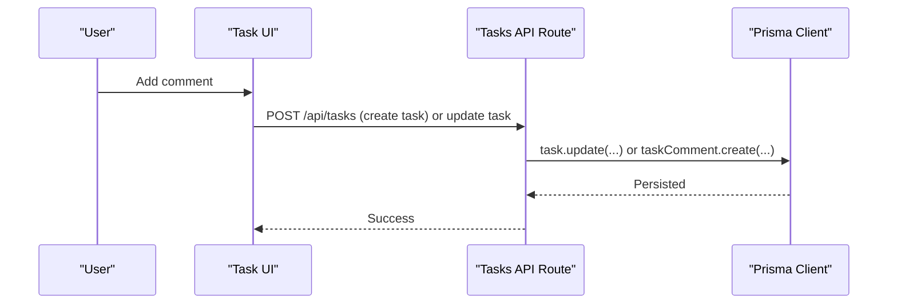
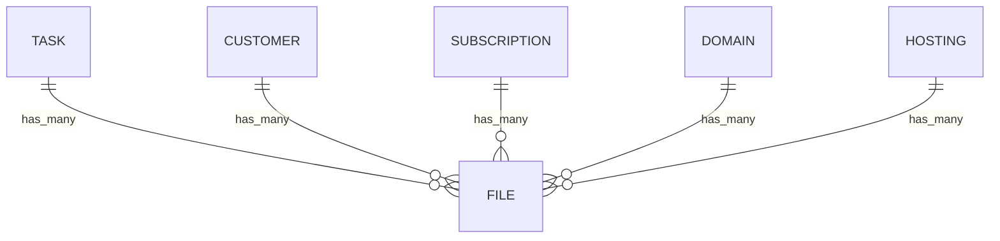
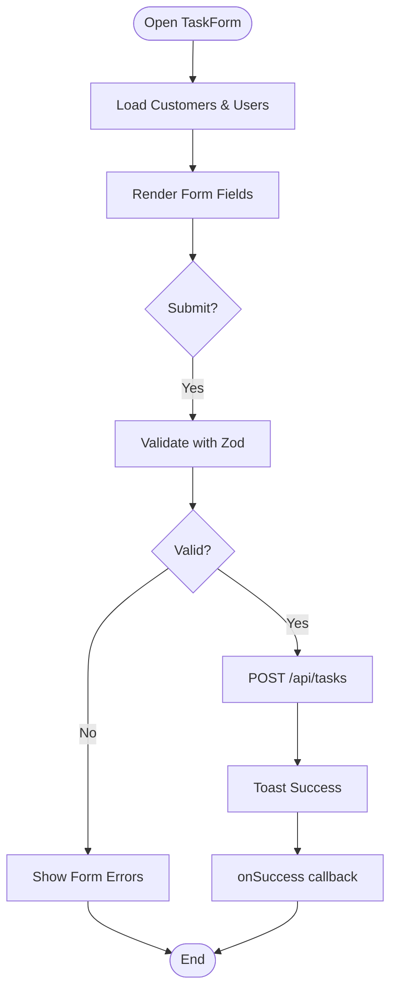
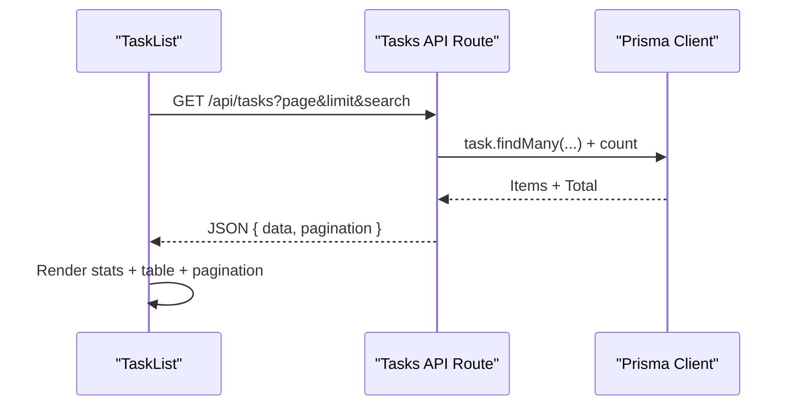
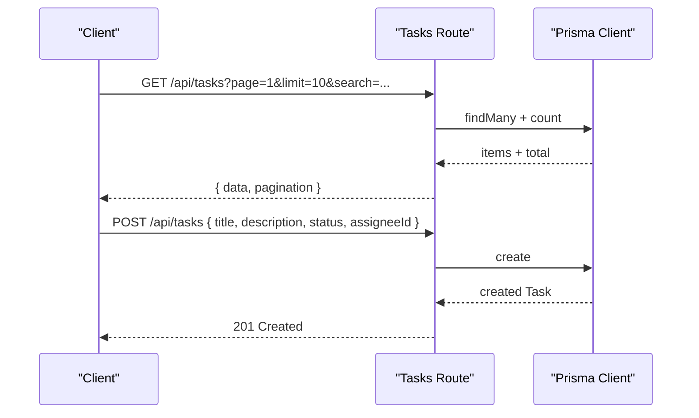
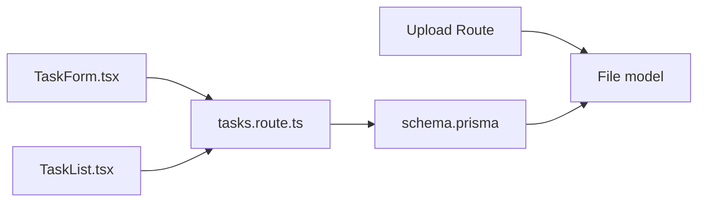

# Task and Collaboration Entities

<cite>
**Referenced Files in This Document**
- [schema.prisma](file://prisma/schema.prisma)
- [task-form.tsx](file://src/components/task-form.tsx)
- [task-list.tsx](file://src/components/task-list.tsx)
- [AdminTasksPage.tsx](file://src/app/admin/tasks/page.tsx)
- [AdminTaskAddPage.tsx](file://src/app/admin/tasks/add/page.tsx)
- [tasks.route.ts](file://src/app/api/tasks/route.ts)
- [validations.ts](file://src/lib/validations.ts)
- [upload.route.ts](file://src/app/api/upload/route.ts)
</cite>

## Table of Contents
1. [Introduction](#introduction)
2. [Project Structure](#project-structure)
3. [Core Components](#core-components)
4. [Architecture Overview](#architecture-overview)
5. [Detailed Component Analysis](#detailed-component-analysis)
6. [Dependency Analysis](#dependency-analysis)
7. [Performance Considerations](#performance-considerations)
8. [Troubleshooting Guide](#troubleshooting-guide)
9. [Conclusion](#conclusion)

## Introduction
This document describes the Task and TaskComment entities and their supporting infrastructure for collaborative work management. It covers:
- Task entity lifecycle and status management (OPEN, PENDING, DONE)
- Assignment tracking to users and relationship to customers
- TaskComment entity for team collaboration
- Multi-entity file associations enabling tasks to have multiple attachments
- Examples of task assignment workflows, progress tracking, collaboration patterns, and lifecycle management
- UI components for task forms and lists, and user interactions

## Project Structure
The Task and collaboration features span the Prisma schema, API routes, UI components, and validation utilities. The following diagram maps the primary building blocks.

**Diagram sources**
- [schema.prisma:258-291](file://prisma/schema.prisma#L258-L291)
- [tasks.route.ts:1-64](file://src/app/api/tasks/route.ts#L1-L64)
- [upload.route.ts:1-65](file://src/app/api/upload/route.ts#L1-L65)
- [AdminTasksPage.tsx:1-32](file://src/app/admin/tasks/page.tsx#L1-L32)
- [AdminTaskAddPage.tsx:1-25](file://src/app/admin/tasks/add/page.tsx#L1-L25)
- [task-form.tsx:1-250](file://src/components/task-form.tsx#L1-L250)
- [task-list.tsx:1-294](file://src/components/task-list.tsx#L1-L294)

**Section sources**
- [schema.prisma:258-291](file://prisma/schema.prisma#L258-L291)
- [tasks.route.ts:1-64](file://src/app/api/tasks/route.ts#L1-L64)
- [AdminTasksPage.tsx:1-32](file://src/app/admin/tasks/page.tsx#L1-L32)
- [AdminTaskAddPage.tsx:1-25](file://src/app/admin/tasks/add/page.tsx#L1-L25)
- [task-form.tsx:1-250](file://src/components/task-form.tsx#L1-L250)
- [task-list.tsx:1-294](file://src/components/task-list.tsx#L1-L294)

## Core Components
- Task entity
  - Fields: id, customerId (Customer), title, description, status (OPEN/PENDING/DONE), assigneeId (User?), createdAt, updatedAt
  - Relationships: belongs to Customer, optional belongs to User (assignee), has many TaskComment, has many File
- TaskComment entity
  - Fields: id, taskId (Task), userId (User), content, createdAt
  - Relationships: belongs to Task, belongs to User
- File entity
  - Fields: id, url, name, type, size, optional customerId/subscriptionId/domainId/hostingId/taskId
  - Supports multi-entity associations via optional foreign keys

Key behaviors:
- Status transitions: OPEN → PENDING → DONE (and potentially back to OPEN depending on workflow)
- Assignment: optional assigneeId links a Task to a User
- Collaboration: TaskComment entries record team discussions per task
- Attachments: File records can be associated to tasks (and other entities)

**Section sources**
- [schema.prisma:258-291](file://prisma/schema.prisma#L258-L291)
- [schema.prisma:388-407](file://prisma/schema.prisma#L388-L407)

## Architecture Overview
The system follows a layered architecture:
- UI components (Next.js client components) collect user input and render lists
- API routes (Next.js App Router handlers) validate and persist data via Prisma
- Prisma schema defines models and relationships
- File uploads are handled separately and linked to entities via File records

**Diagram sources**
- [tasks.route.ts:45-64](file://src/app/api/tasks/route.ts#L45-L64)
- [upload.route.ts:6-65](file://src/app/api/upload/route.ts#L6-L65)
- [task-form.tsx:65-85](file://src/components/task-form.tsx#L65-L85)

## Detailed Component Analysis

### Task Entity
- Purpose: Track work items for customers, support assignment and status tracking
- Status management: OPEN, PENDING, DONE
- Assignment: optional assigneeId to a User
- Relationships: belongs to Customer, has many TaskComment, has many File

**Diagram sources**
- [schema.prisma:258-291](file://prisma/schema.prisma#L258-L291)
- [schema.prisma:388-407](file://prisma/schema.prisma#L388-L407)

**Section sources**
- [schema.prisma:258-291](file://prisma/schema.prisma#L258-L291)

### TaskComment Entity
- Purpose: Enable team collaboration by associating comments to tasks and users
- Fields: content (comment text), timestamps, and foreign keys to Task and User
- Typical usage: threaded discussions per task, audit trail of decisions

**Diagram sources**
- [schema.prisma:281-291](file://prisma/schema.prisma#L281-L291)
- [tasks.route.ts:45-64](file://src/app/api/tasks/route.ts#L45-L64)

**Section sources**
- [schema.prisma:281-291](file://prisma/schema.prisma#L281-L291)

### File Associations (Multi-entity)
- File supports optional foreign keys to multiple entities (Customer, Subscription, Domain, Hosting, Task)
- Tasks can have multiple attachments via File records

**Diagram sources**
- [schema.prisma:388-407](file://prisma/schema.prisma#L388-L407)

**Section sources**
- [schema.prisma:388-407](file://prisma/schema.prisma#L388-L407)

### Task Form Components
- TaskForm collects title, description, status, and optional assignee
- Loads customers and users for selection
- Submits to API route or custom onSubmit handler
- Validation via Zod schemas

**Diagram sources**
- [task-form.tsx:27-85](file://src/components/task-form.tsx#L27-L85)
- [validations.ts:158-165](file://src/lib/validations.ts#L158-L165)

**Section sources**
- [task-form.tsx:1-250](file://src/components/task-form.tsx#L1-L250)
- [validations.ts:158-165](file://src/lib/validations.ts#L158-L165)

### Task List Display Patterns
- TaskList fetches paginated tasks, supports search and status filtering
- Renders statistics cards and a data table with status badges and assignee indicators
- Provides navigation to create new tasks

**Diagram sources**
- [task-list.tsx:35-69](file://src/components/task-list.tsx#L35-L69)
- [tasks.route.ts:7-43](file://src/app/api/tasks/route.ts#L7-L43)

**Section sources**
- [task-list.tsx:1-294](file://src/components/task-list.tsx#L1-L294)
- [tasks.route.ts:1-64](file://src/app/api/tasks/route.ts#L1-L64)

### API Workflows
- GET /api/tasks: server-side pagination, search, and filtering
- POST /api/tasks: creates a Task with validated and sanitized fields

**Diagram sources**
- [tasks.route.ts:7-64](file://src/app/api/tasks/route.ts#L7-L64)

**Section sources**
- [tasks.route.ts:1-64](file://src/app/api/tasks/route.ts#L1-L64)

### Example Workflows and Patterns

- Task assignment workflow
  - Create task with status OPEN and optional assignee
  - Assignee receives visibility; team members collaborate via TaskComment
  - Progress tracking: change status to PENDING when work begins; DONE when complete

- Progress tracking pattern
  - OPEN: newly created
  - PENDING: actively worked on
  - DONE: reviewed/completed

- Team collaboration pattern
  - Users add TaskComment entries; each entry associates to a User and Task
  - Comments capture decisions, updates, and handoffs

- Task lifecycle management
  - Creation: AdminTaskAddPage → TaskForm → POST /api/tasks
  - Listing: AdminTasksPage → TaskList → GET /api/tasks
  - Updates: modify status/assignee via form; optionally attach files

- Attachment workflow
  - Upload file via upload route
  - Link uploaded URL to a Task by creating a File record with taskId

**Section sources**
- [AdminTaskAddPage.tsx:1-25](file://src/app/admin/tasks/add/page.tsx#L1-L25)
- [AdminTasksPage.tsx:1-32](file://src/app/admin/tasks/page.tsx#L1-L32)
- [task-form.tsx:65-85](file://src/components/task-form.tsx#L65-L85)
- [tasks.route.ts:45-64](file://src/app/api/tasks/route.ts#L45-L64)
- [upload.route.ts:6-65](file://src/app/api/upload/route.ts#L6-L65)

## Dependency Analysis
- UI depends on:
  - TaskForm and TaskList for rendering and interactions
  - API routes for persistence
- API depends on:
  - Prisma client for database operations
  - Zod schemas for validation
- Prisma schema defines:
  - Task → Customer (belongsTo)
  - Task → User (assignee, optional)
  - Task → TaskComment (hasMany)
  - Task → File (hasMany)
  - File → Task (optional)

**Diagram sources**
- [task-form.tsx:1-250](file://src/components/task-form.tsx#L1-L250)
- [task-list.tsx:1-294](file://src/components/task-list.tsx#L1-L294)
- [tasks.route.ts:1-64](file://src/app/api/tasks/route.ts#L1-L64)
- [schema.prisma:258-291](file://prisma/schema.prisma#L258-L291)
- [schema.prisma:388-407](file://prisma/schema.prisma#L388-L407)

**Section sources**
- [task-form.tsx:1-250](file://src/components/task-form.tsx#L1-L250)
- [task-list.tsx:1-294](file://src/components/task-list.tsx#L1-L294)
- [tasks.route.ts:1-64](file://src/app/api/tasks/route.ts#L1-L64)
- [schema.prisma:258-291](file://prisma/schema.prisma#L258-L291)
- [schema.prisma:388-407](file://prisma/schema.prisma#L388-L407)

## Performance Considerations
- Pagination: API enforces a maximum page size and orders by creation date
- Filtering: server-side search and customer filters reduce payload sizes
- Rendering: client-side skeleton loaders improve perceived performance in TaskList
- File uploads: keep file size limits reasonable; consider CDN for production

## Troubleshooting Guide
- Validation errors
  - Task creation requires non-empty title and description within length bounds; status must be one of OPEN, PENDING, DONE
- API failures
  - Ensure sanitized inputs and correct content type for requests
- Upload issues
  - Verify allowed types and size limits; confirm public/uploads directory availability

**Section sources**
- [validations.ts:158-165](file://src/lib/validations.ts#L158-L165)
- [tasks.route.ts:45-64](file://src/app/api/tasks/route.ts#L45-L64)
- [upload.route.ts:18-34](file://src/app/api/upload/route.ts#L18-L34)

## Conclusion
The Task and TaskComment entities provide a solid foundation for collaborative work management:
- Clear status lifecycle and optional assignment enable straightforward workflows
- TaskComment supports team collaboration with user attribution
- File associations allow flexible multi-entity attachments
- UI components and API routes integrate seamlessly with Prisma models